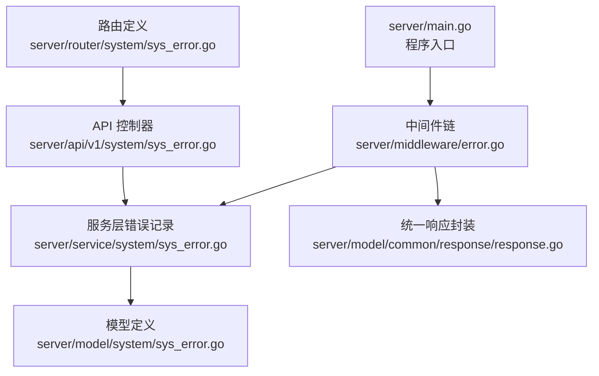
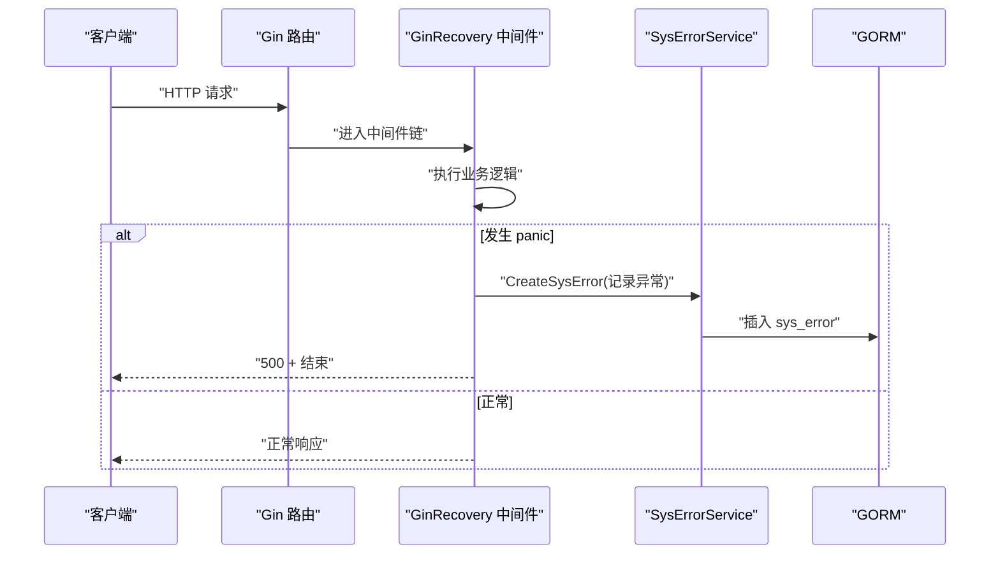
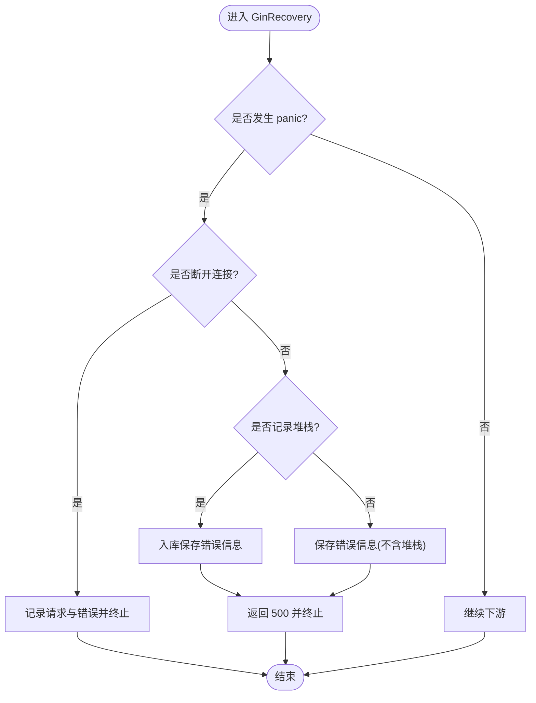
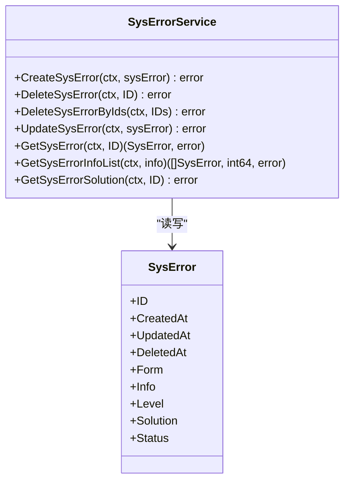
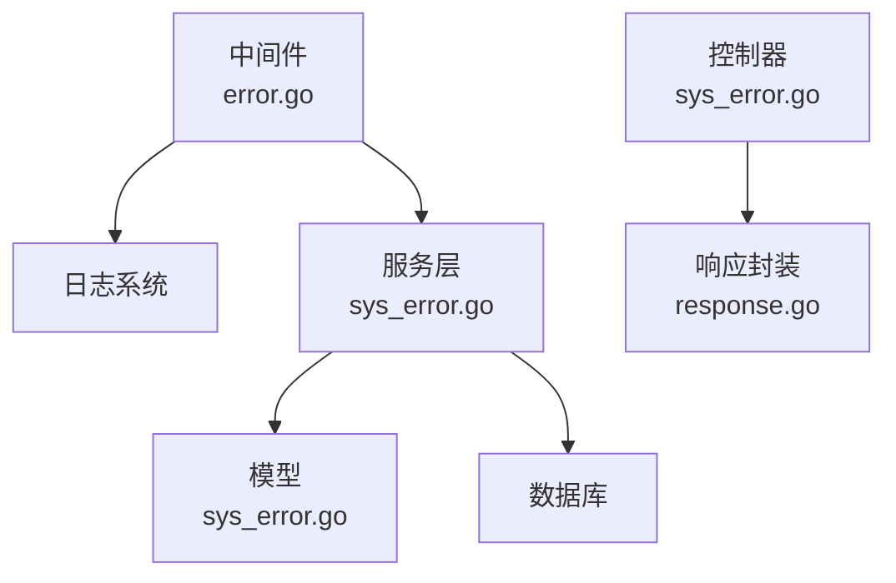
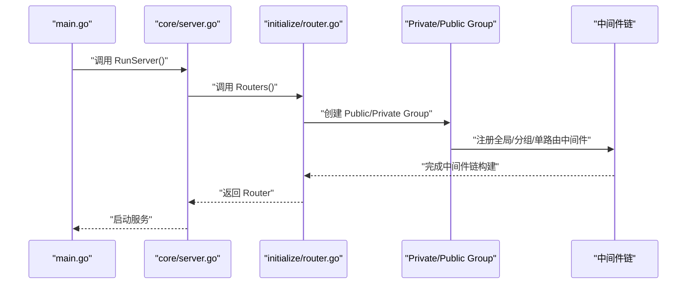

# 错误处理中间件

<cite>
**本文引用的文件**
- [server/middleware/error.go](file://server/middleware/error.go)
- [server/service/system/sys_error.go](file://server/service/system/sys_error.go)
- [server/model/system/sys_error.go](file://server/model/system/sys_error.go)
- [server/model/common/response/response.go](file://server/model/common/response/response.go)
- [server/router/system/sys_error.go](file://server/router/system/sys_error.go)
- [server/api/v1/system/sys_error.go](file://server/api/v1/system/sys_error.go)
- [server/config/system.go](file://server/config/system.go)
- [server/config/zap.go](file://server/config/zap.go)
- [server/main.go](file://server/main.go)
- [repowiki/zh/content/系统架构/设计模式应用/中间件链模式.md](file://repowiki/zh/content/系统架构/设计模式应用/中间件链模式.md)
- [repowiki/zh/content/故障排除.md](file://repowiki/zh/content/故障排除.md)
</cite>

## 目录
1. [简介](#简介)
2. [项目结构](#项目结构)
3. [核心组件](#核心组件)
4. [架构总览](#架构总览)
5. [详细组件分析](#详细组件分析)
6. [依赖关系分析](#依赖关系分析)
7. [性能考量](#性能考量)
8. [故障排查指南](#故障排查指南)
9. [结论](#结论)
10. [附录](#附录)

## 简介
本技术文档聚焦于 Gin-Vue-Admin 项目的全局错误处理中间件，系统阐述其如何实现全局 panic 恢复、错误分类与统一响应格式，以及在开发与生产环境下的差异化策略。文档还说明了中间件如何将业务错误转换为标准 HTTP 响应，包括状态码映射、错误消息格式化与调试信息处理，并提供优雅降级与故障隔离的实践建议。

## 项目结构
错误处理中间件位于后端 server 层，与日志、路由、服务与模型共同构成完整的错误处理闭环。下图展示了错误处理相关的关键文件与职责分工：

图表来源
- [server/main.go:30-52](file://server/main.go#L30-L52)
- [server/middleware/error.go:20-81](file://server/middleware/error.go#L20-L81)
- [server/service/system/sys_error.go:12-127](file://server/service/system/sys_error.go#L12-L127)
- [server/model/system/sys_error.go:8-22](file://server/model/system/sys_error.go#L8-L22)
- [server/model/common/response/response.go:20-62](file://server/model/common/response/response.go#L20-L62)
- [server/router/system/sys_error.go:10-29](file://server/router/system/sys_error.go#L10-L29)
- [server/api/v1/system/sys_error.go:152-199](file://server/api/v1/system/sys_error.go#L152-L199)

章节来源
- [server/main.go:30-52](file://server/main.go#L30-L52)
- [repowiki/zh/content/系统架构/设计模式应用/中间件链模式.md:35-543](file://repowiki/zh/content/系统架构/设计模式应用/中间件链模式.md#L35-L543)

## 核心组件
- 全局错误恢复中间件：捕获 panic，区分“断开连接”与一般异常，记录请求与堆栈，必要时持久化到错误日志表，最后返回统一的内部错误状态码。
- 错误记录服务：提供创建、查询、分页与异步生成解决方案的能力，支持状态流转与 AI 方案生成。
- 统一响应封装：提供标准的 JSON 响应结构与常用便捷方法，保证前后端交互一致性。
- 错误日志模型：定义错误来源、内容、级别、解决方案与处理状态等字段，支撑错误追踪与治理。

章节来源
- [server/middleware/error.go:20-81](file://server/middleware/error.go#L20-L81)
- [server/service/system/sys_error.go:12-127](file://server/service/system/sys_error.go#L12-L127)
- [server/model/common/response/response.go:20-62](file://server/model/common/response/response.go#L20-L62)
- [server/model/system/sys_error.go:8-22](file://server/model/system/sys_error.go#L8-L22)

## 架构总览
下图展示了从请求进入中间件链到错误恢复与日志记录的整体流程，以及与服务层的交互：

图表来源
- [server/middleware/error.go:20-81](file://server/middleware/error.go#L20-L81)
- [server/service/system/sys_error.go:12-127](file://server/service/system/sys_error.go#L12-L127)
- [server/model/system/sys_error.go:8-22](file://server/model/system/sys_error.go#L8-L22)

## 详细组件分析

### 全局错误恢复中间件（GinRecovery）
- 职责与行为
  - 捕获 panic，区分“断开连接”与一般异常，避免向已断开连接写入状态。
  - 可选择是否记录堆栈；在需要时持久化到错误日志表。
  - 返回统一的内部错误状态码，确保前端收到一致的错误响应。
- 关键实现要点
  - 使用 defer + recover 捕获 panic。
  - 识别网络断开类错误，避免重复写入响应。
  - 可配置是否记录堆栈，平衡性能与可诊断性。
  - 将请求信息与错误详情写入日志，并调用服务层持久化。
- 执行流程（含断开连接分支）

图表来源
- [server/middleware/error.go:21-79](file://server/middleware/error.go#L21-L79)

章节来源
- [server/middleware/error.go:20-81](file://server/middleware/error.go#L20-L81)
- [repowiki/zh/content/系统架构/设计模式应用/中间件链模式.md:259-298](file://repowiki/zh/content/系统架构/设计模式应用/中间件链模式.md#L259-L298)

### 错误记录服务（SysErrorService）
- 职责与能力
  - 创建、删除、批量删除、更新、查询与分页获取错误日志。
  - 提供异步生成解决方案的任务，更新状态与方案字段。
- 关键实现要点
  - 支持按来源、内容关键词、时间范围等条件筛选。
  - 异步协程生成方案，即使失败也标记完成，避免任务卡住。
- 与模型的关系

图表来源
- [server/service/system/sys_error.go:12-127](file://server/service/system/sys_error.go#L12-L127)
- [server/model/system/sys_error.go:8-22](file://server/model/system/sys_error.go#L8-L22)

章节来源
- [server/service/system/sys_error.go:12-127](file://server/service/system/sys_error.go#L12-L127)
- [server/model/system/sys_error.go:8-22](file://server/model/system/sys_error.go#L8-L22)

### 统一响应封装（Response）
- 职责与能力
  - 提供统一的 JSON 响应结构，包含状态码、数据与消息。
  - 提供常用便捷方法，如成功/失败、带数据/带消息等。
- 关键实现要点
  - 状态码常量定义，便于前后端约定。
  - 响应结构固定，保证一致性与可解析性。

章节来源
- [server/model/common/response/response.go:20-62](file://server/model/common/response/response.go#L20-L62)

### 错误日志 API 与路由
- 路由与控制器
  - 提供错误日志的增删改查与异步处理接口。
  - 支持无认证与带认证的路由组，满足不同场景。
- 关键实现要点
  - 参数校验与错误消息格式化，保持与统一响应一致。
  - 异步处理触发后返回提交成功的提示。

章节来源
- [server/router/system/sys_error.go:10-29](file://server/router/system/sys_error.go#L10-L29)
- [server/api/v1/system/sys_error.go:152-199](file://server/api/v1/system/sys_error.go#L152-L199)

## 依赖关系分析
- 中间件依赖
  - 依赖日志系统记录错误与请求信息。
  - 依赖服务层进行错误持久化。
- 服务层依赖
  - 依赖数据库连接进行错误记录的 CRUD。
- 模型依赖
  - 错误日志模型定义字段与表名，支撑服务层操作。
- 响应封装依赖
  - 控制器层统一使用响应封装，保证对外输出一致。

图表来源
- [server/middleware/error.go:20-81](file://server/middleware/error.go#L20-L81)
- [server/service/system/sys_error.go:12-127](file://server/service/system/sys_error.go#L12-L127)
- [server/model/system/sys_error.go:8-22](file://server/model/system/sys_error.go#L8-L22)
- [server/model/common/response/response.go:20-62](file://server/model/common/response/response.go#L20-L62)
- [server/api/v1/system/sys_error.go:152-199](file://server/api/v1/system/sys_error.go#L152-L199)

章节来源
- [server/middleware/error.go:20-81](file://server/middleware/error.go#L20-L81)
- [server/service/system/sys_error.go:12-127](file://server/service/system/sys_error.go#L12-L127)
- [server/model/system/sys_error.go:8-22](file://server/model/system/sys_error.go#L8-L22)
- [server/model/common/response/response.go:20-62](file://server/model/common/response/response.go#L20-L62)
- [server/api/v1/system/sys_error.go:152-199](file://server/api/v1/system/sys_error.go#L152-L199)

## 性能考量
- 堆栈记录的权衡
  - 开发环境建议开启堆栈记录，便于快速定位问题。
  - 生产环境按需开启以平衡性能与可观测性。
- 日志级别与保留策略
  - 通过配置项控制日志级别与保留天数，减少磁盘占用与 IO 压力。
- 数据库写入的异步化
  - 错误记录采用同步写入，异步生成解决方案，避免阻塞请求路径。

章节来源
- [repowiki/zh/content/故障排除.md:272-307](file://repowiki/zh/content/故障排除.md#L272-L307)
- [server/config/zap.go:8-72](file://server/config/zap.go#L8-L72)

## 故障排查指南
- 常见问题与处理
  - panic 发生：确认中间件是否正确捕获并记录；检查堆栈是否开启；核对错误日志表是否存在。
  - 断开连接：中间件会识别并避免向已断开连接写入状态，直接终止。
  - 异步处理：确认服务层异步任务是否正常执行，状态与方案字段是否更新。
- 开发与生产环境差异
  - 开发环境：开启堆栈记录与详细日志；使用自动迁移简化本地调试。
  - 生产环境：关闭自动迁移；限制日志级别；启用错误恢复中间件并定期清理错误日志表。

章节来源
- [repowiki/zh/content/故障排除.md:272-496](file://repowiki/zh/content/故障排除.md#L272-L496)
- [server/config/system.go:14](file://server/config/system.go#L14)
- [server/config/zap.go:8-72](file://server/config/zap.go#L8-L72)

## 结论
本项目通过全局错误恢复中间件与统一响应封装，实现了对 panic 的可靠捕获与标准化输出；结合服务层的错误记录与异步处理能力，形成了从错误发现到问题解决的闭环。开发与生产环境的差异化配置策略进一步提升了系统的稳定性与可维护性。建议在生产环境中按需开启堆栈记录，定期清理错误日志表，并持续优化日志与数据库的性能配置。

## 附录
- 中间件注册与调用流程
  - 全局中间件：在构建引擎时注册，作用于所有路由。
  - 分组中间件：在私有路由组上注册 JWT 与 RBAC，确保接口安全性。
  - 单路由中间件：在特定路由组上挂载操作审计等，实现精细化控制。

图表来源
- [repowiki/zh/content/系统架构/设计模式应用/中间件链模式.md:524-543](file://repowiki/zh/content/系统架构/设计模式应用/中间件链模式.md#L524-L543)