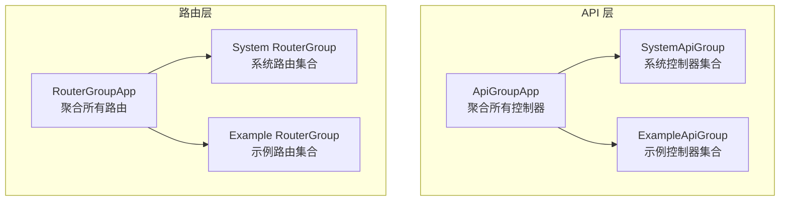
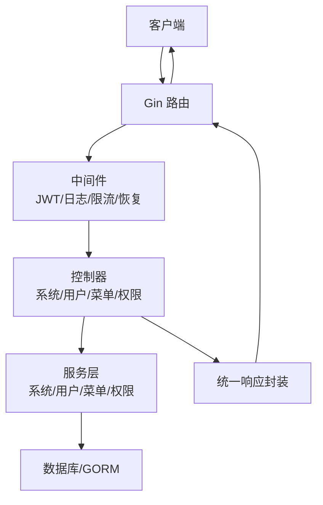
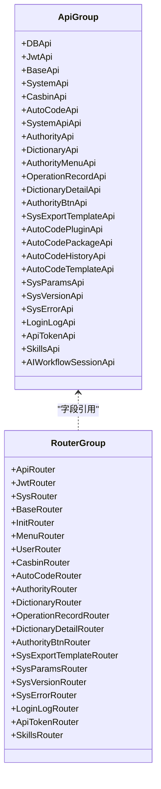
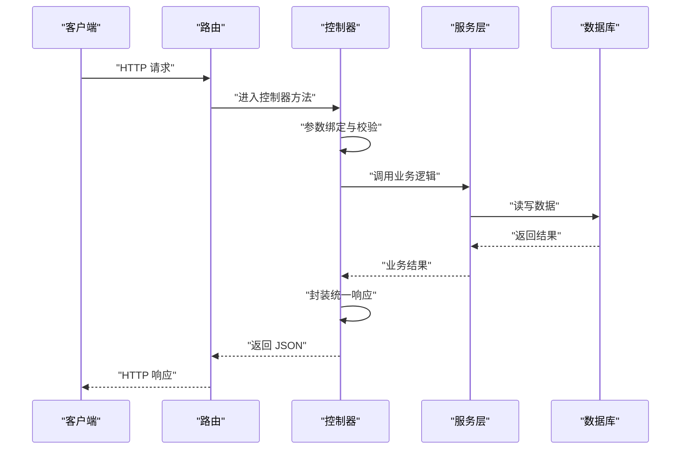
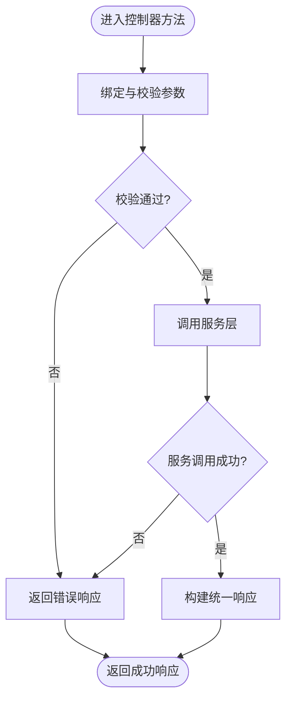
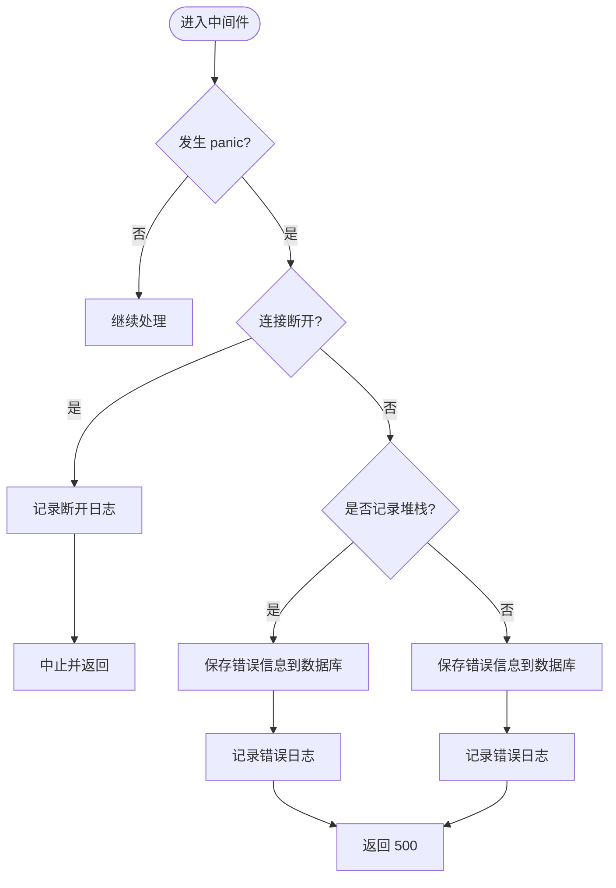
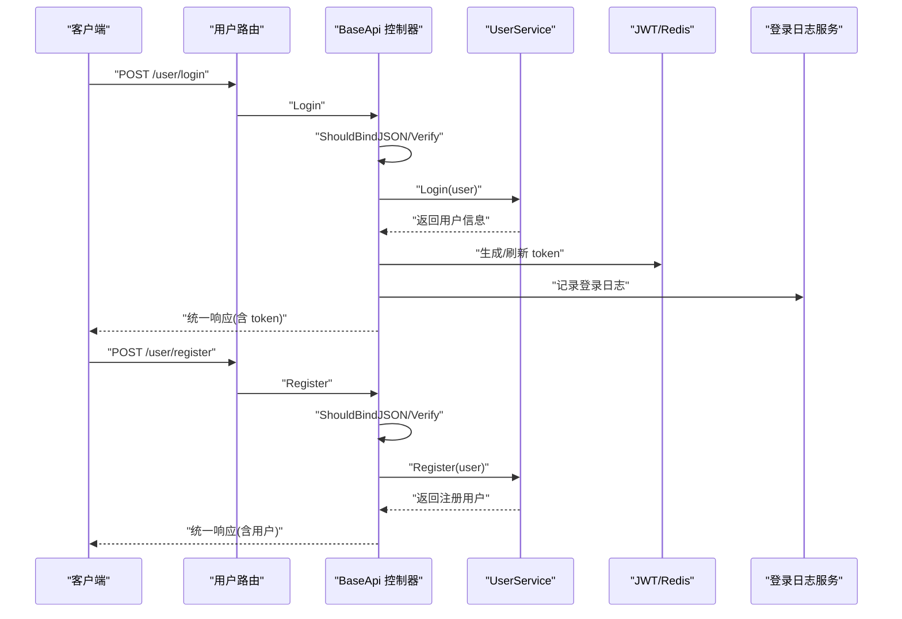
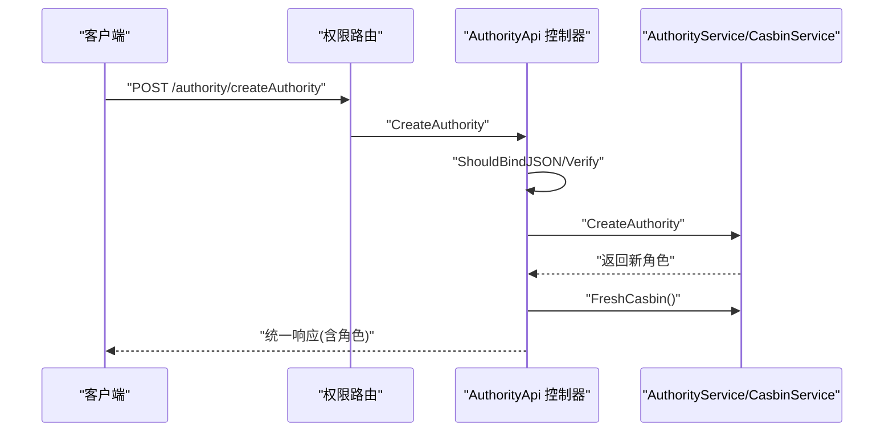
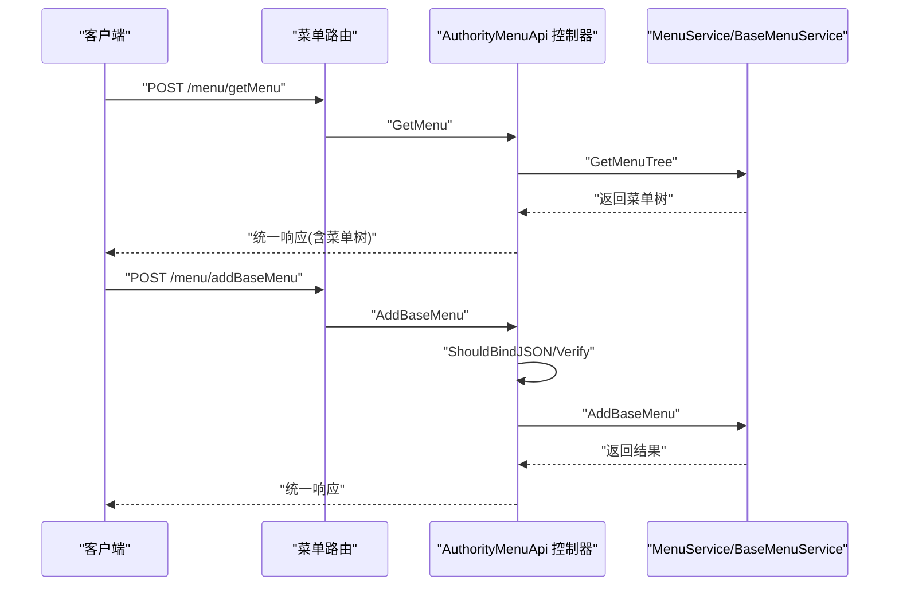
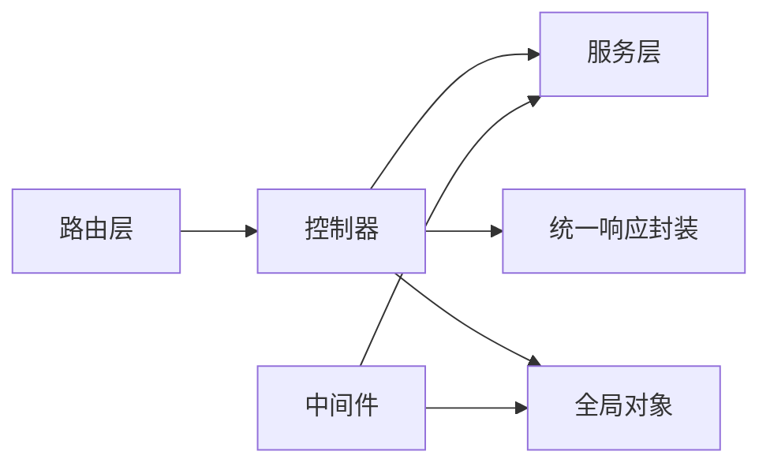

# 控制器架构

<cite>
**本文引用的文件**   
- [server/api/v1/enter.go](file://server/api/v1/enter.go)
- [server/router/enter.go](file://server/router/enter.go)
- [server/model/common/response/response.go](file://server/model/common/response/response.go)
- [server/middleware/error.go](file://server/middleware/error.go)
- [server/global/global.go](file://server/global/global.go)
- [server/api/v1/system/sys_user.go](file://server/api/v1/system/sys_user.go)
- [server/api/v1/system/sys_menu.go](file://server/api/v1/system/sys_menu.go)
- [server/api/v1/system/sys_authority.go](file://server/api/v1/system/sys_authority.go)
- [server/router/system/sys_user.go](file://server/router/system/sys_user.go)
- [server/router/system/sys_menu.go](file://server/router/system/sys_menu.go)
- [server/api/v1/system/enter.go](file://server/api/v1/system/enter.go)
- [server/router/system/enter.go](file://server/router/system/enter.go)
- [server/model/system/request/sys_user.go](file://server/model/system/request/sys_user.go)
- [server/model/system/response/sys_user.go](file://server/model/system/response/sys_user.go)
</cite>

## 目录
1. [引言](#引言)
2. [项目结构](#项目结构)
3. [核心组件](#核心组件)
4. [架构总览](#架构总览)
5. [详细组件分析](#详细组件分析)
6. [依赖分析](#依赖分析)
7. [性能考量](#性能考量)
8. [故障排查指南](#故障排查指南)
9. [结论](#结论)
10. [附录](#附录)

## 引言
本文件系统性梳理 Gin-Vue-Admin 的控制器架构，重点阐释 API 控制器的设计模式、职责划分、组织结构与命名规范；详解控制器与服务层的交互机制（依赖注入、参数传递、返回值处理）；给出控制器方法实现模板与最佳实践（HTTP 方法映射、路由参数处理、业务逻辑调用）；总结控制器层的错误处理策略与异常捕获机制；并以用户管理、权限控制、菜单管理等核心功能为例，展示典型控制器的完整实现思路与流程。

## 项目结构
- 控制器按领域分组：系统模块（system）、示例模块（example），统一在 v1 版本下组织。
- 路由同样按领域分组，与控制器一一对应，形成清晰的“路由 -> 控制器”映射。
- 控制器通过全局变量聚合各子控制器，路由通过全局变量引用控制器实例，实现松耦合与集中初始化。

**图表来源**
- [server/api/v1/enter.go:1-14](file://server/api/v1/enter.go#L1-L14)
- [server/router/enter.go:1-14](file://server/router/enter.go#L1-L14)

**章节来源**
- [server/api/v1/enter.go:1-14](file://server/api/v1/enter.go#L1-L14)
- [server/router/enter.go:1-14](file://server/router/enter.go#L1-L14)

## 核心组件
- API 聚合器（ApiGroupApp/SystemApiGroup）：集中持有系统与示例领域的控制器实例，便于统一初始化与调用。
- 路由聚合器（RouterGroupApp/SystemRouterGroup）：集中持有系统与示例领域的路由实例，负责注册具体路由。
- 统一响应封装（Response）：提供 SUCCESS/ERROR 常量与多种便捷返回方法，确保前后端一致的响应格式。
- 全局上下文（global）：提供数据库、缓存、配置、日志等全局资源，控制器通过全局对象访问基础设施。
- 中间件（middleware）：提供统一的 panic 恢复与错误记录能力，保障服务稳定性。

**章节来源**
- [server/api/v1/enter.go:1-14](file://server/api/v1/enter.go#L1-L14)
- [server/router/enter.go:1-14](file://server/router/enter.go#L1-L14)
- [server/model/common/response/response.go:1-63](file://server/model/common/response/response.go#L1-L63)
- [server/global/global.go:1-69](file://server/global/global.go#L1-L69)
- [server/middleware/error.go:1-81](file://server/middleware/error.go#L1-L81)

## 架构总览
控制器层采用“路由 -> 控制器 -> 服务 -> 数据访问”的分层架构。路由层负责 HTTP 路由注册与中间件装配；控制器负责请求解析、参数校验、调用服务层并组装统一响应；服务层封装业务规则；数据访问层负责持久化。

**图表来源**
- [server/router/system/sys_user.go:1-29](file://server/router/system/sys_user.go#L1-L29)
- [server/router/system/sys_menu.go:1-30](file://server/router/system/sys_menu.go#L1-L30)
- [server/api/v1/system/sys_user.go:1-517](file://server/api/v1/system/sys_user.go#L1-L517)
- [server/api/v1/system/sys_menu.go:1-336](file://server/api/v1/system/sys_menu.go#L1-L336)
- [server/model/common/response/response.go:1-63](file://server/model/common/response/response.go#L1-L63)

## 详细组件分析

### 控制器组织结构与命名规范
- 控制器按领域命名：如 AuthorityMenuApi、AuthorityApi、BaseApi 等，体现单一职责与高内聚。
- 路由类命名：UserRouter、MenuRouter 等，与控制器一一对应，便于维护。
- API 聚合器字段命名：SystemApiGroup 下包含多个控制器字段，便于集中初始化。
- 路由聚合器字段命名：SystemRouterGroup 下包含多个路由字段，便于集中注册。

**图表来源**
- [server/api/v1/system/enter.go:5-31](file://server/api/v1/system/enter.go#L5-L31)
- [server/router/system/enter.go:5-27](file://server/router/system/enter.go#L5-L27)

**章节来源**
- [server/api/v1/system/enter.go:1-60](file://server/api/v1/system/enter.go#L1-L60)
- [server/router/system/enter.go:1-54](file://server/router/system/enter.go#L1-L54)

### 控制器与服务层交互机制
- 依赖注入：控制器通过全局变量（如 userService、menuService、authorityService 等）直接调用服务层，减少构造函数依赖，便于单元测试替换。
- 参数传递：控制器接收 gin.Context，使用 ShouldBindJSON/ShouldBindQuery 等进行参数绑定与校验；必要时结合自定义验证器。
- 返回值处理：统一通过 response.Result/Ok*/Fail* 系列方法输出，保证响应结构一致。

**图表来源**
- [server/api/v1/system/sys_user.go:20-196](file://server/api/v1/system/sys_user.go#L20-L196)
- [server/api/v1/system/sys_menu.go:18-150](file://server/api/v1/system/sys_menu.go#L18-L150)
- [server/model/common/response/response.go:20-62](file://server/model/common/response/response.go#L20-L62)

**章节来源**
- [server/api/v1/system/sys_user.go:1-517](file://server/api/v1/system/sys_user.go#L1-L517)
- [server/api/v1/system/sys_menu.go:1-336](file://server/api/v1/system/sys_menu.go#L1-L336)
- [server/model/common/response/response.go:1-63](file://server/model/common/response/response.go#L1-L63)

### 控制器方法实现模板与最佳实践
- HTTP 方法映射：路由层明确映射到控制器方法，遵循 REST 风格，GET/POST/PUT/DELETE 清晰区分。
- 路由参数处理：优先使用 ShouldBindJSON（Body）或 ShouldBindQuery（Query）进行强类型绑定；对必填字段使用自定义验证器。
- 业务逻辑调用：控制器仅做编排，不直接操作数据库；通过服务层封装业务规则。
- 统一响应：使用 response.Ok*/Fail* 输出，必要时携带 data/page 等结构化数据。

**图表来源**
- [server/router/system/sys_user.go:10-27](file://server/router/system/sys_user.go#L10-L27)
- [server/router/system/sys_menu.go:10-27](file://server/router/system/sys_menu.go#L10-L27)
- [server/api/v1/system/sys_user.go:20-196](file://server/api/v1/system/sys_user.go#L20-L196)
- [server/api/v1/system/sys_menu.go:18-150](file://server/api/v1/system/sys_menu.go#L18-L150)

**章节来源**
- [server/router/system/sys_user.go:1-29](file://server/router/system/sys_user.go#L1-L29)
- [server/router/system/sys_menu.go:1-30](file://server/router/system/sys_menu.go#L1-L30)
- [server/model/system/request/sys_user.go:1-78](file://server/model/system/request/sys_user.go#L1-L78)
- [server/model/system/response/sys_user.go:1-16](file://server/model/system/response/sys_user.go#L1-L16)

### 错误处理策略与异常捕获机制
- 统一响应：response 包提供 SUCCESS/ERROR 常量与多种返回方法，确保前后端一致的响应结构。
- 中间件恢复：middleware.error.GinRecovery 在 panic 发生时记录日志、可选堆栈信息，并持久化错误信息，最后返回 500。
- 控制器内部：控制器在参数校验失败、业务失败时，使用 response.Fail*/FailWithMessage 输出错误信息；在关键业务失败时记录 zap 日志。

**图表来源**
- [server/middleware/error.go:20-80](file://server/middleware/error.go#L20-L80)
- [server/model/common/response/response.go:20-62](file://server/model/common/response/response.go#L20-L62)

**章节来源**
- [server/middleware/error.go:1-81](file://server/middleware/error.go#L1-L81)
- [server/model/common/response/response.go:1-63](file://server/model/common/response/response.go#L1-L63)

### 典型控制器实现示例

#### 用户管理控制器（登录、注册、修改密码、分页查询、设置权限、删除、设置信息等）
- 登录：参数绑定与校验 -> 验证码校验（可选）-> 调用服务层登录 -> 生成 token -> 记录登录日志 -> 统一响应。
- 注册：参数绑定与校验 -> 调用服务层注册 -> 统一响应。
- 修改密码：参数绑定与校验 -> 获取当前用户 ID -> 调用服务层修改密码 -> 统一响应。
- 分页查询用户列表：参数绑定与分页校验 -> 调用服务层获取列表 -> 统一响应。
- 设置用户权限/权限组：参数绑定与校验 -> 调用服务层设置 -> 可选更新 JWT -> 统一响应。
- 删除用户：参数绑定与校验 -> 自身不可删除校验 -> 调用服务层删除 -> 统一响应。
- 设置用户信息/自身信息：参数绑定与校验 -> 可选设置权限组 -> 调用服务层设置 -> 统一响应。

**图表来源**
- [server/api/v1/system/sys_user.go:20-196](file://server/api/v1/system/sys_user.go#L20-L196)
- [server/router/system/sys_user.go:10-27](file://server/router/system/sys_user.go#L10-L27)

**章节来源**
- [server/api/v1/system/sys_user.go:1-517](file://server/api/v1/system/sys_user.go#L1-L517)
- [server/router/system/sys_user.go:1-29](file://server/router/system/sys_user.go#L1-L29)
- [server/model/system/request/sys_user.go:1-78](file://server/model/system/request/sys_user.go#L1-L78)
- [server/model/system/response/sys_user.go:1-16](file://server/model/system/response/sys_user.go#L1-L16)

#### 权限控制控制器（角色创建/复制/删除/更新、角色列表、数据权限、角色用户关联等）
- 创建角色：参数绑定与校验 -> 调用服务层创建 -> 刷新 Casbin 权限 -> 统一响应。
- 复制角色：参数绑定与校验 -> 调用服务层复制 -> 统一响应。
- 删除角色：参数绑定与校验 -> 调用服务层删除 -> 刷新 Casbin 权限 -> 统一响应。
- 更新角色：参数绑定与校验 -> 调用服务层更新 -> 统一响应。
- 角色列表：调用服务层获取列表 -> 统一响应。
- 设置数据权限：参数绑定与校验 -> 调用服务层设置 -> 统一响应。
- 角色用户关联：参数绑定与校验 -> 调用服务层设置 -> 统一响应。

**图表来源**
- [server/api/v1/system/sys_authority.go:17-56](file://server/api/v1/system/sys_authority.go#L17-L56)
- [server/router/system/sys_menu.go:10-27](file://server/router/system/sys_menu.go#L10-L27)

**章节来源**
- [server/api/v1/system/sys_authority.go:1-258](file://server/api/v1/system/sys_authority.go#L1-L258)
- [server/router/system/enter.go:29-53](file://server/router/system/enter.go#L29-L53)

#### 菜单管理控制器（动态路由、菜单树、菜单 CRUD、菜单角色关联等）
- 获取用户动态路由：调用服务层获取菜单树 -> 统一响应。
- 获取基础菜单树：调用服务层获取基础菜单树 -> 统一响应。
- 新增/删除/更新菜单：参数绑定与校验 -> 调用服务层操作 -> 统一响应。
- 增加菜单与角色关联：参数绑定与校验 -> 调用服务层关联 -> 统一响应。
- 获取菜单角色列表/设置菜单角色：参数绑定与校验 -> 调用服务层查询/覆盖 -> 统一响应。
- 分页获取基础菜单列表：调用服务层获取列表 -> 统一响应。

**图表来源**
- [server/api/v1/system/sys_menu.go:18-150](file://server/api/v1/system/sys_menu.go#L18-L150)
- [server/router/system/sys_menu.go:10-27](file://server/router/system/sys_menu.go#L10-L27)

**章节来源**
- [server/api/v1/system/sys_menu.go:1-336](file://server/api/v1/system/sys_menu.go#L1-L336)
- [server/router/system/sys_menu.go:1-30](file://server/router/system/sys_menu.go#L1-L30)

## 依赖分析
- 控制器依赖服务层：通过全局变量直接调用，降低耦合度，便于替换与测试。
- 路由依赖控制器：路由层通过全局变量引用控制器实例，实现集中注册。
- 统一响应依赖 Gin：通过 gin.Context 输出 JSON，保证响应一致性。
- 中间件依赖全局日志与服务：用于记录错误与持久化错误信息。

**图表来源**
- [server/router/system/enter.go:29-53](file://server/router/system/enter.go#L29-L53)
- [server/api/v1/system/enter.go:34-59](file://server/api/v1/system/enter.go#L34-L59)
- [server/model/common/response/response.go:20-62](file://server/model/common/response/response.go#L20-L62)
- [server/middleware/error.go:20-80](file://server/middleware/error.go#L20-L80)

**章节来源**
- [server/router/system/enter.go:1-54](file://server/router/system/enter.go#L1-L54)
- [server/api/v1/system/enter.go:1-60](file://server/api/v1/system/enter.go#L1-L60)

## 性能考量
- 参数绑定与校验：尽量使用结构体绑定与内置验证器，减少重复校验逻辑。
- 统一响应：避免在控制器中重复构造响应体，使用封装方法提升一致性与可读性。
- 中间件：合理使用 OperationRecord/JWT 等中间件，避免在控制器中重复处理。
- 日志与错误：仅在必要时记录详细日志，避免频繁 IO 影响性能。

## 故障排查指南
- 控制器返回错误：检查参数绑定与校验是否通过；查看服务层返回的错误信息；确认 response.Fail*/FailWithMessage 使用正确。
- 500 错误：检查中间件 GinRecovery 是否捕获到 panic；查看日志中错误信息与可选堆栈；确认错误已持久化到系统错误表。
- 登录失败：检查验证码开关与缓存；核对用户状态与密码；查看登录日志记录。
- 权限问题：确认 Casbin 刷新是否成功；核对角色与菜单/按钮权限关联。

**章节来源**
- [server/middleware/error.go:1-81](file://server/middleware/error.go#L1-L81)
- [server/api/v1/system/sys_user.go:65-98](file://server/api/v1/system/sys_user.go#L65-L98)
- [server/api/v1/system/sys_authority.go:49-54](file://server/api/v1/system/sys_authority.go#L49-L54)

## 结论
该控制器架构通过“路由聚合 -> 控制器聚合 -> 服务层调用 -> 统一响应”的分层设计，实现了清晰的职责划分与良好的可维护性。配合中间件的统一错误处理与全局对象的基础设施支撑，整体具备较强的扩展性与稳定性。建议在后续迭代中持续完善参数校验与日志策略，保持响应格式的一致性与可追踪性。

## 附录
- 关键文件索引
  - API 聚合入口：[server/api/v1/enter.go](file://server/api/v1/enter.go)
  - 路由聚合入口：[server/router/enter.go](file://server/router/enter.go)
  - 统一响应封装：[server/model/common/response/response.go](file://server/model/common/response/response.go)
  - 错误恢复中间件：[server/middleware/error.go](file://server/middleware/error.go)
  - 全局对象：[server/global/global.go](file://server/global/global.go)
  - 用户管理控制器：[server/api/v1/system/sys_user.go](file://server/api/v1/system/sys_user.go)
  - 权限控制控制器：[server/api/v1/system/sys_authority.go](file://server/api/v1/system/sys_authority.go)
  - 菜单管理控制器：[server/api/v1/system/sys_menu.go](file://server/api/v1/system/sys_menu.go)
  - 用户路由：[server/router/system/sys_user.go](file://server/router/system/sys_user.go)
  - 菜单路由：[server/router/system/sys_menu.go](file://server/router/system/sys_menu.go)
  - 系统 API 聚合：[server/api/v1/system/enter.go](file://server/api/v1/system/enter.go)
  - 系统路由聚合：[server/router/system/enter.go](file://server/router/system/enter.go)
  - 用户请求模型：[server/model/system/request/sys_user.go](file://server/model/system/request/sys_user.go)
  - 用户响应模型：[server/model/system/response/sys_user.go](file://server/model/system/response/sys_user.go)