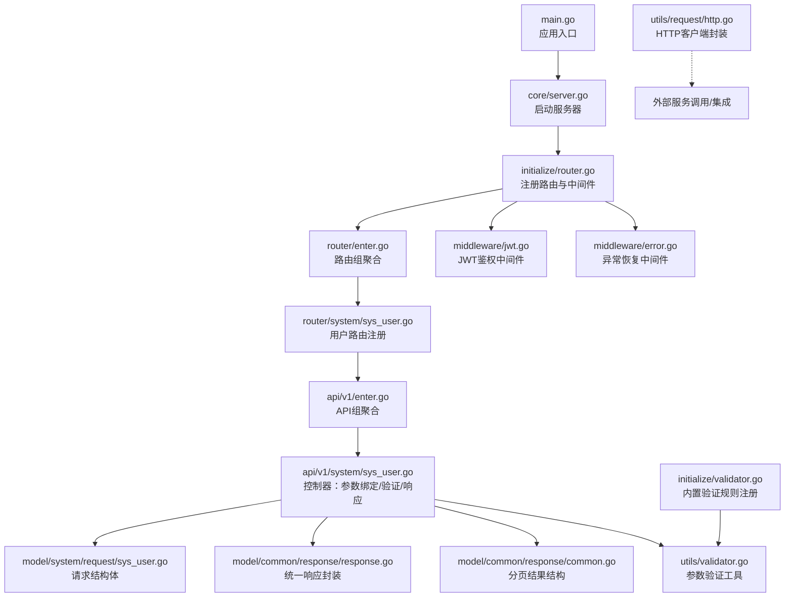
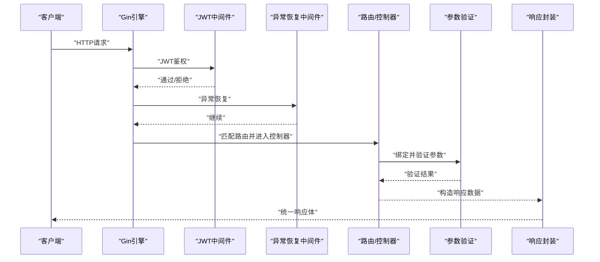
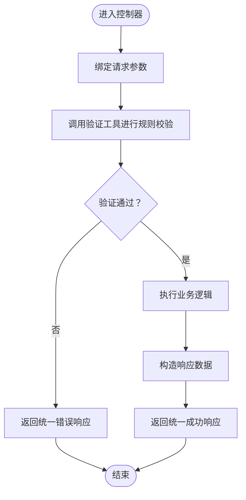
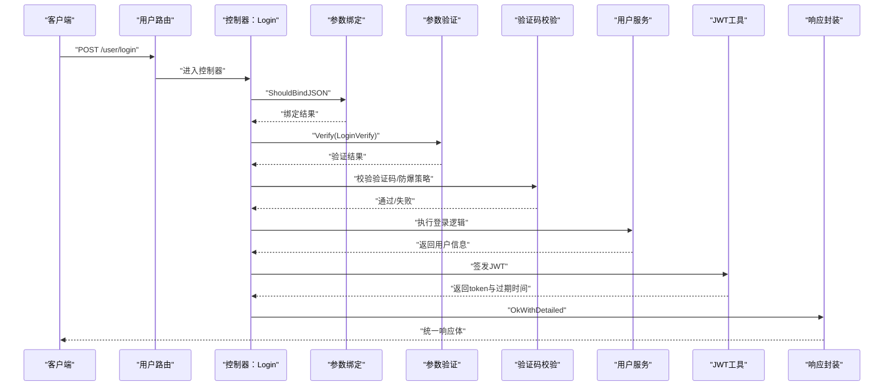
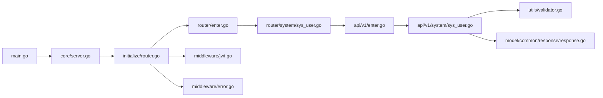

# 请求响应处理

<cite>
**本文引用的文件**
- [server/main.go](file://server/main.go)
- [server/core/server.go](file://server/core/server.go)
- [server/initialize/router.go](file://server/initialize/router.go)
- [server/router/enter.go](file://server/router/enter.go)
- [server/router/system/sys_user.go](file://server/router/system/sys_user.go)
- [server/api/v1/enter.go](file://server/api/v1/enter.go)
- [server/api/v1/system/sys_user.go](file://server/api/v1/system/sys_user.go)
- [server/model/system/request/sys_user.go](file://server/model/system/request/sys_user.go)
- [server/model/common/response/response.go](file://server/model/common/response/response.go)
- [server/model/common/response/common.go](file://server/model/common/response/common.go)
- [server/middleware/error.go](file://server/middleware/error.go)
- [server/middleware/jwt.go](file://server/middleware/jwt.go)
- [server/utils/validator.go](file://server/utils/validator.go)
- [server/initialize/validator.go](file://server/initialize/validator.go)
- [server/utils/request/http.go](file://server/utils/request/http.go)
</cite>

## 目录
1. [引言](#引言)
2. [项目结构](#项目结构)
3. [核心组件](#核心组件)
4. [架构总览](#架构总览)
5. [详细组件分析](#详细组件分析)
6. [依赖分析](#依赖分析)
7. [性能考量](#性能考量)
8. [故障排查指南](#故障排查指南)
9. [结论](#结论)
10. [附录](#附录)

## 引言
本技术文档聚焦于 Gin-Vue-Admin 后端的“请求-响应”处理机制，系统性阐述从 HTTP 请求接入、参数解析、数据验证、业务处理到统一响应返回的完整流程；同时详解请求参数的处理方式（路径参数、查询参数、表单与 JSON 请求体），统一响应格式的设计，参数验证机制（内置与自定义）以及错误处理与错误码管理策略。目标是帮助开发者快速理解并高效扩展 API 的请求处理链路。

## 项目结构
后端基于 Gin 框架构建，采用“路由-控制器-服务-模型”的分层组织方式。核心入口负责初始化系统组件并启动 HTTP 服务器；路由层负责注册公开与私有路由组，并挂载中间件；控制器层负责参数绑定、验证与响应封装；模型层包含请求/响应结构体与通用分页结果；中间件层提供 JWT 鉴权、跨域、日志与异常恢复等能力；工具层提供参数验证、HTTP 请求封装等通用能力。

图表来源
- [server/main.go:30-35](file://server/main.go#L30-L35)
- [server/core/server.go:32-47](file://server/core/server.go#L32-L47)
- [server/initialize/router.go:36-117](file://server/initialize/router.go#L36-L117)
- [server/router/enter.go:8-13](file://server/router/enter.go#L8-L13)
- [server/router/system/sys_user.go:10-28](file://server/router/system/sys_user.go#L10-L28)
- [server/api/v1/enter.go:8-13](file://server/api/v1/enter.go#L8-L13)
- [server/api/v1/system/sys_user.go:27-99](file://server/api/v1/system/sys_user.go#L27-L99)
- [server/model/system/request/sys_user.go:21-71](file://server/model/system/request/sys_user.go#L21-L71)
- [server/model/common/response/response.go:9-62](file://server/model/common/response/response.go#L9-L62)
- [server/model/common/response/common.go:3-8](file://server/model/common/response/common.go#L3-L8)
- [server/middleware/jwt.go:16-77](file://server/middleware/jwt.go#L16-L77)
- [server/middleware/error.go:21-79](file://server/middleware/error.go#L21-L79)
- [server/utils/validator.go:118-165](file://server/utils/validator.go#L118-L165)
- [server/initialize/validator.go:5-22](file://server/initialize/validator.go#L5-L22)
- [server/utils/request/http.go:12-127](file://server/utils/request/http.go#L12-L127)

章节来源
- [server/main.go:30-35](file://server/main.go#L30-L35)
- [server/core/server.go:32-47](file://server/core/server.go#L32-L47)
- [server/initialize/router.go:36-117](file://server/initialize/router.go#L36-L117)

## 核心组件
- 路由与中间件
  - 路由注册：在路由层统一注册公开/私有路由组，并挂载 JWT 与 RBAC 中间件。
  - 中间件：异常恢复（panic 捕获与日志）、JWT 鉴权（令牌解析、黑名单检查、过期续签）、跨域与日志等。
- 控制器（API）
  - 参数绑定：使用 Gin 的 ShouldBindJSON/ShouldBind 等完成 JSON、表单与查询参数的绑定。
  - 参数验证：结合内置与自定义验证规则，确保入参合法性。
  - 响应封装：统一使用响应封装工具输出标准格式。
- 模型与结构体
  - 请求结构体：定义各接口的输入模型，支持 Swagger 文档生成。
  - 响应结构体：统一响应体与分页结果结构。
- 验证工具
  - 内置规则：非空、正则匹配、数值/长度比较等。
  - 自定义规则：集中注册，按需复用。
- HTTP 客户端
  - 封装 HTTP 请求，支持超时、SSE 场景禁用压缩、查询参数拼接与 JSON 编码。

章节来源
- [server/initialize/router.go:36-117](file://server/initialize/router.go#L36-L117)
- [server/middleware/jwt.go:16-77](file://server/middleware/jwt.go#L16-L77)
- [server/middleware/error.go:21-79](file://server/middleware/error.go#L21-L79)
- [server/api/v1/system/sys_user.go:27-99](file://server/api/v1/system/sys_user.go#L27-L99)
- [server/model/common/response/response.go:9-62](file://server/model/common/response/response.go#L9-L62)
- [server/model/common/response/common.go:3-8](file://server/model/common/response/common.go#L3-L8)
- [server/utils/validator.go:118-165](file://server/utils/validator.go#L118-L165)
- [server/initialize/validator.go:5-22](file://server/initialize/validator.go#L5-L22)
- [server/utils/request/http.go:12-127](file://server/utils/request/http.go#L12-L127)

## 架构总览
下图展示一次典型 API 请求从接入到响应返回的关键步骤与组件交互：

图表来源
- [server/initialize/router.go:36-117](file://server/initialize/router.go#L36-L117)
- [server/middleware/jwt.go:16-77](file://server/middleware/jwt.go#L16-L77)
- [server/middleware/error.go:21-79](file://server/middleware/error.go#L21-L79)
- [server/api/v1/system/sys_user.go:27-99](file://server/api/v1/system/sys_user.go#L27-L99)
- [server/model/common/response/response.go:20-62](file://server/model/common/response/response.go#L20-L62)

## 详细组件分析

### 请求参数处理机制
- JSON 请求体
  - 控制器使用 ShouldBindJSON 将请求体绑定到结构体，便于后续验证与业务处理。
  - 示例：登录、注册、修改密码、设置用户信息等均采用 JSON 绑定。
- 查询参数与表单
  - 结构体字段上使用 form 标签声明，配合 ShouldBind 或 ShouldBindJSON 完成绑定。
  - 示例：分页查询、排序字段等通过 form 标签映射到查询参数。
- 路径参数
  - 路由注册时通过 group 和具体路径组合形成最终路由，路径参数通常通过路由变量在控制器中读取（示例中主要体现为 JSON/查询/表单参数）。

章节来源
- [server/api/v1/system/sys_user.go:27-99](file://server/api/v1/system/sys_user.go#L27-L99)
- [server/model/system/request/sys_user.go:21-71](file://server/model/system/request/sys_user.go#L21-L71)
- [server/router/system/sys_user.go:10-28](file://server/router/system/sys_user.go#L10-L28)

### 响应数据标准格式
- 统一响应体
  - 包含 code、data、msg 三要素，便于前端统一处理。
  - 提供多种便捷方法：成功/失败、带数据/带消息、未认证等。
- 分页结果
  - PageResult 结构体包含 list、total、page、pageSize，用于分页接口统一返回。

章节来源
- [server/model/common/response/response.go:9-62](file://server/model/common/response/response.go#L9-L62)
- [server/model/common/response/common.go:3-8](file://server/model/common/response/common.go#L3-L8)

### 参数验证机制
- 内置验证器
  - 非空、正则匹配、数值/长度比较（小于、小于等于、等于、不等于、大于等于、大于）。
- 自定义验证规则
  - 在初始化阶段集中注册规则集，控制器中直接调用 Verify 方法对结构体进行验证。
- 验证流程
  - 控制器先绑定参数，再调用验证工具进行规则校验，失败时返回统一错误响应。

图表来源
- [server/api/v1/system/sys_user.go:27-99](file://server/api/v1/system/sys_user.go#L27-L99)
- [server/utils/validator.go:118-165](file://server/utils/validator.go#L118-L165)
- [server/initialize/validator.go:5-22](file://server/initialize/validator.go#L5-L22)
- [server/model/common/response/response.go:20-62](file://server/model/common/response/response.go#L20-L62)

章节来源
- [server/utils/validator.go:118-165](file://server/utils/validator.go#L118-L165)
- [server/initialize/validator.go:5-22](file://server/initialize/validator.go#L5-L22)
- [server/api/v1/system/sys_user.go:27-99](file://server/api/v1/system/sys_user.go#L27-L99)

### 错误处理策略与错误码管理
- 错误处理
  - 异常恢复中间件捕获 panic，记录请求与堆栈信息，必要时写入错误日志并返回 500。
  - JWT 中间件对未登录、令牌过期、黑名单等情况返回相应提示并清除无效令牌。
- 错误码
  - 统一响应体中的 code 字段作为业务错误码载体；SUCCESS/ERROR 常量用于成功/失败标识。
  - 未认证场景使用独立方法返回特定状态与消息。

章节来源
- [server/middleware/error.go:21-79](file://server/middleware/error.go#L21-L79)
- [server/middleware/jwt.go:16-77](file://server/middleware/jwt.go#L16-L77)
- [server/model/common/response/response.go:15-18](file://server/model/common/response/response.go#L15-L18)
- [server/model/common/response/response.go:52-58](file://server/model/common/response/response.go#L52-L58)

### 请求处理序列示例（登录）
以下序列图展示登录接口从请求到响应的完整流程，涵盖参数绑定、验证码/登录校验、JWT 签发与响应封装。

图表来源
- [server/router/system/sys_user.go:10-28](file://server/router/system/sys_user.go#L10-L28)
- [server/api/v1/system/sys_user.go:27-99](file://server/api/v1/system/sys_user.go#L27-L99)
- [server/model/system/request/sys_user.go:21-27](file://server/model/system/request/sys_user.go#L21-L27)
- [server/model/common/response/response.go:20-42](file://server/model/common/response/response.go#L20-L42)

## 依赖分析
- 组件耦合
  - 路由层仅依赖中间件与控制器，保持低耦合；控制器依赖验证工具与响应封装，职责清晰。
- 关键依赖链
  - main -> core/server -> initialize/router -> router/* -> api/v1/* -> utils/validator/response -> middleware/*
- 循环依赖
  - 未发现循环依赖迹象，模块边界清晰。

图表来源
- [server/main.go:30-35](file://server/main.go#L30-L35)
- [server/core/server.go:32-47](file://server/core/server.go#L32-L47)
- [server/initialize/router.go:36-117](file://server/initialize/router.go#L36-L117)
- [server/router/enter.go:8-13](file://server/router/enter.go#L8-L13)
- [server/router/system/sys_user.go:10-28](file://server/router/system/sys_user.go#L10-L28)
- [server/api/v1/enter.go:8-13](file://server/api/v1/enter.go#L8-L13)
- [server/api/v1/system/sys_user.go:27-99](file://server/api/v1/system/sys_user.go#L27-L99)
- [server/utils/validator.go:118-165](file://server/utils/validator.go#L118-L165)
- [server/model/common/response/response.go:20-62](file://server/model/common/response/response.go#L20-L62)
- [server/middleware/jwt.go:16-77](file://server/middleware/jwt.go#L16-L77)
- [server/middleware/error.go:21-79](file://server/middleware/error.go#L21-L79)

## 性能考量
- 中间件顺序
  - 将异常恢复置于首位，避免 panic 影响后续中间件；JWT 中间件尽早拦截非法请求。
- 超时控制
  - HTTP 客户端封装支持自定义超时，SSE 场景禁用压缩以保证事件实时性。
- 缓存与黑名单
  - JWT 黑名单与 Redis/JWT 缓存结合，减少重复鉴权开销。
- 日志与监控
  - Debug 模式启用日志中间件，生产环境建议精简日志级别并结合外部监控系统。

## 故障排查指南
- 500 错误与堆栈
  - 异常恢复中间件会记录请求与堆栈，定位问题后修复并观察日志。
- 未登录/令牌过期
  - JWT 中间件会返回未登录或过期提示，前端需重新登录或刷新令牌。
- 参数错误
  - 若验证失败，统一返回错误消息；检查请求体/查询参数命名与类型是否与结构体标签一致。
- 响应格式异常
  - 确认控制器使用了统一响应封装方法，避免直接返回原始数据。

章节来源
- [server/middleware/error.go:21-79](file://server/middleware/error.go#L21-L79)
- [server/middleware/jwt.go:16-77](file://server/middleware/jwt.go#L16-L77)
- [server/model/common/response/response.go:20-62](file://server/model/common/response/response.go#L20-L62)

## 结论
本项目通过清晰的分层与中间件体系，实现了从请求接入到响应返回的标准化流程。参数绑定与验证、统一响应封装、JWT 鉴权与异常恢复共同构成了稳定可靠的 API 处理链。遵循内置与自定义验证规则，可有效提升接口安全性与一致性；通过统一响应格式与错误码管理，便于前后端协作与问题定位。

## 附录
- HTTP 客户端封装
  - 支持超时、SSE 场景禁用压缩、查询参数拼接与 JSON 编码，适用于服务间调用与外部集成。
- 验证规则注册
  - 在初始化阶段集中注册常用规则，控制器内直接复用，降低重复代码与维护成本。

章节来源
- [server/utils/request/http.go:12-127](file://server/utils/request/http.go#L12-L127)
- [server/initialize/validator.go:5-22](file://server/initialize/validator.go#L5-L22)