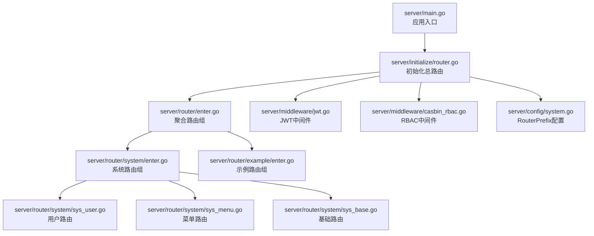
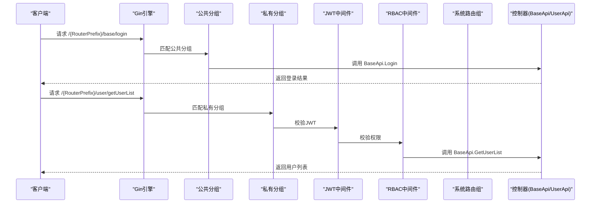
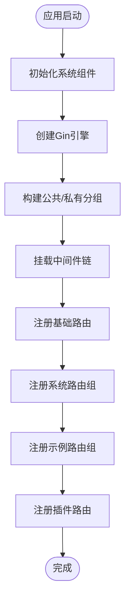
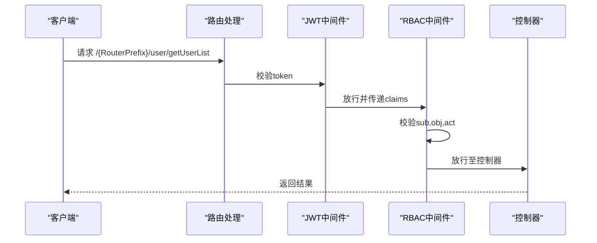
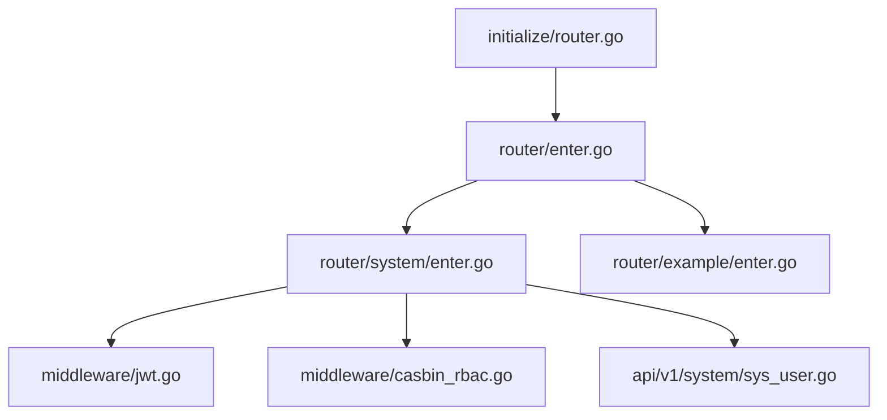

# 路由系统设计

<cite>
**本文档引用的文件**
- [server/main.go](file://server/main.go)
- [server/initialize/router.go](file://server/initialize/router.go)
- [server/router/enter.go](file://server/router/enter.go)
- [server/router/system/enter.go](file://server/router/system/enter.go)
- [server/router/example/enter.go](file://server/router/example/enter.go)
- [server/router/system/sys_user.go](file://server/router/system/sys_user.go)
- [server/router/system/sys_menu.go](file://server/router/system/sys_menu.go)
- [server/router/system/sys_base.go](file://server/router/system/sys_base.go)
- [server/middleware/jwt.go](file://server/middleware/jwt.go)
- [server/middleware/casbin_rbac.go](file://server/middleware/casbin_rbac.go)
- [server/config/system.go](file://server/config/system.go)
- [server/config/config.go](file://server/config/config.go)
- [server/api/v1/system/sys_user.go](file://server/api/v1/system/sys_user.go)
</cite>

## 目录
1. [引言](#引言)
2. [项目结构](#项目结构)
3. [核心组件](#核心组件)
4. [架构总览](#架构总览)
5. [详细组件分析](#详细组件分析)
6. [依赖关系分析](#依赖关系分析)
7. [性能考量](#性能考量)
8. [故障排查指南](#故障排查指南)
9. [结论](#结论)
10. [附录](#附录)

## 引言
本文件面向后端开发者与架构师，系统性阐述基于 Gin 的路由系统设计与实现，重点覆盖以下方面：
- RouterGroup 模式的设计理念与实现方式
- 系统路由与示例路由的组织结构、前缀管理与命名空间隔离
- 路由分组策略、嵌套机制与路由与控制器的绑定关系
- 路由注册流程的完整示例（静态路由配置与动态路由生成）
- 路由中间件的应用方式与路由级别的权限控制实现

## 项目结构
后端采用“按功能域分层 + RouterGroup 组织”的结构：路由层位于 server/router，按业务域划分为 system 与 example；初始化层 server/initialize 负责组装总路由并挂载中间件；中间件层 server/middleware 提供认证与权限控制；配置层 server/config 提供 RouterPrefix 等系统参数。

图表来源
- [server/main.go:30-35](file://server/main.go#L30-L35)
- [server/initialize/router.go:36-117](file://server/initialize/router.go#L36-L117)
- [server/router/enter.go:8-13](file://server/router/enter.go#L8-L13)
- [server/router/system/enter.go:5-27](file://server/router/system/enter.go#L5-L27)
- [server/router/example/enter.go:7-12](file://server/router/example/enter.go#L7-L12)
- [server/router/system/sys_user.go:10-28](file://server/router/system/sys_user.go#L10-L28)
- [server/router/system/sys_menu.go:10-29](file://server/router/system/sys_menu.go#L10-L29)
- [server/router/system/sys_base.go:9-16](file://server/router/system/sys_base.go#L9-L16)
- [server/middleware/jwt.go:16-77](file://server/middleware/jwt.go#L16-L77)
- [server/middleware/casbin_rbac.go:12-32](file://server/middleware/casbin_rbac.go#L12-L32)
- [server/config/system.go:3-6](file://server/config/system.go#L3-L6)

章节来源
- [server/main.go:30-35](file://server/main.go#L30-L35)
- [server/initialize/router.go:36-117](file://server/initialize/router.go#L36-L117)
- [server/router/enter.go:8-13](file://server/router/enter.go#L8-L13)
- [server/router/system/enter.go:5-27](file://server/router/system/enter.go#L5-L27)
- [server/router/example/enter.go:7-12](file://server/router/example/enter.go#L7-L12)
- [server/config/system.go:3-6](file://server/config/system.go#L3-L6)

## 核心组件
- 路由聚合器 RouterGroupApp：集中持有系统与示例路由组实例，便于初始化阶段统一注册。
- 系统路由组 system.RouterGroup：封装系统模块的所有路由子组（用户、菜单、字典、权限等）。
- 示例路由组 example.RouterGroup：封装示例模块的路由子组（客户、文件上传下载等）。
- 初始化总路由 Routers：创建 Gin 引擎，注册静态资源、Swagger、中间件，并按公共与私有分组挂载各路由子组。
- 中间件链：JWTAuth（认证）、CasbinHandler（权限），按需组合应用于公共/私有分组。
- 配置 RouterPrefix：统一前缀，影响 Swagger、RBAC 对象裁剪与路由路径拼接。

章节来源
- [server/router/enter.go:8-13](file://server/router/enter.go#L8-L13)
- [server/router/system/enter.go:5-27](file://server/router/system/enter.go#L5-L27)
- [server/router/example/enter.go:7-12](file://server/router/example/enter.go#L7-L12)
- [server/initialize/router.go:36-117](file://server/initialize/router.go#L36-L117)
- [server/middleware/jwt.go:16-77](file://server/middleware/jwt.go#L16-L77)
- [server/middleware/casbin_rbac.go:12-32](file://server/middleware/casbin_rbac.go#L12-L32)
- [server/config/system.go:3-6](file://server/config/system.go#L3-L6)

## 架构总览
下图展示路由系统从入口到具体控制器的调用链路，体现 RouterGroup 组织、中间件链与控制器绑定关系。

图表来源
- [server/initialize/router.go:70-105](file://server/initialize/router.go#L70-L105)
- [server/router/system/sys_base.go:9-16](file://server/router/system/sys_base.go#L9-L16)
- [server/router/system/sys_user.go:10-27](file://server/router/system/sys_user.go#L10-L27)
- [server/middleware/jwt.go:16-77](file://server/middleware/jwt.go#L16-L77)
- [server/middleware/casbin_rbac.go:12-32](file://server/middleware/casbin_rbac.go#L12-L32)

## 详细组件分析

### RouterGroup 模式与命名空间
- 设计理念
  - 通过 RouterGroup 结构体聚合同一业务域下的多个路由子组，形成清晰的命名空间隔离。
  - 在初始化阶段，仅通过一个聚合器实例完成批量注册，降低耦合度与重复代码。
- 实现方式
  - 聚合器：在 router/enter.go 中定义 RouterGroupApp，包含 system.RouterGroup 与 example.RouterGroup。
  - 业务域路由组：在 router/system/enter.go 与 router/example/enter.go 中声明各子路由组字段，并在初始化函数中调用对应子组的 InitXxxRouter 方法。
- 命名空间隔离
  - 通过 Router.Group("xxx") 为每个子路由创建独立命名空间，避免路由冲突。
  - 例如用户路由组 user 与菜单路由组 menu 彼此独立，便于维护与扩展。

章节来源
- [server/router/enter.go:8-13](file://server/router/enter.go#L8-L13)
- [server/router/system/enter.go:5-27](file://server/router/system/enter.go#L5-L27)
- [server/router/example/enter.go:7-12](file://server/router/example/enter.go#L7-L12)

### 路由前缀管理与 Swagger 集成
- RouterPrefix 配置
  - 在 server/config/system.go 中定义 RouterPrefix 字段，用于统一前缀。
- Swagger 基础路径
  - 在 server/initialize/router.go 中将 docs.SwaggerInfo.BasePath 设置为 RouterPrefix，并注册 /{RouterPrefix}/swagger/*any 路由。
- 前缀应用
  - 公共与私有分组均基于 RouterPrefix 创建，确保所有路由具备统一前缀，便于反向代理与多实例部署。

章节来源
- [server/config/system.go:3-6](file://server/config/system.go#L3-L6)
- [server/initialize/router.go:59-61](file://server/initialize/router.go#L59-L61)
- [server/initialize/router.go:64-66](file://server/initialize/router.go#L64-L66)

### 路由分组策略与嵌套机制
- 分组策略
  - PublicGroup：注册无需鉴权的基础功能（如登录、验证码、健康检查）。
  - PrivateGroup：注册需要鉴权与权限校验的功能（如用户、菜单、系统配置等）。
- 嵌套机制
  - 在子路由组内部再次使用 Router.Group("xxx") 创建更细粒度的命名空间（如 user、menu）。
  - 通过 Group 返回的 RouterGroup 可继续链式注册，形成清晰的层级结构。
- 控制器绑定
  - 子路由组的 InitXxxRouter 方法接收 RouterGroup 实例，内部将具体路由与控制器方法绑定。

章节来源
- [server/initialize/router.go:70-105](file://server/initialize/router.go#L70-L105)
- [server/router/system/sys_user.go:10-27](file://server/router/system/sys_user.go#L10-L27)
- [server/router/system/sys_menu.go:10-27](file://server/router/system/sys_menu.go#L10-L27)

### 路由注册流程示例
- 入口与初始化
  - main.go 调用 initializeSystem 完成系统初始化，随后 core.RunServer 启动服务。
  - initializeSystem 中调用 initialize.OtherInit 等完成配置、日志、数据库等初始化。
- 总路由装配
  - Routers 创建 Gin 引擎，注册 Recovery、Logger（调试模式）等全局中间件。
  - 创建 PublicGroup 与 PrivateGroup，分别挂载基础与鉴权中间件。
  - 调用 systemRouter 与 exampleRouter 的 InitXxxRouter 方法完成注册。
- 静态路由与动态生成
  - 静态路由：如 /health、/base/login、/user/* 等在初始化阶段直接注册。
  - 动态路由：菜单与权限相关路由在运行时根据用户角色动态下发，前端按需渲染。

图表来源
- [server/main.go:30-35](file://server/main.go#L30-L35)
- [server/initialize/router.go:36-117](file://server/initialize/router.go#L36-L117)

章节来源
- [server/main.go:30-35](file://server/main.go#L30-L35)
- [server/initialize/router.go:36-117](file://server/initialize/router.go#L36-L117)

### 中间件应用与权限控制
- JWT 认证中间件
  - 从请求头提取 token，校验黑名单、过期与异常情况，必要时刷新 token 并写入响应头。
  - 将解析后的 claims 放入上下文，供后续中间件与控制器使用。
- RBAC 权限中间件
  - 从上下文获取用户角色 ID，裁剪请求路径去除 RouterPrefix 后与请求方法共同作为对象进行校验。
  - 若权限不足，返回错误并中断请求。
- 中间件组合
  - 私有分组同时使用 JWTAuth 与 CasbinHandler，确保先认证再授权。
  - 公共分组通常不启用鉴权中间件，但可按需添加。

图表来源
- [server/middleware/jwt.go:16-77](file://server/middleware/jwt.go#L16-L77)
- [server/middleware/casbin_rbac.go:12-32](file://server/middleware/casbin_rbac.go#L12-L32)
- [server/initialize/router.go:68](file://server/initialize/router.go#L68)

章节来源
- [server/middleware/jwt.go:16-77](file://server/middleware/jwt.go#L16-L77)
- [server/middleware/casbin_rbac.go:12-32](file://server/middleware/casbin_rbac.go#L12-L32)
- [server/initialize/router.go:68](file://server/initialize/router.go#L68)

### 路由与控制器绑定关系
- 绑定方式
  - 在子路由组的 InitXxxRouter 方法中，将具体路由路径与控制器方法绑定。
  - 例如用户路由组将 /user/admin_register 绑定到 baseApi.Register。
- 控制器职责
  - 控制器方法负责参数校验、调用服务层、返回标准响应。
  - 例如 BaseApi.Login 负责登录校验与 token 签发。

章节来源
- [server/router/system/sys_user.go:14-22](file://server/router/system/sys_user.go#L14-L22)
- [server/api/v1/system/sys_user.go:20-99](file://server/api/v1/system/sys_user.go#L20-L99)

## 依赖关系分析
- 组件耦合
  - 初始化层依赖路由聚合器与各业务域路由组，形成自上而下的装配关系。
  - 路由组依赖控制器 API 层，控制器依赖服务层与工具层。
- 外部依赖
  - Gin 作为 Web 框架，提供路由与中间件能力。
  - Swagger 用于 API 文档生成与展示。
  - Casbin 用于基于策略的访问控制。

图表来源
- [server/initialize/router.go:36-117](file://server/initialize/router.go#L36-L117)
- [server/router/enter.go:8-13](file://server/router/enter.go#L8-L13)
- [server/router/system/enter.go:5-27](file://server/router/system/enter.go#L5-L27)
- [server/router/example/enter.go:7-12](file://server/router/example/enter.go#L7-L12)
- [server/middleware/jwt.go:16-77](file://server/middleware/jwt.go#L16-L77)
- [server/middleware/casbin_rbac.go:12-32](file://server/middleware/casbin_rbac.go#L12-L32)
- [server/api/v1/system/sys_user.go:20-99](file://server/api/v1/system/sys_user.go#L20-L99)

章节来源
- [server/initialize/router.go:36-117](file://server/initialize/router.go#L36-L117)
- [server/router/enter.go:8-13](file://server/router/enter.go#L8-L13)
- [server/router/system/enter.go:5-27](file://server/router/system/enter.go#L5-L27)
- [server/router/example/enter.go:7-12](file://server/router/example/enter.go#L7-L12)
- [server/middleware/jwt.go:16-77](file://server/middleware/jwt.go#L16-L77)
- [server/middleware/casbin_rbac.go:12-32](file://server/middleware/casbin_rbac.go#L12-L32)
- [server/api/v1/system/sys_user.go:20-99](file://server/api/v1/system/sys_user.go#L20-L99)

## 性能考量
- 中间件顺序
  - 将轻量中间件（如 Logger）置于前，重量中间件（如 JWT、RBAC）按需组合，减少不必要的开销。
- 路由前缀
  - 使用 RouterPrefix 统一前缀，有助于反向代理缓存与负载均衡。
- 静态资源
  - 通过 StaticFS 提供文件存储目录，避免不必要的路由匹配开销。
- JWT 刷新
  - 在 JWT 中间件中按需刷新 token 并写入响应头，减少客户端轮询成本。

## 故障排查指南
- 401 未登录或非法访问
  - 检查请求头是否携带有效 token，确认未在黑名单中。
  - 参考路径：[server/middleware/jwt.go:16-44](file://server/middleware/jwt.go#L16-L44)
- 403 权限不足
  - 检查用户角色与请求路径/方法是否匹配，确认 RouterPrefix 裁剪正确。
  - 参考路径：[server/middleware/casbin_rbac.go:12-32](file://server/middleware/casbin_rbac.go#L12-L32)
- 路由未生效
  - 确认初始化阶段已调用对应子路由组的 InitXxxRouter 方法。
  - 参考路径：[server/initialize/router.go:70-105](file://server/initialize/router.go#L70-L105)
- Swagger 文档路径异常
  - 确认 RouterPrefix 配置与 docs.BasePath 一致。
  - 参考路径：[server/initialize/router.go:59-61](file://server/initialize/router.go#L59-L61)

章节来源
- [server/middleware/jwt.go:16-44](file://server/middleware/jwt.go#L16-L44)
- [server/middleware/casbin_rbac.go:12-32](file://server/middleware/casbin_rbac.go#L12-L32)
- [server/initialize/router.go:59-61](file://server/initialize/router.go#L59-L61)
- [server/initialize/router.go:70-105](file://server/initialize/router.go#L70-L105)

## 结论
该路由系统通过 RouterGroup 模式实现了清晰的命名空间隔离与高内聚低耦合的路由组织；借助中间件链实现认证与权限控制；通过 RouterPrefix 统一前缀，满足多实例部署与反向代理场景。整体设计兼顾可维护性与扩展性，适合在复杂业务场景中持续演进。

## 附录
- 关键配置项
  - RouterPrefix：统一路由前缀，影响 Swagger 与 RBAC 对象裁剪。
  - 参考路径：[server/config/system.go:3-6](file://server/config/system.go#L3-L6)
- 常用路由示例
  - 登录：/base/login
  - 获取用户列表：/user/getUserList
  - 参考路径：
    - [server/router/system/sys_base.go:9-16](file://server/router/system/sys_base.go#L9-L16)
    - [server/router/system/sys_user.go:25-26](file://server/router/system/sys_user.go#L25-L26)