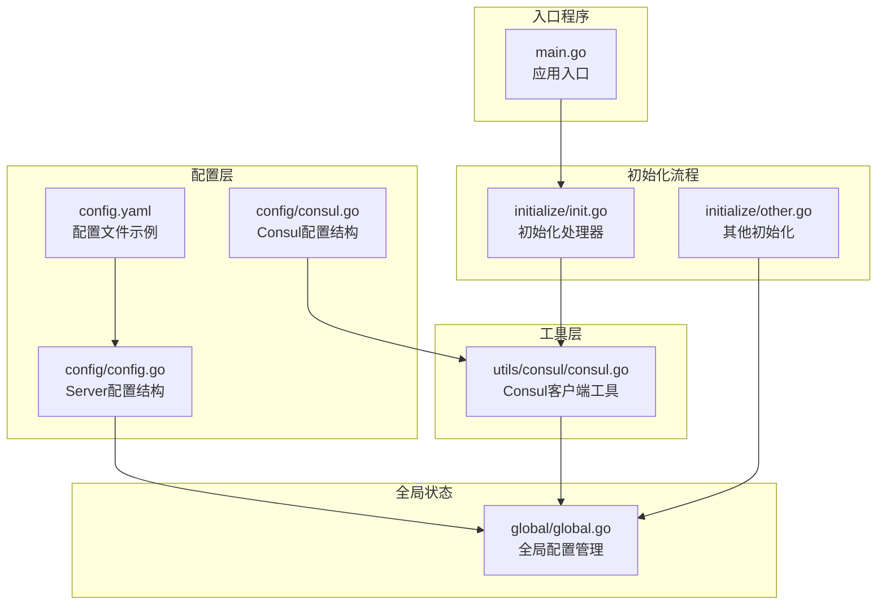
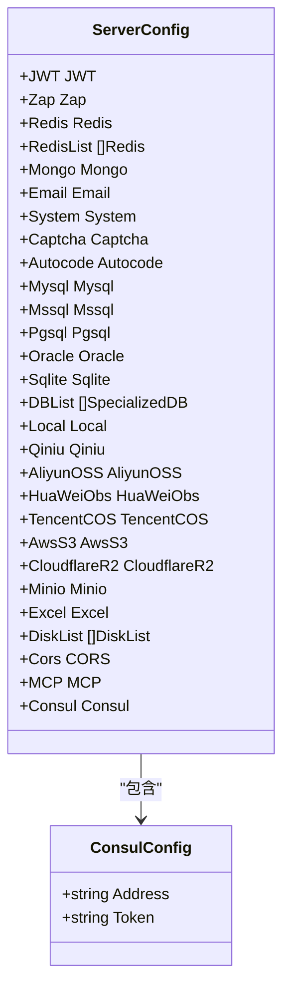
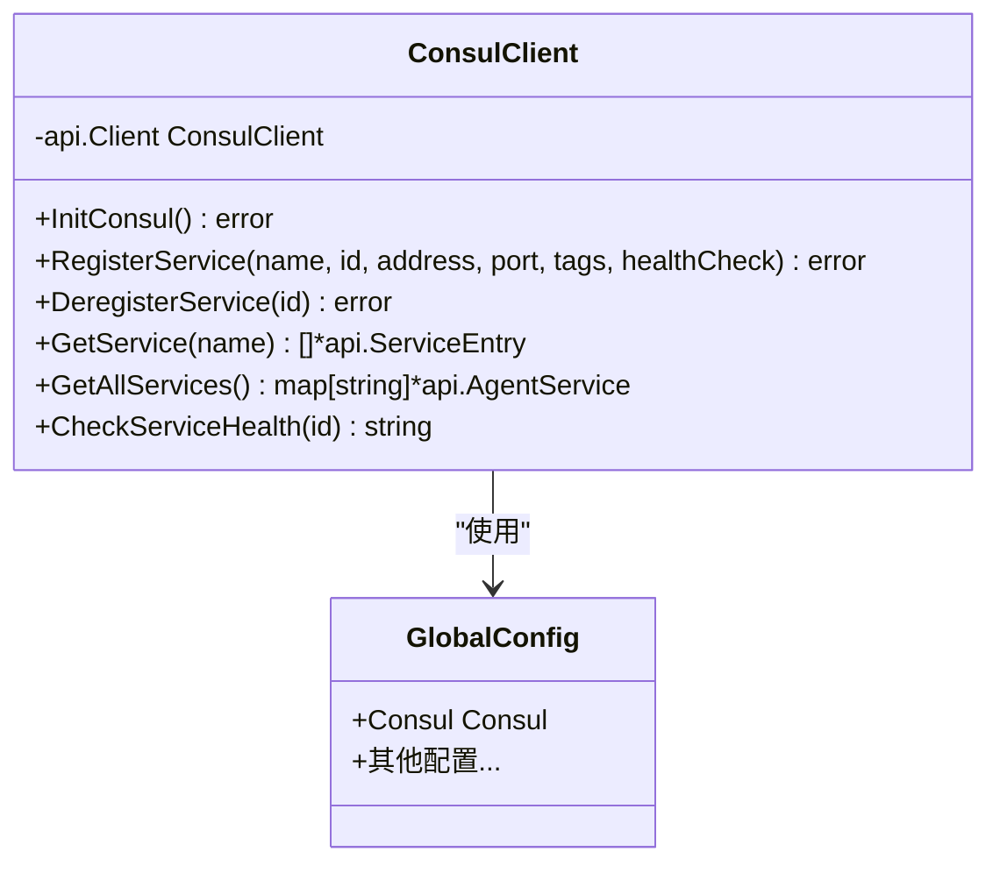
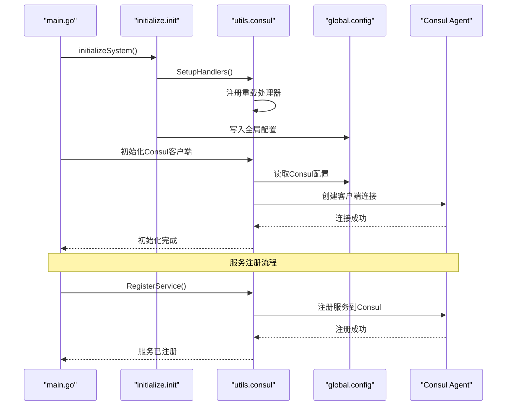
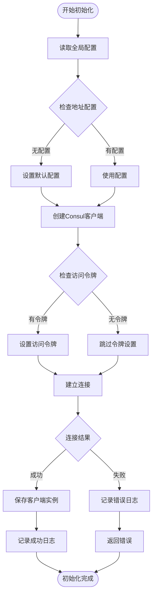
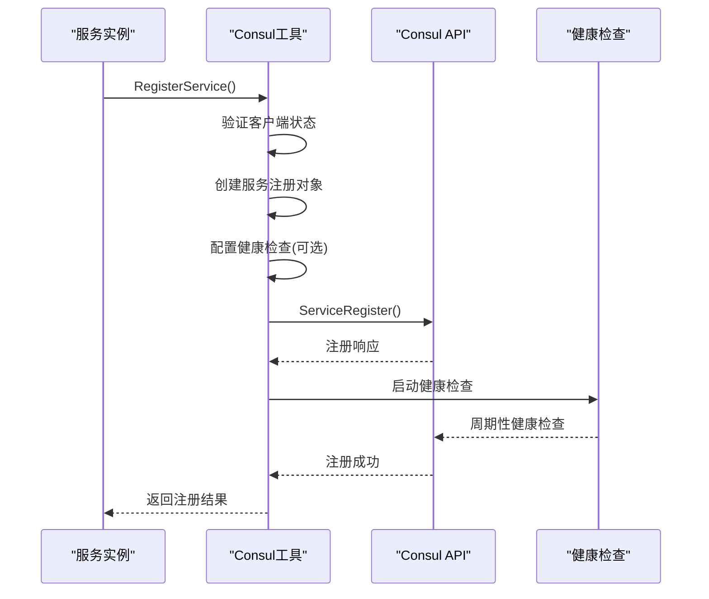
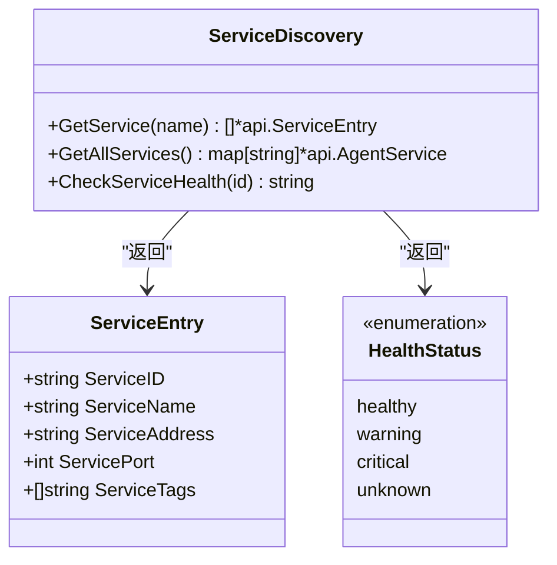
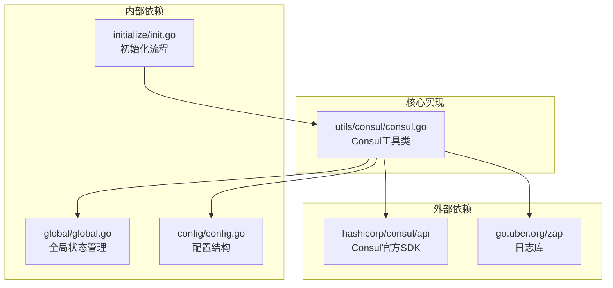

# Consul 服务发现集成

<cite>
**本文档引用的文件**
- [consul.go](file://server/config/consul.go)
- [consul.go](file://server/utils/consul/consul.go)
- [config.go](file://server/config/config.go)
- [global.go](file://server/global/global.go)
- [main.go](file://server/main.go)
- [config.yaml](file://server/config.yaml)
- [init.go](file://server/initialize/init.go)
- [other.go](file://server/initialize/other.go)
</cite>

## 目录
1. [简介](#简介)
2. [项目结构](#项目结构)
3. [核心组件](#核心组件)
4. [架构总览](#架构总览)
5. [详细组件分析](#详细组件分析)
6. [依赖关系分析](#依赖关系分析)
7. [性能考虑](#性能考虑)
8. [故障排查指南](#故障排查指南)
9. [结论](#结论)

## 简介

Gin-Vue-Admin 项目集成了 HashiCorp Consul 服务发现功能，提供了完整的微服务注册与发现解决方案。该集成包括服务注册、健康检查、服务发现和注销等功能，为系统的微服务架构提供了基础设施支持。

Consul 集成采用模块化设计，通过独立的配置结构、工具类和全局状态管理，实现了与现有系统架构的无缝集成。该实现遵循了 Go 语言的最佳实践，提供了清晰的错误处理和日志记录机制。

## 项目结构

Consul 集成在项目中的组织结构如下：

**图表来源**
- [consul.go:1-7](file://server/config/consul.go#L1-L7)
- [consul.go:1-145](file://server/utils/consul/consul.go#L1-L145)
- [config.go:1-44](file://server/config/config.go#L1-L44)
- [global.go:1-69](file://server/global/global.go#L1-L69)

**章节来源**
- [consul.go:1-7](file://server/config/consul.go#L1-L7)
- [consul.go:1-145](file://server/utils/consul/consul.go#L1-L145)
- [config.go:1-44](file://server/config/config.go#L1-L44)

## 核心组件

### 配置结构

Consul 配置通过独立的结构体定义，包含地址和访问令牌两个核心字段：

**图表来源**
- [consul.go:3-6](file://server/config/consul.go#L3-L6)
- [config.go:3-43](file://server/config/config.go#L3-L43)

### 客户端工具类

Consul 工具类提供了完整的服务发现功能，包括客户端初始化、服务注册、注销和查询等操作：

**图表来源**
- [consul.go:11-144](file://server/utils/consul/consul.go#L11-L144)
- [global.go:31-31](file://server/global/global.go#L31-L31)

**章节来源**
- [consul.go:1-7](file://server/config/consul.go#L1-L7)
- [consul.go:1-145](file://server/utils/consul/consul.go#L1-L145)
- [config.go:41-42](file://server/config/config.go#L41-L42)

## 架构总览

Consul 集成的整体架构采用分层设计，确保了模块间的松耦合和高内聚：

**图表来源**
- [main.go:37-52](file://server/main.go#L37-L52)
- [init.go:9-15](file://server/initialize/init.go#L9-L15)
- [consul.go:13-30](file://server/utils/consul/consul.go#L13-L30)

## 详细组件分析

### 客户端初始化流程

Consul 客户端初始化过程包含配置读取、连接建立和错误处理等关键步骤：

**图表来源**
- [consul.go:14-30](file://server/utils/consul/consul.go#L14-L30)

### 服务注册流程

服务注册功能支持多种配置选项，包括健康检查、标签管理和端口配置：

**图表来源**
- [consul.go:32-67](file://server/utils/consul/consul.go#L32-L67)

### 服务发现与查询

服务发现功能提供了多种查询方式，支持按服务名查询和全量服务列表获取：

**图表来源**
- [consul.go:87-144](file://server/utils/consul/consul.go#L87-L144)

**章节来源**
- [consul.go:13-144](file://server/utils/consul/consul.go#L13-L144)

## 依赖关系分析

Consul 集成与其他系统组件的依赖关系如下：

**图表来源**
- [consul.go:3-9](file://server/utils/consul/consul.go#L3-L9)
- [global.go:18-31](file://server/global/global.go#L18-L31)
- [config.go:3-43](file://server/config/config.go#L3-L43)

### 错误处理机制

系统实现了完善的错误处理机制，确保在各种异常情况下都能提供有意义的反馈：

| 错误类型 | 触发条件 | 处理方式 | 日志级别 |
|---------|---------|---------|---------|
| 客户端未初始化 | ConsulClient 为 nil | 返回明确错误信息 | Error |
| 连接失败 | Consul 服务不可达 | 记录连接错误 | Error |
| 注册失败 | 服务注册 API 调用失败 | 记录注册错误 | Error |
| 查询失败 | 服务发现 API 调用失败 | 记录查询错误 | Error |
| 健康检查失败 | 健康检查 API 调用失败 | 返回 unknown 状态 | Warn |

**章节来源**
- [consul.go:34-143](file://server/utils/consul/consul.go#L34-L143)

## 性能考虑

Consul 集成在性能方面的考虑包括：

### 连接池管理
- 单例客户端模式避免重复连接创建
- 复用现有连接减少资源消耗
- 异步健康检查避免阻塞主线程

### 缓存策略
- 服务发现结果可结合本地缓存减少 API 调用
- 健康状态缓存提高查询效率
- 配置变更时及时更新缓存

### 超时配置
- 健康检查间隔默认 10 秒，可根据服务特性调整
- 请求超时默认 5 秒，避免长时间等待
- 连接超时合理设置防止资源泄露

## 故障排查指南

### 常见问题及解决方案

#### 1. Consul 客户端初始化失败
**症状**: 启动时出现 "创建Consul客户端失败" 错误
**可能原因**:
- Consul 服务地址配置错误
- 网络连接问题
- 访问令牌验证失败

**解决步骤**:
1. 检查配置文件中的 Consul 地址设置
2. 验证 Consul 服务是否正常运行
3. 确认网络连通性
4. 验证访问令牌的有效性

#### 2. 服务注册失败
**症状**: 服务无法注册到 Consul
**可能原因**:
- 服务 ID 已存在
- 端口被占用
- 健康检查 URL 不可达

**解决步骤**:
1. 检查服务 ID 的唯一性
2. 验证端口可用性
3. 测试健康检查 URL
4. 查看 Consul UI 中的注册状态

#### 3. 服务发现查询失败
**症状**: 无法获取服务实例列表
**可能原因**:
- 服务名称拼写错误
- 服务未正确注册
- 权限不足

**解决步骤**:
1. 确认服务名称大小写
2. 检查服务注册状态
3. 验证 Consul ACL 权限
4. 查看 Consul API 响应

### 调试建议

1. **启用详细日志**: 在开发环境中增加日志详细程度
2. **监控健康状态**: 定期检查服务健康检查结果
3. **测试连接**: 使用 curl 或 Postman 测试 Consul API
4. **查看 Consul UI**: 通过 Web 界面监控服务状态

**章节来源**
- [consul.go:22-24](file://server/utils/consul/consul.go#L22-L24)
- [consul.go:58-62](file://server/utils/consul/consul.go#L58-L62)
- [consul.go:94-98](file://server/utils/consul/consul.go#L94-L98)

## 结论

Gin-Vue-Admin 项目的 Consul 服务发现集成为微服务架构提供了坚实的基础。该实现具有以下特点：

### 优势
- **模块化设计**: 独立的配置结构和工具类，易于维护和扩展
- **完整功能**: 支持服务注册、发现、注销和健康检查
- **错误处理**: 完善的错误处理和日志记录机制
- **性能优化**: 单例客户端和合理的超时配置

### 最佳实践
- 在生产环境中配置适当的健康检查间隔
- 使用唯一的服务 ID 避免冲突
- 定期监控服务健康状态
- 合理配置访问令牌和权限

### 扩展建议
- 集成服务网格功能
- 添加服务降级和熔断机制
- 实现服务版本管理
- 增加服务监控和告警

该集成方案为 Gin-Vue-Admin 项目向微服务架构演进提供了清晰的技术路径和可靠的基础设施支持。