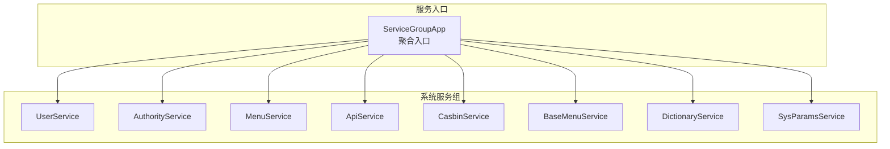
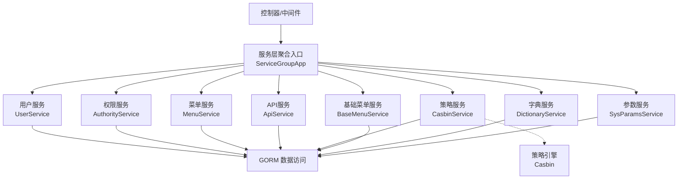
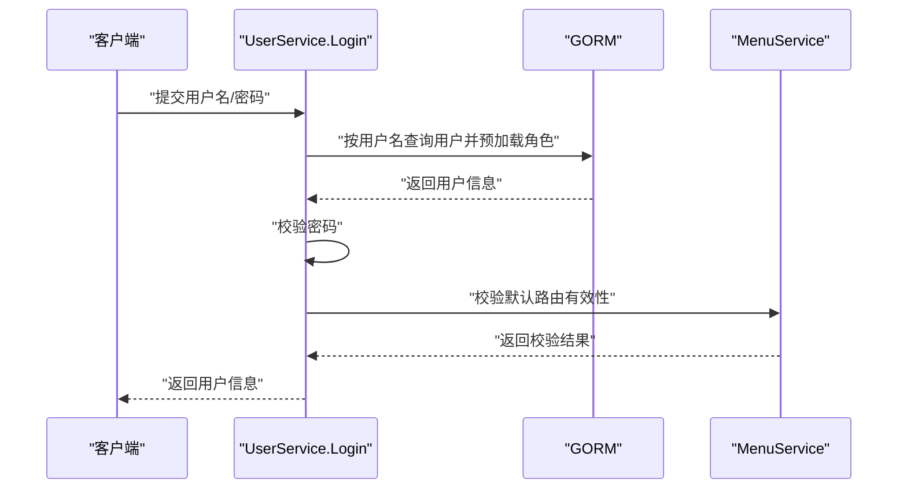
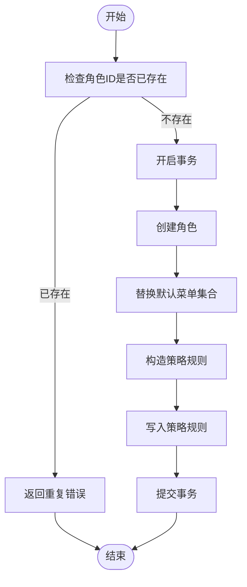
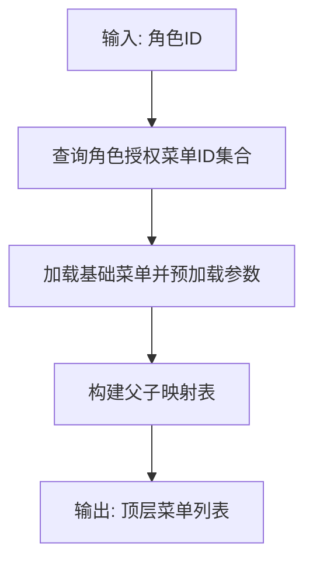
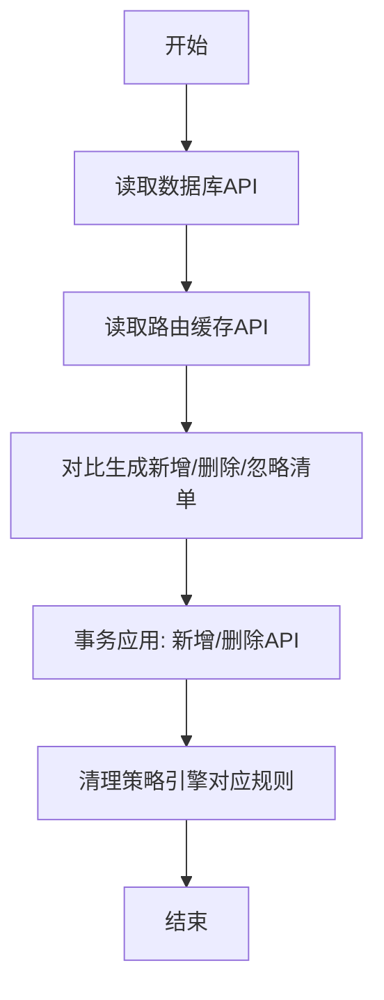
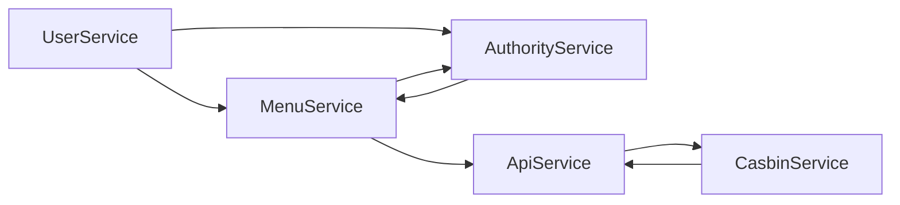

# 业务逻辑层

<cite>
**本文引用的文件**
- [server/service/enter.go](file://server/service/enter.go)
- [server/service/system/enter.go](file://server/service/system/enter.go)
- [server/service/system/sys_user.go](file://server/service/system/sys_user.go)
- [server/service/system/sys_authority.go](file://server/service/system/sys_authority.go)
- [server/service/system/sys_menu.go](file://server/service/system/sys_menu.go)
- [server/service/system/sys_api.go](file://server/service/system/sys_api.go)
- [server/service/system/sys_casbin.go](file://server/service/system/sys_casbin.go)
- [server/service/system/sys_base_menu.go](file://server/service/system/sys_base_menu.go)
- [server/service/system/sys_dictionary.go](file://server/service/system/sys_dictionary.go)
- [server/service/system/sys_params.go](file://server/service/system/sys_params.go)
- [server/model/system/sys_user.go](file://server/model/system/sys_user.go)
- [server/model/system/sys_authority.go](file://server/model/system/sys_authority.go)
</cite>

## 目录
1. [引言](#引言)
2. [项目结构](#项目结构)
3. [核心组件](#核心组件)
4. [架构总览](#架构总览)
5. [详细组件分析](#详细组件分析)
6. [依赖分析](#依赖分析)
7. [性能考量](#性能考量)
8. [故障排查指南](#故障排查指南)
9. [结论](#结论)
10. [附录](#附录)

## 引言
本文件聚焦于 Gin-Vue-Admin 项目的业务逻辑层（Service Layer），系统性梳理用户管理、权限控制、菜单管理等核心业务模块的组织架构与设计模式，阐释服务层与数据访问层的交互、事务管理机制、业务规则校验，以及服务接口设计原则、依赖注入与服务组合模式。同时给出典型业务场景（如用户注册登录、权限分配、菜单动态生成）的实现要点与流程图示。

## 项目结构
业务逻辑层位于 server/service 目录，按领域拆分为 system 与 example 两大组，其中 system 包含用户、角色/权限、菜单、API、字典、参数等系统能力；example 用于演示业务扩展。服务层通过全局变量聚合各领域服务实例，形成统一的服务入口组，便于在控制器或中间件中按需调用。

**图表来源**
- [server/service/enter.go:1-14](file://server/service/enter.go#L1-L14)
- [server/service/system/enter.go:1-31](file://server/service/system/enter.go#L1-L31)

**章节来源**
- [server/service/enter.go:1-14](file://server/service/enter.go#L1-L14)
- [server/service/system/enter.go:1-31](file://server/service/system/enter.go#L1-L31)

## 核心组件
- 用户服务（UserService）
  - 职责：用户注册、登录、密码变更、信息维护、角色切换、删除用户、查询列表等。
  - 关键点：登录后触发默认路由校验；批量角色分配使用事务保证一致性；密码采用哈希存储。
- 权限服务（AuthorityService）
  - 职责：角色创建/复制/更新/删除、角色树构建、角色数据权限设置、角色与菜单/按钮关联、严格权限校验。
  - 关键点：严格模式下限制跨级操作；删除前校验是否被使用；支持全量覆盖角色用户列表。
- 菜单服务（MenuService）
  - 职责：动态菜单树生成、基础菜单树构建、菜单与角色绑定、默认路由校验、菜单与角色全量覆盖。
  - 关键点：根据角色权限过滤菜单树；严格模式下仅返回授权范围内的菜单。
- API 服务（ApiService）
  - 职责：API 增删改查、API 分组统计、API 同步与忽略、API 与权限同步联动。
  - 关键点：API 更新时联动更新策略引擎；支持全量同步。
- 策略服务（CasbinService）
  - 职责：基于角色的细粒度权限策略（RBAC），提供策略增删改、策略同步、策略查询、Fresh 加载。
  - 关键点：策略去重；严格模式下校验 API 是否在权限范围内。
- 基础菜单服务（BaseMenuService）
  - 职责：基础菜单的增删改、参数与按钮的维护、删除前约束校验。
  - 关键点：删除时级联清理参数、按钮、权限关联。
- 字典服务（DictionaryService）
  - 职责：字典树型结构的创建、更新、删除、导出/导入、循环引用检测。
  - 关键点：父子关系校验；导入时重建层级关系。
- 参数服务（SysParamsService）
  - 职责：系统参数的增删改查、分页检索、按 key 获取值。
  - 关键点：支持条件过滤与分页。

**章节来源**
- [server/service/system/sys_user.go:1-337](file://server/service/system/sys_user.go#L1-L337)
- [server/service/system/sys_authority.go:1-413](file://server/service/system/sys_authority.go#L1-L413)
- [server/service/system/sys_menu.go:1-391](file://server/service/system/sys_menu.go#L1-L391)
- [server/service/system/sys_api.go:1-327](file://server/service/system/sys_api.go#L1-L327)
- [server/service/system/sys_casbin.go:1-216](file://server/service/system/sys_casbin.go#L1-L216)
- [server/service/system/sys_base_menu.go:1-148](file://server/service/system/sys_base_menu.go#L1-L148)
- [server/service/system/sys_dictionary.go:1-298](file://server/service/system/sys_dictionary.go#L1-L298)
- [server/service/system/sys_params.go:1-83](file://server/service/system/sys_params.go#L1-L83)

## 架构总览
服务层围绕“领域服务对象 + 事务 + 依赖注入”的模式组织，通过全局变量聚合各服务实例，形成统一入口；服务内部通过 GORM 进行数据访问，结合策略引擎完成权限校验与同步。

**图表来源**
- [server/service/enter.go:1-14](file://server/service/enter.go#L1-L14)
- [server/service/system/enter.go:1-31](file://server/service/system/enter.go#L1-L31)
- [server/service/system/sys_casbin.go:1-216](file://server/service/system/sys_casbin.go#L1-L216)

## 详细组件分析

### 用户管理服务（UserService）
- 设计要点
  - 采用面向对象封装，每个服务以结构体形式暴露方法，便于依赖注入与组合。
  - 登录后自动校验用户默认路由是否在角色授权范围内，确保安全边界。
  - 角色切换与批量角色分配均使用事务，保证多对多关联一致性。
- 关键流程（登录）

**图表来源**
- [server/service/system/sys_user.go:47-61](file://server/service/system/sys_user.go#L47-L61)
- [server/service/system/sys_menu.go:376-391](file://server/service/system/sys_menu.go#L376-L391)

**章节来源**
- [server/service/system/sys_user.go:19-61](file://server/service/system/sys_user.go#L19-L61)
- [server/service/system/sys_user.go:135-222](file://server/service/system/sys_user.go#L135-L222)
- [server/service/system/sys_user.go:286-337](file://server/service/system/sys_user.go#L286-L337)

### 权限控制服务（AuthorityService）
- 设计要点
  - 支持严格模式下的树形角色权限控制，限制跨级操作与越权修改。
  - 角色复制时同步菜单与按钮权限，并联动策略引擎。
  - 删除角色前进行完整性校验（是否被使用、是否存在子角色）。
- 关键流程（创建角色）

**图表来源**
- [server/service/system/sys_authority.go:28-54](file://server/service/system/sys_authority.go#L28-L54)
- [server/service/system/sys_authority.go:44-50](file://server/service/system/sys_authority.go#L44-L50)

**章节来源**
- [server/service/system/sys_authority.go:19-54](file://server/service/system/sys_authority.go#L19-L54)
- [server/service/system/sys_authority.go:108-178](file://server/service/system/sys_authority.go#L108-L178)
- [server/service/system/sys_authority.go:180-258](file://server/service/system/sys_authority.go#L180-L258)

### 菜单管理服务（MenuService）
- 设计要点
  - 动态菜单树生成：基于角色授权的菜单集合，组装父子关系。
  - 基础菜单树构建：支持严格模式下按授权范围筛选。
  - 默认路由校验：当用户默认路由不在其授权菜单内时回退至兜底路由。
- 关键流程（动态菜单树）

**图表来源**
- [server/service/system/sys_menu.go:22-85](file://server/service/system/sys_menu.go#L22-L85)
- [server/service/system/sys_menu.go:186-233](file://server/service/system/sys_menu.go#L186-L233)

**章节来源**
- [server/service/system/sys_menu.go:72-128](file://server/service/system/sys_menu.go#L72-L128)
- [server/service/system/sys_menu.go:186-233](file://server/service/system/sys_menu.go#L186-L233)
- [server/service/system/sys_menu.go:376-391](file://server/service/system/sys_menu.go#L376-L391)

### API 与策略服务（ApiService + CasbinService）
- 设计要点
  - API 同步：对比路由缓存与数据库差异，生成新增/删除/忽略清单。
  - 策略联动：API 更新/删除时同步更新策略引擎；严格模式下校验 API 是否在权限范围内。
- 关键流程（API 同步）

**图表来源**
- [server/service/system/sys_api.go:55-127](file://server/service/system/sys_api.go#L55-L127)
- [server/service/system/sys_api.go:136-154](file://server/service/system/sys_api.go#L136-L154)

**章节来源**
- [server/service/system/sys_api.go:16-327](file://server/service/system/sys_api.go#L16-L327)
- [server/service/system/sys_casbin.go:17-74](file://server/service/system/sys_casbin.go#L17-L74)
- [server/service/system/sys_casbin.go:175-216](file://server/service/system/sys_casbin.go#L175-L216)

### 基础菜单与字典/参数服务
- 基础菜单服务（BaseMenuService）
  - 删除前校验：是否存在子菜单、是否被角色设为首页。
  - 删除时级联清理参数、按钮、权限关联。
- 字典服务（DictionaryService）
  - 循环引用检测：防止父子关系自引用或成环。
  - 导入/导出：支持字典树与详情的完整导入导出。
- 参数服务（SysParamsService）
  - 条件检索：支持按名称/键模糊查询与时间范围过滤。
  - 分页查询：统一的分页与排序逻辑。

**章节来源**
- [server/service/system/sys_base_menu.go:14-148](file://server/service/system/sys_base_menu.go#L14-L148)
- [server/service/system/sys_dictionary.go:133-155](file://server/service/system/sys_dictionary.go#L133-L155)
- [server/service/system/sys_dictionary.go:206-298](file://server/service/system/sys_dictionary.go#L206-L298)
- [server/service/system/sys_params.go:46-83](file://server/service/system/sys_params.go#L46-L83)

## 依赖分析
- 服务聚合
  - 服务入口通过全局变量聚合各领域服务，形成统一调用面，便于依赖注入与组合。
- 服务内依赖
  - 权限服务与菜单服务相互协作：菜单服务在生成树时依赖权限服务提供的菜单集合；权限服务在复制/更新时依赖菜单服务查询授权树。
  - API 服务与策略服务联动：API 更新/删除时同步清理策略规则。
  - 用户服务在登录后依赖菜单服务进行默认路由校验。
- 数据访问层
  - 所有服务通过全局 GORM 实例进行数据库操作，事务在服务层统一管理，保证业务一致性。

**图表来源**
- [server/service/system/sys_user.go:58-58](file://server/service/system/sys_user.go#L58-L58)
- [server/service/system/sys_menu.go:191-191](file://server/service/system/sys_menu.go#L191-L191)
- [server/service/system/sys_authority.go:68-68](file://server/service/system/sys_authority.go#L68-L68)
- [server/service/system/sys_api.go:146-146](file://server/service/system/sys_api.go#L146-L146)
- [server/service/system/sys_casbin.go:68-68](file://server/service/system/sys_casbin.go#L68-L68)

**章节来源**
- [server/service/system/sys_user.go:58-58](file://server/service/system/sys_user.go#L58-L58)
- [server/service/system/sys_menu.go:191-191](file://server/service/system/sys_menu.go#L191-L191)
- [server/service/system/sys_authority.go:68-68](file://server/service/system/sys_authority.go#L68-L68)
- [server/service/system/sys_api.go:146-146](file://server/service/system/sys_api.go#L146-L146)
- [server/service/system/sys_casbin.go:68-68](file://server/service/system/sys_casbin.go#L68-L68)

## 性能考量
- 查询优化
  - 使用预加载（Preload）一次性拉取关联数据，减少 N+1 查询风险。
  - 列表查询支持分页与排序，避免一次性加载大量数据。
- 事务边界
  - 在批量写入或跨表一致性场景使用事务，降低并发冲突概率。
- 策略引擎
  - 策略去重与批量写入，减少重复规则带来的匹配开销。
- 缓存与索引
  - 模型字段建立必要索引（如用户名、UUID、角色ID），提升查询效率。

## 故障排查指南
- 常见问题定位
  - 登录失败：检查用户名是否存在、密码是否正确、默认路由是否在授权范围内。
  - 角色切换失败：确认目标角色是否包含默认路由、是否满足严格模式的授权范围。
  - 删除菜单失败：检查是否存在子菜单、是否被角色设为首页。
  - API 同步异常：核对忽略列表、策略引擎是否成功清理对应规则。
- 事务回滚
  - 服务层使用事务包裹关键写入流程，出现错误时自动回滚，确保数据一致性。
- 日志与错误码
  - 服务层在关键路径记录日志，便于定位具体失败环节。

**章节来源**
- [server/service/system/sys_user.go:47-61](file://server/service/system/sys_user.go#L47-L61)
- [server/service/system/sys_menu.go:31-35](file://server/service/system/sys_menu.go#L31-L35)
- [server/service/system/sys_api.go:136-154](file://server/service/system/sys_api.go#L136-L154)

## 结论
业务逻辑层通过清晰的领域划分与服务组合，实现了用户、权限、菜单、API、字典、参数等核心能力的解耦与复用。服务层与数据访问层的交互以事务为边界，配合策略引擎与严格权限校验，保障了系统的安全性与一致性。典型业务场景（注册登录、权限分配、菜单动态生成）均可在现有服务层中找到对应的实现路径与流程图示，便于快速扩展与维护。

## 附录
- 服务接口设计原则
  - 单一职责：每个服务聚焦特定领域。
  - 明确边界：输入输出参数清晰，错误处理统一。
  - 事务一致性：关键写入流程使用事务包裹。
- 依赖注入与服务组合
  - 通过全局变量聚合服务实例，便于在控制器或中间件中直接调用。
- 业务场景示例
  - 用户注册登录：UserService.Register/Login → MenuService.UserAuthorityDefaultRouter
  - 权限分配：AuthorityService.SetUserAuthorities → CasbinService.UpdateCasbin
  - 菜单动态生成：MenuService.GetMenuTree → 基于角色授权的菜单树