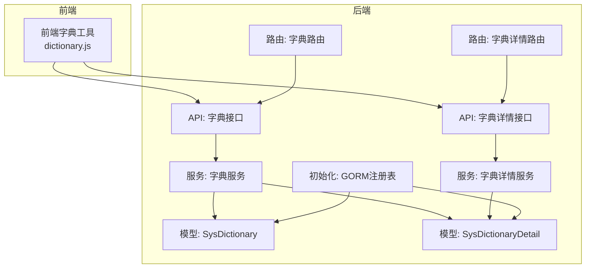
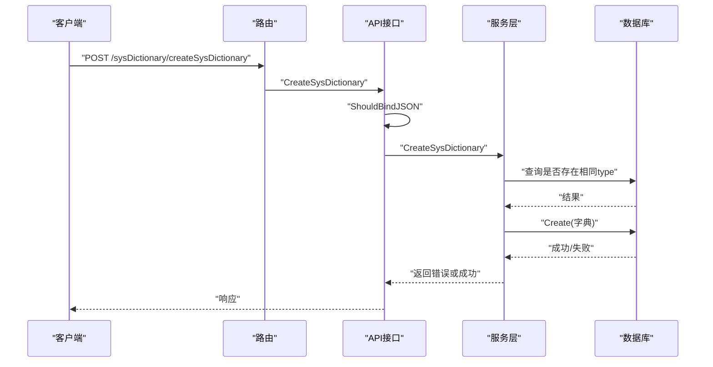
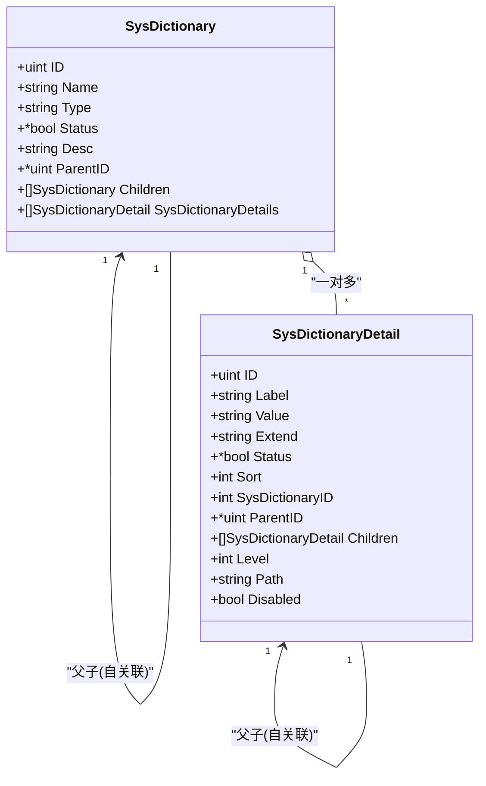
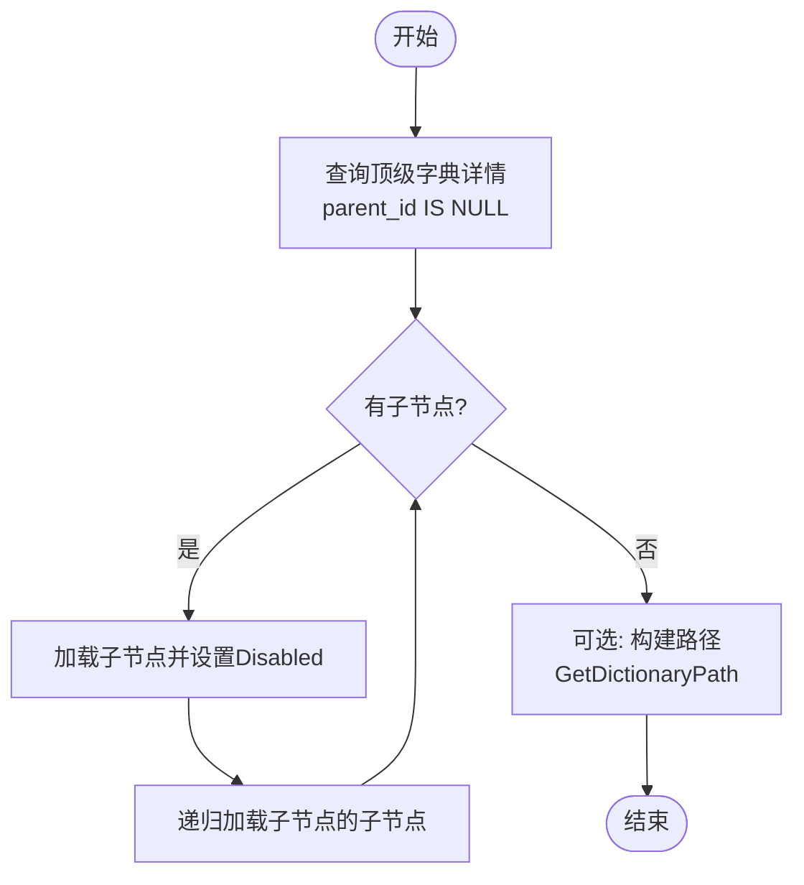
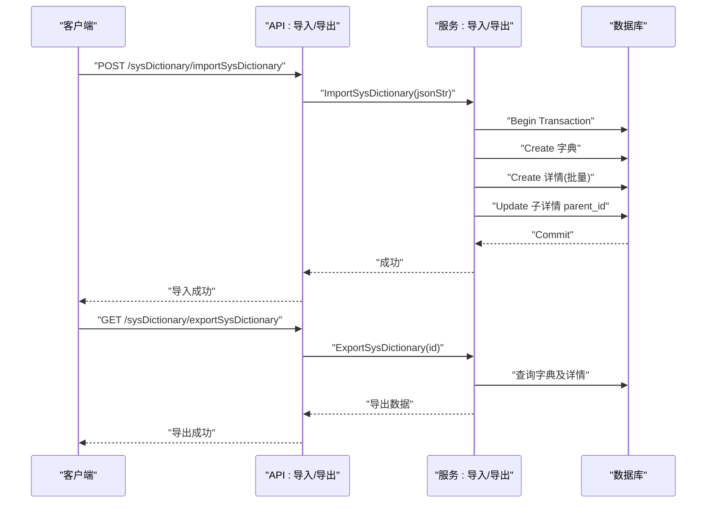
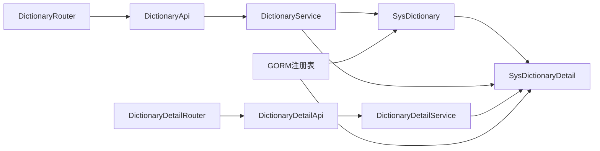

# 字典管理服务

<cite>
**本文档引用的文件**
- [sys_dictionary.go](file://server/model/system/sys_dictionary.go)
- [sys_dictionary_detail.go](file://server/model/system/sys_dictionary_detail.go)
- [sys_dictionary.go](file://server/service/system/sys_dictionary.go)
- [sys_dictionary_detail.go](file://server/service/system/sys_dictionary_detail.go)
- [sys_dictionary.go](file://server/api/v1/system/sys_dictionary.go)
- [sys_dictionary_detail.go](file://server/api/v1/system/sys_dictionary_detail.go)
- [sys_dictionary.go](file://server/router/system/sys_dictionary.go)
- [sys_dictionary_detail.go](file://server/router/system/sys_dictionary_detail.go)
- [sys_dictionary.go](file://server/model/system/request/sys_dictionary.go)
- [sys_dictionary_detail.go](file://server/model/system/request/sys_dictionary_detail.go)
- [gorm.go](file://server/initialize/gorm.go)
- [dictionary.js](file://web/src/utils/dictionary.js)
</cite>

## 目录
1. [简介](#简介)
2. [项目结构](#项目结构)
3. [核心组件](#核心组件)
4. [架构总览](#架构总览)
5. [详细组件分析](#详细组件分析)
6. [依赖关系分析](#依赖关系分析)
7. [性能考量](#性能考量)
8. [故障排查指南](#故障排查指南)
9. [结论](#结论)
10. [附录](#附录)

## 简介
本文件面向“字典管理服务”的技术文档，系统性阐述字典系统的整体设计与实现，涵盖以下关键能力：
- 字典分类管理：字典模型设计、父子关系、状态控制、描述信息维护
- 字典项维护：字典详情模型、层级路径、父子关系、排序与禁用状态
- 字典数据缓存：前端字典缓存策略与键生成规则
- 字典数据查询优化：树形结构查询、按类型/值检索、路径回溯
- 应用场景：下拉选项生成、数据标准化、配置管理
- 实际操作示例：字典创建、字典项增删改查、字典数据获取

## 项目结构
字典管理服务采用典型的分层架构：
- API层：提供REST接口，负责请求校验与响应封装
- 服务层：实现业务逻辑，包括字典与字典详情的CRUD、树形构建、导入导出、循环引用检测等
- 模型层：定义数据结构与表关系，支持预加载与关联查询
- 路由层：注册接口路由，区分带/不带操作记录中间件的路由组
- 前端工具：提供字典缓存与展示工具函数

图表来源
- [sys_dictionary.go:1-192](file://server/api/v1/system/sys_dictionary.go#L1-L192)
- [sys_dictionary_detail.go:1-268](file://server/api/v1/system/sys_dictionary_detail.go#L1-L268)
- [sys_dictionary.go:1-298](file://server/service/system/sys_dictionary.go#L1-L298)
- [sys_dictionary_detail.go:1-393](file://server/service/system/sys_dictionary_detail.go#L1-L393)
- [sys_dictionary.go:1-23](file://server/model/system/sys_dictionary.go#L1-L23)
- [sys_dictionary_detail.go:1-27](file://server/model/system/sys_dictionary_detail.go#L1-L27)
- [sys_dictionary.go:1-25](file://server/router/system/sys_dictionary.go#L1-L25)
- [sys_dictionary_detail.go:1-27](file://server/router/system/sys_dictionary_detail.go#L1-L27)
- [gorm.go:37-87](file://server/initialize/gorm.go#L37-L87)
- [dictionary.js:1-94](file://web/src/utils/dictionary.js#L1-L94)

章节来源
- [sys_dictionary.go:1-192](file://server/api/v1/system/sys_dictionary.go#L1-L192)
- [sys_dictionary_detail.go:1-268](file://server/api/v1/system/sys_dictionary_detail.go#L1-L268)
- [sys_dictionary.go:1-298](file://server/service/system/sys_dictionary.go#L1-L298)
- [sys_dictionary_detail.go:1-393](file://server/service/system/sys_dictionary_detail.go#L1-L393)
- [sys_dictionary.go:1-23](file://server/model/system/sys_dictionary.go#L1-L23)
- [sys_dictionary_detail.go:1-27](file://server/model/system/sys_dictionary_detail.go#L1-L27)
- [sys_dictionary.go:1-25](file://server/router/system/sys_dictionary.go#L1-L25)
- [sys_dictionary_detail.go:1-27](file://server/router/system/sys_dictionary_detail.go#L1-L27)
- [gorm.go:37-87](file://server/initialize/gorm.go#L37-L87)
- [dictionary.js:1-94](file://web/src/utils/dictionary.js#L1-L94)

## 核心组件
- 字典模型（SysDictionary）
  - 字段：名称、类型、状态、描述、父级ID、子字典集合、字典详情集合
  - 关系：自引用父子关系；一对多关联字典详情
- 字典详情模型（SysDictionaryDetail）
  - 字段：标签、值、扩展值、状态、排序、字典ID、父级详情ID、子详情集合、层级深度、路径
  - 关系：自引用父子关系；多对一关联字典
- 字典服务（DictionaryService）
  - 能力：创建/删除/更新字典、按ID或类型查询、分页列表、导入导出、循环引用检测
- 字典详情服务（DictionaryDetailService）
  - 能力：创建/删除/更新详情、层级与路径计算、树形构建、按父级查询、按类型查询、路径回溯
- API与路由
  - 提供字典与字典详情的增删改查、树形查询、导入导出、路径查询等接口
- 前端字典工具
  - 提供字典缓存键生成、按类型/深度/值获取字典数据、标签展示辅助

章节来源
- [sys_dictionary.go:9-22](file://server/model/system/sys_dictionary.go#L9-L22)
- [sys_dictionary_detail.go:9-26](file://server/model/system/sys_dictionary_detail.go#L9-L26)
- [sys_dictionary.go:21-298](file://server/service/system/sys_dictionary.go#L21-L298)
- [sys_dictionary_detail.go:18-393](file://server/service/system/sys_dictionary_detail.go#L18-L393)
- [sys_dictionary.go:12-192](file://server/api/v1/system/sys_dictionary.go#L12-L192)
- [sys_dictionary_detail.go:15-268](file://server/api/v1/system/sys_dictionary_detail.go#L15-L268)
- [sys_dictionary.go:8-25](file://server/router/system/sys_dictionary.go#L8-L25)
- [sys_dictionary_detail.go:8-27](file://server/router/system/sys_dictionary_detail.go#L8-L27)
- [dictionary.js:10-74](file://web/src/utils/dictionary.js#L10-L74)

## 架构总览
字典系统遵循清晰的分层职责：
- 数据持久化：通过GORM自动迁移注册字典与字典详情表
- 业务编排：服务层统一处理业务规则（如循环引用、层级路径、导入导出事务）
- 接口暴露：API层负责请求绑定、参数校验与响应封装
- 前端缓存：前端工具基于类型、深度、值生成缓存键，减少重复请求

图表来源
- [sys_dictionary.go:10-18](file://server/router/system/sys_dictionary.go#L10-L18)
- [sys_dictionary.go:23-37](file://server/api/v1/system/sys_dictionary.go#L23-L37)
- [sys_dictionary.go:25-31](file://server/service/system/sys_dictionary.go#L25-L31)

章节来源
- [sys_dictionary.go:1-25](file://server/router/system/sys_dictionary.go#L1-L25)
- [sys_dictionary.go:1-192](file://server/api/v1/system/sys_dictionary.go#L1-L192)
- [sys_dictionary.go:1-298](file://server/service/system/sys_dictionary.go#L1-L298)
- [gorm.go:44-55](file://server/initialize/gorm.go#L44-L55)

## 详细组件分析

### 字典模型设计
- SysDictionary
  - 支持父子字典嵌套，Children字段通过ParentID外键关联
  - 与SysDictionaryDetail建立一对多关系
  - 表名为sys_dictionaries
- SysDictionaryDetail
  - 支持父子详情嵌套，通过ParentID外键关联
  - Level与Path字段用于树形结构的层级与路径追踪
  - Disabled字段为运行时计算字段，根据Status动态决定禁用状态

图表来源
- [sys_dictionary.go:9-22](file://server/model/system/sys_dictionary.go#L9-L22)
- [sys_dictionary_detail.go:9-26](file://server/model/system/sys_dictionary_detail.go#L9-L26)

章节来源
- [sys_dictionary.go:1-23](file://server/model/system/sys_dictionary.go#L1-L23)
- [sys_dictionary_detail.go:1-27](file://server/model/system/sys_dictionary_detail.go#L1-L27)

### 字典详情树形构建流程
- 获取顶级节点：按字典ID且父级为空进行筛选
- 递归加载子节点：对每个节点按排序加载子项，并设置Disabled属性
- 路径回溯：从目标节点向上回溯至根节点，生成完整路径

图表来源
- [sys_dictionary_detail.go:219-270](file://server/service/system/sys_dictionary_detail.go#L219-L270)
- [sys_dictionary_detail.go:363-382](file://server/service/system/sys_dictionary_detail.go#L363-L382)

章节来源
- [sys_dictionary_detail.go:219-270](file://server/service/system/sys_dictionary_detail.go#L219-L270)
- [sys_dictionary_detail.go:363-382](file://server/service/system/sys_dictionary_detail.go#L363-L382)

### 字典导入导出流程
- 导出：查询字典及其详情，清理敏感字段，按顺序输出
- 导入：校验必填字段与唯一性，开启事务，先创建字典，再批量创建详情并重建父子关系

图表来源
- [sys_dictionary.go:168-191](file://server/api/v1/system/sys_dictionary.go#L168-L191)
- [sys_dictionary.go:206-297](file://server/service/system/sys_dictionary.go#L206-L297)
- [sys_dictionary.go:139-166](file://server/api/v1/system/sys_dictionary.go#L139-L166)
- [sys_dictionary.go:163-198](file://server/service/system/sys_dictionary.go#L163-L198)

章节来源
- [sys_dictionary.go:139-191](file://server/api/v1/system/sys_dictionary.go#L139-L191)
- [sys_dictionary.go:157-298](file://server/service/system/sys_dictionary.go#L157-L298)

### 字典服务在系统中的应用场景
- 下拉选项生成：前端通过getDict(type, {depth})获取树形或扁平化数据，结合showDictLabel进行展示
- 数据标准化：通过字典类型与值进行统一映射，避免硬编码
- 配置管理：字典类型作为配置键，字典值作为配置项，便于集中维护与变更

章节来源
- [dictionary.js:38-94](file://web/src/utils/dictionary.js#L38-L94)

## 依赖关系分析
- 模型依赖
  - SysDictionaryDetail依赖SysDictionary（多对一）
  - SysDictionary与SysDictionaryDetail之间为一对多
  - 两者均支持自引用父子关系
- 服务依赖
  - DictionaryService依赖SysDictionary与SysDictionaryDetail，负责字典与详情的CRUD、树形构建、导入导出
  - DictionaryDetailService依赖SysDictionaryDetail，负责详情的层级路径计算与树形加载
- API与路由
  - API层分别对接字典与字典详情的服务方法
  - 路由层注册接口，区分带/不带操作记录中间件的路由组
- 初始化
  - GORM注册表时包含SysDictionary与SysDictionaryDetail，确保表结构正确初始化

图表来源
- [sys_dictionary.go:9-22](file://server/model/system/sys_dictionary.go#L9-L22)
- [sys_dictionary_detail.go:9-26](file://server/model/system/sys_dictionary_detail.go#L9-L26)
- [sys_dictionary.go:21-23](file://server/service/system/sys_dictionary.go#L21-L23)
- [sys_dictionary_detail.go:18-20](file://server/service/system/sys_dictionary_detail.go#L18-L20)
- [sys_dictionary.go:12-13](file://server/api/v1/system/sys_dictionary.go#L12-L13)
- [sys_dictionary_detail.go:15-16](file://server/api/v1/system/sys_dictionary_detail.go#L15-L16)
- [sys_dictionary.go:8-11](file://server/router/system/sys_dictionary.go#L8-L11)
- [sys_dictionary_detail.go:8-11](file://server/router/system/sys_dictionary_detail.go#L8-L11)
- [gorm.go:44-55](file://server/initialize/gorm.go#L44-L55)

章节来源
- [sys_dictionary.go:1-23](file://server/model/system/sys_dictionary.go#L1-L23)
- [sys_dictionary_detail.go:1-27](file://server/model/system/sys_dictionary_detail.go#L1-L27)
- [sys_dictionary.go:1-298](file://server/service/system/sys_dictionary.go#L1-L298)
- [sys_dictionary_detail.go:1-393](file://server/service/system/sys_dictionary_detail.go#L1-L393)
- [sys_dictionary.go:1-192](file://server/api/v1/system/sys_dictionary.go#L1-L192)
- [sys_dictionary_detail.go:1-268](file://server/api/v1/system/sys_dictionary_detail.go#L1-L268)
- [sys_dictionary.go:1-25](file://server/router/system/sys_dictionary.go#L1-L25)
- [sys_dictionary_detail.go:1-27](file://server/router/system/sys_dictionary_detail.go#L1-L27)
- [gorm.go:37-87](file://server/initialize/gorm.go#L37-L87)

## 性能考量
- 预加载与排序
  - 查询字典详情时按sort字段排序，避免前端二次排序
  - 树形构建采用递归加载，建议限制最大深度或提供分页
- 循环引用检测
  - 在更新字典与字典详情时进行循环引用检测，防止异常数据
- 导入导出事务
  - 导入过程使用事务，保证原子性；批量创建详情后统一更新父子关系
- 前端缓存
  - 基于类型、深度、值生成缓存键，减少重复请求；建议结合失效策略与手动刷新

章节来源
- [sys_dictionary.go:108-111](file://server/service/system/sys_dictionary.go#L108-L111)
- [sys_dictionary_detail.go:107-123](file://server/service/system/sys_dictionary_detail.go#L107-L123)
- [sys_dictionary.go:235-296](file://server/service/system/sys_dictionary.go#L235-L296)
- [dictionary.js:10-15](file://web/src/utils/dictionary.js#L10-L15)

## 故障排查指南
- 常见错误与定位
  - 字典类型重复：创建/导入时若type已存在则报错
  - 循环引用：更新父子关系时检测并阻止形成闭环
  - 删除约束：删除字典详情前需确认无子项
  - 查询失败：按ID或类型查询时若未找到记录会返回错误
- 日志与响应
  - API层在错误时记录日志并返回明确提示
  - 建议在前端捕获错误并提示用户重试或检查输入

章节来源
- [sys_dictionary.go:26-28](file://server/service/system/sys_dictionary.go#L26-L28)
- [sys_dictionary.go:84-89](file://server/service/system/sys_dictionary.go#L84-L89)
- [sys_dictionary_detail.go:52-60](file://server/service/system/sys_dictionary_detail.go#L52-L60)
- [sys_dictionary.go:30-36](file://server/api/v1/system/sys_dictionary.go#L30-L36)
- [sys_dictionary_detail.go:33-39](file://server/api/v1/system/sys_dictionary_detail.go#L33-L39)

## 结论
字典管理服务通过清晰的模型设计、完善的业务服务与规范的API接口，实现了字典分类与字典项的全生命周期管理。配合前端字典缓存工具，能够高效支撑下拉选项生成、数据标准化与配置管理等核心场景。建议在生产环境中关注树形构建的深度限制、导入导出的事务一致性以及前端缓存的刷新策略。

## 附录

### 字典操作示例（步骤说明）
- 创建字典
  - 步骤：构造SysDictionary对象（含name、type、status、desc），调用创建接口
  - 注意：type需唯一，否则创建失败
- 删除字典
  - 步骤：构造SysDictionary对象（含ID），调用删除接口
  - 注意：删除前会预加载详情并级联删除详情
- 更新字典
  - 步骤：构造SysDictionary对象（含ID与待更新字段），调用更新接口
  - 注意：若修改type需确保唯一；更新时会检测循环引用
- 查询字典
  - 步骤：构造查询参数（type或ID，可选status），调用查询接口
  - 注意：默认预加载启用的字典详情并按sort排序
- 导入字典
  - 步骤：准备包含字典与详情的JSON，调用导入接口
  - 注意：导入过程使用事务，先创建字典，再批量创建详情并重建父子关系
- 导出字典
  - 步骤：传入字典ID，调用导出接口
  - 注意：导出会清理详情中的敏感字段并按sort排序输出
- 创建字典详情
  - 步骤：构造SysDictionaryDetail对象（含label、value、sysDictionaryID等），调用创建接口
  - 注意：自动计算层级与路径；更新父级时会递归更新子项层级与路径
- 删除字典详情
  - 步骤：构造SysDictionaryDetail对象（含ID），调用删除接口
  - 注意：若存在子项则禁止删除
- 查询字典详情树形结构
  - 步骤：传入字典ID，调用树形查询接口
  - 注意：会递归加载子项并设置disabled属性
- 获取字典详情路径
  - 步骤：传入字典详情ID，调用路径查询接口
  - 注意：会从当前节点向上回溯至根节点

章节来源
- [sys_dictionary.go:23-112](file://server/api/v1/system/sys_dictionary.go#L23-L112)
- [sys_dictionary.go:25-93](file://server/service/system/sys_dictionary.go#L25-L93)
- [sys_dictionary.go:139-191](file://server/api/v1/system/sys_dictionary.go#L139-L191)
- [sys_dictionary.go:163-297](file://server/service/system/sys_dictionary.go#L163-L297)
- [sys_dictionary_detail.go:26-267](file://server/api/v1/system/sys_dictionary_detail.go#L26-L267)
- [sys_dictionary_detail.go:22-160](file://server/service/system/sys_dictionary_detail.go#L22-L160)