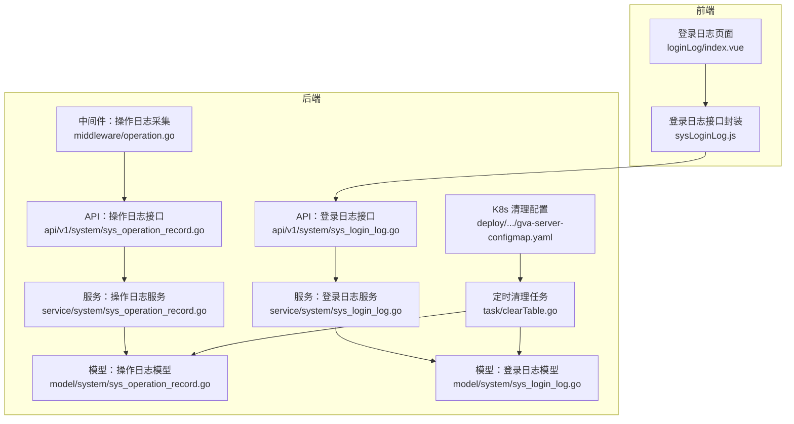
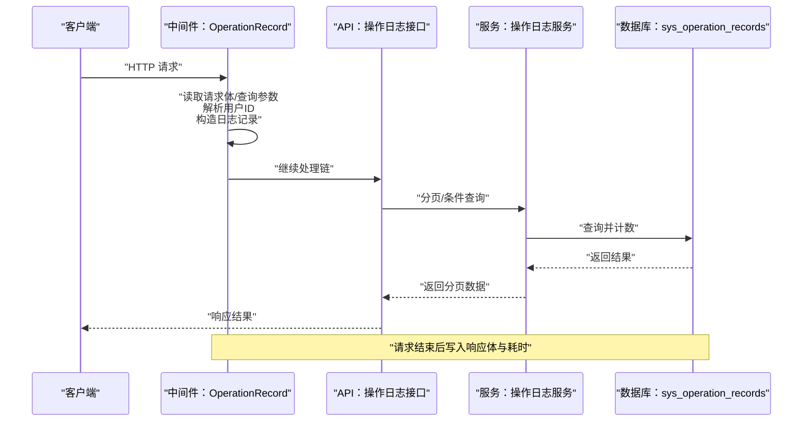
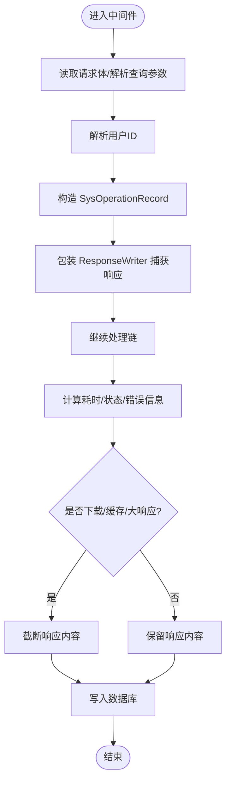
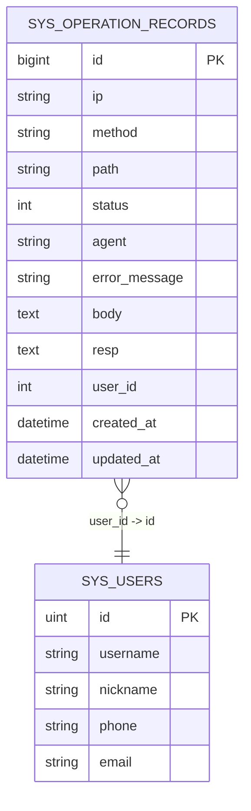
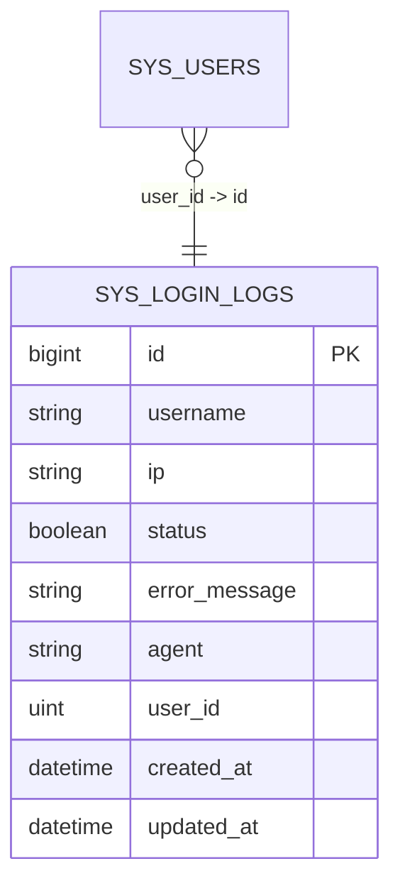
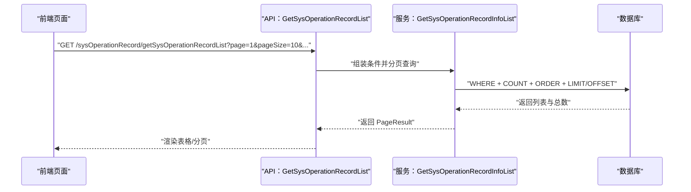
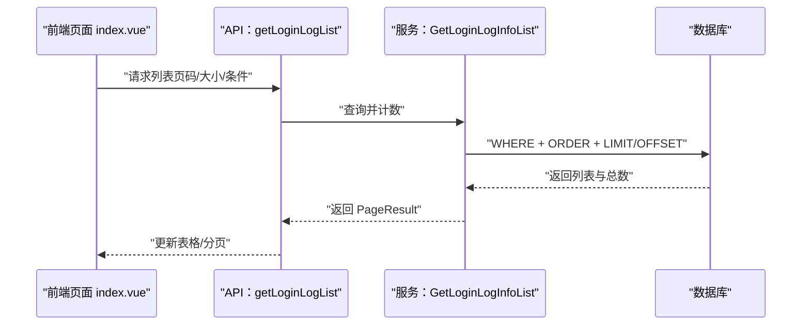
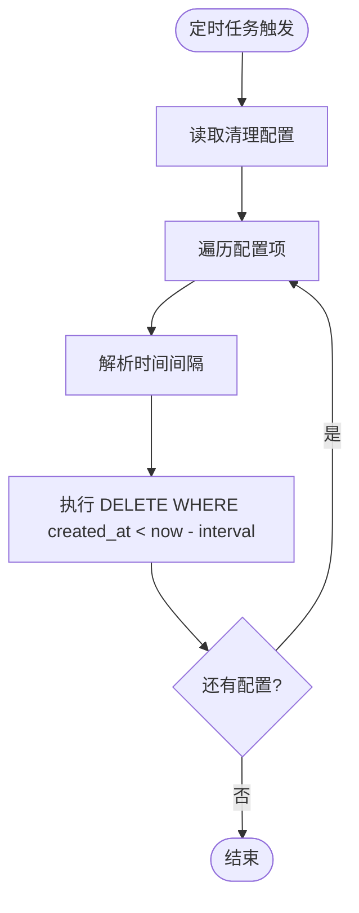
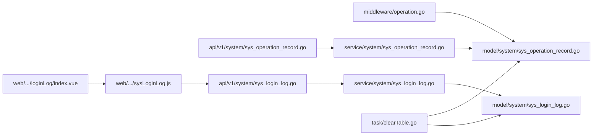

# 操作日志服务

<cite>
**本文引用的文件**
- [server/middleware/operation.go](file://server/middleware/operation.go)
- [server/model/system/sys_operation_record.go](file://server/model/system/sys_operation_record.go)
- [server/service/system/sys_operation_record.go](file://server/service/system/sys_operation_record.go)
- [server/api/v1/system/sys_operation_record.go](file://server/api/v1/system/sys_operation_record.go)
- [server/model/system/sys_login_log.go](file://server/model/system/sys_login_log.go)
- [server/service/system/sys_login_log.go](file://server/service/system/sys_login_log.go)
- [server/api/v1/system/sys_login_log.go](file://server/api/v1/system/sys_login_log.go)
- [web/src/view/systemTools/loginLog/index.vue](file://web/src/view/systemTools/loginLog/index.vue)
- [web/src/api/sysLoginLog.js](file://web/src/api/sysLoginLog.js)
- [server/task/clearTable.go](file://server/task/clearTable.go)
- [deploy/kubernetes/server/gva-server-configmap.yaml](file://deploy/kubernetes/server/gva-server-configmap.yaml)
- [server/config/zap.go](file://server/config/zap.go)
- [server/core/internal/zap_core.go](file://server/core/internal/zap_core.go)
- [server/core/internal/cutter.go](file://server/core/internal/cutter.go)
- [server/docs/swagger.json](file://server/docs/swagger.json)
</cite>

## 目录
1. [简介](#简介)
2. [项目结构](#项目结构)
3. [核心组件](#核心组件)
4. [架构总览](#架构总览)
5. [详细组件分析](#详细组件分析)
6. [依赖分析](#依赖分析)
7. [性能考量](#性能考量)
8. [故障排查指南](#故障排查指南)
9. [结论](#结论)
10. [附录](#附录)

## 简介
本技术文档围绕操作日志服务展开，系统性阐述日志采集、存储、查询与清理策略，覆盖操作记录（系统行为审计）与登录日志（安全监控）两大场景。文档从模型设计、分类管理、查询优化、清理策略到审计应用（操作追踪、安全监控、性能分析）给出完整方案，并提供可落地的管理示例与接口说明。

## 项目结构
日志服务在后端采用“中间件采集 -> 模型存储 -> 服务层聚合 -> API对外”的分层设计；前端通过页面与接口联动实现日志查询与管理。

**图表来源**
- [server/middleware/operation.go:31-119](file://server/middleware/operation.go#L31-L119)
- [server/api/v1/system/sys_operation_record.go:96-124](file://server/api/v1/system/sys_operation_record.go#L96-L124)
- [server/service/system/sys_operation_record.go:61-83](file://server/service/system/sys_operation_record.go#L61-L83)
- [server/model/system/sys_operation_record.go:11-24](file://server/model/system/sys_operation_record.go#L11-L24)
- [server/api/v1/system/sys_login_log.go:63-82](file://server/api/v1/system/sys_login_log.go#L63-L82)
- [server/service/system/sys_login_log.go:34-53](file://server/service/system/sys_login_log.go#L34-L53)
- [server/model/system/sys_login_log.go:7-16](file://server/model/system/sys_login_log.go#L7-L16)
- [server/task/clearTable.go:18-51](file://server/task/clearTable.go#L18-L51)
- [deploy/kubernetes/server/gva-server-configmap.yaml:138-148](file://deploy/kubernetes/server/gva-server-configmap.yaml#L138-L148)

**章节来源**
- [server/middleware/operation.go:31-119](file://server/middleware/operation.go#L31-L119)
- [server/api/v1/system/sys_operation_record.go:96-124](file://server/api/v1/system/sys_operation_record.go#L96-L124)
- [server/service/system/sys_operation_record.go:61-83](file://server/service/system/sys_operation_record.go#L61-L83)
- [server/model/system/sys_operation_record.go:11-24](file://server/model/system/sys_operation_record.go#L11-L24)
- [server/api/v1/system/sys_login_log.go:63-82](file://server/api/v1/system/sys_login_log.go#L63-L82)
- [server/service/system/sys_login_log.go:34-53](file://server/service/system/sys_login_log.go#L34-L53)
- [server/model/system/sys_login_log.go:7-16](file://server/model/system/sys_login_log.go#L7-L16)
- [server/task/clearTable.go:18-51](file://server/task/clearTable.go#L18-L51)
- [deploy/kubernetes/server/gva-server-configmap.yaml:138-148](file://deploy/kubernetes/server/gva-server-configmap.yaml#L138-L148)

## 核心组件
- 中间件采集：在请求进入后记录请求上下文与响应结果，写入操作日志表。
- 模型层：定义操作日志与登录日志的数据结构及关联关系。
- 服务层：提供分页查询、条件过滤、批量删除等能力。
- API 层：暴露查询、删除等接口，配合 Swagger 文档。
- 前端页面：提供登录日志的查询、分页、批量删除等交互。
- 清理策略：定时任务按配置清理过期日志，保障存储健康。

**章节来源**
- [server/middleware/operation.go:31-119](file://server/middleware/operation.go#L31-L119)
- [server/model/system/sys_operation_record.go:11-24](file://server/model/system/sys_operation_record.go#L11-L24)
- [server/service/system/sys_operation_record.go:61-83](file://server/service/system/sys_operation_record.go#L61-L83)
- [server/api/v1/system/sys_operation_record.go:96-124](file://server/api/v1/system/sys_operation_record.go#L96-L124)
- [web/src/view/systemTools/loginLog/index.vue:108-176](file://web/src/view/systemTools/loginLog/index.vue#L108-L176)
- [web/src/api/sysLoginLog.js:19-33](file://web/src/api/sysLoginLog.js#L19-L33)
- [server/task/clearTable.go:18-51](file://server/task/clearTable.go#L18-L51)

## 架构总览
下图展示从请求到落库、再到查询与清理的整体流程。

**图表来源**
- [server/middleware/operation.go:31-119](file://server/middleware/operation.go#L31-L119)
- [server/api/v1/system/sys_operation_record.go:96-124](file://server/api/v1/system/sys_operation_record.go#L96-L124)
- [server/service/system/sys_operation_record.go:61-83](file://server/service/system/sys_operation_record.go#L61-L83)

## 详细组件分析

### 操作日志采集（中间件）
- 采集范围：除 GET 外的请求读取 Body，GET 解析查询参数；对 multipart/form-data 与超长内容进行裁剪保护。
- 用户识别：优先从鉴权声明中获取用户 ID，否则回退到请求头 x-user-id。
- 响应捕获：通过自定义 ResponseWriter 包装器拦截响应体，结合状态码、错误信息、耗时等字段落库。
- 异常处理：捕获私有错误类型并写入错误信息字段。

**图表来源**
- [server/middleware/operation.go:31-119](file://server/middleware/operation.go#L31-L119)

**章节来源**
- [server/middleware/operation.go:31-119](file://server/middleware/operation.go#L31-L119)

### 操作日志模型与关联
- 字段覆盖：请求 IP、方法、路径、状态码、耗时、UA、错误信息、请求/响应体、用户ID，并关联用户表。
- 关联查询：服务层在分页查询时预加载用户信息，便于前端展示。

**图表来源**
- [server/model/system/sys_operation_record.go:11-24](file://server/model/system/sys_operation_record.go#L11-L24)

**章节来源**
- [server/model/system/sys_operation_record.go:11-24](file://server/model/system/sys_operation_record.go#L11-L24)
- [server/service/system/sys_operation_record.go:81-82](file://server/service/system/sys_operation_record.go#L81-L82)

### 登录日志模型与关联
- 字段覆盖：用户名、IP、登录状态、错误信息、UA、用户ID，并关联用户表。
- 查询能力：支持按用户名、状态、分页查询。

**图表来源**
- [server/model/system/sys_login_log.go:7-16](file://server/model/system/sys_login_log.go#L7-L16)

**章节来源**
- [server/model/system/sys_login_log.go:7-16](file://server/model/system/sys_login_log.go#L7-L16)
- [server/service/system/sys_login_log.go:34-53](file://server/service/system/sys_login_log.go#L34-L53)

### 操作日志查询与接口
- 分页查询：支持按方法、路径模糊、状态筛选，按主键倒序。
- 单条查询：按 ID 查询。
- 批量删除：支持按 ID 列表删除。
- Swagger 接口：提供标准文档与示例。

**图表来源**
- [server/api/v1/system/sys_operation_record.go:96-124](file://server/api/v1/system/sys_operation_record.go#L96-L124)
- [server/service/system/sys_operation_record.go:61-83](file://server/service/system/sys_operation_record.go#L61-L83)

**章节来源**
- [server/api/v1/system/sys_operation_record.go:96-124](file://server/api/v1/system/sys_operation_record.go#L96-L124)
- [server/service/system/sys_operation_record.go:61-83](file://server/service/system/sys_operation_record.go#L61-L83)
- [server/docs/swagger.json:5010-5256](file://server/docs/swagger.json#L5010-L5256)

### 登录日志查询与前端交互
- 前端页面：支持分页、搜索、批量删除、重置等。
- 接口封装：统一导出删除、列表、详情等方法。
- 与后端 API 对接：调用后端登录日志接口完成数据拉取与操作。

**图表来源**
- [web/src/view/systemTools/loginLog/index.vue:108-176](file://web/src/view/systemTools/loginLog/index.vue#L108-L176)
- [web/src/api/sysLoginLog.js:19-33](file://web/src/api/sysLoginLog.js#L19-L33)
- [server/api/v1/system/sys_login_log.go:63-82](file://server/api/v1/system/sys_login_log.go#L63-L82)
- [server/service/system/sys_login_log.go:34-53](file://server/service/system/sys_login_log.go#L34-L53)

**章节来源**
- [web/src/view/systemTools/loginLog/index.vue:108-176](file://web/src/view/systemTools/loginLog/index.vue#L108-L176)
- [web/src/api/sysLoginLog.js:19-33](file://web/src/api/sysLoginLog.js#L19-L33)
- [server/api/v1/system/sys_login_log.go:63-82](file://server/api/v1/system/sys_login_log.go#L63-L82)
- [server/service/system/sys_login_log.go:34-53](file://server/service/system/sys_login_log.go#L34-L53)

### 日志清理策略
- 定时任务：按配置周期执行，支持多表清理。
- 清理规则：基于 created_at 字段与时间间隔（如 3 个月、1 周），删除过期记录。
- 配置来源：Kubernetes ConfigMap 中定义清理计划，便于集中管理。

**图表来源**
- [server/task/clearTable.go:18-51](file://server/task/clearTable.go#L18-L51)
- [deploy/kubernetes/server/gva-server-configmap.yaml:138-148](file://deploy/kubernetes/server/gva-server-configmap.yaml#L138-L148)

**章节来源**
- [server/task/clearTable.go:18-51](file://server/task/clearTable.go#L18-L51)
- [deploy/kubernetes/server/gva-server-configmap.yaml:138-148](file://deploy/kubernetes/server/gva-server-configmap.yaml#L138-L148)

### 日志服务在系统审计中的作用
- 操作追踪：通过操作日志记录请求路径、方法、状态、耗时、错误信息，定位问题与复盘流程。
- 安全监控：登录日志记录登录状态与错误信息，结合 IP、UA 进行异常登录检测。
- 性能分析：利用耗时字段进行慢请求识别与优化方向指引。
- 合规审计：长期保留与定期清理策略确保合规与成本平衡。

[本节为概念性说明，不直接分析具体文件]

## 依赖分析
- 中间件依赖 Gin 上下文与全局日志/数据库实例，负责请求前后钩子与响应拦截。
- 服务层依赖 GORM 进行条件查询、分页与计数。
- API 层依赖服务层与统一响应封装。
- 前端页面依赖接口封装与 Element Plus 组件。
- 清理任务依赖配置模型与 GORM 执行 SQL。

**图表来源**
- [server/middleware/operation.go:31-119](file://server/middleware/operation.go#L31-L119)
- [server/model/system/sys_operation_record.go:11-24](file://server/model/system/sys_operation_record.go#L11-L24)
- [server/api/v1/system/sys_operation_record.go:96-124](file://server/api/v1/system/sys_operation_record.go#L96-L124)
- [server/service/system/sys_operation_record.go:61-83](file://server/service/system/sys_operation_record.go#L61-L83)
- [server/api/v1/system/sys_login_log.go:63-82](file://server/api/v1/system/sys_login_log.go#L63-L82)
- [server/service/system/sys_login_log.go:34-53](file://server/service/system/sys_login_log.go#L34-L53)
- [web/src/view/systemTools/loginLog/index.vue:108-176](file://web/src/view/systemTools/loginLog/index.vue#L108-L176)
- [web/src/api/sysLoginLog.js:19-33](file://web/src/api/sysLoginLog.js#L19-L33)
- [server/task/clearTable.go:18-51](file://server/task/clearTable.go#L18-L51)

**章节来源**
- [server/middleware/operation.go:31-119](file://server/middleware/operation.go#L31-L119)
- [server/api/v1/system/sys_operation_record.go:96-124](file://server/api/v1/system/sys_operation_record.go#L96-L124)
- [server/service/system/sys_operation_record.go:61-83](file://server/service/system/sys_operation_record.go#L61-L83)
- [server/api/v1/system/sys_login_log.go:63-82](file://server/api/v1/system/sys_login_log.go#L63-L82)
- [server/service/system/sys_login_log.go:34-53](file://server/service/system/sys_login_log.go#L34-L53)
- [web/src/view/systemTools/loginLog/index.vue:108-176](file://web/src/view/systemTools/loginLog/index.vue#L108-L176)
- [web/src/api/sysLoginLog.js:19-33](file://web/src/api/sysLoginLog.js#L19-L33)
- [server/task/clearTable.go:18-51](file://server/task/clearTable.go#L18-L51)

## 性能考量
- 中间件缓冲池：使用 sync.Pool 与固定缓冲区减少内存分配，降低高并发下的 GC 压力。
- 响应拦截：仅在必要时截断响应体，避免对大文件下载造成额外负担。
- 查询优化：分页查询使用 COUNT + LIMIT/OFFSET，建议在高频字段建立索引（如 created_at、user_id、status）。
- 清理策略：定期清理过期数据，避免表膨胀影响查询性能。

**章节来源**
- [server/middleware/operation.go:22-29](file://server/middleware/operation.go#L22-L29)
- [server/middleware/operation.go:101-114](file://server/middleware/operation.go#L101-L114)
- [server/service/system/sys_operation_record.go:61-83](file://server/service/system/sys_operation_record.go#L61-L83)
- [server/task/clearTable.go:18-51](file://server/task/clearTable.go#L18-L51)

## 故障排查指南
- 中间件写入失败：检查数据库连接与表结构，确认字段长度与类型匹配。
- 查询无结果：确认查询条件与分页参数，检查索引是否生效。
- 清理任务报错：核对配置的时间间隔格式与符号，确保非负；检查数据库权限。
- 日志文件清理：确认日志保留天数配置与目录权限，避免清理失败。

**章节来源**
- [server/middleware/operation.go:115-117](file://server/middleware/operation.go#L115-L117)
- [server/service/system/sys_operation_record.go:77-82](file://server/service/system/sys_operation_record.go#L77-L82)
- [server/task/clearTable.go:38-49](file://server/task/clearTable.go#L38-L49)
- [server/config/zap.go:17](file://server/config/zap.go#L17)

## 结论
本操作日志服务通过中间件采集、模型存储、服务聚合与 API 对外，形成完整的审计闭环；结合登录日志与定时清理策略，既能满足安全监控与合规要求，又能控制存储成本与查询性能。建议在生产环境按需启用中间件、完善索引、配置合理的清理周期，并持续监控日志质量与系统负载。

## 附录
- 日志模型字段说明（摘自模型定义）：请求 IP、方法、路径、状态码、耗时、UA、错误信息、请求/响应体、用户ID、创建/更新时间。
- 清理配置示例：sys_operation_records 按 created_at 清理超过 2160 小时（约 90 天）的历史记录；jwt_blacklists 按 168 小时（1 周）清理。

**章节来源**
- [server/model/system/sys_operation_record.go:11-24](file://server/model/system/sys_operation_record.go#L11-L24)
- [server/model/system/sys_login_log.go:7-16](file://server/model/system/sys_login_log.go#L7-L16)
- [deploy/kubernetes/server/gva-server-configmap.yaml:145-146](file://deploy/kubernetes/server/gva-server-configmap.yaml#L145-L146)