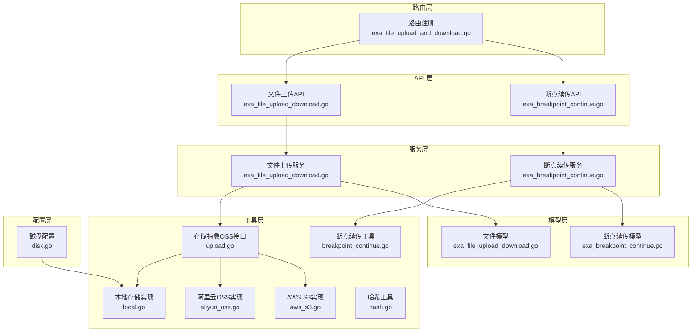
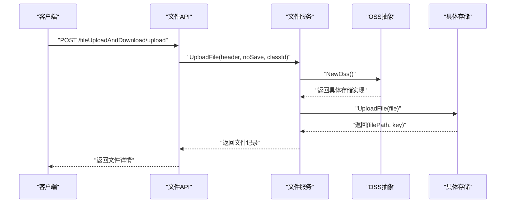
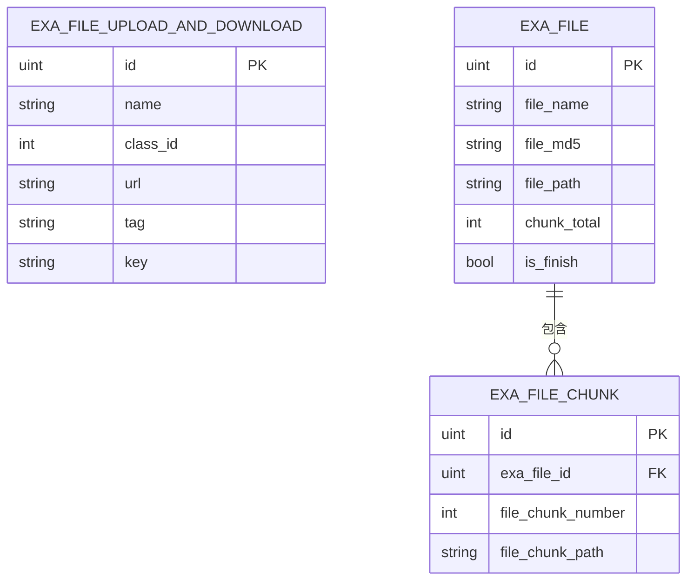
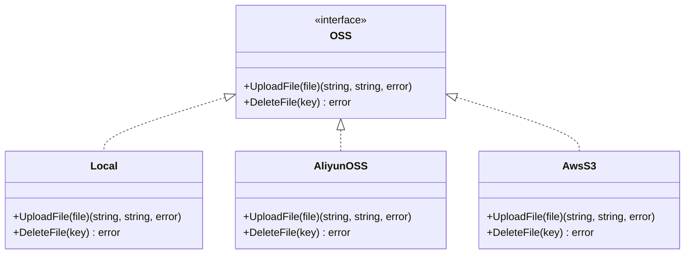
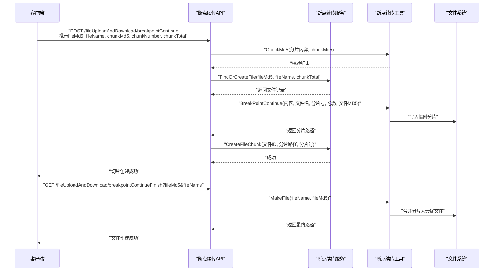
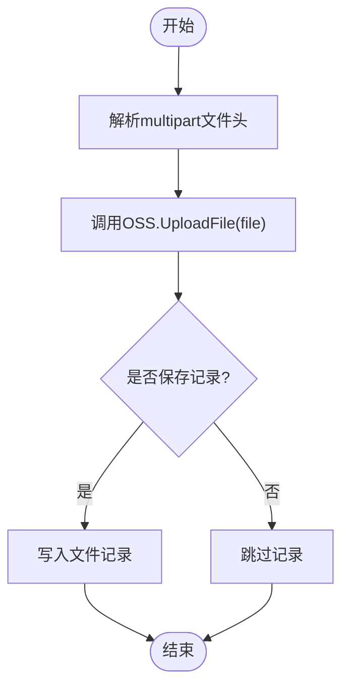
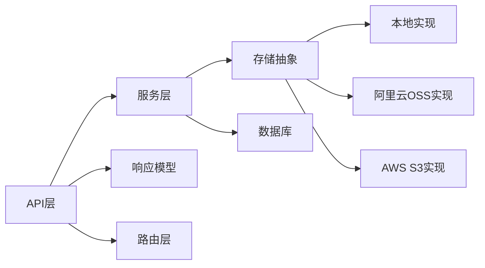

# 文件管理服务

<cite>
**本文引用的文件**
- [exa_file_upload_download.go](file://server/model/example/exa_file_upload_download.go)
- [exa_breakpoint_continue.go](file://server/model/example/exa_breakpoint_continue.go)
- [exa_file_upload_download.go](file://server/api/v1/example/exa_file_upload_download.go)
- [exa_breakpoint_continue.go](file://server/api/v1/example/exa_breakpoint_continue.go)
- [exa_file_upload_download.go](file://server/service/example/exa_file_upload_download.go)
- [exa_breakpoint_continue.go](file://server/service/example/exa_breakpoint_continue.go)
- [exa_file_upload_and_download.go](file://server/router/example/exa_file_upload_and_download.go)
- [upload.go](file://server/utils/upload/upload.go)
- [local.go](file://server/utils/upload/local.go)
- [aliyun_oss.go](file://server/utils/upload/aliyun_oss.go)
- [aws_s3.go](file://server/utils/upload/aws_s3.go)
- [breakpoint_continue.go](file://server/utils/breakpoint_continue.go)
- [hash.go](file://server/utils/hash.go)
- [exa_file_upload_download.go](file://server/model/example/response/exa_file_upload_download.go)
- [exa_file_upload_and_downloads.go](file://server/model/example/request/exa_file_upload_and_downloads.go)
- [disk.go](file://server/config/disk.go)
</cite>

## 目录
1. [简介](#简介)
2. [项目结构](#项目结构)
3. [核心组件](#核心组件)
4. [架构总览](#架构总览)
5. [详细组件分析](#详细组件分析)
6. [依赖分析](#依赖分析)
7. [性能考量](#性能考量)
8. [故障排查指南](#故障排查指南)
9. [结论](#结论)
10. [附录](#附录)

## 简介
本文件管理服务基于 Gin-Vue-Admin 项目，提供文件上传、下载、断点续传、文件列表查询与删除等功能。系统通过统一的存储抽象层对接多种后端存储（本地磁盘、阿里云 OSS、AWS S3 等），并内置断点续传的切片校验与合并机制。本文档从架构、数据模型、处理流程、安全与性能等方面进行深入解析，并给出典型场景的操作示例。

## 项目结构
文件管理相关代码主要分布在以下层次：
- API 层：对外暴露文件上传、断点续传、列表查询、删除等接口
- 服务层：封装业务逻辑，协调存储与数据库
- 工具层：存储抽象、断点续传工具、哈希工具
- 模型层：文件与切片的数据模型
- 路由层：接口路由注册
- 配置层：存储类型与本地磁盘挂载点配置

图表来源
- [exa_file_upload_download.go:1-136](file://server/api/v1/example/exa_file_upload_download.go#L1-L136)
- [exa_breakpoint_continue.go:1-157](file://server/api/v1/example/exa_breakpoint_continue.go#L1-L157)
- [exa_file_upload_download.go:1-131](file://server/service/example/exa_file_upload_download.go#L1-L131)
- [exa_breakpoint_continue.go:1-72](file://server/service/example/exa_breakpoint_continue.go#L1-L72)
- [upload.go:1-47](file://server/utils/upload/upload.go#L1-L47)
- [local.go:1-110](file://server/utils/upload/local.go#L1-L110)
- [aliyun_oss.go:1-76](file://server/utils/upload/aliyun_oss.go#L1-L76)
- [aws_s3.go:1-115](file://server/utils/upload/aws_s3.go#L1-L115)
- [breakpoint_continue.go:1-122](file://server/utils/breakpoint_continue.go#L1-L122)
- [exa_file_upload_download.go:1-19](file://server/model/example/exa_file_upload_download.go#L1-L19)
- [exa_breakpoint_continue.go:1-25](file://server/model/example/exa_breakpoint_continue.go#L1-L25)
- [exa_file_upload_and_download.go:1-23](file://server/router/example/exa_file_upload_and_download.go#L1-L23)
- [disk.go:1-10](file://server/config/disk.go#L1-L10)

章节来源
- [exa_file_upload_download.go:1-136](file://server/api/v1/example/exa_file_upload_download.go#L1-L136)
- [exa_breakpoint_continue.go:1-157](file://server/api/v1/example/exa_breakpoint_continue.go#L1-L157)
- [exa_file_upload_download.go:1-131](file://server/service/example/exa_file_upload_download.go#L1-L131)
- [exa_breakpoint_continue.go:1-72](file://server/service/example/exa_breakpoint_continue.go#L1-L72)
- [upload.go:1-47](file://server/utils/upload/upload.go#L1-L47)
- [local.go:1-110](file://server/utils/upload/local.go#L1-L110)
- [aliyun_oss.go:1-76](file://server/utils/upload/aliyun_oss.go#L1-L76)
- [aws_s3.go:1-115](file://server/utils/upload/aws_s3.go#L1-L115)
- [breakpoint_continue.go:1-122](file://server/utils/breakpoint_continue.go#L1-L122)
- [exa_file_upload_download.go:1-19](file://server/model/example/exa_file_upload_download.go#L1-L19)
- [exa_breakpoint_continue.go:1-25](file://server/model/example/exa_breakpoint_continue.go#L1-L25)
- [exa_file_upload_and_download.go:1-23](file://server/router/example/exa_file_upload_and_download.go#L1-L23)
- [disk.go:1-10](file://server/config/disk.go#L1-L10)

## 核心组件
- 文件模型：用于记录文件元数据（名称、分类、URL、标签、唯一键）
- 断点续传模型：用于记录文件整体信息与分片集合
- 存储抽象：统一的 OSS 接口，按配置选择具体实现（本地、七牛、腾讯云 COS、阿里云 OSS、华为 OBS、AWS S3、Cloudflare R2、MinIO）
- 断点续传工具：负责切片写入、完整性校验、合并与清理
- API 与服务：封装上传、查询、删除、断点续传等业务流程

章节来源
- [exa_file_upload_download.go:7-18](file://server/model/example/exa_file_upload_download.go#L7-L18)
- [exa_breakpoint_continue.go:8-24](file://server/model/example/exa_breakpoint_continue.go#L8-L24)
- [upload.go:12-15](file://server/utils/upload/upload.go#L12-L15)
- [breakpoint_continue.go:26-107](file://server/utils/breakpoint_continue.go#L26-L107)

## 架构总览
文件管理服务采用“API -> 服务 -> 工具/存储”的分层架构。API 层负责请求参数绑定与响应封装；服务层负责业务编排与数据持久化；工具层提供存储抽象与断点续传能力；模型层定义数据结构；路由层集中注册接口。

图表来源
- [exa_file_upload_download.go:25-42](file://server/api/v1/example/exa_file_upload_download.go#L25-L42)
- [exa_file_upload_download.go:96-120](file://server/service/example/exa_file_upload_download.go#L96-L120)
- [upload.go:20-46](file://server/utils/upload/upload.go#L20-L46)
- [local.go:31-69](file://server/utils/upload/local.go#L31-L69)

## 详细组件分析

### 文件模型与元数据管理
- 文件模型包含基础字段：名称、分类ID、URL、标签、唯一键；表名为 exa_file_upload_and_downloads
- 断点续传模型包含：文件名、MD5、路径、分片集合、分片总数、是否完成
- 分片模型包含：所属文件ID、分片序号、分片路径

图表来源
- [exa_file_upload_download.go:7-18](file://server/model/example/exa_file_upload_download.go#L7-L18)
- [exa_breakpoint_continue.go:8-24](file://server/model/example/exa_breakpoint_continue.go#L8-L24)

章节来源
- [exa_file_upload_download.go:7-18](file://server/model/example/exa_file_upload_download.go#L7-L18)
- [exa_breakpoint_continue.go:8-24](file://server/model/example/exa_breakpoint_continue.go#L8-L24)

### 存储后端抽象与集成
- 存储抽象接口定义了上传与删除两个方法，工厂函数根据系统配置选择具体实现
- 支持本地、七牛、腾讯云 COS、阿里云 OSS、华为 OBS、AWS S3、Cloudflare R2、MinIO
- 本地存储负责文件写入与删除的安全校验与并发保护
- 阿里云 OSS 与 AWS S3 提供云端对象存储能力

图表来源
- [upload.go:12-15](file://server/utils/upload/upload.go#L12-L15)
- [local.go:20-109](file://server/utils/upload/local.go#L20-L109)
- [aliyun_oss.go:13-59](file://server/utils/upload/aliyun_oss.go#L13-L59)
- [aws_s3.go:20-84](file://server/utils/upload/aws_s3.go#L20-L84)

章节来源
- [upload.go:20-46](file://server/utils/upload/upload.go#L20-L46)
- [local.go:31-109](file://server/utils/upload/local.go#L31-L109)
- [aliyun_oss.go:15-59](file://server/utils/upload/aliyun_oss.go#L15-L59)
- [aws_s3.go:29-84](file://server/utils/upload/aws_s3.go#L29-L84)

### 断点续传机制
- 客户端上传前先计算文件与分片的 MD5 并传递给服务端
- 服务端校验分片完整性，按文件 MD5 创建/定位文件记录
- 分片写入本地临时目录，记录分片信息
- 合并阶段按序读取临时分片并写入最终文件路径
- 支持删除切片与清理临时目录

图表来源
- [exa_breakpoint_continue.go:29-78](file://server/api/v1/example/exa_breakpoint_continue.go#L29-L78)
- [exa_breakpoint_continue.go:111-121](file://server/api/v1/example/exa_breakpoint_continue.go#L111-L121)
- [exa_breakpoint_continue.go:21-50](file://server/service/example/exa_breakpoint_continue.go#L21-L50)
- [breakpoint_continue.go:26-107](file://server/utils/breakpoint_continue.go#L26-L107)

章节来源
- [exa_breakpoint_continue.go:29-121](file://server/api/v1/example/exa_breakpoint_continue.go#L29-L121)
- [exa_breakpoint_continue.go:21-50](file://server/service/example/exa_breakpoint_continue.go#L21-L50)
- [breakpoint_continue.go:26-107](file://server/utils/breakpoint_continue.go#L26-L107)

### 文件上传流程（普通上传）
- 接收 multipart/form-data，提取文件头
- 通过存储抽象选择具体实现进行上传
- 返回文件访问 URL 与唯一键，可选写入数据库记录

图表来源
- [exa_file_upload_download.go:25-42](file://server/api/v1/example/exa_file_upload_download.go#L25-L42)
- [exa_file_upload_download.go:96-120](file://server/service/example/exa_file_upload_download.go#L96-L120)
- [upload.go:20-46](file://server/utils/upload/upload.go#L20-L46)

章节来源
- [exa_file_upload_download.go:25-42](file://server/api/v1/example/exa_file_upload_download.go#L25-L42)
- [exa_file_upload_download.go:96-120](file://server/service/example/exa_file_upload_download.go#L96-L120)

### 文件访问控制与安全验证
- 路由层使用统一鉴权中间件（如 JWT），确保接口访问受控
- 本地存储删除接口对 key 进行路径穿越与非法字符校验
- 断点续传工具对文件名与路径进行路径穿越校验
- 哈希工具提供 MD5 与密码哈希能力，保障数据一致性与安全

章节来源
- [exa_file_upload_and_download.go:9-22](file://server/router/example/exa_file_upload_and_download.go#L9-L22)
- [local.go:82-90](file://server/utils/upload/local.go#L82-L90)
- [breakpoint_continue.go:27-29](file://server/utils/breakpoint_continue.go#L27-L29)
- [hash.go:27-31](file://server/utils/hash.go#L27-L31)

### 大文件处理优化
- 断点续传将大文件拆分为多个小分片，降低网络与内存压力
- 本地存储采用 io.Copy 进行高效文件复制
- MinIO 客户端在配置启用时进行初始化校验，失败直接中断，避免错误配置导致的风险

章节来源
- [breakpoint_continue.go:64-75](file://server/utils/breakpoint_continue.go#L64-L75)
- [local.go:64-68](file://server/utils/upload/local.go#L64-L68)
- [upload.go:37-42](file://server/utils/upload/upload.go#L37-L42)

## 依赖分析
- API 层依赖服务层与响应模型
- 服务层依赖存储抽象与数据库
- 存储抽象依赖具体实现（本地、阿里云、AWS S3 等）
- 断点续传工具独立于存储，仅依赖文件系统
- 路由层集中注册文件相关接口

图表来源
- [exa_file_upload_download.go:1-136](file://server/api/v1/example/exa_file_upload_download.go#L1-L136)
- [exa_file_upload_download.go:1-131](file://server/service/example/exa_file_upload_download.go#L1-L131)
- [upload.go:1-47](file://server/utils/upload/upload.go#L1-L47)
- [local.go:1-110](file://server/utils/upload/local.go#L1-L110)
- [aliyun_oss.go:1-76](file://server/utils/upload/aliyun_oss.go#L1-L76)
- [aws_s3.go:1-115](file://server/utils/upload/aws_s3.go#L1-L115)
- [exa_file_upload_download.go:1-8](file://server/model/example/response/exa_file_upload_download.go#L1-L8)
- [exa_file_upload_and_download.go:1-23](file://server/router/example/exa_file_upload_and_download.go#L1-L23)

章节来源
- [exa_file_upload_download.go:1-136](file://server/api/v1/example/exa_file_upload_download.go#L1-L136)
- [exa_file_upload_download.go:1-131](file://server/service/example/exa_file_upload_download.go#L1-L131)
- [upload.go:1-47](file://server/utils/upload/upload.go#L1-L47)
- [local.go:1-110](file://server/utils/upload/local.go#L1-L110)
- [aliyun_oss.go:1-76](file://server/utils/upload/aliyun_oss.go#L1-L76)
- [aws_s3.go:1-115](file://server/utils/upload/aws_s3.go#L1-L115)
- [exa_file_upload_download.go:1-8](file://server/model/example/response/exa_file_upload_download.go#L1-L8)
- [exa_file_upload_and_download.go:1-23](file://server/router/example/exa_file_upload_and_download.go#L1-L23)

## 性能考量
- 断点续传减少网络波动影响，提升大文件上传成功率
- 本地存储采用 io.Copy，避免重复内存拷贝
- MinIO 初始化失败即中断，避免错误配置带来的运行风险
- 建议：对高并发场景，优先使用云存储（OSS/S3）以获得更好的扩展性与可靠性

## 故障排查指南
- 上传失败：检查存储配置与凭证，确认存储实现初始化是否成功
- 断点续传失败：核对分片 MD5 校验、分片路径与文件名合法性
- 删除失败：确认 key 合法性与路径穿越防护规则
- 合并失败：检查临时分片目录是否存在以及权限问题

章节来源
- [upload.go:37-42](file://server/utils/upload/upload.go#L37-L42)
- [breakpoint_continue.go:27-29](file://server/utils/breakpoint_continue.go#L27-L29)
- [local.go:82-90](file://server/utils/upload/local.go#L82-L90)
- [breakpoint_continue.go:88-107](file://server/utils/breakpoint_continue.go#L88-L107)

## 结论
本文件管理服务通过清晰的分层架构与存储抽象，实现了灵活的文件上传、断点续传与多后端存储支持。结合安全校验与性能优化策略，能够满足中大型应用对文件管理的需求。建议在生产环境中优先采用云存储，并完善监控与告警体系。

## 附录
- 接口示例（路径参考）
  - 上传文件：POST /fileUploadAndDownload/upload
  - 获取文件列表：POST /fileUploadAndDownload/getFileList
  - 删除文件：POST /fileUploadAndDownload/deleteFile
  - 编辑文件名：POST /fileUploadAndDownload/editFileName
  - 断点续传上传：POST /fileUploadAndDownload/breakpointContinue
  - 查询文件：GET /fileUploadAndDownload/findFile
  - 完成分片合并：POST /fileUploadAndDownload/breakpointContinueFinish
  - 删除切片：POST /fileUploadAndDownload/removeChunk
  - 导入URL：POST /fileUploadAndDownload/importURL

章节来源
- [exa_file_upload_and_download.go:9-22](file://server/router/example/exa_file_upload_and_download.go#L9-L22)
- [exa_file_upload_download.go:25-136](file://server/api/v1/example/exa_file_upload_download.go#L25-L136)
- [exa_breakpoint_continue.go:29-157](file://server/api/v1/example/exa_breakpoint_continue.go#L29-L157)