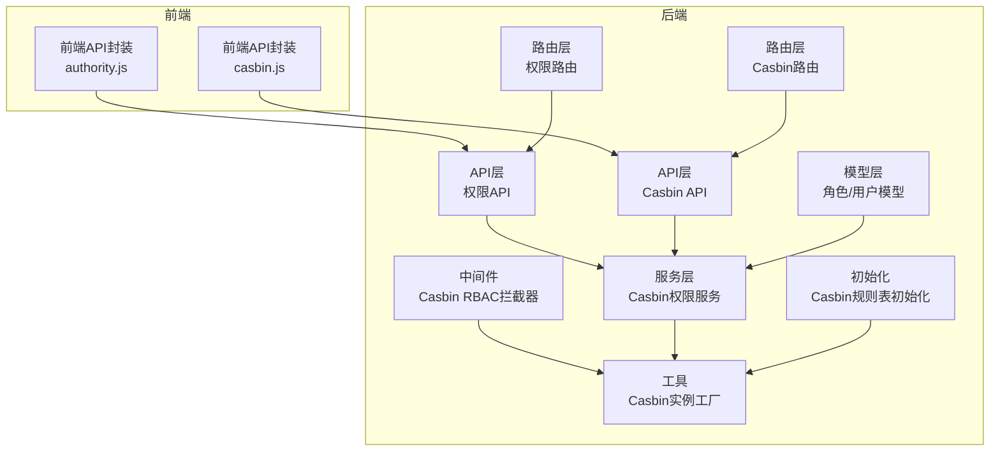
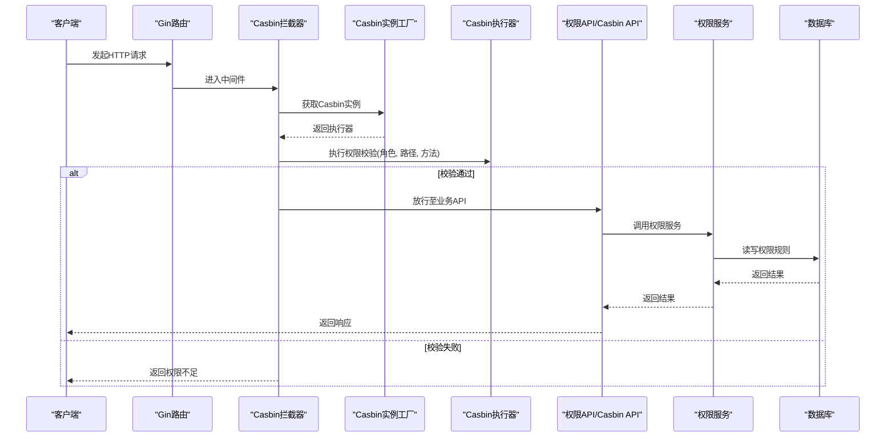
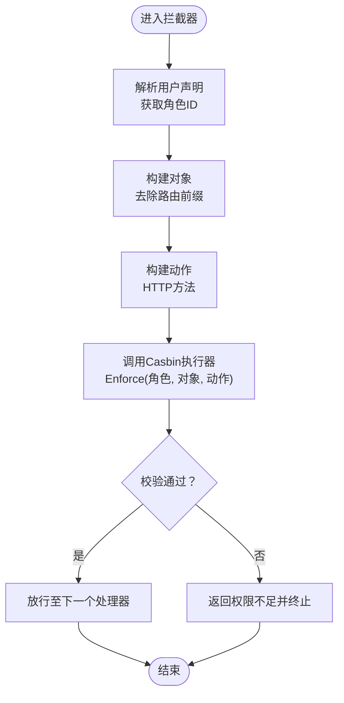
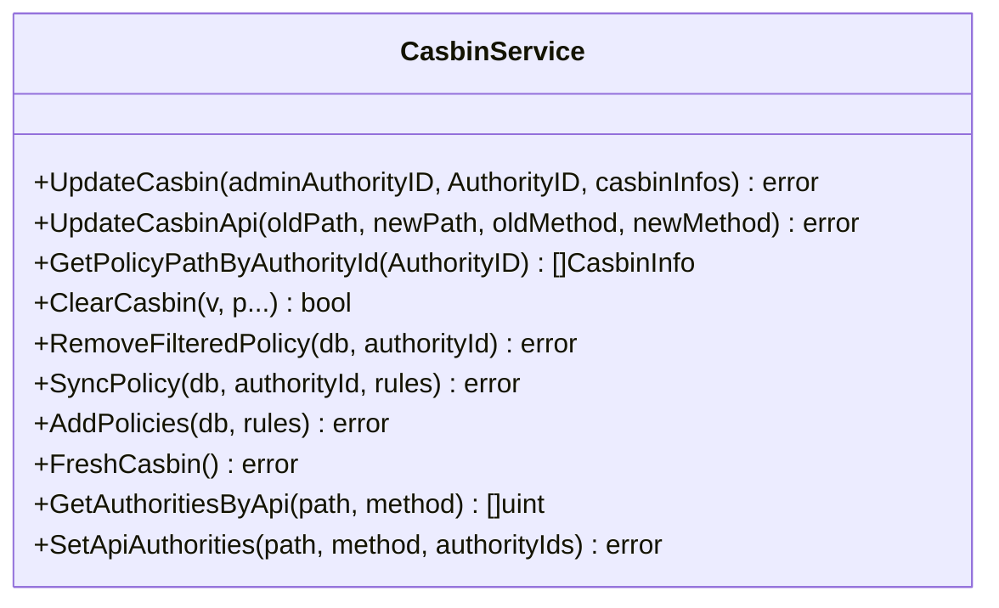
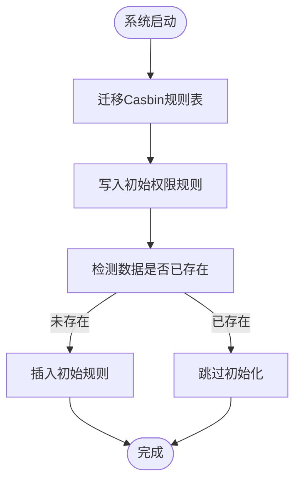
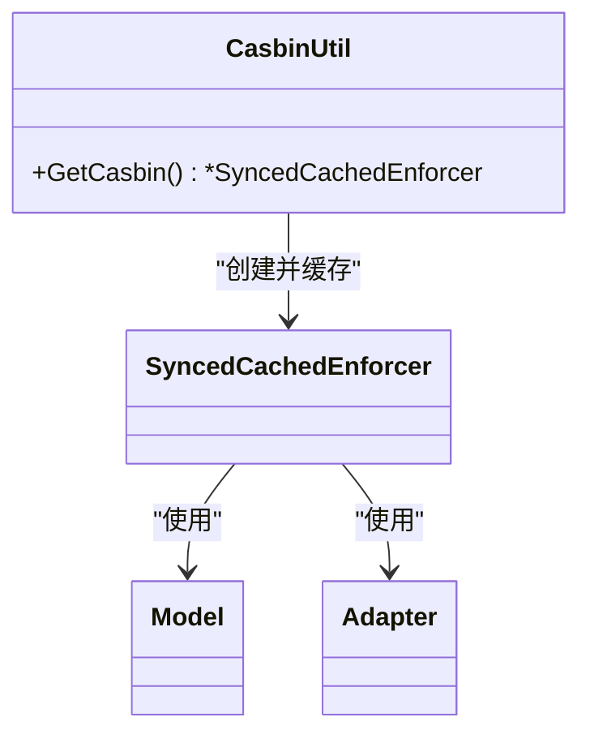
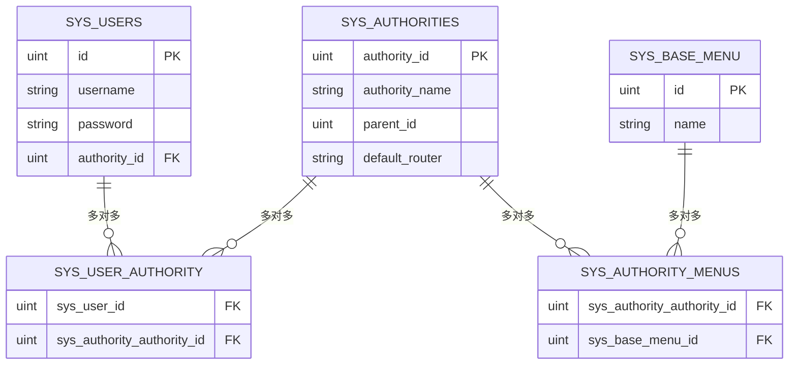
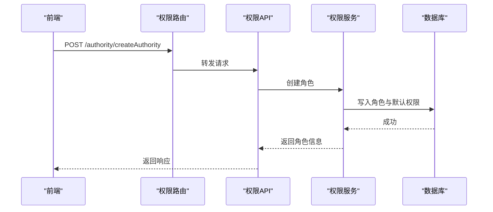
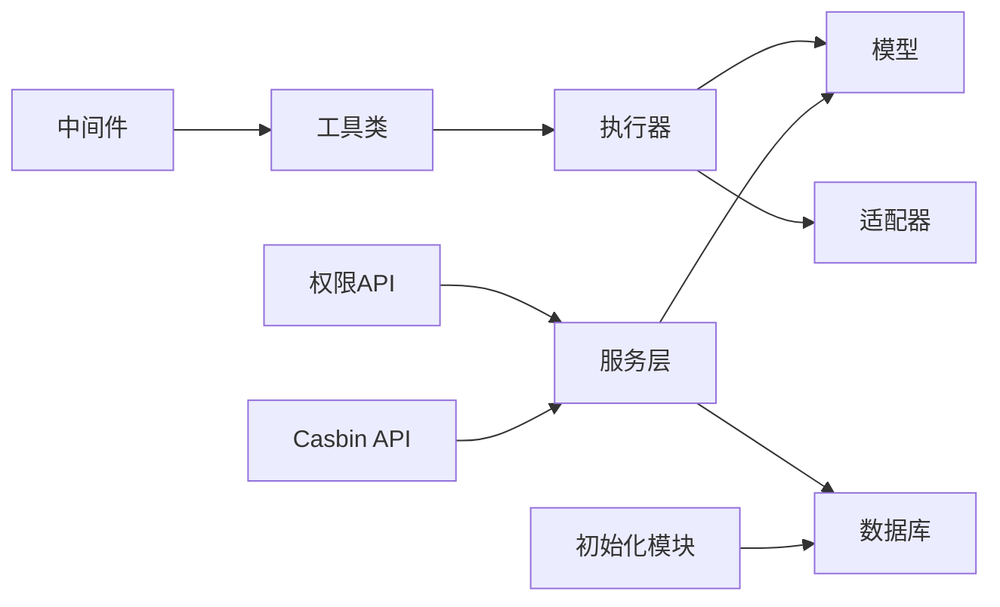

# 权限控制服务

<cite>
**本文引用的文件**
- [中间件：Casbin RBAC拦截器](file://server/middleware/casbin_rbac.go)
- [服务：Casbin权限服务](file://server/service/system/sys_casbin.go)
- [初始化：Casbin规则表初始化](file://server/source/system/casbin.go)
- [工具：Casbin实例工厂](file://server/utils/casbin_util.go)
- [模型：角色实体](file://server/model/system/sys_authority.go)
- [模型：用户实体](file://server/model/system/sys_user.go)
- [路由：权限路由](file://server/router/system/sys_authority.go)
- [路由：Casbin路由](file://server/router/system/sys_casbin.go)
- [API：权限API](file://server/api/v1/system/sys_authority.go)
- [API：Casbin API](file://server/api/v1/system/sys_casbin.go)
- [请求模型：Casbin请求参数](file://server/model/system/request/sys_casbin.go)
- [前端：权限API封装](file://web/src/api/authority.js)
- [前端：Casbin API封装](file://web/src/api/casbin.js)
</cite>

## 目录
1. [简介](#简介)
2. [项目结构](#项目结构)
3. [核心组件](#核心组件)
4. [架构总览](#架构总览)
5. [详细组件分析](#详细组件分析)
6. [依赖关系分析](#依赖关系分析)
7. [性能考量](#性能考量)
8. [故障排查指南](#故障排查指南)
9. [结论](#结论)
10. [附录](#附录)

## 简介
本文件面向权限控制服务，系统性阐述基于RBAC的权限控制机制实现，涵盖角色管理、权限分配、动态权限验证等核心功能。重点说明Casbin集成方案、权限模型设计、权限规则配置，以及权限服务与用户服务、菜单服务的协作关系、权限缓存策略与权限更新机制。同时提供具体的应用场景示例，如角色创建流程、权限分配操作、动态权限验证等。

## 项目结构
权限控制相关代码主要分布在后端服务的中间件、服务层、API层、模型层与初始化模块，前端通过API封装调用后端接口完成权限操作。

**图表来源**
- [中间件：Casbin RBAC拦截器:1-33](file://server/middleware/casbin_rbac.go#L1-L33)
- [服务：Casbin权限服务:1-216](file://server/service/system/sys_casbin.go#L1-L216)
- [初始化：Casbin规则表初始化:1-373](file://server/source/system/casbin.go#L1-L373)
- [工具：Casbin实例工厂:1-53](file://server/utils/casbin_util.go#L1-L53)
- [模型：角色实体:1-24](file://server/model/system/sys_authority.go#L1-L24)
- [模型：用户实体:1-63](file://server/model/system/sys_user.go#L1-L63)
- [路由：权限路由:1-26](file://server/router/system/sys_authority.go#L1-L26)
- [路由：Casbin路由:1-20](file://server/router/system/sys_casbin.go#L1-L20)
- [API：权限API:1-258](file://server/api/v1/system/sys_authority.go#L1-L258)
- [API：Casbin API:1-70](file://server/api/v1/system/sys_casbin.go#L1-L70)
- [前端：权限API封装:1-114](file://web/src/api/authority.js#L1-L114)
- [前端：Casbin API封装:1-33](file://web/src/api/casbin.js#L1-L33)

**章节来源**
- [中间件：Casbin RBAC拦截器:1-33](file://server/middleware/casbin_rbac.go#L1-L33)
- [服务：Casbin权限服务:1-216](file://server/service/system/sys_casbin.go#L1-L216)
- [初始化：Casbin规则表初始化:1-373](file://server/source/system/casbin.go#L1-L373)
- [工具：Casbin实例工厂:1-53](file://server/utils/casbin_util.go#L1-L53)
- [模型：角色实体:1-24](file://server/model/system/sys_authority.go#L1-L24)
- [模型：用户实体:1-63](file://server/model/system/sys_user.go#L1-L63)
- [路由：权限路由:1-26](file://server/router/system/sys_authority.go#L1-L26)
- [路由：Casbin路由:1-20](file://server/router/system/sys_casbin.go#L1-L20)
- [API：权限API:1-258](file://server/api/v1/system/sys_authority.go#L1-L258)
- [API：Casbin API:1-70](file://server/api/v1/system/sys_casbin.go#L1-L70)
- [前端：权限API封装:1-114](file://web/src/api/authority.js#L1-L114)
- [前端：Casbin API封装:1-33](file://web/src/api/casbin.js#L1-L33)

## 核心组件
- 中间件拦截器：在请求进入业务逻辑前，基于当前用户角色、请求路径与方法进行动态权限校验。
- Casbin权限服务：提供角色权限批量更新、策略同步、API变更联动、按角色查询权限等能力。
- 初始化模块：自动迁移Casbin规则表并预置超级管理员、系统管理员、普通用户的初始权限规则。
- 工具类：提供Casbin实例工厂，统一创建带缓存的策略执行器，支持热加载策略。
- 模型层：角色与用户模型，支撑角色-用户多对多关系与角色-菜单多对多关系。
- 路由与API：权限路由与Casbin路由，分别承载角色管理与权限分配的HTTP接口。
- 前端封装：提供权限相关API的前端调用封装，便于在前端侧发起角色与权限操作。

**章节来源**
- [中间件：Casbin RBAC拦截器:12-31](file://server/middleware/casbin_rbac.go#L12-L31)
- [服务：Casbin权限服务:22-74](file://server/service/system/sys_casbin.go#L22-L74)
- [初始化：Casbin规则表初始化:42-360](file://server/source/system/casbin.go#L42-L360)
- [工具：Casbin实例工厂:18-52](file://server/utils/casbin_util.go#L18-L52)
- [模型：角色实体:7-19](file://server/model/system/sys_authority.go#L7-L19)
- [模型：用户实体:20-34](file://server/model/system/sys_user.go#L20-L34)
- [路由：权限路由:10-24](file://server/router/system/sys_authority.go#L10-L24)
- [路由：Casbin路由:10-19](file://server/router/system/sys_casbin.go#L10-L19)
- [API：权限API:26-56](file://server/api/v1/system/sys_authority.go#L26-L56)
- [API：Casbin API:24-44](file://server/api/v1/system/sys_casbin.go#L24-L44)
- [前端：权限API封装:3-39](file://web/src/api/authority.js#L3-L39)
- [前端：Casbin API封装:10-16](file://web/src/api/casbin.js#L10-L16)

## 架构总览
下图展示从请求到权限校验、策略执行与结果返回的整体流程，体现中间件、服务层与Casbin引擎的协作关系。

**图表来源**
- [中间件：Casbin RBAC拦截器:13-31](file://server/middleware/casbin_rbac.go#L13-L31)
- [工具：Casbin实例工厂:18-52](file://server/utils/casbin_util.go#L18-L52)
- [服务：Casbin权限服务:101-112](file://server/service/system/sys_casbin.go#L101-L112)
- [API：Casbin API:24-44](file://server/api/v1/system/sys_casbin.go#L24-L44)

## 详细组件分析

### 中间件：Casbin RBAC拦截器
- 职责：在每个请求进入业务处理前，根据当前用户的角色ID、请求路径与方法，调用Casbin执行器进行权限校验。
- 关键点：
  - 从请求上下文中提取用户声明，获取角色ID。
  - 从URL中解析对象（去除路由前缀），从HTTP方法解析动作。
  - 调用Casbin执行器进行强制决策（Enforce），若失败则返回错误并终止后续处理。
- 适用范围：全局或特定路由组，用于统一的动态权限校验。

**图表来源**
- [中间件：Casbin RBAC拦截器:13-31](file://server/middleware/casbin_rbac.go#L13-L31)

**章节来源**
- [中间件：Casbin RBAC拦截器:12-31](file://server/middleware/casbin_rbac.go#L12-L31)

### 服务：Casbin权限服务
- 职责：提供角色权限的增删改查、批量更新、策略同步、API变更联动、按角色查询权限等能力。
- 关键能力：
  - 更新角色权限：支持严格模式校验、去重、批量添加策略、清理旧策略。
  - API变更联动：当API路径或方法变更时，同步更新策略。
  - 查询权限：按角色ID查询其拥有的API权限列表。
  - 策略同步：清空并重新写入策略，随后加载到内存。
  - 全量覆盖某API的角色集合：事务内先删除再批量插入。
- 性能与一致性：
  - 使用批量添加策略减少多次往返。
  - 提供FreshCasbin以即时加载策略，确保权限变更立即生效。

**图表来源**
- [服务：Casbin权限服务:22-216](file://server/service/system/sys_casbin.go#L22-L216)

**章节来源**
- [服务：Casbin权限服务:26-74](file://server/service/system/sys_casbin.go#L26-L74)
- [服务：Casbin权限服务:82-93](file://server/service/system/sys_casbin.go#L82-L93)
- [服务：Casbin权限服务:101-112](file://server/service/system/sys_casbin.go#L101-L112)
- [服务：Casbin权限服务:169-173](file://server/service/system/sys_casbin.go#L169-L173)
- [服务：Casbin权限服务:175-189](file://server/service/system/sys_casbin.go#L175-L189)
- [服务：Casbin权限服务:191-215](file://server/service/system/sys_casbin.go#L191-L215)

### 初始化：Casbin规则表初始化
- 职责：自动迁移Casbin规则表，并预置多套初始权限规则（超级管理员、系统管理员、普通用户）。
- 关键点：
  - 在系统启动阶段自动执行迁移与数据初始化。
  - 预置大量API的权限规则，确保新环境具备基础权限集。
  - 提供数据插入检测，避免重复初始化。

**图表来源**
- [初始化：Casbin规则表初始化:21-360](file://server/source/system/casbin.go#L21-L360)

**章节来源**
- [初始化：Casbin规则表初始化:42-360](file://server/source/system/casbin.go#L42-L360)

### 工具：Casbin实例工厂
- 职责：提供全局唯一的Casbin执行器实例，支持模型定义、适配器、缓存与热加载。
- 关键点：
  - 使用一次性初始化，避免重复创建。
  - 采用带缓存的执行器，设置过期时间，提升查询性能。
  - 加载策略后可立即生效。

**图表来源**
- [工具：Casbin实例工厂:18-52](file://server/utils/casbin_util.go#L18-L52)

**章节来源**
- [工具：Casbin实例工厂:18-52](file://server/utils/casbin_util.go#L18-L52)

### 模型：角色与用户
- 角色模型：包含角色ID、名称、父角色、默认路由、菜单与用户关联等字段。
- 用户模型：包含用户基本信息、主角色与多角色关联、启用状态等。
- 关联关系：用户与角色多对多；角色与菜单多对多；角色与用户一对多。

**图表来源**
- [模型：角色实体:7-19](file://server/model/system/sys_authority.go#L7-L19)
- [模型：用户实体:20-34](file://server/model/system/sys_user.go#L20-L34)

**章节来源**
- [模型：角色实体:7-19](file://server/model/system/sys_authority.go#L7-L19)
- [模型：用户实体:20-34](file://server/model/system/sys_user.go#L20-L34)

### 路由与API：权限与Casbin
- 权限路由：提供角色创建、删除、更新、复制、设置资源权限、设置角色用户等接口。
- Casbin路由：提供角色权限更新与权限列表查询接口。
- API层：对请求参数进行校验，调用服务层执行业务逻辑，并返回标准响应。

**图表来源**
- [路由：权限路由:10-24](file://server/router/system/sys_authority.go#L10-L24)
- [API：权限API:26-56](file://server/api/v1/system/sys_authority.go#L26-L56)
- [服务：Casbin权限服务:28-54](file://server/service/system/sys_casbin.go#L28-L54)

**章节来源**
- [路由：权限路由:10-24](file://server/router/system/sys_authority.go#L10-L24)
- [路由：Casbin路由:10-19](file://server/router/system/sys_casbin.go#L10-L19)
- [API：权限API:26-56](file://server/api/v1/system/sys_authority.go#L26-L56)
- [API：Casbin API:24-44](file://server/api/v1/system/sys_casbin.go#L24-L44)

### 前端：权限API封装
- 提供角色管理与Casbin权限操作的HTTP请求封装，便于在前端侧直接调用后端接口。

**章节来源**
- [前端：权限API封装:3-39](file://web/src/api/authority.js#L3-L39)
- [前端：Casbin API封装:10-16](file://web/src/api/casbin.js#L10-L16)

## 依赖关系分析
- 中间件依赖工具类获取Casbin执行器，执行器依赖模型与适配器。
- API层依赖服务层，服务层依赖模型与数据库。
- 初始化模块依赖数据库，负责迁移与预置数据。
- 前端通过API封装调用后端接口。

**图表来源**
- [中间件：Casbin RBAC拦截器:13-24](file://server/middleware/casbin_rbac.go#L13-L24)
- [工具：Casbin实例工厂:18-52](file://server/utils/casbin_util.go#L18-L52)
- [服务：Casbin权限服务:22-74](file://server/service/system/sys_casbin.go#L22-L74)
- [初始化：Casbin规则表初始化:21-360](file://server/source/system/casbin.go#L21-L360)

**章节来源**
- [中间件：Casbin RBAC拦截器:13-24](file://server/middleware/casbin_rbac.go#L13-L24)
- [工具：Casbin实例工厂:18-52](file://server/utils/casbin_util.go#L18-L52)
- [服务：Casbin权限服务:22-74](file://server/service/system/sys_casbin.go#L22-L74)
- [初始化：Casbin规则表初始化:21-360](file://server/source/system/casbin.go#L21-L360)

## 性能考量
- 缓存策略：使用带缓存的执行器，设置合理的过期时间，降低重复查询成本。
- 批量操作：权限更新采用批量添加策略，减少数据库往返次数。
- 热加载：权限变更后通过FreshCasbin即时加载策略，保证一致性与实时性。
- 严格模式：开启严格权限校验时，会进行角色合法性校验与API存在性校验，避免越权风险。

[本节为通用性能建议，不直接分析具体文件]

## 故障排查指南
- 权限不足：检查中间件是否正确获取用户角色、路径与方法，确认Casbin策略是否包含对应规则。
- 权限未生效：确认是否调用了FreshCasbin以加载最新策略。
- API变更后权限异常：检查API变更联动逻辑是否执行，确认策略已同步更新。
- 角色删除失败：检查是否存在用户使用该角色或存在子角色，确保满足删除前置条件。

**章节来源**
- [中间件：Casbin RBAC拦截器:24-29](file://server/middleware/casbin_rbac.go#L24-L29)
- [服务：Casbin权限服务:169-173](file://server/service/system/sys_casbin.go#L169-L173)
- [服务：Casbin权限服务:132-178](file://server/service/system/sys_casbin.go#L132-L178)

## 结论
本权限控制服务以Casbin为核心，结合RBAC模型与Gin中间件，在后端实现了细粒度的动态权限校验与灵活的权限管理能力。通过初始化模块预置规则、服务层提供批量更新与同步能力、中间件统一拦截校验，形成从策略定义到执行验证的完整闭环。配合前端API封装，能够快速实现角色创建、权限分配与动态校验等典型场景。

[本节为总结性内容，不直接分析具体文件]

## 附录

### 权限模型设计与规则配置
- 请求定义：sub（主体）、obj（对象）、act（动作）。
- 策略定义：p（角色-资源-动作）。
- 角色定义：g（角色继承关系，此处为扁平角色ID）。
- 匹配器：基于路径匹配规则与HTTP方法匹配。
- 规则来源：数据库适配器，支持热加载与缓存。

**章节来源**
- [工具：Casbin实例工厂:26-41](file://server/utils/casbin_util.go#L26-L41)
- [初始化：Casbin规则表初始化:47-354](file://server/source/system/casbin.go#L47-L354)

### 权限服务与用户服务、菜单服务的协作
- 用户服务：维护用户与角色的多对多关系，角色变更直接影响用户权限。
- 菜单服务：角色与菜单多对多关联，菜单权限通常与API权限一致。
- 协作方式：角色创建时写入默认API权限；角色删除时清理关联；权限更新时同步策略。

**章节来源**
- [模型：用户实体:28-29](file://server/model/system/sys_user.go#L28-L29)
- [模型：角色实体:14-17](file://server/model/system/sys_authority.go#L14-L17)
- [服务：Casbin权限服务:28-54](file://server/service/system/sys_casbin.go#L28-L54)
- [服务：Casbin权限服务:170-178](file://server/service/system/sys_casbin.go#L170-L178)

### 权限缓存策略与更新机制
- 缓存：使用带缓存的执行器，设置过期时间，提升查询性能。
- 更新：权限变更后调用FreshCasbin加载策略，确保即时生效。
- 同步：提供RemoveFilteredPolicy与AddPolicies组合，实现全量覆盖与同步。

**章节来源**
- [工具：Casbin实例工厂:47-50](file://server/utils/casbin_util.go#L47-L50)
- [服务：Casbin权限服务:169-173](file://server/service/system/sys_casbin.go#L169-L173)
- [服务：Casbin权限服务:132-167](file://server/service/system/sys_casbin.go#L132-L167)

### 典型应用场景与示例
- 角色创建流程：前端调用创建接口 → 后端写入角色与默认菜单 → 写入默认API权限 → 刷新Casbin策略。
- 权限分配操作：前端选择API权限 → 后端去重并批量添加策略 → 刷新Casbin策略。
- 动态权限验证：请求进入中间件 → 依据角色ID与请求信息进行Enforce → 通过则放行，否则拒绝。

**章节来源**
- [API：权限API:26-56](file://server/api/v1/system/sys_authority.go#L26-L56)
- [API：Casbin API:24-44](file://server/api/v1/system/sys_casbin.go#L24-L44)
- [中间件：Casbin RBAC拦截器:13-31](file://server/middleware/casbin_rbac.go#L13-L31)
- [前端：权限API封装:3-39](file://web/src/api/authority.js#L3-L39)
- [前端：Casbin API封装:10-16](file://web/src/api/casbin.js#L10-L16)