# 用户管理服务

<cite>
**本文引用的文件**
- [server/model/system/sys_user.go](file://server/model/system/sys_user.go)
- [server/service/system/sys_user.go](file://server/service/system/sys_user.go)
- [server/api/v1/system/sys_user.go](file://server/api/v1/system/sys_user.go)
- [server/router/system/sys_user.go](file://server/router/system/sys_user.go)
- [server/utils/hash.go](file://server/utils/hash.go)
- [server/model/system/request/sys_user.go](file://server/model/system/request/sys_user.go)
- [server/model/system/response/sys_user.go](file://server/model/system/response/sys_user.go)
- [server/utils/jwt.go](file://server/utils/jwt.go)
- [server/middleware/jwt.go](file://server/middleware/jwt.go)
- [server/service/system/sys_authority.go](file://server/service/system/sys_authority.go)
- [server/model/system/sys_authority.go](file://server/model/system/sys_authority.go)
- [server/service/system/sys_login_log.go](file://server/service/system/sys_login_log.go)
- [server/utils/claims.go](file://server/utils/claims.go)
- [server/config/jwt.go](file://server/config/jwt.go)
- [server/global/global.go](file://server/global/global.go)
- [server/model/system/sys_user_authority.go](file://server/model/system/sys_user_authority.go)
</cite>

## 目录
1. [简介](#简介)
2. [项目结构](#项目结构)
3. [核心组件](#核心组件)
4. [架构总览](#架构总览)
5. [详细组件分析](#详细组件分析)
6. [依赖分析](#依赖分析)
7. [性能考量](#性能考量)
8. [故障排查指南](#故障排查指南)
9. [结论](#结论)
10. [附录](#附录)

## 简介
本文件面向“用户管理服务”的技术实现，围绕用户注册、登录认证、用户信息管理、密码加密存储等核心业务，系统性梳理用户模型设计、用户状态管理、权限分配机制，以及与JWT认证、权限控制、操作日志等模块的交互关系。文档同时提供典型用户操作场景的流程图与序列图，帮助读者快速理解并落地实施。

## 项目结构
用户管理服务位于后端工程的系统模块下，采用典型的分层架构：
- API 层：负责接收HTTP请求、参数校验、调用服务层、返回响应。
- 服务层：封装业务逻辑，处理数据访问、权限校验、事务控制。
- 模型层：定义用户、角色、权限关联等数据结构及GORM映射。
- 工具与中间件：提供JWT签发与校验、密码加密、请求上下文解析、登录拦截等能力。
- 日志与配置：记录登录日志、读取JWT配置、全局变量管理。

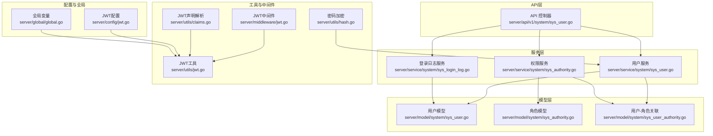

**图表来源**
- [server/api/v1/system/sys_user.go:1-517](file://server/api/v1/system/sys_user.go#L1-L517)
- [server/service/system/sys_user.go:1-337](file://server/service/system/sys_user.go#L1-L337)
- [server/service/system/sys_authority.go:1-413](file://server/service/system/sys_authority.go#L1-L413)
- [server/service/system/sys_login_log.go:1-54](file://server/service/system/sys_login_log.go#L1-L54)
- [server/model/system/sys_user.go:1-63](file://server/model/system/sys_user.go#L1-L63)
- [server/model/system/sys_authority.go:1-24](file://server/model/system/sys_authority.go#L1-L24)
- [server/model/system/sys_user_authority.go:1-12](file://server/model/system/sys_user_authority.go#L1-L12)
- [server/utils/jwt.go:1-106](file://server/utils/jwt.go#L1-L106)
- [server/middleware/jwt.go:1-90](file://server/middleware/jwt.go#L1-L90)
- [server/utils/hash.go:1-32](file://server/utils/hash.go#L1-L32)
- [server/utils/claims.go:1-149](file://server/utils/claims.go#L1-L149)
- [server/config/jwt.go:1-9](file://server/config/jwt.go#L1-L9)
- [server/global/global.go:1-69](file://server/global/global.go#L1-L69)

**章节来源**
- [server/api/v1/system/sys_user.go:1-517](file://server/api/v1/system/sys_user.go#L1-L517)
- [server/service/system/sys_user.go:1-337](file://server/service/system/sys_user.go#L1-L337)
- [server/service/system/sys_authority.go:1-413](file://server/service/system/sys_authority.go#L1-L413)
- [server/service/system/sys_login_log.go:1-54](file://server/service/system/sys_login_log.go#L1-L54)
- [server/model/system/sys_user.go:1-63](file://server/model/system/sys_user.go#L1-L63)
- [server/model/system/sys_authority.go:1-24](file://server/model/system/sys_authority.go#L1-L24)
- [server/model/system/sys_user_authority.go:1-12](file://server/model/system/sys_user_authority.go#L1-L12)
- [server/utils/jwt.go:1-106](file://server/utils/jwt.go#L1-L106)
- [server/middleware/jwt.go:1-90](file://server/middleware/jwt.go#L1-L90)
- [server/utils/hash.go:1-32](file://server/utils/hash.go#L1-L32)
- [server/utils/claims.go:1-149](file://server/utils/claims.go#L1-L149)
- [server/config/jwt.go:1-9](file://server/config/jwt.go#L1-L9)
- [server/global/global.go:1-69](file://server/global/global.go#L1-L69)

## 核心组件
- 用户模型与接口
  - 用户模型包含UUID、用户名、密码、昵称、头像、角色ID、多角色关联、手机号、邮箱、启用状态、配置字段等。
  - 实现统一登录接口，便于在不同场景下复用。
- 用户服务
  - 提供注册、登录、修改密码、分页查询、设置权限、设置多角色、删除用户、设置用户信息、设置自身信息、设置自身配置、获取用户信息、按ID/UUID查询、重置密码等方法。
- API 控制器
  - 对外暴露注册、登录、修改密码、获取用户列表、设置权限、设置多角色、删除用户、设置用户信息、设置自身信息、设置自身配置、获取用户信息、重置密码等接口。
- JWT 与中间件
  - JWT 工具负责生成、解析、刷新令牌；JWT 中间件负责鉴权、黑名单校验、过期刷新。
- 权限服务
  - 角色创建/复制/更新/删除、菜单与按钮授权、数据权限、严格权限范围校验、角色树遍历、角色-用户关联维护等。
- 登录日志服务
  - 记录登录成功/失败日志，支持分页查询与条件筛选。
- 密码加密
  - 使用 bcrypt 对密码进行哈希加密与校验。
- 请求上下文解析
  - 从JWT中解析用户ID、UUID、角色ID、用户名等信息，贯穿于各接口。

**章节来源**
- [server/model/system/sys_user.go:1-63](file://server/model/system/sys_user.go#L1-L63)
- [server/service/system/sys_user.go:1-337](file://server/service/system/sys_user.go#L1-L337)
- [server/api/v1/system/sys_user.go:1-517](file://server/api/v1/system/sys_user.go#L1-L517)
- [server/utils/jwt.go:1-106](file://server/utils/jwt.go#L1-L106)
- [server/middleware/jwt.go:1-90](file://server/middleware/jwt.go#L1-L90)
- [server/service/system/sys_authority.go:1-413](file://server/service/system/sys_authority.go#L1-L413)
- [server/service/system/sys_login_log.go:1-54](file://server/service/system/sys_login_log.go#L1-L54)
- [server/utils/hash.go:1-32](file://server/utils/hash.go#L1-L32)
- [server/utils/claims.go:1-149](file://server/utils/claims.go#L1-L149)

## 架构总览
用户管理服务的端到端交互路径如下：
- 客户端发起HTTP请求至API控制器；
- 控制器进行参数校验与安全拦截（JWT中间件）；
- 控制器调用用户服务执行业务逻辑；
- 用户服务通过GORM访问数据库，必要时调用权限服务与登录日志服务；
- JWT工具生成/刷新令牌并写入响应；
- 响应返回客户端。

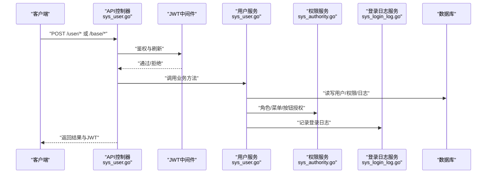

**图表来源**
- [server/api/v1/system/sys_user.go:1-517](file://server/api/v1/system/sys_user.go#L1-L517)
- [server/middleware/jwt.go:1-90](file://server/middleware/jwt.go#L1-L90)
- [server/service/system/sys_user.go:1-337](file://server/service/system/sys_user.go#L1-L337)
- [server/service/system/sys_authority.go:1-413](file://server/service/system/sys_authority.go#L1-L413)
- [server/service/system/sys_login_log.go:1-54](file://server/service/system/sys_login_log.go#L1-L54)

## 详细组件分析

### 用户模型与接口
- 关键字段
  - UUID：用户唯一标识，索引，用于登录声明与跨模块引用。
  - Username：登录名，索引，唯一性约束由注册流程保证。
  - Password：登录密码，仅入库哈希值。
  - AuthorityId/Authority：主角色ID与角色对象，用于默认路由与权限判定。
  - Authorities：多角色关联，支持多角色赋权。
  - Enable：用户状态（1正常/2冻结），登录时校验。
  - OriginSetting：用户界面配置，JSON格式存储。
- 登录接口实现
  - 统一Login接口，便于在不同上下文中复用（如登录、第三方回调等）。

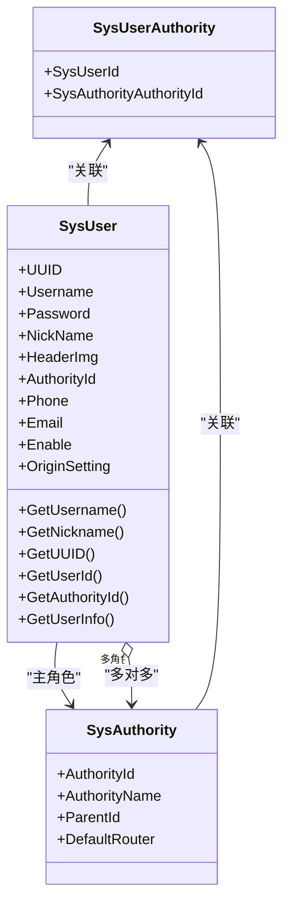

**图表来源**
- [server/model/system/sys_user.go:1-63](file://server/model/system/sys_user.go#L1-L63)
- [server/model/system/sys_authority.go:1-24](file://server/model/system/sys_authority.go#L1-L24)
- [server/model/system/sys_user_authority.go:1-12](file://server/model/system/sys_user_authority.go#L1-L12)

**章节来源**
- [server/model/system/sys_user.go:1-63](file://server/model/system/sys_user.go#L1-L63)
- [server/model/system/sys_authority.go:1-24](file://server/model/system/sys_authority.go#L1-L24)
- [server/model/system/sys_user_authority.go:1-12](file://server/model/system/sys_user_authority.go#L1-L12)

### 用户注册流程
- 输入参数：用户名、密码、昵称、头像、角色ID、手机号、邮箱、启用状态、可选多角色ID。
- 校验步骤：
  - 参数校验（Swagger注解与验证器）。
  - 用户名唯一性检查。
- 加密与落库：
  - 密码使用bcrypt加密。
  - 生成UUID并创建用户记录。
- 返回结果：返回注册成功的用户信息。

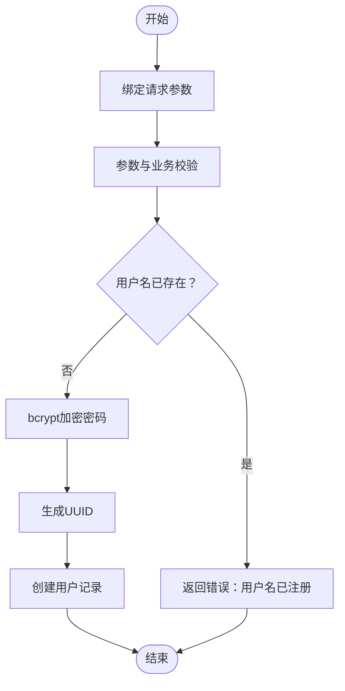

**图表来源**
- [server/api/v1/system/sys_user.go:163-196](file://server/api/v1/system/sys_user.go#L163-L196)
- [server/service/system/sys_user.go:28-38](file://server/service/system/sys_user.go#L28-L38)
- [server/utils/hash.go:9-19](file://server/utils/hash.go#L9-L19)

**章节来源**
- [server/api/v1/system/sys_user.go:163-196](file://server/api/v1/system/sys_user.go#L163-L196)
- [server/service/system/sys_user.go:28-38](file://server/service/system/sys_user.go#L28-L38)
- [server/utils/hash.go:9-19](file://server/utils/hash.go#L9-L19)

### 用户登录与JWT签发
- 输入参数：用户名、密码、可选验证码。
- 校验步骤：
  - 验证码开关与缓存计数控制。
  - 校验用户名存在与密码正确性。
  - 校验用户启用状态。
- JWT签发：
  - 生成CustomClaims并签发token。
  - 支持单点登录与多点登录（Redis存储JWT）。
  - 记录登录成功/失败日志。
- 响应：返回用户信息、token与过期时间戳。

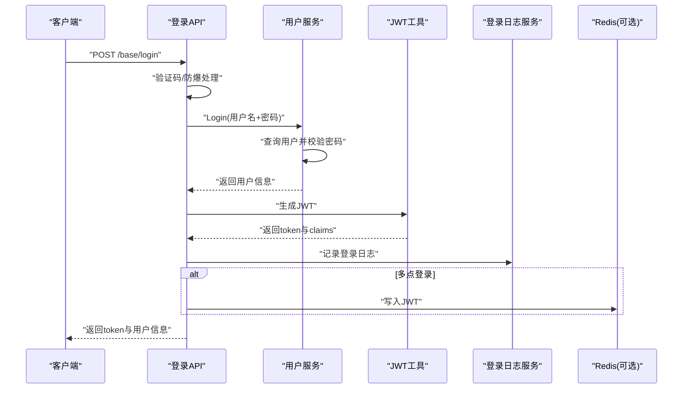

**图表来源**
- [server/api/v1/system/sys_user.go:20-99](file://server/api/v1/system/sys_user.go#L20-L99)
- [server/service/system/sys_user.go:47-61](file://server/service/system/sys_user.go#L47-L61)
- [server/utils/jwt.go:48-52](file://server/utils/jwt.go#L48-L52)
- [server/service/system/sys_login_log.go:14-17](file://server/service/system/sys_login_log.go#L14-L17)

**章节来源**
- [server/api/v1/system/sys_user.go:20-99](file://server/api/v1/system/sys_user.go#L20-L99)
- [server/service/system/sys_user.go:47-61](file://server/service/system/sys_user.go#L47-L61)
- [server/utils/jwt.go:48-52](file://server/utils/jwt.go#L48-L52)
- [server/service/system/sys_login_log.go:14-17](file://server/service/system/sys_login_log.go#L14-L17)

### 修改密码与重置密码
- 修改密码
  - 需持有当前token，校验原密码正确性后更新为新密码。
- 重置密码（管理员）
  - 管理员调用接口直接重置指定用户密码，无需原密码校验。

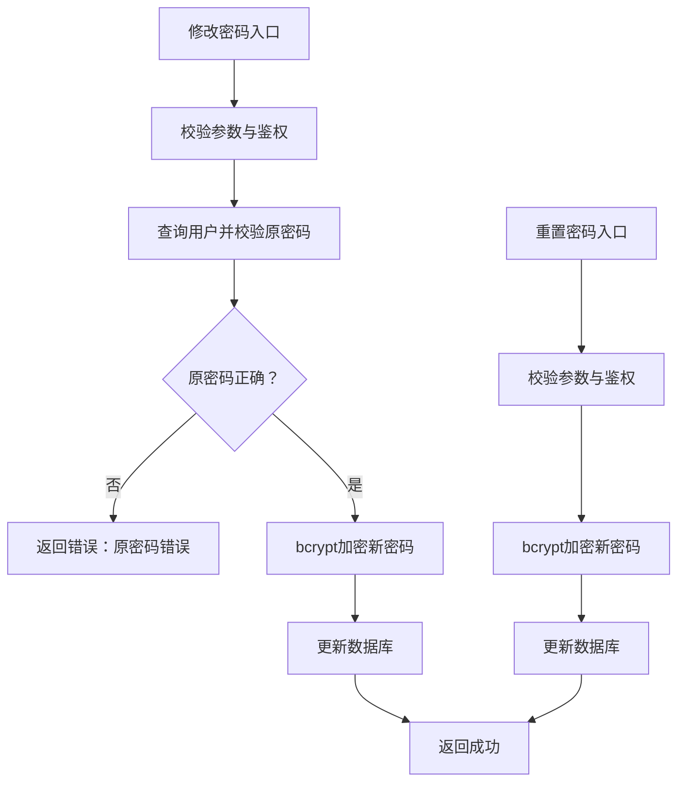

**图表来源**
- [server/api/v1/system/sys_user.go:198-227](file://server/api/v1/system/sys_user.go#L198-L227)
- [server/api/v1/system/sys_user.go:494-516](file://server/api/v1/system/sys_user.go#L494-L516)
- [server/service/system/sys_user.go:69-81](file://server/service/system/sys_user.go#L69-L81)
- [server/service/system/sys_user.go:333-336](file://server/service/system/sys_user.go#L333-L336)
- [server/utils/hash.go:9-19](file://server/utils/hash.go#L9-L19)

**章节来源**
- [server/api/v1/system/sys_user.go:198-227](file://server/api/v1/system/sys_user.go#L198-L227)
- [server/api/v1/system/sys_user.go:494-516](file://server/api/v1/system/sys_user.go#L494-L516)
- [server/service/system/sys_user.go:69-81](file://server/service/system/sys_user.go#L69-L81)
- [server/service/system/sys_user.go:333-336](file://server/service/system/sys_user.go#L333-L336)
- [server/utils/hash.go:9-19](file://server/utils/hash.go#L9-L19)

### 用户信息管理与分页查询
- 设置用户信息
  - 管理员可设置用户昵称、头像、手机、邮箱、启用状态等。
- 设置自身信息
  - 用户仅能修改自身信息。
- 分页查询用户列表
  - 支持按昵称、手机号、用户名、邮箱过滤，支持排序字段与升降序。
- 获取用户信息
  - 支持按UUID获取用户详情，同时确保默认路由一致性。

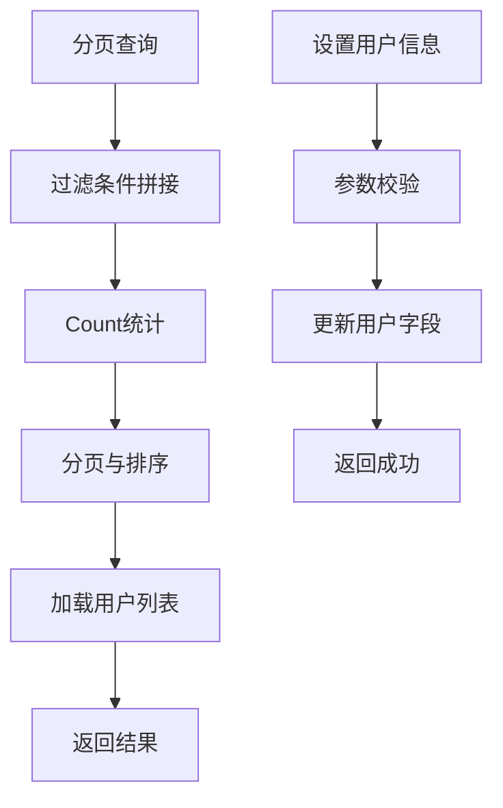

**图表来源**
- [server/api/v1/system/sys_user.go:229-262](file://server/api/v1/system/sys_user.go#L229-L262)
- [server/api/v1/system/sys_user.go:366-412](file://server/api/v1/system/sys_user.go#L366-L412)
- [server/api/v1/system/sys_user.go:414-447](file://server/api/v1/system/sys_user.go#L414-L447)
- [server/api/v1/system/sys_user.go:475-492](file://server/api/v1/system/sys_user.go#L475-L492)
- [server/service/system/sys_user.go:89-132](file://server/service/system/sys_user.go#L89-L132)
- [server/service/system/sys_user.go:248-272](file://server/service/system/sys_user.go#L248-L272)
- [server/service/system/sys_user.go:291-299](file://server/service/system/sys_user.go#L291-L299)

**章节来源**
- [server/api/v1/system/sys_user.go:229-262](file://server/api/v1/system/sys_user.go#L229-L262)
- [server/api/v1/system/sys_user.go:366-412](file://server/api/v1/system/sys_user.go#L366-L412)
- [server/api/v1/system/sys_user.go:414-447](file://server/api/v1/system/sys_user.go#L414-L447)
- [server/api/v1/system/sys_user.go:475-492](file://server/api/v1/system/sys_user.go#L475-L492)
- [server/service/system/sys_user.go:89-132](file://server/service/system/sys_user.go#L89-L132)
- [server/service/system/sys_user.go:248-272](file://server/service/system/sys_user.go#L248-L272)
- [server/service/system/sys_user.go:291-299](file://server/service/system/sys_user.go#L291-L299)

### 权限分配与角色管理
- 单角色切换
  - 校验目标角色是否包含默认路由，再更新用户主角色。
- 多角色赋权
  - 事务内先清空旧关联，再批量写入新关联，最后更新主角色。
- 角色服务
  - 角色创建/复制/更新/删除、菜单与按钮授权、数据权限、严格权限范围校验、角色树遍历、角色-用户关联维护等。

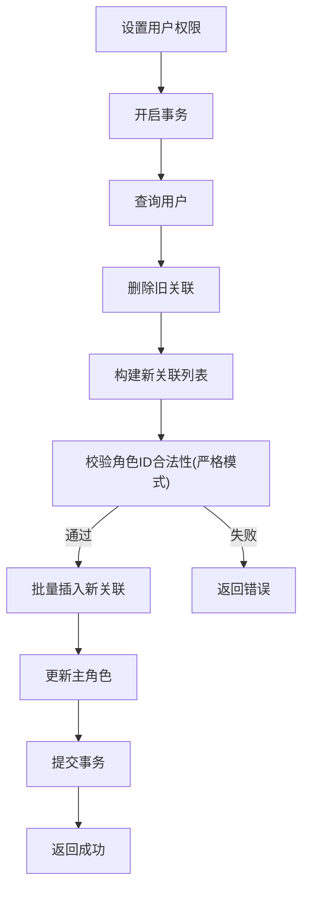

**图表来源**
- [server/api/v1/system/sys_user.go:264-303](file://server/api/v1/system/sys_user.go#L264-L303)
- [server/api/v1/system/sys_user.go:305-329](file://server/api/v1/system/sys_user.go#L305-L329)
- [server/service/system/sys_user.go:140-181](file://server/service/system/sys_user.go#L140-L181)
- [server/service/system/sys_user.go:189-222](file://server/service/system/sys_user.go#L189-L222)
- [server/service/system/sys_authority.go:239-258](file://server/service/system/sys_authority.go#L239-L258)

**章节来源**
- [server/api/v1/system/sys_user.go:264-303](file://server/api/v1/system/sys_user.go#L264-L303)
- [server/api/v1/system/sys_user.go:305-329](file://server/api/v1/system/sys_user.go#L305-L329)
- [server/service/system/sys_user.go:140-181](file://server/service/system/sys_user.go#L140-L181)
- [server/service/system/sys_user.go:189-222](file://server/service/system/sys_user.go#L189-L222)
- [server/service/system/sys_authority.go:239-258](file://server/service/system/sys_authority.go#L239-L258)

### 用户状态管理与删除
- 启用状态
  - 登录时校验Enable字段，冻结用户无法登录。
- 删除用户
  - 事务内删除用户及其所有角色关联，防止脏数据。
- 自身保护
  - 禁止删除当前登录用户。

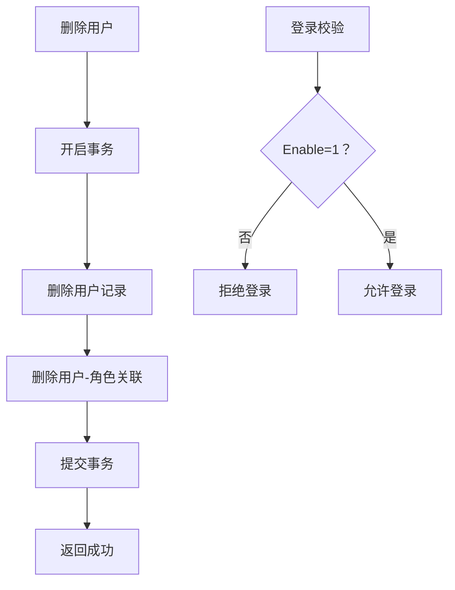

**图表来源**
- [server/api/v1/system/sys_user.go:331-364](file://server/api/v1/system/sys_user.go#L331-L364)
- [server/service/system/sys_user.go:230-240](file://server/service/system/sys_user.go#L230-L240)
- [server/api/v1/system/sys_user.go:82-97](file://server/api/v1/system/sys_user.go#L82-L97)

**章节来源**
- [server/api/v1/system/sys_user.go:331-364](file://server/api/v1/system/sys_user.go#L331-L364)
- [server/service/system/sys_user.go:230-240](file://server/service/system/sys_user.go#L230-L240)
- [server/api/v1/system/sys_user.go:82-97](file://server/api/v1/system/sys_user.go#L82-L97)

### JWT认证与刷新机制
- JWT工具
  - 生成CustomClaims（含签发人、过期时间、缓冲时间），签发/解析token，支持旧token换新token。
- JWT中间件
  - 校验token有效性、黑名单校验、过期前自动刷新并写回响应头。
- Redis存储
  - 多点登录场景下，将最新JWT存入Redis并设置过期时间，便于黑名单与并发控制。

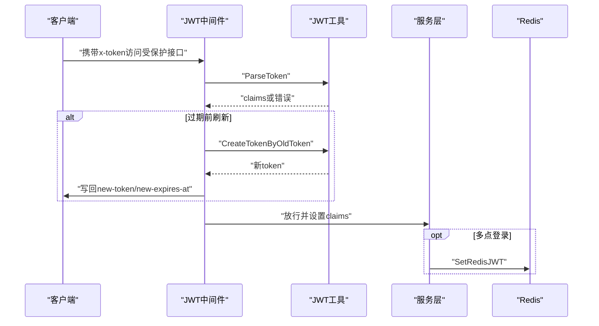

**图表来源**
- [server/middleware/jwt.go:16-78](file://server/middleware/jwt.go#L16-L78)
- [server/utils/jwt.go:48-60](file://server/utils/jwt.go#L48-L60)
- [server/utils/jwt.go:95-105](file://server/utils/jwt.go#L95-L105)
- [server/utils/claims.go:137-148](file://server/utils/claims.go#L137-L148)

**章节来源**
- [server/middleware/jwt.go:16-78](file://server/middleware/jwt.go#L16-L78)
- [server/utils/jwt.go:48-60](file://server/utils/jwt.go#L48-L60)
- [server/utils/jwt.go:95-105](file://server/utils/jwt.go#L95-L105)
- [server/utils/claims.go:137-148](file://server/utils/claims.go#L137-L148)

### 登录日志记录
- 登录成功/失败均记录日志，包含用户名、IP、UA、状态、错误信息、用户ID等。
- 支持按条件分页查询与导出。

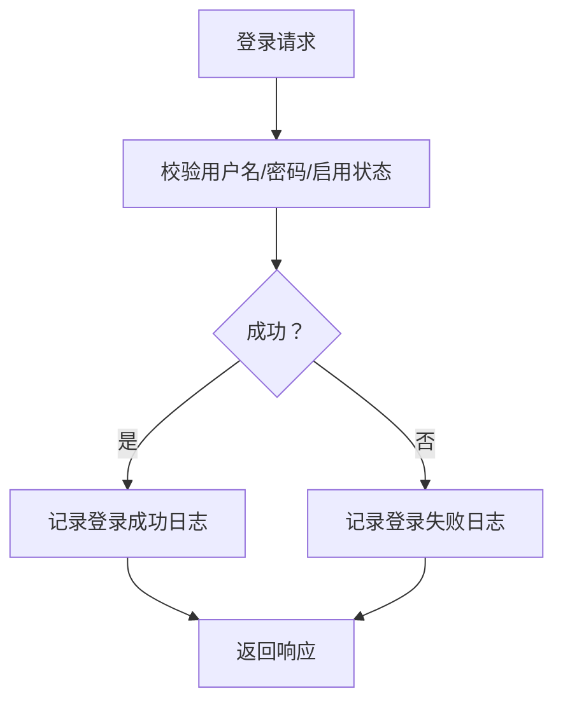

**图表来源**
- [server/api/v1/system/sys_user.go:55-96](file://server/api/v1/system/sys_user.go#L55-L96)
- [server/service/system/sys_login_log.go:14-53](file://server/service/system/sys_login_log.go#L14-L53)

**章节来源**
- [server/api/v1/system/sys_user.go:55-96](file://server/api/v1/system/sys_user.go#L55-L96)
- [server/service/system/sys_login_log.go:14-53](file://server/service/system/sys_login_log.go#L14-L53)

## 依赖分析
- 组件耦合
  - API 控制器依赖用户服务、权限服务、登录日志服务、JWT工具与中间件。
  - 用户服务依赖模型层（SysUser、SysUserAuthority）、权限服务、JWT工具、密码加密工具。
  - 权限服务依赖模型层（SysAuthority、SysUserAuthority）与Casbin策略管理。
  - JWT中间件依赖JWT工具与全局Redis/JWT配置。
- 外部依赖
  - GORM：数据库访问与事务控制。
  - Redis：JWT存储与并发控制。
  - bcrypt：密码加密与校验。
  - zap：日志记录。
- 循环依赖
  - 代码层面未见循环导入；服务层通过接口与工具解耦，避免强耦合。

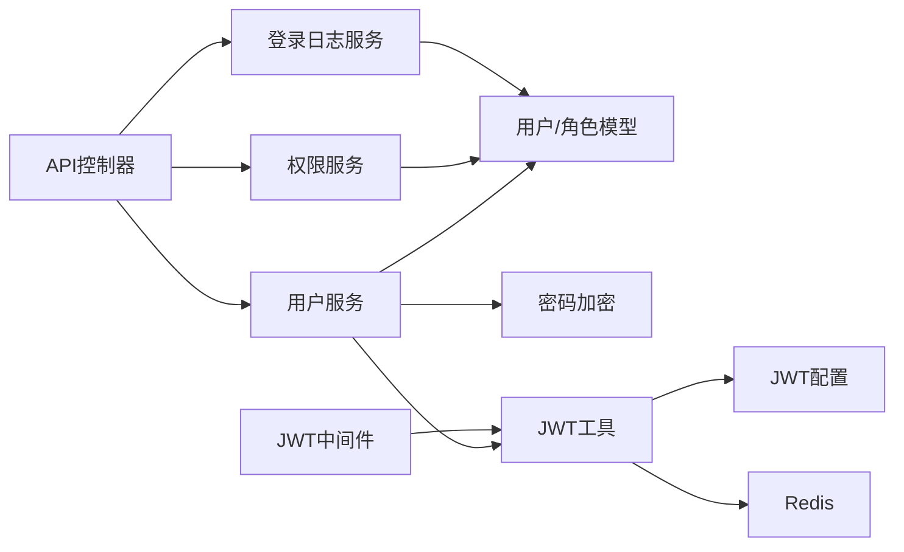

**图表来源**
- [server/api/v1/system/sys_user.go:1-517](file://server/api/v1/system/sys_user.go#L1-L517)
- [server/service/system/sys_user.go:1-337](file://server/service/system/sys_user.go#L1-L337)
- [server/service/system/sys_authority.go:1-413](file://server/service/system/sys_authority.go#L1-L413)
- [server/service/system/sys_login_log.go:1-54](file://server/service/system/sys_login_log.go#L1-L54)
- [server/utils/jwt.go:1-106](file://server/utils/jwt.go#L1-L106)
- [server/middleware/jwt.go:1-90](file://server/middleware/jwt.go#L1-L90)
- [server/utils/hash.go:1-32](file://server/utils/hash.go#L1-L32)
- [server/config/jwt.go:1-9](file://server/config/jwt.go#L1-L9)
- [server/global/global.go:1-69](file://server/global/global.go#L1-L69)

**章节来源**
- [server/api/v1/system/sys_user.go:1-517](file://server/api/v1/system/sys_user.go#L1-L517)
- [server/service/system/sys_user.go:1-337](file://server/service/system/sys_user.go#L1-L337)
- [server/service/system/sys_authority.go:1-413](file://server/service/system/sys_authority.go#L1-L413)
- [server/service/system/sys_login_log.go:1-54](file://server/service/system/sys_login_log.go#L1-L54)
- [server/utils/jwt.go:1-106](file://server/utils/jwt.go#L1-L106)
- [server/middleware/jwt.go:1-90](file://server/middleware/jwt.go#L1-L90)
- [server/utils/hash.go:1-32](file://server/utils/hash.go#L1-L32)
- [server/config/jwt.go:1-9](file://server/config/jwt.go#L1-L9)
- [server/global/global.go:1-69](file://server/global/global.go#L1-L69)

## 性能考量
- 密码加密
  - bcrypt成本因子默认，兼顾安全性与性能；如需提升吞吐，可在部署环境调整成本因子。
- 数据库访问
  - 登录与分页查询均使用预加载与索引字段（用户名、UUID、角色ID），建议在高并发场景下开启连接池与慢查询日志。
- JWT刷新
  - 过期前自动刷新减少频繁登录开销；多点登录场景下Redis写入带来额外延迟，建议评估Redis性能与容量。
- 事务控制
  - 权限赋权与删除用户均使用事务，保障一致性；批量写入时注意SQL批次大小与锁竞争。

[本节为通用指导，不直接分析具体文件]

## 故障排查指南
- 登录失败
  - 检查用户名是否存在、密码是否正确、用户是否被冻结。
  - 查看登录日志服务记录的错误信息与IP/UA。
- 验证码错误
  - 核对验证码开关与缓存计数，确认验证码ID与输入一致。
- JWT无效或过期
  - 检查签名密钥、过期时间配置；确认中间件是否正确解析与刷新token。
- 权限切换失败
  - 确认目标角色包含默认路由；严格权限模式下检查角色ID合法性。
- 删除用户报错
  - 确认非自身删除；检查是否存在角色关联未清理。

**章节来源**
- [server/api/v1/system/sys_user.go:55-96](file://server/api/v1/system/sys_user.go#L55-L96)
- [server/service/system/sys_login_log.go:14-53](file://server/service/system/sys_login_log.go#L14-L53)
- [server/middleware/jwt.go:16-78](file://server/middleware/jwt.go#L16-L78)
- [server/service/system/sys_user.go:140-181](file://server/service/system/sys_user.go#L140-L181)
- [server/api/v1/system/sys_user.go:352-356](file://server/api/v1/system/sys_user.go#L352-L356)

## 结论
用户管理服务通过清晰的分层设计与完善的工具链，实现了从注册、登录、权限分配到信息管理的完整闭环。配合JWT认证、严格权限校验与登录日志记录，既满足了易用性也兼顾了安全性与可观测性。建议在生产环境中结合业务规模对密码成本因子、Redis容量与数据库索引进行持续优化。

[本节为总结性内容，不直接分析具体文件]

## 附录
- 路由与控制器
  - 用户相关路由集中在用户模块，包含注册、登录、修改密码、权限设置、信息维护、列表查询、删除等。
- 请求/响应模型
  - 登录、注册、修改密码、重置密码、设置权限、获取用户信息等均有对应的请求/响应结构体，便于前后端契约管理。
- 配置项
  - JWT签名密钥、过期时间、缓冲时间、签发人等配置集中管理，便于统一治理。

**章节来源**
- [server/router/system/sys_user.go:1-29](file://server/router/system/sys_user.go#L1-L29)
- [server/model/system/request/sys_user.go:1-78](file://server/model/system/request/sys_user.go#L1-L78)
- [server/model/system/response/sys_user.go:1-16](file://server/model/system/response/sys_user.go#L1-L16)
- [server/config/jwt.go:1-9](file://server/config/jwt.go#L1-L9)