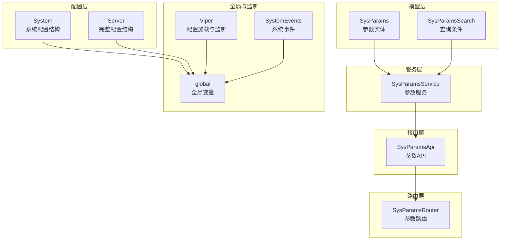
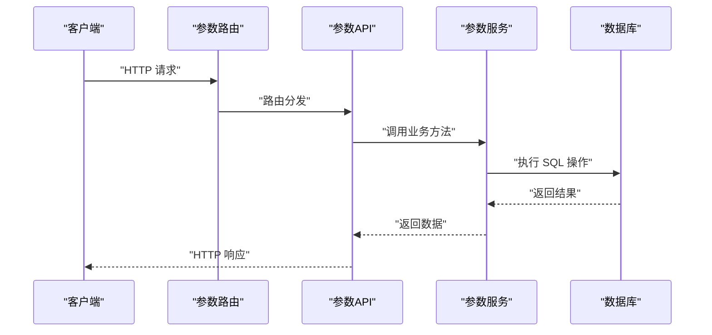
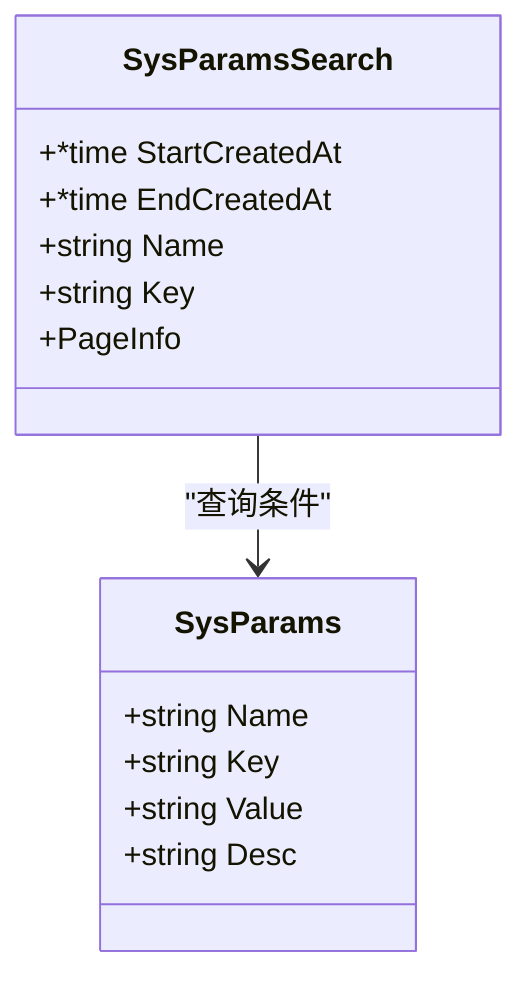
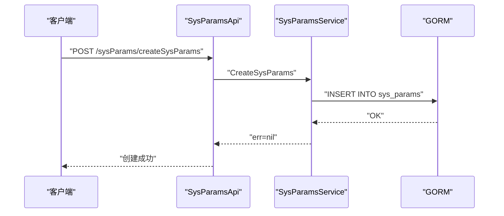
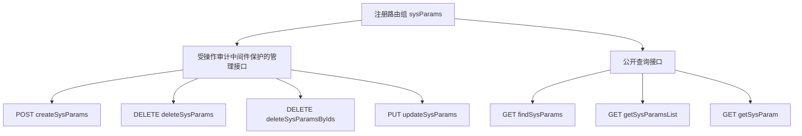
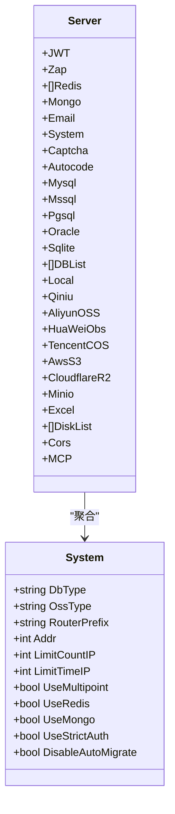
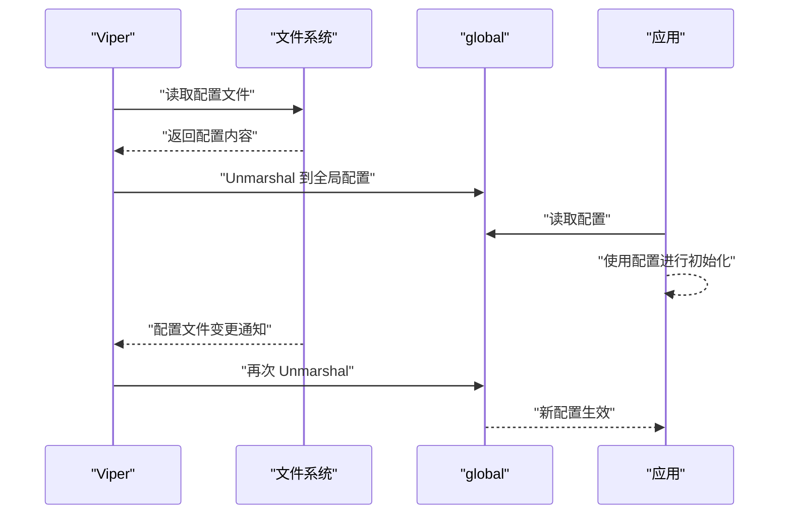
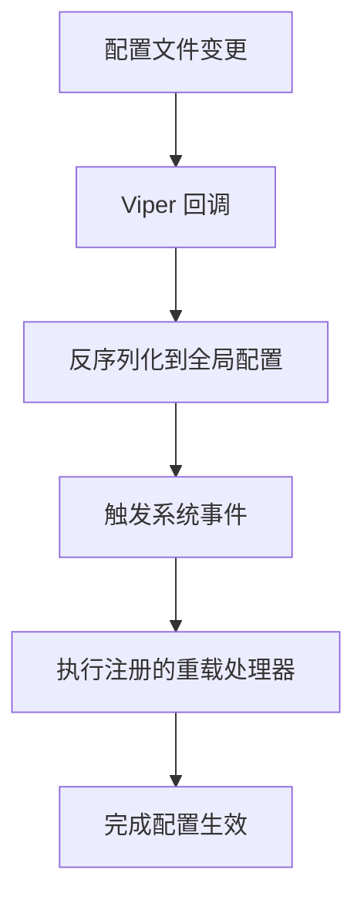
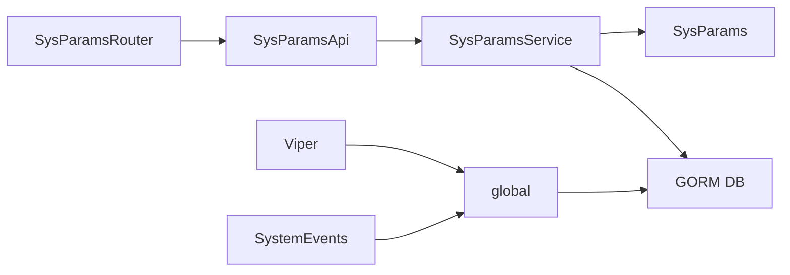

# 系统配置服务

<cite>
**本文档引用的文件**
- [server/model/system/sys_params.go](file://server/model/system/sys_params.go)
- [server/service/system/sys_params.go](file://server/service/system/sys_params.go)
- [server/api/v1/system/sys_params.go](file://server/api/v1/system/sys_params.go)
- [server/router/system/sys_params.go](file://server/router/system/sys_params.go)
- [server/config/system.go](file://server/config/system.go)
- [server/config/config.go](file://server/config/config.go)
- [server/global/global.go](file://server/global/global.go)
- [server/core/viper.go](file://server/core/viper.go)
- [server/model/system/request/sys_params.go](file://server/model/system/request/sys_params.go)
- [server/utils/system_events.go](file://server/utils/system_events.go)
- [server/initialize/init.go](file://server/initialize/init.go)
</cite>

## 目录
1. [简介](#简介)
2. [项目结构](#项目结构)
3. [核心组件](#核心组件)
4. [架构总览](#架构总览)
5. [详细组件分析](#详细组件分析)
6. [依赖分析](#依赖分析)
7. [性能考量](#性能考量)
8. [故障排查指南](#故障排查指南)
9. [结论](#结论)
10. [附录](#附录)

## 简介
本文件系统性梳理“系统配置服务”的设计与实现，重点覆盖以下方面：
- 配置项定义与数据模型
- 配置值存储与持久化
- 配置读取与缓存策略
- 配置分类管理与变更监听机制
- 配置服务在系统中的作用（系统行为控制、功能开关管理、运行时参数调整）
- 实际配置管理示例（创建配置项、修改配置值、配置生效机制）

本服务以“参数表”为核心数据载体，提供参数的增删改查、按 key 查询、分页检索等能力；同时结合全局配置与配置监听机制，支撑系统运行时参数的动态调整。

## 项目结构
围绕系统配置服务的关键文件组织如下：
- 模型层：定义参数实体及其表结构映射
- 服务层：封装参数的 CRUD 与查询逻辑
- API 层：暴露 REST 接口，供前端或管理端调用
- 路由层：注册参数相关路由
- 配置层：系统级配置结构与运行时配置加载
- 全局层：全局变量与并发控制
- 监听与重载：系统事件与配置变更触发重载

图表来源
- [server/model/system/sys_params.go:8-21](file://server/model/system/sys_params.go#L8-L21)
- [server/model/system/request/sys_params.go:8-14](file://server/model/system/request/sys_params.go#L8-L14)
- [server/service/system/sys_params.go:9-83](file://server/service/system/sys_params.go#L9-L83)
- [server/api/v1/system/sys_params.go:12-172](file://server/api/v1/system/sys_params.go#L12-L172)
- [server/router/system/sys_params.go:8-26](file://server/router/system/sys_params.go#L8-L26)
- [server/config/system.go:3-16](file://server/config/system.go#L3-L16)
- [server/config/config.go:3-41](file://server/config/config.go#L3-L41)
- [server/global/global.go:25-42](file://server/global/global.go#L25-L42)
- [server/core/viper.go:16-42](file://server/core/viper.go#L16-L42)
- [server/utils/system_events.go:7-35](file://server/utils/system_events.go#L7-L35)

章节来源
- [server/model/system/sys_params.go:8-21](file://server/model/system/sys_params.go#L8-L21)
- [server/service/system/sys_params.go:9-83](file://server/service/system/sys_params.go#L9-L83)
- [server/api/v1/system/sys_params.go:12-172](file://server/api/v1/system/sys_params.go#L12-L172)
- [server/router/system/sys_params.go:8-26](file://server/router/system/sys_params.go#L8-L26)
- [server/config/system.go:3-16](file://server/config/system.go#L3-L16)
- [server/config/config.go:3-41](file://server/config/config.go#L3-L41)
- [server/global/global.go:25-42](file://server/global/global.go#L25-L42)
- [server/core/viper.go:16-42](file://server/core/viper.go#L16-L42)
- [server/model/system/request/sys_params.go:8-14](file://server/model/system/request/sys_params.go#L8-L14)
- [server/utils/system_events.go:7-35](file://server/utils/system_events.go#L7-L35)
- [server/initialize/init.go:9-16](file://server/initialize/init.go#L9-L16)

## 核心组件
- 参数实体与表结构
  - 参数实体包含名称、键、值、描述等字段，并映射到 sys_params 表。
  - 关键字段具备校验注解，确保必填性。
- 参数服务
  - 提供创建、删除、批量删除、更新、按 ID 查询、分页查询、按 key 查询等方法。
  - 支持条件过滤（时间范围、名称、键名模糊匹配）。
- 参数 API
  - 对外暴露 REST 接口，支持新建、删除、批量删除、更新、按 ID 查询、分页列表、按 key 查询。
- 参数路由
  - 注册受操作审计中间件保护的参数管理路由组，以及公开查询路由组。
- 系统配置结构
  - 定义系统运行期关键配置项（如数据库类型、OSS 类型、端口、限流、认证模式、是否使用 Redis/Mongo 等）。
- 全局配置加载与监听
  - 通过 Viper 加载 YAML 配置文件，支持命令行参数、环境变量与默认路径的优先级。
  - 监听配置文件变化，自动反序列化到全局配置对象。
- 系统事件与重载
  - 提供系统事件注册与触发机制，用于在配置变更后统一触发重载流程。

章节来源
- [server/model/system/sys_params.go:8-21](file://server/model/system/sys_params.go#L8-L21)
- [server/service/system/sys_params.go:11-83](file://server/service/system/sys_params.go#L11-L83)
- [server/api/v1/system/sys_params.go:14-172](file://server/api/v1/system/sys_params.go#L14-L172)
- [server/router/system/sys_params.go:10-25](file://server/router/system/sys_params.go#L10-L25)
- [server/config/system.go:3-16](file://server/config/system.go#L3-L16)
- [server/core/viper.go:16-42](file://server/core/viper.go#L16-L42)
- [server/utils/system_events.go:7-35](file://server/utils/system_events.go#L7-L35)

## 架构总览
系统配置服务采用典型的分层架构：
- 表现层：API 控制器负责请求解析与响应封装
- 业务层：服务层封装参数 CRUD 与查询逻辑
- 数据层：GORM 持久化到 sys_params 表
- 配置层：Viper 加载与监听配置文件，反序列化到全局配置对象
- 事件层：系统事件驱动配置变更后的重载

图表来源
- [server/router/system/sys_params.go:10-25](file://server/router/system/sys_params.go#L10-L25)
- [server/api/v1/system/sys_params.go:14-172](file://server/api/v1/system/sys_params.go#L14-L172)
- [server/service/system/sys_params.go:11-83](file://server/service/system/sys_params.go#L11-L83)

## 详细组件分析

### 参数实体与查询模型
- 参数实体字段
  - 名称、键、值、描述、通用模型字段（如创建时间、更新时间、主键等）
  - 表名为 sys_params
- 查询模型
  - 支持时间范围、名称、键的模糊匹配
  - 支持分页查询

图表来源
- [server/model/system/sys_params.go:8-21](file://server/model/system/sys_params.go#L8-L21)
- [server/model/system/request/sys_params.go:8-14](file://server/model/system/request/sys_params.go#L8-L14)

章节来源
- [server/model/system/sys_params.go:8-21](file://server/model/system/sys_params.go#L8-L21)
- [server/model/system/request/sys_params.go:8-14](file://server/model/system/request/sys_params.go#L8-L14)

### 参数服务与 API
- 服务方法
  - 创建、删除、批量删除、更新、按 ID 查询、分页查询、按 key 查询
- API 接口
  - 新建参数、删除参数、批量删除、更新参数、按 ID 查询、分页列表、按 key 查询
  - 使用统一响应封装与日志记录

图表来源
- [server/api/v1/system/sys_params.go:14-37](file://server/api/v1/system/sys_params.go#L14-L37)
- [server/service/system/sys_params.go:11-16](file://server/service/system/sys_params.go#L11-L16)

章节来源
- [server/service/system/sys_params.go:11-83](file://server/service/system/sys_params.go#L11-L83)
- [server/api/v1/system/sys_params.go:14-172](file://server/api/v1/system/sys_params.go#L14-L172)

### 路由与中间件
- 受操作审计中间件保护的参数管理路由组
- 公开查询路由组（无需鉴权即可查询参数详情与列表）

图表来源
- [server/router/system/sys_params.go:10-25](file://server/router/system/sys_params.go#L10-L25)

章节来源
- [server/router/system/sys_params.go:10-25](file://server/router/system/sys_params.go#L10-L25)

### 配置模型与分类管理
- 系统配置结构
  - 包含数据库类型、OSS 类型、路由前缀、端口、IP 限制、多点登录拦截、Redis/Mongo 使用开关、严格认证模式、自动迁移开关等
- 完整配置结构
  - 聚合 JWT、Zap 日志、Redis/Mongo、邮件、系统、验证码、自动代码生成、各数据库、磁盘、跨域、MCP 等配置项

图表来源
- [server/config/system.go:3-16](file://server/config/system.go#L3-L16)
- [server/config/config.go:3-41](file://server/config/config.go#L3-L41)

章节来源
- [server/config/system.go:3-16](file://server/config/system.go#L3-L16)
- [server/config/config.go:3-41](file://server/config/config.go#L3-L41)

### 配置读取与缓存策略
- 配置读取
  - 通过 Viper 从 YAML 文件加载配置，支持命令行参数、环境变量与默认路径的优先级
  - 配置文件变更时自动触发回调，重新反序列化到全局配置对象
- 全局缓存
  - 全局变量集中存放数据库连接、Redis 连接、Mongo 客户端、配置对象、日志、定时器等
  - 并发控制使用读写锁，保证多协程安全

图表来源
- [server/core/viper.go:16-42](file://server/core/viper.go#L16-L42)
- [server/global/global.go:25-42](file://server/global/global.go#L25-L42)

章节来源
- [server/core/viper.go:16-42](file://server/core/viper.go#L16-L42)
- [server/global/global.go:25-42](file://server/global/global.go#L25-L42)

### 配置变更监听机制
- 系统事件
  - 提供注册与触发机制，用于在配置变更后统一执行重载逻辑
- 初始化集成
  - 在初始化阶段注册重载处理器，触发统一重载流程

图表来源
- [server/core/viper.go:29-34](file://server/core/viper.go#L29-L34)
- [server/utils/system_events.go:16-34](file://server/utils/system_events.go#L16-L34)
- [server/initialize/init.go:10-15](file://server/initialize/init.go#L10-L15)

章节来源
- [server/utils/system_events.go:16-34](file://server/utils/system_events.go#L16-L34)
- [server/initialize/init.go:10-15](file://server/initialize/init.go#L10-L15)

### 配置服务在系统中的作用
- 系统行为控制
  - 通过系统配置项控制数据库类型、OSS 类型、路由前缀、端口、限流策略等
- 功能开关管理
  - 使用 Redis/Mongo 使用开关、严格认证模式、自动迁移开关等实现功能的动态启停
- 运行时参数调整
  - 通过参数表保存业务运行时参数，API 提供查询接口，配合系统事件在变更后触发重载

章节来源
- [server/config/system.go:3-16](file://server/config/system.go#L3-L16)
- [server/api/v1/system/sys_params.go:153-171](file://server/api/v1/system/sys_params.go#L153-L171)
- [server/utils/system_events.go:16-34](file://server/utils/system_events.go#L16-L34)

### 配置管理示例
- 配置项创建
  - 调用新建参数接口，提交参数名称、键、值、描述
  - 服务层持久化到 sys_params 表
- 配置值修改
  - 调用更新参数接口，提交参数 ID 与新的值
  - 服务层更新对应记录
- 配置生效机制
  - 通过系统事件触发重载处理器，使新配置在应用中生效
  - 对于系统配置，Viper 监听文件变更后自动反序列化到全局配置对象

章节来源
- [server/api/v1/system/sys_params.go:14-101](file://server/api/v1/system/sys_params.go#L14-L101)
- [server/service/system/sys_params.go:11-37](file://server/service/system/sys_params.go#L11-L37)
- [server/utils/system_events.go:16-34](file://server/utils/system_events.go#L16-L34)
- [server/core/viper.go:29-34](file://server/core/viper.go#L29-L34)

## 依赖分析
- 组件耦合
  - API 依赖服务层；服务层依赖模型与全局数据库连接；路由层依赖 API
  - 配置层通过 Viper 与全局对象耦合，形成配置读取与变更监听闭环
- 外部依赖
  - GORM 用于参数表的持久化
  - Viper 用于配置文件的读取与监听
  - Gin 路由与中间件用于接口暴露与权限控制

图表来源
- [server/api/v1/system/sys_params.go:12-172](file://server/api/v1/system/sys_params.go#L12-L172)
- [server/service/system/sys_params.go:9-83](file://server/service/system/sys_params.go#L9-L83)
- [server/model/system/sys_params.go:8-21](file://server/model/system/sys_params.go#L8-L21)
- [server/router/system/sys_params.go:8-26](file://server/router/system/sys_params.go#L8-L26)
- [server/core/viper.go:16-42](file://server/core/viper.go#L16-L42)
- [server/global/global.go:25-42](file://server/global/global.go#L25-L42)
- [server/utils/system_events.go:7-35](file://server/utils/system_events.go#L7-L35)

章节来源
- [server/api/v1/system/sys_params.go:12-172](file://server/api/v1/system/sys_params.go#L12-L172)
- [server/service/system/sys_params.go:9-83](file://server/service/system/sys_params.go#L9-L83)
- [server/model/system/sys_params.go:8-21](file://server/model/system/sys_params.go#L8-L21)
- [server/router/system/sys_params.go:8-26](file://server/router/system/sys_params.go#L8-L26)
- [server/core/viper.go:16-42](file://server/core/viper.go#L16-L42)
- [server/global/global.go:25-42](file://server/global/global.go#L25-L42)
- [server/utils/system_events.go:7-35](file://server/utils/system_events.go#L7-L35)

## 性能考量
- 数据库访问
  - 参数查询支持分页与条件过滤，避免一次性加载大量数据
  - 建议对 key 字段建立索引以提升按 key 查询性能
- 配置监听
  - Viper 监听文件变更时仅反序列化到全局配置对象，避免频繁 IO
- 并发控制
  - 全局对象读写使用互斥锁，保障多协程安全
- 缓存策略
  - 当前未见针对参数值的专用缓存层，可在高频读取场景引入本地缓存或 Redis 缓存，降低数据库压力

## 故障排查指南
- 参数创建失败
  - 检查请求体字段是否满足必填约束
  - 查看日志输出定位具体错误
- 参数查询异常
  - 确认 key 是否正确
  - 检查数据库连接与表结构
- 配置未生效
  - 确认配置文件路径与优先级设置
  - 检查文件变更监听是否正常触发
  - 若涉及系统事件，确认重载处理器是否注册并执行

章节来源
- [server/api/v1/system/sys_params.go:23-36](file://server/api/v1/system/sys_params.go#L23-L36)
- [server/api/v1/system/sys_params.go:162-171](file://server/api/v1/system/sys_params.go#L162-L171)
- [server/core/viper.go:29-34](file://server/core/viper.go#L29-L34)
- [server/utils/system_events.go:16-34](file://server/utils/system_events.go#L16-L34)

## 结论
系统配置服务通过参数表与系统配置双轨机制，实现了运行时参数的灵活管理与配置变更的自动化生效。其分层清晰、职责明确，既满足了参数的增删改查需求，又提供了配置文件的动态监听与重载能力。建议在高并发场景下引入参数值缓存策略，并完善参数分类与权限控制，进一步提升系统的可维护性与稳定性。

## 附录
- 关键接口一览
  - 新建参数：POST /sysParams/createSysParams
  - 删除参数：DELETE /sysParams/deleteSysParams
  - 批量删除：DELETE /sysParams/deleteSysParamsByIds
  - 更新参数：PUT /sysParams/updateSysParams
  - 按 ID 查询：GET /sysParams/findSysParams
  - 分页列表：GET /sysParams/getSysParamsList
  - 按 key 查询：GET /sysParams/getSysParam

章节来源
- [server/api/v1/system/sys_params.go:14-172](file://server/api/v1/system/sys_params.go#L14-L172)