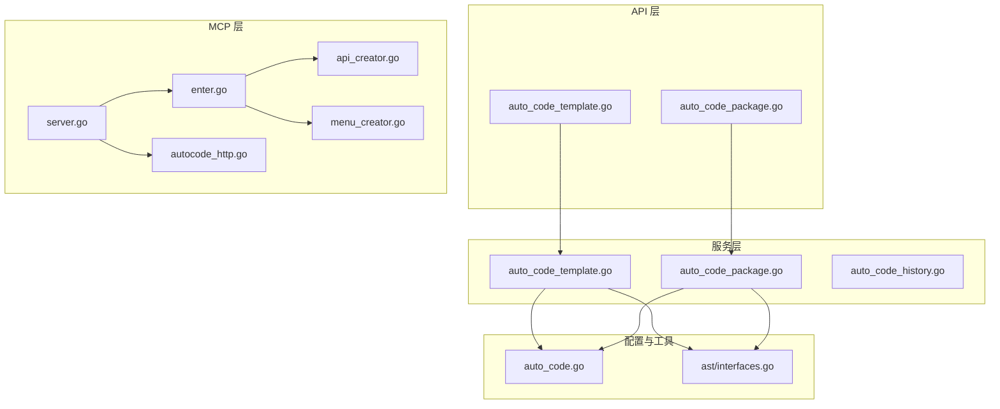
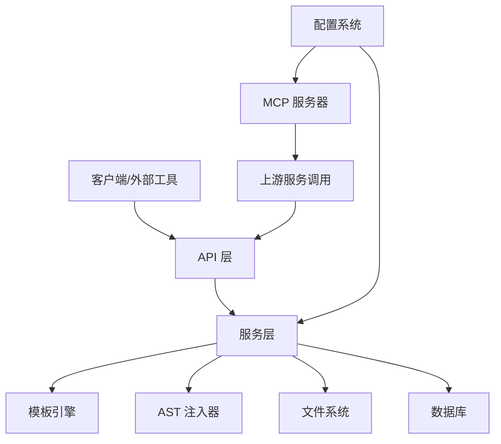
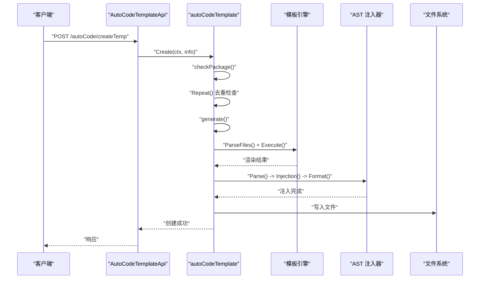
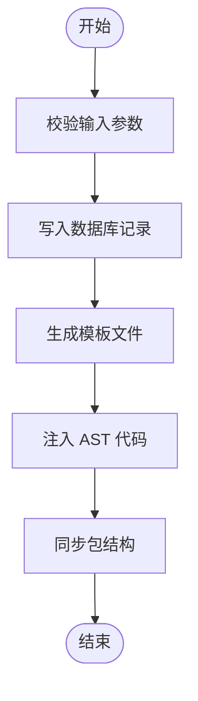
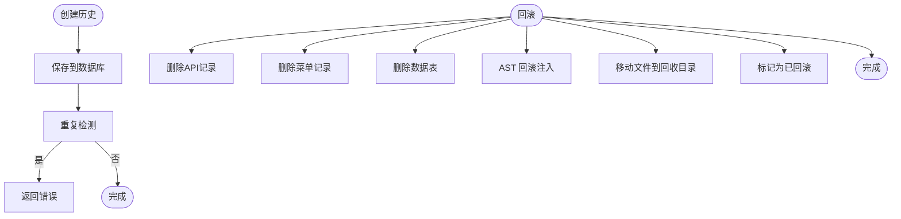
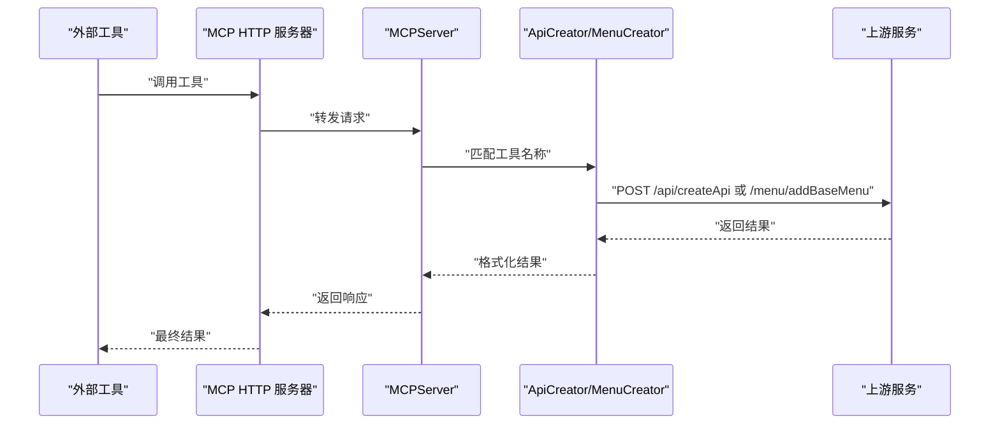
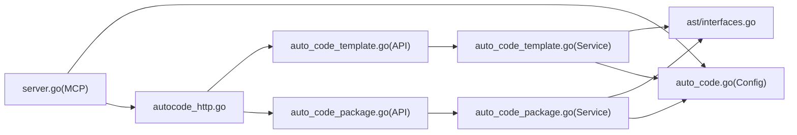

# 自动代码生成服务

<cite>
**本文档引用的文件**
- [server\mcp\autocode_http.go](file://server/mcp/autocode_http.go)
- [server\mcp\server.go](file://server/mcp/server.go)
- [server\mcp\enter.go](file://server/mcp/enter.go)
- [server\mcp\api_creator.go](file://server/mcp/api_creator.go)
- [server\mcp\menu_creator.go](file://server/mcp/menu_creator.go)
- [server\service\system\auto_code_template.go](file://server/service/system/auto_code_template.go)
- [server\service\system\auto_code_package.go](file://server/service/system/auto_code_package.go)
- [server\service\system\auto_code_history.go](file://server/service/system/auto_code_history.go)
- [server\api\v1\system\auto_code_template.go](file://server/api/v1/system/auto_code_template.go)
- [server\api\v1\system\auto_code_package.go](file://server/api/v1/system/auto_code_package.go)
- [server\utils\ast\interfaces.go](file://server/utils/ast/interfaces.go)
- [server\config\auto_code.go](file://server/config/auto_code.go)
</cite>

## 目录
1. [简介](#简介)
2. [项目结构](#项目结构)
3. [核心组件](#核心组件)
4. [架构总览](#架构总览)
5. [详细组件分析](#详细组件分析)
6. [依赖关系分析](#依赖关系分析)
7. [性能考量](#性能考量)
8. [故障排查指南](#故障排查指南)
9. [结论](#结论)
10. [附录](#附录)

## 简介
本项目提供一套完整的自动代码生成服务，涵盖模板引擎、批量代码生成、包管理、插件集成、模板系统、历史记录管理等功能。系统通过统一的模板系统驱动 Go 后端与前端代码的生成，并结合 AST 注入机制实现对现有代码结构的智能扩展。同时，系统深度集成了 MCP（Model Context Protocol）插件系统，支持外部工具通过标准化协议进行 API 与菜单的自动化创建。

## 项目结构
自动代码生成服务主要分布在以下层次：
- API 层：对外提供代码生成与包管理的 REST 接口
- 服务层：实现模板解析、AST 注入、文件生成与历史记录管理
- MCP 层：提供 MCP 服务器与工具注册机制，支持外部工具调用
- 配置层：定义代码生成的根路径、模块路径等配置项
- 模板资源：位于 resource 目录下，按 server/web/plugin 等维度组织

**图表来源**
- [server\api\v1\system\auto_code_template.go:1-122](file://server/api/v1/system/auto_code_template.go#L1-L122)
- [server\api\v1\system\auto_code_package.go:1-101](file://server/api/v1/system/auto_code_package.go#L1-L101)
- [server\service\system\auto_code_template.go:1-454](file://server/service/system/auto_code_template.go#L1-L454)
- [server\service\system\auto_code_package.go:1-744](file://server/service/system/auto_code_package.go#L1-L744)
- [server\service\system\auto_code_history.go:1-218](file://server/service/system/auto_code_history.go#L1-L218)
- [server\mcp\server.go:1-53](file://server/mcp/server.go#L1-L53)
- [server\mcp\enter.go:1-32](file://server/mcp/enter.go#L1-L32)
- [server\mcp\api_creator.go:1-160](file://server/mcp/api_creator.go#L1-L160)
- [server\mcp\menu_creator.go:1-229](file://server/mcp/menu_creator.go#L1-L229)
- [server\mcp\autocode_http.go:1-49](file://server/mcp/autocode_http.go#L1-L49)
- [server\config\auto_code.go:1-23](file://server/config/auto_code.go#L1-L23)
- [server\utils\ast\interfaces.go:1-18](file://server/utils/ast/interfaces.go#L1-L18)

**章节来源**
- [server\api\v1\system\auto_code_template.go:1-122](file://server/api/v1/system/auto_code_template.go#L1-L122)
- [server\api\v1\system\auto_code_package.go:1-101](file://server/api/v1/system/auto_code_package.go#L1-L101)
- [server\service\system\auto_code_template.go:1-454](file://server/service/system/auto_code_template.go#L1-L454)
- [server\service\system\auto_code_package.go:1-744](file://server/service/system/auto_code_package.go#L1-L744)
- [server\service\system\auto_code_history.go:1-218](file://server/service/system/auto_code_history.go#L1-L218)
- [server\mcp\server.go:1-53](file://server/mcp/server.go#L1-L53)
- [server\mcp\enter.go:1-32](file://server/mcp/enter.go#L1-L32)
- [server\mcp\api_creator.go:1-160](file://server/mcp/api_creator.go#L1-L160)
- [server\mcp\menu_creator.go:1-229](file://server/mcp/menu_creator.go#L1-L229)
- [server\mcp\autocode_http.go:1-49](file://server/mcp/autocode_http.go#L1-L49)
- [server\config\auto_code.go:1-23](file://server/config/auto_code.go#L1-L23)
- [server\utils\ast\interfaces.go:1-18](file://server/utils/ast/interfaces.go#L1-L18)

## 核心组件
- 模板引擎与生成器：基于 Go 的 text/template 引擎，结合 AST 注入，实现模板渲染与代码注入
- 包管理器：负责模板包的创建、同步与校验，支持 package 与 plugin 两种模板类型
- 历史记录管理：记录每次生成的模板映射、注入信息与关联的 API/菜单/导出模板 ID，支持回滚
- MCP 插件系统：提供 HTTP 服务器与工具注册机制，支持外部工具通过标准化协议创建 API 与菜单
- 配置系统：定义代码生成的根目录、模块路径与 Web 根路径等关键配置

**章节来源**
- [server\service\system\auto_code_template.go:25-272](file://server/service/system/auto_code_template.go#L25-L272)
- [server\service\system\auto_code_package.go:23-274](file://server/service/system/auto_code_package.go#L23-L274)
- [server\service\system\auto_code_history.go:24-182](file://server/service/system/auto_code_history.go#L24-L182)
- [server\mcp\server.go:11-52](file://server/mcp/server.go#L11-L52)
- [server\config\auto_code.go:8-22](file://server/config/auto_code.go#L8-L22)

## 架构总览
系统采用分层架构，API 层接收请求并进行参数校验，服务层负责模板解析与 AST 注入，MCP 层提供外部工具集成能力，配置层提供路径与模块信息。

**图表来源**
- [server\api\v1\system\auto_code_template.go:23-82](file://server/api/v1/system/auto_code_template.go#L23-L82)
- [server\api\v1\system\auto_code_package.go:25-81](file://server/api/v1/system/auto_code_package.go#L25-L81)
- [server\service\system\auto_code_template.go:57-186](file://server/service/system/auto_code_template.go#L57-L186)
- [server\service\system\auto_code_package.go:30-105](file://server/service/system/auto_code_package.go#L30-L105)
- [server\mcp\server.go:11-52](file://server/mcp/server.go#L11-L52)
- [server\config\auto_code.go:8-22](file://server/config/auto_code.go#L8-L22)

## 详细组件分析

### 模板引擎与代码生成器
- 模板解析：遍历模板目录，根据模板类型（server/web/plugin）生成目标文件路径映射与 AST 注入点
- AST 注入：通过统一的 AST 接口，解析、注入、格式化目标文件，确保代码风格一致
- 文件生成：将模板渲染结果写入目标路径，支持 package 与 plugin 两种模板结构
- 预览功能：在不写入文件的情况下，返回渲染后的代码片段，便于审阅

**图表来源**
- [server\api\v1\system\auto_code_template.go:50-83](file://server/api/v1/system/auto_code_template.go#L50-L83)
- [server\service\system\auto_code_template.go:57-186](file://server/service/system/auto_code_template.go#L57-L186)
- [server\utils\ast\interfaces.go:8-17](file://server/utils/ast/interfaces.go#L8-L17)

**章节来源**
- [server\service\system\auto_code_template.go:29-272](file://server/service/system/auto_code_template.go#L29-L272)
- [server\utils\ast\interfaces.go:1-18](file://server/utils/ast/interfaces.go#L1-L18)

### 包管理器
- 创建包：校验模板类型与包名合法性，生成模板文件并注入必要的 AST 代码
- 同步包：扫描 server 与 plugin 目录，自动识别包结构并同步到数据库
- 删除包：支持单个与批量删除，清理数据库记录
- 模板枚举：过滤掉特殊模板目录，返回可用模板列表

**图表来源**
- [server\service\system\auto_code_package.go:30-105](file://server/service/system/auto_code_package.go#L30-L105)
- [server\service\system\auto_code_package.go:132-274](file://server/service/system/auto_code_package.go#L132-L274)

**章节来源**
- [server\service\system\auto_code_package.go:27-274](file://server/service/system/auto_code_package.go#L27-L274)

### 历史记录管理
- 创建历史：记录生成模板映射、注入信息与关联的 API/菜单/导出模板 ID
- 重复检测：基于业务库、结构体名与简称进行去重检查
- 回滚：支持删除 API、菜单、表以及回滚注入代码，将文件移动到临时目录并标记为已回滚

**图表来源**
- [server\service\system\auto_code_history.go:31-182](file://server/service/system/auto_code_history.go#L31-L182)

**章节来源**
- [server\service\system\auto_code_history.go:28-218](file://server/service/system/auto_code_history.go#L28-L218)

### MCP 插件系统集成
- MCP 服务器：初始化 MCPServer 并注册工具，提供 HTTP 服务与健康检查端点
- 工具注册：通过注册表集中管理工具，统一注册到 MCP 服务
- API 创建工具：支持单个或批量创建 API，返回创建结果与 API ID
- 菜单创建工具：支持创建前端菜单，返回菜单 ID

**图表来源**
- [server\mcp\server.go:11-52](file://server/mcp/server.go#L11-L52)
- [server\mcp\enter.go:17-31](file://server/mcp/enter.go#L17-L31)
- [server\mcp\api_creator.go:65-159](file://server/mcp/api_creator.go#L65-L159)
- [server\mcp\menu_creator.go:114-216](file://server/mcp/menu_creator.go#L114-L216)
- [server\mcp\autocode_http.go:11-48](file://server/mcp/autocode_http.go#L11-L48)

**章节来源**
- [server\mcp\server.go:1-53](file://server/mcp/server.go#L1-L53)
- [server\mcp\enter.go:1-32](file://server/mcp/enter.go#L1-L32)
- [server\mcp\api_creator.go:1-160](file://server/mcp/api_creator.go#L1-L160)
- [server\mcp\menu_creator.go:1-229](file://server/mcp/menu_creator.go#L1-L229)
- [server\mcp\autocode_http.go:1-49](file://server/mcp/autocode_http.go#L1-L49)

### 配置系统
- 自动代码配置：定义 Web、Root、Server、Module、AiPath 等路径配置
- Web 根路径计算：兼容不同路径分隔符，计算 Web 根路径

**章节来源**
- [server\config\auto_code.go:8-23](file://server/config/auto_code.go#L8-L23)

## 依赖关系分析
- API 层依赖服务层提供的具体实现
- 服务层依赖模板引擎与 AST 注入器，同时与文件系统和数据库交互
- MCP 层依赖配置系统与上游服务，向上游发起 HTTP 请求
- 配置系统为服务层与 MCP 层提供路径与模块信息

**图表来源**
- [server\api\v1\system\auto_code_template.go:1-122](file://server/api/v1/system/auto_code_template.go#L1-L122)
- [server\api\v1\system\auto_code_package.go:1-101](file://server/api/v1/system/auto_code_package.go#L1-L101)
- [server\service\system\auto_code_template.go:1-454](file://server/service/system/auto_code_template.go#L1-L454)
- [server\service\system\auto_code_package.go:1-744](file://server/service/system/auto_code_package.go#L1-L744)
- [server\utils\ast\interfaces.go:1-18](file://server/utils/ast/interfaces.go#L1-L18)
- [server\config\auto_code.go:1-23](file://server/config/auto_code.go#L1-L23)
- [server\mcp\server.go:1-53](file://server/mcp/server.go#L1-L53)
- [server\mcp\autocode_http.go:1-49](file://server/mcp/autocode_http.go#L1-L49)

**章节来源**
- [server\api\v1\system\auto_code_template.go:1-122](file://server/api/v1/system/auto_code_template.go#L1-L122)
- [server\api\v1\system\auto_code_package.go:1-101](file://server/api/v1/system/auto_code_package.go#L1-L101)
- [server\service\system\auto_code_template.go:1-454](file://server/service/system/auto_code_template.go#L1-L454)
- [server\service\system\auto_code_package.go:1-744](file://server/service/system/auto_code_package.go#L1-L744)
- [server\utils\ast\interfaces.go:1-18](file://server/utils/ast/interfaces.go#L1-L18)
- [server\config\auto_code.go:1-23](file://server/config/auto_code.go#L1-L23)
- [server\mcp\server.go:1-53](file://server/mcp/server.go#L1-L53)
- [server\mcp\autocode_http.go:1-49](file://server/mcp/autocode_http.go#L1-L49)

## 性能考量
- 模板解析与文件写入：建议在批量生成时合并操作，减少磁盘 IO 次数
- AST 注入：尽量避免频繁解析与格式化，可在内存中累积后再一次性写入
- 数据库事务：在创建 API、菜单与导出模板时使用事务，保证一致性
- MCP 调用：批量 API 创建时优先使用批量参数，减少网络往返

## 故障排查指南
- 模板文件读取失败：检查模板文件后缀与路径，确保为 .tpl 且位于正确目录
- AST 注入失败：确认目标文件存在且可解析，检查注入点是否正确
- 重复创建：根据业务库、结构体名与简称进行去重检查，避免重复生成
- MCP 工具调用失败：检查工具参数格式与必填字段，查看上游服务返回的错误信息
- 文件写入失败：检查目标路径权限与磁盘空间

**章节来源**
- [server\service\system\auto_code_template.go:220-272](file://server/service/system/auto_code_template.go#L220-L272)
- [server\service\system\auto_code_history.go:64-182](file://server/service/system/auto_code_history.go#L64-L182)
- [server\mcp\api_creator.go:65-159](file://server/mcp/api_creator.go#L65-L159)
- [server\mcp\menu_creator.go:114-216](file://server/mcp/menu_creator.go#L114-L216)

## 结论
该自动代码生成服务通过统一的模板引擎与 AST 注入机制，实现了对后端与前端代码的高效生成与扩展。配合 MCP 插件系统，能够与外部工具无缝集成，满足复杂场景下的自动化需求。历史记录管理与回滚机制进一步提升了系统的可靠性与可维护性。

## 附录
- 模板创建流程：通过包管理器创建模板包，生成模板文件并注入 AST 代码
- 代码生成流程：API 层接收请求，服务层进行模板解析与 AST 注入，最后写入文件
- 插件集成：MCP 服务器注册工具，外部工具通过标准化协议调用 API 与菜单创建功能