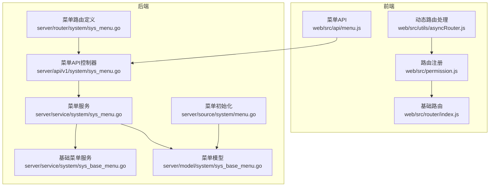
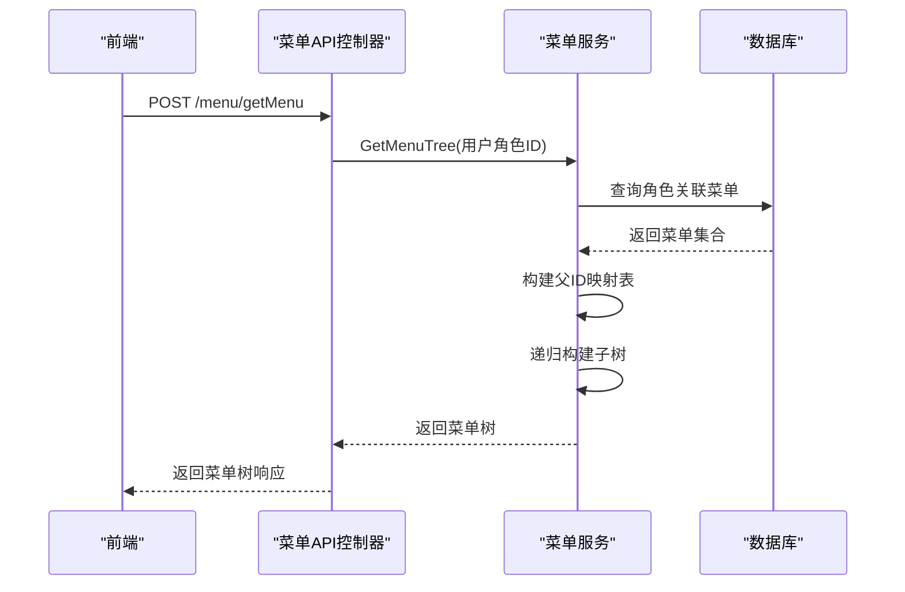
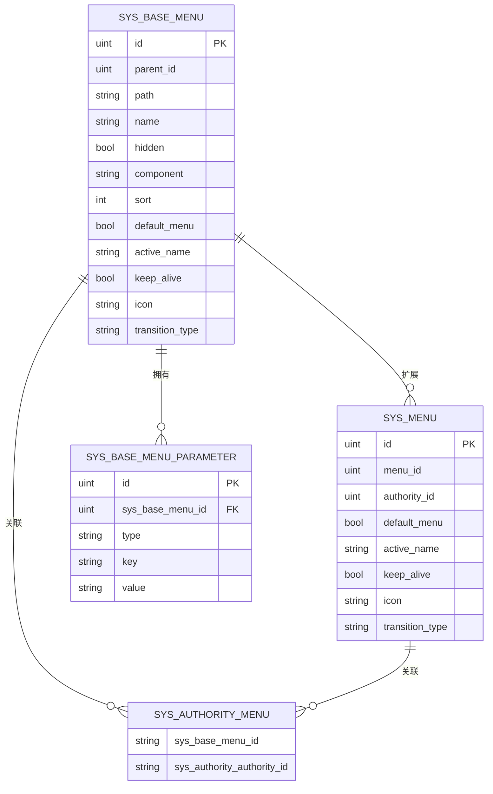
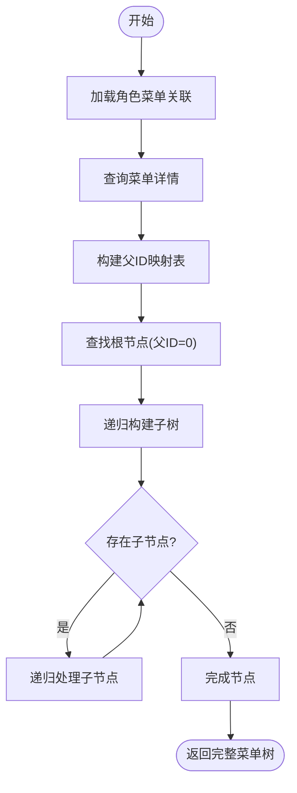
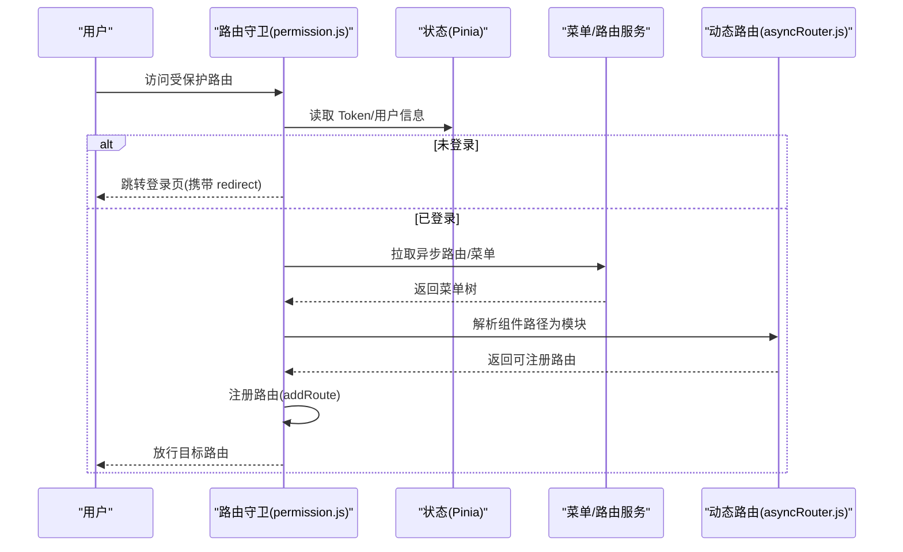
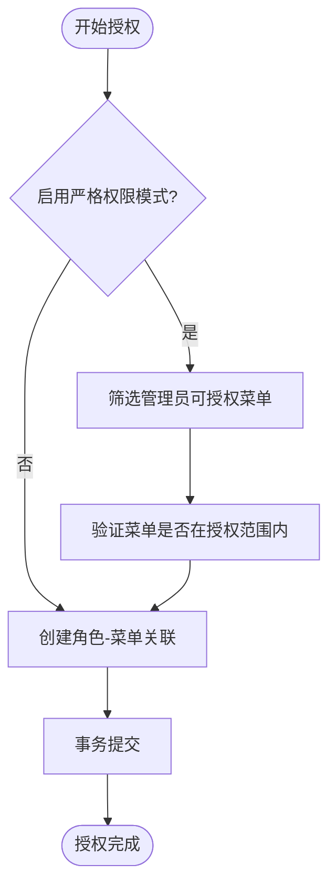
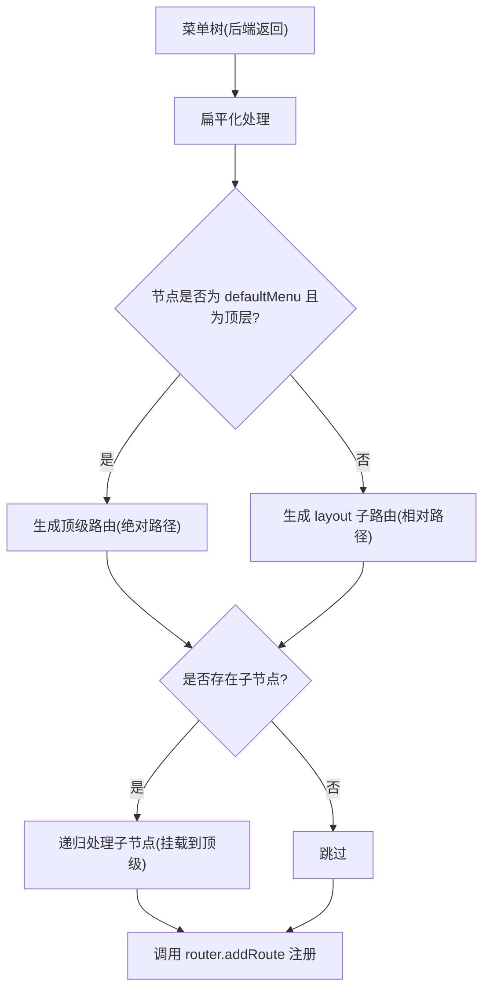
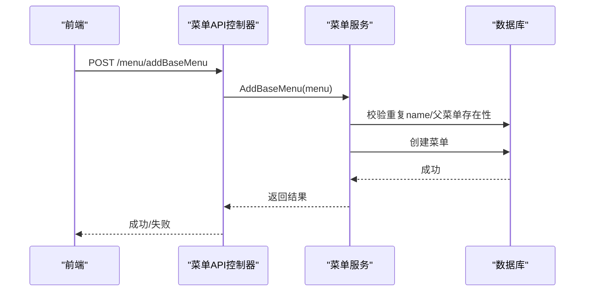
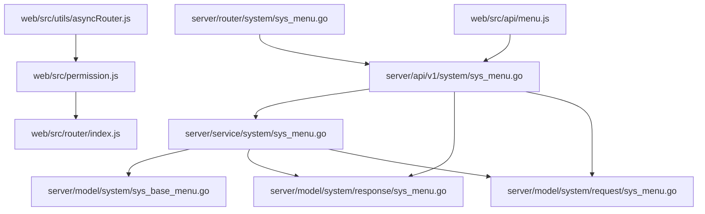

# 菜单管理服务

<cite>
**本文档引用的文件**
- [server/service/system/sys_menu.go](file://server/service/system/sys_menu.go)
- [server/api/v1/system/sys_menu.go](file://server/api/v1/system/sys_menu.go)
- [server/router/system/sys_menu.go](file://server/router/system/sys_menu.go)
- [server/model/system/response/sys_menu.go](file://server/model/system/response/sys_menu.go)
- [server/model/system/request/sys_menu.go](file://server/model/system/request/sys_menu.go)
- [server/model/system/sys_base_menu.go](file://server/model/system/sys_base_menu.go)
- [server/model/system/sys_authority_menu.go](file://server/model/system/sys_authority_menu.go)
- [web/src/api/menu.js](file://web/src/api/menu.js)
- [web/src/utils/asyncRouter.js](file://web/src/utils/asyncRouter.js)
- [web/src/router/index.js](file://web/src/router/index.js)
- [repowiki/zh/content/数据库设计/核心数据模型/菜单系统模型.md](file://repowiki/zh/content/数据库设计/核心数据模型/菜单系统模型.md)
- [repowiki/zh/content/前端应用/页面管理/权限控制.md](file://repowiki/zh/content/前端应用/页面管理/权限控制.md)
- [repowiki/zh/content/后端系统/业务逻辑层/系统业务逻辑/菜单管理服务.md](file://repowiki/zh/content/后端系统/业务逻辑层/系统业务逻辑/菜单管理服务.md)
</cite>

## 目录
1. [简介](#简介)
2. [项目结构](#项目结构)
3. [核心组件](#核心组件)
4. [架构总览](#架构总览)
5. [详细组件分析](#详细组件分析)
6. [依赖关系分析](#依赖关系分析)
7. [性能考量](#性能考量)
8. [故障排查指南](#故障排查指南)
9. [结论](#结论)
10. [附录](#附录)

## 简介
本文件面向 Gin-Vue-Admin 的菜单管理服务，系统性阐述菜单数据模型设计、菜单层级管理、动态菜单生成、权限控制机制、路由配置与前端渲染流程。文档同时覆盖菜单服务与权限系统的集成方式、菜单树构建算法、以及菜单管理的实际应用场景，如菜单的添加/删除、权限绑定与动态路由生成等。

## 项目结构
菜单管理服务横跨后端服务层、API 层、路由层与前端三层，形成完整的菜单生命周期管理闭环：
- 后端服务层：负责菜单树构建、权限过滤、角色菜单授权、菜单参数与按钮管理
- 后端 API 层：提供菜单 CRUD、菜单树查询、角色菜单授权、菜单角色关联查询等接口
- 后端路由层：定义菜单管理相关路由及中间件
- 前端：调用后端接口获取动态菜单树，动态解析组件路径并注册路由

**图表来源**
- [repowiki/zh/content/后端系统/业务逻辑层/系统业务逻辑/菜单管理服务.md](file://repowiki/zh/content/后端系统/业务逻辑层/系统业务逻辑/菜单管理服务.md)

**章节来源**
- [repowiki/zh/content/后端系统/业务逻辑层/系统业务逻辑/菜单管理服务.md](file://repowiki/zh/content/后端系统/业务逻辑层/系统业务逻辑/菜单管理服务.md)

## 核心组件
- 菜单服务（MenuService）：提供菜单树构建、基础菜单树构建、菜单权限授权、菜单角色关联查询与覆盖等能力
- 菜单 API 控制器（AuthorityMenuApi）：封装菜单管理相关接口，负责请求校验、调用服务层并返回响应
- 菜单路由（MenuRouter）：定义菜单管理相关路由及中间件
- 菜单模型与响应/请求模型：定义菜单、菜单参数、角色菜单关联等数据结构
- 前端菜单 API 与动态路由处理：负责拉取菜单树、解析组件路径并注册路由

**章节来源**
- [server/service/system/sys_menu.go:18-391](file://server/service/system/sys_menu.go#L18-L391)
- [server/api/v1/system/sys_menu.go:16-336](file://server/api/v1/system/sys_menu.go#L16-L336)
- [server/router/system/sys_menu.go:8-30](file://server/router/system/sys_menu.go#L8-L30)
- [server/model/system/response/sys_menu.go:5-16](file://server/model/system/response/sys_menu.go#L5-L16)
- [server/model/system/request/sys_menu.go:8-34](file://server/model/system/request/sys_menu.go#L8-L34)
- [server/model/system/sys_base_menu.go:7-44](file://server/model/system/sys_base_menu.go#L7-L44)
- [server/model/system/sys_authority_menu.go:3-20](file://server/model/system/sys_authority_menu.go#L3-L20)
- [web/src/api/menu.js:6-142](file://web/src/api/menu.js#L6-L142)
- [web/src/utils/asyncRouter.js:4-30](file://web/src/utils/asyncRouter.js#L4-L30)
- [web/src/router/index.js:1-42](file://web/src/router/index.js#L1-L42)

## 架构总览
菜单管理服务采用“后端服务层 + API 层 + 路由层”与“前端 API + 动态路由处理 + 路由注册”的双侧架构。后端通过服务层聚合菜单树构建与权限过滤逻辑，前端通过异步拉取菜单树并动态解析组件路径，最终注册到路由系统中。

**图表来源**
- [server/api/v1/system/sys_menu.go:26-37](file://server/api/v1/system/sys_menu.go#L26-L37)
- [server/service/system/sys_menu.go:78-99](file://server/service/system/sys_menu.go#L78-L99)

**章节来源**
- [server/api/v1/system/sys_menu.go:18-37](file://server/api/v1/system/sys_menu.go#L18-L37)
- [server/service/system/sys_menu.go:78-99](file://server/service/system/sys_menu.go#L78-L99)

## 详细组件分析

### 数据模型设计
- SysBaseMenu：基础菜单模型，包含父菜单ID、路由路径、名称、组件路径、排序、元信息、子菜单、菜单参数、菜单按钮等字段
- SysMenu：扩展菜单模型，在基础菜单基础上增加菜单ID、角色ID、子菜单、参数、按钮映射等字段
- SysAuthorityMenu：角色与菜单的多对多关联表，存储菜单ID与角色ID的映射
- Meta：菜单元信息，包含标题、图标、是否缓存、高亮菜单、自动关闭tab、路由切换动画等
- SysBaseMenuParameter：菜单参数，支持通过params或query传递参数

**图表来源**
- [server/model/system/sys_base_menu.go:7-44](file://server/model/system/sys_base_menu.go#L7-L44)
- [server/model/system/sys_authority_menu.go:3-20](file://server/model/system/sys_authority_menu.go#L3-L20)

**章节来源**
- [server/model/system/sys_base_menu.go:7-44](file://server/model/system/sys_base_menu.go#L7-L44)
- [server/model/system/sys_authority_menu.go:3-20](file://server/model/system/sys_authority_menu.go#L3-L20)

### 菜单层级管理与树构建算法
- 菜单层级通过 ParentId 字段实现父子关系，支持无限层级嵌套
- 树构建分为两步：
  1) 构建父ID映射表：将所有菜单按父ID分组
  2) 递归构建子树：从根节点（父ID=0）开始，递归填充子节点
- 支持严格权限模式下的菜单筛选，确保角色只能看到其上级角色授权的菜单

**图表来源**
- [repowiki/zh/content/数据库设计/核心数据模型/菜单系统模型.md:182-194](file://repowiki/zh/content/数据库设计/核心数据模型/菜单系统模型.md#L182-L194)
- [server/service/system/sys_menu.go:22-70](file://server/service/system/sys_menu.go#L22-L70)
- [server/service/system/sys_menu.go:93-99](file://server/service/system/sys_menu.go#L93-L99)

**章节来源**
- [server/service/system/sys_menu.go:22-70](file://server/service/system/sys_menu.go#L22-L70)
- [server/service/system/sys_menu.go:93-99](file://server/service/system/sys_menu.go#L93-L99)
- [repowiki/zh/content/数据库设计/核心数据模型/菜单系统模型.md:178-209](file://repowiki/zh/content/数据库设计/核心数据模型/菜单系统模型.md#L178-L209)

### 动态菜单生成与权限控制
- 后端通过 GetMenuTree 获取当前角色的菜单树，结合 SysAuthorityMenu 进行权限过滤
- 前端通过 asyncMenu 拉取菜单树，使用 asyncRouterHandle 将字符串组件路径解析为模块并注册路由
- 前端路由守卫基于菜单树进行权限校验，确保用户只能访问有权限的路由

**图表来源**
- [repowiki/zh/content/前端应用/页面管理/权限控制.md:122-140](file://repowiki/zh/content/前端应用/页面管理/权限控制.md#L122-L140)
- [web/src/permission.js](file://web/src/permission.js)
- [web/src/utils/asyncRouter.js](file://web/src/utils/asyncRouter.js)

**章节来源**
- [web/src/api/menu.js:6-11](file://web/src/api/menu.js#L6-L11)
- [web/src/utils/asyncRouter.js:4-30](file://web/src/utils/asyncRouter.js#L4-L30)
- [repowiki/zh/content/前端应用/页面管理/权限控制.md:118-207](file://repowiki/zh/content/前端应用/页面管理/权限控制.md#L118-L207)

### 菜单权限控制机制
- 角色菜单授权：通过 AddMenuAuthority 将菜单与角色建立关联，支持严格模式下的跨级操作限制
- 菜单角色关联查询：通过 GetMenuRoles 获取拥有指定菜单的角色ID列表，支持查询默认首页角色
- 全量覆盖：通过 SetMenuRoles 全量覆盖某菜单关联的角色列表，事务保证一致性

**图表来源**
- [server/service/system/sys_menu.go:241-282](file://server/service/system/sys_menu.go#L241-L282)

**章节来源**
- [server/service/system/sys_menu.go:241-282](file://server/service/system/sys_menu.go#L241-L282)
- [server/api/v1/system/sys_menu.go:247-315](file://server/api/v1/system/sys_menu.go#L247-L315)

### 菜单路由配置与前端渲染
- 基础路由：定义静态路由（登录、初始化、错误页等）
- 动态路由：通过异步菜单树生成，支持顶级路由与子路由的自动归一化处理
- 组件路径解析：使用 import.meta.glob 收集视图与插件组件，将字符串组件路径映射为对应模块

**图表来源**
- [repowiki/zh/content/前端应用/页面管理/权限控制.md:188-199](file://repowiki/zh/content/前端应用/页面管理/权限控制.md#L188-L199)
- [web/src/utils/asyncRouter.js](file://web/src/utils/asyncRouter.js)

**章节来源**
- [web/src/router/index.js:1-42](file://web/src/router/index.js#L1-L42)
- [web/src/utils/asyncRouter.js:4-30](file://web/src/utils/asyncRouter.js#L4-L30)
- [repowiki/zh/content/前端应用/页面管理/权限控制.md:181-207](file://repowiki/zh/content/前端应用/页面管理/权限控制.md#L181-L207)

### 菜单管理 API 与工作流
- 获取动态菜单树：POST /menu/getMenu
- 获取基础菜单树：POST /menu/getBaseMenuTree
- 新增/删除/更新菜单：POST /menu/addBaseMenu、POST /menu/deleteBaseMenu、POST /menu/updateBaseMenu
- 角色菜单授权：POST /menu/addMenuAuthority
- 菜单角色关联查询：GET /menu/getMenuRoles
- 全量覆盖菜单角色：POST /menu/setMenuRoles

**图表来源**
- [server/api/v1/system/sys_menu.go:117-150](file://server/api/v1/system/sys_menu.go#L117-L150)
- [server/service/system/sys_menu.go:136-183](file://server/service/system/sys_menu.go#L136-L183)

**章节来源**
- [server/api/v1/system/sys_menu.go:18-336](file://server/api/v1/system/sys_menu.go#L18-L336)
- [server/router/system/sys_menu.go:10-29](file://server/router/system/sys_menu.go#L10-L29)

## 依赖关系分析
- 菜单服务依赖数据库查询与事务处理，负责菜单树构建与权限过滤
- API 控制器依赖服务层与请求/响应模型，负责接口定义与参数校验
- 路由层定义菜单管理相关路由，绑定中间件与控制器
- 前端依赖菜单 API 与动态路由处理，负责菜单树拉取与路由注册

**图表来源**
- [server/router/system/sys_menu.go:8-30](file://server/router/system/sys_menu.go#L8-L30)
- [server/api/v1/system/sys_menu.go:16-336](file://server/api/v1/system/sys_menu.go#L16-L336)
- [server/service/system/sys_menu.go:18-391](file://server/service/system/sys_menu.go#L18-L391)
- [server/model/system/response/sys_menu.go:5-16](file://server/model/system/response/sys_menu.go#L5-L16)
- [server/model/system/request/sys_menu.go:8-34](file://server/model/system/request/sys_menu.go#L8-L34)
- [web/src/api/menu.js:6-142](file://web/src/api/menu.js#L6-L142)
- [web/src/utils/asyncRouter.js:4-30](file://web/src/utils/asyncRouter.js#L4-L30)
- [web/src/router/index.js:1-42](file://web/src/router/index.js#L1-L42)

**章节来源**
- [server/router/system/sys_menu.go:8-30](file://server/router/system/sys_menu.go#L8-L30)
- [server/api/v1/system/sys_menu.go:16-336](file://server/api/v1/system/sys_menu.go#L16-L336)
- [server/service/system/sys_menu.go:18-391](file://server/service/system/sys_menu.go#L18-L391)
- [web/src/api/menu.js:6-142](file://web/src/api/menu.js#L6-L142)

## 性能考量
- 菜单树构建：通过一次查询+一次映射+递归构建，时间复杂度 O(N)，空间复杂度 O(N)
- 权限过滤：在严格模式下通过子查询限制菜单范围，减少不必要的数据传输
- 前端动态路由：使用 import.meta.glob 进行组件预加载，提升路由注册效率
- 建议：对于大型菜单树，可考虑在后端进行分页或懒加载策略，避免一次性传输过多数据

## 故障排查指南
- 菜单添加失败：检查父菜单是否存在、是否重复name、是否被其他角色设为首页
- 跨级授权异常：确认严格权限模式下管理员是否具有授权范围内的菜单
- 动态路由不生效：检查前端组件路径是否正确、asyncRouterHandle 是否正确解析
- 默认首页失效：当角色默认首页不在其授权菜单内时，系统会回退到404

**章节来源**
- [server/service/system/sys_menu.go:136-183](file://server/service/system/sys_menu.go#L136-L183)
- [server/service/system/sys_menu.go:241-282](file://server/service/system/sys_menu.go#L241-L282)
- [web/src/utils/asyncRouter.js:4-30](file://web/src/utils/asyncRouter.js#L4-L30)
- [server/service/system/sys_menu.go:379-391](file://server/service/system/sys_menu.go#L379-L391)

## 结论
菜单管理服务通过清晰的数据模型、严谨的树构建算法与完善的权限控制机制，实现了灵活的菜单层级管理与动态路由生成。后端服务层承担了菜单树构建与权限过滤的核心职责，前端通过异步拉取与动态解析组件路径，最终完成路由注册。该架构既满足了权限安全需求，又具备良好的扩展性与维护性。

## 附录
- 菜单管理示例场景
  - 菜单添加：调用 POST /menu/addBaseMenu，传入菜单基本信息与元信息
  - 菜单删除：调用 POST /menu/deleteBaseMenu，传入菜单ID
  - 权限绑定：调用 POST /menu/addMenuAuthority，传入角色ID与菜单列表
  - 动态路由生成：调用 POST /menu/getMenu，前端使用 asyncRouterHandle 解析并注册路由
  - 全量覆盖角色：调用 POST /menu/setMenuRoles，传入菜单ID与角色ID列表

**章节来源**
- [server/api/v1/system/sys_menu.go:117-315](file://server/api/v1/system/sys_menu.go#L117-L315)
- [web/src/api/menu.js:6-142](file://web/src/api/menu.js#L6-L142)
- [web/src/utils/asyncRouter.js:4-30](file://web/src/utils/asyncRouter.js#L4-L30)