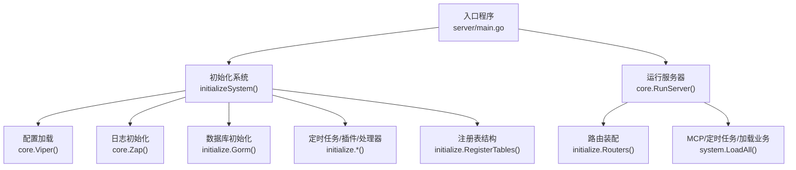
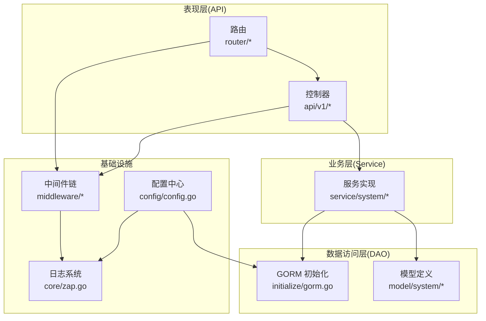
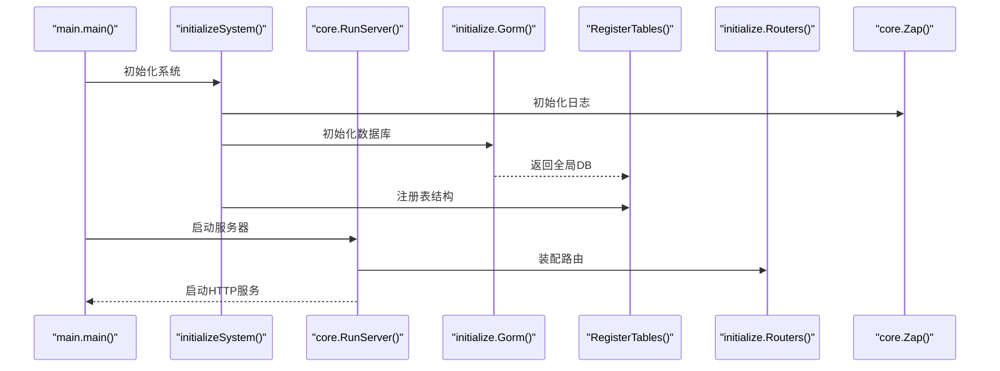
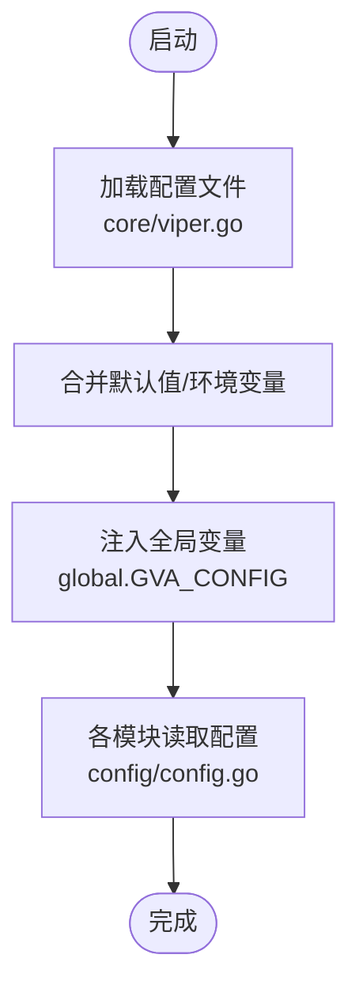
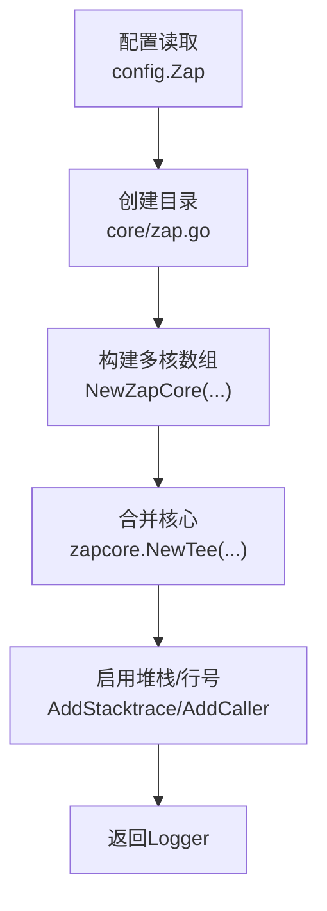
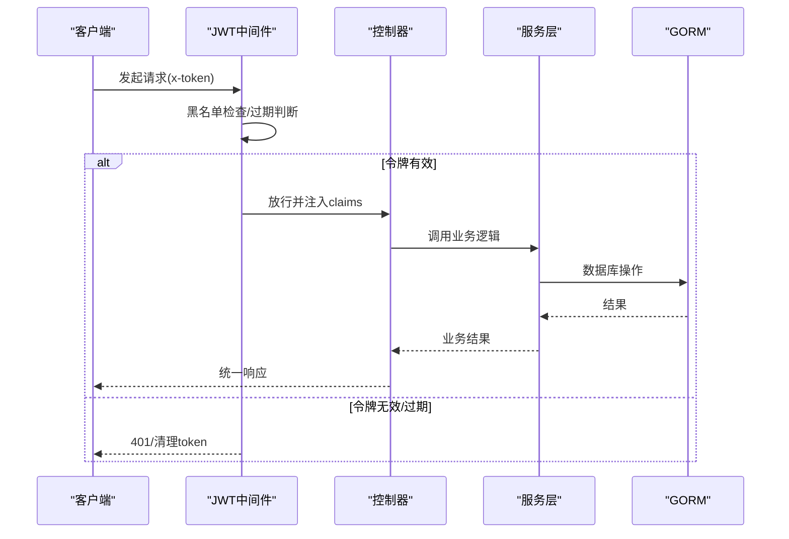
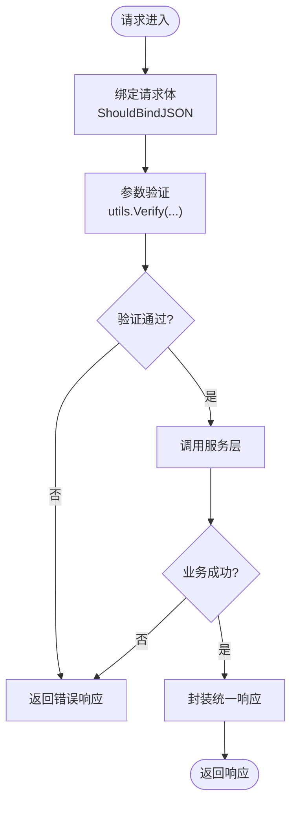
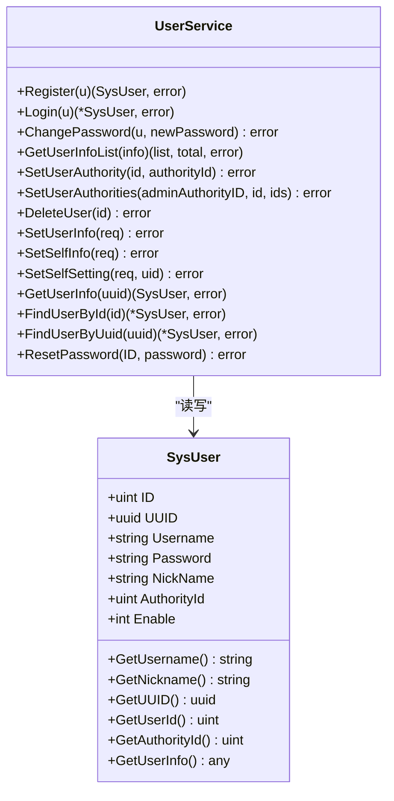
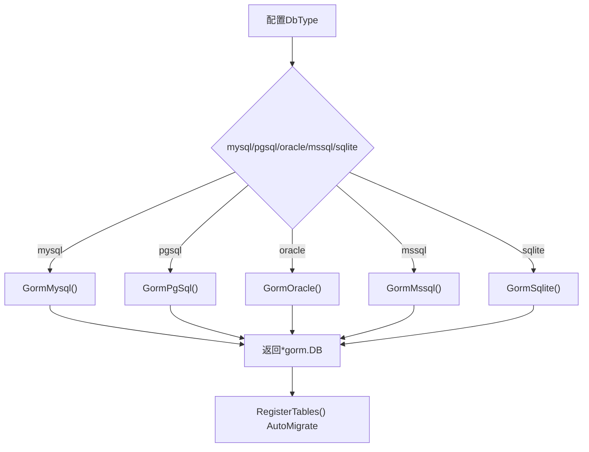
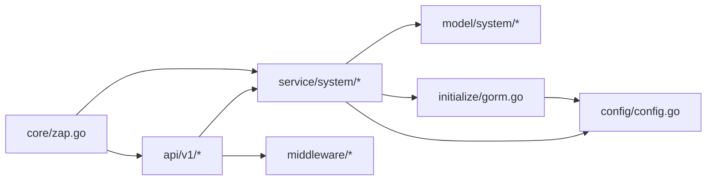

# 后端系统详解

<cite>
**本文引用的文件**
- [server/main.go](file://server/main.go)
- [server/go.mod](file://server/go.mod)
- [server/config/config.go](file://server/config/config.go)
- [server/global/global.go](file://server/global/global.go)
- [server/core/server.go](file://server/core/server.go)
- [server/core/viper.go](file://server/core/viper.go)
- [server/core/zap.go](file://server/core/zap.go)
- [server/initialize/init.go](file://server/initialize/init.go)
- [server/initialize/gorm.go](file://server/initialize/gorm.go)
- [server/router/enter.go](file://server/router/enter.go)
- [server/middleware/jwt.go](file://server/middleware/jwt.go)
- [server/middleware/logger.go](file://server/middleware/logger.go)
- [server/middleware/error.go](file://server/middleware/error.go)
- [server/middleware/cors.go](file://server/middleware/cors.go)
- [server/model/system/sys_user.go](file://server/model/system/sys_user.go)
- [server/api/v1/system/sys_user.go](file://server/api/v1/system/sys_user.go)
- [server/service/system/sys_user.go](file://server/service/system/sys_user.go)
- [server/utils/validator.go](file://server/utils/validator.go)
- [server/docs/swagger.yaml](file://server/docs/swagger.yaml)
</cite>

## 目录
1. [简介](#简介)
2. [项目结构](#项目结构)
3. [核心组件](#核心组件)
4. [架构总览](#架构总览)
5. [详细组件分析](#详细组件分析)
6. [依赖分析](#依赖分析)
7. [性能考量](#性能考量)
8. [故障排查指南](#故障排查指南)
9. [结论](#结论)
10. [附录](#附录)

## 简介
本文件面向后端系统开发者与运维人员，系统性阐述基于 Go Gin 框架的后端架构设计与实现细节。内容覆盖 MVC 分层与模块化组织、服务器启动流程、配置与日志系统、中间件体系、RESTful API 设计与参数验证、业务逻辑层（用户管理、权限控制、菜单字典等）、数据访问层（GORM 配置与模型）以及最佳实践与排错建议。

## 项目结构
后端采用“入口程序 -> 初始化 -> 核心服务 -> 路由/中间件/业务/数据访问”的清晰分层，配合配置中心与全局变量实现松耦合与可扩展。

**图表来源**
- [server/main.go:30-52](file://server/main.go#L30-L52)
- [server/core/server.go:14-48](file://server/core/server.go#L14-L48)

**章节来源**
- [server/main.go:30-52](file://server/main.go#L30-L52)
- [server/core/server.go:14-48](file://server/core/server.go#L14-L48)

## 核心组件
- 入口与启动
  - main.go 负责初始化系统并启动服务器。
  - initializeSystem() 负责顺序化初始化：配置、日志、数据库、定时器、DB 列表、全局处理器、表结构注册。
- 配置系统
  - config.Server 定义了 JWT、Zap 日志、Redis/Mongo、邮件、系统参数、多数据库、对象存储、跨域等配置项。
  - core.Viper() 读取配置文件并注入全局。
- 日志系统
  - core.Zap() 基于配置生成多级别核心，组合 tee 并启用堆栈追踪与行号。
- 中间件体系
  - JWT 鉴权、CORS、日志记录、错误捕获、IP 限制、超时控制等。
- 路由与控制器
  - 路由按模块分组（system/example），控制器负责请求绑定、参数验证、调用服务层并返回统一响应。
- 业务服务层
  - UserService 等服务封装领域逻辑，处理事务、权限检查、预加载关联数据。
- 数据访问层
  - GORM 初始化与 AutoMigrate 注册，支持 MySQL/PG/Oracle/SQLServer/SQLite；提供 RegisterTables 批量注册模型。

**章节来源**
- [server/main.go:30-52](file://server/main.go#L30-L52)
- [server/config/config.go:1-41](file://server/config/config.go#L1-L41)
- [server/core/viper.go](file://server/core/viper.go)
- [server/core/zap.go:13-36](file://server/core/zap.go#L13-L36)
- [server/initialize/gorm.go:14-88](file://server/initialize/gorm.go#L14-L88)
- [server/router/enter.go:1-14](file://server/router/enter.go#L1-L14)

## 架构总览
系统采用典型的 MVC 分层与模块化组织，API 层仅负责请求/响应编解码与参数校验；Service 层承载业务规则与事务；DAO 层由 GORM 统一抽象；中间件贯穿请求生命周期；配置与日志作为横切关注点贯穿各层。

**图表来源**
- [server/api/v1/system/sys_user.go:1-517](file://server/api/v1/system/sys_user.go#L1-L517)
- [server/service/system/sys_user.go:1-337](file://server/service/system/sys_user.go#L1-L337)
- [server/model/system/sys_user.go:1-63](file://server/model/system/sys_user.go#L1-L63)
- [server/initialize/gorm.go:14-88](file://server/initialize/gorm.go#L14-L88)
- [server/config/config.go:1-41](file://server/config/config.go#L1-L41)
- [server/core/zap.go:13-36](file://server/core/zap.go#L13-L36)

## 详细组件分析

### 服务器启动流程
- main() 调用 initializeSystem() 完成配置、日志、数据库、定时器、DB 列表、全局处理器与表注册。
- RunServer() 根据配置决定是否初始化 Redis/Mongo，加载系统业务，装配路由，打印欢迎信息与文档地址，最后启动 HTTP 服务。

**图表来源**
- [server/main.go:30-52](file://server/main.go#L30-L52)
- [server/core/server.go:14-48](file://server/core/server.go#L14-L48)
- [server/initialize/gorm.go:37-88](file://server/initialize/gorm.go#L37-L88)

**章节来源**
- [server/main.go:30-52](file://server/main.go#L30-L52)
- [server/core/server.go:14-48](file://server/core/server.go#L14-L48)

### 配置管理系统
- 配置结构体集中定义各类配置项，支持 YAML/JSON 加载与映射。
- Viper 负责读取配置文件、环境变量与默认值合并，注入全局变量供其他模块使用。

**图表来源**
- [server/config/config.go:1-41](file://server/config/config.go#L1-L41)
- [server/core/viper.go](file://server/core/viper.go)

**章节来源**
- [server/config/config.go:1-41](file://server/config/config.go#L1-L41)
- [server/core/viper.go](file://server/core/viper.go)

### 日志系统
- Zap 初始化根据配置生成多个核心（tee），支持堆栈追踪与行号，错误级别及以上自动记录堆栈。
- 支持目录创建、级别动态配置与多核聚合输出。

**图表来源**
- [server/core/zap.go:13-36](file://server/core/zap.go#L13-L36)
- [server/config/config.go:1-41](file://server/config/config.go#L1-L41)

**章节来源**
- [server/core/zap.go:13-36](file://server/core/zap.go#L13-L36)
- [server/config/config.go:1-41](file://server/config/config.go#L1-L41)

### 中间件体系
- JWT 鉴权：从请求头提取 token，黑名单校验，过期缓冲期内自动刷新并写入新 token 与过期时间。
- 日志中间件：记录请求/响应、耗时、状态码等。
- 错误中间件：捕获 panic，统一返回错误响应。
- CORS：跨域白名单与允许方法/头配置。
- 其他：IP 限制、超时控制、Casbin RBAC、邮件通知等。

**图表来源**
- [server/middleware/jwt.go:16-90](file://server/middleware/jwt.go#L16-L90)
- [server/api/v1/system/sys_user.go:27-161](file://server/api/v1/system/sys_user.go#L27-L161)

**章节来源**
- [server/middleware/jwt.go:16-90](file://server/middleware/jwt.go#L16-L90)
- [server/middleware/logger.go](file://server/middleware/logger.go)
- [server/middleware/error.go](file://server/middleware/error.go)
- [server/middleware/cors.go](file://server/middleware/cors.go)

### API 层设计
- 控制器职责
  - 请求体绑定与参数验证（结合 utils.Verify 与结构体标签规则）。
  - 调用服务层执行业务逻辑。
  - 统一响应包装（OkWithDetailed/FailWithMessage 等）。
- 参数验证机制
  - utils.Validator 提供规则注册、非空、正则、长度/数值比较等通用校验。
  - 在控制器中对请求结构体调用 Verify，失败直接返回错误。
- 错误处理策略
  - 中间件捕获 panic，统一返回；控制器内显式错误直接返回。
  - 登录失败/权限不足等场景记录日志并返回明确提示。

**图表来源**
- [server/api/v1/system/sys_user.go:27-161](file://server/api/v1/system/sys_user.go#L27-L161)
- [server/utils/validator.go:118-165](file://server/utils/validator.go#L118-L165)

**章节来源**
- [server/api/v1/system/sys_user.go:27-161](file://server/api/v1/system/sys_user.go#L27-L161)
- [server/utils/validator.go:118-165](file://server/utils/validator.go#L118-L165)

### 业务逻辑层（用户管理）
- 用户登录/注册/修改密码/列表查询/权限设置/删除/信息更新/个人设置等。
- 关键点
  - 登录时密码校验、角色预加载、默认路由注入。
  - 权限切换前校验默认路由存在性。
  - 事务保证用户角色批量更新一致性。
  - 多端登录场景下 Redis 记录活跃 JWT。

**图表来源**
- [server/model/system/sys_user.go:20-63](file://server/model/system/sys_user.go#L20-L63)
- [server/service/system/sys_user.go:24-337](file://server/service/system/sys_user.go#L24-L337)

**章节来源**
- [server/model/system/sys_user.go:20-63](file://server/model/system/sys_user.go#L20-L63)
- [server/service/system/sys_user.go:24-337](file://server/service/system/sys_user.go#L24-L337)

### 数据访问层（GORM）
- 初始化
  - 根据配置 DbType 选择具体驱动，设置当前活动库名。
  - 支持 DB List（多数据库）与 DB 列表。
- 表注册
  - RegisterTables() 批量 AutoMigrate 系统与示例模型。
  - 支持关闭自动迁移的开关。
- 业务模型
  - 系统模型（用户、菜单、字典、权限、日志等）与示例模型（文件上传、断点续传等）。

**图表来源**
- [server/initialize/gorm.go:14-88](file://server/initialize/gorm.go#L14-L88)

**章节来源**
- [server/initialize/gorm.go:14-88](file://server/initialize/gorm.go#L14-L88)

### 路由与控制器组织
- 路由分组
  - router/enter.go 定义 RouterGroup，按 system/example 组织子路由。
- 控制器
  - api/v1/system/sys_user.go 提供用户相关 RESTful 接口，注解用于 Swagger 文档生成。
- Swagger 文档
  - docs/swagger.yaml 定义了大量模型与配置项，便于前后端协作。

**章节来源**
- [server/router/enter.go:1-14](file://server/router/enter.go#L1-L14)
- [server/api/v1/system/sys_user.go:20-517](file://server/api/v1/system/sys_user.go#L20-L517)
- [server/docs/swagger.yaml:1-200](file://server/docs/swagger.yaml#L1-L200)

## 依赖分析
- 外部依赖
  - Web 框架：gin
  - ORM：gorm/io + 多数据库驱动
  - 缓存：redis
  - 日志：zap
  - 验证：validator
  - 文档：swag/swagger
  - 权限：casbin
  - 对象存储：aws/s3、aliyun/oss、qiniu、minio、tencent/cos、huawei obs、cloudflare r2
- 内部模块耦合
  - API 层依赖服务层；服务层依赖模型与 DAO；全局变量与配置贯穿各层；中间件独立于业务逻辑。

**图表来源**
- [server/go.mod:7-61](file://server/go.mod#L7-L61)
- [server/api/v1/system/sys_user.go:1-517](file://server/api/v1/system/sys_user.go#L1-L517)
- [server/service/system/sys_user.go:1-337](file://server/service/system/sys_user.go#L1-L337)
- [server/initialize/gorm.go:14-88](file://server/initialize/gorm.go#L14-L88)
- [server/config/config.go:1-41](file://server/config/config.go#L1-L41)
- [server/core/zap.go:13-36](file://server/core/zap.go#L13-L36)

**章节来源**
- [server/go.mod:7-61](file://server/go.mod#L7-L61)

## 性能考量
- 连接池与并发
  - GORM/Redis 驱动均支持连接池配置，建议结合压力测试调整最大连接数与空闲连接数。
- 查询优化
  - 使用 Preload/Joins 预加载必要关联，避免 N+1 查询。
  - 分页查询使用 Limit/Offset 或游标分页，避免全表扫描。
- 缓存策略
  - Redis 缓存热点数据与登录态，注意过期与淘汰策略。
- 中间件开销
  - 日志中间件建议按需开启行号与堆栈，生产环境可降低级别。
- 并发控制
  - singleflight 用于限流热点请求，避免缓存击穿。

## 故障排查指南
- 登录失败
  - 检查验证码配置与缓存；确认用户是否存在且未被冻结；查看登录日志。
- JWT 无效/过期
  - 核对请求头 x-token；检查黑名单；确认 BufferTime 与过期时间配置。
- 数据库迁移失败
  - 关闭自动迁移开关后手动迁移；检查模型字段与约束；查看日志错误详情。
- 参数校验失败
  - 检查请求体结构与标签规则；确认 Verify 调用与规则注册。
- 跨域问题
  - 检查 CORS 白名单与允许方法/头配置。

**章节来源**
- [server/api/v1/system/sys_user.go:40-99](file://server/api/v1/system/sys_user.go#L40-L99)
- [server/middleware/jwt.go:16-90](file://server/middleware/jwt.go#L16-L90)
- [server/initialize/gorm.go:37-88](file://server/initialize/gorm.go#L37-L88)
- [server/utils/validator.go:118-165](file://server/utils/validator.go#L118-L165)
- [server/middleware/cors.go](file://server/middleware/cors.go)

## 结论
该后端系统以 Gin 为核心，采用清晰的分层与模块化设计，结合配置中心、统一日志、中间件链与 GORM 数据访问层，形成高内聚、低耦合的可扩展架构。通过 Swagger 文档与参数验证机制提升前后端协作效率；通过 JWT/Casbin 实现完善的认证授权；通过 Redis/Gorm 优化性能与可靠性。建议在生产环境中进一步完善监控告警、限流熔断与灰度发布策略。

## 附录
- Swagger 文档模型与配置项参考：[server/docs/swagger.yaml:1-200](file://server/docs/swagger.yaml#L1-L200)
- 依赖清单参考：[server/go.mod:7-61](file://server/go.mod#L7-L61)