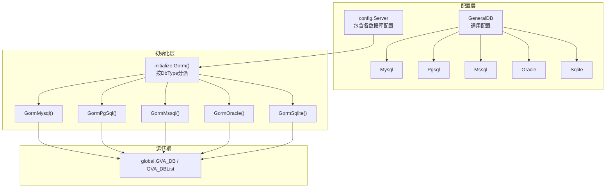
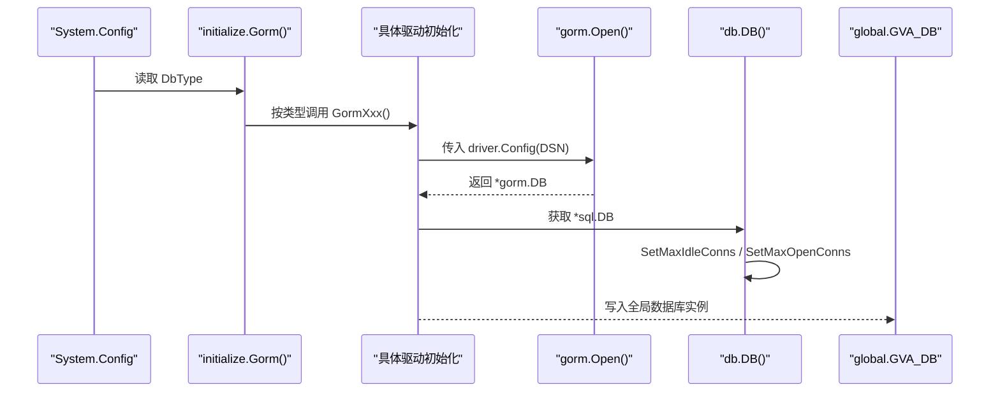
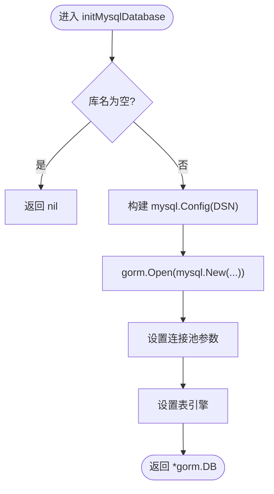
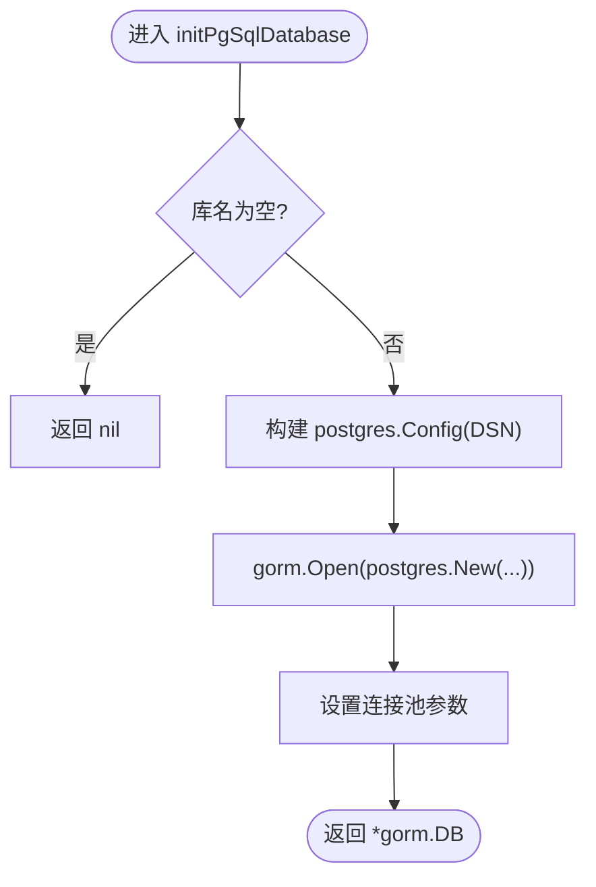
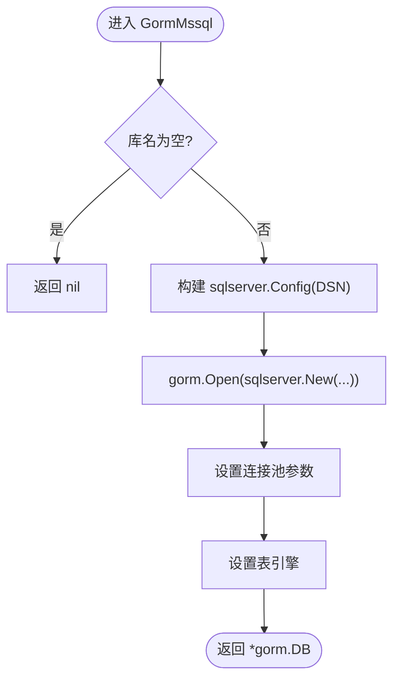
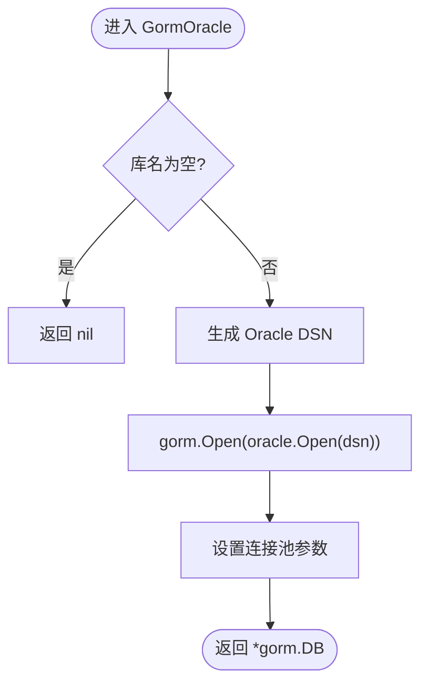
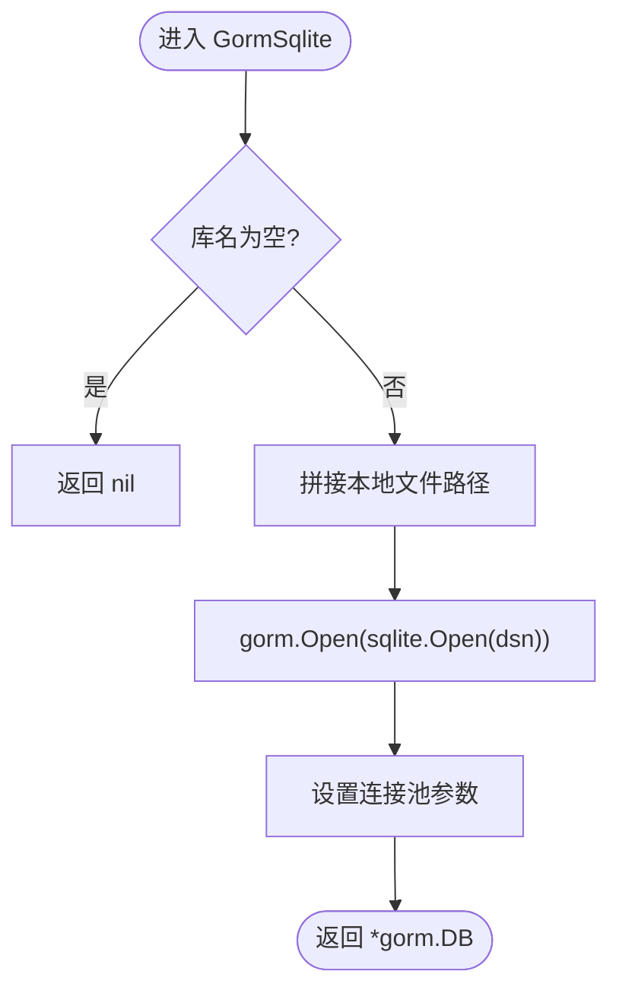
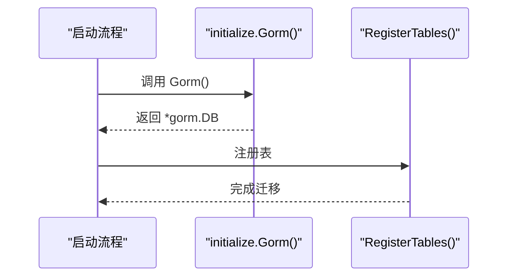
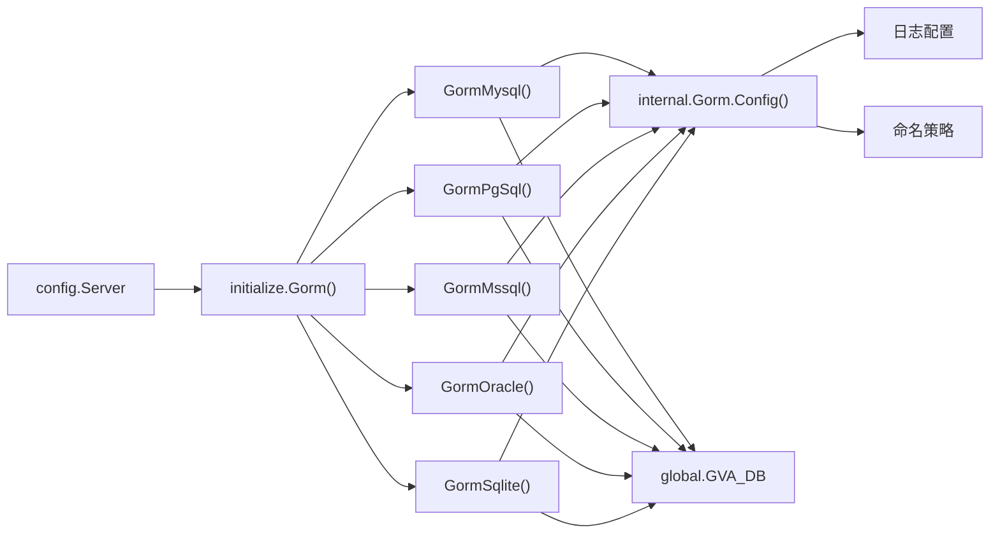

# GORM配置管理

<cite>
**本文档引用的文件**
- [server/config/gorm_mysql.go](file://server/config/gorm_mysql.go)
- [server/config/gorm_pgsql.go](file://server/config/gorm_pgsql.go)
- [server/config/gorm_mssql.go](file://server/config/gorm_mssql.go)
- [server/config/gorm_oracle.go](file://server/config/gorm_oracle.go)
- [server/config/gorm_sqlite.go](file://server/config/gorm_sqlite.go)
- [server/config/db_list.go](file://server/config/db_list.go)
- [server/config/config.go](file://server/config/config.go)
- [server/config/system.go](file://server/config/system.go)
- [server/initialize/gorm.go](file://server/initialize/gorm.go)
- [server/initialize/internal/gorm.go](file://server/initialize/internal/gorm.go)
- [server/initialize/gorm_mysql.go](file://server/initialize/gorm_mysql.go)
- [server/initialize/gorm_pgsql.go](file://server/initialize/gorm_pgsql.go)
- [server/initialize/gorm_mssql.go](file://server/initialize/gorm_mssql.go)
- [server/initialize/gorm_oracle.go](file://server/initialize/gorm_oracle.go)
- [server/initialize/gorm_sqlite.go](file://server/initialize/gorm_sqlite.go)
- [server/global/global.go](file://server/global/global.go)
</cite>

## 目录
1. [简介](#简介)
2. [项目结构](#项目结构)
3. [核心组件](#核心组件)
4. [架构总览](#架构总览)
5. [详细组件分析](#详细组件分析)
6. [依赖关系分析](#依赖关系分析)
7. [性能考量](#性能考量)
8. [故障排除指南](#故障排除指南)
9. [结论](#结论)
10. [附录](#附录)

## 简介
本文件系统性梳理了 Gin-Vue-Admin 项目中基于 GORM 的数据库配置管理方案，覆盖初始化流程、数据库类型检测、连接参数与连接池配置、各数据库驱动差异、连接生命周期与错误处理、超时设置、最佳实践与性能优化建议，以及常见问题排查方法。内容以代码为依据，配合图示帮助读者快速理解与落地。

## 项目结构
围绕 GORM 的配置与初始化，主要涉及以下模块：
- 配置定义：统一的通用数据库配置结构与各数据库特化配置
- 初始化入口：根据系统配置选择具体数据库驱动并完成初始化
- 驱动适配：各数据库的 DSN 生成与初始化细节
- 运行期全局：全局数据库实例、DB 列表、活跃库名等

图表来源
- [server/config/config.go:15-20](file://server/config/config.go#L15-L20)
- [server/config/db_list.go:17-31](file://server/config/db_list.go#L17-L31)
- [server/initialize/gorm.go:14-35](file://server/initialize/gorm.go#L14-L35)

章节来源
- [server/config/config.go:15-20](file://server/config/config.go#L15-L20)
- [server/config/db_list.go:17-31](file://server/config/db_list.go#L17-L31)
- [server/initialize/gorm.go:14-35](file://server/initialize/gorm.go#L14-L35)

## 核心组件
- 通用配置结构 GeneralDB：集中定义数据库连接所需的基础字段（主机、端口、用户名、密码、库名、高级配置、日志级别、连接池参数、命名策略等），并提供日志级别解析。
- 特化配置结构：Mysql、Pgsql、Mssql、Oracle、Sqlite 在继承通用配置基础上，各自实现 DSN 生成方法，用于构造不同驱动所需的连接串。
- 初始化入口：Gorm() 根据系统配置的 DbType 分派到对应数据库的初始化函数；RegisterTables() 负责自动迁移与表注册。
- 驱动配置：各数据库初始化函数负责：
  - 构造驱动特定的 Config（如 mysql.Config、postgres.Config、sqlserver.Config）
  - 通过 gorm.Open(driver) 创建连接
  - 设置连接池参数（最大空闲、最大并发）
  - 设置命名策略与表前缀
  - 设置表引擎（MySQL/SQL Server 场景）

章节来源
- [server/config/db_list.go:17-46](file://server/config/db_list.go#L17-L46)
- [server/config/gorm_mysql.go:3-9](file://server/config/gorm_mysql.go#L3-L9)
- [server/config/gorm_pgsql.go:3-17](file://server/config/gorm_pgsql.go#L3-L17)
- [server/config/gorm_mssql.go:3-10](file://server/config/gorm_mssql.go#L3-L10)
- [server/config/gorm_oracle.go:9-18](file://server/config/gorm_oracle.go#L9-L18)
- [server/config/gorm_sqlite.go:7-13](file://server/config/gorm_sqlite.go#L7-L13)
- [server/initialize/gorm.go:14-35](file://server/initialize/gorm.go#L14-L35)
- [server/initialize/gorm_mysql.go:26-48](file://server/initialize/gorm_mysql.go#L26-L48)
- [server/initialize/gorm_pgsql.go:24-43](file://server/initialize/gorm_pgsql.go#L24-L43)
- [server/initialize/gorm_mssql.go:20-42](file://server/initialize/gorm_mssql.go#L20-L42)
- [server/initialize/gorm_oracle.go:22-37](file://server/initialize/gorm_oracle.go#L22-L37)
- [server/initialize/gorm_sqlite.go:22-38](file://server/initialize/gorm_sqlite.go#L22-L38)

## 架构总览
下图展示从配置到初始化再到运行期的完整流程：

图表来源
- [server/initialize/gorm.go:14-35](file://server/initialize/gorm.go#L14-L35)
- [server/initialize/gorm_mysql.go:26-48](file://server/initialize/gorm_mysql.go#L26-L48)
- [server/initialize/gorm_pgsql.go:24-43](file://server/initialize/gorm_pgsql.go#L24-L43)
- [server/initialize/gorm_mssql.go:20-42](file://server/initialize/gorm_mssql.go#L20-L42)
- [server/initialize/gorm_oracle.go:22-37](file://server/initialize/gorm_oracle.go#L22-L37)
- [server/initialize/gorm_sqlite.go:22-38](file://server/initialize/gorm_sqlite.go#L22-L38)

## 详细组件分析

### 通用配置与日志级别
- 通用字段：包含前缀、端口、高级配置、库名、用户名、密码、路径、引擎、日志模式、连接池参数、是否单数表名、是否使用 Zap 日志等。
- 日志级别映射：根据配置的 LogMode 映射到 GORM 日志级别，支持 silent/error/warn/info。
- 命名策略：通过 NamingStrategy 设置表前缀与单数表名，影响模型与表的映射规则。

章节来源
- [server/config/db_list.go:17-46](file://server/config/db_list.go#L17-L46)
- [server/initialize/internal/gorm.go:18-31](file://server/initialize/internal/gorm.go#L18-L31)

### MySQL 配置与初始化
- DSN 格式：用户名:密码@tcp(主机:端口)/库名?高级配置
- 初始化要点：
  - 构造 mysql.Config 并传入 DSN
  - 设置默认字符串长度
  - 通过 gorm.Open 创建连接
  - 设置连接池：最大空闲、最大并发
  - 设置表引擎（通过 InstanceSet 注入 ENGINE 参数）
- 注意：当库名为空时直接返回 nil，避免无效初始化。

图表来源
- [server/initialize/gorm_mysql.go:26-48](file://server/initialize/gorm_mysql.go#L26-L48)

章节来源
- [server/config/gorm_mysql.go:7-9](file://server/config/gorm_mysql.go#L7-L9)
- [server/initialize/gorm_mysql.go:26-48](file://server/initialize/gorm_mysql.go#L26-L48)

### PostgreSQL 配置与初始化
- DSN 格式：host=主机 user=用户名 password=密码 dbname=库名 port=端口 高级配置
- 初始化要点：
  - 构造 postgres.Config 并传入 DSN
  - 通过 gorm.Open 创建连接
  - 设置连接池参数
- 特殊方法：提供 LinkDsn(dbname) 用于仅切换库名的场景。

图表来源
- [server/initialize/gorm_pgsql.go:24-43](file://server/initialize/gorm_pgsql.go#L24-L43)
- [server/config/gorm_pgsql.go:9-17](file://server/config/gorm_pgsql.go#L9-L17)

章节来源
- [server/config/gorm_pgsql.go:9-17](file://server/config/gorm_pgsql.go#L9-L17)
- [server/initialize/gorm_pgsql.go:24-43](file://server/initialize/gorm_pgsql.go#L24-L43)

### SQL Server 配置与初始化
- DSN 格式：sqlserver://用户名:密码@主机:端口?database=库名&encrypt=disable
- 初始化要点：
  - 构造 sqlserver.Config 并传入 DSN
  - 设置默认字符串长度
  - 通过 gorm.Open 创建连接
  - 设置连接池参数
  - 设置表引擎（同 MySQL 场景）

图表来源
- [server/initialize/gorm_mssql.go:20-42](file://server/initialize/gorm_mssql.go#L20-L42)
- [server/config/gorm_mssql.go:7-10](file://server/config/gorm_mssql.go#L7-L10)

章节来源
- [server/config/gorm_mssql.go:7-10](file://server/config/gorm_mssql.go#L7-L10)
- [server/initialize/gorm_mssql.go:20-42](file://server/initialize/gorm_mssql.go#L20-L42)

### Oracle 配置与初始化
- DSN 格式：oracle://用户名:密码@主机:端口/库名?高级配置（对特殊字符进行 URL 转义）
- 初始化要点：
  - 使用第三方驱动 gorm-oracle 的 Open(dsn)
  - 通过 gorm.Open 创建连接
  - 设置连接池参数

图表来源
- [server/initialize/gorm_oracle.go:22-37](file://server/initialize/gorm_oracle.go#L22-L37)
- [server/config/gorm_oracle.go:13-18](file://server/config/gorm_oracle.go#L13-L18)

章节来源
- [server/config/gorm_oracle.go:13-18](file://server/config/gorm_oracle.go#L13-L18)
- [server/initialize/gorm_oracle.go:22-37](file://server/initialize/gorm_oracle.go#L22-L37)

### SQLite 配置与初始化
- DSN 格式：本地文件路径（Path + Dbname + .db）
- 初始化要点：
  - 使用 github.com/glebarez/sqlite 驱动
  - 通过 gorm.Open(sqlite.Open(dsn)) 创建连接
  - 设置连接池参数

图表来源
- [server/initialize/gorm_sqlite.go:22-38](file://server/initialize/gorm_sqlite.go#L22-L38)
- [server/config/gorm_sqlite.go:11-13](file://server/config/gorm_sqlite.go#L11-L13)

章节来源
- [server/config/gorm_sqlite.go:11-13](file://server/config/gorm_sqlite.go#L11-L13)
- [server/initialize/gorm_sqlite.go:22-38](file://server/initialize/gorm_sqlite.go#L22-L38)

### 初始化入口与表注册
- Gorm()：根据系统配置的 DbType 分派到具体数据库初始化函数，并设置当前活跃库名。
- RegisterTables()：在未禁用自动迁移的情况下，对系统与业务模型执行 AutoMigrate，并记录错误日志。

图表来源
- [server/initialize/gorm.go:14-87](file://server/initialize/gorm.go#L14-L87)

章节来源
- [server/initialize/gorm.go:14-87](file://server/initialize/gorm.go#L14-L87)

## 依赖关系分析
- 配置层依赖：config.Server 包含所有数据库配置；各数据库特化结构继承通用配置。
- 初始化层依赖：initialize.Gorm() 作为入口，依赖各数据库初始化函数；内部配置依赖 internal.Gorm.Config 提供统一的日志与命名策略。
- 运行期依赖：global 全局变量保存 GVA_DB/GVA_DBList/GVA_ACTIVE_DBNAME，供业务层使用。

图表来源
- [server/config/config.go:15-20](file://server/config/config.go#L15-L20)
- [server/initialize/gorm.go:14-35](file://server/initialize/gorm.go#L14-L35)
- [server/initialize/internal/gorm.go:18-31](file://server/initialize/internal/gorm.go#L18-L31)
- [server/global/global.go:25-42](file://server/global/global.go#L25-L42)

章节来源
- [server/config/config.go:15-20](file://server/config/config.go#L15-L20)
- [server/initialize/gorm.go:14-35](file://server/initialize/gorm.go#L14-L35)
- [server/initialize/internal/gorm.go:18-31](file://server/initialize/internal/gorm.go#L18-L31)
- [server/global/global.go:25-42](file://server/global/global.go#L25-L42)

## 性能考量
- 连接池参数
  - MaxIdleConns：空闲连接上限，建议根据并发与资源占用平衡设置
  - MaxOpenConns：最大打开连接数，建议与数据库最大连接限制匹配
- 日志与慢查询
  - SlowThreshold 默认 200ms，可根据环境调整
  - LogMode 控制日志级别，生产环境建议使用 warn 或 error
- 命名策略
  - TablePrefix 与 SingularTable 影响 SQL 生成与索引命名，需在迁移前确定并保持一致
- 引擎设置（MySQL/SQL Server）
  - 通过 InstanceSet 注入 ENGINE 参数，确保建表使用期望引擎
- 自动迁移
  - 生产环境建议关闭自动迁移，改为显式迁移脚本，减少启动风险

章节来源
- [server/initialize/internal/gorm.go:18-31](file://server/initialize/internal/gorm.go#L18-L31)
- [server/initialize/gorm_mysql.go:42-46](file://server/initialize/gorm_mysql.go#L42-L46)
- [server/initialize/gorm_pgsql.go:38-40](file://server/initialize/gorm_pgsql.go#L38-L40)
- [server/initialize/gorm_mssql.go:37-39](file://server/initialize/gorm_mssql.go#L37-L39)
- [server/initialize/gorm_oracle.go:31-33](file://server/initialize/gorm_oracle.go#L31-L33)
- [server/initialize/gorm_sqlite.go:32-34](file://server/initialize/gorm_sqlite.go#L32-L34)
- [server/config/system.go:14](file://server/config/system.go#L14)

## 故障排除指南
- 初始化 panic
  - 现象：初始化过程中抛出异常
  - 可能原因：DSN 错误、库名为空、驱动导入缺失、数据库不可达
  - 处理：检查配置项（用户名、密码、主机、端口、库名、高级配置）；确认数据库服务可用；确保相应驱动已导入
- 连接池异常
  - 现象：连接数过多或过少导致性能问题
  - 处理：调整 MaxIdleConns 与 MaxOpenConns；结合数据库最大连接限制评估
- 自动迁移失败
  - 现象：启动时报错，无法完成表迁移
  - 处理：关闭自动迁移后手动执行迁移；检查模型定义与数据库兼容性
- 日志过多
  - 现象：生产环境日志量过大
  - 处理：调整 LogMode 为 warn 或 error；必要时使用 Zap 输出到文件
- Oracle 特殊字符
  - 现象：用户名/密码包含特殊字符导致连接失败
  - 处理：确认 DSN 已正确进行 URL 转义

章节来源
- [server/initialize/gorm_mysql.go:39](file://server/initialize/gorm_mysql.go#L39)
- [server/initialize/gorm_pgsql.go:35](file://server/initialize/gorm_pgsql.go#L35)
- [server/initialize/gorm_mssql.go:33](file://server/initialize/gorm_mssql.go#L33)
- [server/initialize/gorm_oracle.go:29](file://server/initialize/gorm_oracle.go#L29)
- [server/initialize/gorm_sqlite.go:30](file://server/initialize/gorm_sqlite.go#L30)
- [server/initialize/gorm.go:75-77](file://server/initialize/gorm.go#L75-L77)
- [server/config/gorm_oracle.go:13-18](file://server/config/gorm_oracle.go#L13-L18)

## 结论
本项目的 GORM 配置管理以“通用配置 + 特化 DSN + 统一初始化入口”为核心，实现了对 MySQL、PostgreSQL、SQL Server、Oracle、SQLite 的一致性接入。通过合理的连接池参数、日志策略与命名规则，可在保证可维护性的前提下获得稳定性能。生产环境建议关闭自动迁移、合理设置连接池与日志级别，并针对不同数据库的特性进行针对性优化。

## 附录

### 数据库类型与 DSN 对照
- MySQL
  - DSN 格式：用户名:密码@tcp(主机:端口)/库名?高级配置
  - 参考路径：[server/config/gorm_mysql.go:7-9](file://server/config/gorm_mysql.go#L7-L9)
- PostgreSQL
  - DSN 格式：host=主机 user=用户名 password=密码 dbname=库名 port=端口 高级配置
  - 参考路径：[server/config/gorm_pgsql.go:9-17](file://server/config/gorm_pgsql.go#L9-L17)
- SQL Server
  - DSN 格式：sqlserver://用户名:密码@主机:端口?database=库名&encrypt=disable
  - 参考路径：[server/config/gorm_mssql.go:7-10](file://server/config/gorm_mssql.go#L7-L10)
- Oracle
  - DSN 格式：oracle://用户名:密码@主机:端口/库名?高级配置（URL 转义）
  - 参考路径：[server/config/gorm_oracle.go:13-18](file://server/config/gorm_oracle.go#L13-L18)
- SQLite
  - DSN 格式：本地文件路径（Path + Dbname + .db）
  - 参考路径：[server/config/gorm_sqlite.go:11-13](file://server/config/gorm_sqlite.go#L11-L13)

### 关键配置项说明
- 通用配置（GeneralDB）
  - 字段：前缀、端口、高级配置、库名、用户名、密码、路径、引擎、日志模式、最大空闲连接、最大打开连接、单数表名、是否使用 Zap 日志
  - 参考路径：[server/config/db_list.go:17-31](file://server/config/db_list.go#L17-L31)
- 系统配置（System）
  - 字段：DbType、自动迁移开关等
  - 参考路径：[server/config/system.go:3-15](file://server/config/system.go#L3-L15)