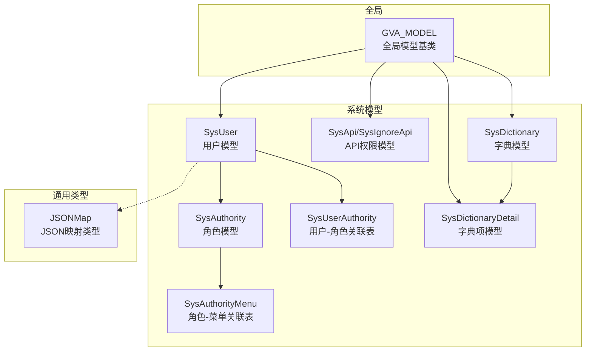
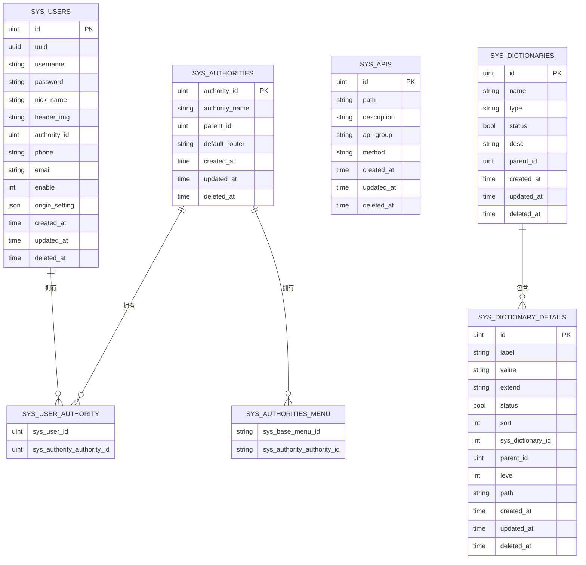
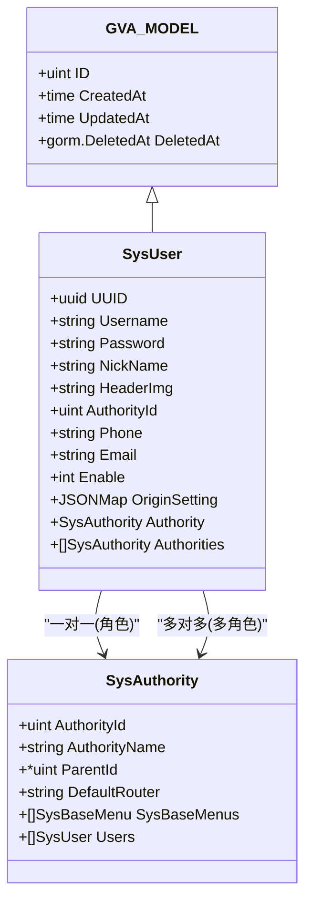
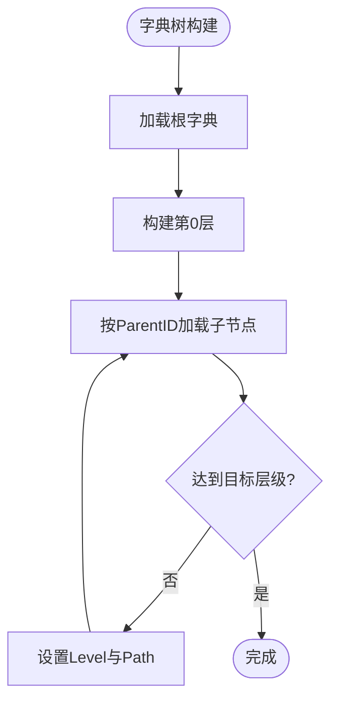
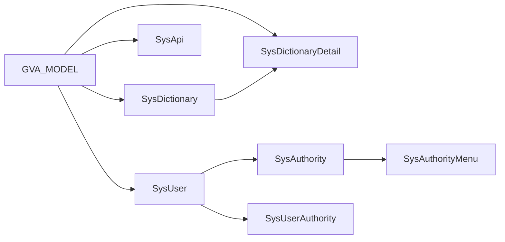

# 数据库模型设计

<cite>
**本文引用的文件**
- [server/global/model.go](file://server/global/model.go)
- [server/config/gorm_mysql.go](file://server/config/gorm_mysql.go)
- [server/config/gorm_pgsql.go](file://server/config/gorm_pgsql.go)
- [server/config/gorm_mssql.go](file://server/config/gorm_mssql.go)
- [server/model/system/sys_user.go](file://server/model/system/sys_user.go)
- [server/model/system/sys_authority.go](file://server/model/system/sys_authority.go)
- [server/model/system/sys_api.go](file://server/model/system/sys_api.go)
- [server/model/system/sys_dictionary.go](file://server/model/system/sys_dictionary.go)
- [server/model/system/sys_dictionary_detail.go](file://server/model/system/sys_dictionary_detail.go)
- [server/model/system/sys_user_authority.go](file://server/model/system/sys_user_authority.go)
- [server/model/system/sys_authority_menu.go](file://server/model/system/sys_authority_menu.go)
- [server/model/common/basetypes.go](file://server/model/common/basetypes.go)
</cite>

## 目录
1. 引言
2. 项目结构
3. 核心组件
4. 架构总览
5. 详细组件分析
6. 依赖分析
7. 性能考量
8. 故障排查指南
9. 结论
10. 附录

## 引言
本文件面向数据库模型设计，聚焦于 Gin-Vue-Admin 项目中的 GORM 模型定义规范与实践，涵盖结构体标签使用、字段类型映射、主键外键定义；模型关系设计（一对一、一对多、多对多）；标签系统（gorm、json、validate）的作用与使用方法；模型生命周期钩子与软删除、时间戳字段处理；以及复杂业务模型的设计模式、字段约束与索引优化策略的实际应用。

## 项目结构
本项目采用分层与按域划分的组织方式：全局模型基类位于 global 层，系统域模型位于 model/system 下，通用类型位于 model/common，数据库连接配置位于 config。模型文件通过统一的基类继承时间戳与软删除能力，并在系统域内体现 RBAC、API 权限、数据字典等核心业务模型。

**图表来源**
- [server/global/model.go:9-14](file://server/global/model.go#L9-L14)
- [server/model/system/sys_user.go:20-34](file://server/model/system/sys_user.go#L20-L34)
- [server/model/system/sys_authority.go:7-19](file://server/model/system/sys_authority.go#L7-L19)
- [server/model/system/sys_user_authority.go:4-6](file://server/model/system/sys_user_authority.go#L4-L6)
- [server/model/system/sys_api.go:7-13](file://server/model/system/sys_api.go#L7-L13)
- [server/model/system/sys_dictionary.go:9-18](file://server/model/system/sys_dictionary.go#L9-L18)
- [server/model/system/sys_dictionary_detail.go:9-22](file://server/model/system/sys_dictionary_detail.go#L9-L22)
- [server/model/system/sys_authority_menu.go:12-19](file://server/model/system/sys_authority_menu.go#L12-L19)
- [server/model/common/basetypes.go:9-36](file://server/model/common/basetypes.go#L9-L36)

**章节来源**
- [server/global/model.go:9-14](file://server/global/model.go#L9-L14)
- [server/model/system/sys_user.go:20-34](file://server/model/system/sys_user.go#L20-L34)
- [server/model/system/sys_authority.go:7-19](file://server/model/system/sys_authority.go#L7-L19)
- [server/model/system/sys_api.go:7-13](file://server/model/system/sys_api.go#L7-L13)
- [server/model/system/sys_dictionary.go:9-18](file://server/model/system/sys_dictionary.go#L9-L18)
- [server/model/system/sys_dictionary_detail.go:9-22](file://server/model/system/sys_dictionary_detail.go#L9-L22)
- [server/model/system/sys_user_authority.go:4-6](file://server/model/system/sys_user_authority.go#L4-L6)
- [server/model/system/sys_authority_menu.go:12-19](file://server/model/system/sys_authority_menu.go#L12-L19)
- [server/model/common/basetypes.go:9-36](file://server/model/common/basetypes.go#L9-L36)

## 核心组件
- 全局模型基类 GVA_MODEL：统一提供主键 ID、CreatedAt、UpdatedAt、DeletedAt（软删除索引），确保所有业务模型具备一致的时间戳与软删除能力。
- 系统用户模型 SysUser：包含 UUID、用户名、密码、昵称、头像、角色 ID、多角色关联、手机号、邮箱、启用状态、原始设置（JSONMap）等字段，并定义与角色、字典、API 等的关联关系。
- 角色模型 SysAuthority：包含角色 ID（唯一且主键）、角色名称、父角色 ID（树形结构）、菜单多对多、用户多对多、默认路由等。
- API 权限模型：SysApi 用于记录接口路径、描述、分组、请求方法；SysIgnoreApi 用于忽略某些接口。
- 字典模型：SysDictionary 与 SysDictionaryDetail 支持树形字典与字典项，包含层级路径、排序、状态等。
- 关联表：SysUserAuthority（用户-角色）、SysAuthorityMenu（角色-菜单）。
- 通用类型：JSONMap 实现 database/sql/driver.Valuer/Scanner，便于将 map 存入 JSON/BLOB 字段。

**章节来源**
- [server/global/model.go:9-14](file://server/global/model.go#L9-L14)
- [server/model/system/sys_user.go:20-34](file://server/model/system/sys_user.go#L20-L34)
- [server/model/system/sys_authority.go:7-19](file://server/model/system/sys_authority.go#L7-L19)
- [server/model/system/sys_api.go:7-13](file://server/model/system/sys_api.go#L7-L13)
- [server/model/system/sys_dictionary.go:9-18](file://server/model/system/sys_dictionary.go#L9-L18)
- [server/model/system/sys_dictionary_detail.go:9-22](file://server/model/system/sys_dictionary_detail.go#L9-L22)
- [server/model/system/sys_user_authority.go:4-6](file://server/model/system/sys_user_authority.go#L4-L6)
- [server/model/system/sys_authority_menu.go:12-19](file://server/model/system/sys_authority_menu.go#L12-L19)
- [server/model/common/basetypes.go:9-36](file://server/model/common/basetypes.go#L9-L36)

## 架构总览
下图展示了系统模型之间的关系与关联表，体现典型的 RBAC 与字典树形结构。

**图表来源**
- [server/model/system/sys_user.go:20-34](file://server/model/system/sys_user.go#L20-L34)
- [server/model/system/sys_authority.go:7-19](file://server/model/system/sys_authority.go#L7-L19)
- [server/model/system/sys_user_authority.go:4-6](file://server/model/system/sys_user_authority.go#L4-L6)
- [server/model/system/sys_api.go:7-13](file://server/model/system/sys_api.go#L7-L13)
- [server/model/system/sys_dictionary.go:9-18](file://server/model/system/sys_dictionary.go#L9-L18)
- [server/model/system/sys_dictionary_detail.go:9-22](file://server/model/system/sys_dictionary_detail.go#L9-L22)
- [server/model/system/sys_authority_menu.go:12-19](file://server/model/system/sys_authority_menu.go#L12-L19)

## 详细组件分析

### 全局模型基类 GVA_MODEL
- 主键：ID（uint，primarykey）
- 时间戳：CreatedAt、UpdatedAt（time.Time）
- 软删除：DeletedAt（gorm.DeletedAt，带索引，用于软删除与 Scope 过滤）
- 作用：为所有业务模型提供统一的时间戳与软删除能力，避免重复定义。

**章节来源**
- [server/global/model.go:9-14](file://server/global/model.go#L9-L14)

### 用户模型 SysUser
- 字段与标签要点
  - UUID：gorm:"index"（建立索引以提升查询性能）
  - Username：gorm:"index"（登录名索引）
  - Password：敏感字段不参与 JSON 输出（json:"-"）
  - AuthorityId：默认值、注释、作为外键
  - Authority：一对一关联（foreignKey:AuthorityId;references:AuthorityId）
  - Authorities：多对多（many2many:sys_user_authority）
  - OriginSetting：JSONMap 映射到 text 字段（type:text;default:null;column:origin_setting）
- 表名：sys_users
- 关系
  - 与 SysAuthority：一对多（用户-角色）
  - 与 SysDictionary/SysDictionaryDetail：间接通过业务逻辑关联
  - 与 SysApi：通过权限中间表关联（见 SysIgnoreApi）

**图表来源**
- [server/global/model.go:9-14](file://server/global/model.go#L9-L14)
- [server/model/system/sys_user.go:20-34](file://server/model/system/sys_user.go#L20-L34)
- [server/model/system/sys_authority.go:7-19](file://server/model/system/sys_authority.go#L7-L19)

**章节来源**
- [server/model/system/sys_user.go:20-34](file://server/model/system/sys_user.go#L20-L34)
- [server/model/system/sys_authority.go:7-19](file://server/model/system/sys_authority.go#L7-L19)

### 角色模型 SysAuthority
- 字段与标签要点
  - AuthorityId：gorm:"not null;unique;primary_key"（唯一且主键）
  - ParentId：*uint（树形父子关系）
  - DataAuthorityId：多对多（树形数据权限）
  - SysBaseMenus：多对多（菜单）
  - Users：多对多（用户）
  - DefaultRouter：默认菜单
- 表名：sys_authorities

**章节来源**
- [server/model/system/sys_authority.go:7-19](file://server/model/system/sys_authority.go#L7-L19)

### API 权限模型 SysApi 与 SysIgnoreApi
- SysApi
  - 字段：Path、Description、ApiGroup、Method（default:POST）
  - 表名：sys_apis
- SysIgnoreApi
  - 字段：Path、Method、Flag（仅用于内存标志，不落库）
  - 表名：sys_ignore_apis

**章节来源**
- [server/model/system/sys_api.go:7-13](file://server/model/system/sys_api.go#L7-L13)
- [server/model/system/sys_api.go:19-24](file://server/model/system/sys_api.go#L19-L24)

### 字典模型 SysDictionary 与 SysDictionaryDetail
- SysDictionary
  - 字段：Name、Type、Status、Desc、ParentID、Children（自关联）、SysDictionaryDetails
  - Children：gorm:"foreignKey:ParentID"（自关联一对多）
  - 表名：sys_dictionaries
- SysDictionaryDetail
  - 字段：Label、Value、Extend、Status、Sort、SysDictionaryID、ParentID、Children（自关联）、Level、Path、Disabled
  - Children：gorm:"foreignKey:ParentID"（自关联一对多）
  - 表名：sys_dictionary_details

**图表来源**
- [server/model/system/sys_dictionary.go:9-18](file://server/model/system/sys_dictionary.go#L9-L18)
- [server/model/system/sys_dictionary_detail.go:9-22](file://server/model/system/sys_dictionary_detail.go#L9-L22)

**章节来源**
- [server/model/system/sys_dictionary.go:9-18](file://server/model/system/sys_dictionary.go#L9-L18)
- [server/model/system/sys_dictionary_detail.go:9-22](file://server/model/system/sys_dictionary_detail.go#L9-L22)

### 关联表
- SysUserAuthority（用户-角色）
  - 字段：SysUserId、SysAuthorityAuthorityId
  - 表名：sys_user_authority
- SysAuthorityMenu（角色-菜单）
  - 字段：SysBaseMenuID、SysAuthorityAuthorityId
  - 表名：sys_authority_menus

**章节来源**
- [server/model/system/sys_user_authority.go:4-6](file://server/model/system/sys_user_authority.go#L4-L6)
- [server/model/system/sys_authority_menu.go:12-19](file://server/model/system/sys_authority_menu.go#L12-L19)

### 通用类型 JSONMap
- 实现 database/sql/driver.Valuer/Scanner，支持将 map 存入数据库 JSON/BLOB 字段
- 在 SysUser 的 OriginSetting 字段中使用，映射到 origin_setting 列

**章节来源**
- [server/model/common/basetypes.go:9-36](file://server/model/common/basetypes.go#L9-L36)
- [server/model/system/sys_user.go:33](file://server/model/system/sys_user.go#L33)

## 依赖分析
- 模型依赖
  - 所有业务模型继承 GVA_MODEL，获得统一的时间戳与软删除能力
  - SysUser 依赖 SysAuthority（一对一与多对多）
  - 字典模型之间通过 ParentID 形成树形关系
  - 角色模型与菜单、用户、数据权限通过关联表建立多对多
- 外部依赖
  - GORM（结构体标签、关系定义、软删除）
  - database/sql/driver（JSONMap 的 Value/Scan）

**图表来源**
- [server/global/model.go:9-14](file://server/global/model.go#L9-L14)
- [server/model/system/sys_user.go:20-34](file://server/model/system/sys_user.go#L20-L34)
- [server/model/system/sys_authority.go:7-19](file://server/model/system/sys_authority.go#L7-L19)
- [server/model/system/sys_user_authority.go:4-6](file://server/model/system/sys_user_authority.go#L4-L6)
- [server/model/system/sys_authority_menu.go:12-19](file://server/model/system/sys_authority_menu.go#L12-L19)
- [server/model/system/sys_dictionary.go:9-18](file://server/model/system/sys_dictionary.go#L9-L18)
- [server/model/system/sys_dictionary_detail.go:9-22](file://server/model/system/sys_dictionary_detail.go#L9-L22)

**章节来源**
- [server/global/model.go:9-14](file://server/global/model.go#L9-L14)
- [server/model/system/sys_user.go:20-34](file://server/model/system/sys_user.go#L20-L34)
- [server/model/system/sys_authority.go:7-19](file://server/model/system/sys_authority.go#L7-L19)
- [server/model/system/sys_user_authority.go:4-6](file://server/model/system/sys_user_authority.go#L4-L6)
- [server/model/system/sys_authority_menu.go:12-19](file://server/model/system/sys_authority_menu.go#L12-L19)
- [server/model/system/sys_dictionary.go:9-18](file://server/model/system/sys_dictionary.go#L9-L18)
- [server/model/system/sys_dictionary_detail.go:9-22](file://server/model/system/sys_dictionary_detail.go#L9-L22)

## 性能考量
- 索引策略
  - UUID、Username 使用 gorm:"index"，提升登录与查询效率
  - DeletedAt 建立索引，配合软删除过滤
- JSON 字段
  - 使用 JSONMap 将 map 序列化存储，减少额外字段拆分带来的维护成本
- 关系查询
  - 多对多通过关联表实现，避免冗余字段；在高频查询场景建议为关联键添加索引
- 字典树
  - 通过 ParentID 与 Level/Path 字段构建层级，查询时可利用索引快速定位子节点

[本节为通用性能指导，无需特定文件引用]

## 故障排查指南
- 软删除未生效
  - 确认 DeletedAt 字段已建立索引，查询时使用 GORM 的 Unscoped 或正确 Scope
- JSON 字段读写异常
  - 检查 JSONMap 的 Value/Scan 实现，确保序列化/反序列化成功
- 多对多关系异常
  - 确认关联表字段命名与 references/foreignKey 一致，检查中间表是否存在
- 字典树层级错误
  - 检查 Level 与 Path 的赋值逻辑，确保插入/更新时同步维护

**章节来源**
- [server/global/model.go:9-14](file://server/global/model.go#L9-L14)
- [server/model/common/basetypes.go:9-36](file://server/model/common/basetypes.go#L9-L36)
- [server/model/system/sys_user_authority.go:4-6](file://server/model/system/sys_user_authority.go#L4-L6)
- [server/model/system/sys_authority_menu.go:12-19](file://server/model/system/sys_authority_menu.go#L12-L19)
- [server/model/system/sys_dictionary_detail.go:9-22](file://server/model/system/sys_dictionary_detail.go#L9-L22)

## 结论
本项目通过统一的 GVA_MODEL 基类与清晰的结构体标签体系，实现了主键、时间戳、软删除的一致性；通过 GORM 的关系标签与关联表，构建了 RBAC 与字典树等复杂业务模型。结合索引与 JSON 字段策略，兼顾了易用性与性能。建议在新增模型时遵循现有标签规范与命名约定，确保一致性与可维护性。

## 附录
- 数据库连接配置（MySQL/PgSQL/MSSQL）用于初始化 GORM 连接，确保各驱动下的 DSN 正确
  - MySQL：基于用户名、密码、主机、端口、数据库名与参数拼接
  - PgSQL：基于 host、user、password、dbname、port、config 拼接
  - MSSQL：基于 sqlserver 协议与参数拼接

**章节来源**
- [server/config/gorm_mysql.go:7-9](file://server/config/gorm_mysql.go#L7-L9)
- [server/config/gorm_pgsql.go:9-17](file://server/config/gorm_pgsql.go#L9-L17)
- [server/config/gorm_mssql.go:8-10](file://server/config/gorm_mssql.go#L8-L10)