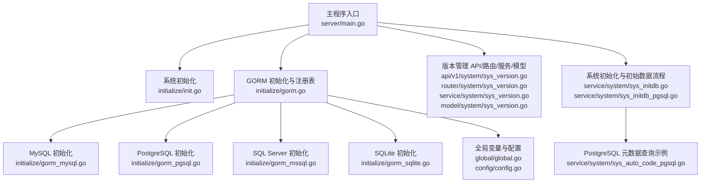
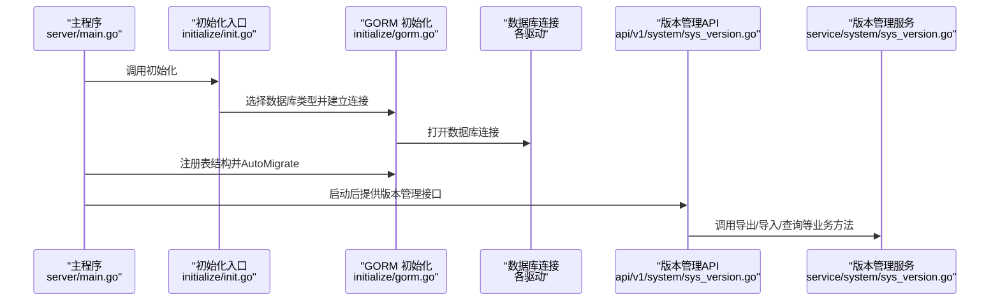
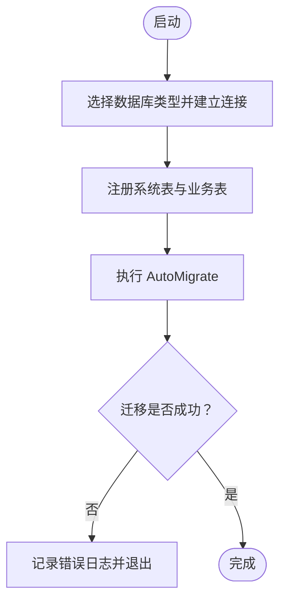
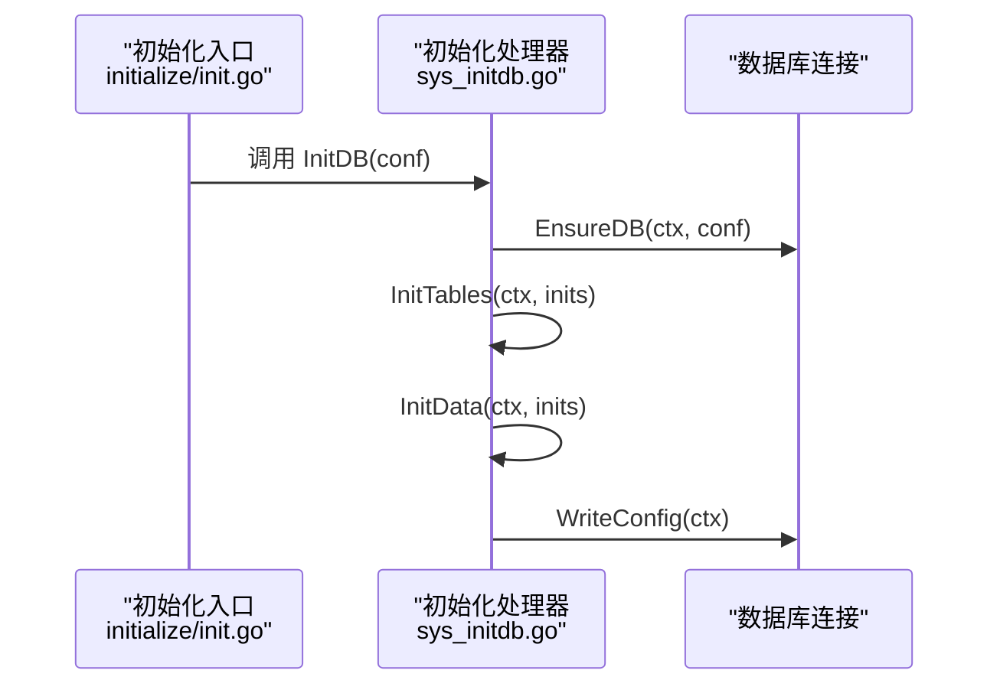
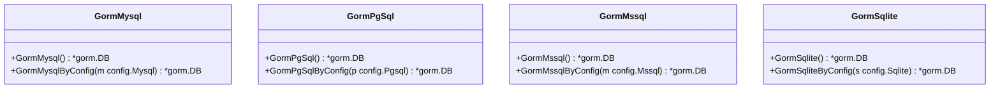
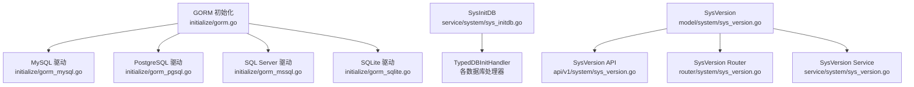

# 数据库迁移管理

<cite>
**本文引用的文件**
- [server/initialize/gorm.go](file://server/initialize/gorm.go)
- [server/initialize/gorm_mysql.go](file://server/initialize/gorm_mysql.go)
- [server/initialize/gorm_pgsql.go](file://server/initialize/gorm_pgsql.go)
- [server/initialize/gorm_mssql.go](file://server/initialize/gorm_mssql.go)
- [server/initialize/gorm_sqlite.go](file://server/initialize/gorm_sqlite.go)
- [server/initialize/gorm_biz.go](file://server/initialize/gorm_biz.go)
- [server/config/db_list.go](file://server/config/db_list.go)
- [server/config/config.go](file://server/config/config.go)
- [server/global/global.go](file://server/global/global.go)
- [server/service/system/sys_initdb.go](file://server/service/system/sys_initdb.go)
- [server/service/system/sys_initdb_mysql.go](file://server/service/system/sys_initdb_mysql.go)
- [server/service/system/sys_initdb_pgsql.go](file://server/service/system/sys_initdb_pgsql.go)
- [server/service/system/sys_initdb_mssql.go](file://server/service/system/sys_initdb_mssql.go)
- [server/service/system/sys_initdb_sqlite.go](file://server/service/system/sys_initdb_sqlite.go)
- [server/model/system/sys_version.go](file://server/model/system/sys_version.go)
- [server/api/v1/system/sys_version.go](file://server/api/v1/system/sys_version.go)
- [server/router/system/sys_version.go](file://server/router/system/sys_version.go)
- [server/service/system/sys_version.go](file://server/service/system/sys_version.go)
- [server/utils/ast/ast_gorm.go](file://server/utils/ast/ast_gorm.go)
- [repowiki/zh/content/数据库设计/数据迁移策略.md](file://repowiki/zh/content/数据库设计/数据迁移策略.md)
</cite>

## 目录
1. [简介](#简介)
2. [项目结构](#项目结构)
3. [核心组件](#核心组件)
4. [架构总览](#架构总览)
5. [详细组件分析](#详细组件分析)
6. [依赖分析](#依赖分析)
7. [性能考量](#性能考量)
8. [故障排查指南](#故障排查指南)
9. [结论](#结论)
10. [附录](#附录)

## 简介
本文件系统化阐述 Gin-Vue-Admin 项目中的数据库迁移管理机制，重点覆盖以下方面：
- AutoMigrate 自动迁移的工作原理：表结构自动创建、字段自动添加、索引自动创建
- 迁移过程中的冲突处理、版本控制策略、回滚机制
- 手动迁移脚本的编写规范：迁移文件命名、版本号管理、依赖关系处理
- 数据库初始化流程：表结构校验、数据预填充、权限初始化
- 最佳实践、性能优化技巧、生产环境迁移注意事项

## 项目结构
围绕数据库迁移与版本管理的关键目录与文件：
- 初始化与数据库适配：server/initialize 下的 GORM 初始化与多数据库驱动封装
- 全局状态与配置：server/global 与 server/config
- 版本管理模型与业务：server/model/system/sys_version.go、server/service/system/sys_version.go、server/api/v1/system/sys_version.go、server/router/system/sys_version.go
- 系统初始化与注册：server/main.go、server/initialize/init.go
- 初始数据与迁移流程：server/service/system/sys_initdb.go、server/service/system/sys_initdb_pgsql.go
- PostgreSQL 字段元数据查询：server/service/system/sys_auto_code_pgsql.go

**图表来源**
- [repowiki/zh/content/数据库设计/数据迁移策略.md:47-59](file://repowiki/zh/content/数据库设计/数据迁移策略.md#L47-L59)

**章节来源**
- [repowiki/zh/content/数据库设计/数据迁移策略.md:35-59](file://repowiki/zh/content/数据库设计/数据迁移策略.md#L35-L59)

## 核心组件
- 数据库初始化与注册
  - GORM 初始化根据配置选择数据库类型并建立连接，随后统一注册表结构并通过 AutoMigrate 完成建表与字段迁移
  - 支持 MySQL、PostgreSQL、SQL Server、SQLite 等驱动
- 版本管理
  - SysVersion 模型用于记录版本元数据与导出的菜单、API、字典等配置快照
  - SysVersionService 提供导出、导入、下载、查询、事务化写入等能力
  - SysVersionApi 与 SysVersionRouter 提供 REST 接口，支持导出 JSON、导入 JSON、分页查询、单条查询与下载
- 系统初始化与初始数据
  - SysInitDB 流程按顺序检查表是否已创建，未创建则迁移建表；随后按序初始化数据，支持取消上下文与顺序控制
  - PostgreSQL 初始化数据流程对每个初始化器逐一执行 InitializeData 并输出进度

**章节来源**
- [repowiki/zh/content/数据库设计/数据迁移策略.md:83-104](file://repowiki/zh/content/数据库设计/数据迁移策略.md#L83-L104)

## 架构总览
下图展示启动阶段的数据库初始化与版本管理交互路径，包括初始化入口、GORM 注册表、版本管理 API 与服务层的关系。

**图表来源**
- [repowiki/zh/content/数据库设计/数据迁移策略.md:107-121](file://repowiki/zh/content/数据库设计/数据迁移策略.md#L107-L121)

## 详细组件分析

### AutoMigrate 自动迁移机制
AutoMigrate 在系统启动时自动完成表结构与字段的创建与更新。其工作流程如下：
- 选择数据库类型并建立连接
- 注册系统表与业务表
- 对注册的模型执行 AutoMigrate，自动创建缺失的表、字段与索引
- 错误处理：若迁移失败，记录日志并终止进程

**图表来源**
- [server/initialize/gorm.go:14-88](file://server/initialize/gorm.go#L14-L88)
- [server/initialize/gorm_biz.go:7-14](file://server/initialize/gorm_biz.go#L7-L14)

**章节来源**
- [server/initialize/gorm.go:37-88](file://server/initialize/gorm.go#L37-L88)
- [server/initialize/gorm_biz.go:7-14](file://server/initialize/gorm_biz.go#L7-L14)

### 迁移过程中的冲突处理、版本控制与回滚
- 冲突处理
  - AutoMigrate 会尝试创建缺失的表、字段与索引，但不会删除现有结构或字段，避免破坏性变更
  - 若迁移失败，系统会记录错误并停止，防止部分迁移导致的数据不一致
- 版本控制策略
  - 通过 SysVersion 模型记录版本元数据与导出的配置快照，支持跨环境迁移与一致性验证
  - SysVersionService 提供导出/导入能力，便于在不同环境间同步配置
- 回滚机制
  - AutoMigrate 本身不提供回滚能力，建议在生产环境采用显式迁移脚本与严格的版本控制，配合备份与回滚策略

**章节来源**
- [server/model/system/sys_version.go:8-21](file://server/model/system/sys_version.go#L8-L21)
- [server/service/system/sys_version.go:11-231](file://server/service/system/sys_version.go#L11-L231)
- [server/api/v1/system/sys_version.go:21-487](file://server/api/v1/system/sys_version.go#L21-L487)
- [server/router/system/sys_version.go:8-26](file://server/router/system/sys_version.go#L8-L26)

### 手动迁移脚本编写规范
- 迁移文件命名
  - 建议采用“版本号_描述”的命名方式，例如 001_initial_tables.go、002_add_users_index.go
- 版本号管理
  - 使用递增数字作为版本号，确保迁移顺序明确且可追溯
- 依赖关系处理
  - 在迁移脚本中明确声明依赖的前置迁移，确保执行顺序正确
  - 对于跨模块的迁移，需在脚本中处理依赖关系，避免并发执行导致的冲突

**章节来源**
- [repowiki/zh/content/数据库设计/数据迁移策略.md:35-59](file://repowiki/zh/content/数据库设计/数据迁移策略.md#L35-L59)

### 数据库初始化流程
- 表结构校验
  - SysInitDB 流程按顺序检查表是否已创建，未创建则迁移建表
- 数据预填充
  - 初始化数据流程按序执行 InitializeData，支持取消上下文与顺序控制
- 权限初始化
  - PostgreSQL 初始化数据流程对每个初始化器逐一执行 InitializeData 并输出进度

**图表来源**
- [server/service/system/sys_initdb.go:89-139](file://server/service/system/sys_initdb.go#L89-L139)

**章节来源**
- [server/service/system/sys_initdb.go:89-139](file://server/service/system/sys_initdb.go#L89-L139)
- [server/service/system/sys_initdb_pgsql.go:84-101](file://server/service/system/sys_initdb_pgsql.go#L84-L101)

### 多数据库驱动适配
- MySQL
  - 通过 DSN 配置连接，设置默认字符串长度与表选项，配置连接池
- PostgreSQL
  - 通过 DSN 配置连接，设置连接池参数
- SQL Server
  - 通过 DSN 配置连接，设置默认字符串长度与表选项，配置连接池
- SQLite
  - 使用内置 sqlite 驱动，配置连接池参数

**图表来源**
- [server/initialize/gorm_mysql.go:12-49](file://server/initialize/gorm_mysql.go#L12-L49)
- [server/initialize/gorm_pgsql.go:11-44](file://server/initialize/gorm_pgsql.go#L11-L44)
- [server/initialize/gorm_mssql.go:20-65](file://server/initialize/gorm_mssql.go#L20-L65)
- [server/initialize/gorm_sqlite.go:11-39](file://server/initialize/gorm_sqlite.go#L11-L39)

**章节来源**
- [server/initialize/gorm_mysql.go:12-49](file://server/initialize/gorm_mysql.go#L12-L49)
- [server/initialize/gorm_pgsql.go:11-44](file://server/initialize/gorm_pgsql.go#L11-L44)
- [server/initialize/gorm_mssql.go:20-65](file://server/initialize/gorm_mssql.go#L20-L65)
- [server/initialize/gorm_sqlite.go:11-39](file://server/initialize/gorm_sqlite.go#L11-L39)

### 配置与全局状态
- 配置结构
  - Server 包含系统、数据库、缓存、对象存储等配置项
  - DBList 支持多数据库实例配置
- 全局状态
  - GVA_DB 保存当前活动数据库连接
  - GVA_DBList 保存多数据库实例映射
  - GVA_CONFIG 保存全局配置

**章节来源**
- [server/config/config.go:3-41](file://server/config/config.go#L3-L41)
- [server/config/db_list.go:17-54](file://server/config/db_list.go#L17-L54)
- [server/global/global.go:25-69](file://server/global/global.go#L25-L69)

### AST 辅助与自动化
- AST 工具
  - 通过 AST 解析与修改源码，自动向 AutoMigrate 调用中追加模型参数
  - 用于在生成代码时自动维护迁移模型列表

**章节来源**
- [server/utils/ast/ast_gorm.go:103-166](file://server/utils/ast/ast_gorm.go#L103-L166)

## 依赖分析
- 组件耦合与内聚
  - GORM 初始化与多数据库驱动封装具有高内聚、低耦合特性，通过工厂方法选择具体驱动
  - SysInitDB 通过接口抽象与排序机制管理初始化流程，降低模块间耦合
- 直接与间接依赖
  - GORM 初始化依赖配置与内部日志配置
  - SysInitDB 依赖 TypedDBInitHandler 实现不同数据库的初始化策略
- 外部依赖与集成点
  - 各数据库驱动通过 GORM 适配层集成
  - 版本管理通过 API 层暴露，供前端与外部系统使用

**图表来源**
- [server/initialize/gorm.go:14-88](file://server/initialize/gorm.go#L14-L88)
- [server/service/system/sys_initdb.go:87-139](file://server/service/system/sys_initdb.go#L87-L139)
- [server/model/system/sys_version.go:8-21](file://server/model/system/sys_version.go#L8-L21)
- [server/api/v1/system/sys_version.go:21-487](file://server/api/v1/system/sys_version.go#L21-L487)
- [server/router/system/sys_version.go:8-26](file://server/router/system/sys_version.go#L8-L26)
- [server/service/system/sys_version.go:11-231](file://server/service/system/sys_version.go#L11-L231)

**章节来源**
- [server/initialize/gorm.go:14-88](file://server/initialize/gorm.go#L14-L88)
- [server/service/system/sys_initdb.go:87-139](file://server/service/system/sys_initdb.go#L87-L139)
- [server/model/system/sys_version.go:8-21](file://server/model/system/sys_version.go#L8-L21)
- [server/api/v1/system/sys_version.go:21-487](file://server/api/v1/system/sys_version.go#L21-L487)
- [server/router/system/sys_version.go:8-26](file://server/router/system/sys_version.go#L8-L26)
- [server/service/system/sys_version.go:11-231](file://server/service/system/sys_version.go#L11-L231)

## 性能考量
- 连接池与并发
  - 各数据库驱动均设置最大空闲连接数与最大打开连接数，建议结合业务峰值合理配置
- AutoMigrate 开销
  - 生产环境建议谨慎开启自动迁移，优先通过显式迁移脚本控制版本演进
- 事务与批量导入
  - 导入菜单/API/字典采用事务，减少中间态数据；建议在大体量导入时分批处理并设置超时

**章节来源**
- [repowiki/zh/content/数据库设计/数据迁移策略.md:307-316](file://repowiki/zh/content/数据库设计/数据迁移策略.md#L307-L316)

## 故障排查指南
- 启动阶段无法连接数据库
  - 检查配置项与 DSN；确认数据库服务可用；查看 GORM 初始化日志
- AutoMigrate 失败
  - 关闭禁用迁移开关后跳过；否则检查权限、字符集、引擎设置；查看具体错误日志
- 版本管理导入失败
  - 检查导入 JSON 格式；确认版本信息完整性；查看服务层日志定位具体步骤
- 初始化数据流程中断
  - 使用取消上下文触发中断；检查初始化器顺序与依赖；查看 PostgreSQL 初始化数据流程日志

**章节来源**
- [repowiki/zh/content/数据库设计/数据迁移策略.md:317-332](file://repowiki/zh/content/数据库设计/数据迁移策略.md#L317-L332)

## 结论
本项目通过 GORM 的 AutoMigrate 与初始化器流程实现了数据库表结构的自动注册与迁移；通过 SysVersion 模型与 API 提供了配置快照的导出/导入能力，满足版本化管理与跨环境迁移的需求。建议在生产环境中采用显式迁移脚本与严格的版本控制，配合备份与回滚策略，确保变更可控、可追踪、可恢复。

## 附录
- 相关实现文件路径
  - GORM 初始化与注册表：server/initialize/gorm.go
  - 各数据库驱动：server/initialize/gorm_mysql.go、server/initialize/gorm_pgsql.go、server/initialize/gorm_mssql.go、server/initialize/gorm_sqlite.go
  - 业务表自动迁移：server/initialize/gorm_biz.go
  - 初始化流程：server/service/system/sys_initdb.go
  - 版本管理模型与接口：server/model/system/sys_version.go、server/api/v1/system/sys_version.go、server/router/system/sys_version.go、server/service/system/sys_version.go
  - 配置与全局状态：server/config/config.go、server/config/db_list.go、server/global/global.go
  - AST 辅助：server/utils/ast/ast_gorm.go