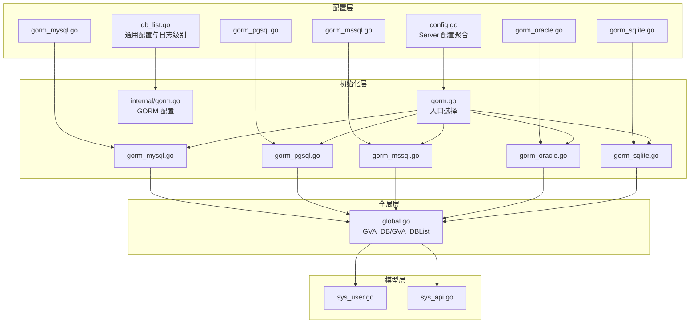
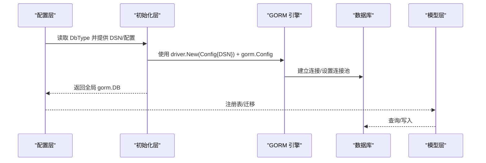
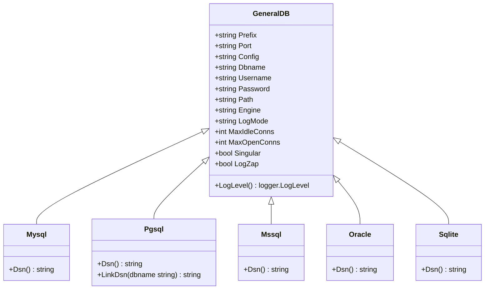
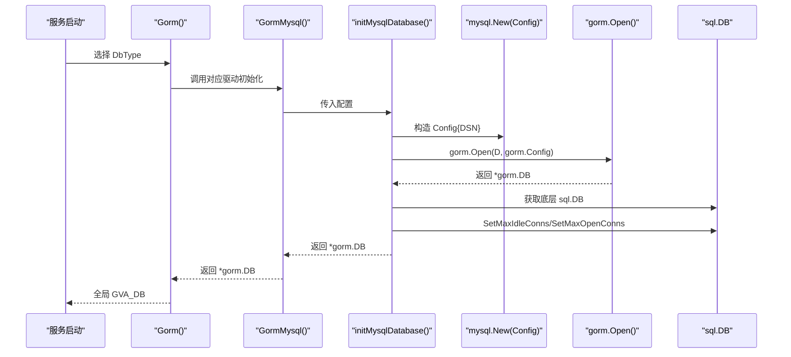
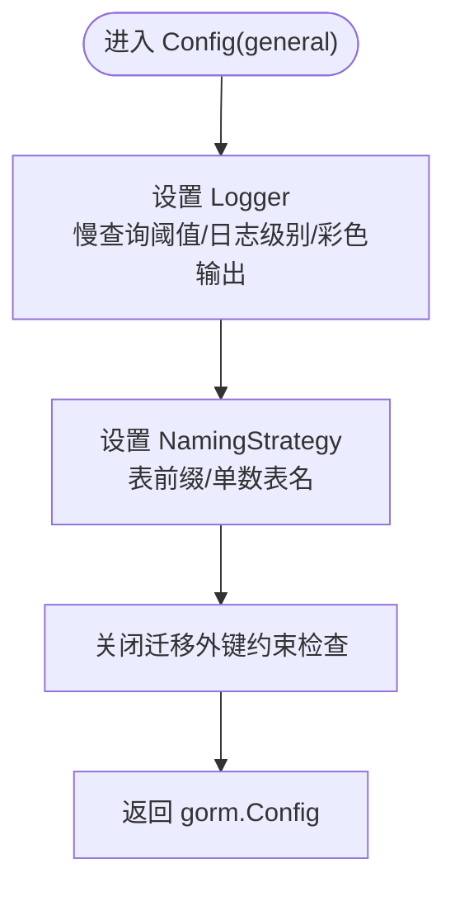
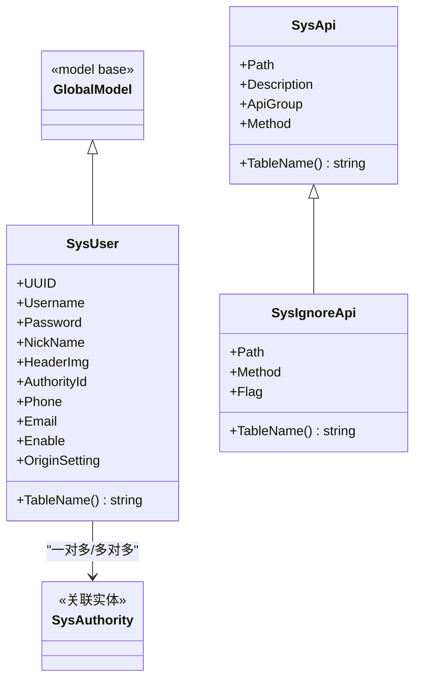
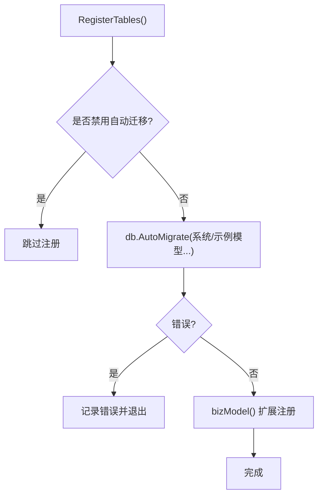
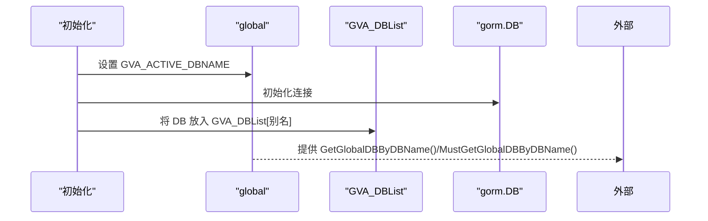
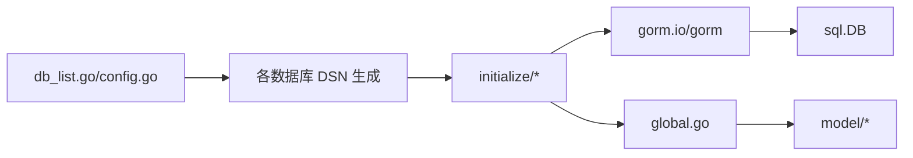

# 数据访问层

<cite>
**本文引用的文件**
- [server/config/gorm_mysql.go](file://server/config/gorm_mysql.go)
- [server/config/gorm_pgsql.go](file://server/config/gorm_pgsql.go)
- [server/config/gorm_mssql.go](file://server/config/gorm_mssql.go)
- [server/config/gorm_oracle.go](file://server/config/gorm_oracle.go)
- [server/config/gorm_sqlite.go](file://server/config/gorm_sqlite.go)
- [server/config/db_list.go](file://server/config/db_list.go)
- [server/config/config.go](file://server/config/config.go)
- [server/initialize/gorm.go](file://server/initialize/gorm.go)
- [server/initialize/gorm_mysql.go](file://server/initialize/gorm_mysql.go)
- [server/initialize/gorm_pgsql.go](file://server/initialize/gorm_pgsql.go)
- [server/initialize/gorm_mssql.go](file://server/initialize/gorm_mssql.go)
- [server/initialize/gorm_oracle.go](file://server/initialize/gorm_oracle.go)
- [server/initialize/gorm_sqlite.go](file://server/initialize/gorm_sqlite.go)
- [server/initialize/internal/gorm.go](file://server/initialize/internal/gorm.go)
- [server/global/global.go](file://server/global/global.go)
- [server/model/system/sys_user.go](file://server/model/system/sys_user.go)
- [server/model/system/sys_api.go](file://server/model/system/sys_api.go)
</cite>

## 目录
1. [简介](#简介)
2. [项目结构](#项目结构)
3. [核心组件](#核心组件)
4. [架构总览](#架构总览)
5. [详细组件分析](#详细组件分析)
6. [依赖分析](#依赖分析)
7. [性能考量](#性能考量)
8. [故障排查指南](#故障排查指南)
9. [结论](#结论)
10. [附录](#附录)

## 简介
本文件面向 Gin-Vue-Admin 项目的“数据访问层”，系统性阐述基于 GORM 的数据访问层设计与实现，涵盖 ORM 配置、数据库连接管理、模型定义规范、多数据库支持（MySQL、PostgreSQL、SQL Server、Oracle、SQLite）、迁移策略、连接池与事务处理、查询优化与性能调优等。文档以仓库中实际源码为依据，配合图示帮助读者快速理解与落地。

## 项目结构
数据访问层主要分布在以下模块：
- 配置层：定义各数据库驱动的 DSN 生成与通用配置项，位于 server/config 下
- 初始化层：按配置选择具体数据库驱动并建立连接，位于 server/initialize 下
- 模型层：系统与示例模型定义，位于 server/model 下
- 全局层：全局数据库实例、DB 列表、Redis 列表等共享资源，位于 server/global 下

图表来源
- [server/config/db_list.go:1-54](file://server/config/db_list.go#L1-L54)
- [server/config/gorm_mysql.go:1-10](file://server/config/gorm_mysql.go#L1-L10)
- [server/config/gorm_pgsql.go:1-18](file://server/config/gorm_pgsql.go#L1-L18)
- [server/config/gorm_mssql.go:1-11](file://server/config/gorm_mssql.go#L1-L11)
- [server/config/gorm_oracle.go:1-19](file://server/config/gorm_oracle.go#L1-L19)
- [server/config/gorm_sqlite.go:1-14](file://server/config/gorm_sqlite.go#L1-L14)
- [server/config/config.go:1-41](file://server/config/config.go#L1-L41)
- [server/initialize/gorm.go:1-88](file://server/initialize/gorm.go#L1-L88)
- [server/initialize/gorm_mysql.go:1-49](file://server/initialize/gorm_mysql.go#L1-L49)
- [server/initialize/gorm_pgsql.go:1-44](file://server/initialize/gorm_pgsql.go#L1-L44)
- [server/initialize/gorm_mssql.go:1-65](file://server/initialize/gorm_mssql.go#L1-L65)
- [server/initialize/gorm_oracle.go:1-38](file://server/initialize/gorm_oracle.go#L1-L38)
- [server/initialize/gorm_sqlite.go:1-39](file://server/initialize/gorm_sqlite.go#L1-L39)
- [server/initialize/internal/gorm.go:1-32](file://server/initialize/internal/gorm.go#L1-L32)
- [server/global/global.go:1-69](file://server/global/global.go#L1-L69)
- [server/model/system/sys_user.go:1-63](file://server/model/system/sys_user.go#L1-L63)
- [server/model/system/sys_api.go:1-29](file://server/model/system/sys_api.go#L1-L29)

章节来源
- [server/config/db_list.go:1-54](file://server/config/db_list.go#L1-L54)
- [server/initialize/gorm.go:1-88](file://server/initialize/gorm.go#L1-L88)
- [server/global/global.go:1-69](file://server/global/global.go#L1-L69)

## 核心组件
- 通用配置与 DSN 提供者
  - 通用配置结构体包含数据库地址、端口、用户名、密码、数据库名、高级配置、日志模式、连接池参数、是否单数表名等，并提供日志等级解析
  - 各数据库类型均嵌入通用配置并通过 Dsn() 生成各自 DSN
- 初始化入口
  - 根据系统配置的 DbType 选择对应数据库初始化函数，返回全局 gorm 实例；同时维护当前活动数据库名
- GORM 配置
  - 自定义 Logger（慢查询阈值、日志级别、彩色输出）
  - 命名策略（表前缀、单数表名）
  - 关闭迁移时外键约束检查
- 迁移与表注册
  - 在启用 AutoMigrate 时，注册系统与示例模型表
- 全局数据库实例
  - 提供 GVA_DB 与 GVA_DBList（多库场景），以及按库名获取 DB 的方法

章节来源
- [server/config/db_list.go:16-54](file://server/config/db_list.go#L16-L54)
- [server/config/gorm_mysql.go:3-9](file://server/config/gorm_mysql.go#L3-L9)
- [server/config/gorm_pgsql.go:3-17](file://server/config/gorm_pgsql.go#L3-L17)
- [server/config/gorm_mssql.go:3-10](file://server/config/gorm_mssql.go#L3-L10)
- [server/config/gorm_oracle.go:9-18](file://server/config/gorm_oracle.go#L9-L18)
- [server/config/gorm_sqlite.go:7-13](file://server/config/gorm_sqlite.go#L7-L13)
- [server/initialize/gorm.go:14-35](file://server/initialize/gorm.go#L14-L35)
- [server/initialize/internal/gorm.go:16-31](file://server/initialize/internal/gorm.go#L16-L31)
- [server/initialize/gorm.go:37-87](file://server/initialize/gorm.go#L37-L87)
- [server/global/global.go:25-69](file://server/global/global.go#L25-L69)

## 架构总览
下图展示从配置到初始化再到模型使用的整体流程：

图表来源
- [server/initialize/gorm.go:14-35](file://server/initialize/gorm.go#L14-L35)
- [server/initialize/gorm_mysql.go:26-48](file://server/initialize/gorm_mysql.go#L26-L48)
- [server/initialize/gorm_pgsql.go:24-43](file://server/initialize/gorm_pgsql.go#L24-L43)
- [server/initialize/gorm_mssql.go:20-42](file://server/initialize/gorm_mssql.go#L20-L42)
- [server/initialize/gorm_oracle.go:22-37](file://server/initialize/gorm_oracle.go#L22-L37)
- [server/initialize/gorm_sqlite.go:22-38](file://server/initialize/gorm_sqlite.go#L22-L38)
- [server/initialize/internal/gorm.go:16-31](file://server/initialize/internal/gorm.go#L16-L31)
- [server/initialize/gorm.go:37-87](file://server/initialize/gorm.go#L37-L87)

## 详细组件分析

### 组件一：多数据库适配与 DSN 生成
- MySQL
  - DSN 拼接格式包含用户名、密码、主机、端口、数据库名与高级配置
  - 初始化时设置表引擎、连接池参数
- PostgreSQL
  - DSN 采用键值对形式，支持预设协议
  - 初始化时设置连接池参数
- SQL Server
  - DSN 采用 sqlserver:// 协议，包含用户名、密码、主机、端口、数据库名与加密参数
  - 初始化时设置连接池参数
- Oracle
  - DSN 采用 oracle:// 协议，使用 URL 编码处理敏感字符
  - 初始化时设置连接池参数
- SQLite
  - DSN 为本地文件路径，使用专用 sqlite 驱动
  - 初始化时设置连接池参数

图表来源
- [server/config/db_list.go:16-54](file://server/config/db_list.go#L16-L54)
- [server/config/gorm_mysql.go:3-9](file://server/config/gorm_mysql.go#L3-L9)
- [server/config/gorm_pgsql.go:3-17](file://server/config/gorm_pgsql.go#L3-L17)
- [server/config/gorm_mssql.go:3-10](file://server/config/gorm_mssql.go#L3-L10)
- [server/config/gorm_oracle.go:9-18](file://server/config/gorm_oracle.go#L9-L18)
- [server/config/gorm_sqlite.go:7-13](file://server/config/gorm_sqlite.go#L7-L13)

章节来源
- [server/config/gorm_mysql.go:3-9](file://server/config/gorm_mysql.go#L3-L9)
- [server/config/gorm_pgsql.go:3-17](file://server/config/gorm_pgsql.go#L3-L17)
- [server/config/gorm_mssql.go:3-10](file://server/config/gorm_mssql.go#L3-L10)
- [server/config/gorm_oracle.go:9-18](file://server/config/gorm_oracle.go#L9-L18)
- [server/config/gorm_sqlite.go:7-13](file://server/config/gorm_sqlite.go#L7-L13)

### 组件二：初始化流程与连接池
- 初始化入口根据 DbType 分派到具体驱动初始化函数
- 各驱动初始化函数：
  - 读取配置并构造 DSN
  - 创建 driver.Config
  - 通过 gorm.Open(driver.New(config), gorm.Config) 建立连接
  - 设置连接池：最大空闲连接数、最大打开连接数
  - 可选设置表引擎（如 MySQL/SQL Server）

图表来源
- [server/initialize/gorm.go:14-35](file://server/initialize/gorm.go#L14-L35)
- [server/initialize/gorm_mysql.go:12-48](file://server/initialize/gorm_mysql.go#L12-L48)
- [server/initialize/gorm_pgsql.go:11-43](file://server/initialize/gorm_pgsql.go#L11-L43)
- [server/initialize/gorm_mssql.go:20-42](file://server/initialize/gorm_mssql.go#L20-L42)
- [server/initialize/gorm_oracle.go:11-37](file://server/initialize/gorm_oracle.go#L11-L37)
- [server/initialize/gorm_sqlite.go:11-38](file://server/initialize/gorm_sqlite.go#L11-L38)

章节来源
- [server/initialize/gorm.go:14-35](file://server/initialize/gorm.go#L14-L35)
- [server/initialize/gorm_mysql.go:26-48](file://server/initialize/gorm_mysql.go#L26-L48)
- [server/initialize/gorm_pgsql.go:24-43](file://server/initialize/gorm_pgsql.go#L24-L43)
- [server/initialize/gorm_mssql.go:20-42](file://server/initialize/gorm_mssql.go#L20-L42)
- [server/initialize/gorm_oracle.go:22-37](file://server/initialize/gorm_oracle.go#L22-L37)
- [server/initialize/gorm_sqlite.go:22-38](file://server/initialize/gorm_sqlite.go#L22-L38)

### 组件三：GORM 配置与命名策略
- 日志配置：慢查询阈值、日志级别、彩色输出
- 命名策略：表前缀、单数表名
- 迁移行为：关闭外键约束检查，避免迁移阶段的外键报错

图表来源
- [server/initialize/internal/gorm.go:16-31](file://server/initialize/internal/gorm.go#L16-L31)

章节来源
- [server/initialize/internal/gorm.go:16-31](file://server/initialize/internal/gorm.go#L16-L31)

### 组件四：模型定义与关系
- 模型基类
  - 使用全局模型字段，统一时间、软删除、主键等
- 用户模型
  - 字段：UUID、用户名、密码、昵称、头像、角色ID、手机号、邮箱、启用状态、原始设置
  - 关系：一对一角色、多对多角色集合
  - 索引：用户名、UUID
- API 模型
  - 字段：路径、描述、分组、请求方法
  - 忽略 API 模型用于白名单或忽略匹配

图表来源
- [server/model/system/sys_user.go:20-38](file://server/model/system/sys_user.go#L20-L38)
- [server/model/system/sys_user.go:36-63](file://server/model/system/sys_user.go#L36-L63)
- [server/model/system/sys_api.go:7-29](file://server/model/system/sys_api.go#L7-L29)

章节来源
- [server/model/system/sys_user.go:20-38](file://server/model/system/sys_user.go#L20-L38)
- [server/model/system/sys_user.go:36-63](file://server/model/system/sys_user.go#L36-L63)
- [server/model/system/sys_api.go:7-29](file://server/model/system/sys_api.go#L7-L29)

### 组件五：迁移与表注册
- 自动迁移开关
  - 当禁用自动迁移时跳过表注册
- 注册表清单
  - 包含系统与示例模型的多个表
- 业务模型扩展
  - 支持在注册后扩展业务模型

图表来源
- [server/initialize/gorm.go:37-87](file://server/initialize/gorm.go#L37-L87)

章节来源
- [server/initialize/gorm.go:37-87](file://server/initialize/gorm.go#L37-L87)

### 组件六：多数据库与全局实例
- 全局实例
  - GVA_DB：当前活跃数据库
  - GVA_DBList：多数据库实例列表
  - 提供按库名获取 DB 的安全方法
- 活动数据库名
  - 初始化时设置当前活动数据库名，便于后续切换或日志标识

图表来源
- [server/initialize/gorm.go:14-35](file://server/initialize/gorm.go#L14-L35)
- [server/global/global.go:25-69](file://server/global/global.go#L25-L69)

章节来源
- [server/global/global.go:25-69](file://server/global/global.go#L25-L69)
- [server/initialize/gorm.go:14-35](file://server/initialize/gorm.go#L14-L35)

## 依赖分析
- 配置到驱动的依赖
  - 各数据库类型依赖通用配置结构体，通过 Dsn() 生成 DSN
  - 初始化层依赖对应驱动包与 GORM
- 模型到数据库的依赖
  - 模型依赖全局模型基类与 GORM 注解
  - 通过全局 gorm.DB 进行查询与写入
- 连接池与日志
  - 初始化时设置连接池参数
  - GORM 配置统一管理日志与命名策略

图表来源
- [server/config/db_list.go:16-54](file://server/config/db_list.go#L16-L54)
- [server/config/config.go:3-41](file://server/config/config.go#L3-L41)
- [server/initialize/gorm.go:14-35](file://server/initialize/gorm.go#L14-L35)
- [server/global/global.go:25-69](file://server/global/global.go#L25-L69)
- [server/model/system/sys_user.go:20-38](file://server/model/system/sys_user.go#L20-L38)

章节来源
- [server/config/db_list.go:16-54](file://server/config/db_list.go#L16-L54)
- [server/config/config.go:3-41](file://server/config/config.go#L3-L41)
- [server/initialize/gorm.go:14-35](file://server/initialize/gorm.go#L14-L35)
- [server/global/global.go:25-69](file://server/global/global.go#L25-L69)

## 性能考量
- 连接池参数
  - 通过通用配置中的最大空闲连接数与最大打开连接数进行限制，避免连接暴涨
- 日志与慢查询
  - GORM 日志慢查询阈值可调，建议生产环境适当提高阈值并降低日志级别
- 命名策略
  - 单数表名与表前缀有助于团队协作与历史兼容
- 迁移策略
  - 关闭外键约束检查减少迁移失败风险，但需确保业务层自行保证参照完整性
- 查询优化建议
  - 为高频查询字段添加索引（如用户名、UUID）
  - 使用预加载/联表查询时注意 N+1 问题，必要时分页或批量加载
  - 对大结果集使用分页与投影字段，避免一次性加载全部列

## 故障排查指南
- 连接失败
  - 检查 DSN 拼接是否正确（主机、端口、数据库名、用户名、密码）
  - 确认数据库服务可达与网络策略放行
- 迁移失败
  - 查看 AutoMigrate 输出的日志，确认表名与字段映射是否符合预期
  - 若存在外键冲突，检查迁移配置与业务数据一致性
- 连接池耗尽
  - 调整最大空闲/打开连接数，结合压测评估并发峰值
- 日志过多
  - 调整日志级别与慢查询阈值，避免生产环境产生大量日志

章节来源
- [server/initialize/gorm.go:37-87](file://server/initialize/gorm.go#L37-L87)
- [server/initialize/internal/gorm.go:16-31](file://server/initialize/internal/gorm.go#L16-L31)
- [server/config/db_list.go:27-31](file://server/config/db_list.go#L27-L31)

## 结论
本数据访问层以 GORM 为核心，通过统一的配置结构与驱动适配，实现了对 MySQL、PostgreSQL、SQL Server、Oracle、SQLite 的一致接入。初始化层负责按配置选择驱动、建立连接并设置连接池与日志策略；模型层遵循统一的基类与注解规范，清晰表达字段与关系；迁移层支持自动迁移与扩展注册。整体设计兼顾易用性与可扩展性，适合在多数据库与多租户场景下演进。

## 附录
- 配置项参考
  - 通用配置：数据库地址、端口、用户名、密码、数据库名、高级配置、日志模式、连接池参数、单数表名、是否使用 Zap 日志
  - 特殊化配置：DbType、DBList、各数据库类型配置
- 常见实践
  - 生产环境建议开启连接池与慢查询日志分级
  - 迁移阶段谨慎处理外键与索引，避免阻塞
  - 多数据库场景下通过 GVA_DBList 管理不同实例