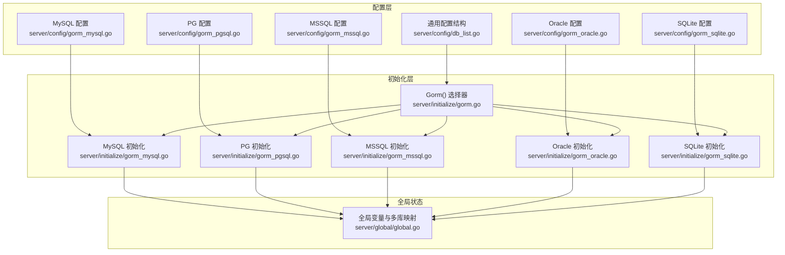
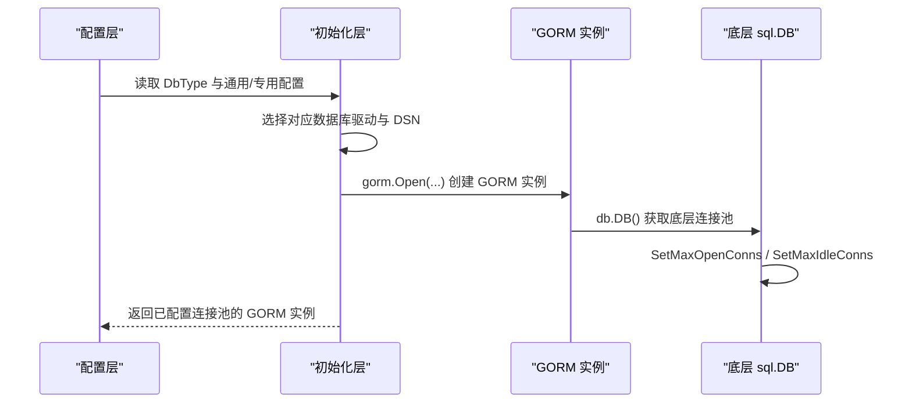
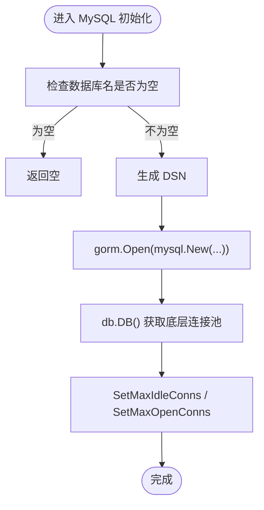
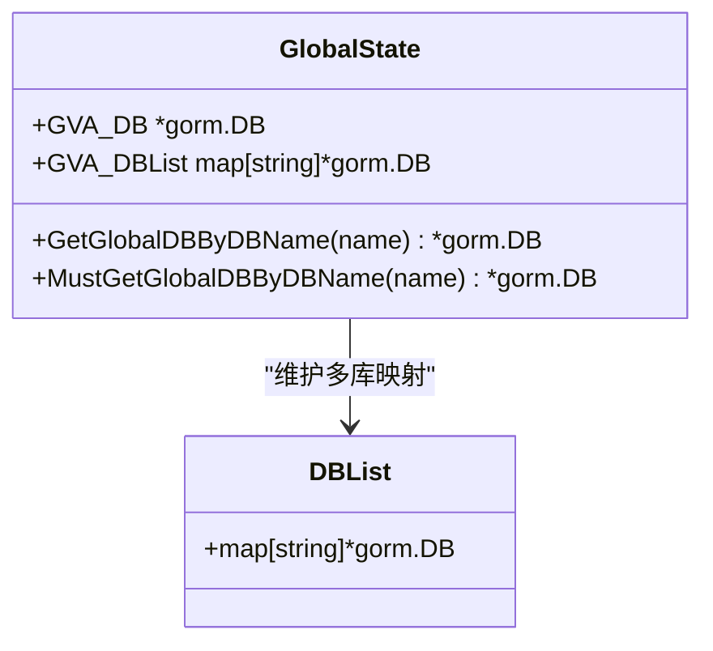
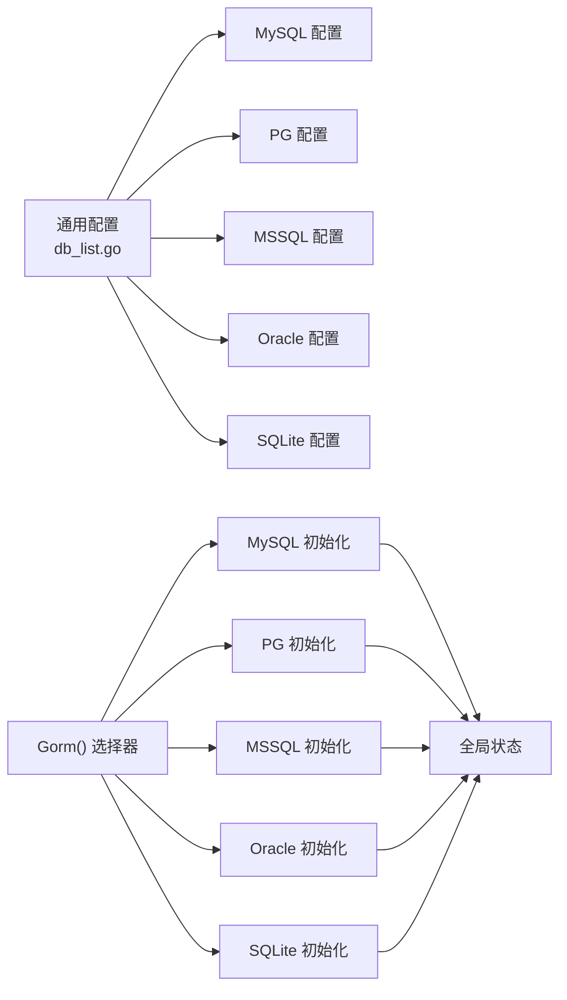

# 连接池管理

<cite>
**本文引用的文件**
- [server/config/db_list.go](file://server/config/db_list.go)
- [server/config/gorm_mysql.go](file://server/config/gorm_mysql.go)
- [server/config/gorm_pgsql.go](file://server/config/gorm_pgsql.go)
- [server/config/gorm_mssql.go](file://server/config/gorm_mssql.go)
- [server/config/gorm_oracle.go](file://server/config/gorm_oracle.go)
- [server/config/gorm_sqlite.go](file://server/config/gorm_sqlite.go)
- [server/initialize/gorm.go](file://server/initialize/gorm.go)
- [server/initialize/gorm_mysql.go](file://server/initialize/gorm_mysql.go)
- [server/initialize/gorm_pgsql.go](file://server/initialize/gorm_pgsql.go)
- [server/initialize/gorm_mssql.go](file://server/initialize/gorm_mssql.go)
- [server/initialize/gorm_oracle.go](file://server/initialize/gorm_oracle.go)
- [server/initialize/gorm_sqlite.go](file://server/initialize/gorm_sqlite.go)
- [server/global/global.go](file://server/global/global.go)
- [repowiki/zh/content/数据库设计/数据库配置与支持.md](file://repowiki/zh/content/数据库设计/数据库配置与支持.md)
- [repowiki/zh/content/系统架构/性能优化策略.md](file://repowiki/zh/content/系统架构/性能优化策略.md)
- [repowiki/zh/content/部署运维/性能优化与调优.md](file://repowiki/zh/content/部署运维/性能优化与调优.md)
- [repowiki/zh/content/后端系统/数据库层.md](file://repowiki/zh/content/后端系统/数据库层.md)
</cite>

## 目录
1. [简介](#简介)
2. [项目结构](#项目结构)
3. [核心组件](#核心组件)
4. [架构总览](#架构总览)
5. [详细组件分析](#详细组件分析)
6. [依赖分析](#依赖分析)
7. [性能考量](#性能考量)
8. [故障排查指南](#故障排查指南)
9. [结论](#结论)
10. [附录](#附录)

## 简介
本文件聚焦于 Gin-Vue-Admin 项目中 GORM 连接池的配置与管理，系统性阐述以下内容：
- GORM 连接池关键参数：最大连接数、空闲连接数、连接生命周期设置
- 不同数据库类型的连接池特性差异：连接复用策略、超时处理、健康检查
- 高并发场景下的连接池优化策略：大小调优、连接泄漏检测、监控指标
- 连接池与数据库性能的关系：连接争用分析、死锁预防、故障恢复
- 实战案例与性能监控方案

## 项目结构
围绕连接池管理的关键目录与文件：
- 配置层：集中定义通用与专用数据库配置结构体及 DSN 生成逻辑
- 初始化层：按数据库类型分别初始化 GORM 实例，统一注入连接池与日志策略
- 全局层：维护主库与多库实例映射、活跃库名等运行期状态

图表来源
- [server/config/db_list.go:17-31](file://server/config/db_list.go#L17-L31)
- [server/config/gorm_mysql.go:3-9](file://server/config/gorm_mysql.go#L3-L9)
- [server/config/gorm_pgsql.go:3-11](file://server/config/gorm_pgsql.go#L3-L11)
- [server/config/gorm_mssql.go:3-10](file://server/config/gorm_mssql.go#L3-L10)
- [server/config/gorm_oracle.go:9-18](file://server/config/gorm_oracle.go#L9-L18)
- [server/config/gorm_sqlite.go:7-13](file://server/config/gorm_sqlite.go#L7-L13)
- [server/initialize/gorm.go:14-35](file://server/initialize/gorm.go#L14-L35)
- [server/initialize/gorm_mysql.go:43-47](file://server/initialize/gorm_mysql.go#L43-L47)
- [server/initialize/gorm_pgsql.go:38-41](file://server/initialize/gorm_pgsql.go#L38-L41)
- [server/initialize/gorm_mssql.go:37-40](file://server/initialize/gorm_mssql.go#L37-L40)
- [server/initialize/gorm_oracle.go:31-35](file://server/initialize/gorm_oracle.go#L31-L35)
- [server/initialize/gorm_sqlite.go:32-36](file://server/initialize/gorm_sqlite.go#L32-L36)
- [server/global/global.go:25-49](file://server/global/global.go#L25-L49)

章节来源
- [server/initialize/gorm.go:14-35](file://server/initialize/gorm.go#L14-L35)
- [server/config/db_list.go:17-31](file://server/config/db_list.go#L17-L31)
- [server/global/global.go:25-49](file://server/global/global.go#L25-L49)

## 核心组件
- 通用配置结构：包含数据库通用字段与连接池参数，统一承载 MaxIdleConns、MaxOpenConns 等关键配置
- 数据库专用配置：按数据库类型提供 DSN 生成逻辑，确保连接字符串正确
- 初始化入口：根据 DbType 动态选择数据库驱动，完成 GORM 实例化与连接池设置
- 全局状态：维护主库与多库实例映射，提供按库名安全获取的方法

章节来源
- [server/config/db_list.go:17-31](file://server/config/db_list.go#L17-L31)
- [server/config/gorm_mysql.go:7-9](file://server/config/gorm_mysql.go#L7-L9)
- [server/config/gorm_pgsql.go:9-11](file://server/config/gorm_pgsql.go#L9-L11)
- [server/config/gorm_mssql.go:8-10](file://server/config/gorm_mssql.go#L8-L10)
- [server/config/gorm_oracle.go:13-18](file://server/config/gorm_oracle.go#L13-L18)
- [server/config/gorm_sqlite.go:11-13](file://server/config/gorm_sqlite.go#L11-L13)
- [server/initialize/gorm.go:14-35](file://server/initialize/gorm.go#L14-L35)
- [server/global/global.go:25-49](file://server/global/global.go#L25-L49)

## 架构总览
连接池管理贯穿“配置 → 初始化 → 运行时”的全链路，核心流程如下：

图表来源
- [server/initialize/gorm.go:14-35](file://server/initialize/gorm.go#L14-L35)
- [server/initialize/gorm_mysql.go:39-47](file://server/initialize/gorm_mysql.go#L39-L47)
- [server/initialize/gorm_pgsql.go:35-42](file://server/initialize/gorm_pgsql.go#L35-L42)
- [server/initialize/gorm_mssql.go:33-41](file://server/initialize/gorm_mssql.go#L33-L41)
- [server/initialize/gorm_oracle.go:29-36](file://server/initialize/gorm_oracle.go#L29-L36)
- [server/initialize/gorm_sqlite.go:30-37](file://server/initialize/gorm_sqlite.go#L30-L37)

## 详细组件分析

### 通用配置与连接池参数
- 通用字段：包含主机、端口、用户名、密码、数据库名、高级配置、引擎、日志模式、连接池参数、是否禁用复数等
- 连接池参数：最大空闲连接数、最大打开连接数，直接影响并发能力与资源占用
- 日志模式：统一映射为 GORM 日志级别，便于生产环境降噪

章节来源
- [server/config/db_list.go:17-31](file://server/config/db_list.go#L17-L31)
- [server/config/db_list.go:33-46](file://server/config/db_list.go#L33-L46)

### MySQL 连接池配置
- DSN 生成：基于用户名、密码、主机、端口、数据库名与高级配置拼接
- 初始化：创建 GORM 实例后，通过底层 sql.DB 设置最大空闲与最大打开连接数
- 特性：默认字符串长度、版本自适应配置等

图表来源
- [server/initialize/gorm_mysql.go:26-48](file://server/initialize/gorm_mysql.go#L26-L48)
- [server/config/gorm_mysql.go:7-9](file://server/config/gorm_mysql.go#L7-L9)

章节来源
- [server/initialize/gorm_mysql.go:26-48](file://server/initialize/gorm_mysql.go#L26-L48)
- [server/config/gorm_mysql.go:7-9](file://server/config/gorm_mysql.go#L7-L9)

### PostgreSQL 连接池配置
- DSN 生成：以 host、user、password、dbname、port 与高级配置拼接
- 初始化：创建 GORM 实例后设置连接池参数
- 特性：PreferSimpleProtocol 控制协议行为

章节来源
- [server/initialize/gorm_pgsql.go:24-43](file://server/initialize/gorm_pgsql.go#L24-L43)
- [server/config/gorm_pgsql.go:9-11](file://server/config/gorm_pgsql.go#L9-L11)

### SQL Server 连接池配置
- DSN 生成：基于 sqlserver 协议与数据库名拼接
- 初始化：创建 GORM 实例后设置连接池参数
- 特性：默认字符串长度配置

章节来源
- [server/initialize/gorm_mssql.go:20-42](file://server/initialize/gorm_mssql.go#L20-L42)
- [server/config/gorm_mssql.go:8-10](file://server/config/gorm_mssql.go#L8-L10)

### Oracle 连接池配置
- DSN 生成：使用 oracle:// 协议，对用户名、密码、主机:端口、数据库名进行 URL 编码
- 初始化：创建 GORM 实例后设置连接池参数

章节来源
- [server/initialize/gorm_oracle.go:22-37](file://server/initialize/gorm_oracle.go#L22-L37)
- [server/config/gorm_oracle.go:13-18](file://server/config/gorm_oracle.go#L13-L18)

### SQLite 连接池配置
- DSN 生成：基于路径拼接生成本地文件路径
- 初始化：创建 GORM 实例后设置连接池参数
- 特性：使用 glebarez/sqlite 驱动

章节来源
- [server/initialize/gorm_sqlite.go:22-38](file://server/initialize/gorm_sqlite.go#L22-L38)
- [server/config/gorm_sqlite.go:11-13](file://server/config/gorm_sqlite.go#L11-L13)

### 多数据库实例与全局访问
- 全局变量：维护主库与多库实例映射，提供按库名安全获取的方法
- 并发安全：使用读写锁保护多库映射，确保高并发场景下的安全访问

图表来源
- [server/global/global.go:25-49](file://server/global/global.go#L25-L49)

章节来源
- [server/global/global.go:25-49](file://server/global/global.go#L25-L49)

## 依赖分析
- 配置层依赖：所有数据库专用配置均内嵌通用配置，确保字段一致与复用
- 初始化层依赖：根据 DbType 选择对应驱动与初始化函数，最终统一设置连接池参数
- 运行时依赖：全局状态为多库访问提供并发安全的工具方法

图表来源
- [server/config/db_list.go:17-31](file://server/config/db_list.go#L17-L31)
- [server/initialize/gorm.go:14-35](file://server/initialize/gorm.go#L14-L35)
- [server/global/global.go:25-49](file://server/global/global.go#L25-L49)

章节来源
- [server/config/db_list.go:17-31](file://server/config/db_list.go#L17-L31)
- [server/initialize/gorm.go:14-35](file://server/initialize/gorm.go#L14-L35)
- [server/global/global.go:25-49](file://server/global/global.go#L25-L49)

## 性能考量
- 连接池参数建议
  - 最大空闲连接数：用于控制空闲连接上限，降低资源占用
  - 最大打开连接数：限制并发连接上限，避免数据库压力过大
  - 建议：结合数据库最大连接数与业务并发峰值进行调优
- 日志与慢查询
  - 慢查询阈值：统一设置为毫秒级阈值，便于识别慢操作
  - 日志级别：根据环境选择，生产环境建议提升至 warn 或更高
- 命名策略
  - 表前缀与单数表名：影响迁移与查询生成，需与团队规范一致
- 引擎与字符集
  - MySQL 存储引擎：初始化时设置默认 ENGINE，配合高级配置保证一致性
- 并发控制
  - 全局状态采用读写锁保护多库映射，确保高并发场景下的安全访问

章节来源
- [repowiki/zh/content/数据库设计/数据库配置与支持.md:408-422](file://repowiki/zh/content/数据库设计/数据库配置与支持.md#L408-L422)
- [repowiki/zh/content/系统架构/性能优化策略.md:165-177](file://repowiki/zh/content/系统架构/性能优化策略.md#L165-L177)

## 故障排查指南
- 初始化失败
  - 检查 DbType 与对应配置是否正确；确认数据库名非空
  - 查看日志输出定位具体错误位置
- 连接池问题
  - 确认最大空闲/打开连接数设置合理；观察数据库连接数上限
- 日志与慢查询
  - 调整日志级别与慢查询阈值，结合监控工具定位热点
- 并发访问
  - 使用全局提供的按库名获取方法，避免直接共享实例导致竞争
- 多库切换
  - 确保别名唯一且初始化时已注册；必要时使用 MustGetGlobalDBByDBName 获取并校验

章节来源
- [repowiki/zh/content/数据库设计/数据库配置与支持.md:432-444](file://repowiki/zh/content/数据库设计/数据库配置与支持.md#L432-L444)
- [repowiki/zh/content/后端系统/数据库层.md:316-329](file://repowiki/zh/content/后端系统/数据库层.md#L316-L329)

## 结论
该系统通过统一的通用配置与专用配置抽象，结合各数据库的 DSN 生成与初始化封装，实现了对 MySQL、PostgreSQL、SQL Server、Oracle、SQLite 的一致化接入。配合连接池、日志与命名策略的统一配置，以及全局状态的并发安全访问，满足了多数据库场景下的可维护性与可扩展性。建议在生产环境中结合业务并发与数据库能力，合理设置连接池与日志策略，并建立完善的监控与告警体系。

## 附录
- 配置项速览（节选）
  - 通用配置：主机、端口、用户名、密码、数据库名、高级配置、引擎、日志模式、连接池参数、是否禁用复数
  - 专用配置：类型、别名、禁用标记
  - 多库列表：支持多个数据库实例并按别名访问
- 最佳实践
  - 明确 DbType 与数据库名，避免空配置导致初始化失败
  - 生产环境提高日志级别，启用慢查询记录
  - 根据数据库最大连接数与业务峰值调整连接池参数
  - 使用全局提供的按库名获取方法进行多库切换，确保线程安全
  - 定期评估迁移策略与命名规则，保持一致性
- 建议的监控指标
  - 数据库：QPS、慢查询、连接池使用率、锁等待
  - 前端：首屏时间、TTFB、资源体积、缓存命中率

章节来源
- [repowiki/zh/content/数据库设计/数据库配置与支持.md:452-462](file://repowiki/zh/content/数据库设计/数据库配置与支持.md#L452-L462)
- [repowiki/zh/content/系统架构/性能优化策略.md:362-366](file://repowiki/zh/content/系统架构/性能优化策略.md#L362-L366)
- [repowiki/zh/content/部署运维/性能优化与调优.md:343-364](file://repowiki/zh/content/部署运维/性能优化与调优.md#L343-L364)