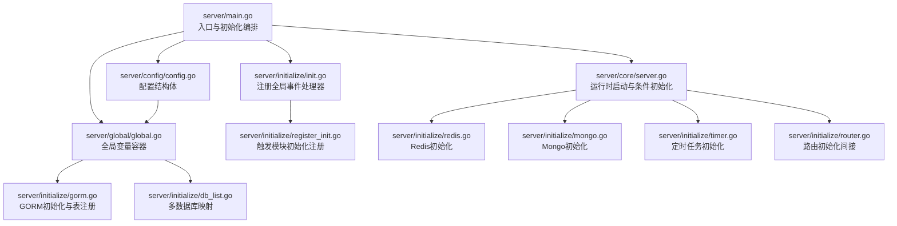
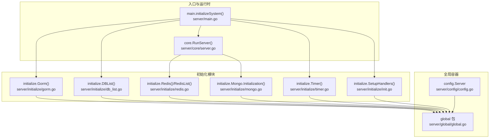
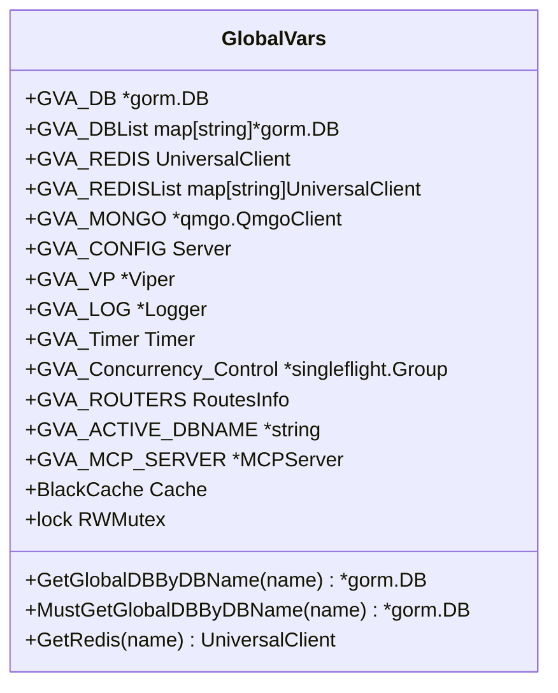
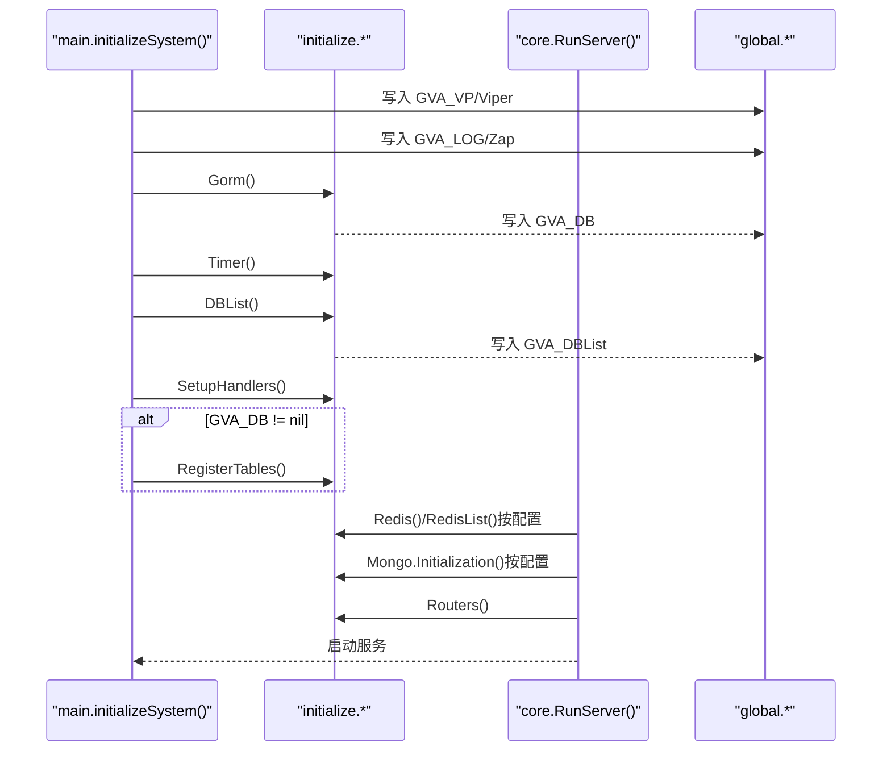
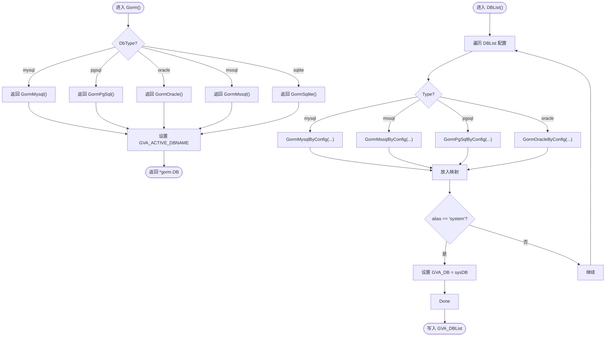
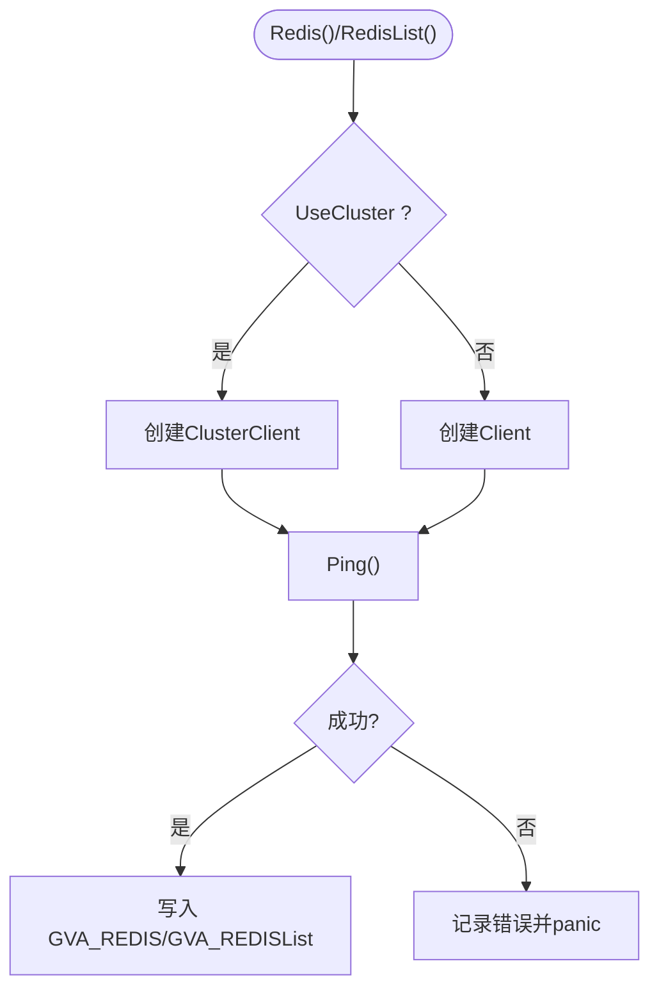
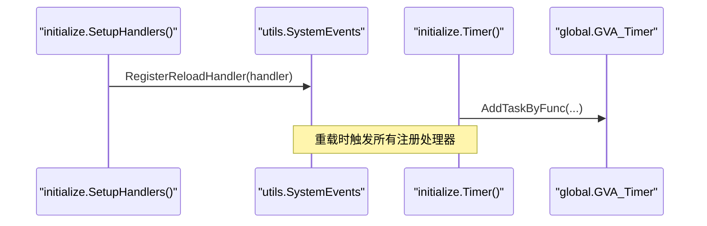
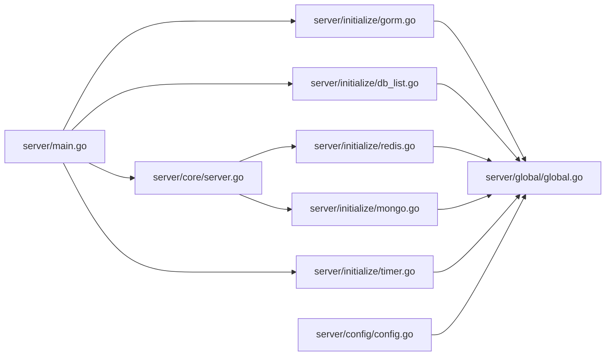

# 全局变量管理

<cite>
**本文引用的文件**
- [server/main.go](file://server/main.go)
- [server/global/global.go](file://server/global/global.go)
- [server/core/server.go](file://server/core/server.go)
- [server/initialize/init.go](file://server/initialize/init.go)
- [server/initialize/register_init.go](file://server/initialize/register_init.go)
- [server/initialize/redis.go](file://server/initialize/redis.go)
- [server/initialize/gorm.go](file://server/initialize/gorm.go)
- [server/initialize/db_list.go](file://server/initialize/db_list.go)
- [server/initialize/mongo.go](file://server/initialize/mongo.go)
- [server/initialize/timer.go](file://server/initialize/timer.go)
- [server/config/config.go](file://server/config/config.go)
- [server/utils/system_events.go](file://server/utils/system_events.go)
- [server/service/system/sys_user.go](file://server/service/system/sys_user.go)
</cite>

## 目录
1. [简介](#简介)
2. [项目结构](#项目结构)
3. [核心组件](#核心组件)
4. [架构总览](#架构总览)
5. [详细组件分析](#详细组件分析)
6. [依赖分析](#依赖分析)
7. [性能考量](#性能考量)
8. [故障排查指南](#故障排查指南)
9. [结论](#结论)
10. [附录：实践示例与最佳实践](#附录实践示例与最佳实践)

## 简介
本文件系统性阐述 Gin-Vue-Admin 后端工程中的“全局变量管理”机制，围绕全局容器的设计理念、初始化顺序与依赖关系、生命周期管理、跨包访问控制、并发安全、以及关键组件（全局配置、数据库连接、缓存实例、服务实例、定时任务、MCP 服务等）的管理方式进行深入解析，并提供可直接定位到源码路径的示例，帮助读者在不直接阅读代码的前提下掌握新增全局变量、实现懒加载、处理变量冲突等实战要点。

## 项目结构
全局变量主要集中在 server/global/global.go 中集中声明，初始化流程由 server/main.go 的入口函数统一调度，各子系统初始化模块（如数据库、Redis、Mongo、定时任务等）在 server/initialize 下按职责拆分，配置由 server/config/config.go 提供，系统事件与重载机制通过 server/utils/system_events.go 管理。

**图示来源**
- [server/main.go:30-52](file://server/main.go#L30-L52)
- [server/core/server.go:14-49](file://server/core/server.go#L14-L49)
- [server/initialize/init.go:9-16](file://server/initialize/init.go#L9-L16)
- [server/initialize/register_init.go:1-11](file://server/initialize/register_init.go#L1-L11)
- [server/initialize/redis.go:39-60](file://server/initialize/redis.go#L39-L60)
- [server/initialize/mongo.go:42-75](file://server/initialize/mongo.go#L42-L75)
- [server/initialize/timer.go:12-38](file://server/initialize/timer.go#L12-L38)
- [server/initialize/gorm.go:14-35](file://server/initialize/gorm.go#L14-L35)
- [server/initialize/db_list.go:11-37](file://server/initialize/db_list.go#L11-L37)
- [server/config/config.go:1-41](file://server/config/config.go#L1-L41)
- [server/global/global.go:25-42](file://server/global/global.go#L25-L42)

**章节来源**
- [server/main.go:30-52](file://server/main.go#L30-L52)
- [server/global/global.go:25-42](file://server/global/global.go#L25-L42)
- [server/config/config.go:1-41](file://server/config/config.go#L1-L41)

## 核心组件
- 全局变量容器：集中声明数据库、Redis、Mongo、配置、Viper、日志、定时器、并发控制、路由信息、MCP 服务、缓存等全局对象，提供线程安全的读取与必要时的 panic 异常提示。
- 初始化编排：入口函数负责依次完成 Viper 加载、日志初始化、数据库连接、定时任务、多数据库映射、全局事件注册、表结构注册等步骤。
- 条件初始化：根据配置开关决定是否初始化 Redis、Mongo、多端口监听等能力。
- 系统事件与重载：通过全局事件管理器注册重载处理器，支持系统热重载。
- 并发与一致性：对全局变量访问使用读写锁保护，避免竞态；对并发场景采用 singleflight 避免重复初始化。

**章节来源**
- [server/global/global.go:25-68](file://server/global/global.go#L25-L68)
- [server/main.go:39-51](file://server/main.go#L39-L51)
- [server/core/server.go:14-30](file://server/core/server.go#L14-L30)
- [server/utils/system_events.go:7-35](file://server/utils/system_events.go#L7-L35)

## 架构总览
下图展示了全局变量管理的整体架构与关键交互：

**图示来源**
- [server/main.go:39-51](file://server/main.go#L39-L51)
- [server/core/server.go:14-49](file://server/core/server.go#L14-L49)
- [server/initialize/gorm.go:14-35](file://server/initialize/gorm.go#L14-L35)
- [server/initialize/db_list.go:11-37](file://server/initialize/db_list.go#L11-L37)
- [server/initialize/redis.go:39-60](file://server/initialize/redis.go#L39-L60)
- [server/initialize/mongo.go:42-75](file://server/initialize/mongo.go#L42-L75)
- [server/initialize/timer.go:12-38](file://server/initialize/timer.go#L12-L38)
- [server/initialize/init.go:9-16](file://server/initialize/init.go#L9-L16)
- [server/config/config.go:1-41](file://server/config/config.go#L1-L41)
- [server/global/global.go:25-42](file://server/global/global.go#L25-L42)

## 详细组件分析

### 全局变量容器设计与并发控制
- 设计理念：将所有跨包共享的资源统一收敛到 global 包，避免分散初始化与命名冲突；通过只读全局变量 + 读写锁 + panic 异常提示，确保访问安全与问题早发现。
- 关键字段与职责：
  - 数据库：主库与多库映射，提供按名称获取与断言获取方法。
  - 缓存：Redis 单实例与多实例映射。
  - 文档/日志：Zap 日志器与 Viper 配置。
  - 定时任务：基于 cron 的定时器实例。
  - 并发控制：singleflight 用于防抖重复初始化。
  - 路由信息：运行时收集的路由信息。
  - MCP 服务：外部 MCP 服务句柄。
  - 黑名单缓存：本地缓存实例。
- 并发与一致性：读多写少的访问模式，使用 RWMutex 保护；对不存在的实例访问直接 panic，便于快速暴露初始化顺序问题。

**图示来源**
- [server/global/global.go:25-68](file://server/global/global.go#L25-L68)

**章节来源**
- [server/global/global.go:25-68](file://server/global/global.go#L25-L68)

### 初始化顺序与依赖关系
- 入口顺序（main.initializeSystem）：
  - 加载 Viper 配置并写入全局。
  - 初始化日志器并替换全局 zap。
  - 初始化 GORM 主库。
  - 初始化定时器。
  - 初始化多数据库映射。
  - 注册全局事件处理器。
  - 若主库非空，则执行表结构注册。
- 运行时顺序（core.RunServer）：
  - 根据配置决定是否初始化 Redis（单实例或多实例）。
  - 条件初始化 Mongo。
  - 加载系统业务数据。
  - 构建路由并启动服务。

**图示来源**
- [server/main.go:39-51](file://server/main.go#L39-L51)
- [server/core/server.go:14-49](file://server/core/server.go#L14-L49)
- [server/initialize/gorm.go:14-35](file://server/initialize/gorm.go#L14-L35)
- [server/initialize/db_list.go:11-37](file://server/initialize/db_list.go#L11-L37)
- [server/initialize/redis.go:39-60](file://server/initialize/redis.go#L39-L60)
- [server/initialize/mongo.go:42-75](file://server/initialize/mongo.go#L42-L75)
- [server/initialize/timer.go:12-38](file://server/initialize/timer.go#L12-L38)

**章节来源**
- [server/main.go:39-51](file://server/main.go#L39-L51)
- [server/core/server.go:14-49](file://server/core/server.go#L14-L49)

### 全局配置变量管理
- 配置结构：config.Server 将各类配置项聚合，包含数据库、Redis、Mongo、系统参数、跨域、MCP 等。
- 读取与传播：入口阶段将 viper 解析后的配置写入 global.GVA_CONFIG，后续初始化模块按需读取。
- 配置驱动的条件初始化：如 UseRedis、UseMongo、DbType、DBList 等字段决定初始化分支。

**章节来源**
- [server/config/config.go:1-41](file://server/config/config.go#L1-L41)
- [server/main.go:40-41](file://server/main.go#L40-L41)
- [server/global/global.go:31-32](file://server/global/global.go#L31-L32)

### 数据库连接管理
- 主库选择：Gorm() 根据配置 DbType 选择具体数据库类型并设置当前活动库名。
- 多数据库映射：DBList() 遍历配置中的 DBList，按类型构造 gorm.DB 映射，特殊处理“system”别名为 GVA_DB。
- 表结构注册：RegisterTables() 在未禁用自动迁移时，批量迁移系统与业务表。
- 访问控制：提供按名称获取与断言获取方法，读取时加读锁，异常时 panic。

**图示来源**
- [server/initialize/gorm.go:14-35](file://server/initialize/gorm.go#L14-L35)
- [server/initialize/db_list.go:11-37](file://server/initialize/db_list.go#L11-L37)
- [server/global/global.go:44-60](file://server/global/global.go#L44-L60)

**章节来源**
- [server/initialize/gorm.go:14-35](file://server/initialize/gorm.go#L14-L35)
- [server/initialize/db_list.go:11-37](file://server/initialize/db_list.go#L11-L37)
- [server/global/global.go:44-60](file://server/global/global.go#L44-L60)

### Redis 管理与多实例支持
- 单实例与集群模式：根据 UseCluster 选择不同客户端；Ping 成功后写入全局 GVA_REDIS。
- 多实例映射：RedisList() 遍历配置中的 RedisList，逐个初始化并写入 GVA_REDISList，按名称访问。
- 错误处理：初始化失败直接 panic，避免静默失败。

**图示来源**
- [server/initialize/redis.go:13-60](file://server/initialize/redis.go#L13-L60)

**章节来源**
- [server/initialize/redis.go:13-60](file://server/initialize/redis.go#L13-L60)
- [server/global/global.go:62-68](file://server/global/global.go#L62-L68)

### MongoDB 管理
- 客户端初始化：根据配置构建 qmgo 客户端，支持认证、池大小、超时等参数。
- 索引管理：提供索引创建与校验逻辑，避免重复索引。
- 全局写入：成功后写入 global.GVA_MONGO。

**章节来源**
- [server/initialize/mongo.go:42-75](file://server/initialize/mongo.go#L42-L75)
- [server/global/global.go:30](file://server/global/global.go#L30)

### 定时任务与系统事件
- 定时任务：Timer() 创建定时任务并挂载清理数据库等任务，使用全局 GVA_Timer。
- 系统事件：GlobalSystemEvents 提供注册与触发重载处理器的能力，initialize.SetupHandlers() 将重载处理函数注册到全局事件。

**图示来源**
- [server/initialize/init.go:9-16](file://server/initialize/init.go#L9-L16)
- [server/utils/system_events.go:16-35](file://server/utils/system_events.go#L16-L35)
- [server/initialize/timer.go:12-38](file://server/initialize/timer.go#L12-L38)

**章节来源**
- [server/initialize/init.go:9-16](file://server/initialize/init.go#L9-L16)
- [server/utils/system_events.go:7-35](file://server/utils/system_events.go#L7-L35)
- [server/initialize/timer.go:12-38](file://server/initialize/timer.go#L12-L38)

### 跨包访问控制与生命周期
- 访问控制：通过 global 包统一导出，避免直接导入导致的循环依赖；读取时加锁，写入在初始化阶段完成。
- 生命周期：入口阶段完成初始化，运行时仅做条件启用；重载通过系统事件触发。
- 冲突处理：对不存在的实例访问直接 panic，便于尽早暴露初始化顺序问题。

**章节来源**
- [server/global/global.go:25-68](file://server/global/global.go#L25-L68)
- [server/main.go:39-51](file://server/main.go#L39-L51)

## 依赖分析
- 入口与运行时：main.initializeSystem 与 core.RunServer 是初始化与运行时的两大节点。
- 初始化模块：GORM、DBList、Redis、Mongo、Timer、SetupHandlers 等模块均向 global 写入状态。
- 配置驱动：config.Server 决定初始化分支与行为。
- 使用方：业务服务（如用户服务）通过 global 直接访问数据库等全局资源。

**图示来源**
- [server/main.go:39-51](file://server/main.go#L39-L51)
- [server/core/server.go:14-49](file://server/core/server.go#L14-L49)
- [server/initialize/gorm.go:14-35](file://server/initialize/gorm.go#L14-L35)
- [server/initialize/db_list.go:11-37](file://server/initialize/db_list.go#L11-L37)
- [server/initialize/redis.go:39-60](file://server/initialize/redis.go#L39-L60)
- [server/initialize/mongo.go:42-75](file://server/initialize/mongo.go#L42-L75)
- [server/initialize/timer.go:12-38](file://server/initialize/timer.go#L12-L38)
- [server/config/config.go:1-41](file://server/config/config.go#L1-L41)
- [server/global/global.go:25-42](file://server/global/global.go#L25-L42)

**章节来源**
- [server/main.go:39-51](file://server/main.go#L39-L51)
- [server/core/server.go:14-49](file://server/core/server.go#L14-L49)

## 性能考量
- 初始化阶段尽量串行化，减少并发竞争；运行时通过读写锁降低锁竞争。
- Redis/Mongo/Pgsql 等外部依赖的 Ping/连接池参数应结合压测结果调整。
- 定时任务建议使用 cron 的秒级精度但避免过于频繁的任务，防止 IO 峰值。
- 多数据库映射按需访问，避免不必要的连接建立。

## 故障排查指南
- 数据库未初始化：访问 global.GVA_DB 或按名获取数据库时出现 panic，检查 main.initializeSystem 是否先于业务调用执行。
- Redis 未初始化：调用 RedisList 名称获取失败或 panic，检查配置 UseRedis 与 RedisList 是否正确。
- Mongo 连接失败：初始化报错，检查连接字符串、认证信息与网络连通性。
- 定时任务未生效：确认 Timer() 已被调用且未发生错误；核对 cron 表达式。
- 系统重载失败：检查 GlobalSystemEvents 的注册处理器是否返回错误。

**章节来源**
- [server/global/global.go:44-68](file://server/global/global.go#L44-L68)
- [server/initialize/redis.go:39-60](file://server/initialize/redis.go#L39-L60)
- [server/initialize/mongo.go:42-75](file://server/initialize/mongo.go#L42-L75)
- [server/initialize/timer.go:12-38](file://server/initialize/timer.go#L12-L38)
- [server/utils/system_events.go:16-35](file://server/utils/system_events.go#L16-L35)

## 结论
该全局变量管理体系通过“集中声明 + 分步初始化 + 条件启用 + 并发保护”的设计，在保证跨包访问一致性的同时，提供了清晰的初始化顺序与可观测的错误反馈。配合系统事件与定时任务机制，能够满足复杂业务场景下的可维护性与可扩展性需求。

## 附录：实践示例与最佳实践
以下示例均提供可直接定位到源码路径的参考位置，便于在项目中安全地新增全局变量、实现懒加载与处理冲突。

- 新增全局变量（以 Redis 多实例为例）
  - 步骤：在 global 包声明变量 → 在对应初始化模块中赋值 → 在需要的地方通过名称获取。
  - 参考路径：
    - 声明与读取：[server/global/global.go:25-42](file://server/global/global.go#L25-L42)
    - 多实例初始化：[server/initialize/redis.go:47-60](file://server/initialize/redis.go#L47-L60)
    - 名称获取方法：[server/global/global.go:62-68](file://server/global/global.go#L62-L68)

- 实现变量懒加载（以 Redis 为例）
  - 思路：延迟初始化 + singleflight 防抖；若已有实例直接返回，否则创建并写入全局。
  - 参考路径：
    - 并发控制：[server/global/global.go:36](file://server/global/global.go#L36)
    - 初始化流程：[server/initialize/redis.go:13-45](file://server/initialize/redis.go#L13-L45)

- 处理变量冲突（以数据库别名为例）
  - 思路：在 DBList 中为每个别名唯一映射；当别名重复时应提前报错或拒绝初始化。
  - 参考路径：
    - 多库映射与系统库特殊处理：[server/initialize/db_list.go:11-37](file://server/initialize/db_list.go#L11-L37)

- 安全访问全局变量（以用户服务为例）
  - 思路：在业务层统一通过 global 访问数据库；对空值进行显式检查或断言。
  - 参考路径：
    - 访问全局 DB：[server/service/system/sys_user.go:30-37](file://server/service/system/sys_user.go#L30-L37)
    - 空值断言：[server/service/system/sys_user.go:48-50](file://server/service/system/sys_user.go#L48-L50)

- 条件初始化与配置驱动
  - 思路：根据 config.Server 中的开关决定是否初始化 Redis/Mongo；在 core.RunServer 中按需启用。
  - 参考路径：
    - 条件初始化：[server/core/server.go:15-26](file://server/core/server.go#L15-L26)
    - 配置结构：[server/config/config.go:1-41](file://server/config/config.go#L1-L41)

- 系统重载与事件驱动
  - 思路：通过 GlobalSystemEvents 注册重载处理器，入口阶段统一注册。
  - 参考路径：
    - 注册处理器：[server/initialize/init.go:9-16](file://server/initialize/init.go#L9-L16)
    - 触发重载：[server/utils/system_events.go:23-34](file://server/utils/system_events.go#L23-L34)