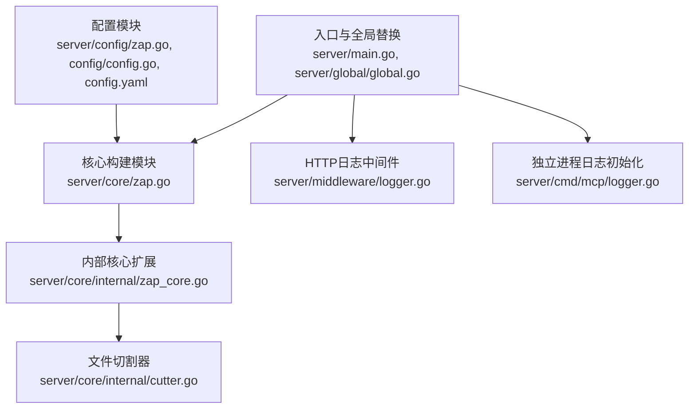
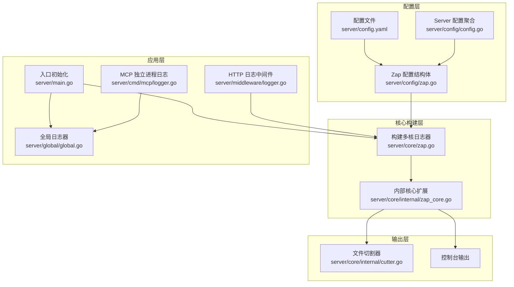
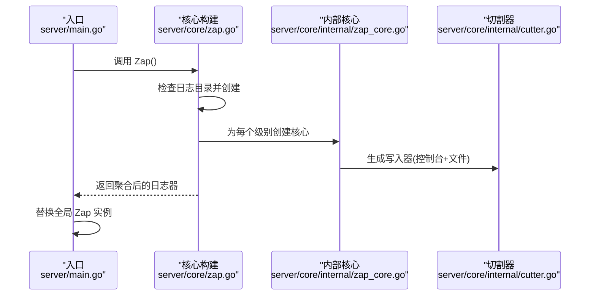
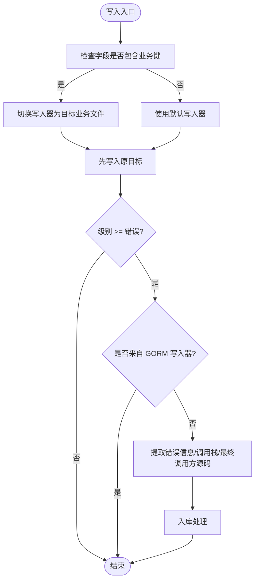
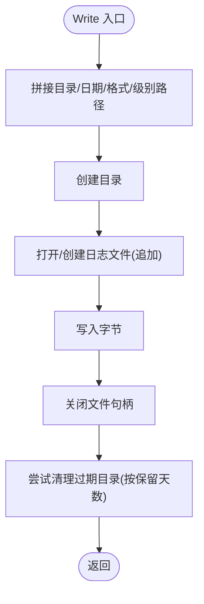
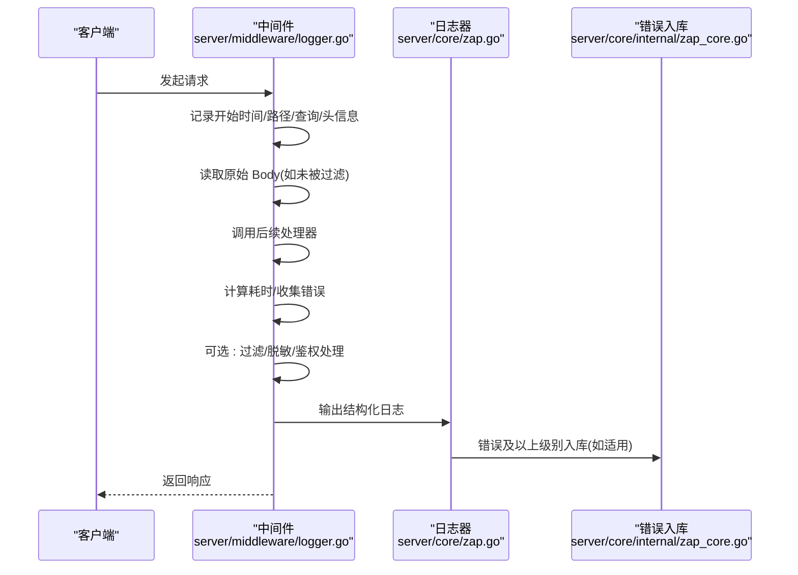
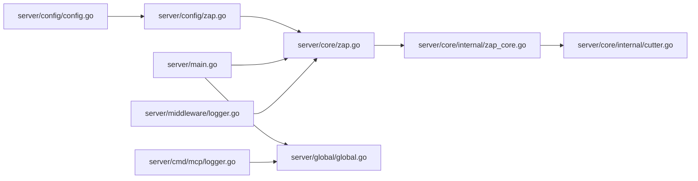

# 日志系统设计

<cite>
**本文引用的文件**
- [server/config/zap.go](file://server/config/zap.go)
- [server/config/config.go](file://server/config/config.go)
- [server/core/zap.go](file://server/core/zap.go)
- [server/core/internal/zap_core.go](file://server/core/internal/zap_core.go)
- [server/core/internal/cutter.go](file://server/core/internal/cutter.go)
- [server/middleware/logger.go](file://server/middleware/logger.go)
- [server/cmd/mcp/logger.go](file://server/cmd/mcp/logger.go)
- [server/main.go](file://server/main.go)
- [server/global/global.go](file://server/global/global.go)
- [server/config.yaml](file://server/config.yaml)
</cite>

## 目录
1. [引言](#引言)
2. [项目结构](#项目结构)
3. [核心组件](#核心组件)
4. [架构总览](#架构总览)
5. [详细组件分析](#详细组件分析)
6. [依赖分析](#依赖分析)
7. [性能考量](#性能考量)
8. [故障排查指南](#故障排查指南)
9. [结论](#结论)
10. [附录](#附录)

## 引言
本文件面向 Gin-Vue-Admin 项目的日志系统设计，围绕 Zap 日志框架的集成与配置展开，涵盖日志级别设置、输出格式定制、文件轮转策略、性能优化配置；同时阐明日志结构设计、字段标准化、上下文传递机制；并给出异步写入、批量处理、内存缓冲区管理等优化策略的实际落地方式与参考路径。文档还提供在不同环境中配置日志级别的实践指引与示例路径，帮助读者快速完成自定义日志格式、添加业务上下文、实现日志过滤规则等常见任务。

## 项目结构
日志系统主要分布在以下模块：
- 配置层：负责日志配置项的定义与解析，包含日志级别、输出格式、编码器、文件目录、保留天数、是否控制台输出等。
- 核心构建层：根据配置动态构建多核日志器，统一接入文件写入与控制台输出，并启用调用者信息与堆栈追踪。
- 内部扩展层：实现按级别分文件的切割器与错误入库逻辑，支持业务字段驱动的文件切换与过期清理。
- 中间件层：提供 HTTP 请求日志中间件，支持过滤、脱敏、鉴权信息注入与自定义打印。
- 入口与全局：在应用启动时初始化日志器并替换全局 Zap 全局实例，保证各处可直接使用全局日志器。

**图示来源**
- [server/config/zap.go:1-72](file://server/config/zap.go#L1-L72)
- [server/config/config.go:1-41](file://server/config/config.go#L1-L41)
- [server/core/zap.go:1-37](file://server/core/zap.go#L1-L37)
- [server/core/internal/zap_core.go:1-134](file://server/core/internal/zap_core.go#L1-L134)
- [server/core/internal/cutter.go:1-126](file://server/core/internal/cutter.go#L1-L126)
- [server/middleware/logger.go:1-90](file://server/middleware/logger.go#L1-L90)
- [server/main.go:1-52](file://server/main.go#L1-L52)
- [server/global/global.go:1-69](file://server/global/global.go#L1-L69)
- [server/cmd/mcp/logger.go:1-18](file://server/cmd/mcp/logger.go#L1-L18)

**章节来源**
- [server/config/zap.go:1-72](file://server/config/zap.go#L1-L72)
- [server/config/config.go:1-41](file://server/config/config.go#L1-L41)
- [server/config.yaml:1-284](file://server/config.yaml#L1-L284)
- [server/core/zap.go:1-37](file://server/core/zap.go#L1-L37)
- [server/core/internal/zap_core.go:1-134](file://server/core/internal/zap_core.go#L1-L134)
- [server/core/internal/cutter.go:1-126](file://server/core/internal/cutter.go#L1-L126)
- [server/middleware/logger.go:1-90](file://server/middleware/logger.go#L1-L90)
- [server/main.go:1-52](file://server/main.go#L1-L52)
- [server/global/global.go:1-69](file://server/global/global.go#L1-L69)
- [server/cmd/mcp/logger.go:1-18](file://server/cmd/mcp/logger.go#L1-L18)

## 核心组件
- 配置结构体与编码器
  - 定义日志级别、前缀、输出格式、目录、层级编码器、堆栈键名、是否显示行号、是否输出到控制台、日志保留天数等。
  - 提供将字符串级别转换为 Zap 级别的方法，以及根据配置生成 JSON 或 Console 编码器。
  - 层级编码器支持小写/大写与带颜色等多种形式。
- 核心日志器构建
  - 在启动时创建日志目录，按配置生成多个核心（每个级别一个），并通过 Tee 聚合。
  - 启用堆栈追踪与调用者信息（按配置）。
- 内部核心扩展
  - 按级别创建写入器，支持控制台与文件的多写入器组合。
  - 在写入时检测业务字段，动态切换写入目标文件，实现“业务维度”日志分离。
  - 对错误及以上级别日志进行入库处理，提取错误信息、调用栈与最终业务调用方源码片段。
- 文件切割器
  - 实现 io.Writer 接口，按日期与级别生成文件路径，自动创建目录并追加写入。
  - 支持过期目录清理，按保留天数删除历史目录。
- HTTP 日志中间件
  - 记录请求路径、查询参数、请求体、客户端 IP、User-Agent、错误集合、耗时、来源等。
  - 支持自定义过滤、关键字过滤（如脱敏）、鉴权信息注入与自定义打印。
- 入口与全局替换
  - 在 main 中初始化 Viper、数据库、路由等，随后初始化日志器并替换全局 Zap 实例。
  - MCP 独立进程提供开发环境下的开发版日志初始化。

**章节来源**
- [server/config/zap.go:1-72](file://server/config/zap.go#L1-L72)
- [server/core/zap.go:1-37](file://server/core/zap.go#L1-L37)
- [server/core/internal/zap_core.go:1-134](file://server/core/internal/zap_core.go#L1-L134)
- [server/core/internal/cutter.go:1-126](file://server/core/internal/cutter.go#L1-L126)
- [server/middleware/logger.go:1-90](file://server/middleware/logger.go#L1-L90)
- [server/main.go:1-52](file://server/main.go#L1-L52)
- [server/global/global.go:1-69](file://server/global/global.go#L1-L69)
- [server/cmd/mcp/logger.go:1-18](file://server/cmd/mcp/logger.go#L1-L18)

## 架构总览
下图展示了日志系统的整体架构与关键交互：

**图示来源**
- [server/config/zap.go:1-72](file://server/config/zap.go#L1-L72)
- [server/config/config.go:1-41](file://server/config/config.go#L1-L41)
- [server/config.yaml:1-284](file://server/config.yaml#L1-L284)
- [server/core/zap.go:1-37](file://server/core/zap.go#L1-L37)
- [server/core/internal/zap_core.go:1-134](file://server/core/internal/zap_core.go#L1-L134)
- [server/core/internal/cutter.go:1-126](file://server/core/internal/cutter.go#L1-L126)
- [server/middleware/logger.go:1-90](file://server/middleware/logger.go#L1-L90)
- [server/main.go:1-52](file://server/main.go#L1-L52)
- [server/global/global.go:1-69](file://server/global/global.go#L1-L69)
- [server/cmd/mcp/logger.go:1-18](file://server/cmd/mcp/logger.go#L1-L18)

## 详细组件分析

### 配置与编码器设计
- 配置项要点
  - 日志级别：支持从字符串解析为 Zap 级别，并提供范围生成方法以覆盖从该级别到致命级别的所有级别。
  - 输出格式：支持 JSON 与 Console 两种编码器。
  - 层级编码器：支持多种大小写与颜色风格，便于区分不同环境下的可读性需求。
  - 调用者与堆栈：可配置是否显示行号与堆栈键名。
  - 控制台输出：可同时输出到控制台与文件。
  - 文件目录与保留：指定日志目录与保留天数，结合切割器实现过期清理。
- 编码器定制
  - 时间键、消息键、调用者键、堆栈键等均采用可配置键名，便于下游采集系统统一解析。
  - 时间格式可带前缀，满足特定展示需求。

**章节来源**
- [server/config/zap.go:1-72](file://server/config/zap.go#L1-L72)
- [server/config.yaml:1-284](file://server/config.yaml#L1-L284)

### 核心日志器构建流程
- 目录准备：若配置的日志目录不存在则创建。
- 多核构建：遍历从配置级别到致命级别的所有级别，分别为每个级别创建一个核心。
- 聚合输出：使用 Tee 将多个核心合并为一个日志器。
- 选项增强：按需启用堆栈追踪与调用者信息。

**图示来源**
- [server/main.go:1-52](file://server/main.go#L1-L52)
- [server/core/zap.go:1-37](file://server/core/zap.go#L1-L37)
- [server/core/internal/zap_core.go:1-134](file://server/core/internal/zap_core.go#L1-L134)
- [server/core/internal/cutter.go:1-126](file://server/core/internal/cutter.go#L1-L126)

**章节来源**
- [server/core/zap.go:1-37](file://server/core/zap.go#L1-L37)
- [server/main.go:1-52](file://server/main.go#L1-L52)

### 内部核心扩展与错误入库
- 写入器选择
  - 若日志字段包含特定业务键，则动态切换写入器，实现“业务维度”的日志分离。
  - 支持控制台与文件的多写入器组合。
- 错误入库
  - 对错误及以上级别的日志进行入库处理，提取错误信息、调用栈与最终业务调用方源码片段。
  - 通过后台上下文避免依赖 HTTP 上下文，防止循环触发。
  - 跳过由 GORM 日志写入器触发的日志，避免递归。

**图示来源**
- [server/core/internal/zap_core.go:1-134](file://server/core/internal/zap_core.go#L1-L134)

**章节来源**
- [server/core/internal/zap_core.go:1-134](file://server/core/internal/zap_core.go#L1-L134)

### 文件切割器与轮转策略
- 路径生成
  - 依据配置的目录、当前日期布局、自定义格式参数与级别生成文件路径。
  - 自动创建缺失的目录。
- 写入与同步
  - 追加写入，写入完成后关闭文件句柄，避免句柄泄漏。
  - 提供显式同步接口。
- 过期清理
  - 在每次写入后尝试清理超过保留天数的历史目录，保留天数小于等于 0 时跳过清理。

**图示来源**
- [server/core/internal/cutter.go:1-126](file://server/core/internal/cutter.go#L1-L126)

**章节来源**
- [server/core/internal/cutter.go:1-126](file://server/core/internal/cutter.go#L1-L126)

### HTTP 日志中间件
- 结构化日志布局
  - 包含时间、元数据、路径、查询参数、请求体、客户端 IP、User-Agent、错误集合、耗时、来源等。
- 可插拔处理
  - 支持自定义过滤（决定是否读取原始 Body）、关键字过滤（如脱敏）、鉴权信息注入、自定义打印。
- 默认输出
  - 默认将结构化日志序列化为 JSON 并标准输出，便于容器与日志收集系统消费。

**图示来源**
- [server/middleware/logger.go:1-90](file://server/middleware/logger.go#L1-L90)
- [server/core/zap.go:1-37](file://server/core/zap.go#L1-L37)
- [server/core/internal/zap_core.go:1-134](file://server/core/internal/zap_core.go#L1-L134)

**章节来源**
- [server/middleware/logger.go:1-90](file://server/middleware/logger.go#L1-L90)

### 全局日志器与独立进程初始化
- 入口替换
  - 在 main 中初始化日志器并调用 ReplaceGlobals，使全局 Zap 可在任意位置使用。
- 独立进程
  - MCP 独立进程使用开发版日志初始化，便于本地调试。

**章节来源**
- [server/main.go:1-52](file://server/main.go#L1-L52)
- [server/global/global.go:1-69](file://server/global/global.go#L1-L69)
- [server/cmd/mcp/logger.go:1-18](file://server/cmd/mcp/logger.go#L1-L18)

## 依赖分析
- 配置到核心
  - 配置结构体与 Server 配置聚合为核心构建提供输入；核心构建依赖配置生成编码器与级别范围。
- 核心到内部扩展
  - 核心构建通过内部核心扩展实现多核聚合与写入器选择。
- 内部扩展到切割器
  - 内部核心扩展依赖切割器实现文件写入与过期清理。
- 应用层到核心
  - 入口中初始化核心并替换全局日志器；HTTP 中间件通过全局日志器输出结构化日志。
- 独立进程到全局
  - MCP 独立进程初始化日志器并写入全局，保持一致的使用体验。

**图示来源**
- [server/config/zap.go:1-72](file://server/config/zap.go#L1-L72)
- [server/config/config.go:1-41](file://server/config/config.go#L1-L41)
- [server/core/zap.go:1-37](file://server/core/zap.go#L1-L37)
- [server/core/internal/zap_core.go:1-134](file://server/core/internal/zap_core.go#L1-L134)
- [server/core/internal/cutter.go:1-126](file://server/core/internal/cutter.go#L1-L126)
- [server/middleware/logger.go:1-90](file://server/middleware/logger.go#L1-L90)
- [server/main.go:1-52](file://server/main.go#L1-L52)
- [server/global/global.go:1-69](file://server/global/global.go#L1-L69)
- [server/cmd/mcp/logger.go:1-18](file://server/cmd/mcp/logger.go#L1-L18)

**章节来源**
- [server/config/zap.go:1-72](file://server/config/zap.go#L1-L72)
- [server/config/config.go:1-41](file://server/config/config.go#L1-L41)
- [server/core/zap.go:1-37](file://server/core/zap.go#L1-L37)
- [server/core/internal/zap_core.go:1-134](file://server/core/internal/zap_core.go#L1-L134)
- [server/core/internal/cutter.go:1-126](file://server/core/internal/cutter.go#L1-L126)
- [server/middleware/logger.go:1-90](file://server/middleware/logger.go#L1-L90)
- [server/main.go:1-52](file://server/main.go#L1-L52)
- [server/global/global.go:1-69](file://server/global/global.go#L1-L69)
- [server/cmd/mcp/logger.go:1-18](file://server/cmd/mcp/logger.go#L1-L18)

## 性能考量
- 异步与批量
  - 本实现通过多核聚合与文件写入器组合实现并发写入，但未见显式的异步队列与批量缓冲区管理。可在现有 Tee 之上引入缓冲与批处理策略，减少频繁系统调用。
- 内存缓冲区
  - 切割器采用追加写入，避免重复打开文件带来的额外开销；可结合批量写入策略进一步降低写放大。
- 调用者与堆栈
  - 调用者信息与堆栈追踪在开发环境非常有用，但在高吞吐场景下会带来额外开销。建议仅在开发与预发布环境启用，生产环境可通过配置关闭。
- 过期清理
  - 切割器在每次写入后清理过期目录，避免磁盘占用增长。保留天数应结合磁盘容量与日志量合理设置。
- 错误入库
  - 错误及以上级别日志入库可能成为瓶颈。建议对入库操作进行限流或异步化，避免阻塞主日志写入路径。

[本节为通用性能讨论，无需具体文件引用]

## 故障排查指南
- 日志目录不可写
  - 症状：启动时报错无法创建日志目录或写入失败。
  - 排查：确认配置的目录是否存在且具备写权限；检查切割器的目录创建逻辑。
- 过期清理异常
  - 症状：磁盘占用持续增长。
  - 排查：确认保留天数配置；检查清理函数的日期计算与目录遍历逻辑。
- 错误入库未生效
  - 症状：错误日志未入库。
  - 排查：确认错误级别是否达到阈值；检查入库逻辑是否被 GORM 写入器触发而被跳过；验证错误字段提取逻辑。
- 调用者信息缺失
  - 症状：日志中缺少调用者信息。
  - 排查：确认配置是否启用显示行号；检查日志器选项是否包含调用者信息。
- 控制台与文件输出不一致
  - 症状：控制台与文件输出不一致或缺失。
  - 排查：确认多写入器组合配置；检查切割器是否正确创建文件句柄。

**章节来源**
- [server/core/internal/cutter.go:1-126](file://server/core/internal/cutter.go#L1-L126)
- [server/core/internal/zap_core.go:1-134](file://server/core/internal/zap_core.go#L1-L134)
- [server/config/zap.go:1-72](file://server/config/zap.go#L1-L72)
- [server/core/zap.go:1-37](file://server/core/zap.go#L1-L37)

## 结论
本日志系统基于 Zap 构建，通过配置驱动实现了灵活的日志级别、格式与输出策略，并结合业务字段实现了“业务维度”的日志分离与错误入库。文件切割器提供了可靠的轮转与过期清理能力，HTTP 中间件支持结构化日志与可插拔处理。在高并发场景下，建议进一步引入异步与批量策略以提升性能，并对错误入库进行限流或异步化处理，确保日志系统不影响业务主路径。

[本节为总结性内容，无需具体文件引用]

## 附录

### 配置项与默认值参考
- 日志级别：默认 info，支持从字符串解析为 Zap 级别。
- 输出格式：默认 console，支持 json。
- 层级编码器：默认小写带颜色。
- 是否显示行号：默认 true。
- 是否输出到控制台：默认 true。
- 日志保留天数：默认 -1（表示不清理）。
- 日志目录：默认 log。

**章节来源**
- [server/config.yaml:1-284](file://server/config.yaml#L1-L284)
- [server/config/zap.go:1-72](file://server/config/zap.go#L1-L72)

### 实际使用示例路径
- 初始化全局日志器并在入口替换全局实例
  - [server/main.go:40-44](file://server/main.go#L40-L44)
- 在业务层使用全局日志器记录错误
  - [server/api/v1/example/exa_file_upload_download.go:30](file://server/api/v1/example/exa_file_upload_download.go#L30)
  - [server/api/v1/example/exa_file_upload_download.go:36](file://server/api/v1/example/exa_file_upload_download.go#L36)
- 使用 HTTP 中间件输出结构化日志
  - [server/middleware/logger.go:80-89](file://server/middleware/logger.go#L80-L89)
- MCP 独立进程初始化开发版日志
  - [server/cmd/mcp/logger.go:8-17](file://server/cmd/mcp/logger.go#L8-L17)

**章节来源**
- [server/main.go:1-52](file://server/main.go#L1-L52)
- [server/middleware/logger.go:1-90](file://server/middleware/logger.go#L1-L90)
- [server/cmd/mcp/logger.go:1-18](file://server/cmd/mcp/logger.go#L1-L18)