# 服务器启动流程

<cite>
**本文引用的文件**
- [server/main.go](file://server/main.go)
- [server/core/server.go](file://server/core/server.go)
- [server/core/server_run.go](file://server/core/server_run.go)
- [server/initialize/init.go](file://server/initialize/init.go)
- [server/initialize/router.go](file://server/initialize/router.go)
- [server/initialize/redis.go](file://server/initialize/redis.go)
- [server/initialize/mongo.go](file://server/initialize/mongo.go)
- [server/initialize/gorm.go](file://server/initialize/gorm.go)
- [server/global/global.go](file://server/global/global.go)
- [server/config/config.go](file://server/config/config.go)
- [server/config/mcp.go](file://server/config/mcp.go)
- [server/mcp/server.go](file://server/mcp/server.go)
- [server/mcp/context.go](file://server/mcp/context.go)
- [server/service/system/sys_initdb.go](file://server/service/system/sys_initdb.go)
</cite>

## 目录
1. [简介](#简介)
2. [项目结构](#项目结构)
3. [核心组件](#核心组件)
4. [架构总览](#架构总览)
5. [详细组件分析](#详细组件分析)
6. [依赖分析](#依赖分析)
7. [性能考量](#性能考量)
8. [故障排查指南](#故障排查指南)
9. [结论](#结论)
10. [附录：启动流程代码示例路径](#附录启动流程代码示例路径)

## 简介
本文件聚焦于 Gin-Vue-Admin 服务器启动流程，系统性梳理 RunServer() 的完整执行路径，涵盖 Redis/MongoDB 连接初始化、数据库加载、路由注册、MCP 服务集成、端口绑定策略以及优雅停机与状态监控。同时给出可操作的扩展建议与常见问题排查方法，帮助开发者在不破坏现有架构的前提下，安全地定制启动流程。

## 项目结构
后端采用分层与模块化组织方式：
- 入口层：main.go 调用 initializeSystem() 完成环境准备，随后调用 RunServer() 启动服务。
- 核心层：core 包负责服务启动与优雅关闭；config 定义配置结构；global 汇聚全局状态。
- 初始化层：initialize 包按功能拆分，分别负责 Redis、Mongo、GORM、路由、定时任务等初始化。
- MCP 层：mcp 包提供独立的 Streamable HTTP 服务与上下文认证头解析。
- 业务层：service/system 提供系统初始化与数据加载能力。

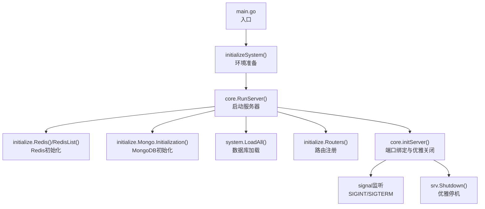

图表来源
- [server/main.go:30-52](file://server/main.go#L30-L52)
- [server/core/server.go:14-48](file://server/core/server.go#L14-L48)
- [server/core/server_run.go:21-60](file://server/core/server_run.go#L21-L60)

章节来源
- [server/main.go:30-52](file://server/main.go#L30-L52)
- [server/core/server.go:14-48](file://server/core/server.go#L14-L48)
- [server/core/server_run.go:21-60](file://server/core/server_run.go#L21-L60)

## 核心组件
- RunServer(): 服务器启动主流程，负责条件化初始化 Redis/MongoDB、加载数据库、构建路由、解析 MCP 地址并启动 HTTP 服务。
- initServer(): 封装 HTTP 服务启动、信号监听与优雅关闭。
- initializeSystem(): 启动前的环境检查与资源准备，包括 Viper 配置、日志、数据库、定时任务、全局函数注册、表结构初始化等。
- initialize.Routers(): 构建 Gin 路由并注册系统与插件路由。
- initialize.Redis()/RedisList(): Redis 单实例与多实例连接初始化。
- initialize.Mongo.Initialization(): MongoDB 连接与索引初始化。
- system.LoadAll(): 加载系统级数据与状态。
- mcpTool.NewStreamableHTTPServer(): 提供 MCP Streamable HTTP 服务与健康检查端点。

章节来源
- [server/core/server.go:14-48](file://server/core/server.go#L14-L48)
- [server/core/server_run.go:21-60](file://server/core/server_run.go#L21-L60)
- [server/main.go:37-51](file://server/main.go#L37-L51)
- [server/initialize/router.go:36-117](file://server/initialize/router.go#L36-L117)
- [server/initialize/redis.go:39-60](file://server/initialize/redis.go#L39-L60)
- [server/initialize/mongo.go:42-75](file://server/initialize/mongo.go#L42-L75)
- [server/mcp/server.go:11-52](file://server/mcp/server.go#L11-L52)

## 架构总览
下图展示了启动阶段各模块之间的交互关系与数据流向。

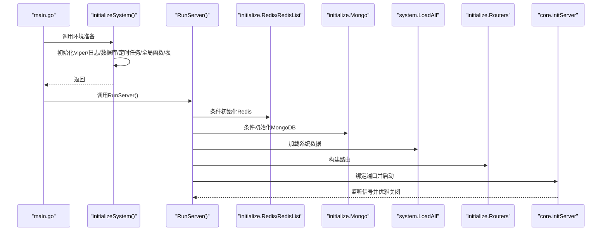

图表来源
- [server/main.go:30-52](file://server/main.go#L30-L52)
- [server/core/server.go:14-48](file://server/core/server.go#L14-L48)
- [server/core/server_run.go:21-60](file://server/core/server_run.go#L21-L60)
- [server/initialize/router.go:36-117](file://server/initialize/router.go#L36-L117)
- [server/initialize/redis.go:39-60](file://server/initialize/redis.go#L39-L60)
- [server/initialize/mongo.go:42-75](file://server/initialize/mongo.go#L42-L75)

## 详细组件分析

### RunServer() 启动流程详解
- 条件化 Redis 初始化：根据配置决定是否启用 Redis 与多端点 RedisList。
- 条件化 MongoDB 初始化：若启用 Mongo，则执行初始化并记录错误。
- 数据库加载：当存在主数据库连接时，加载系统级数据。
- 路由构建：调用 Routers() 构建 Gin 路由。
- 端口与 MCP：从配置读取端口，解析 MCP 服务地址，打印启动信息。
- 服务启动：调用 initServer() 绑定地址与超时，启动 HTTP 服务并等待信号。

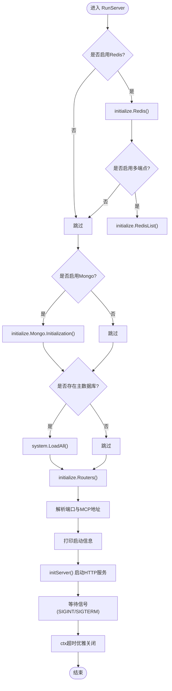

图表来源
- [server/core/server.go:14-48](file://server/core/server.go#L14-L48)

章节来源
- [server/core/server.go:14-48](file://server/core/server.go#L14-L48)

### 环境准备与资源初始化（initializeSystem）
- 初始化 Viper 配置与日志。
- 初始化数据库连接（GORM）。
- 启动定时任务与 DBList。
- 注册全局系统事件处理函数（Reload）。
- 若存在数据库连接，则注册表结构。

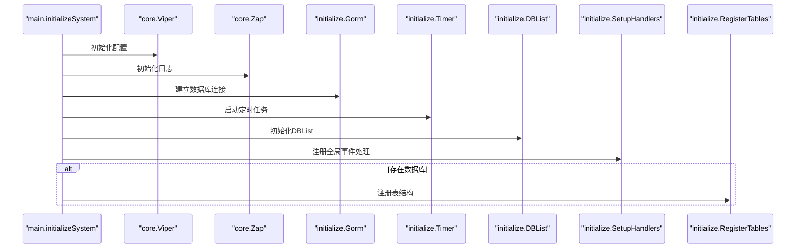

图表来源
- [server/main.go:37-51](file://server/main.go#L37-L51)
- [server/initialize/init.go:9-16](file://server/initialize/init.go#L9-L16)
- [server/initialize/gorm.go:14-35](file://server/initialize/gorm.go#L14-L35)

章节来源
- [server/main.go:37-51](file://server/main.go#L37-L51)
- [server/initialize/init.go:9-16](file://server/initialize/init.go#L9-L16)
- [server/initialize/gorm.go:14-35](file://server/initialize/gorm.go#L14-L35)

### Redis 连接初始化
- 支持单实例与集群两种模式，通过配置项选择。
- Ping 成功后写入全局 Redis 客户端；多端点模式遍历配置列表逐一初始化并存入映射。
- 日志记录连接结果或错误。

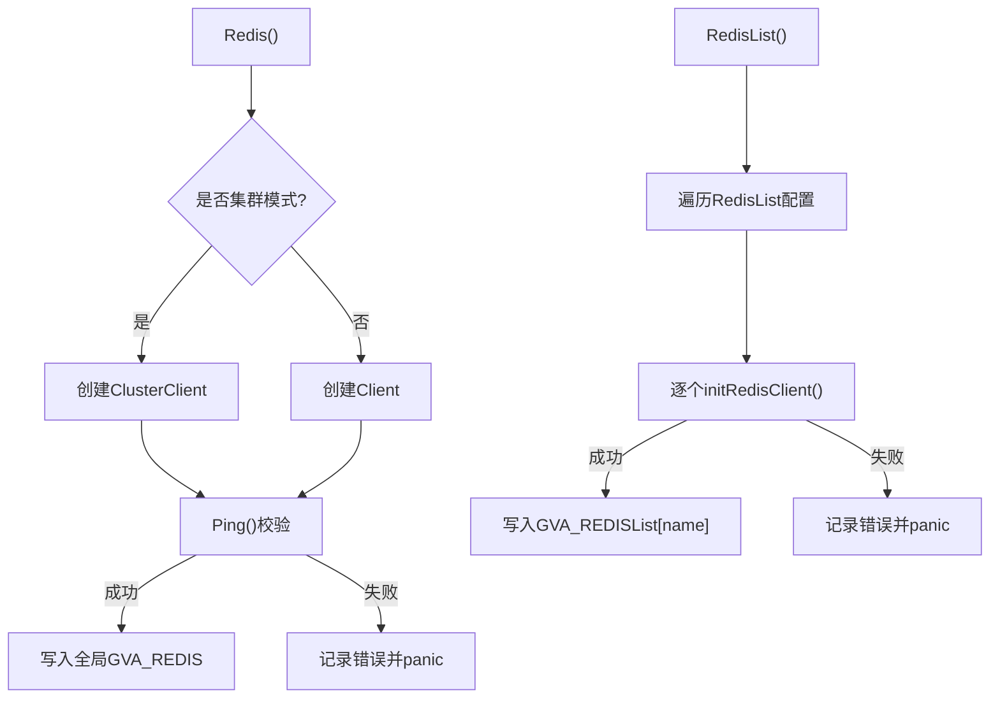

图表来源
- [server/initialize/redis.go:13-60](file://server/initialize/redis.go#L13-L60)

章节来源
- [server/initialize/redis.go:13-60](file://server/initialize/redis.go#L13-L60)

### MongoDB 连接与索引初始化
- 根据配置构造 qmgo 客户端，支持用户名密码与认证源。
- 连接成功后可选启用内部日志选项，并对集合索引进行初始化。
- 错误被包装并返回，便于上层捕获。

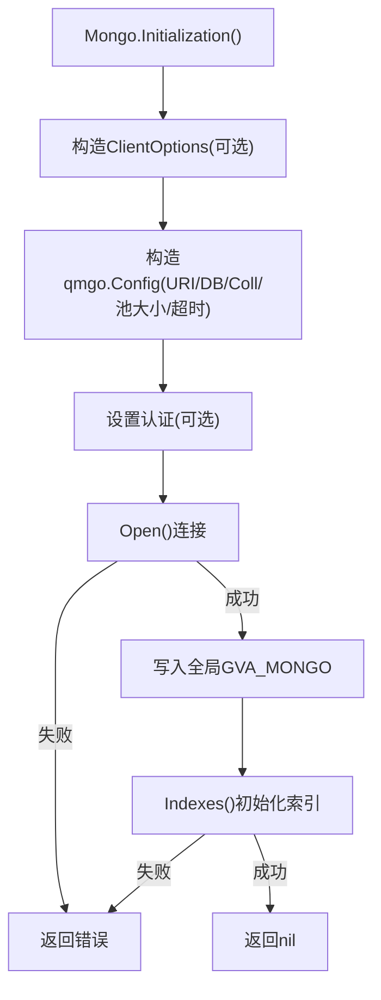

图表来源
- [server/initialize/mongo.go:42-75](file://server/initialize/mongo.go#L42-L75)

章节来源
- [server/initialize/mongo.go:42-75](file://server/initialize/mongo.go#L42-L75)

### 数据库加载与表注册
- Gorm() 根据配置选择数据库类型并返回连接。
- RegisterTables() 在未禁用自动迁移的情况下，批量注册系统与业务表结构。
- 若迁移失败，记录错误并退出进程。

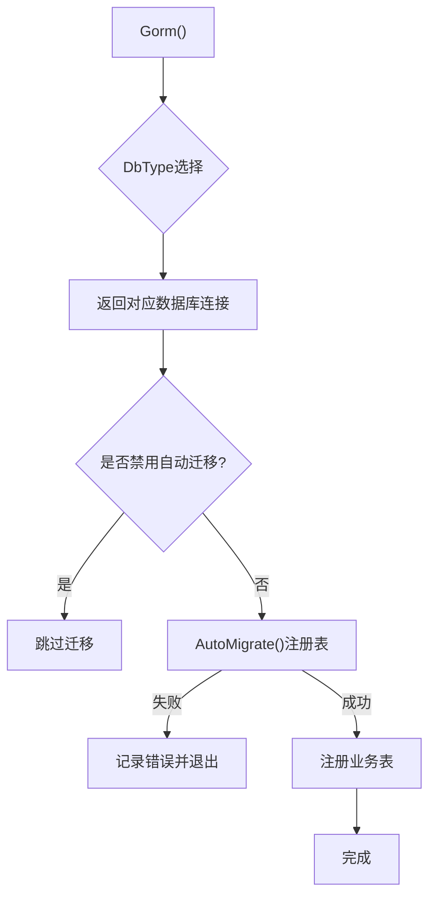

图表来源
- [server/initialize/gorm.go:14-88](file://server/initialize/gorm.go#L14-L88)

章节来源
- [server/initialize/gorm.go:14-88](file://server/initialize/gorm.go#L14-L88)

### 路由注册与中间件
- Routers() 构建 Gin 引擎，注册 Swagger 文档、静态资源、健康检查等。
- 基于配置启用 JWT 与 RBAC 中间件，按组注册系统与业务路由。
- 插件路由与业务路由通过 InstallPlugin 与 initBizRouter 注册。

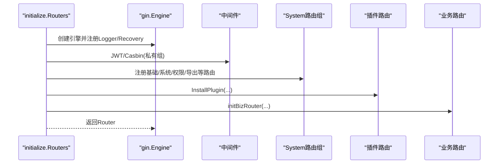

图表来源
- [server/initialize/router.go:36-117](file://server/initialize/router.go#L36-L117)

章节来源
- [server/initialize/router.go:36-117](file://server/initialize/router.go#L36-L117)

### MCP 服务集成机制
- 配置结构 MCP 定义名称、版本、路径、地址、上游地址、认证头与超时等。
- NewMCPServer() 基于配置创建 MCP 服务并注册工具集。
- NewStreamableHTTPServer() 创建独立的 HTTP 服务，挂载到指定路径，提供健康检查端点。
- WithHTTPRequestContext() 从请求头提取认证令牌，支持多种头部键名。

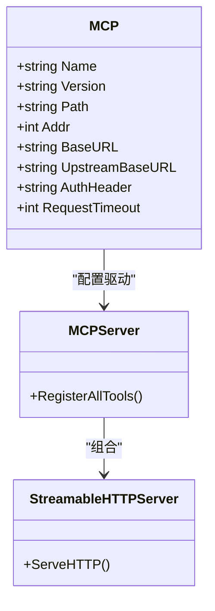

图表来源
- [server/config/mcp.go:3-19](file://server/config/mcp.go#L3-L19)
- [server/mcp/server.go:11-52](file://server/mcp/server.go#L11-L52)
- [server/mcp/context.go:15-66](file://server/mcp/context.go#L15-L66)

章节来源
- [server/config/mcp.go:3-19](file://server/config/mcp.go#L3-L19)
- [server/mcp/server.go:11-52](file://server/mcp/server.go#L11-L52)
- [server/mcp/context.go:15-66](file://server/mcp/context.go#L15-L66)

### 端口绑定策略与优雅停机
- initServer() 以 http.Server 封装服务，设置读写超时与最大头部字节。
- 绑定地址来自配置端口，启动协程监听 ListenAndServe。
- 通过 os/signal 监听 SIGINT/SIGTERM，收到信号后 5 秒超时优雅关闭。

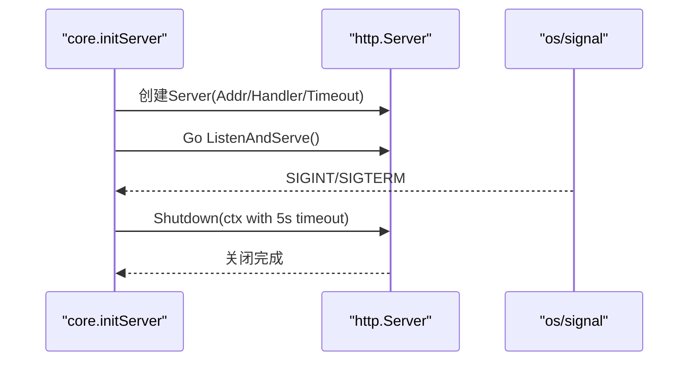

图表来源
- [server/core/server_run.go:21-60](file://server/core/server_run.go#L21-L60)

章节来源
- [server/core/server_run.go:21-60](file://server/core/server_run.go#L21-L60)

### 启动前环境检查与配置验证
- 配置结构集中于 config.Server，包含 JWT、Zap、Redis、Mongo、Email、System、Captcha、Autocode、各类数据库、磁盘、跨域、MCP 等。
- global 包汇聚全局状态，如数据库、Redis、Mongo、日志、定时器、路由信息、MCP 服务实例等。
- initializeSystem() 中对数据库存在性进行判断后再进行表注册，避免空指针。

章节来源
- [server/config/config.go:3-40](file://server/config/config.go#L3-L40)
- [server/global/global.go:25-42](file://server/global/global.go#L25-L42)
- [server/main.go:37-51](file://server/main.go#L37-L51)

## 依赖分析
- RunServer() 依赖 Redis/Mongo 初始化、数据库加载、路由构建与 HTTP 启动。
- initializeSystem() 作为前置步骤，确保全局状态就绪。
- MCP 服务与 HTTP 服务解耦，可通过独立端口或路径暴露。
- 全局变量 global 作为跨模块共享状态载体，需注意并发安全与初始化顺序。

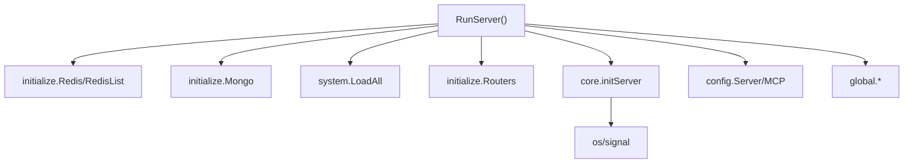

图表来源
- [server/core/server.go:14-48](file://server/core/server.go#L14-L48)
- [server/config/config.go:3-40](file://server/config/config.go#L3-L40)
- [server/global/global.go:25-42](file://server/global/global.go#L25-L42)

章节来源
- [server/core/server.go:14-48](file://server/core/server.go#L14-L48)
- [server/config/config.go:3-40](file://server/config/config.go#L3-L40)
- [server/global/global.go:25-42](file://server/global/global.go#L25-L42)

## 性能考量
- Redis/Mongo 初始化应尽量减少阻塞，Ping 与连接池参数需结合业务峰值调优。
- 路由注册与中间件链路应保持简洁，避免在热路径引入额外开销。
- Swagger 文档仅在调试模式启用，生产环境可移除以降低资源占用。
- 定时任务与后台任务需合理调度，避免与启动流程竞争 CPU/IO。

## 故障排查指南
- Redis 连接失败：检查地址、密码、集群配置；查看日志输出；确认网络连通性。
- MongoDB 连接失败：核对 URI、认证信息、认证源；确认数据库可达；查看索引初始化报错。
- 数据库迁移失败：检查 AutoMigrate 配置与表结构；查看具体错误日志；必要时禁用自动迁移并手动迁移。
- 路由注册异常：确认 RouterPrefix 与中间件顺序；检查插件与业务路由注册顺序。
- 优雅停机失败：确认信号是否正确传递；检查 Shutdown 超时设置；排查长连接与后台任务阻塞。
- MCP 认证头无效：核对 AuthHeader 配置与请求头；确认 WithHTTPRequestContext 解析逻辑。

章节来源
- [server/initialize/redis.go:29-36](file://server/initialize/redis.go#L29-L36)
- [server/initialize/mongo.go:64-74](file://server/initialize/mongo.go#L64-L74)
- [server/initialize/gorm.go:75-87](file://server/initialize/gorm.go#L75-L87)
- [server/initialize/router.go:68-117](file://server/initialize/router.go#L68-L117)
- [server/core/server_run.go:46-59](file://server/core/server_run.go#L46-L59)
- [server/mcp/context.go:36-66](file://server/mcp/context.go#L36-L66)

## 结论
RunServer() 将 Redis/MongoDB 初始化、数据库加载、路由注册与 HTTP 服务启动串联为一条清晰的启动流水线。通过 initializeSystem() 的前置准备与 core.initServer() 的优雅停机机制，系统在启动阶段具备良好的可控性与可观测性。MCP 服务可独立部署并通过 Streamable HTTP 提供流式能力，配合灵活的认证头解析满足多场景集成需求。

## 附录：启动流程代码示例路径
以下路径展示了如何在不改变现有架构的前提下，扩展或调整启动流程的关键位置：

- 自定义初始化步骤
  - 在 initializeSystem() 中新增初始化逻辑：[server/main.go:37-51](file://server/main.go#L37-L51)
  - 在 RunServer() 前后插入自定义钩子：[server/core/server.go:14-48](file://server/core/server.go#L14-L48)

- 启动参数配置
  - 修改系统端口与 MCP 地址：[server/core/server.go:33-34](file://server/core/server.go#L33-L34)
  - 配置文件结构参考：[server/config/config.go:3-40](file://server/config/config.go#L3-L40)，[server/config/mcp.go:3-19](file://server/config/mcp.go#L3-L19)

- 错误处理机制
  - Redis 初始化错误处理：[server/initialize/redis.go:39-44](file://server/initialize/redis.go#L39-L44)
  - MongoDB 初始化错误处理：[server/initialize/mongo.go:64-68](file://server/initialize/mongo.go#L64-L68)
  - 路由注册失败日志：[server/initialize/router.go:113-117](file://server/initialize/router.go#L113-L117)
  - 优雅停机超时与致命日志：[server/core/server_run.go:50-57](file://server/core/server_run.go#L50-L57)

- MCP 集成与认证
  - 新建 MCP 服务与 HTTP 服务：[server/mcp/server.go:11-52](file://server/mcp/server.go#L11-L52)
  - 请求上下文与认证头解析：[server/mcp/context.go:15-66](file://server/mcp/context.go#L15-L66)

- 数据库加载与迁移
  - 数据库加载入口：[server/core/server.go:28-30](file://server/core/server.go#L28-L30)
  - 表注册与迁移：[server/initialize/gorm.go:37-88](file://server/initialize/gorm.go#L37-L88)
  - 系统初始化服务（可选）：[server/service/system/sys_initdb.go:87-139](file://server/service/system/sys_initdb.go#L87-L139)