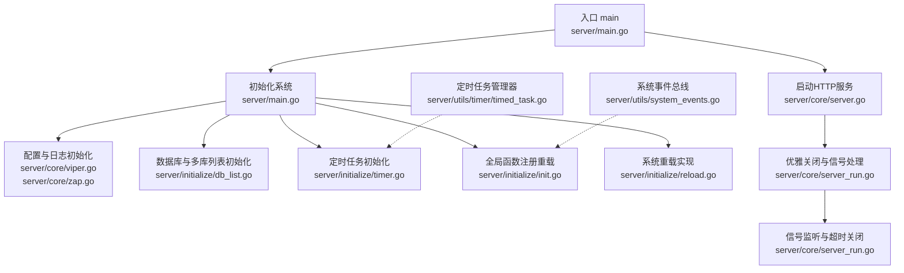
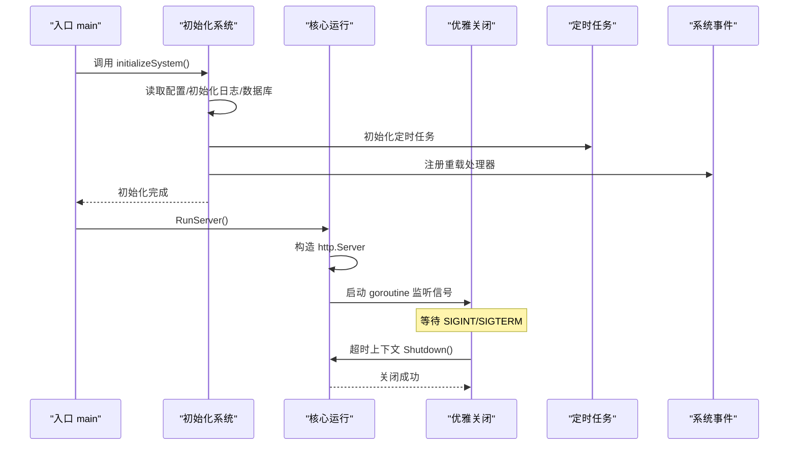
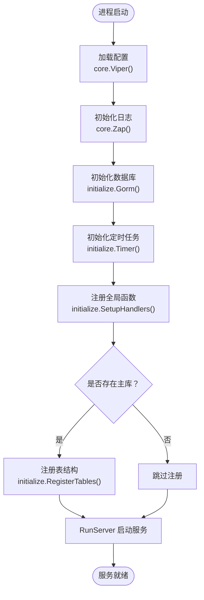
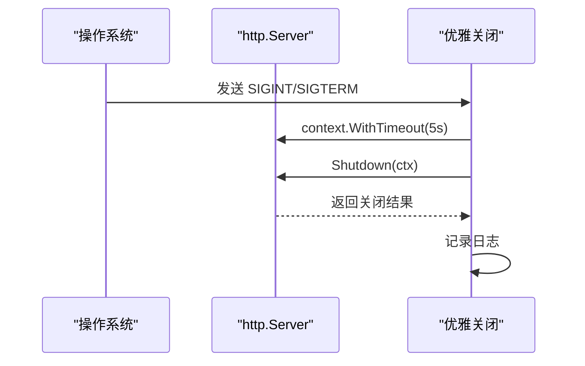
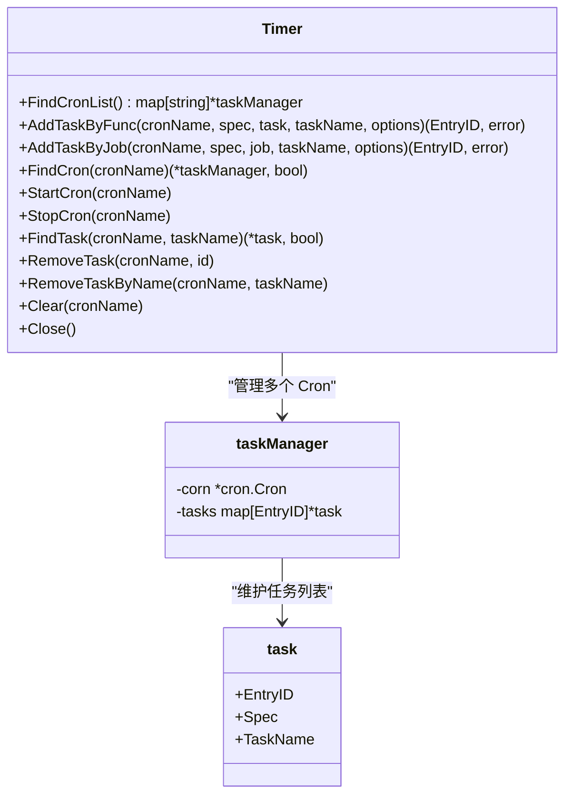
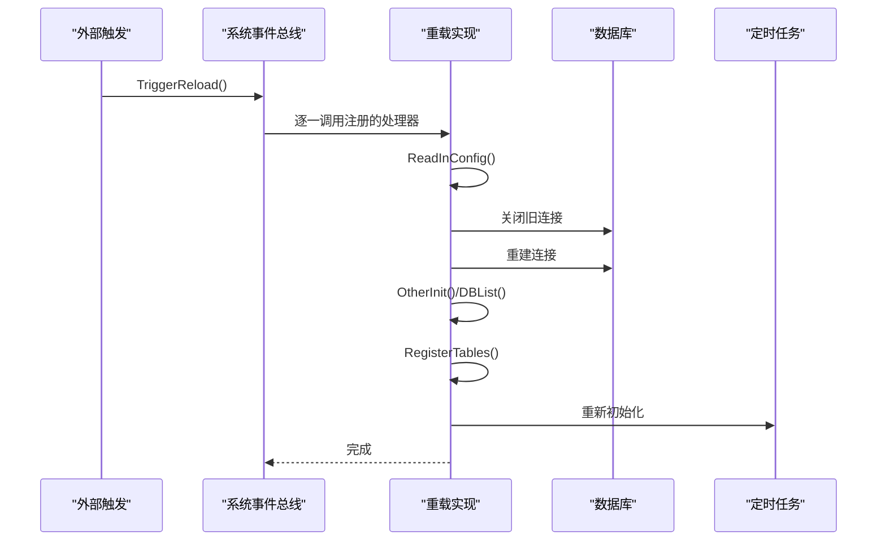
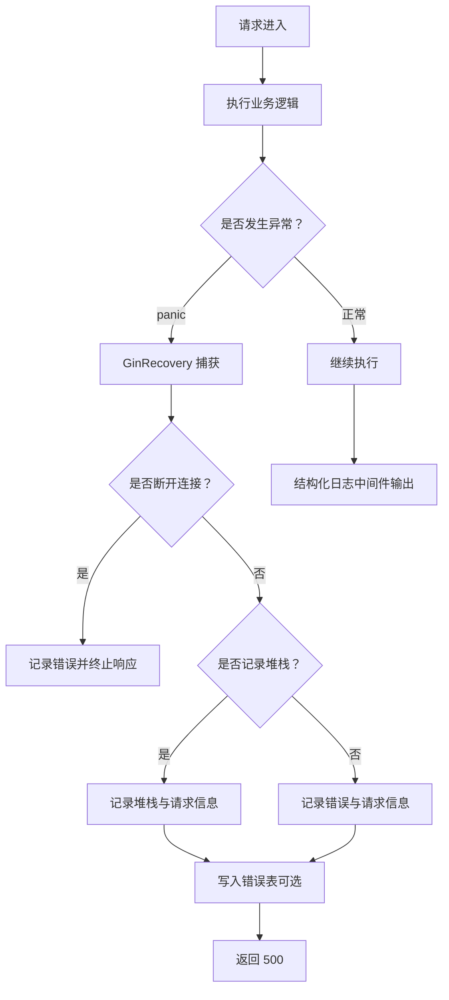
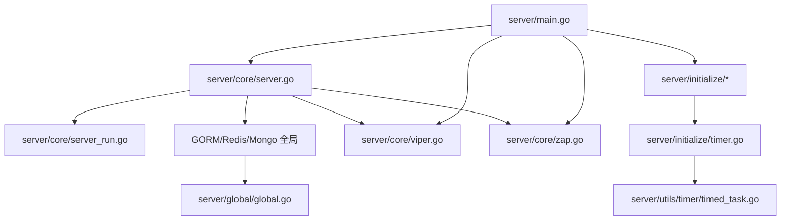

# 服务生命周期管理

<cite>
**本文引用的文件**
- [server/main.go](file://server/main.go)
- [server/core/server.go](file://server/core/server.go)
- [server/core/server_run.go](file://server/core/server_run.go)
- [server/initialize/init.go](file://server/initialize/init.go)
- [server/initialize/timer.go](file://server/initialize/timer.go)
- [server/initialize/reload.go](file://server/initialize/reload.go)
- [server/utils/system_events.go](file://server/utils/system_events.go)
- [server/utils/timer/timed_task.go](file://server/utils/timer/timed_task.go)
- [server/global/global.go](file://server/global/global.go)
- [server/task/clearTable.go](file://server/task/clearTable.go)
- [server/middleware/error.go](file://server/middleware/error.go)
- [server/middleware/logger.go](file://server/middleware/logger.go)
- [server/core/viper.go](file://server/core/viper.go)
- [server/core/zap.go](file://server/core/zap.go)
- [server/config/config.go](file://server/config/config.go)
</cite>

## 目录
1. [引言](#引言)
2. [项目结构](#项目结构)
3. [核心组件](#核心组件)
4. [架构总览](#架构总览)
5. [详细组件分析](#详细组件分析)
6. [依赖分析](#依赖分析)
7. [性能考量](#性能考量)
8. [故障排查指南](#故障排查指南)
9. [结论](#结论)
10. [附录：实践示例与最佳实践](#附录实践示例与最佳实践)

## 引言
本文件围绕 Gin-Vue-Admin 的服务生命周期管理展开，系统性阐述服务启动、运行、停止的完整流程，包括初始化顺序控制、资源分配、优雅关闭机制；同时覆盖定时任务管理、后台服务调度、资源清理策略；并总结错误恢复机制、健康检查与监控告警等运维能力。文末提供可直接参考的代码片段路径，帮助读者快速实现自定义服务组件、添加定时任务、处理服务异常等实际场景。

## 项目结构
后端采用“入口 -> 初始化 -> 核心运行 -> 中间件/工具”的分层组织方式：
- 入口层：负责系统初始化与启动
- 初始化层：负责配置、日志、数据库、缓存、定时任务、路由等子系统的装配
- 核心运行层：封装 HTTP 服务器启动与优雅关闭
- 中间件与工具层：提供错误恢复、日志、定时任务管理等通用能力
- 全局状态：集中存放数据库、Redis、Mongo、配置、日志、定时任务等全局对象

图表来源
- [server/main.go:30-52](file://server/main.go#L30-L52)
- [server/core/server.go:14-48](file://server/core/server.go#L14-L48)
- [server/core/server_run.go:21-60](file://server/core/server_run.go#L21-L60)
- [server/initialize/timer.go:12-37](file://server/initialize/timer.go#L12-L37)
- [server/utils/system_events.go:16-34](file://server/utils/system_events.go#L16-L34)
- [server/utils/timer/timed_task.go:227-230](file://server/utils/timer/timed_task.go#L227-L230)

章节来源
- [server/main.go:30-52](file://server/main.go#L30-L52)
- [server/core/server.go:14-48](file://server/core/server.go#L14-L48)
- [server/core/server_run.go:21-60](file://server/core/server_run.go#L21-L60)
- [server/initialize/timer.go:12-37](file://server/initialize/timer.go#L12-L37)
- [server/utils/system_events.go:16-34](file://server/utils/system_events.go#L16-L34)
- [server/utils/timer/timed_task.go:227-230](file://server/utils/timer/timed_task.go#L227-L230)

## 核心组件
- 入口与初始化
  - 入口函数负责调用初始化流程并启动 HTTP 服务器
  - 初始化顺序严格控制：配置 -> 日志 -> 数据库 -> 定时任务 -> 全局函数注册 -> 表结构注册
- 服务器运行与优雅关闭
  - 封装 http.Server，统一设置超时与最大头部大小
  - 通过信号监听实现优雅关闭，支持 SIGINT/SIGTERM
- 定时任务管理
  - 基于 cron 的轻量级任务管理器，支持按名称分组、增删查改、启停、清空与关闭
  - 提供秒级精度选项，便于高频任务
- 系统事件与重载
  - 全局事件总线支持注册重载处理器，触发后逐个执行
  - 重载流程包含配置重载、数据库连接重建、表结构同步、定时任务重建等
- 错误恢复与日志
  - Gin Recovery 中间件捕获 panic 并记录日志，必要时写入错误表
  - 结构化日志中间件支持过滤、脱敏、鉴权信息提取与自定义输出

章节来源
- [server/main.go:30-52](file://server/main.go#L30-L52)
- [server/core/server.go:14-48](file://server/core/server.go#L14-L48)
- [server/core/server_run.go:21-60](file://server/core/server_run.go#L21-L60)
- [server/utils/timer/timed_task.go:8-35](file://server/utils/timer/timed_task.go#L8-L35)
- [server/utils/system_events.go:16-34](file://server/utils/system_events.go#L16-L34)
- [server/initialize/reload.go:8-45](file://server/initialize/reload.go#L8-L45)
- [server/middleware/error.go:20-80](file://server/middleware/error.go#L20-L80)
- [server/middleware/logger.go:41-89](file://server/middleware/logger.go#L41-L89)

## 架构总览
下图展示了服务生命周期的关键交互：入口初始化、核心运行、优雅关闭、定时任务与系统事件。

图表来源
- [server/main.go:30-52](file://server/main.go#L30-L52)
- [server/core/server.go:14-48](file://server/core/server.go#L14-L48)
- [server/core/server_run.go:21-60](file://server/core/server_run.go#L21-L60)
- [server/initialize/timer.go:12-37](file://server/initialize/timer.go#L12-L37)
- [server/utils/system_events.go:16-34](file://server/utils/system_events.go#L16-L34)

## 详细组件分析

### 启动流程与初始化顺序
- 入口调用 initializeSystem，依次完成：
  - 配置加载与热更新监听
  - 日志初始化与替换全局日志
  - 数据库连接与多库列表初始化
  - 定时任务初始化
  - 全局函数注册（含重载）
  - 表结构注册（当存在主库时）
- RunServer 负责：
  - 可选 Redis/Mongo 初始化
  - 加载系统服务
  - 构造路由并启动 HTTP 服务
  - 输出启动提示与地址信息

图表来源
- [server/main.go:39-51](file://server/main.go#L39-L51)
- [server/core/server.go:14-48](file://server/core/server.go#L14-L48)
- [server/core/viper.go:16-42](file://server/core/viper.go#L16-L42)
- [server/core/zap.go:13-36](file://server/core/zap.go#L13-L36)

章节来源
- [server/main.go:30-52](file://server/main.go#L30-L52)
- [server/core/server.go:14-48](file://server/core/server.go#L14-L48)
- [server/core/viper.go:16-42](file://server/core/viper.go#L16-L42)
- [server/core/zap.go:13-36](file://server/core/zap.go#L13-L36)

### 优雅关闭与信号处理
- 通过 http.Server.ListenAndServe 启动服务
- 使用 os/signal 监听 SIGINT/SIGTERM
- 收到信号后，使用 5 秒超时上下文触发 Shutdown，确保在超时前完成优雅关闭
- 关闭完成后记录日志

图表来源
- [server/core/server_run.go:21-60](file://server/core/server_run.go#L21-L60)

章节来源
- [server/core/server_run.go:21-60](file://server/core/server_run.go#L21-L60)

### 定时任务管理
- 任务管理器提供以下能力：
  - 按名称分组的 Cron 实例管理
  - 通过函数或接口两种方式添加任务
  - 支持秒级精度（WithSeconds）
  - 任务查询、删除、启停、清空与整体关闭
- 初始化阶段通过定时任务模块注册每日清理任务，清理操作日志与黑名单

图表来源
- [server/utils/timer/timed_task.go:8-35](file://server/utils/timer/timed_task.go#L8-L35)
- [server/utils/timer/timed_task.go:43-46](file://server/utils/timer/timed_task.go#L43-L46)
- [server/utils/timer/timed_task.go:37-41](file://server/utils/timer/timed_task.go#L37-L41)

章节来源
- [server/initialize/timer.go:12-37](file://server/initialize/timer.go#L12-L37)
- [server/utils/timer/timed_task.go:54-73](file://server/utils/timer/timed_task.go#L54-L73)
- [server/utils/timer/timed_task.go:97-116](file://server/utils/timer/timed_task.go#L97-L116)
- [server/utils/timer/timed_task.go:171-187](file://server/utils/timer/timed_task.go#L171-L187)
- [server/utils/timer/timed_task.go:189-206](file://server/utils/timer/timed_task.go#L189-L206)
- [server/utils/timer/timed_task.go:208-216](file://server/utils/timer/timed_task.go#L208-L216)
- [server/utils/timer/timed_task.go:218-225](file://server/utils/timer/timed_task.go#L218-L225)
- [server/utils/timer/timed_task.go:227-230](file://server/utils/timer/timed_task.go#L227-L230)
- [server/task/clearTable.go:18-51](file://server/task/clearTable.go#L18-L51)

### 系统事件与重载机制
- 全局事件总线支持注册重载处理器，触发时串行执行
- 重载流程包括：
  - 重新读取配置文件
  - 关闭旧数据库连接并重建
  - 重新初始化其他配置与多库列表
  - 确保表结构最新
  - 重新初始化定时任务
- 初始化阶段将重载处理器注册为全局函数

图表来源
- [server/utils/system_events.go:23-34](file://server/utils/system_events.go#L23-L34)
- [server/initialize/reload.go:8-45](file://server/initialize/reload.go#L8-L45)
- [server/initialize/init.go:9-15](file://server/initialize/init.go#L9-L15)

章节来源
- [server/utils/system_events.go:16-34](file://server/utils/system_events.go#L16-L34)
- [server/initialize/reload.go:8-45](file://server/initialize/reload.go#L8-L45)
- [server/initialize/init.go:9-15](file://server/initialize/init.go#L9-L15)

### 错误恢复与日志
- GinRecovery 中间件：
  - 捕获 panic，区分“断开连接”与一般异常
  - 可选择是否记录堆栈
  - 记录请求摘要与错误信息，必要时写入错误表
- 结构化日志中间件：
  - 支持过滤、关键字过滤（如脱敏）、鉴权信息提取
  - 输出 JSON 格式日志，便于采集与检索

图表来源
- [server/middleware/error.go:20-80](file://server/middleware/error.go#L20-L80)
- [server/middleware/logger.go:41-89](file://server/middleware/logger.go#L41-L89)

章节来源
- [server/middleware/error.go:20-80](file://server/middleware/error.go#L20-L80)
- [server/middleware/logger.go:41-89](file://server/middleware/logger.go#L41-L89)

### 资源清理策略
- 定时清理任务：
  - 每日清理操作日志与 JWT 黑名单
  - 基于时间间隔计算，删除超过阈值的数据
- 全局资源：
  - 定时任务管理器支持 Close 释放所有 Cron
  - 优雅关闭时通过 Shutdown 释放 HTTP 资源

章节来源
- [server/initialize/timer.go:17-22](file://server/initialize/timer.go#L17-L22)
- [server/task/clearTable.go:18-51](file://server/task/clearTable.go#L18-L51)
- [server/utils/timer/timed_task.go:218-225](file://server/utils/timer/timed_task.go#L218-L225)
- [server/core/server_run.go:50-58](file://server/core/server_run.go#L50-L58)

## 依赖分析
- 组件耦合与内聚
  - 入口与初始化强内聚，形成清晰的启动序列
  - 核心运行与信号处理解耦，便于移植与测试
  - 定时任务管理器与初始化模块松耦合，通过全局定时器实例交互
  - 错误恢复与日志中间件作为横切关注点，被路由层复用
- 外部依赖
  - 配置：viper（含热更新）
  - 日志：zap（多核合并）
  - 定时：robfig/cron/v3
  - HTTP：net/http（gin.Engine）
  - 数据库：gorm（多库支持）
  - 缓存：redis（可选）
  - MongoDB：qiniu/qmgo（可选）

图表来源
- [server/main.go:30-52](file://server/main.go#L30-L52)
- [server/core/server.go:14-48](file://server/core/server.go#L14-L48)
- [server/core/server_run.go:21-60](file://server/core/server_run.go#L21-L60)
- [server/initialize/timer.go:12-37](file://server/initialize/timer.go#L12-L37)
- [server/utils/timer/timed_task.go:227-230](file://server/utils/timer/timed_task.go#L227-L230)
- [server/core/viper.go:16-42](file://server/core/viper.go#L16-L42)
- [server/core/zap.go:13-36](file://server/core/zap.go#L13-L36)
- [server/global/global.go:25-42](file://server/global/global.go#L25-L42)

章节来源
- [server/main.go:30-52](file://server/main.go#L30-L52)
- [server/core/server.go:14-48](file://server/core/server.go#L14-L48)
- [server/core/server_run.go:21-60](file://server/core/server_run.go#L21-L60)
- [server/initialize/timer.go:12-37](file://server/initialize/timer.go#L12-L37)
- [server/utils/timer/timed_task.go:227-230](file://server/utils/timer/timed_task.go#L227-L230)
- [server/core/viper.go:16-42](file://server/core/viper.go#L16-L42)
- [server/core/zap.go:13-36](file://server/core/zap.go#L13-L36)
- [server/global/global.go:25-42](file://server/global/global.go#L25-L42)

## 性能考量
- 启动阶段
  - 配置与日志尽早初始化，避免后续日志阻塞
  - 数据库连接池参数与超时设置需结合业务峰值评估
- 运行阶段
  - 定时任务尽量使用秒级精度时才启用 WithSeconds，避免不必要的调度开销
  - 日志中间件建议仅在必要时输出 Body，减少 IO 压力
- 优雅关闭
  - 合理设置 Shutdown 超时，确保在高并发下有足够时间完成未决请求
- 资源管理
  - 定时任务 Close 与 HTTP 服务器 Shutdown 需在进程退出前调用，防止资源泄漏

## 故障排查指南
- 服务启动失败
  - 检查配置文件路径与权限，确认 Viper 成功读取
  - 关注日志初始化是否成功，确认日志目录存在且可写
- 定时任务不执行
  - 确认定时任务已注册且 Cron 已 Start
  - 检查任务表达式与时间区域设置
- 优雅关闭异常
  - 关注 Shutdown 返回值与日志，定位未完成请求或阻塞资源
- 重载失败
  - 检查配置热更新回调是否正确反序列化
  - 确认数据库连接重建成功，表结构同步完成

章节来源
- [server/core/viper.go:23-37](file://server/core/viper.go#L23-L37)
- [server/core/zap.go:15-36](file://server/core/zap.go#L15-L36)
- [server/utils/timer/timed_task.go:171-178](file://server/utils/timer/timed_task.go#L171-L178)
- [server/core/server_run.go:55-57](file://server/core/server_run.go#L55-L57)
- [server/initialize/reload.go:13-16](file://server/initialize/reload.go#L13-L16)
- [server/initialize/reload.go:19-26](file://server/initialize/reload.go#L19-L26)
- [server/initialize/reload.go:28-31](file://server/initialize/reload.go#L28-L31)

## 结论
该系统通过严格的初始化顺序、完善的资源管理与优雅关闭机制，确保服务在复杂生产环境中稳定运行。定时任务与系统事件总线提供了灵活的后台调度与动态重载能力。配合错误恢复与结构化日志，能够快速定位问题并保障可观测性。建议在生产部署中结合监控告警体系，持续优化启动与关闭时延、任务调度粒度与资源回收策略。

## 附录：实践示例与最佳实践
- 自定义服务组件
  - 在初始化阶段注册新服务或中间件，确保在 RunServer 之前完成
  - 参考路径：[server/main.go:39-51](file://server/main.go#L39-L51)，[server/core/server.go:28-32](file://server/core/server.go#L28-L32)
- 添加定时任务
  - 使用定时任务管理器按名称分组添加任务，必要时启用秒级精度
  - 参考路径：[server/initialize/timer.go:17-22](file://server/initialize/timer.go#L17-L22)，[server/utils/timer/timed_task.go:54-73](file://server/utils/timer/timed_task.go#L54-L73)
- 处理服务异常
  - 在中间件层启用 GinRecovery，必要时开启堆栈记录与错误表写入
  - 参考路径：[server/middleware/error.go:20-80](file://server/middleware/error.go#L20-L80)
- 优雅关闭
  - 使用信号监听与 Shutdown 超时，确保在关闭前完成未决请求
  - 参考路径：[server/core/server_run.go:41-58](file://server/core/server_run.go#L41-L58)
- 系统重载
  - 通过系统事件总线注册重载处理器，实现配置与资源的平滑切换
  - 参考路径：[server/utils/system_events.go:23-34](file://server/utils/system_events.go#L23-L34)，[server/initialize/reload.go:8-45](file://server/initialize/reload.go#L8-L45)