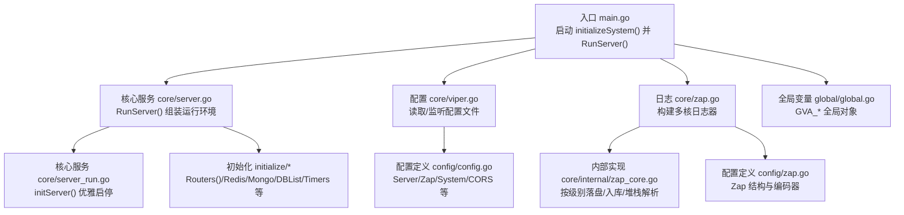
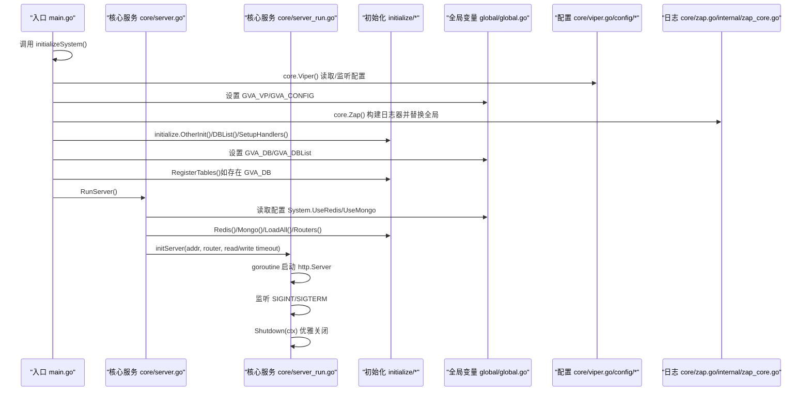
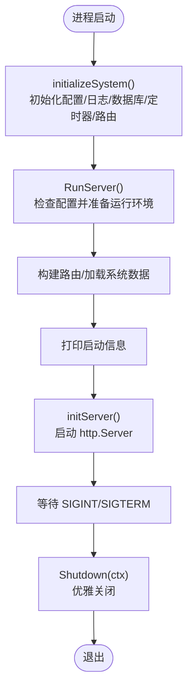
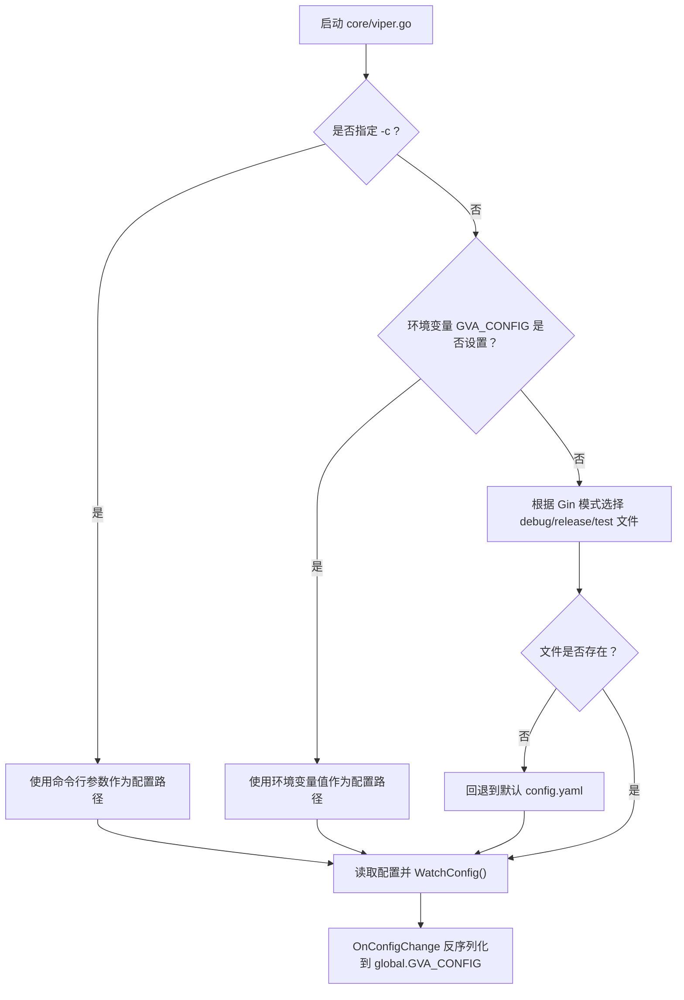
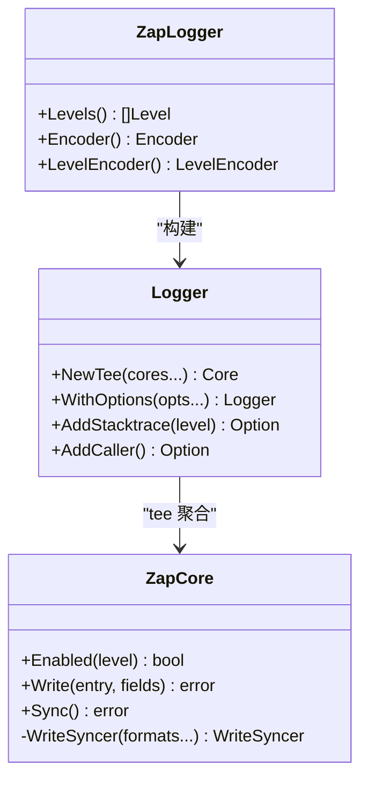
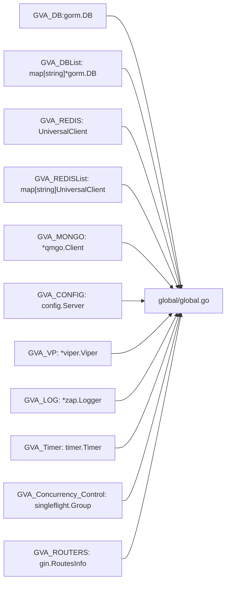
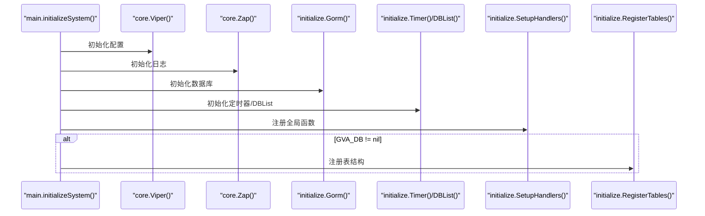
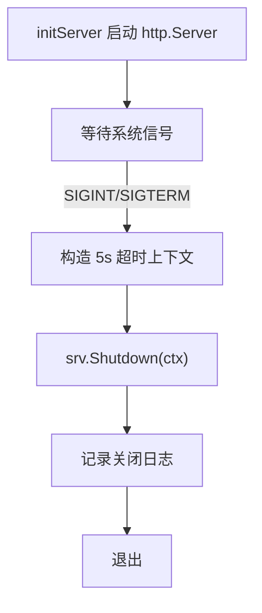
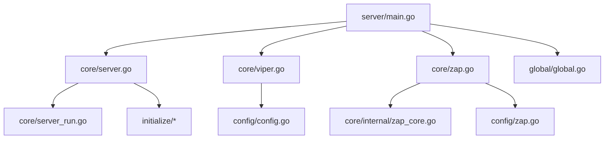

# 核心服务架构

<cite>
**本文引用的文件**
- [server/main.go](file://server/main.go)
- [core/server.go](file://server/core/server.go)
- [core/server_run.go](file://server/core/server_run.go)
- [core/viper.go](file://server/core/viper.go)
- [core/zap.go](file://server/core/zap.go)
- [core/internal/zap_core.go](file://server/core/internal/zap_core.go)
- [core/internal/constant.go](file://server/core/internal/constant.go)
- [global/global.go](file://server/global/global.go)
- [config/config.go](file://server/config/config.go)
- [config/zap.go](file://server/config/zap.go)
- [config/system.go](file://server/config/system.go)
- [config/cors.go](file://server/config/cors.go)
- [initialize/init.go](file://server/initialize/init.go)
- [initialize/register_init.go](file://server/initialize/register_init.go)
- [utils/server.go](file://server/utils/server.go)
</cite>

## 目录
1. [引言](#引言)
2. [项目结构](#项目结构)
3. [核心组件](#核心组件)
4. [架构总览](#架构总览)
5. [详细组件分析](#详细组件分析)
6. [依赖关系分析](#依赖关系分析)
7. [性能考量](#性能考量)
8. [故障排查指南](#故障排查指南)
9. [结论](#结论)
10. [附录](#附录)

## 引言
本文件面向 Gin-Vue-Admin 后端的核心服务架构，系统性阐述服务器启动流程、配置管理系统、日志系统、全局变量管理、初始化顺序控制、服务组件依赖关系、运行时生命周期与资源清理、错误恢复策略，并提供可操作的扩展指引（自定义初始化流程、新增配置项、调整日志级别等）。

## 项目结构
后端采用“入口程序 -> 核心服务 -> 初始化子系统 -> 全局变量 -> 配置/日志/数据库”分层组织，入口仅负责串联初始化与启动，核心服务负责运行时生命周期管理，初始化模块负责各子系统装配，全局变量集中存放跨模块共享对象，配置与日志分别由独立模块提供。

图表来源
- [server/main.go:30-52](file://server/main.go#L30-L52)
- [core/server.go:14-48](file://server/core/server.go#L14-L48)
- [core/server_run.go:21-61](file://server/core/server_run.go#L21-L61)
- [core/viper.go:16-77](file://server/core/viper.go#L16-L77)
- [core/zap.go:13-37](file://server/core/zap.go#L13-L37)
- [core/internal/zap_core.go:18-134](file://server/core/internal/zap_core.go#L18-L134)
- [global/global.go:25-69](file://server/global/global.go#L25-L69)
- [config/config.go:3-41](file://server/config/config.go#L3-L41)
- [config/zap.go:8-72](file://server/config/zap.go#L8-L72)

章节来源
- [server/main.go:30-52](file://server/main.go#L30-L52)
- [core/server.go:14-48](file://server/core/server.go#L14-L48)
- [core/server_run.go:21-61](file://server/core/server_run.go#L21-L61)
- [core/viper.go:16-77](file://server/core/viper.go#L16-L77)
- [core/zap.go:13-37](file://server/core/zap.go#L13-L37)
- [core/internal/zap_core.go:18-134](file://server/core/internal/zap_core.go#L18-L134)
- [global/global.go:25-69](file://server/global/global.go#L25-L69)
- [config/config.go:3-41](file://server/config/config.go#L3-L41)
- [config/zap.go:8-72](file://server/config/zap.go#L8-L72)

## 核心组件
- 入口与启动
  - 入口函数负责调用系统初始化与启动 HTTP 服务。
  - 关键路径：[server/main.go:30-52](file://server/main.go#L30-L52)
- 核心服务
  - RunServer：根据配置启用 Redis/Mongo、加载系统数据、构建路由、打印启动信息并调用 initServer。
  - 关键路径：[core/server.go:14-48](file://server/core/server.go#L14-L48)
  - initServer：基于 http.Server 实现优雅启停，捕获系统信号并超时关闭。
  - 关键路径：[core/server_run.go:21-61](file://server/core/server_run.go#L21-L61)
- 配置管理
  - Viper：解析命令行 -c、环境变量 GVA_CONFIG、GIN 模式对应的配置文件，支持热更新并反序列化到全局配置。
  - 关键路径：[core/viper.go:16-77](file://server/core/viper.go#L16-L77)
  - 配置结构：Server/Zap/System/CORS 等，集中定义所有可配置项。
  - 关键路径：[config/config.go:3-41](file://server/config/config.go#L3-L41)，[config/system.go:3-16](file://server/config/system.go#L3-L16)，[config/cors.go:3-15](file://server/config/cors.go#L3-L15)
- 日志系统
  - Zap：按配置目录、级别、编码器构建多核日志器；可同时输出控制台与文件；错误及以上级别自动入库。
  - 关键路径：[core/zap.go:13-37](file://server/core/zap.go#L13-L37)
  - 内核实现：按级别选择写入器，支持控制台与文件多写入器组合；错误级别自动入库并提取调用栈与源码片段。
  - 关键路径：[core/internal/zap_core.go:18-134](file://server/core/internal/zap_core.go#L18-L134)
- 全局变量
  - 集中存放数据库、Redis、Mongo、配置、Viper、日志、定时器、路由信息等跨模块共享对象。
  - 关键路径：[global/global.go:25-69](file://server/global/global.go#L25-L69)
- 初始化子系统
  - 初始化注册：通过导入包触发初始化注册，确保各模块在进程启动时完成注册。
  - 关键路径：[initialize/register_init.go:1-11](file://server/initialize/register_init.go#L1-L11)
  - 全局函数注册：注册系统重载处理函数，便于运行时重载。
  - 关键路径：[initialize/init.go:9-16](file://server/initialize/init.go#L9-L16)

章节来源
- [server/main.go:30-52](file://server/main.go#L30-L52)
- [core/server.go:14-48](file://server/core/server.go#L14-L48)
- [core/server_run.go:21-61](file://server/core/server_run.go#L21-L61)
- [core/viper.go:16-77](file://server/core/viper.go#L16-L77)
- [config/config.go:3-41](file://server/config/config.go#L3-L41)
- [config/system.go:3-16](file://server/config/system.go#L3-L16)
- [config/cors.go:3-15](file://server/config/cors.go#L3-L15)
- [core/zap.go:13-37](file://server/core/zap.go#L13-L37)
- [core/internal/zap_core.go:18-134](file://server/core/internal/zap_core.go#L18-L134)
- [global/global.go:25-69](file://server/global/global.go#L25-L69)
- [initialize/register_init.go:1-11](file://server/initialize/register_init.go#L1-L11)
- [initialize/init.go:9-16](file://server/initialize/init.go#L9-L16)

## 架构总览
下图展示了从入口到运行时的完整调用链与关键依赖：

图表来源
- [server/main.go:30-52](file://server/main.go#L30-L52)
- [core/server.go:14-48](file://server/core/server.go#L14-L48)
- [core/server_run.go:21-61](file://server/core/server_run.go#L21-L61)
- [core/viper.go:16-77](file://server/core/viper.go#L16-L77)
- [core/zap.go:13-37](file://server/core/zap.go#L13-L37)
- [core/internal/zap_core.go:18-134](file://server/core/internal/zap_core.go#L18-L134)
- [global/global.go:25-69](file://server/global/global.go#L25-L69)

## 详细组件分析

### 服务器启动流程
- 入口调用 initializeSystem 完成配置、日志、数据库、定时器、路由等初始化，随后调用 RunServer。
- RunServer 根据配置决定是否启用 Redis/Mongo，加载系统数据，构建路由，打印启动信息并调用 initServer。
- initServer 创建 http.Server，启动协程监听，等待系统信号，超时优雅关闭。

图表来源
- [server/main.go:30-52](file://server/main.go#L30-L52)
- [core/server.go:14-48](file://server/core/server.go#L14-L48)
- [core/server_run.go:21-61](file://server/core/server_run.go#L21-L61)

章节来源
- [server/main.go:30-52](file://server/main.go#L30-L52)
- [core/server.go:14-48](file://server/core/server.go#L14-L48)
- [core/server_run.go:21-61](file://server/core/server_run.go#L21-L61)

### 配置管理系统
- 配置来源优先级：命令行 -c > 环境变量 GVA_CONFIG > GIN 模式对应文件 > 默认文件。
- 支持配置热更新：viper.WatchConfig + OnConfigChange 回调，变更后反序列化到全局配置。
- 配置结构覆盖：JWT、Zap、Redis、Mongo、Email、System、Captcha、Autocode、数据库、OSS、Excel、跨域等。

图表来源
- [core/viper.go:16-77](file://server/core/viper.go#L16-L77)
- [core/internal/constant.go:3-10](file://server/core/internal/constant.go#L3-L10)

章节来源
- [core/viper.go:16-77](file://server/core/viper.go#L16-L77)
- [core/internal/constant.go:3-10](file://server/core/internal/constant.go#L3-L10)
- [config/config.go:3-41](file://server/config/config.go#L3-L41)
- [config/system.go:3-16](file://server/config/system.go#L3-L16)
- [config/cors.go:3-15](file://server/config/cors.go#L3-L15)

### 日志系统架构
- 多核日志器：根据配置的起始级别到 Fatal 构建多个 core，使用 tee 聚合输出。
- 输出目标：可同时输出到控制台与文件；文件按级别与日期切割。
- 错误入库：错误及以上级别自动入库，包含错误文本、调用栈、最终调用方法与源码片段。
- 编码器与级别编码：支持 JSON/Console、大小写与带颜色级别编码。

图表来源
- [core/zap.go:13-37](file://server/core/zap.go#L13-L37)
- [config/zap.go:8-72](file://server/config/zap.go#L8-L72)
- [core/internal/zap_core.go:18-134](file://server/core/internal/zap_core.go#L18-L134)

章节来源
- [core/zap.go:13-37](file://server/core/zap.go#L13-L37)
- [config/zap.go:8-72](file://server/config/zap.go#L8-L72)
- [core/internal/zap_core.go:18-134](file://server/core/internal/zap_core.go#L18-L134)

### 全局变量管理机制
- 全局对象集中定义于 global/global.go，包括数据库、Redis、Mongo、配置、Viper、日志、定时器、路由信息、MCP 服务等。
- 提供安全访问接口：如按库名获取数据库、按名称获取 Redis 实例、并发控制组等。
- 读写锁保护：对 DBList/RedisList 等映射读取加 RLock，保障并发安全。

图表来源
- [global/global.go:25-69](file://server/global/global.go#L25-L69)

章节来源
- [global/global.go:25-69](file://server/global/global.go#L25-L69)

### 初始化顺序控制与依赖关系
- 初始化注册：通过导入包触发初始化注册，确保模块在进程启动时完成注册。
  - 关键路径：[initialize/register_init.go:1-11](file://server/initialize/register_init.go#L1-L11)
- 入口初始化顺序：Viper -> OtherInit -> Zap -> Gorm -> Timer/DBList -> SetupHandlers -> RegisterTables（若存在 GVA_DB）。
  - 关键路径：[server/main.go:39-51](file://server/main.go#L39-L51)
- 全局函数注册：注册系统重载处理函数，便于运行时重载。
  - 关键路径：[initialize/init.go:9-16](file://server/initialize/init.go#L9-L16)

图表来源
- [server/main.go:39-51](file://server/main.go#L39-L51)
- [initialize/init.go:9-16](file://server/initialize/init.go#L9-L16)
- [initialize/register_init.go:1-11](file://server/initialize/register_init.go#L1-L11)

章节来源
- [server/main.go:39-51](file://server/main.go#L39-L51)
- [initialize/init.go:9-16](file://server/initialize/init.go#L9-L16)
- [initialize/register_init.go:1-11](file://server/initialize/register_init.go#L1-L11)

### 服务器运行时生命周期管理与资源清理
- 优雅关闭：initServer 在 goroutine 中启动 http.Server，监听 SIGINT/SIGTERM，收到信号后 5 秒超时优雅关闭。
- 资源清理：关闭日志同步器、数据库连接、Redis/Mongo 客户端等由各自模块负责；入口层通过 Shutdown(ctx) 统一触发。
- 错误恢复：启动失败记录错误日志并退出；优雅关闭过程中记录致命日志并退出。

图表来源
- [core/server_run.go:21-61](file://server/core/server_run.go#L21-L61)

章节来源
- [core/server_run.go:21-61](file://server/core/server_run.go#L21-L61)

### 扩展实践指南
以下为常见扩展场景的参考路径（不直接展示代码内容）：
- 自定义初始化流程
  - 在入口调用 initializeSystem 之后、RunServer 之前插入自定义初始化步骤，或在 initialize 包中新增初始化函数并在入口调用。
  - 参考路径：[server/main.go:39-51](file://server/main.go#L39-L51)，[initialize/init.go:9-16](file://server/initialize/init.go#L9-L16)
- 添加新的配置项
  - 在 config.Server 结构体中新增字段，并在 config/*.go 中定义对应子结构（如 config/your_feature.go），在 core/viper.go 中确保读取与热更新生效。
  - 参考路径：[config/config.go:3-41](file://server/config/config.go#L3-L41)，[core/viper.go:16-77](file://server/core/viper.go#L16-L77)
- 调整日志级别与输出
  - 修改 config/zap.go 中的 Zap 结构体字段（level/encoder/format/director 等），通过 core/zap.go 重新构建日志器；错误级别入库逻辑由 core/internal/zap_core.go 实现。
  - 参考路径：[config/zap.go:8-72](file://server/config/zap.go#L8-L72)，[core/zap.go:13-37](file://server/core/zap.go#L13-L37)，[core/internal/zap_core.go:18-134](file://server/core/internal/zap_core.go#L18-L134)
- 启用/禁用外部组件
  - 通过 config/system.go 中的 System 字段（如 UseRedis/UseMongo）控制 RunServer 中的初始化分支。
  - 参考路径：[config/system.go:3-16](file://server/config/system.go#L3-L16)，[core/server.go:14-48](file://server/core/server.go#L14-L48)

## 依赖关系分析
- 入口依赖核心服务与初始化模块；核心服务依赖全局变量与初始化模块；配置与日志模块相互配合；全局变量被广泛使用。
- 初始化注册通过包导入触发，避免显式耦合；配置热更新通过 viper 事件回调实现解耦。

图表来源
- [server/main.go:30-52](file://server/main.go#L30-L52)
- [core/server.go:14-48](file://server/core/server.go#L14-L48)
- [core/server_run.go:21-61](file://server/core/server_run.go#L21-L61)
- [core/viper.go:16-77](file://server/core/viper.go#L16-L77)
- [core/zap.go:13-37](file://server/core/zap.go#L13-L37)
- [core/internal/zap_core.go:18-134](file://server/core/internal/zap_core.go#L18-L134)
- [global/global.go:25-69](file://server/global/global.go#L25-L69)
- [config/config.go:3-41](file://server/config/config.go#L3-L41)
- [config/zap.go:8-72](file://server/config/zap.go#L8-L72)

章节来源
- [server/main.go:30-52](file://server/main.go#L30-L52)
- [core/server.go:14-48](file://server/core/server.go#L14-L48)
- [core/server_run.go:21-61](file://server/core/server_run.go#L21-L61)
- [core/viper.go:16-77](file://server/core/viper.go#L16-L77)
- [core/zap.go:13-37](file://server/core/zap.go#L13-L37)
- [core/internal/zap_core.go:18-134](file://server/core/internal/zap_core.go#L18-L134)
- [global/global.go:25-69](file://server/global/global.go#L25-L69)
- [config/config.go:3-41](file://server/config/config.go#L3-L41)
- [config/zap.go:8-72](file://server/config/zap.go#L8-L72)

## 性能考量
- 日志性能：多核 tee 聚合输出，建议在高并发场景下合理设置日志级别与编码器，避免过度磁盘 IO。
- 配置热更新：viper 监听文件变更并反序列化，注意避免频繁变更导致的抖动。
- 优雅关闭：5 秒超时关闭，确保在关闭前完成必要的资源回收与告警上报。
- 资源并发：全局对象读取使用读写锁保护，避免竞态；Redis/Mongo 客户端需遵循各自连接池与超时策略。

## 故障排查指南
- 启动失败
  - 检查配置文件路径与权限，确认 core/viper.go 的配置读取逻辑。
  - 查看 initServer 的错误日志与退出码。
  - 参考路径：[core/server_run.go:21-61](file://server/core/server_run.go#L21-L61)，[core/viper.go:16-77](file://server/core/viper.go#L16-L77)
- 日志未输出或级别不正确
  - 检查 config/zap.go 的级别与编码器配置，确认 core/zap.go 的构建逻辑。
  - 确认 core/internal/zap_core.go 的错误入库逻辑是否被触发。
  - 参考路径：[config/zap.go:8-72](file://server/config/zap.go#L8-L72)，[core/zap.go:13-37](file://server/core/zap.go#L13-L37)，[core/internal/zap_core.go:18-134](file://server/core/internal/zap_core.go#L18-L134)
- 配置热更新无效
  - 确认文件监听与 OnConfigChange 回调是否生效，检查 core/viper.go 的 WatchConfig 与 Unmarshal 流程。
  - 参考路径：[core/viper.go:16-77](file://server/core/viper.go#L16-L77)
- 优雅关闭卡顿
  - 检查 Shutdown(ctx) 的超时时间与阻塞请求，定位长时间未结束的请求或资源释放。
  - 参考路径：[core/server_run.go:21-61](file://server/core/server_run.go#L21-L61)

章节来源
- [core/server_run.go:21-61](file://server/core/server_run.go#L21-L61)
- [core/viper.go:16-77](file://server/core/viper.go#L16-L77)
- [config/zap.go:8-72](file://server/config/zap.go#L8-L72)
- [core/zap.go:13-37](file://server/core/zap.go#L13-L37)
- [core/internal/zap_core.go:18-134](file://server/core/internal/zap_core.go#L18-L134)

## 结论
Gin-Vue-Admin 后端通过清晰的分层与模块化设计，实现了配置驱动、日志可观测、初始化有序、运行时优雅关闭的完整核心服务架构。开发者可在不破坏现有流程的前提下，通过入口初始化、配置结构与日志内核扩展实现自定义能力。

## 附录
- 系统信息采集工具（用于监控与诊断）
  - 参考路径：[utils/server.go:20-127](file://server/utils/server.go#L20-L127)