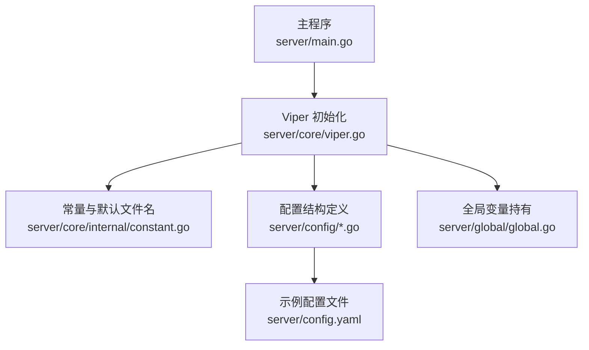
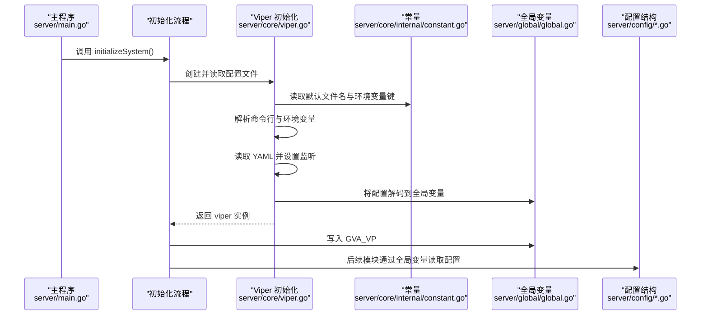
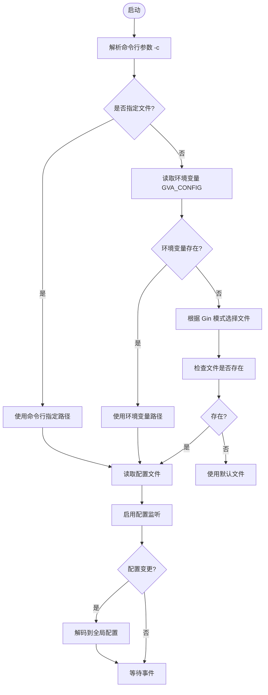
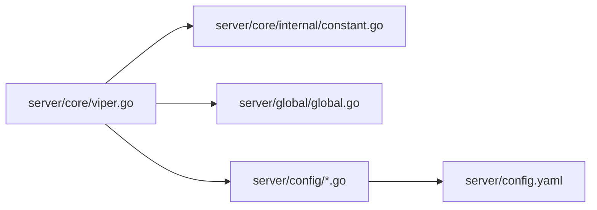

# 配置管理系统

<cite>
**本文引用的文件**
- [server/core/viper.go](file://server/core/viper.go)
- [server/core/internal/constant.go](file://server/core/internal/constant.go)
- [server/main.go](file://server/main.go)
- [server/global/global.go](file://server/global/global.go)
- [server/config/config.go](file://server/config/config.go)
- [server/config/system.go](file://server/config/system.go)
- [server/config/jwt.go](file://server/config/jwt.go)
- [server/config/redis.go](file://server/config/redis.go)
- [server/config/db_list.go](file://server/config/db_list.go)
- [server/config/auto_code.go](file://server/config/auto_code.go)
- [server/config/disk.go](file://server/config/disk.go)
- [server/config/cors.go](file://server/config/cors.go)
- [server/config/mcp.go](file://server/config/mcp.go)
- [server/config/email.go](file://server/config/email.go)
- [server/config.yaml](file://server/config.yaml)
</cite>

## 目录
1. [简介](#简介)
2. [项目结构](#项目结构)
3. [核心组件](#核心组件)
4. [架构总览](#架构总览)
5. [详细组件分析](#详细组件分析)
6. [依赖分析](#依赖分析)
7. [性能考量](#性能考量)
8. [故障排查指南](#故障排查指南)
9. [结论](#结论)
10. [附录](#附录)

## 简介
本文件面向 Gin-Vue-Admin 的配置管理系统，围绕 Viper 配置框架的集成与使用展开，涵盖以下主题：
- 配置文件加载机制与优先级
- 环境变量与命令行参数的读取
- 配置项结构设计与分类管理
- 默认值与映射规则
- 动态配置更新（热更新）机制
- 配置验证与错误处理
- 实际应用场景：新增配置项、修改加载逻辑、实现验证规则

## 项目结构
配置系统主要由以下层次构成：
- 入口与初始化：主程序负责调用初始化流程，其中包含 Viper 初始化
- 配置加载与监听：Viper 负责读取配置文件、设置监听器并在变更时解耦到全局配置对象
- 配置结构定义：按功能域划分的结构体集合，统一通过标签映射 YAML 字段
- 全局共享：将已解析的配置注入全局变量，供各模块使用

图表来源
- [server/main.go:30-52](file://server/main.go#L30-L52)
- [server/core/viper.go:17-42](file://server/core/viper.go#L17-L42)
- [server/core/internal/constant.go:3-9](file://server/core/internal/constant.go#L3-L9)
- [server/global/global.go:25-42](file://server/global/global.go#L25-L42)
- [server/config.yaml:1-284](file://server/config.yaml#L1-L284)

章节来源
- [server/main.go:30-52](file://server/main.go#L30-L52)
- [server/core/viper.go:17-77](file://server/core/viper.go#L17-L77)
- [server/core/internal/constant.go:3-9](file://server/core/internal/constant.go#L3-L9)
- [server/global/global.go:25-42](file://server/global/global.go#L25-L42)
- [server/config.yaml:1-284](file://server/config.yaml#L1-L284)

## 核心组件
- Viper 初始化与配置加载
  - 依据命令行参数、环境变量、Gin 运行模式与默认文件顺序确定配置文件路径
  - 读取 YAML 配置并启动监听，变更时重新解码到全局配置对象
- 配置结构定义
  - 采用结构体嵌套与标签映射，覆盖系统、数据库、缓存、对象存储、跨域、MCP 等领域
- 全局共享
  - 解析后的配置保存在全局变量中，供其他模块直接读取

章节来源
- [server/core/viper.go:17-77](file://server/core/viper.go#L17-L77)
- [server/config/config.go:3-40](file://server/config/config.go#L3-L40)
- [server/global/global.go:25-42](file://server/global/global.go#L25-L42)

## 架构总览
下图展示了配置系统在启动阶段的关键交互：

图表来源
- [server/main.go:39-52](file://server/main.go#L39-L52)
- [server/core/viper.go:17-42](file://server/core/viper.go#L17-L42)
- [server/core/internal/constant.go:3-9](file://server/core/internal/constant.go#L3-L9)
- [server/global/global.go:25-42](file://server/global/global.go#L25-L42)

## 详细组件分析

### Viper 配置加载与热更新
- 加载优先级
  - 命令行参数：-c 指定配置文件路径
  - 环境变量：GVA_CONFIG
  - Gin 模式：Debug/Release/Test 对应不同默认文件
  - 若上述文件不存在，则回退到默认文件
- 配置读取与监听
  - 指定配置文件与类型后读取
  - 启用 WatchConfig 并注册 OnConfigChange 回调
  - 回调中将新配置解码到全局配置对象，确保运行时热更新
- 根路径适配
  - 自动计算项目根路径，保证资源定位正确

图表来源
- [server/core/viper.go:44-76](file://server/core/viper.go#L44-L76)
- [server/core/internal/constant.go:3-9](file://server/core/internal/constant.go#L3-L9)

章节来源
- [server/core/viper.go:17-77](file://server/core/viper.go#L17-L77)
- [server/core/internal/constant.go:3-9](file://server/core/internal/constant.go#L3-L9)

### 配置结构设计与默认值
- Server 结构体
  - 聚合各类子配置：JWT、Zap、Redis/Multi-Redis、Mongo、Email、System、Captcha、Autocode、多数据库、多磁盘、跨域、MCP、Excel 等
  - 通过标签将字段映射到 YAML 键，便于 Viper 解码
- System
  - 包含数据库类型、OSS 类型、端口、IP 限制、路由前缀、多点登录、Redis/Mongo 开关、严格权限模式、自动迁移开关等
- JWT
  - 签名密钥、过期时间、缓冲时间、签发者
- Redis
  - 名称、地址、密码、DB、是否集群、集群节点列表
- DB 列表与通用数据库配置
  - 通用字段：前缀、端口、高级配置、库名、账号、密码、地址、引擎、日志级别、连接池、单数表名、日志写入方式
  - 特化结构：类型、别名、是否禁用；通过内联实现扁平化映射
- AutoCode
  - 前端目录、根目录、服务端目录、模块名、AI 路径；提供 WebRoot 辅助方法
- Disk/DiskList
  - 磁盘挂载点
- CORS/CORSWhitelist
  - 放行模式、白名单条目（允许来源、方法、头、暴露头、凭据）
- MCP
  - 名称、版本、路径、监听端口、基础 URL、上游基础 URL、鉴权头、请求超时；保留兼容字段
- Email
  - 收件人、发件人、SMTP 主机、密钥、昵称、端口、SSL、登录认证开关

章节来源
- [server/config/config.go:3-40](file://server/config/config.go#L3-L40)
- [server/config/system.go:3-15](file://server/config/system.go#L3-L15)
- [server/config/jwt.go:3-8](file://server/config/jwt.go#L3-L8)
- [server/config/redis.go:3-10](file://server/config/redis.go#L3-L10)
- [server/config/db_list.go:17-54](file://server/config/db_list.go#L17-L54)
- [server/config/auto_code.go:8-23](file://server/config/auto_code.go#L8-L23)
- [server/config/disk.go:3-9](file://server/config/disk.go#L3-L9)
- [server/config/cors.go:3-14](file://server/config/cors.go#L3-L14)
- [server/config/mcp.go:3-18](file://server/config/mcp.go#L3-L18)
- [server/config/email.go:3-12](file://server/config/email.go#L3-L12)

### 全局配置共享与使用
- 全局变量
  - GVA_CONFIG：存放已解码的 Server 配置
  - GVA_VP：Viper 实例，供需要直接读取原始配置的场景使用
- 使用方式
  - 各模块通过全局包读取配置，避免重复解析与耦合

章节来源
- [server/global/global.go:25-42](file://server/global/global.go#L25-L42)
- [server/main.go:39-52](file://server/main.go#L39-L52)

### 配置文件示例与字段对照
- 示例文件包含大量常用配置项，如 JWT、Zap、Redis、Mongo、Email、System、Captcha、MySQL/PgSQL/MSSQL/SQLite、DB 列表、本地与多家 OSS、Excel、跨域、MCP 等
- 通过标签映射，YAML 键与结构体字段一一对应

章节来源
- [server/config.yaml:1-284](file://server/config.yaml#L1-L284)

## 依赖分析
- 组件耦合
  - Viper 初始化仅依赖常量与全局变量，耦合度低
  - 配置结构定义独立，通过标签与 Viper 解码对接
  - 全局变量集中承载配置，降低模块间传递成本
- 外部依赖
  - Viper 用于配置读取与监听
  - Gin 模式影响默认配置文件选择
  - fsnotify 用于文件变更通知

图表来源
- [server/core/viper.go:17-42](file://server/core/viper.go#L17-L42)
- [server/core/internal/constant.go:3-9](file://server/core/internal/constant.go#L3-L9)
- [server/global/global.go:25-42](file://server/global/global.go#L25-L42)
- [server/config.yaml:1-284](file://server/config.yaml#L1-L284)

章节来源
- [server/core/viper.go:17-77](file://server/core/viper.go#L17-L77)
- [server/core/internal/constant.go:3-9](file://server/core/internal/constant.go#L3-L9)
- [server/global/global.go:25-42](file://server/global/global.go#L25-L42)
- [server/config.yaml:1-284](file://server/config.yaml#L1-L284)

## 性能考量
- 配置读取
  - 仅在启动阶段一次性读取，后续通过监听增量更新，避免频繁 IO
- 解码与监听
  - 监听回调中进行解码，建议避免在回调中执行耗时操作，必要时异步处理
- 连接池与日志
  - 数据库与缓存连接池参数需结合负载合理配置，防止资源争用

## 故障排查指南
- 配置文件路径问题
  - 确认命令行参数 -c、环境变量 GVA_CONFIG 是否正确
  - 检查 Gin 模式对应的默认文件是否存在
- 配置解码失败
  - 检查 YAML 格式与字段拼写，确保与结构体标签一致
  - 关注监听回调中的错误输出，定位具体字段
- 热更新未生效
  - 确认文件监听是否正常，以及监听回调是否成功解码到全局配置

章节来源
- [server/core/viper.go:29-37](file://server/core/viper.go#L29-L37)
- [server/core/viper.go:69-76](file://server/core/viper.go#L69-L76)

## 结论
该配置系统以 Viper 为核心，结合命令行、环境变量与模式化的默认文件策略，实现了灵活且可热更新的配置管理。通过结构化定义与标签映射，系统具备良好的扩展性与可维护性。建议在新增配置项时遵循现有结构与标签规范，并在监听回调中谨慎处理变更，确保系统稳定性。

## 附录

### 实战指南：新增配置项
- 新增结构体字段
  - 在相应配置文件中定义结构体（参考现有文件）
  - 在 Server 结构体中聚合该子配置
- 映射与默认值
  - 使用标签将字段映射到 YAML 键
  - 如需默认值，可在结构体字段上声明（参考通用数据库结构体）
- 加载与使用
  - 启动时由 Viper 自动读取并解码到全局配置
  - 在业务模块中通过全局变量读取

章节来源
- [server/config/config.go:3-40](file://server/config/config.go#L3-L40)
- [server/config/db_list.go:17-31](file://server/config/db_list.go#L17-L31)
- [server/global/global.go:25-42](file://server/global/global.go#L25-L42)

### 实战指南：修改配置加载逻辑
- 调整优先级或默认文件
  - 修改常量文件中的默认文件名或环境变量键
  - 在 Viper 初始化中调整路径选择逻辑
- 增加额外来源
  - 可在现有逻辑基础上增加新的来源（如额外环境变量），但需保持与现有优先级一致

章节来源
- [server/core/internal/constant.go:3-9](file://server/core/internal/constant.go#L3-L9)
- [server/core/viper.go:44-76](file://server/core/viper.go#L44-L76)

### 实战指南：实现配置验证规则
- 建议在监听回调中增加校验逻辑
  - 对关键字段（如端口、路径、布尔开关）进行范围与格式校验
  - 校验失败时记录日志并拒绝更新或回滚
- 分模块校验
  - 将验证逻辑拆分到对应模块初始化中，确保配置满足各自约束

章节来源
- [server/core/viper.go:29-37](file://server/core/viper.go#L29-L37)