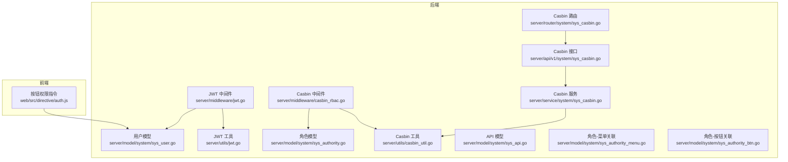
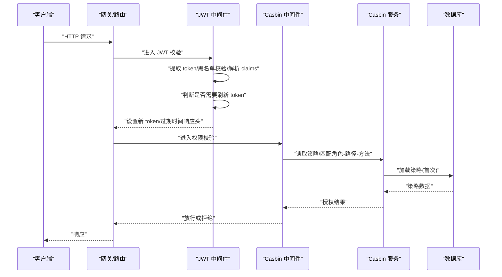
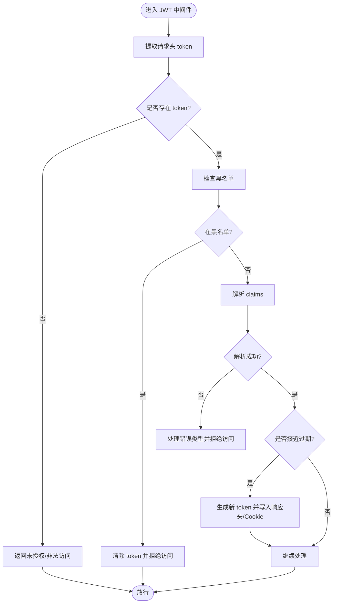
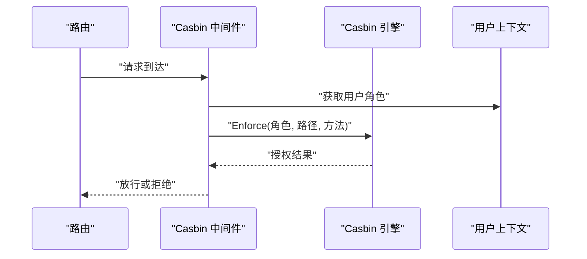
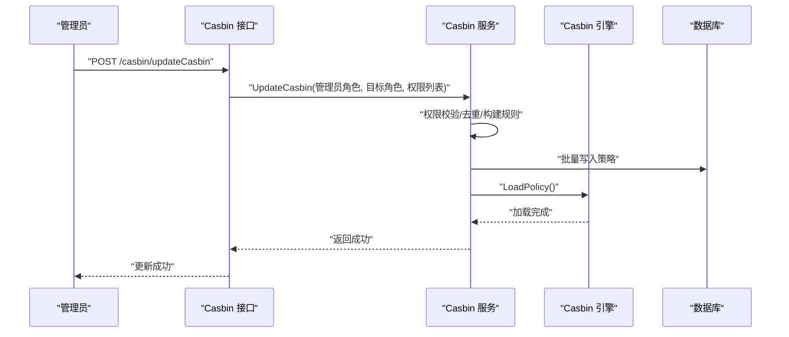
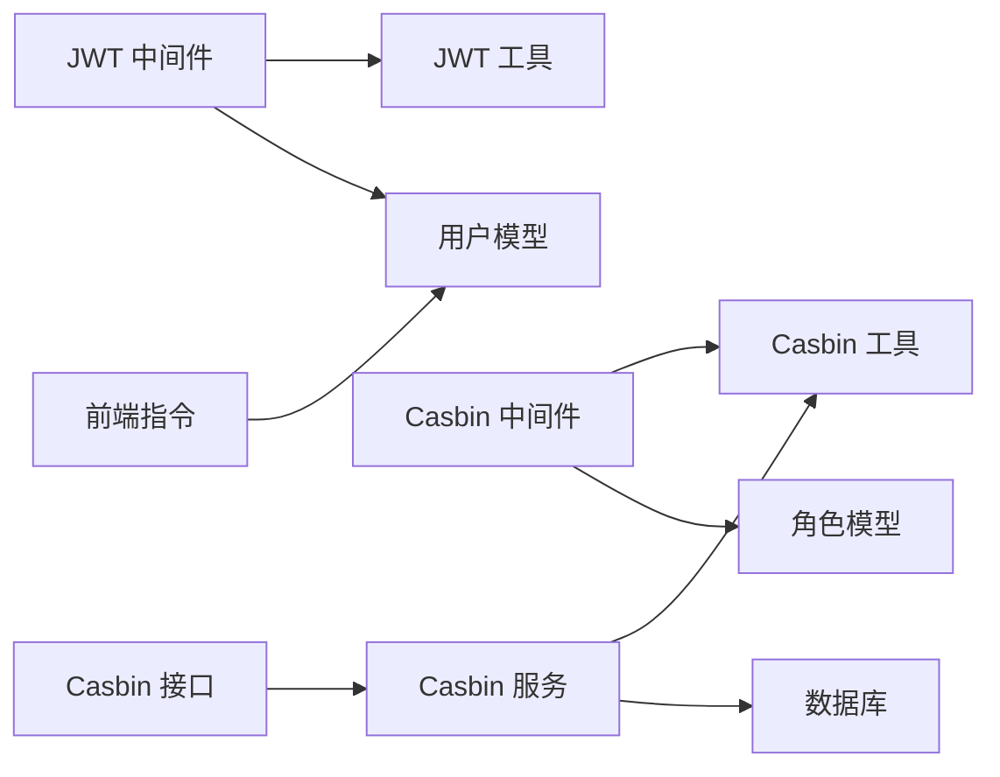

# 安全权限系统

<cite>
**本文引用的文件**
- [server/middleware/jwt.go](file://server/middleware/jwt.go)
- [server/middleware/casbin_rbac.go](file://server/middleware/casbin_rbac.go)
- [server/utils/jwt.go](file://server/utils/jwt.go)
- [server/utils/casbin_util.go](file://server/utils/casbin_util.go)
- [server/service/system/sys_casbin.go](file://server/service/system/sys_casbin.go)
- [server/model/system/sys_user.go](file://server/model/system/sys_user.go)
- [server/model/system/sys_authority.go](file://server/model/system/sys_authority.go)
- [server/model/system/sys_authority_btn.go](file://server/model/system/sys_authority_btn.go)
- [server/model/system/sys_api.go](file://server/model/system/sys_api.go)
- [server/model/system/sys_authority_menu.go](file://server/model/system/sys_authority_menu.go)
- [server/router/system/sys_casbin.go](file://server/router/system/sys_casbin.go)
- [server/api/v1/system/sys_casbin.go](file://server/api/v1/system/sys_casbin.go)
- [server/config/jwt.go](file://server/config/jwt.go)
- [web/src/directive/auth.js](file://web/src/directive/auth.js)
</cite>

## 目录
1. [简介](#简介)
2. [项目结构](#项目结构)
3. [核心组件](#核心组件)
4. [架构总览](#架构总览)
5. [详细组件分析](#详细组件分析)
6. [依赖分析](#依赖分析)
7. [性能考量](#性能考量)
8. [故障排查指南](#故障排查指南)
9. [结论](#结论)
10. [附录](#附录)

## 简介
本文件面向安全权限系统，围绕基于 JWT 的认证机制、RBAC 权限模型、Casbin 集成、中间件权限控制、权限数据模型与最佳实践展开，帮助开发者与运维人员快速理解并安全地使用与扩展权限体系。

## 项目结构
后端采用 Go Gin 框架，权限相关代码主要分布在以下模块：
- 中间件：JWT 认证与 Casbin RBAC 控制
- 工具层：JWT 生成/解析、Casbin 实例初始化
- 服务层：Casbin 权限策略管理、API 权限同步
- 模型层：用户、角色、权限、API、菜单、按钮等数据模型
- 路由与接口：Casbin 权限更新与查询接口
- 前端指令：按钮级权限控制指令



图表来源
- [server/middleware/jwt.go:16-78](file://server/middleware/jwt.go#L16-L78)
- [server/middleware/casbin_rbac.go:12-32](file://server/middleware/casbin_rbac.go#L12-L32)
- [server/utils/jwt.go:13-106](file://server/utils/jwt.go#L13-L106)
- [server/utils/casbin_util.go:18-52](file://server/utils/casbin_util.go#L18-L52)
- [server/service/system/sys_casbin.go:22-216](file://server/service/system/sys_casbin.go#L22-L216)
- [server/model/system/sys_user.go:20-34](file://server/model/system/sys_user.go#L20-L34)
- [server/model/system/sys_authority.go:7-19](file://server/model/system/sys_authority.go#L7-L19)
- [server/model/system/sys_api.go:7-17](file://server/model/system/sys_api.go#L7-L17)
- [server/model/system/sys_authority_menu.go:12-19](file://server/model/system/sys_authority_menu.go#L12-L19)
- [server/model/system/sys_authority_btn.go:3-8](file://server/model/system/sys_authority_btn.go#L3-L8)
- [server/router/system/sys_casbin.go:10-19](file://server/router/system/sys_casbin.go#L10-L19)
- [server/api/v1/system/sys_casbin.go:15-69](file://server/api/v1/system/sys_casbin.go#L15-L69)
- [web/src/directive/auth.js:1-26](file://web/src/directive/auth.js#L1-L26)

章节来源
- [server/middleware/jwt.go:16-78](file://server/middleware/jwt.go#L16-L78)
- [server/middleware/casbin_rbac.go:12-32](file://server/middleware/casbin_rbac.go#L12-L32)
- [server/utils/jwt.go:13-106](file://server/utils/jwt.go#L13-L106)
- [server/utils/casbin_util.go:18-52](file://server/utils/casbin_util.go#L18-L52)
- [server/service/system/sys_casbin.go:22-216](file://server/service/system/sys_casbin.go#L22-L216)
- [server/model/system/sys_user.go:20-34](file://server/model/system/sys_user.go#L20-L34)
- [server/model/system/sys_authority.go:7-19](file://server/model/system/sys_authority.go#L7-L19)
- [server/model/system/sys_api.go:7-17](file://server/model/system/sys_api.go#L7-L17)
- [server/model/system/sys_authority_menu.go:12-19](file://server/model/system/sys_authority_menu.go#L12-L19)
- [server/model/system/sys_authority_btn.go:3-8](file://server/model/system/sys_authority_btn.go#L3-L8)
- [server/router/system/sys_casbin.go:10-19](file://server/router/system/sys_casbin.go#L10-L19)
- [server/api/v1/system/sys_casbin.go:15-69](file://server/api/v1/system/sys_casbin.go#L15-L69)
- [web/src/directive/auth.js:1-26](file://web/src/directive/auth.js#L1-L26)

## 核心组件
- JWT 认证中间件：负责从请求头提取 token、校验黑名单、解析 claims、自动刷新 token 并写入响应头与 Cookie。
- Casbin RBAC 中间件：根据当前用户角色、请求路径与方法进行权限判定。
- JWT 工具：封装 HS256 签名、claims 构造、token 生成与解析、并发安全的旧 token 换新 token。
- Casbin 工具：通过 GORM-Adapter 将策略持久化至数据库，加载模型与策略，提供缓存与并发控制。
- Casbin 服务：提供角色权限批量更新、API 权限同步、按角色查询策略、按 API 查询角色集合等能力。
- 数据模型：用户、角色、API、菜单、按钮、角色-菜单多对多、角色-按钮关联等。
- 前端指令：基于用户角色 ID 控制按钮显示。

章节来源
- [server/middleware/jwt.go:16-78](file://server/middleware/jwt.go#L16-L78)
- [server/middleware/casbin_rbac.go:12-32](file://server/middleware/casbin_rbac.go#L12-L32)
- [server/utils/jwt.go:13-106](file://server/utils/jwt.go#L13-L106)
- [server/utils/casbin_util.go:18-52](file://server/utils/casbin_util.go#L18-L52)
- [server/service/system/sys_casbin.go:22-216](file://server/service/system/sys_casbin.go#L22-L216)
- [server/model/system/sys_user.go:20-34](file://server/model/system/sys_user.go#L20-L34)
- [server/model/system/sys_authority.go:7-19](file://server/model/system/sys_authority.go#L7-L19)
- [server/model/system/sys_api.go:7-17](file://server/model/system/sys_api.go#L7-L17)
- [server/model/system/sys_authority_menu.go:12-19](file://server/model/system/sys_authority_menu.go#L12-L19)
- [server/model/system/sys_authority_btn.go:3-8](file://server/model/system/sys_authority_btn.go#L3-L8)
- [web/src/directive/auth.js:1-26](file://web/src/directive/auth.js#L1-L26)

## 架构总览
下图展示了从请求进入系统到权限判定与响应返回的总体流程，涵盖 JWT 认证、Casbin 授权、策略加载与刷新等关键环节。



图表来源
- [server/middleware/jwt.go:16-78](file://server/middleware/jwt.go#L16-L78)
- [server/middleware/casbin_rbac.go:12-32](file://server/middleware/casbin_rbac.go#L12-L32)
- [server/utils/casbin_util.go:18-52](file://server/utils/casbin_util.go#L18-L52)
- [server/service/system/sys_casbin.go:169-173](file://server/service/system/sys_casbin.go#L169-L173)

## 详细组件分析

### JWT 认证机制
- 令牌生成：基于 HS256 签名，claims 包含签发者、受众、生效时间、过期时间与缓冲时间；可通过并发安全函数将旧 token 换为新 token。
- 令牌验证：解析 token 并区分过期、格式错误、签名无效等异常；支持黑名单拦截异地登录或失效 token。
- 自动刷新：当剩余有效期小于缓冲时间时，生成新 token 并通过响应头与 Cookie 返回，同时可选写入 Redis 保持在线状态一致。
- 黑名单：通过内存缓存快速判断 token 是否在黑名单，避免二次查询数据库。



图表来源
- [server/middleware/jwt.go:16-78](file://server/middleware/jwt.go#L16-L78)
- [server/utils/jwt.go:48-88](file://server/utils/jwt.go#L48-L88)

章节来源
- [server/middleware/jwt.go:16-78](file://server/middleware/jwt.go#L16-L78)
- [server/utils/jwt.go:13-106](file://server/utils/jwt.go#L13-L106)
- [server/config/jwt.go:3-8](file://server/config/jwt.go#L3-L8)

### RBAC 权限模型与 Casbin 集成
- 模型定义：用户-角色（多对多）、角色-菜单（多对多）、角色-按钮关联、API 资源。
- 授权判定：中间件使用 Casbin 的 Enforce(sub, obj, act) 判断“角色-路径-方法”组合是否允许。
- 策略持久化：通过 gorm-adapter 将 p 策略保存在数据库表中，首次使用时加载策略并启用缓存。
- 动态更新：提供批量更新角色 API 权限、按 API 同步策略、按角色查询策略、按 API 查询角色集合等接口与服务方法。

```mermaid
classDiagram
class SysUser {
+uuid
+username
+password
+nickName
+authorityId
+enable
}
class SysAuthority {
+authorityId
+authorityName
+parentId
+defaultRouter
}
class SysApi {
+path
+description
+apiGroup
+method
}
class SysAuthorityMenu {
+menuId
+authorityId
}
class SysAuthorityBtn {
+authorityId
+sysMenuId
+sysBaseMenuBtnId
}
SysUser --> SysAuthority : "多对多(用户-角色)"
SysAuthority --> SysAuthorityMenu : "多对多(角色-菜单)"
SysAuthority --> SysAuthorityBtn : "角色-按钮关联"
SysAuthority --> SysApi : "策略(p : sub,obj,act)"
```

图表来源
- [server/model/system/sys_user.go:20-34](file://server/model/system/sys_user.go#L20-L34)
- [server/model/system/sys_authority.go:7-19](file://server/model/system/sys_authority.go#L7-L19)
- [server/model/system/sys_api.go:7-17](file://server/model/system/sys_api.go#L7-L17)
- [server/model/system/sys_authority_menu.go:12-19](file://server/model/system/sys_authority_menu.go#L12-L19)
- [server/model/system/sys_authority_btn.go:3-8](file://server/model/system/sys_authority_btn.go#L3-L8)

章节来源
- [server/middleware/casbin_rbac.go:12-32](file://server/middleware/casbin_rbac.go#L12-L32)
- [server/utils/casbin_util.go:18-52](file://server/utils/casbin_util.go#L18-L52)
- [server/service/system/sys_casbin.go:22-216](file://server/service/system/sys_casbin.go#L22-L216)
- [server/model/system/sys_user.go:20-34](file://server/model/system/sys_user.go#L20-L34)
- [server/model/system/sys_authority.go:7-19](file://server/model/system/sys_authority.go#L7-L19)
- [server/model/system/sys_api.go:7-17](file://server/model/system/sys_api.go#L7-L17)
- [server/model/system/sys_authority_menu.go:12-19](file://server/model/system/sys_authority_menu.go#L12-L19)
- [server/model/system/sys_authority_btn.go:3-8](file://server/model/system/sys_authority_btn.go#L3-L8)

### 中间件权限控制
- 路由级权限：Casbin 中间件在每次请求前，根据当前用户角色、请求路径与方法进行授权判定，未通过则直接拒绝。
- 按钮级权限：前端通过 v-auth 指令，依据用户角色 ID 决定按钮是否渲染，支持修饰符取反。



图表来源
- [server/middleware/casbin_rbac.go:12-32](file://server/middleware/casbin_rbac.go#L12-L32)

章节来源
- [server/middleware/casbin_rbac.go:12-32](file://server/middleware/casbin_rbac.go#L12-L32)
- [web/src/directive/auth.js:1-26](file://web/src/directive/auth.js#L1-L26)

### 权限数据模型与索引优化
- 用户模型：包含 UUID、用户名、角色 ID、多角色关联、启用状态等字段，便于快速定位用户与角色关系。
- 角色模型：角色 ID、角色名、父角色 ID、默认路由、菜单与用户关联等，支持层级角色与默认菜单。
- API 模型：路径、描述、分组、方法，作为策略对象与方法维度。
- 关联表：角色-菜单多对多、角色-按钮关联，确保菜单与按钮权限的细粒度控制。
- 索引建议：用户表的用户名与 UUID 建有索引；角色表的 authority_id 建有唯一索引；API 表的 path/method 建有联合索引以加速策略匹配。

章节来源
- [server/model/system/sys_user.go:20-34](file://server/model/system/sys_user.go#L20-L34)
- [server/model/system/sys_authority.go:7-19](file://server/model/system/sys_authority.go#L7-L19)
- [server/model/system/sys_api.go:7-17](file://server/model/system/sys_api.go#L7-L17)
- [server/model/system/sys_authority_menu.go:12-19](file://server/model/system/sys_authority_menu.go#L12-L19)
- [server/model/system/sys_authority_btn.go:3-8](file://server/model/system/sys_authority_btn.go#L3-L8)

### 接口与流程：Casbin 权限管理
- 更新角色 API 权限：管理员调用接口，服务层先校验操作者权限，再去重构建策略规则，最后批量写入数据库并加载到 Casbin。
- 查询角色策略：按角色 ID 查询其策略列表，用于前端展示与对比。
- API 权限同步：当 API 路径或方法变更时，同步更新策略并重新加载。
- 按 API 查询角色集合：用于精细化权限回收与审计。



图表来源
- [server/api/v1/system/sys_casbin.go:15-44](file://server/api/v1/system/sys_casbin.go#L15-L44)
- [server/service/system/sys_casbin.go:26-74](file://server/service/system/sys_casbin.go#L26-L74)
- [server/router/system/sys_casbin.go:10-19](file://server/router/system/sys_casbin.go#L10-L19)

章节来源
- [server/api/v1/system/sys_casbin.go:15-69](file://server/api/v1/system/sys_casbin.go#L15-L69)
- [server/service/system/sys_casbin.go:22-216](file://server/service/system/sys_casbin.go#L22-L216)
- [server/router/system/sys_casbin.go:10-19](file://server/router/system/sys_casbin.go#L10-L19)

## 依赖分析
- 中间件耦合：JWT 中间件依赖 JWT 工具与用户模型；Casbin 中间件依赖 Casbin 工具与用户模型。
- 服务层耦合：Casbin 服务依赖 Casbin 工具与数据库，提供策略增删改查与同步能力。
- 前后端联动：前端指令依赖用户 store 中的 authorityId，后端中间件依赖用户 claims 中的角色 ID。



图表来源
- [server/middleware/jwt.go:16-78](file://server/middleware/jwt.go#L16-L78)
- [server/middleware/casbin_rbac.go:12-32](file://server/middleware/casbin_rbac.go#L12-L32)
- [server/utils/jwt.go:13-106](file://server/utils/jwt.go#L13-L106)
- [server/utils/casbin_util.go:18-52](file://server/utils/casbin_util.go#L18-L52)
- [server/service/system/sys_casbin.go:22-216](file://server/service/system/sys_casbin.go#L22-L216)
- [server/model/system/sys_user.go:20-34](file://server/model/system/sys_user.go#L20-L34)
- [server/model/system/sys_authority.go:7-19](file://server/model/system/sys_authority.go#L7-L19)
- [web/src/directive/auth.js:1-26](file://web/src/directive/auth.js#L1-L26)

章节来源
- [server/middleware/jwt.go:16-78](file://server/middleware/jwt.go#L16-L78)
- [server/middleware/casbin_rbac.go:12-32](file://server/middleware/casbin_rbac.go#L12-L32)
- [server/utils/jwt.go:13-106](file://server/utils/jwt.go#L13-L106)
- [server/utils/casbin_util.go:18-52](file://server/utils/casbin_util.go#L18-L52)
- [server/service/system/sys_casbin.go:22-216](file://server/service/system/sys_casbin.go#L22-L216)
- [server/model/system/sys_user.go:20-34](file://server/model/system/sys_user.go#L20-L34)
- [server/model/system/sys_authority.go:7-19](file://server/model/system/sys_authority.go#L7-L19)
- [web/src/directive/auth.js:1-26](file://web/src/directive/auth.js#L1-L26)

## 性能考量
- Casbin 缓存：启用 SyncedCachedEnforcer 并设置过期时间，减少频繁加载策略带来的数据库压力。
- 并发安全：JWT 旧 token 换新 token 使用并发控制，避免并发场景下的重复签发与竞态。
- 策略去重：在批量更新时对策略进行去重，降低数据库写入与匹配开销。
- 索引优化：对高频查询字段建立索引，如用户表的用户名与 UUID、API 表的路径与方法组合索引。
- 响应头刷新：在接近过期时返回新 token 与过期时间，减少客户端频繁刷新请求。

章节来源
- [server/utils/casbin_util.go:47-49](file://server/utils/casbin_util.go#L47-L49)
- [server/utils/jwt.go:54-60](file://server/utils/jwt.go#L54-L60)
- [server/service/system/sys_casbin.go:56-64](file://server/service/system/sys_casbin.go#L56-L64)

## 故障排查指南
- 未登录或非法访问：检查请求头是否携带 token，确认中间件是否正确提取；若为空则返回未授权。
- 令牌过期：解析阶段区分过期错误，需引导用户重新登录；同时检查 JWT 配置中的过期时间与缓冲时间。
- 无效签名/格式错误：检查签名密钥与算法一致性；确认前端与后端配置一致。
- 权限不足：检查角色与 API 策略是否正确下发；确认 Casbin 引擎已加载策略；核对路径与方法是否匹配。
- 黑名单拦截：确认是否异地登录导致 token 被加入黑名单；检查黑名单缓存与清理逻辑。
- 前端按钮不显示：确认 v-auth 指令绑定值与用户 authorityId 是否一致；检查修饰符使用是否符合预期。

章节来源
- [server/middleware/jwt.go:16-78](file://server/middleware/jwt.go#L16-L78)
- [server/middleware/casbin_rbac.go:12-32](file://server/middleware/casbin_rbac.go#L12-L32)
- [server/utils/jwt.go:63-88](file://server/utils/jwt.go#L63-L88)
- [web/src/directive/auth.js:1-26](file://web/src/directive/auth.js#L1-L26)

## 结论
本系统通过 JWT 提供强健的身份认证与自动刷新能力，结合 Casbin 的 RBAC 策略引擎实现细粒度的路由与按钮级权限控制。配合完善的策略管理接口与前端指令，既满足了业务灵活性，也兼顾了安全与性能。建议在生产环境中严格遵循最小权限原则、定期审计策略、强化日志与监控，并持续优化索引与缓存策略。

## 附录
- 最佳实践
  - 权限分级：按职责最小化分配，避免超级权限滥用。
  - 策略管理：统一通过接口进行策略下发与同步，避免手工修改数据库。
  - 审计日志：记录登录、操作、权限变更等关键事件，便于追踪与审计。
  - 安全加固：启用 HTTPS、限制请求频率、定期轮换签名密钥、严格校验输入参数。
- 常见漏洞与防护
  - XSS/CSRF：前端与后端均需开启相应防护；后端对敏感接口增加 CSRF 校验。
  - 权限提升：严格校验操作者角色与目标角色关系；对策略更新接口增加二次确认。
  - 爆破与撞库：限制登录尝试次数、启用验证码、强制复杂密码策略。
  - 信息泄露：避免在错误信息中暴露内部实现细节；统一错误码与提示语。
- 渗透测试建议
  - 身份绕过：测试黑名单、过期与刷新逻辑；验证多端登录与互斥。
  - 权限越界：构造不同角色账户，交叉访问未授权资源与接口。
  - 参数篡改：对路径、方法、角色 ID 等参数进行边界与类型测试。
  - 速率限制：模拟高并发场景，观察限流与熔断策略是否生效。