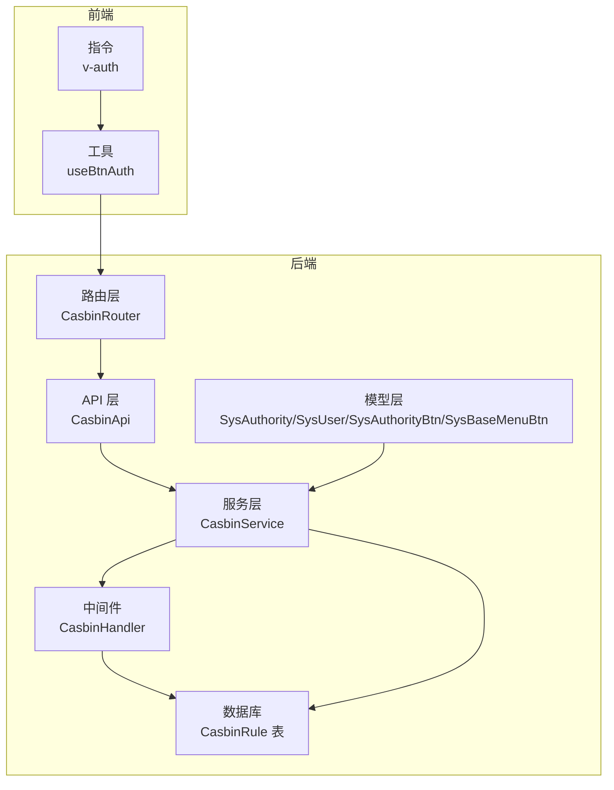
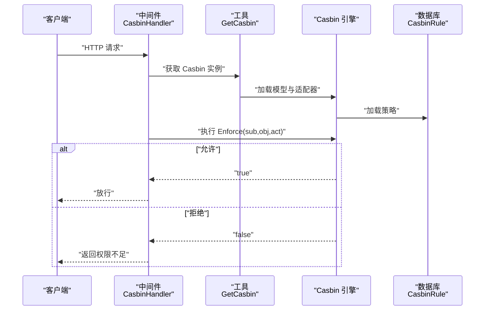
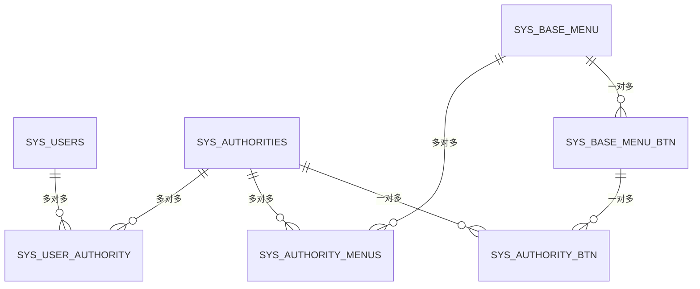
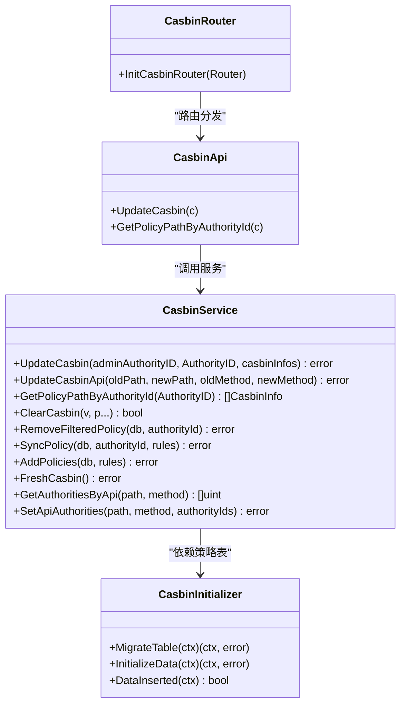
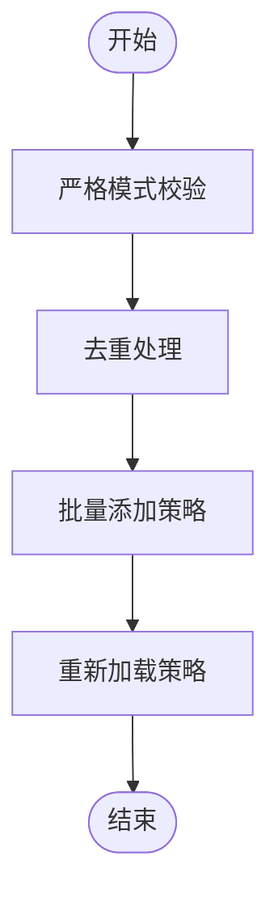
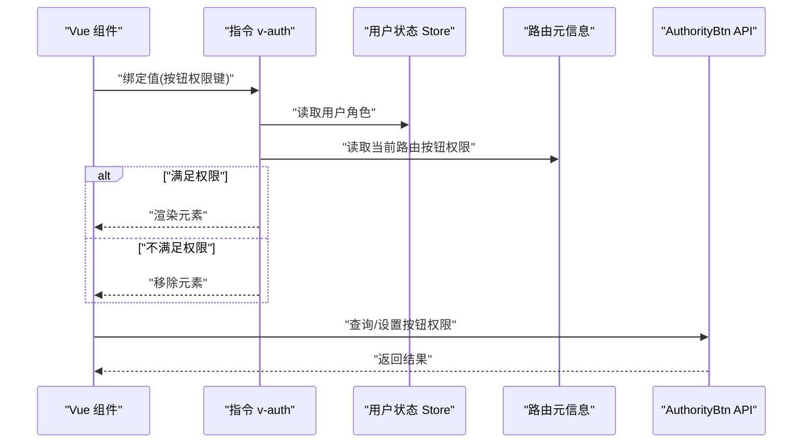
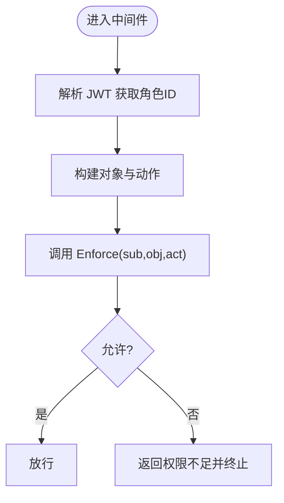
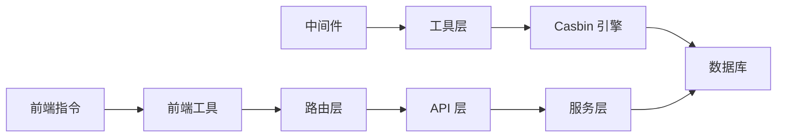

# 授权系统

<cite>
**本文引用的文件**
- [server/middleware/casbin_rbac.go](file://server/middleware/casbin_rbac.go)
- [server/utils/casbin_util.go](file://server/utils/casbin_util.go)
- [server/source/system/casbin.go](file://server/source/system/casbin.go)
- [server/service/system/sys_casbin.go](file://server/service/system/sys_casbin.go)
- [server/router/system/sys_casbin.go](file://server/router/system/sys_casbin.go)
- [server/api/v1/system/sys_casbin.go](file://server/api/v1/system/sys_casbin.go)
- [server/model/system/sys_authority.go](file://server/model/system/sys_authority.go)
- [server/model/system/sys_user.go](file://server/model/system/sys_user.go)
- [server/model/system/sys_authority_btn.go](file://server/model/system/sys_authority_btn.go)
- [server/model/system/sys_menu_btn.go](file://server/model/system/sys_menu_btn.go)
- [web/src/directive/auth.js](file://web/src/directive/auth.js)
- [web/src/utils/btnAuth.js](file://web/src/utils/btnAuth.js)
</cite>

## 目录
1. [简介](#简介)
2. [项目结构](#项目结构)
3. [核心组件](#核心组件)
4. [架构总览](#架构总览)
5. [详细组件分析](#详细组件分析)
6. [依赖分析](#依赖分析)
7. [性能考量](#性能考量)
8. [故障排查指南](#故障排查指南)
9. [结论](#结论)
10. [附录](#附录)

## 简介
本文件面向授权系统的技术文档，围绕 RBAC（基于角色的访问控制）权限模型展开，结合 Gin-Vue-Admin 的实现，系统性阐述以下内容：
- RBAC 权限模型设计：用户、角色、权限、资源的关联关系与约束
- Casbin 集成细节：权限规则定义、策略管理、权限匹配算法
- 动态权限更新机制：缓存、实时生效、批量更新策略
- 按钮级别权限控制：前端指令与后端接口校验联动
- 权限数据模型：表结构、关联关系、索引优化
- 最佳实践：权限分级、最小权限原则、权限审计
- 性能优化与常见问题

## 项目结构
授权系统在后端以中间件为核心，贯穿请求生命周期进行权限校验；策略持久化通过 Casbin GORM 适配器落地至数据库；前端通过指令与路由元信息实现按钮级权限控制。

图示来源
- [server/middleware/casbin_rbac.go:12-32](file://server/middleware/casbin_rbac.go#L12-L32)
- [server/service/system/sys_casbin.go:22-74](file://server/service/system/sys_casbin.go#L22-L74)
- [server/api/v1/system/sys_casbin.go:13-44](file://server/api/v1/system/sys_casbin.go#L13-L44)
- [server/router/system/sys_casbin.go:8-19](file://server/router/system/sys_casbin.go#L8-L19)
- [server/model/system/sys_authority.go:7-19](file://server/model/system/sys_authority.go#L7-L19)
- [server/model/system/sys_user.go:20-34](file://server/model/system/sys_user.go#L20-L34)
- [server/model/system/sys_authority_btn.go:3-8](file://server/model/system/sys_authority_btn.go#L3-L8)
- [server/model/system/sys_menu_btn.go:5-10](file://server/model/system/sys_menu_btn.go#L5-L10)
- [web/src/directive/auth.js:1-26](file://web/src/directive/auth.js#L1-L26)
- [web/src/utils/btnAuth.js:1-7](file://web/src/utils/btnAuth.js#L1-L7)

章节来源
- [server/middleware/casbin_rbac.go:12-32](file://server/middleware/casbin_rbac.go#L12-L32)
- [server/utils/casbin_util.go:18-52](file://server/utils/casbin_util.go#L18-L52)
- [server/source/system/casbin.go:21-373](file://server/source/system/casbin.go#L21-L373)
- [server/service/system/sys_casbin.go:22-216](file://server/service/system/sys_casbin.go#L22-L216)
- [server/router/system/sys_casbin.go:8-19](file://server/router/system/sys_casbin.go#L8-L19)
- [server/api/v1/system/sys_casbin.go:13-70](file://server/api/v1/system/sys_casbin.go#L13-L70)
- [server/model/system/sys_authority.go:7-24](file://server/model/system/sys_authority.go#L7-L24)
- [server/model/system/sys_user.go:20-63](file://server/model/system/sys_user.go#L20-L63)
- [server/model/system/sys_authority_btn.go:3-9](file://server/model/system/sys_authority_btn.go#L3-L9)
- [server/model/system/sys_menu_btn.go:5-11](file://server/model/system/sys_menu_btn.go#L5-L11)
- [web/src/directive/auth.js:1-26](file://web/src/directive/auth.js#L1-L26)
- [web/src/utils/btnAuth.js:1-7](file://web/src/utils/btnAuth.js#L1-L7)

## 核心组件
- 中间件拦截器：在请求进入时，从 JWT 提取角色 ID，拼接请求路径与方法，调用 Casbin 进行权限匹配，未通过则直接返回权限不足。
- Casbin 实例：使用 GORM 适配器连接数据库，内置模型字符串定义请求/策略/角色/效果/匹配器，启用缓存并设置过期时间，启动时加载策略。
- 初始化器：自动迁移 CasbinRule 表并预置多套角色的初始策略集。
- 服务层：提供更新策略、按角色获取策略、清理策略、同步策略、API 更新联动、按 API 查询角色集合等能力。
- 路由与 API：暴露更新策略与查询策略的接口，配合操作审计中间件。
- 模型层：用户与角色多对多关系、角色与菜单多对多关系、角色-菜单-按钮关联关系。
- 前端指令：v-auth 指令根据用户角色与绑定值决定按钮渲染与否，支持修饰符取反。

章节来源
- [server/middleware/casbin_rbac.go:12-32](file://server/middleware/casbin_rbac.go#L12-L32)
- [server/utils/casbin_util.go:18-52](file://server/utils/casbin_util.go#L18-L52)
- [server/source/system/casbin.go:21-373](file://server/source/system/casbin.go#L21-L373)
- [server/service/system/sys_casbin.go:22-216](file://server/service/system/sys_casbin.go#L22-L216)
- [server/router/system/sys_casbin.go:8-19](file://server/router/system/sys_casbin.go#L8-L19)
- [server/api/v1/system/sys_casbin.go:13-70](file://server/api/v1/system/sys_casbin.go#L13-L70)
- [server/model/system/sys_authority.go:7-24](file://server/model/system/sys_authority.go#L7-L24)
- [server/model/system/sys_user.go:20-63](file://server/model/system/sys_user.go#L20-L63)
- [server/model/system/sys_authority_btn.go:3-9](file://server/model/system/sys_authority_btn.go#L3-L9)
- [server/model/system/sys_menu_btn.go:5-11](file://server/model/system/sys_menu_btn.go#L5-L11)
- [web/src/directive/auth.js:1-26](file://web/src/directive/auth.js#L1-L26)

## 架构总览
下图展示了从请求到权限判定的整体流程，以及策略的持久化与刷新机制。

图示来源
- [server/middleware/casbin_rbac.go:13-31](file://server/middleware/casbin_rbac.go#L13-L31)
- [server/utils/casbin_util.go:18-52](file://server/utils/casbin_util.go#L18-L52)

## 详细组件分析

### RBAC 权限模型与数据模型
- 用户（SysUser）与角色（SysAuthority）：多对多关系，用户默认角色字段用于中间件快速判定。
- 角色与菜单（SysBaseMenu）：多对多关系，决定角色可见菜单树。
- 角色-菜单-按钮（SysAuthorityBtn/SysBaseMenuBtn）：角色对具体按钮的操作权限。
- 资源（API）：以路径+方法作为资源标识，策略表以三元组（角色ID, 资源路径, 方法）存储。

图示来源
- [server/model/system/sys_user.go:20-34](file://server/model/system/sys_user.go#L20-L34)
- [server/model/system/sys_authority.go:7-19](file://server/model/system/sys_authority.go#L7-L19)
- [server/model/system/sys_authority_btn.go:3-8](file://server/model/system/sys_authority_btn.go#L3-L8)
- [server/model/system/sys_menu_btn.go:5-10](file://server/model/system/sys_menu_btn.go#L5-L10)

章节来源
- [server/model/system/sys_user.go:20-63](file://server/model/system/sys_user.go#L20-L63)
- [server/model/system/sys_authority.go:7-24](file://server/model/system/sys_authority.go#L7-L24)
- [server/model/system/sys_authority_btn.go:3-9](file://server/model/system/sys_authority_btn.go#L3-L9)
- [server/model/system/sys_menu_btn.go:5-11](file://server/model/system/sys_menu_btn.go#L5-L11)

### Casbin 集成与策略管理
- 模型定义：请求三元组（sub,obj,act），策略三元组（p），角色关系（g），效果聚合（some(where)），匹配器采用路径前缀匹配函数。
- 实例化：GORM 适配器连接数据库，加载模型，启用缓存并设置过期时间，启动时加载策略。
- 初始化：自动迁移 CasbinRule 表并写入多套角色的初始策略集。
- 服务接口：
  - 更新策略：严格模式下校验 API 是否存在于角色已授权 API 列表，去重后批量添加策略，支持清空后新增。
  - API 更新联动：当 API 路径或方法变更时，更新策略并重新加载。
  - 获取策略：按角色查询当前策略列表。
  - 清理与同步：按条件过滤移除策略，或全量同步策略。
  - 按 API 查询角色：反向查询拥有某 API 权限的角色集合。

图示来源
- [server/service/system/sys_casbin.go:22-216](file://server/service/system/sys_casbin.go#L22-L216)
- [server/api/v1/system/sys_casbin.go:13-70](file://server/api/v1/system/sys_casbin.go#L13-L70)
- [server/router/system/sys_casbin.go:8-19](file://server/router/system/sys_casbin.go#L8-L19)
- [server/source/system/casbin.go:21-373](file://server/source/system/casbin.go#L21-L373)

章节来源
- [server/utils/casbin_util.go:18-52](file://server/utils/casbin_util.go#L18-L52)
- [server/source/system/casbin.go:21-373](file://server/source/system/casbin.go#L21-L373)
- [server/service/system/sys_casbin.go:22-216](file://server/service/system/sys_casbin.go#L22-L216)
- [server/api/v1/system/sys_casbin.go:13-70](file://server/api/v1/system/sys_casbin.go#L13-L70)
- [server/router/system/sys_casbin.go:8-19](file://server/router/system/sys_casbin.go#L8-L19)

### 动态权限更新机制
- 缓存与过期：Casbin 实例启用缓存并设置过期时间，降低频繁查询成本。
- 实时生效：提供 FreshCasbin 方法主动重新加载策略，确保变更即时生效。
- 批量更新：服务层对策略进行去重处理后批量添加；支持全量同步与按条件清理。
- API 变更联动：当 API 路径或方法变更时，服务层更新策略并重新加载，避免陈旧策略导致的误判。

图示来源
- [server/service/system/sys_casbin.go:26-74](file://server/service/system/sys_casbin.go#L26-L74)
- [server/service/system/sys_casbin.go:82-93](file://server/service/system/sys_casbin.go#L82-L93)
- [server/service/system/sys_casbin.go:169-173](file://server/service/system/sys_casbin.go#L169-L173)

章节来源
- [server/service/system/sys_casbin.go:26-74](file://server/service/system/sys_casbin.go#L26-L74)
- [server/service/system/sys_casbin.go:82-93](file://server/service/system/sys_casbin.go#L82-L93)
- [server/service/system/sys_casbin.go:169-173](file://server/service/system/sys_casbin.go#L169-L173)

### 按钮级别的权限控制
- 前端指令 v-auth：在挂载阶段读取用户信息与绑定值，根据角色 ID 判断是否渲染元素；支持修饰符取反。
- 路由元信息：路由 meta 中可携带按钮权限键集合，前端工具 useBtnAuth 读取当前路由的按钮权限映射。
- 后端接口：AuthorityBtn API 提供查询与设置按钮权限的能力，配合角色与菜单按钮关联模型实现细粒度控制。

图示来源
- [web/src/directive/auth.js:4-24](file://web/src/directive/auth.js#L4-L24)
- [web/src/utils/btnAuth.js:3-6](file://web/src/utils/btnAuth.js#L3-L6)
- [server/api/v1/system/sys_authority_btn.go:11-81](file://server/api/v1/system/sys_authority_btn.go#L11-L81)
- [server/model/system/sys_authority_btn.go:3-8](file://server/model/system/sys_authority_btn.go#L3-L8)
- [server/model/system/sys_menu_btn.go:5-10](file://server/model/system/sys_menu_btn.go#L5-L10)

章节来源
- [web/src/directive/auth.js:1-26](file://web/src/directive/auth.js#L1-L26)
- [web/src/utils/btnAuth.js:1-7](file://web/src/utils/btnAuth.js#L1-L7)
- [server/api/v1/system/sys_authority_btn.go:11-81](file://server/api/v1/system/sys_authority_btn.go#L11-L81)
- [server/model/system/sys_authority_btn.go:3-9](file://server/model/system/sys_authority_btn.go#L3-L9)
- [server/model/system/sys_menu_btn.go:5-11](file://server/model/system/sys_menu_btn.go#L5-L11)

### 权限匹配算法与中间件流程
- 中间件从 JWT 提取角色 ID，拼接请求路径（去除路由前缀）与方法，调用 Casbin 的 Enforce 进行匹配。
- 匹配器使用路径前缀匹配函数，支持灵活的资源路径表达。
- 未通过匹配时立即中断请求并返回错误响应。

图示来源
- [server/middleware/casbin_rbac.go:13-31](file://server/middleware/casbin_rbac.go#L13-L31)

章节来源
- [server/middleware/casbin_rbac.go:12-32](file://server/middleware/casbin_rbac.go#L12-L32)

## 依赖分析
- 中间件依赖工具层获取 Casbin 实例，工具层负责实例化与缓存。
- 服务层依赖数据库适配器与全局配置，提供策略 CRUD 与联动更新。
- 路由与 API 层负责接口暴露与参数校验。
- 模型层承载用户、角色、菜单、按钮的多对多关系。
- 前端指令与工具依赖用户状态与路由元信息。

图示来源
- [server/middleware/casbin_rbac.go:13-31](file://server/middleware/casbin_rbac.go#L13-L31)
- [server/utils/casbin_util.go:18-52](file://server/utils/casbin_util.go#L18-L52)
- [server/service/system/sys_casbin.go:22-216](file://server/service/system/sys_casbin.go#L22-L216)
- [server/api/v1/system/sys_casbin.go:13-70](file://server/api/v1/system/sys_casbin.go#L13-L70)
- [server/router/system/sys_casbin.go:8-19](file://server/router/system/sys_casbin.go#L8-L19)
- [web/src/directive/auth.js:1-26](file://web/src/directive/auth.js#L1-L26)
- [web/src/utils/btnAuth.js:1-7](file://web/src/utils/btnAuth.js#L1-L7)

章节来源
- [server/middleware/casbin_rbac.go:12-32](file://server/middleware/casbin_rbac.go#L12-L32)
- [server/utils/casbin_util.go:18-52](file://server/utils/casbin_util.go#L18-L52)
- [server/service/system/sys_casbin.go:22-216](file://server/service/system/sys_casbin.go#L22-L216)
- [server/api/v1/system/sys_casbin.go:13-70](file://server/api/v1/system/sys_casbin.go#L13-L70)
- [server/router/system/sys_casbin.go:8-19](file://server/router/system/sys_casbin.go#L8-L19)
- [web/src/directive/auth.js:1-26](file://web/src/directive/auth.js#L1-L26)
- [web/src/utils/btnAuth.js:1-7](file://web/src/utils/btnAuth.js#L1-L7)

## 性能考量
- 缓存命中：Casbin 启用缓存并设置过期时间，减少重复加载策略的成本。
- 批量操作：策略更新采用去重后的批量添加，避免重复策略带来的匹配开销。
- 路由前缀剥离：中间件在匹配前剥离路由前缀，减少无关字符影响匹配效率。
- 索引优化：用户表与角色表在关键字段建立索引，有助于 JWT 解析与权限查询。
- 策略精简：仅保留必要的 API 策略，避免冗余规则导致的匹配复杂度上升。

## 故障排查指南
- 权限不足错误：确认中间件是否正确提取角色 ID 并传入 Enforce；检查策略表中是否存在对应角色-资源-方法的策略。
- 策略未生效：调用 FreshCasbin 或重启服务以强制重新加载策略；检查缓存过期时间是否过短。
- API 变更后权限异常：调用 API 更新联动方法，确保策略表中的路径与方法同步更新。
- 严格模式报错：确认待更新的 API 是否在管理员角色的已授权 API 列表中。
- 前端按钮不显示：检查 v-auth 指令绑定值与用户角色 ID 是否一致；确认路由 meta 中的按钮权限键是否正确。

章节来源
- [server/middleware/casbin_rbac.go:12-32](file://server/middleware/casbin_rbac.go#L12-L32)
- [server/service/system/sys_casbin.go:26-74](file://server/service/system/sys_casbin.go#L26-L74)
- [server/service/system/sys_casbin.go:82-93](file://server/service/system/sys_casbin.go#L82-L93)
- [server/service/system/sys_casbin.go:169-173](file://server/service/system/sys_casbin.go#L169-L173)
- [web/src/directive/auth.js:1-26](file://web/src/directive/auth.js#L1-L26)

## 结论
本授权系统以 RBAC 为核心，结合 Casbin 的强大策略引擎与 GORM 适配器，实现了灵活且高效的权限控制。后端中间件统一拦截校验，前端指令与路由元信息实现按钮级精细化控制。通过缓存、批量更新与严格模式等机制，兼顾了易用性与性能。建议在生产环境中遵循最小权限原则与权限审计规范，持续优化策略与索引，保障系统的安全性与稳定性。

## 附录
- 最佳实践
  - 权限分级：为不同职责划分角色，避免超级权限集中。
  - 最小权限：仅授予完成任务所需的最小权限集合。
  - 权限审计：记录权限变更与访问日志，定期审查。
  - 策略维护：统一入口管理策略，避免分散配置。
  - 前端协同：前后端联动，确保界面与接口权限一致。