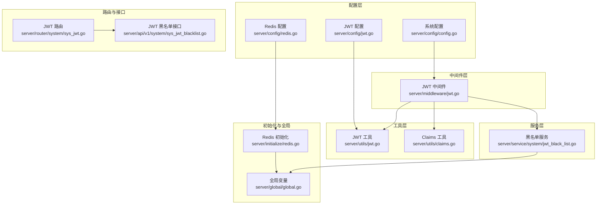
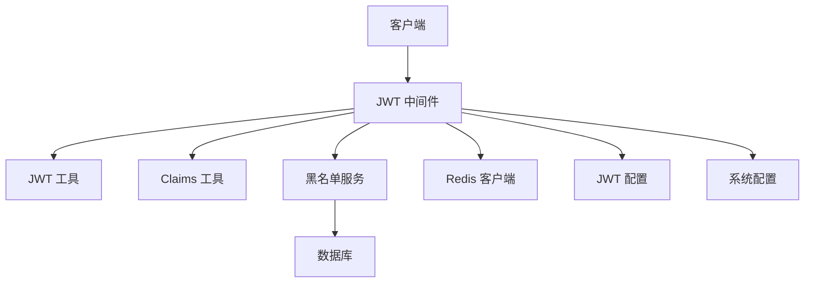
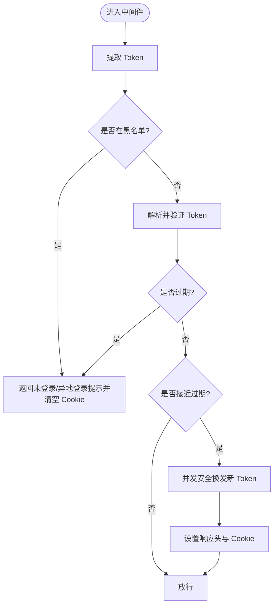
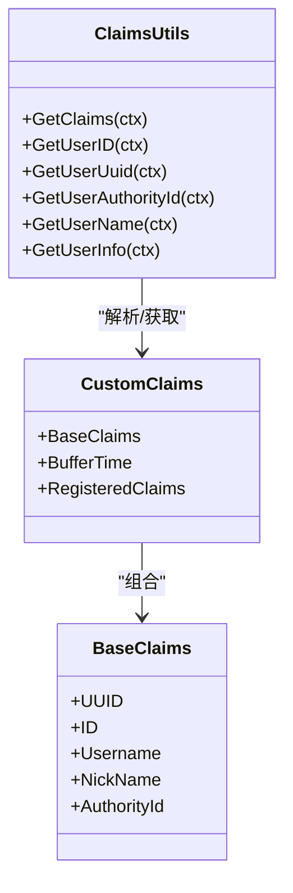
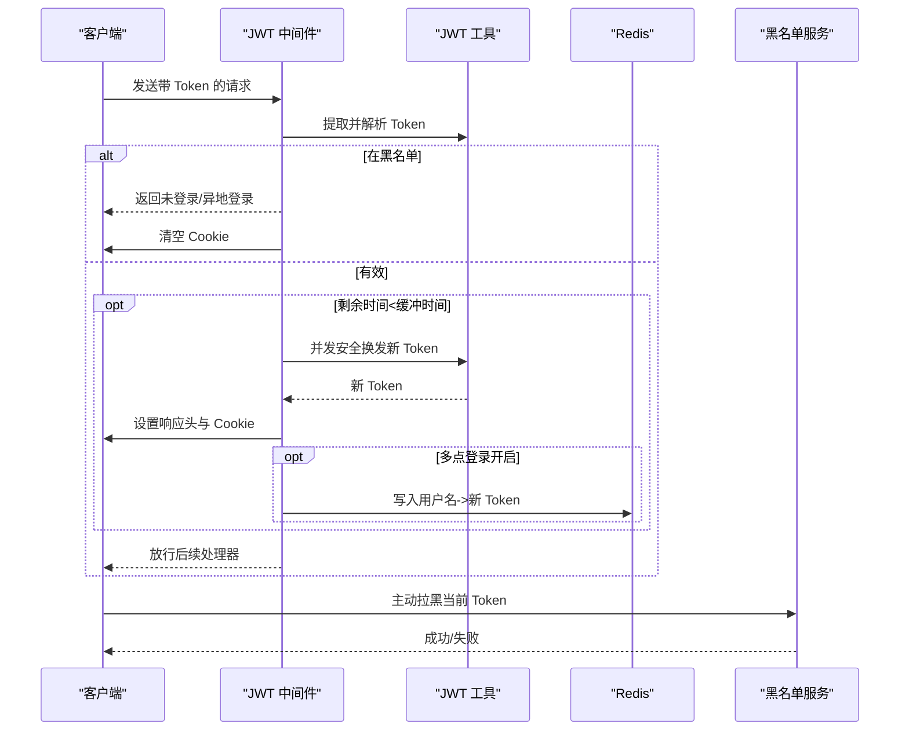
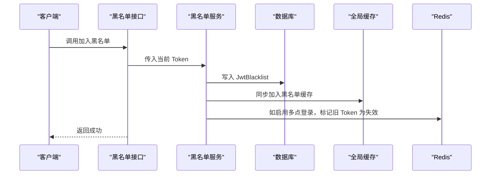
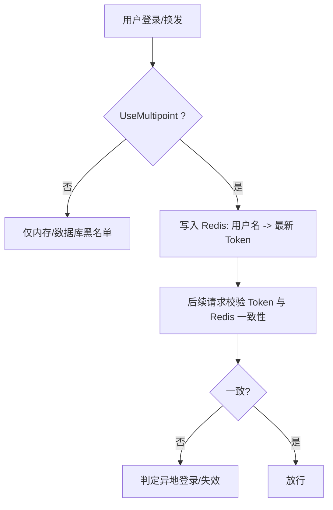
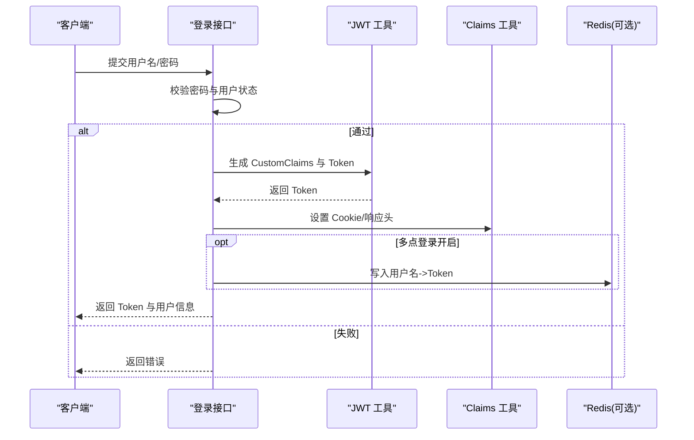
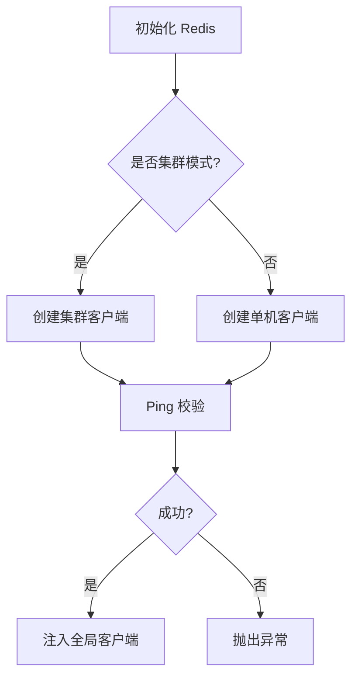
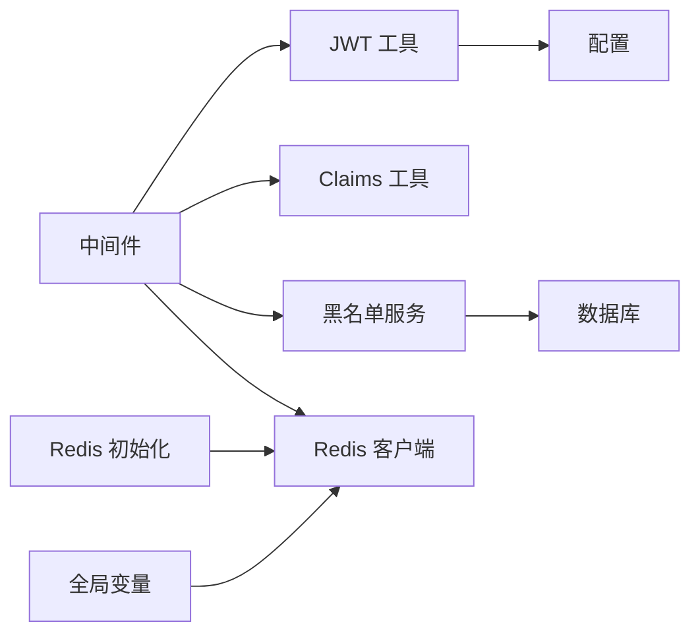

# 认证系统

<cite>
**本文引用的文件**
- [server/config/jwt.go](file://server/config/jwt.go)
- [server/config/config.go](file://server/config/config.go)
- [server/config/redis.go](file://server/config/redis.go)
- [server/middleware/jwt.go](file://server/middleware/jwt.go)
- [server/utils/jwt.go](file://server/utils/jwt.go)
- [server/utils/claims.go](file://server/utils/claims.go)
- [server/model/system/request/jwt.go](file://server/model/system/request/jwt.go)
- [server/model/system/sys_jwt_blacklist.go](file://server/model/system/sys_jwt_blacklist.go)
- [server/service/system/jwt_black_list.go](file://server/service/system/jwt_black_list.go)
- [server/router/system/sys_jwt.go](file://server/router/system/sys_jwt.go)
- [server/api/v1/system/sys_jwt_blacklist.go](file://server/api/v1/system/sys_jwt_blacklist.go)
- [server/initialize/redis.go](file://server/initialize/redis.go)
- [server/global/global.go](file://server/global/global.go)
- [server/model/system/sys_user.go](file://server/model/system/sys_user.go)
</cite>

## 目录
1. [简介](#简介)
2. [项目结构](#项目结构)
3. [核心组件](#核心组件)
4. [架构总览](#架构总览)
5. [详细组件分析](#详细组件分析)
6. [依赖分析](#依赖分析)
7. [性能考量](#性能考量)
8. [故障排查指南](#故障排查指南)
9. [结论](#结论)
10. [附录](#附录)

## 简介
本文件面向 Gin-Vue-Admin 项目的认证系统，围绕基于 JWT 的认证机制进行深入技术说明，涵盖以下主题：
- JWT 令牌的生成、解析与验证流程
- Token 生命周期管理：过期时间、自动刷新、黑名单机制
- 多点登录控制：Redis 令牌存储、并发登录限制、异地登录检测
- 认证中间件工作原理：请求拦截、Token 提取、Claims 解析、错误处理
- 用户登录流程：密码验证、用户状态检查、Token 返回机制
- 认证配置最佳实践：安全密钥管理、Token 加密、防重放攻击等

## 项目结构
认证系统主要分布在以下模块：
- 配置层：JWT 参数、Redis 连接、系统开关（多点登录）
- 中间件层：JWT 认证中间件，负责拦截请求、提取 Token、校验与刷新
- 工具层：JWT 实现、Claims 结构、Token Cookie 设置与读取
- 服务层：黑名单服务、Redis 令牌存储
- 路由与接口：黑名单接口
- 全局与初始化：Redis 初始化、全局变量、并发控制

图表来源
- [server/config/jwt.go:1-9](file://server/config/jwt.go#L1-L9)
- [server/config/config.go:1-41](file://server/config/config.go#L1-L41)
- [server/config/redis.go:1-11](file://server/config/redis.go#L1-L11)
- [server/middleware/jwt.go:1-90](file://server/middleware/jwt.go#L1-L90)
- [server/utils/jwt.go:1-106](file://server/utils/jwt.go#L1-L106)
- [server/utils/claims.go:1-149](file://server/utils/claims.go#L1-L149)
- [server/service/system/jwt_black_list.go:1-53](file://server/service/system/jwt_black_list.go#L1-L53)
- [server/router/system/sys_jwt.go:1-15](file://server/router/system/sys_jwt.go#L1-L15)
- [server/api/v1/system/sys_jwt_blacklist.go:1-34](file://server/api/v1/system/sys_jwt_blacklist.go#L1-L34)
- [server/initialize/redis.go:1-60](file://server/initialize/redis.go#L1-L60)
- [server/global/global.go:1-69](file://server/global/global.go#L1-L69)

章节来源
- [server/config/jwt.go:1-9](file://server/config/jwt.go#L1-L9)
- [server/config/config.go:1-41](file://server/config/config.go#L1-L41)
- [server/config/redis.go:1-11](file://server/config/redis.go#L1-L11)
- [server/middleware/jwt.go:1-90](file://server/middleware/jwt.go#L1-L90)
- [server/utils/jwt.go:1-106](file://server/utils/jwt.go#L1-L106)
- [server/utils/claims.go:1-149](file://server/utils/claims.go#L1-L149)
- [server/service/system/jwt_black_list.go:1-53](file://server/service/system/jwt_black_list.go#L1-L53)
- [server/router/system/sys_jwt.go:1-15](file://server/router/system/sys_jwt.go#L1-L15)
- [server/api/v1/system/sys_jwt_blacklist.go:1-34](file://server/api/v1/system/sys_jwt_blacklist.go#L1-L34)
- [server/initialize/redis.go:1-60](file://server/initialize/redis.go#L1-L60)
- [server/global/global.go:1-69](file://server/global/global.go#L1-L69)

## 核心组件
- JWT 配置：签名密钥、过期时间、缓冲时间、签发者
- JWT 工具：Claims 构造、Token 生成、解析、并发安全换发
- Claims 工具：Token 提取、Cookie 设置与读取、用户信息获取
- 中间件：请求拦截、Token 校验、黑名单检查、自动刷新、多点登录记录
- 黑名单服务：拉黑 Token、从 Redis 读取、加载数据库黑名单至缓存
- Redis 初始化：单机/集群模式连接、Ping 校验、全局客户端
- 全局变量：DB、Redis、Viper、日志、并发控制、黑名单缓存

章节来源
- [server/config/jwt.go:1-9](file://server/config/jwt.go#L1-L9)
- [server/utils/jwt.go:1-106](file://server/utils/jwt.go#L1-L106)
- [server/utils/claims.go:1-149](file://server/utils/claims.go#L1-L149)
- [server/middleware/jwt.go:1-90](file://server/middleware/jwt.go#L1-L90)
- [server/service/system/jwt_black_list.go:1-53](file://server/service/system/jwt_black_list.go#L1-L53)
- [server/initialize/redis.go:1-60](file://server/initialize/redis.go#L1-L60)
- [server/global/global.go:1-69](file://server/global/global.go#L1-L69)

## 架构总览
认证系统采用“配置驱动 + 中间件拦截 + 工具层处理 + 服务层持久化”的分层设计。JWT 配置决定签名算法、过期与缓冲策略；中间件统一拦截请求，完成 Token 提取、解析、校验、刷新与多点登录控制；工具层封装 JWT 生成与解析、Claims 读取与 Cookie 管理；黑名单服务负责 Token 拉黑与 Redis 存储；Redis 初始化提供高可用的外部存储。

图表来源
- [server/middleware/jwt.go:1-90](file://server/middleware/jwt.go#L1-L90)
- [server/utils/jwt.go:1-106](file://server/utils/jwt.go#L1-L106)
- [server/utils/claims.go:1-149](file://server/utils/claims.go#L1-L149)
- [server/service/system/jwt_black_list.go:1-53](file://server/service/system/jwt_black_list.go#L1-L53)
- [server/initialize/redis.go:1-60](file://server/initialize/redis.go#L1-L60)
- [server/config/jwt.go:1-9](file://server/config/jwt.go#L1-L9)
- [server/config/config.go:1-41](file://server/config/config.go#L1-L41)

## 详细组件分析

### JWT 配置与生命周期
- 配置项
  - 签名密钥：用于 HS256 签名
  - 过期时间：Token 总有效期
  - 缓冲时间：临近过期触发自动刷新的时间阈值
  - 签发者：发行者标识
- 生命周期管理
  - 生成：构造 CustomClaims（含 Audience、NotBefore、ExpiresAt、Issuer），使用 HS256 签名生成 Token
  - 解析：验证签名与声明，区分过期、格式错误、签名无效等异常
  - 刷新：当剩余有效期小于缓冲时间时，使用并发安全的换发机制生成新 Token，并更新响应头与 Cookie

图表来源
- [server/middleware/jwt.go:16-77](file://server/middleware/jwt.go#L16-L77)
- [server/utils/jwt.go:48-88](file://server/utils/jwt.go#L48-L88)
- [server/utils/claims.go:42-65](file://server/utils/claims.go#L42-L65)

章节来源
- [server/config/jwt.go:1-9](file://server/config/jwt.go#L1-L9)
- [server/utils/jwt.go:32-88](file://server/utils/jwt.go#L32-L88)
- [server/middleware/jwt.go:16-77](file://server/middleware/jwt.go#L16-L77)
- [server/utils/claims.go:42-65](file://server/utils/claims.go#L42-L65)

### Claims 数据模型与用户信息提取
- Claims 结构
  - BaseClaims：用户基础信息（UUID、ID、用户名、昵称、角色 ID）
  - RegisteredClaims：标准 JWT 声明（Audience、NotBefore、ExpiresAt、Issuer）
  - BufferTime：缓冲时间（秒）
- 用户信息提取
  - 从上下文获取 Claims，支持直接从中间件注入或动态解析
  - 提供便捷函数：获取用户 ID、UUID、角色 ID、用户名、完整用户信息

图表来源
- [server/model/system/request/jwt.go:8-22](file://server/model/system/request/jwt.go#L8-L22)
- [server/utils/claims.go:57-149](file://server/utils/claims.go#L57-L149)

章节来源
- [server/model/system/request/jwt.go:8-22](file://server/model/system/request/jwt.go#L8-L22)
- [server/utils/claims.go:57-149](file://server/utils/claims.go#L57-L149)

### 认证中间件工作原理
- 请求拦截
  - 从请求头或 Cookie 提取 Token
  - 若缺失或为空，返回未登录提示并终止
- Token 校验
  - 黑名单检查：若命中黑名单，返回异地登录/失效提示并清空 Cookie
  - 解析并验证：区分过期、格式错误、签名无效等错误类型
- 自动刷新
  - 当剩余有效期小于缓冲时间，使用并发安全换发生成新 Token
  - 更新响应头 new-token 与 new-expires-at，并同步 Cookie
- 多点登录控制
  - 若启用 UseMultipoint，则将新 Token 与用户名写入 Redis，作为“当前活跃 Token”
  - 下次请求可结合 Redis 中的最新 Token 进行一致性校验

图表来源
- [server/middleware/jwt.go:16-77](file://server/middleware/jwt.go#L16-L77)
- [server/utils/jwt.go:54-60](file://server/utils/jwt.go#L54-L60)
- [server/service/system/jwt_black_list.go:22-29](file://server/service/system/jwt_black_list.go#L22-L29)
- [server/utils/jwt.go:96-105](file://server/utils/jwt.go#L96-L105)

章节来源
- [server/middleware/jwt.go:16-77](file://server/middleware/jwt.go#L16-L77)
- [server/utils/jwt.go:54-60](file://server/utils/jwt.go#L54-L60)
- [server/service/system/jwt_black_list.go:22-29](file://server/service/system/jwt_black_list.go#L22-L29)
- [server/utils/jwt.go:96-105](file://server/utils/jwt.go#L96-L105)

### 黑名单机制与异地登录检测
- 黑名单存储
  - 数据库存储：JwtBlacklist 表，字段为 jwt 文本
  - 内存缓存：启动时将数据库黑名单加载到本地缓存，加速命中
- 黑名单接口
  - 提供将当前 Token 加入黑名单的接口，成功后清空 Cookie
- 异地登录检测
  - 中间件在每次请求检查 Token 是否在黑名单
  - 多点登录开启时，Redis 中仅保留最新 Token，旧 Token 将被拉黑

图表来源
- [server/api/v1/system/sys_jwt_blacklist.go:22-33](file://server/api/v1/system/sys_jwt_blacklist.go#L22-L33)
- [server/service/system/jwt_black_list.go:22-29](file://server/service/system/jwt_black_list.go#L22-L29)
- [server/service/system/jwt_black_list.go:42-52](file://server/service/system/jwt_black_list.go#L42-L52)
- [server/model/system/sys_jwt_blacklist.go:7-11](file://server/model/system/sys_jwt_blacklist.go#L7-L11)

章节来源
- [server/api/v1/system/sys_jwt_blacklist.go:22-33](file://server/api/v1/system/sys_jwt_blacklist.go#L22-L33)
- [server/service/system/jwt_black_list.go:22-29](file://server/service/system/jwt_black_list.go#L22-L29)
- [server/service/system/jwt_black_list.go:42-52](file://server/service/system/jwt_black_list.go#L42-L52)
- [server/model/system/sys_jwt_blacklist.go:7-11](file://server/model/system/sys_jwt_blacklist.go#L7-L11)

### 多点登录控制与并发限制
- 多点登录开关：系统配置 UseMultipoint 控制是否启用
- Redis 存储：以用户名为键，存储当前活跃 Token，过期时间与 JWT 一致
- 并发换发：使用 singleflight 避免同一 Token 并发换发导致的重复与竞争
- 异地登录检测：若 Redis 中的 Token 与请求不一致，视为异地登录

图表来源
- [server/config/config.go:9](file://server/config/config.go#L9)
- [server/middleware/jwt.go:64-67](file://server/middleware/jwt.go#L64-L67)
- [server/utils/jwt.go:96-105](file://server/utils/jwt.go#L96-L105)
- [server/global/global.go:36](file://server/global/global.go#L36)

章节来源
- [server/config/config.go:9](file://server/config/config.go#L9)
- [server/middleware/jwt.go:64-67](file://server/middleware/jwt.go#L64-L67)
- [server/utils/jwt.go:96-105](file://server/utils/jwt.go#L96-L105)
- [server/global/global.go:36](file://server/global/global.go#L36)

### 用户登录流程与 Token 返回机制
- 登录流程要点
  - 密码验证与用户状态检查（冻结/禁用等）由上层业务逻辑完成
  - 登录成功后，使用 JWT 工具生成 CustomClaims 与 Token
  - 通过 Cookie 或响应头返回 Token，并设置过期时间
- Token 返回
  - 中间件在解析 Token 后，若缺失 Cookie 会自动补写，确保前后端一致

图表来源
- [server/utils/claims.go:137-149](file://server/utils/claims.go#L137-L149)
- [server/utils/jwt.go:32-52](file://server/utils/jwt.go#L32-L52)
- [server/utils/claims.go:28-40](file://server/utils/claims.go#L28-L40)
- [server/utils/jwt.go:96-105](file://server/utils/jwt.go#L96-L105)

章节来源
- [server/utils/claims.go:137-149](file://server/utils/claims.go#L137-L149)
- [server/utils/jwt.go:32-52](file://server/utils/jwt.go#L32-L52)
- [server/utils/claims.go:28-40](file://server/utils/claims.go#L28-L40)
- [server/utils/jwt.go:96-105](file://server/utils/jwt.go#L96-L105)

### Redis 初始化与连接模式
- 支持单机与集群两种模式
- 初始化时执行 Ping 校验，失败则抛出异常
- 将 Redis 客户端注入全局变量，供中间件与服务层使用

图表来源
- [server/initialize/redis.go:13-37](file://server/initialize/redis.go#L13-L37)
- [server/initialize/redis.go:47-59](file://server/initialize/redis.go#L47-L59)
- [server/global/global.go:28-29](file://server/global/global.go#L28-L29)

章节来源
- [server/initialize/redis.go:13-37](file://server/initialize/redis.go#L13-L37)
- [server/initialize/redis.go:47-59](file://server/initialize/redis.go#L47-L59)
- [server/global/global.go:28-29](file://server/global/global.go#L28-L29)

## 依赖分析
- 组件耦合
  - 中间件依赖 JWT 工具、Claims 工具、黑名单服务、Redis 客户端
  - JWT 工具依赖配置与并发控制组
  - 黑名单服务依赖数据库与全局缓存
  - 初始化模块负责 Redis 客户端注入
- 外部依赖
  - golang-jwt/jwt/v5：JWT 生成与解析
  - redis/go-redis/v9：Redis 客户端
  - viper：配置读取
  - zap：日志
- 循环依赖
  - 未发现循环导入；各层职责清晰，通过全局变量与服务接口解耦

图表来源
- [server/middleware/jwt.go:1-90](file://server/middleware/jwt.go#L1-L90)
- [server/utils/jwt.go:1-106](file://server/utils/jwt.go#L1-L106)
- [server/utils/claims.go:1-149](file://server/utils/claims.go#L1-L149)
- [server/service/system/jwt_black_list.go:1-53](file://server/service/system/jwt_black_list.go#L1-L53)
- [server/initialize/redis.go:1-60](file://server/initialize/redis.go#L1-L60)
- [server/global/global.go:1-69](file://server/global/global.go#L1-L69)

章节来源
- [server/middleware/jwt.go:1-90](file://server/middleware/jwt.go#L1-L90)
- [server/utils/jwt.go:1-106](file://server/utils/jwt.go#L1-L106)
- [server/utils/claims.go:1-149](file://server/utils/claims.go#L1-L149)
- [server/service/system/jwt_black_list.go:1-53](file://server/service/system/jwt_black_list.go#L1-L53)
- [server/initialize/redis.go:1-60](file://server/initialize/redis.go#L1-L60)
- [server/global/global.go:1-69](file://server/global/global.go#L1-L69)

## 性能考量
- 并发换发
  - 使用 singleflight.Group 对同一 Token 的换发请求进行合并，避免重复计算与竞态
- 黑名单缓存
  - 启动时将数据库黑名单加载到本地缓存，减少频繁查询数据库
- Redis 存储
  - Token 过期时间与 JWT 保持一致，便于清理与一致性校验
- 中间件路径
  - 优先从 Header 获取 Token，缺失时再尝试 Cookie，减少解析成本

章节来源
- [server/utils/jwt.go:54-60](file://server/utils/jwt.go#L54-L60)
- [server/service/system/jwt_black_list.go:42-52](file://server/service/system/jwt_black_list.go#L42-L52)
- [server/utils/jwt.go:96-105](file://server/utils/jwt.go#L96-L105)
- [server/middleware/jwt.go:16-24](file://server/middleware/jwt.go#L16-L24)

## 故障排查指南
- 常见错误与处理
  - 未登录/非法访问：中间件未检测到 Token，返回提示并终止
  - 登录已过期：解析返回过期错误，清除 Cookie 并提示重新登录
  - 无效签名/格式错误：返回具体错误信息，清除 Cookie
  - 异地登录/令牌失效：命中黑名单，清除 Cookie 并提示异地登录
- 排查步骤
  - 检查请求头或 Cookie 是否携带 Token
  - 核对签名密钥与过期时间配置
  - 确认黑名单接口是否正确将 Token 加入黑名单
  - 检查 Redis 连接与键空间（用户名->Token）是否正确
  - 查看日志输出定位具体错误类型

章节来源
- [server/middleware/jwt.go:16-77](file://server/middleware/jwt.go#L16-L77)
- [server/utils/jwt.go:63-88](file://server/utils/jwt.go#L63-L88)
- [server/api/v1/system/sys_jwt_blacklist.go:22-33](file://server/api/v1/system/sys_jwt_blacklist.go#L22-L33)
- [server/initialize/redis.go:29-36](file://server/initialize/redis.go#L29-L36)

## 结论
本认证系统以 JWT 为核心，结合中间件拦截、并发安全换发、黑名单与 Redis 多点登录控制，形成完整的 Token 生命周期管理体系。通过配置驱动与清晰的分层设计，系统具备良好的扩展性与安全性。建议在生产环境中严格管理签名密钥、启用 HTTPS、合理设置过期与缓冲时间，并结合业务需求选择是否启用多点登录与异地登录检测。

## 附录

### 认证配置最佳实践
- 安全密钥管理
  - 使用强随机密钥，定期轮换；避免硬编码，通过环境变量或密钥管理服务注入
- Token 加密与传输
  - 仅通过 HTTPS 传输；避免明文存储；必要时启用 HttpOnly Cookie
- 防重放攻击
  - 合理设置过期时间与缓冲时间；启用黑名单与异地登录检测
  - 使用一次性 Token 或引入 nonce/jti 等机制（需扩展）
- 多点登录策略
  - 启用 Redis 存储当前活跃 Token，确保一致性
  - 对高频换发场景启用并发控制，避免资源浪费

章节来源
- [server/config/jwt.go:1-9](file://server/config/jwt.go#L1-L9)
- [server/config/config.go:9](file://server/config/config.go#L9)
- [server/utils/jwt.go:54-60](file://server/utils/jwt.go#L54-L60)
- [server/utils/jwt.go:96-105](file://server/utils/jwt.go#L96-L105)
- [server/middleware/jwt.go:64-67](file://server/middleware/jwt.go#L64-L67)