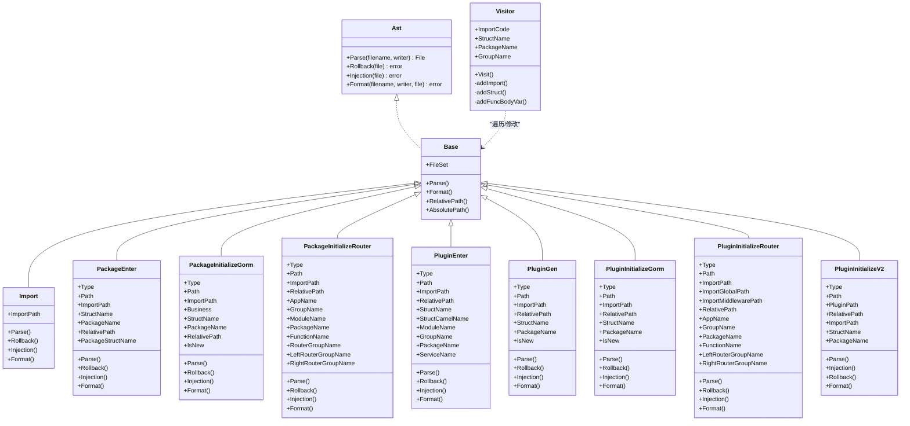
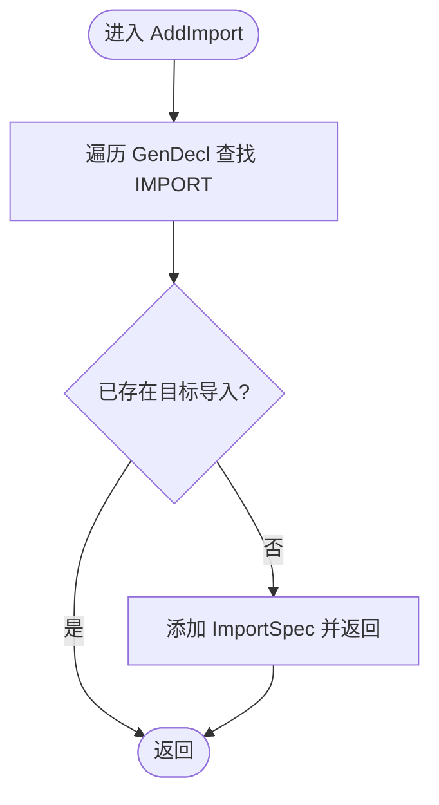
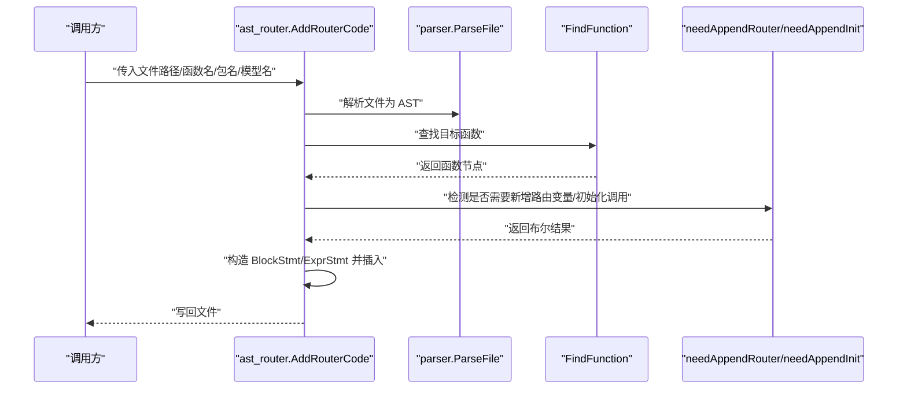
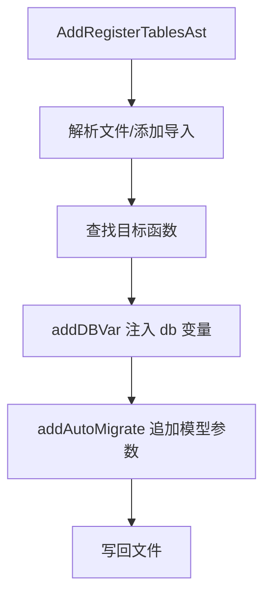
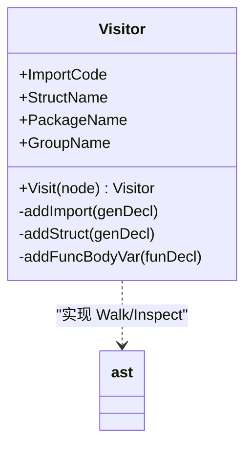
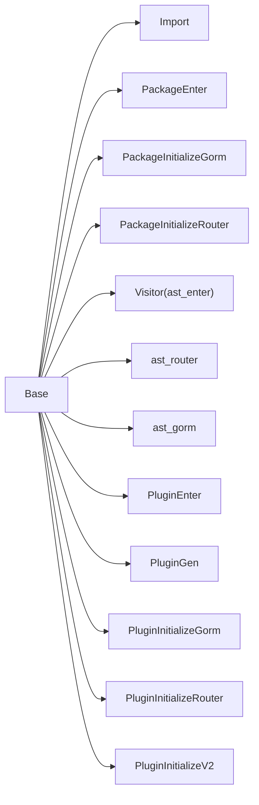

# AST 抽象语法树工具

<cite>
**本文档引用的文件**
- [ast.go](file://server/utils/ast/ast.go)
- [ast_router.go](file://server/utils/ast/ast_router.go)
- [ast_gorm.go](file://server/utils/ast/ast_gorm.go)
- [ast_enter.go](file://server/utils/ast/ast_enter.go)
- [interfaces.go](file://server/utils/ast/interfaces.go)
- [interfaces_base.go](file://server/utils/ast/interfaces_base.go)
- [import.go](file://server/utils/ast/import.go)
- [extract_func.go](file://server/utils/ast/extract_func.go)
- [ast_type.go](file://server/utils/ast/ast_type.go)
- [package_enter.go](file://server/utils/ast/package_enter.go)
- [package_initialize_gorm.go](file://server/utils/ast/package_initialize_gorm.go)
- [package_initialize_router.go](file://server/utils/ast/package_initialize_router.go)
- [plugin_enter.go](file://server/utils/ast/plugin_enter.go)
- [plugin_gen.go](file://server/utils/ast/plugin_gen.go)
- [plugin_initialize_gorm.go](file://server/utils/ast/plugin_initialize_gorm.go)
- [plugin_initialize_router.go](file://server/utils/ast/plugin_initialize_router.go)
- [plugin_initialize_v2.go](file://server/utils/ast/plugin_initialize_v2.go)
</cite>

## 目录
1. [简介](#简介)
2. [项目结构](#项目结构)
3. [核心组件](#核心组件)
4. [架构总览](#架构总览)
5. [详细组件分析](#详细组件分析)
6. [依赖分析](#依赖分析)
7. [性能考虑](#性能考虑)
8. [故障排查指南](#故障排查指南)
9. [结论](#结论)
10. [附录](#附录)

## 简介
本文件系统性梳理 Gin-Vue-Admin 项目中的 AST 抽象语法树工具体系，覆盖代码解析、语法分析、节点遍历、代码修改等核心技术；详解路由分析、GORM 注解处理、入口文件处理等关键模块；阐述在代码生成场景中的应用（自动导入、接口提取、类型推断、代码重构）；给出节点操作（查找、替换、插入、删除）方法；提供扩展指南（自定义分析器、新节点类型处理、与其他工具集成）及调试与性能优化建议。

## 项目结构
AST 工具位于后端 server/utils/ast 目录下，采用“按职责分层 + 多种 AST 操作器”的组织方式：
- 基础能力层：解析、格式化、路径转换、通用工具
- 通用 AST 操作层：导入管理、函数/数组查找、结构体构造、表达式构造
- 场景化操作层：包入口注入、包初始化（GORM/Router）、插件入口与初始化、插件生成
- 接口抽象层：统一的 AST 操作接口，便于扩展与复用

```mermaid
graph TB
subgraph "基础能力层"
Base["Base<br/>解析/格式化/路径转换"]
Types["Type<br/>类型枚举"]
end
subgraph "通用操作层"
ImportOp["Import<br/>导入增删"]
Utils["ast.go<br/>函数/数组查找/结构体构造/表达式构造"]
Extract["extract_func.go<br/>按行提取函数源码"]
end
subgraph "场景化操作层"
PEnter["package_enter.go<br/>包入口注入"]
PGorm["package_initialize_gorm.go<br/>包初始化GORM"]
PRouter["package_initialize_router.go<br/>包初始化Router"]
PE["ast_enter.go<br/>入口文件注入"]
PR["ast_router.go<br/>路由追加"]
PG["ast_gorm.go<br/>GORM迁移追加"]
PluginEnter["plugin_enter.go<br/>插件入口注入"]
PluginGen["plugin_gen.go<br/>插件生成注入"]
PluginIGorm["plugin_initialize_gorm.go<br/>插件初始化GORM"]
PluginIRouter["plugin_initialize_router.go<br/>插件初始化Router"]
PluginIV2["plugin_initialize_v2.go<br/>插件初始化v2"]
end
Base --> ImportOp
Base --> Utils
Base --> PEnter
Base --> PGorm
Base --> PRouter
Base --> PE
Base --> PR
Base --> PG
Base --> PluginEnter
Base --> PluginGen
Base --> PluginIGorm
Base --> PluginIRouter
Base --> PluginIV2
Types --> PEnter
Types --> PGorm
Types --> PRouter
Types --> PluginEnter
Types --> PluginGen
Types --> PluginIGorm
Types --> PluginIRouter
Types --> PluginIV2
```

图表来源
- [interfaces_base.go:17-82](file://server/utils/ast/interfaces_base.go#L17-L82)
- [ast_type.go:34-54](file://server/utils/ast/ast_type.go#L34-L54)
- [import.go:10-95](file://server/utils/ast/import.go#L10-L95)
- [ast.go:12-410](file://server/utils/ast/ast.go#L12-L410)
- [extract_func.go:11-62](file://server/utils/ast/extract_func.go#L11-L62)
- [package_enter.go:9-86](file://server/utils/ast/package_enter.go#L9-L86)
- [package_initialize_gorm.go:10-197](file://server/utils/ast/package_initialize_gorm.go#L10-L197)
- [package_initialize_router.go:10-151](file://server/utils/ast/package_initialize_router.go#L10-L151)
- [ast_enter.go:17-182](file://server/utils/ast/ast_enter.go#L17-L182)
- [ast_router.go:18-136](file://server/utils/ast/ast_router.go#L18-L136)
- [ast_gorm.go:13-167](file://server/utils/ast/ast_gorm.go#L13-L167)
- [plugin_enter.go:9-168](file://server/utils/ast/plugin_enter.go#L9-L168)
- [plugin_gen.go:9-190](file://server/utils/ast/plugin_gen.go#L9-L190)
- [plugin_initialize_gorm.go:8-112](file://server/utils/ast/plugin_initialize_gorm.go#L8-L112)
- [plugin_initialize_router.go:9-125](file://server/utils/ast/plugin_initialize_router.go#L9-L125)
- [plugin_initialize_v2.go:11-83](file://server/utils/ast/plugin_initialize_v2.go#L11-L83)

章节来源
- [interfaces_base.go:17-82](file://server/utils/ast/interfaces_base.go#L17-L82)
- [ast_type.go:34-54](file://server/utils/ast/ast_type.go#L34-L54)

## 核心组件
- 接口抽象：统一的 AST 操作接口，定义解析、回滚、注入、格式化输出能力，便于扩展不同场景的 AST 操作器。
- 基类 Base：封装文件解析、格式化输出、相对/绝对路径转换等通用能力。
- 通用工具：导入管理、函数/数组查找、结构体/表达式 AST 构造、按行提取函数源码等。
- 场景化操作器：针对包入口、包初始化（GORM/Router）、插件入口与初始化、插件生成等场景的具体实现。

章节来源
- [interfaces.go:8-18](file://server/utils/ast/interfaces.go#L8-L18)
- [interfaces_base.go:21-60](file://server/utils/ast/interfaces_base.go#L21-L60)
- [import.go:19-95](file://server/utils/ast/import.go#L19-L95)
- [ast.go:12-410](file://server/utils/ast/ast.go#L12-L410)
- [extract_func.go:11-62](file://server/utils/ast/extract_func.go#L11-L62)

## 架构总览
AST 工具通过统一接口与基类，将通用能力与场景化操作解耦。场景化操作器在注入前会先进行导入管理与必要节点检查，确保不会重复注入或遗漏依赖；注入完成后统一通过格式化输出写回文件。

图表来源
- [interfaces.go:8-18](file://server/utils/ast/interfaces.go#L8-L18)
- [interfaces_base.go:17-82](file://server/utils/ast/interfaces_base.go#L17-L82)
- [import.go:10-95](file://server/utils/ast/import.go#L10-L95)
- [package_enter.go:9-86](file://server/utils/ast/package_enter.go#L9-L86)
- [package_initialize_gorm.go:10-197](file://server/utils/ast/package_initialize_gorm.go#L10-L197)
- [package_initialize_router.go:10-151](file://server/utils/ast/package_initialize_router.go#L10-L151)
- [plugin_enter.go:9-168](file://server/utils/ast/plugin_enter.go#L9-L168)
- [plugin_gen.go:9-190](file://server/utils/ast/plugin_gen.go#L9-L190)
- [plugin_initialize_gorm.go:8-112](file://server/utils/ast/plugin_initialize_gorm.go#L8-L112)
- [plugin_initialize_router.go:9-125](file://server/utils/ast/plugin_initialize_router.go#L9-L125)
- [plugin_initialize_v2.go:11-83](file://server/utils/ast/plugin_initialize_v2.go#L11-L83)
- [ast_enter.go:17-182](file://server/utils/ast/ast_enter.go#L17-L182)

## 详细组件分析

### 通用 AST 工具（ast.go）
- 导入管理：AddImport 检查并避免重复导入；CheckImport 判断导入是否存在。
- 函数/数组查找：FindFunction 按名称查找函数；FindArray 按类型匹配查找复合字面量数组。
- AST 结构体构造：CreateMenuStructAst、CreateApiStructAst、CreateDictionaryStructAst 构造菜单/接口/字典的结构体字面量。
- 表达式构造：CreateStmt 将字符串表达式解析为 AST 节点；clearPosition 清理位置信息以减少差异。
- 块内变量检测：VariableExistsInBlock 检测变量是否已在块内声明；IsBlockStmt 判断节点是否为块语句。

图表来源
- [ast.go:12-35](file://server/utils/ast/ast.go#L12-L35)

章节来源
- [ast.go:12-410](file://server/utils/ast/ast.go#L12-L410)

### 路由分析与注入（ast_router.go）
- AddRouterCode：读取文件 -> 解析 AST -> 查找目标函数 -> 判断是否需要新增路由变量与初始化调用 -> 写回文件。
- needAppendRouter：检测是否已存在同名路由变量。
- needAppendInit：检测是否已存在初始化调用。

图表来源
- [ast_router.go:18-93](file://server/utils/ast/ast_router.go#L18-L93)
- [ast_router.go:95-135](file://server/utils/ast/ast_router.go#L95-L135)

章节来源
- [ast_router.go:18-136](file://server/utils/ast/ast_router.go#L18-L136)

### GORM 注解处理（ast_gorm.go）
- AddRegisterTablesAst：为 gorm 初始化文件自动注册迁移表。
- addDBVar：在函数体首部注入数据库变量（按需）。
- addAutoMigrate：在 AutoMigrate 调用中追加模型参数，避免重复。

图表来源
- [ast_gorm.go:13-37](file://server/utils/ast/ast_gorm.go#L13-L37)
- [ast_gorm.go:39-82](file://server/utils/ast/ast_gorm.go#L39-L82)
- [ast_gorm.go:84-148](file://server/utils/ast/ast_gorm.go#L84-L148)

章节来源
- [ast_gorm.go:13-167](file://server/utils/ast/ast_gorm.go#L13-L167)

### 入口文件处理（ast_enter.go）
- Visitor：实现 ast.Visitor 接口，负责在入口文件中注入导入、结构体字段、函数体变量。
- addImport/addStruct/addFuncBodyVar：分别完成导入、结构体字段、函数体变量的注入与去重。

图表来源
- [ast_enter.go:17-182](file://server/utils/ast/ast_enter.go#L17-L182)

章节来源
- [ast_enter.go:17-182](file://server/utils/ast/ast_enter.go#L17-L182)

### 接口与基类（interfaces.go、interfaces_base.go）
- Ast 接口：统一定义 Parse/Rollback/Injection/Format。
- Base：封装文件解析、格式化输出、路径转换，供各场景化操作器继承复用。

章节来源
- [interfaces.go:8-18](file://server/utils/ast/interfaces.go#L8-L18)
- [interfaces_base.go:21-82](file://server/utils/ast/interfaces_base.go#L21-L82)

### 导入管理（import.go）
- NewImport：创建导入操作器。
- Injection：若未导入则添加导入；Rollback：若存在则删除导入，必要时删除空的导入声明。

章节来源
- [import.go:10-95](file://server/utils/ast/import.go#L10-L95)

### 函数源码提取（extract_func.go）
- ExtractFuncSourceByPosition：根据行号定位函数，返回函数名、源码片段与起止行号。

章节来源
- [extract_func.go:11-62](file://server/utils/ast/extract_func.go#L11-L62)

### 类型枚举（ast_type.go）
- Type：定义包入口、插件入口、初始化等类型常量，并提供 Group 映射。

章节来源
- [ast_type.go:34-54](file://server/utils/ast/ast_type.go#L34-L54)

### 包入口注入（package_enter.go）
- Injection：在目标包入口的 Group 结构体中注入字段，字段类型来自指定包与结构体名。

章节来源
- [package_enter.go:39-78](file://server/utils/ast/package_enter.go#L39-L78)

### 包初始化 GORM（package_initialize_gorm.go）
- Injection：在 bizModel 函数中注入 db 变量与 AutoMigrate 调用。
- Rollback：删除 AutoMigrate 中的目标模型参数，必要时回滚导入。

章节来源
- [package_initialize_gorm.go:89-131](file://server/utils/ast/package_initialize_gorm.go#L89-L131)
- [package_initialize_gorm.go:36-87](file://server/utils/ast/package_initialize_gorm.go#L36-L87)

### 包初始化 Router（package_initialize_router.go）
- Injection：在 initBizRouter 中注入模块变量与初始化调用。
- Rollback：删除对应初始化调用，必要时删除空块与导入。

章节来源
- [package_initialize_router.go:91-118](file://server/utils/ast/package_initialize_router.go#L91-L118)
- [package_initialize_router.go:42-89](file://server/utils/ast/package_initialize_router.go#L42-L89)

### 插件入口注入（plugin_enter.go）
- Injection：在首个结构体中注入字段；在 VAR 声明中注入模块变量。
- Rollback：删除结构体字段与模块变量，必要时回滚导入。

章节来源
- [plugin_enter.go:87-160](file://server/utils/ast/plugin_enter.go#L87-L160)
- [plugin_enter.go:38-85](file://server/utils/ast/plugin_enter.go#L38-L85)

### 插件生成注入（plugin_gen.go）
- Injection：在 ApplyBasic 调用中追加 new/复合字面量参数。
- Rollback：删除对应参数，必要时回滚导入。

章节来源
- [plugin_gen.go:97-182](file://server/utils/ast/plugin_gen.go#L97-L182)
- [plugin_gen.go:32-95](file://server/utils/ast/plugin_gen.go#L32-L95)

### 插件初始化 GORM（plugin_initialize_gorm.go）
- Injection：在 AutoMigrate 调用中追加模型参数。
- Rollback：删除对应参数，必要时回滚导入。

章节来源
- [plugin_initialize_gorm.go:77-104](file://server/utils/ast/plugin_initialize_gorm.go#L77-L104)
- [plugin_initialize_gorm.go:32-75](file://server/utils/ast/plugin_initialize_gorm.go#L32-L75)

### 插件初始化 Router（plugin_initialize_router.go）
- Injection：在 Router 函数中注入路由调用。
- Rollback：删除对应调用，必要时回滚导入。

章节来源
- [plugin_initialize_router.go:86-117](file://server/utils/ast/plugin_initialize_router.go#L86-L117)
- [plugin_initialize_router.go:40-84](file://server/utils/ast/plugin_initialize_router.go#L40-L84)

### 插件初始化 v2（plugin_initialize_v2.go）
- Injection：以别名导入方式注入插件包，避免命名冲突。

章节来源
- [plugin_initialize_v2.go:35-71](file://server/utils/ast/plugin_initialize_v2.go#L35-L71)

## 依赖分析
- 组件内聚与耦合：场景化操作器均继承 Base，共享解析与格式化能力；导入管理独立于具体场景，可复用。
- 外部依赖：依赖 Go 官方标准库（go/ast、go/parser、go/printer、go/token、go/format），以及外部文本处理库（golang.org/x/text）。
- 循环依赖：未发现循环依赖迹象，各文件职责清晰。

图表来源
- [interfaces_base.go:17-82](file://server/utils/ast/interfaces_base.go#L17-L82)
- [import.go:10-95](file://server/utils/ast/import.go#L10-L95)
- [package_enter.go:9-86](file://server/utils/ast/package_enter.go#L9-L86)
- [package_initialize_gorm.go:10-197](file://server/utils/ast/package_initialize_gorm.go#L10-L197)
- [package_initialize_router.go:10-151](file://server/utils/ast/package_initialize_router.go#L10-L151)
- [ast_enter.go:17-182](file://server/utils/ast/ast_enter.go#L17-L182)
- [ast_router.go:18-136](file://server/utils/ast/ast_router.go#L18-L136)
- [ast_gorm.go:13-167](file://server/utils/ast/ast_gorm.go#L13-L167)
- [plugin_enter.go:9-168](file://server/utils/ast/plugin_enter.go#L9-L168)
- [plugin_gen.go:9-190](file://server/utils/ast/plugin_gen.go#L9-L190)
- [plugin_initialize_gorm.go:8-112](file://server/utils/ast/plugin_initialize_gorm.go#L8-L112)
- [plugin_initialize_router.go:9-125](file://server/utils/ast/plugin_initialize_router.go#L9-L125)
- [plugin_initialize_v2.go:11-83](file://server/utils/ast/plugin_initialize_v2.go#L11-L83)

## 性能考虑
- AST 遍历：优先使用 ast.Inspect 的短路返回（如命中即 false）减少不必要的遍历。
- 文件 I/O：批量读取/写回，避免频繁打开关闭文件；格式化输出统一走缓冲区。
- 导入管理：先检查再插入，避免重复导入导致的 AST 节点膨胀。
- 结构体构造：尽量复用已有的 SelectorExpr/CompositeLit，减少重复创建。

## 故障排查指南
- 解析失败：确认文件路径正确、文件可读；检查解析选项（如是否包含注释）。
- 注入无效：核对目标函数/结构体/变量是否存在；确认类型映射（Type.Group）与实际代码一致。
- 重复注入：检查导入管理与节点查找逻辑，确保已存在则不重复注入。
- 写回异常：确认文件权限、磁盘空间；格式化输出失败时查看错误包装信息。

章节来源
- [interfaces_base.go:21-60](file://server/utils/ast/interfaces_base.go#L21-L60)

## 结论
AST 工具通过统一接口与基类，将通用能力与场景化操作解耦，形成可扩展、可维护的代码生成与修改框架。结合导入管理、函数/结构体查找与表达式构造等能力，能够高效完成路由注入、GORM 初始化、插件化改造等任务。建议在扩展新场景时遵循现有模式，优先复用导入管理与基类能力，确保一致性与稳定性。

## 附录
- 节点操作方法速览
  - 查找：FindFunction、FindArray、VariableExistsInBlock
  - 替换：通过 Replace/Insert 语句节点实现（见各场景化操作器的注入逻辑）
  - 插入：AppendNodeToList、CreateAssignStmt、CreateStmt
  - 删除：Rollback 中的删除逻辑（导入、变量、参数等）