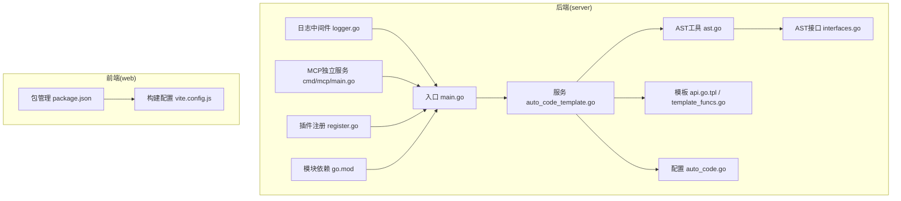
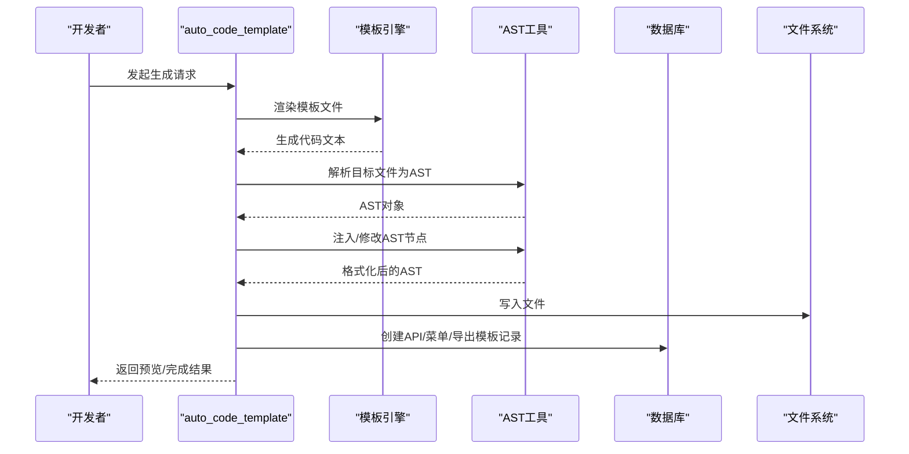
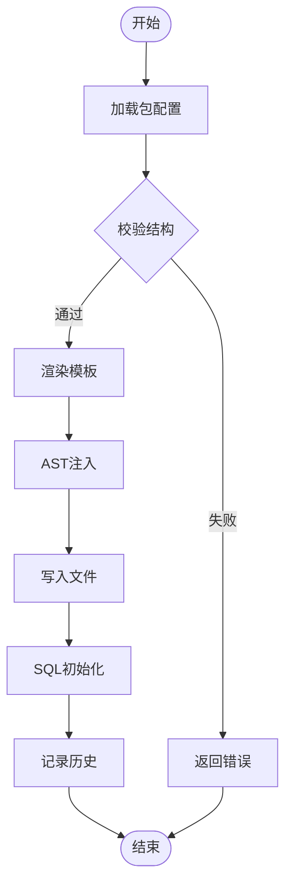
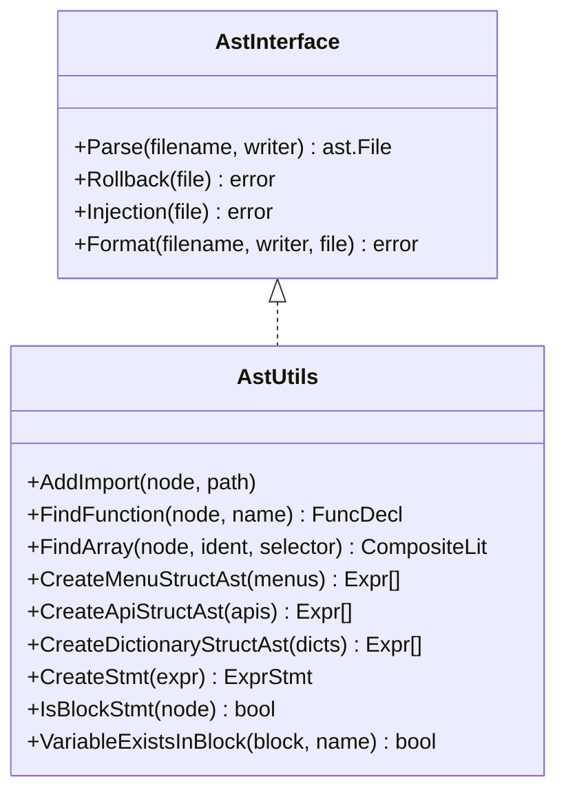
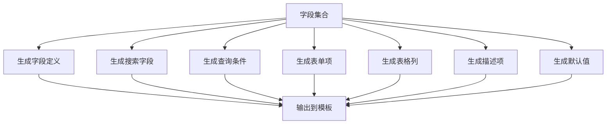
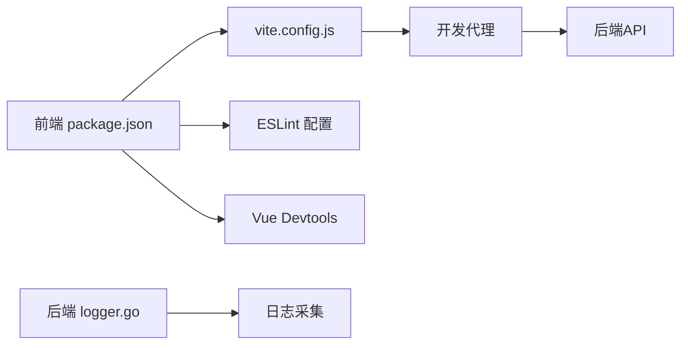
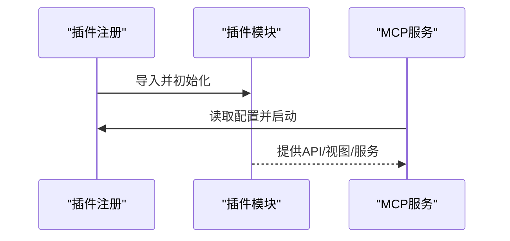
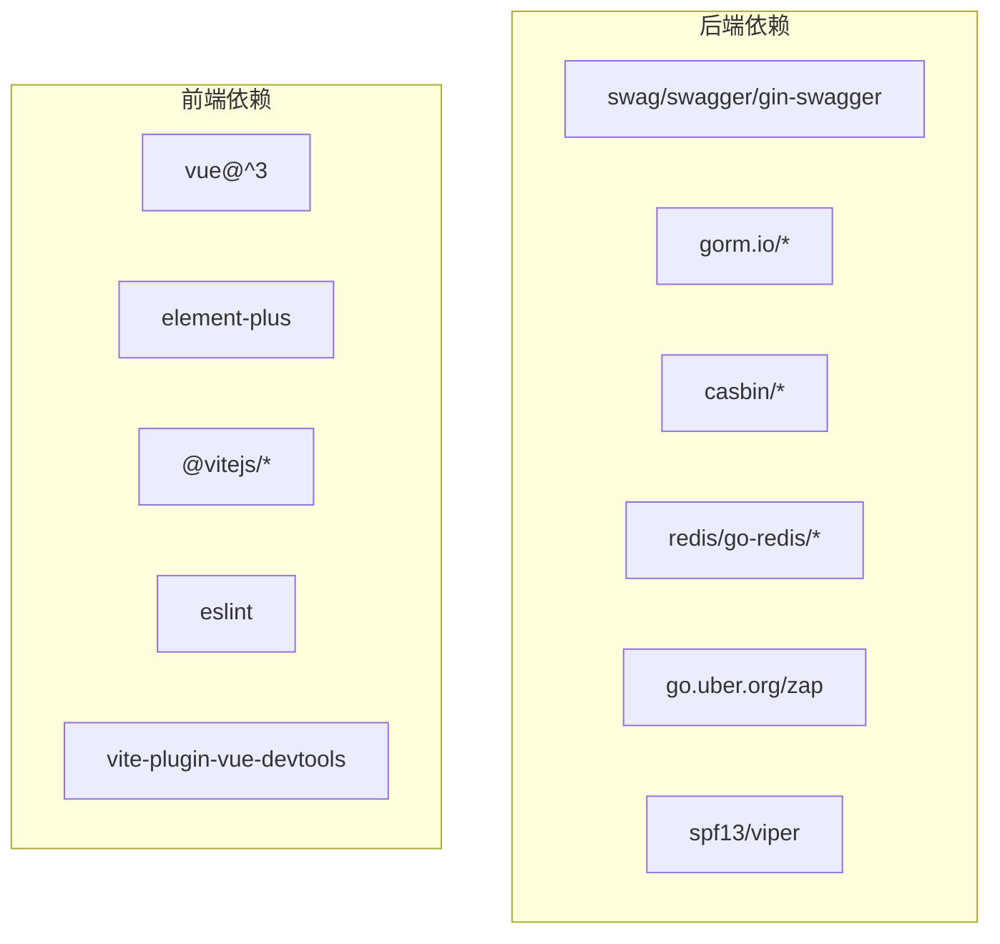

# 开发工具链

<cite>
**本文引用的文件**
- [server/main.go](file://server/main.go)
- [server/go.mod](file://server/go.mod)
- [server/config/auto_code.go](file://server/config/auto_code.go)
- [server/utils/ast/ast.go](file://server/utils/ast/ast.go)
- [server/utils/ast/interfaces.go](file://server/utils/ast/interfaces.go)
- [server/service/system/auto_code_template.go](file://server/service/system/auto_code_template.go)
- [server/resource/function/api.go.tpl](file://server/resource/function/api.go.tpl)
- [server/utils/autocode/template_funcs.go](file://server/utils/autocode/template_funcs.go)
- [server/middleware/logger.go](file://server/middleware/logger.go)
- [server/cmd/mcp/main.go](file://server/cmd/mcp/main.go)
- [web/package.json](file://web/package.json)
- [web/vite.config.js](file://web/vite.config.js)
- [server/plugin/register.go](file://server/plugin/register.go)
</cite>

## 目录
1. [引言](#引言)
2. [项目结构](#项目结构)
3. [核心组件](#核心组件)
4. [架构总览](#架构总览)
5. [详细组件分析](#详细组件分析)
6. [依赖分析](#依赖分析)
7. [性能考量](#性能考量)
8. [故障排查指南](#故障排查指南)
9. [结论](#结论)
10. [附录](#附录)

## 引言
本文件面向 Gin-Vue-Admin 项目的开发工具链，系统性梳理自动代码生成工具、AST 工具、开发环境配置、插件开发工具链与最佳实践。重点覆盖：
- 模板系统设计与生成规则配置
- AST 工具的解析、分析、修改与格式化
- IDE 配置、调试技巧、性能分析与代码质量检查
- 插件开发的模板、框架、调试与打包发布
- 代码质量保障、测试驱动与持续集成建议
- 工具链的定制化与扩展方案

## 项目结构
后端采用 Go 模块化组织，前端基于 Vite 生态；自动代码生成贯穿后端模板与前端资源，结合 AST 注入实现“所见即所得”的自动化。

**图示来源**
- [server/main.go:30-52](file://server/main.go#L30-L52)
- [server/config/auto_code.go:8-23](file://server/config/auto_code.go#L8-L23)
- [server/go.mod:1-61](file://server/go.mod#L1-L61)
- [server/service/system/auto_code_template.go:57-186](file://server/service/system/auto_code_template.go#L57-L186)
- [server/utils/ast/ast.go:12-35](file://server/utils/ast/ast.go#L12-L35)
- [server/utils/ast/interfaces.go:8-18](file://server/utils/ast/interfaces.go#L8-L18)
- [server/resource/function/api.go.tpl:1-45](file://server/resource/function/api.go.tpl#L1-L45)
- [server/utils/autocode/template_funcs.go:11-24](file://server/utils/autocode/template_funcs.go#L11-L24)
- [server/middleware/logger.go:41-90](file://server/middleware/logger.go#L41-L90)
- [server/cmd/mcp/main.go:12-36](file://server/cmd/mcp/main.go#L12-L36)
- [server/plugin/register.go:1-6](file://server/plugin/register.go#L1-L6)
- [web/package.json:1-88](file://web/package.json#L1-L88)
- [web/vite.config.js:15-119](file://web/vite.config.js#L15-L119)

**章节来源**
- [server/main.go:30-52](file://server/main.go#L30-L52)
- [server/go.mod:1-61](file://server/go.mod#L1-L61)
- [web/package.json:1-88](file://web/package.json#L1-L88)
- [web/vite.config.js:15-119](file://web/vite.config.js#L15-L119)

## 核心组件
- 自动代码生成服务：负责模板渲染、AST 注入、SQL 初始化、菜单与按钮权限注入、导出模板记录与历史记录。
- AST 工具集：提供导入、函数查找、数组结构定位、菜单/API/字典 AST 结构体生成、表达式节点创建、块语句与变量存在性检测、格式化清理等能力。
- 模板系统：后端模板函数映射与字段渲染规则，前端模板片段（API 控制器模板）。
- 开发环境：Vite 构建、代理、插件生态、ESLint、Vue Devtools、UnoCSS 等。
- 插件系统：插件注册入口与插件模板资源。
- MCP 独立服务：可独立运行的 MCP 流式服务，便于外部集成。

**章节来源**
- [server/service/system/auto_code_template.go:57-186](file://server/service/system/auto_code_template.go#L57-L186)
- [server/utils/ast/ast.go:12-410](file://server/utils/ast/ast.go#L12-L410)
- [server/utils/autocode/template_funcs.go:11-714](file://server/utils/autocode/template_funcs.go#L11-L714)
- [server/resource/function/api.go.tpl:1-45](file://server/resource/function/api.go.tpl#L1-L45)
- [web/vite.config.js:15-119](file://web/vite.config.js#L15-L119)
- [server/plugin/register.go:1-6](file://server/plugin/register.go#L1-L6)
- [server/cmd/mcp/main.go:12-36](file://server/cmd/mcp/main.go#L12-L36)

## 架构总览
自动代码生成工作流由“模板渲染 + AST 注入 + SQL 初始化 + 历史记录”构成，贯穿后端包与插件模板，前端资源通过 Vite 构建与代理联动。

**图示来源**
- [server/service/system/auto_code_template.go:220-272](file://server/service/system/auto_code_template.go#L220-L272)
- [server/utils/ast/ast.go:12-35](file://server/utils/ast/ast.go#L12-L35)
- [server/utils/autocode/template_funcs.go:11-24](file://server/utils/autocode/template_funcs.go#L11-L24)

## 详细组件分析

### 自动代码生成服务
- 模板校验：对 package/plugin 结构进行存在性校验，确保生成目录结构正确。
- 生成流程：模板渲染 → AST 注入 → 格式化写出 → SQL 初始化（API/菜单/导出模板） → 历史记录。
- 函数注入：支持向 API/服务/前端 JS 模板追加函数片段；支持按权限与插件类型注入路由注册。
- 预览：将生成内容以 Markdown 代码块形式返回，便于审阅。

**图示来源**
- [server/service/system/auto_code_template.go:29-55](file://server/service/system/auto_code_template.go#L29-L55)
- [server/service/system/auto_code_template.go:220-272](file://server/service/system/auto_code_template.go#L220-L272)
- [server/service/system/auto_code_template.go:57-186](file://server/service/system/auto_code_template.go#L57-L186)

**章节来源**
- [server/service/system/auto_code_template.go:57-186](file://server/service/system/auto_code_template.go#L57-L186)
- [server/service/system/auto_code_template.go:220-272](file://server/service/system/auto_code_template.go#L220-L272)

### AST 工具
- 导入管理：去重增加 import，避免重复导入。
- 函数查找：按名称检索函数声明。
- 数组结构定位：按标识符与选择器定位复合字面量数组。
- AST 结构体生成：为菜单、API、字典等模型生成对应 AST 节点。
- 表达式与块语句：创建表达式语句、判断块语句类型、变量存在性检测。
- 格式化与清理：清理位置信息，保证生成代码一致性。

**图示来源**
- [server/utils/ast/interfaces.go:8-18](file://server/utils/ast/interfaces.go#L8-L18)
- [server/utils/ast/ast.go:12-410](file://server/utils/ast/ast.go#L12-L410)

**章节来源**
- [server/utils/ast/ast.go:12-410](file://server/utils/ast/ast.go#L12-L410)
- [server/utils/ast/interfaces.go:8-18](file://server/utils/ast/interfaces.go#L8-L18)

### 模板系统与生成规则
- 模板函数映射：提供标题化、字段渲染、搜索条件、表单项、表格列、描述项、默认值等函数，统一前后端代码风格。
- 字段渲染规则：根据字段类型与索引类型生成 GORM 标签、JSON/FORM 标签、必填标记与注释。
- 搜索条件与表单项：支持 BETWEEN/NOT BETWEEN、枚举、字典、数据源、富文本、图片/视频/文件、数组 JSON 等多形态。
- API 模板：区分插件与普通包，生成带注解的 API 控制器方法与路由注释。

**图示来源**
- [server/utils/autocode/template_funcs.go:27-122](file://server/utils/autocode/template_funcs.go#L27-L122)
- [server/utils/autocode/template_funcs.go:124-199](file://server/utils/autocode/template_funcs.go#L124-L199)
- [server/utils/autocode/template_funcs.go:202-281](file://server/utils/autocode/template_funcs.go#L202-L281)
- [server/utils/autocode/template_funcs.go:283-456](file://server/utils/autocode/template_funcs.go#L283-L456)
- [server/utils/autocode/template_funcs.go:458-676](file://server/utils/autocode/template_funcs.go#L458-L676)
- [server/resource/function/api.go.tpl:1-45](file://server/resource/function/api.go.tpl#L1-L45)

**章节来源**
- [server/utils/autocode/template_funcs.go:11-714](file://server/utils/autocode/template_funcs.go#L11-L714)
- [server/resource/function/api.go.tpl:1-45](file://server/resource/function/api.go.tpl#L1-L45)

### 开发环境配置
- 包管理与脚本：前端使用 Vite、Vue、ESLint、UnoCSS、Vue Devtools 等，提供 dev/build/preview 等脚本。
- 构建配置：代理后端 API 与插件市场、输出文件命名、压缩与 sourcemap 控制、浏览器兼容插件等。
- 后端日志中间件：统一采集请求路径、查询参数、请求体、耗时、错误、来源等，支持关键字过滤与脱敏。

**图示来源**
- [web/package.json:5-12](file://web/package.json#L5-L12)
- [web/vite.config.js:57-78](file://web/vite.config.js#L57-L78)
- [server/middleware/logger.go:41-90](file://server/middleware/logger.go#L41-L90)

**章节来源**
- [web/package.json:1-88](file://web/package.json#L1-L88)
- [web/vite.config.js:15-119](file://web/vite.config.js#L15-L119)
- [server/middleware/logger.go:41-90](file://server/middleware/logger.go#L41-L90)

### 插件开发工具链
- 插件注册：通过插件注册入口自动加载内置插件。
- 插件模板：后端提供插件模板资源，前端提供插件 API、视图与表单模板。
- MCP 独立服务：可独立启动 MCP 流式服务，便于外部系统对接。

**图示来源**
- [server/plugin/register.go:1-6](file://server/plugin/register.go#L1-L6)
- [server/cmd/mcp/main.go:12-36](file://server/cmd/mcp/main.go#L12-L36)

**章节来源**
- [server/plugin/register.go:1-6](file://server/plugin/register.go#L1-L6)
- [server/cmd/mcp/main.go:12-36](file://server/cmd/mcp/main.go#L12-L36)

## 依赖分析
- 后端模块依赖：Swag/Swagger、GORM、Casbin、Redis、Mongo、OSS、定时任务、Zap 日志、Viper 配置等。
- 前端模块依赖：Vue3、Element Plus、Vite、UnoCSS、ESLint、Vue Devtools 等。

**图示来源**
- [server/go.mod:7-61](file://server/go.mod#L7-L61)
- [web/package.json:14-57](file://web/package.json#L14-L57)
- [web/package.json:58-86](file://web/package.json#L58-L86)

**章节来源**
- [server/go.mod:1-208](file://server/go.mod#L1-L208)
- [web/package.json:1-88](file://web/package.json#L1-L88)

## 性能考量
- 构建优化：启用 Terser 压缩、去除 console/debugger、产物命名固定前缀、按需引入 SVG。
- 依赖预优化：optimizeDeps 预构建，减少冷启动时间。
- 日志与监控：统一日志中间件，支持关键字过滤与脱敏，便于问题定位与性能分析。
- 数据库与缓存：合理使用 GORM 适配器、Redis 缓存与连接池，避免热点压力。

**章节来源**
- [web/vite.config.js:80-95](file://web/vite.config.js#L80-L95)
- [web/vite.config.js:22-29](file://web/vite.config.js#L22-L29)
- [server/middleware/logger.go:41-90](file://server/middleware/logger.go#L41-L90)

## 故障排查指南
- 生成失败：检查包结构校验、模板渲染错误、AST 注入失败、文件写入权限。
- 预览异常：确认模板函数映射、字段类型与搜索类型匹配。
- 日志异常：核对日志中间件过滤条件、关键字过滤回调与来源标识。
- 插件加载：确认插件注册入口已导入、MCP 服务端口与上游配置正确。

**章节来源**
- [server/service/system/auto_code_template.go:29-55](file://server/service/system/auto_code_template.go#L29-L55)
- [server/utils/autocode/template_funcs.go:11-24](file://server/utils/autocode/template_funcs.go#L11-L24)
- [server/middleware/logger.go:41-90](file://server/middleware/logger.go#L41-L90)
- [server/plugin/register.go:1-6](file://server/plugin/register.go#L1-L6)
- [server/cmd/mcp/main.go:12-36](file://server/cmd/mcp/main.go#L12-L36)

## 结论
本工具链以“模板 + AST 注入 + SQL 初始化”为核心，实现了后端与前端的自动化生成与扩展。配合完善的开发环境与日志中间件，能够显著提升开发效率与代码质量。插件体系与 MCP 独立服务进一步增强了系统的可扩展性与外部集成能力。

## 附录

### 开发最佳实践
- 代码规范：统一 ESLint 与 Prettier，保持前后端一致风格。
- 测试驱动：为关键服务与模板函数编写单元测试，覆盖字段渲染与 AST 注入场景。
- 持续集成：在 CI 中执行 lint、test、build 并生成产物，确保主干稳定。
- 版本控制：使用语义化版本与变更日志，模板升级时注意兼容性。

### 定制化与扩展
- 模板扩展：新增模板函数映射，完善字段类型与表单项生成规则。
- AST 扩展：新增 AST 接口实现，支持更多注入场景（如中间件、初始化器）。
- 插件扩展：遵循插件模板，提供 API、视图与服务，注册入口自动加载。
- MCP 扩展：通过独立服务暴露新能力，统一配置与日志。