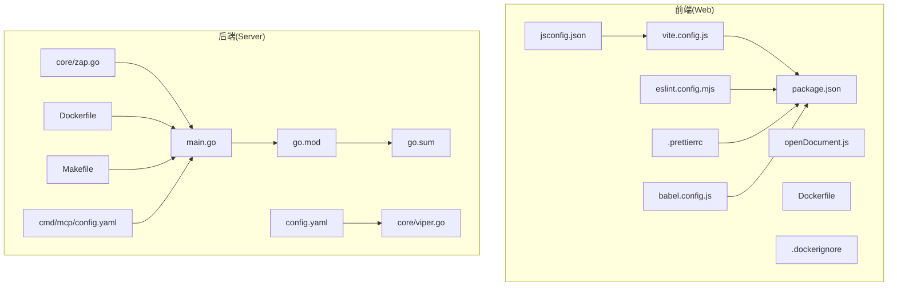
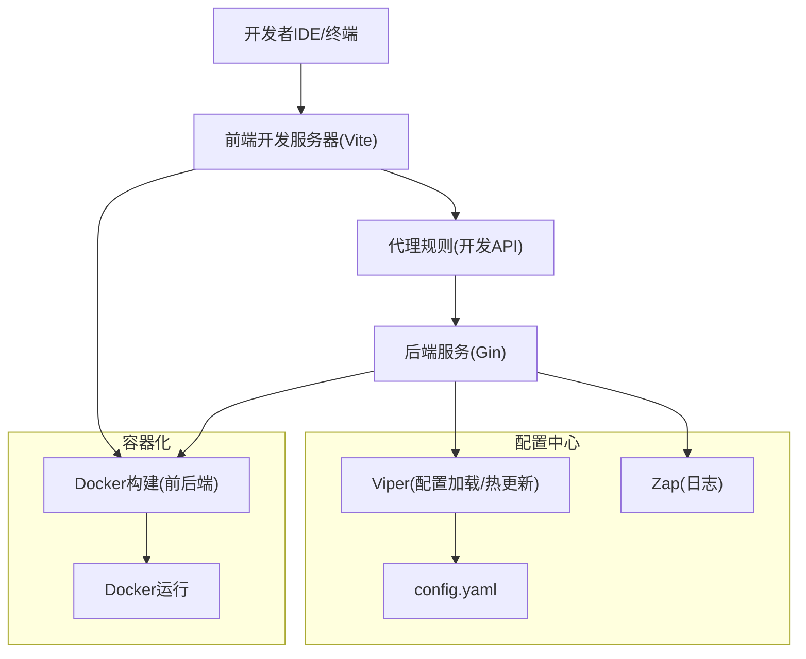
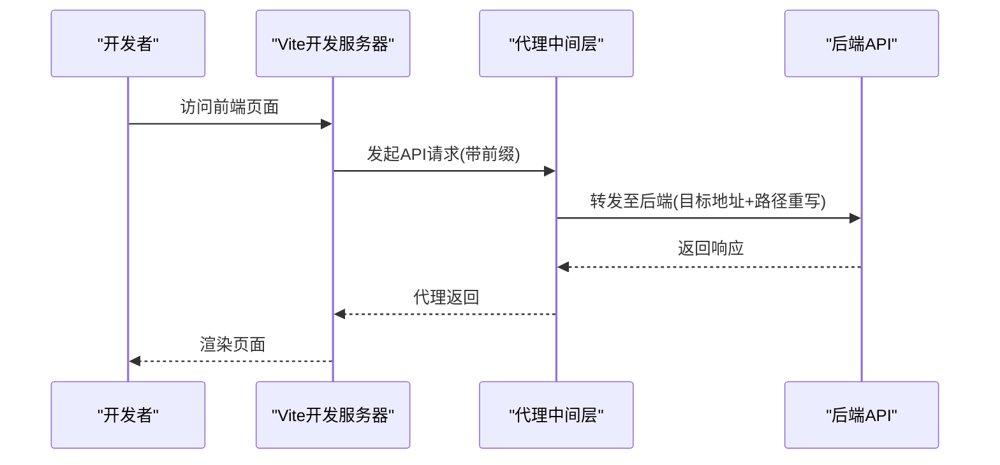
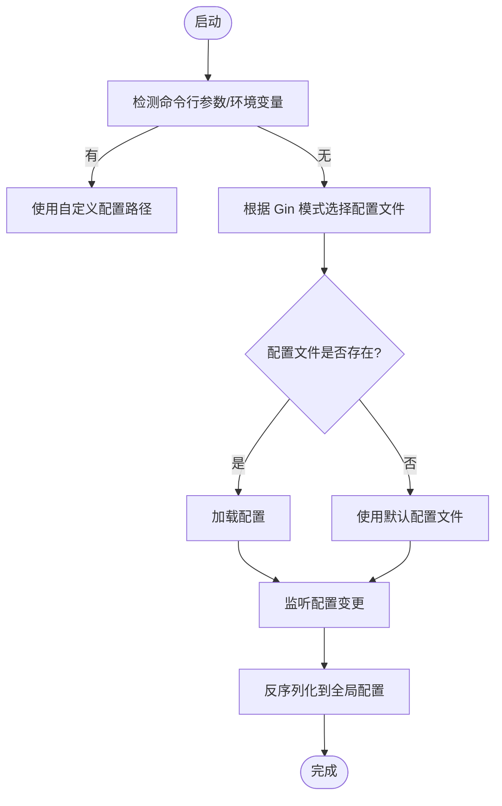
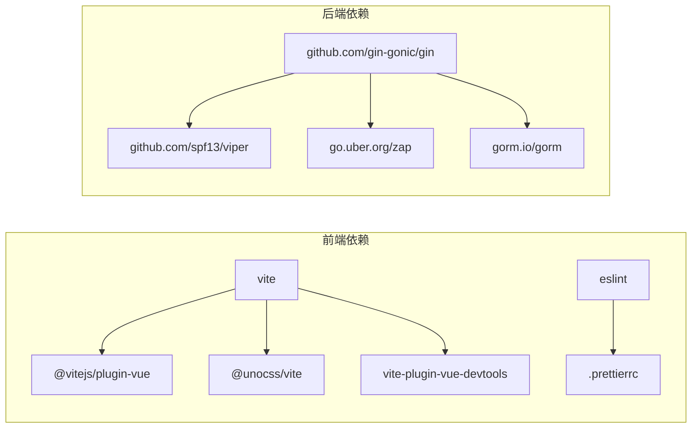

# 开发环境配置

<cite>
**本文档引用的文件**
- [vite.config.js](file://web/vite.config.js)
- [package.json](file://web/package.json)
- [eslint.config.mjs](file://web/eslint.config.mjs)
- [.prettierrc](file://web/.prettierrc)
- [go.mod](file://server/go.mod)
- [go.sum](file://server/go.sum)
- [main.go](file://server/main.go)
- [config.yaml](file://server/config.yaml)
- [Dockerfile](file://server/Dockerfile)
- [openDocument.js](file://web/openDocument.js)
- [Makefile](file://Makefile)
- [vitePlugin/secret/index.js](file://web/vitePlugin/secret/index.js)
- [vitePlugin/componentName/index.js](file://web/vitePlugin/componentName/index.js)
- [core/viper.go](file://server/core/viper.go)
- [core/zap.go](file://server/core/zap.go)
- [jsconfig.json](file://web/jsconfig.json)
- [babel.config.js](file://web/babel.config.js)
- [Dockerfile](file://web/Dockerfile)
- [.dockerignore](file://web/.dockerignore)
- [cmd/mcp/config.yaml](file://server/cmd/mcp/config.yaml)
</cite>

## 目录
1. [简介](#简介)
2. [项目结构](#项目结构)
3. [核心组件](#核心组件)
4. [架构总览](#架构总览)
5. [详细组件分析](#详细组件分析)
6. [依赖分析](#依赖分析)
7. [性能考虑](#性能考虑)
8. [故障排除指南](#故障排除指南)
9. [结论](#结论)

## 简介
本文件面向 Gin-Vue-Admin 项目的开发环境配置，系统性梳理前端与后端的开发工具链、配置文件、构建流程与调试技巧，帮助开发者快速搭建高效、稳定且可扩展的本地与容器化开发环境。内容涵盖：
- 前端开发环境：Vite 构建、ESLint 规范、Prettier 格式化、TypeScript 类型检查、组件路径映射与热重载
- 后端开发环境：Go 模块管理、依赖版本控制、配置文件管理、日志与配置热更新、Docker 容器化
- 工具链集成：代码生成、调试、测试、构建与打包的协同机制
- 优化与排错：性能调优、内存管理、并发处理、错误监控与常见问题排查

## 项目结构
项目采用前后端分离架构，前端基于 Vue 3 + Vite，后端基于 Go + Gin，配合统一的配置中心与容器化部署脚本。

**图表来源**
- [vite.config.js:1-119](file://web/vite.config.js#L1-L119)
- [package.json:1-88](file://web/package.json#L1-L88)
- [eslint.config.mjs:1-30](file://web/eslint.config.mjs#L1-L30)
- [.prettierrc:1-13](file://web/.prettierrc#L1-L13)
- [jsconfig.json:1-11](file://web/jsconfig.json#L1-L11)
- [babel.config.js:1-5](file://web/babel.config.js#L1-L5)
- [main.go:1-52](file://server/main.go#L1-L52)
- [go.mod:1-208](file://server/go.mod#L1-L208)
- [go.sum:1-800](file://server/go.sum#L1-L800)
- [config.yaml:1-284](file://server/config.yaml#L1-L284)
- [Dockerfile:1-32](file://server/Dockerfile#L1-L32)
- [Makefile:1-76](file://Makefile#L1-L76)
- [core/viper.go:1-77](file://server/core/viper.go#L1-L77)
- [core/zap.go:1-37](file://server/core/zap.go#L1-L37)
- [cmd/mcp/config.yaml:1-15](file://server/cmd/mcp/config.yaml#L1-L15)

**章节来源**
- [vite.config.js:1-119](file://web/vite.config.js#L1-L119)
- [package.json:1-88](file://web/package.json#L1-L88)
- [main.go:1-52](file://server/main.go#L1-L52)

## 核心组件
- 前端构建与开发工具链
  - Vite：开发服务器、代理、构建产物优化、插件生态
  - ESLint：代码风格与潜在问题检查
  - Prettier：统一代码格式
  - TypeScript：类型检查（通过 Vite 集成）
  - 组件路径映射插件：自动生成组件名与路径映射
  - 开发引导脚本：启动浏览器打开官方文档
- 后端开发与运行
  - Go 模块与依赖：集中管理第三方库与版本
  - 配置中心：Viper 加载多环境配置，支持热更新
  - 日志系统：Zap 多核日志，支持控制台与文件输出
  - Docker 容器化：前后端镜像构建与运行
  - Makefile：一键构建、打包与插件打包

**章节来源**
- [vite.config.js:1-119](file://web/vite.config.js#L1-L119)
- [eslint.config.mjs:1-30](file://web/eslint.config.mjs#L1-L30)
- [.prettierrc:1-13](file://web/.prettierrc#L1-L13)
- [jsconfig.json:1-11](file://web/jsconfig.json#L1-L11)
- [babel.config.js:1-5](file://web/babel.config.js#L1-L5)
- [vitePlugin/componentName/index.js:1-89](file://web/vitePlugin/componentName/index.js#L1-L89)
- [openDocument.js:1-21](file://web/openDocument.js#L1-L21)
- [go.mod:1-208](file://server/go.mod#L1-L208)
- [core/viper.go:1-77](file://server/core/viper.go#L1-L77)
- [core/zap.go:1-37](file://server/core/zap.go#L1-L37)
- [Dockerfile:1-32](file://server/Dockerfile#L1-L32)
- [Makefile:1-76](file://Makefile#L1-L76)

## 架构总览
开发环境整体由“前端开发服务器 + 后端服务 + 配置中心 + 容器化”构成，支持热重载、跨域代理、配置热更新与一键构建。

**图表来源**
- [vite.config.js:57-78](file://web/vite.config.js#L57-L78)
- [config.yaml:74-92](file://server/config.yaml#L74-L92)
- [core/viper.go:17-42](file://server/core/viper.go#L17-L42)
- [core/zap.go:15-36](file://server/core/zap.go#L15-L36)
- [Dockerfile:1-32](file://server/Dockerfile#L1-L32)
- [Makefile:20-31](file://Makefile#L20-L31)

## 详细组件分析

### 前端开发环境配置

#### Vite 构建与开发服务器
- 开发服务器
  - 主机与端口：通过环境变量动态配置，支持跨主机访问
  - 自动打开浏览器：开发模式下自动打开官方文档页
  - 代理规则：将 API 前缀代理至后端服务，支持插件域名代理
- 构建优化
  - 压缩与去调试：生产环境移除 console 与 debugger
  - 资源命名：固定前缀的哈希命名，便于缓存与回滚
  - 依赖预构建：优化二次启动速度
- 插件生态
  - Vue 插件、SVG 自动导入、UnoCSS、多 DOM 校验、组件路径映射、Vue DevTools 等

**图表来源**
- [vite.config.js:57-78](file://web/vite.config.js#L57-L78)

**章节来源**
- [vite.config.js:1-119](file://web/vite.config.js#L1-L119)
- [openDocument.js:1-21](file://web/openDocument.js#L1-L21)

#### ESLint 与 Prettier 集成
- ESLint：采用 Flat Config，启用 Vue 基础规则集，忽略特定目录，规则覆盖如最大属性数、组件命名等
- Prettier：统一打印宽度、引号、尾逗号、缩进、换行等风格
- 建议：在 IDE 中启用保存时自动格式化与 ESLint 修复；CI 中统一校验

**章节来源**
- [eslint.config.mjs:1-30](file://web/eslint.config.mjs#L1-L30)
- [.prettierrc:1-13](file://web/.prettierrc#L1-L13)

#### TypeScript 类型检查
- 通过 Vite 集成 TS，结合 tsconfig 与 IDE 的 TS Server 实现类型检查
- 建议：在 IDE 中启用“仅在保存时编译”或“监听模式”，避免阻塞开发

**章节来源**
- [jsconfig.json:1-11](file://web/jsconfig.json#L1-L11)

#### 组件路径映射与开发辅助
- 组件路径映射插件：扫描视图与插件目录，生成组件名与路径映射文件，开发时自动监听变更
- 密钥注入插件：向全局注入项目名与密钥，便于构建期注入

**章节来源**
- [vitePlugin/componentName/index.js:1-89](file://web/vitePlugin/componentName/index.js#L1-L89)
- [vitePlugin/secret/index.js:1-8](file://web/vitePlugin/secret/index.js#L1-L8)

#### IDE 配置建议
- VS Code：安装 Vue、ESLint、Prettier、UnoCSS 等插件；启用保存时格式化与 ESLint 修复
- 路径别名：确保 jsconfig.json 正确配置 @/* 映射
- Babel：保持空配置，避免与 Vite/TS 冲突

**章节来源**
- [jsconfig.json:1-11](file://web/jsconfig.json#L1-L11)
- [babel.config.js:1-5](file://web/babel.config.js#L1-L5)

### 后端开发环境配置

#### Go 模块与依赖管理
- go.mod：集中声明模块、Go 版本、工具链与依赖版本
- go.sum：锁定依赖版本，确保可重复构建
- 建议：定期执行 go mod tidy 与 go mod download，保持依赖一致

**章节来源**
- [go.mod:1-208](file://server/go.mod#L1-L208)
- [go.sum:1-800](file://server/go.sum#L1-L800)

#### 配置文件管理与热更新
- 配置文件：config.yaml 提供 JWT、Redis、Mongo、邮件、系统、数据库、跨域等配置
- Viper：根据运行模式选择配置文件，支持命令行 -c 与环境变量覆盖，文件变更自动热更新
- 建议：区分 local/dev/prod 环境，使用不同配置文件并通过 -c 或环境变量切换

**图表来源**
- [core/viper.go:44-76](file://server/core/viper.go#L44-L76)
- [config.yaml:74-92](file://server/config.yaml#L74-L92)

**章节来源**
- [core/viper.go:1-77](file://server/core/viper.go#L1-L77)
- [config.yaml:1-284](file://server/config.yaml#L1-L284)

#### 日志系统与错误监控
- Zap：多核日志，支持级别、编码器、调用栈与行号
- 建议：生产环境开启文件输出与轮转，开发环境启用控制台彩色输出与行号

**章节来源**
- [core/zap.go:1-37](file://server/core/zap.go#L1-L37)

#### Docker 容器化与一键构建
- 前端镜像：基于 Node 20，使用 pnpm，分阶段构建与 Nginx 镜像
- 后端镜像：基于 Alpine，静态编译，复制资源与配置
- Makefile：提供 build、build-web、build-server、build-image-web、build-image-server、doc、plugin 等目标

**章节来源**
- [Dockerfile:1-26](file://web/Dockerfile#L1-L26)
- [Dockerfile:1-32](file://server/Dockerfile#L1-L32)
- [Makefile:1-76](file://Makefile#L1-L76)

#### MCP 与自动代码生成配置
- MCP：提供插件通信与上游服务地址配置
- 自动代码生成：指定 Web 与 Server 输出路径，便于前后端联动

**章节来源**
- [cmd/mcp/config.yaml:1-15](file://server/cmd/mcp/config.yaml#L1-L15)

### 开发工具链集成方案
- 代码生成：通过自动代码生成工具生成前后端代码骨架，结合 Vite 组件映射插件与后端配置热更新
- 调试工具：前端使用 Vue DevTools；后端可通过日志与配置热更新定位问题
- 测试工具：后端使用 testify；前端可在 Vite 中集成测试框架（按需）
- 构建工具：Vite 负责前端构建，Makefile 与 Dockerfile 负责后端与全栈打包

**章节来源**
- [vite.config.js:96-115](file://web/vite.config.js#L96-L115)
- [Makefile:66-76](file://Makefile#L66-L76)
- [go.mod:40-41](file://server/go.mod#L40-L41)

## 依赖分析

**图表来源**
- [package.json:14-86](file://web/package.json#L14-L86)
- [go.mod:17-61](file://server/go.mod#L17-L61)

**章节来源**
- [package.json:1-88](file://web/package.json#L1-L88)
- [go.mod:1-208](file://server/go.mod#L1-L208)

## 性能考虑
- 前端
  - 使用 Vite 的依赖预构建与按需加载，减少首屏时间
  - 生产构建启用压缩与去调试，降低包体积
  - 合理拆分 chunk，利用浏览器缓存策略
- 后端
  - 使用 automaxprocs 自动设置 GOMAXPROCS，提升并发性能
  - 合理配置数据库连接池与日志级别，避免 IO 瓶颈
  - 使用静态编译与精简镜像，缩短冷启动时间

**章节来源**
- [main.go:7-8](file://server/main.go#L7-L8)
- [vite.config.js:80-93](file://web/vite.config.js#L80-L93)
- [Dockerfile:1-32](file://server/Dockerfile#L1-L32)

## 故障排除指南
- 前端
  - 端口占用：调整 Vite 端口或关闭占用进程
  - 代理失败：检查代理前缀与目标地址是否匹配
  - 组件路径映射异常：确认插件生成的映射文件是否更新
- 后端
  - 配置加载失败：检查 config.yaml 路径与权限，确认 -c 或环境变量正确
  - 日志输出异常：确认 Director 目录存在且可写
  - Docker 构建失败：检查网络代理与镜像缓存，必要时清理缓存重试
- 通用
  - 依赖版本冲突：使用 go mod tidy 与 npm/pnpm 锁定版本
  - CI 构建失败：统一 Node 与 Go 版本，确保代理可用

**章节来源**
- [vite.config.js:57-78](file://web/vite.config.js#L57-L78)
- [core/viper.go:23-34](file://server/core/viper.go#L23-L34)
- [core/zap.go:16-19](file://server/core/zap.go#L16-L19)
- [Makefile:49-56](file://Makefile#L49-L56)

## 结论
本开发环境配置以 Vite 与 Go 为核心，结合 ESLint/Prettier、Viper/Zap、Docker 与 Makefile，形成前后端一体化的高效开发与交付体系。建议团队在本地与 CI 中统一工具链与配置，持续优化构建与运行性能，并建立完善的故障排查与回滚机制，保障开发效率与系统稳定性。