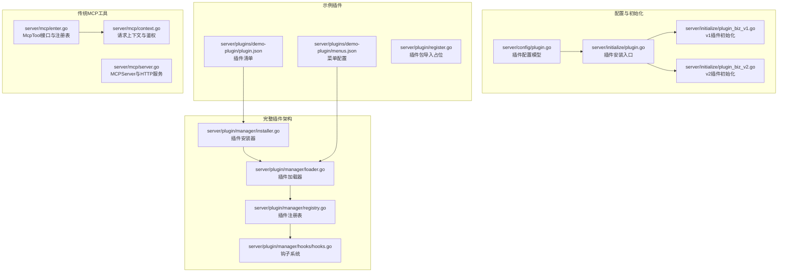
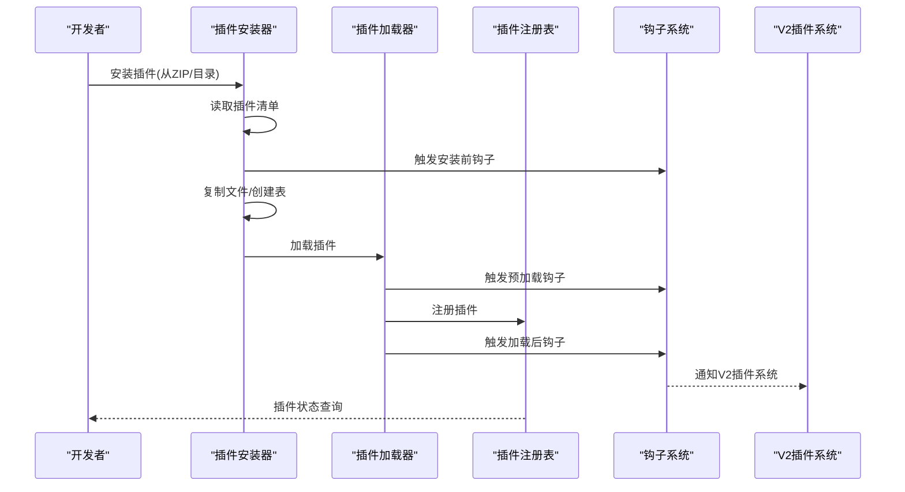
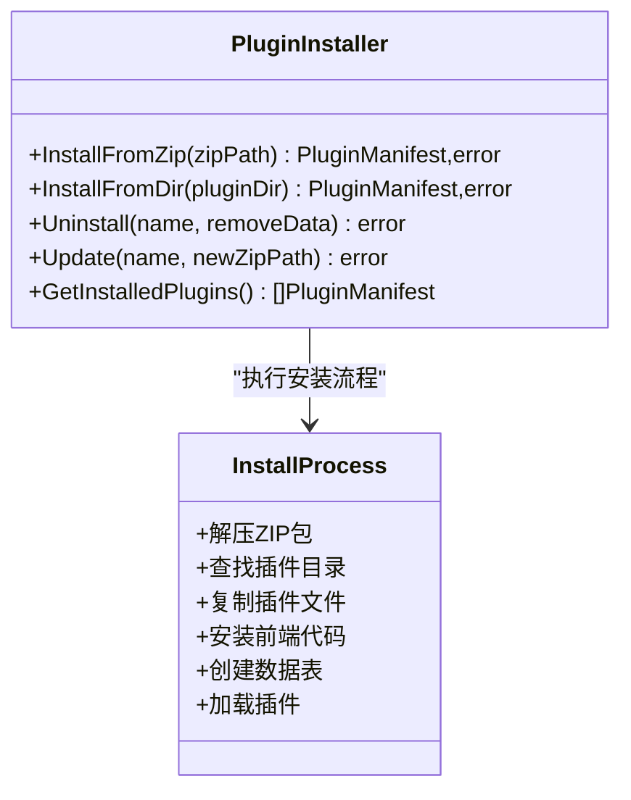
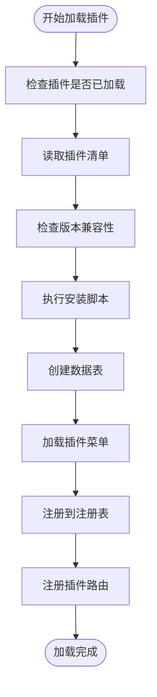
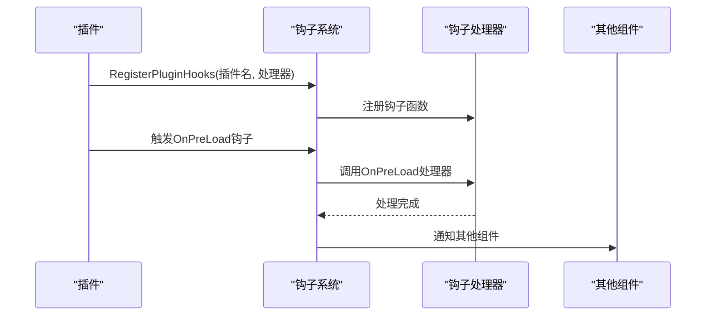
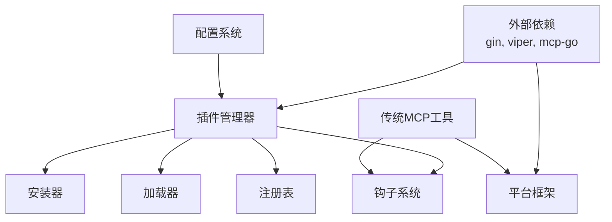

# 插件开发工具链

<cite>
**本文引用的文件**
- [server/plugin/register.go](file://server/plugin/register.go)
- [server/utils/plugin/plugin.go](file://server/utils/plugin/plugin.go)
- [server/utils/plugin/v2/plugin.go](file://server/utils/plugin/v2/plugin.go)
- [server/utils/plugin/v2/registry.go](file://server/utils/plugin/v2/registry.go)
- [server/initialize/plugin.go](file://server/initialize/plugin.go)
- [server/initialize/plugin_biz_v1.go](file://server/initialize/plugin_biz_v1.go)
- [server/initialize/plugin_biz_v2.go](file://server/initialize/plugin_biz_v2.go)
- [server/plugin/announcement/plugin.go](file://server/plugin/announcement/plugin.go)
- [server/plugin/email/main.go](file://server/plugin/email/main.go)
- [server/resource/plugin/server/plugin.go.tpl](file://server/resource/plugin/server/plugin.go.tpl)
- [server/mcp/enter.go](file://server/mcp/enter.go)
- [server/mcp/server.go](file://server/mcp/server.go)
- [server/mcp/context.go](file://server/mcp/context.go)
- [server/cmd/mcp/main.go](file://server/cmd/mcp/main.go)
- [repowiki\zh\content\插件系统\插件开发指南.md](file://repowiki/zh/content/插件系统/插件开发指南.md)
</cite>

## 目录
1. [简介](#简介)
2. [项目结构](#项目结构)
3. [核心组件](#核心组件)
4. [架构总览](#架构总览)
5. [详细组件分析](#详细组件分析)
6. [依赖分析](#依赖分析)
7. [性能考量](#性能考量)
8. [故障排查指南](#故障排查指南)
9. [结论](#结论)
10. [附录](#附录)

## 简介
本指南面向希望为测试管理平台开发自定义插件的开发者。随着平台的发展，插件开发模式已从传统的MCP工具开发转向基于 server/plugin/manager 的完整插件架构。新架构提供了插件安装、加载、注册、钩子管理等完整的生命周期管理能力，支持从简单工具到复杂业务插件的全栈开发需求。

## 项目结构
围绕新插件开发模式的关键目录与文件如下：
- 完整插件架构：位于 server/plugin/manager 下，包含安装器、加载器、注册表和钩子系统。
- 插件配置：位于 server/config/plugin.go，定义插件目录、前端目录、自动加载等配置选项。
- 插件初始化：位于 server/initialize/plugin.go，负责插件安装入口和初始化流程。
- 示例插件：位于 server/plugins/demo-plugin，展示完整的插件开发模板。
- 传统MCP工具：位于 server/mcp 下，保持向后兼容。



**图表来源**
- [server/plugin/manager/installer.go:17-31](file://server/plugin/manager/installer.go#L17-L31)
- [server/plugin/manager/loader.go:20-40](file://server/plugin/manager/loader.go#L20-L40)
- [server/plugin/manager/registry.go:21-55](file://server/plugin/manager/registry.go#L21-L55)
- [server/plugin/manager/hooks/hooks.go:8-21](file://server/plugin/manager/hooks/hooks.go#L8-L21)
- [server/config/plugin.go:7-21](file://server/config/plugin.go#L7-L21)
- [server/initialize/plugin.go:8-15](file://server/initialize/plugin.go#L8-L15)
- [server/plugins/demo-plugin/plugin.json:1-16](file://server/plugins/demo-plugin/plugin.json#L1-L16)
- [server/plugins/demo-plugin/menus.json:1-27](file://server/plugins/demo-plugin/menus.json#L1-L27)
- [server/plugin/register.go:1-6](file://server/plugin/register.go#L1-L6)
- [server/mcp/enter.go:10-31](file://server/mcp/enter.go#L10-L31)
- [server/mcp/server.go:11-52](file://server/mcp/server.go#L11-L52)
- [server/mcp/context.go:15-66](file://server/mcp/context.go#L15-L66)

**章节来源**
- [server/plugin/manager/installer.go:17-31](file://server/plugin/manager/installer.go#L17-L31)
- [server/plugin/manager/loader.go:20-40](file://server/plugin/manager/loader.go#L20-L40)
- [server/plugin/manager/registry.go:21-55](file://server/plugin/manager/registry.go#L21-L55)
- [server/plugin/manager/hooks/hooks.go:8-21](file://server/plugin/manager/hooks/hooks.go#L8-L21)
- [server/config/plugin.go:7-21](file://server/config/plugin.go#L7-L21)
- [server/initialize/plugin.go:8-15](file://server/initialize/plugin.go#L8-L15)
- [server/plugins/demo-plugin/plugin.json:1-16](file://server/plugins/demo-plugin/plugin.json#L1-L16)
- [server/plugins/demo-plugin/menus.json:1-27](file://server/plugins/demo-plugin/menus.json#L1-L27)
- [server/plugin/register.go:1-6](file://server/plugin/register.go#L1-L6)
- [server/mcp/enter.go:10-31](file://server/mcp/enter.go#L10-L31)
- [server/mcp/server.go:11-52](file://server/mcp/server.go#L11-L52)
- [server/mcp/context.go:15-66](file://server/mcp/context.go#L15-L66)

## 核心组件
- **插件安装器**：负责从ZIP包或目录安装插件，处理插件清单读取、文件复制、前端代码安装、数据库表创建等。
- **插件加载器**：管理插件的生命周期，包括加载、卸载、重载、启用、禁用等操作，支持版本兼容性检查。
- **插件注册表**：维护已加载插件的元数据，支持插件状态查询、菜单获取、优先级排序等功能。
- **钩子系统**：提供插件生命周期事件通知，包括安装、卸载、启用、禁用、配置变更等钩子类型。
- **插件配置**：定义插件目录、前端目录、自动加载、自动菜单等配置选项，支持运行时实例化。

**章节来源**
- [server/plugin/manager/installer.go:57-120](file://server/plugin/manager/installer.go#L57-L120)
- [server/plugin/manager/loader.go:79-135](file://server/plugin/manager/loader.go#L79-L135)
- [server/plugin/manager/registry.go:57-101](file://server/plugin/manager/registry.go#L57-L101)
- [server/plugin/manager/hooks/hooks.go:76-101](file://server/plugin/manager/hooks/hooks.go#L76-L101)
- [server/config/plugin.go:7-21](file://server/config/plugin.go#L7-L21)

## 架构总览
下图展示了新插件架构从安装到运行的完整流程，以及与传统MCP工具的兼容性。



**图表来源**
- [server/plugin/manager/installer.go:57-120](file://server/plugin/manager/installer.go#L57-L120)
- [server/plugin/manager/loader.go:79-135](file://server/plugin/manager/loader.go#L79-L135)
- [server/plugin/manager/registry.go:57-101](file://server/plugin/manager/registry.go#L57-L101)
- [server/plugin/manager/hooks/hooks.go:76-101](file://server/plugin/manager/hooks/hooks.go#L76-L101)

## 详细组件分析

### 插件安装器
- **安装流程**
  - 从ZIP包安装：解压到临时目录，查找插件目录，复制文件到目标位置。
  - 从目录安装：直接复制插件文件，支持前端代码和数据库表的自动创建。
  - 安装后处理：触发安装钩子，加载插件到内存，记录安装日志。
- **卸载流程**
  - 触发卸载钩子，从内存中移除插件，删除前端代码，可选删除数据库表。
  - 支持完全卸载和保留数据两种模式。
- **更新流程**
  - 备份配置，卸载旧版本，安装新版本，恢复配置，支持回滚机制。



**图表来源**
- [server/plugin/manager/installer.go:33-120](file://server/plugin/manager/installer.go#L33-L120)
- [server/plugin/manager/installer.go:122-236](file://server/plugin/manager/installer.go#L122-L236)

**章节来源**
- [server/plugin/manager/installer.go:33-120](file://server/plugin/manager/installer.go#L33-L120)
- [server/plugin/manager/installer.go:122-236](file://server/plugin/manager/installer.go#L122-L236)

### 插件加载器
- **加载管理**
  - 支持批量加载、单个加载、重载、启用、禁用等操作。
  - 自动扫描插件目录，按优先级排序加载。
  - 版本兼容性检查，确保插件与平台版本匹配。
- **路由注册**
  - 动态注册插件路由到Gin引擎。
  - 支持插件菜单的自动注册和管理。
  - 提供路由注销机制（通过重新构建路由表实现）。
- **脚本执行**
  - 支持安装脚本和卸载脚本的执行。
  - 提供初始化脚本的执行能力。



**图表来源**
- [server/plugin/manager/loader.go:79-135](file://server/plugin/manager/loader.go#L79-L135)
- [server/plugin/manager/loader.go:387-415](file://server/plugin/manager/loader.go#L387-L415)

**章节来源**
- [server/plugin/manager/loader.go:79-135](file://server/plugin/manager/loader.go#L79-L135)
- [server/plugin/manager/loader.go:387-415](file://server/plugin/manager/loader.go#L387-L415)

### 插件注册表
- **注册管理**
  - 维护已加载插件的实例、路径、菜单、加载时间、优先级等信息。
  - 支持插件状态查询、优先级排序、菜单聚合等功能。
  - 提供插件路径获取和设置功能。
- **依赖管理**
  - 检查插件依赖关系，确保依赖插件已加载。
  - 支持依赖链的验证和错误报告。
- **配置管理**
  - 提供插件配置的读取和管理能力。
  - 支持多种配置文件格式的解析。

```mermaid
classDiagram
class PluginRegistry {
+Register(name, instance, menus, priority)
+Unregister(name)
+Get(name) LoadedPlugin,bool
+List() []LoadedPlugin
+IsLoaded(name) bool
+GetAllMenus() []SysBaseMenu
+GetPluginsDir() string
}
class LoadedPlugin {
+Name string
+Path string
+Instance interface{}
+Menus []SysBaseMenu
+LoadedAt string
+Priority int
}
PluginRegistry --> LoadedPlugin : "管理插件实例"
```

**图表来源**
- [server/plugin/manager/registry.go:57-101](file://server/plugin/manager/registry.go#L57-L101)
- [server/plugin/manager/registry.go:29-36](file://server/plugin/manager/registry.go#L29-L36)

**章节来源**
- [server/plugin/manager/registry.go:57-101](file://server/plugin/manager/registry.go#L57-L101)
- [server/plugin/manager/registry.go:29-36](file://server/plugin/manager/registry.go#L29-L36)

### 插件开发新模式
新插件开发模式提供了从简单工具到复杂业务插件的完整开发体验：

#### 插件目录结构
- **必需文件**：plugin.json（插件清单）、menus.json（菜单配置）
- **可选文件**：schema.sql（数据库结构）、seed.json（种子数据）、router.js（路由配置）
- **前端代码**：frontend/ 目录包含Vue组件和资源文件
- **脚本文件**：install.sh、uninstall.sh（安装/卸载脚本）

#### 插件清单配置
插件清单文件包含插件的基本信息、依赖关系、安装选项等：
- 基本信息：name、version、title、description、author
- 安装配置：createTables、seedData、autoLoad
- 兼容性：minGvaVersion、dependencies
- 路径配置：main、frontend

#### 开发流程
1. **创建插件目录**：按照标准结构创建插件目录
2. **编写插件清单**：配置插件基本信息和安装选项
3. **实现插件逻辑**：开发插件的核心功能
4. **配置菜单**：定义插件在系统中的菜单结构
5. **测试安装**：使用安装器测试插件的安装和加载
6. **部署发布**：打包插件并发布到插件市场

**章节来源**
- [server/plugins/demo-plugin/plugin.json:1-16](file://server/plugins/demo-plugin/plugin.json#L1-L16)
- [server/plugins/demo-plugin/menus.json:1-27](file://server/plugins/demo-plugin/menus.json#L1-L27)

### 钩子系统与生命周期
新架构提供了完整的插件生命周期管理：

#### 钩子类型
- **安装相关**：OnInstall、OnUninstall（安装/卸载）
- **加载相关**：OnPreLoad、OnLoad（加载前后）
- **卸载相关**：OnPreUnload、OnUnload（卸载前后）
- **状态相关**：OnEnable、OnDisable（启用/禁用）
- **配置相关**：OnConfigChange（配置变更）

#### 钩子注册
插件可以通过实现 PluginHookHandler 接口来注册钩子处理器：
- 实现各个生命周期钩子的方法
- 在插件初始化时调用 RegisterPluginHooks 注册
- 支持全局钩子和插件特定钩子

#### 事件订阅
钩子系统支持事件订阅机制：
- 通过 Subscribe 订阅特定类型的钩子事件
- 事件通过通道传递，支持异步处理
- 提供事件缓冲和错误处理机制



**图表来源**
- [server/plugin/manager/hooks/hooks.go:194-227](file://server/plugin/manager/hooks/hooks.go#L194-L227)
- [server/plugin/manager/hooks/hooks.go:76-101](file://server/plugin/manager/hooks/hooks.go#L76-L101)

**章节来源**
- [server/plugin/manager/hooks/hooks.go:8-21](file://server/plugin/manager/hooks/hooks.go#L8-L21)
- [server/plugin/manager/hooks/hooks.go:194-227](file://server/plugin/manager/hooks/hooks.go#L194-L227)
- [server/plugin/manager/hooks/hooks.go:76-101](file://server/plugin/manager/hooks/hooks.go#L76-L101)

### 插件清单与配置
插件清单文件是插件开发的核心配置文件：

#### 基本配置项
- **name**：插件唯一标识符，必须与目录名一致
- **version**：插件版本号，支持语义化版本
- **title**：插件显示名称
- **description**：插件功能描述
- **author**：插件作者信息

#### 安装配置
- **autoLoad**：是否自动加载插件
- **install.createTables**：是否自动创建数据库表
- **install.seedData**：是否自动插入种子数据
- **dependencies**：插件依赖列表

#### 兼容性配置
- **minGvaVersion**：插件所需的最低平台版本
- **priority**：插件加载优先级（数值越小优先级越高）

#### 路径配置
- **main**：插件主程序路径
- **frontend**：前端代码路径

**章节来源**
- [server/plugins/demo-plugin/plugin.json:1-16](file://server/plugins/demo-plugin/plugin.json#L1-L16)

## 依赖分析
新插件架构的依赖关系更加复杂和清晰：

### 外部依赖
- **gin-gonic/gin**：Web框架，用于插件路由注册和HTTP服务
- **spf13/viper**：配置管理，支持多种配置文件格式
- **mcp-go**：MCP协议支持（向后兼容）
- **flipped-aurora/gin-vue-admin**：平台核心框架

### 内部耦合
- **插件安装器**与 **插件加载器**：通过插件清单和注册表进行通信
- **插件加载器**与 **钩子系统**：通过生命周期钩子进行事件通知
- **插件注册表**与 **配置系统**：通过Viper进行配置读取和管理
- **传统MCP工具**与 **新插件架构**：保持向后兼容，支持并存

### 版本兼容性
- **配置模型**：保留向后兼容字段，避免破坏性变更
- **接口抽象**：通过接口抽象实现插件系统的可扩展性
- **钩子系统**：提供稳定的生命周期管理接口



**图表来源**
- [server/plugin/manager/installer.go:3-15](file://server/plugin/manager/installer.go#L3-L15)
- [server/plugin/manager/loader.go:3-18](file://server/plugin/manager/loader.go#L3-L18)
- [server/plugin/manager/registry.go:3-18](file://server/plugin/manager/registry.go#L3-L18)
- [server/config/plugin.go:3-5](file://server/config/plugin.go#L3-L5)

**章节来源**
- [server/plugin/manager/installer.go:3-15](file://server/plugin/manager/installer.go#L3-L15)
- [server/plugin/manager/loader.go:3-18](file://server/plugin/manager/loader.go#L3-L18)
- [server/plugin/manager/registry.go:3-18](file://server/plugin/manager/registry.go#L3-L18)
- [server/config/plugin.go:3-5](file://server/config/plugin.go#L3-L5)

## 性能考量
新插件架构在性能方面有以下优化：

### 并发处理
- **读写锁**：插件注册表使用读写锁，提高并发读取性能
- **异步钩子**：钩子系统支持异步事件处理，避免阻塞主线程
- **事件通道**：使用通道进行事件传递，支持非阻塞通信

### 资源管理
- **插件隔离**：每个插件运行在独立的上下文中，避免资源冲突
- **内存管理**：支持插件的动态加载和卸载，释放不再使用的资源
- **数据库连接**：插件使用独立的数据库连接池，避免连接竞争

### 缓存机制
- **插件清单缓存**：插件清单文件的读取和解析结果进行缓存
- **菜单缓存**：插件菜单的生成和注册结果进行缓存
- **配置缓存**：插件配置的读取结果进行缓存

### 优化建议
- **插件优先级**：合理设置插件优先级，确保关键插件优先加载
- **懒加载**：对于不常用的插件，采用懒加载策略
- **资源池**：为插件创建专用的资源池，提高资源利用率

## 故障排查指南
针对新插件架构的常见问题和解决方案：

### 安装问题
- **插件清单错误**：检查 plugin.json 格式和必填字段
- **依赖缺失**：确认依赖插件已正确安装和加载
- **权限不足**：检查插件目录的读写权限
- **磁盘空间不足**：确认有足够的磁盘空间进行插件安装

### 加载问题
- **版本不兼容**：检查 minGvaVersion 和实际平台版本
- **循环依赖**：分析插件依赖关系，消除循环依赖
- **内存不足**：监控插件加载过程中的内存使用情况
- **数据库连接失败**：检查数据库连接配置和网络连通性

### 运行时问题
- **钩子异常**：检查钩子处理器的实现，添加适当的错误处理
- **路由冲突**：确认插件路由与现有路由没有冲突
- **菜单显示异常**：检查 menus.json 的格式和配置
- **前端资源加载失败**：确认前端代码的路径和文件完整性

### 调试技巧
- **日志分析**：查看插件安装和加载的日志信息
- **状态查询**：使用插件注册表查询插件状态
- **事件监控**：通过钩子事件通道监控插件生命周期
- **性能分析**：使用性能分析工具监控插件的性能指标

**章节来源**
- [server/plugin/manager/installer.go:66-70](file://server/plugin/manager/installer.go#L66-L70)
- [server/plugin/manager/loader.go:97-100](file://server/plugin/manager/loader.go#L97-L100)
- [server/plugin/manager/registry.go:115-121](file://server/plugin/manager/registry.go#L115-L121)

## 结论
新插件架构通过完整的安装、加载、注册、钩子管理系统，为开发者提供了从简单工具到复杂业务插件的全栈开发体验。相比传统的MCP工具开发模式，新架构提供了更好的生命周期管理、更强的扩展性和更完善的开发工具链。开发者可以充分利用新架构提供的功能，快速构建高质量的插件应用。

## 附录

### 插件开发步骤速查
- **创建插件目录**：按照标准结构创建插件目录
- **编写插件清单**：配置 plugin.json 文件
- **实现插件逻辑**：开发插件的核心功能
- **配置菜单**：定义 menus.json 文件
- **测试安装**：使用安装器测试插件
- **部署发布**：打包并发布插件

### 配置参考
- **插件配置字段**
  - 插件目录、前端目录、自动加载、自动菜单
  - 运行时实例化（Loader、Installer）
- **插件清单字段**
  - 基本信息、安装配置、依赖关系、兼容性配置

### 钩子类型参考
- **安装相关**：OnInstall、OnUninstall
- **加载相关**：OnPreLoad、OnLoad
- **卸载相关**：OnPreUnload、OnUnload
- **状态相关**：OnEnable、OnDisable
- **配置相关**：OnConfigChange

### 插件模式对比
- **传统MCP模式**：专注于工具接口实现，功能相对单一
- **新插件架构**：提供完整的生命周期管理，支持复杂业务场景
- **兼容性**：新架构向后兼容传统MCP工具，支持并存