# 自动代码生成工具

<cite>
**本文档引用的文件**
- [template_funcs.go](file://server/utils/autocode/template_funcs.go)
- [auto_code_template.go](file://server/service/system/auto_code_template.go)
- [auto_code.go](file://server/api/v1/system/sys_auto_code.go)
- [sys_auto_code.go](file://server/api/v1/system/auto_code_template.go)
- [auto_code.go](file://server/model/system/request/sys_auto_code.go)
- [auto_code.go](file://server/config/auto_code.go)
- [api.go.tpl](file://server/resource/function/api.go.tpl)
- [server.go.tpl](file://server/resource/function/server.go.tpl)
- [model.go.tpl](file://server/resource/package/server/model/model.go.tpl)
- [api.js.tpl](file://server/resource/function/api.js.tpl)
- [table.vue.tpl](file://server/resource/package/web/view/table.vue.tpl)
- [form.vue.tpl](file://server/resource/package/web/view/form.vue.tpl)
- [tools.tpl](file://server/resource/mcp/tools.tpl)
</cite>

## 目录
1. [简介](#简介)
2. [项目结构](#项目结构)
3. [核心组件](#核心组件)
4. [架构概览](#架构概览)
5. [详细组件分析](#详细组件分析)
6. [模板系统详解](#模板系统详解)
7. [代码生成工作流程](#代码生成工作流程)
8. [模板文件组织结构](#模板文件组织结构)
9. [模板函数系统](#模板函数系统)
10. [字段类型处理机制](#字段类型处理机制)
11. [搜索条件生成系统](#搜索条件生成系统)
12. [表单组件生成系统](#表单组件生成系统)
13. [定制化最佳实践](#定制化最佳实践)
14. [性能考虑](#性能考虑)
15. [故障排除指南](#故障排除指南)
16. [结论](#结论)

## 简介

自动代码生成工具是 Gin-Vue-Admin 测试平台的核心功能模块，旨在通过模板驱动的方式实现从数据库模型到前后端代码的完整自动化生成。该工具支持多种模板类型，包括后端 API 模板、前端组件模板、MCP 工具模板等，能够显著提升开发效率，减少重复性代码编写工作。

该系统基于 Go 模板引擎构建，通过精心设计的模板函数映射和字段类型处理机制，实现了高度可定制化的代码生成能力。开发者可以通过简单的配置和模板定制，快速生成符合项目规范的完整代码结构。

## 项目结构

自动代码生成工具的项目结构遵循分层架构设计，主要分为以下几个核心层次：

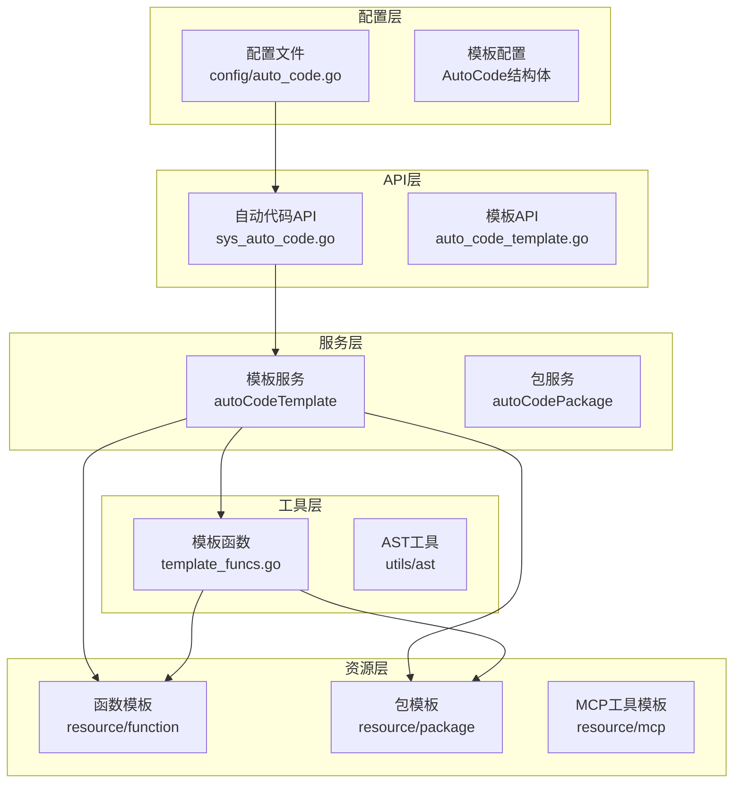
```mermaid
graph TB
subgraph "配置层"
Config[配置文件<br/>config/auto_code.go]
TemplateConfig[模板配置<br/>AutoCode结构体]
end
subgraph "API层"
AutoCodeAPI[自动代码API<br/>sys_auto_code.go]
TemplateAPI[模板API<br/>auto_code_template.go]
end
subgraph "服务层"
TemplateService[模板服务<br/>autoCodeTemplate]
PackageService[包服务<br/>autoCodePackage]
end
subgraph "工具层"
TemplateFuncs[模板函数<br/>template_funcs.go]
ASTUtils[AST工具<br/>utils/ast]
end
subgraph "资源层"
FunctionTemplates[函数模板<br/>resource/function]
PackageTemplates[包模板<br/>resource/package]
MCPTools[MCP工具模板<br/>resource/mcp]
end
Config --> AutoCodeAPI
AutoCodeAPI --> TemplateService
TemplateService --> TemplateFuncs
TemplateService --> FunctionTemplates
TemplateService --> PackageTemplates
TemplateFuncs --> FunctionTemplates
TemplateFuncs --> PackageTemplates
```

**图表来源**
- [auto_code.go:1-23](file://server/config/auto_code.go#L1-L23)
- [sys_auto_code.go:18-220](file://server/api/v1/system/sys_auto_code.go#L18-L220)
- [auto_code_template.go:27-200](file://server/service/system/auto_code_template.go#L27-L200)

**章节来源**
- [auto_code.go:1-23](file://server/config/auto_code.go#L1-L23)
- [sys_auto_code.go:18-220](file://server/api/v1/system/sys_auto_code.go#L18-L220)
- [auto_code_template.go:27-200](file://server/service/system/auto_code_template.go#L27-L200)

## 核心组件

自动代码生成工具由多个核心组件构成，每个组件都有明确的职责分工：

### 主要组件架构

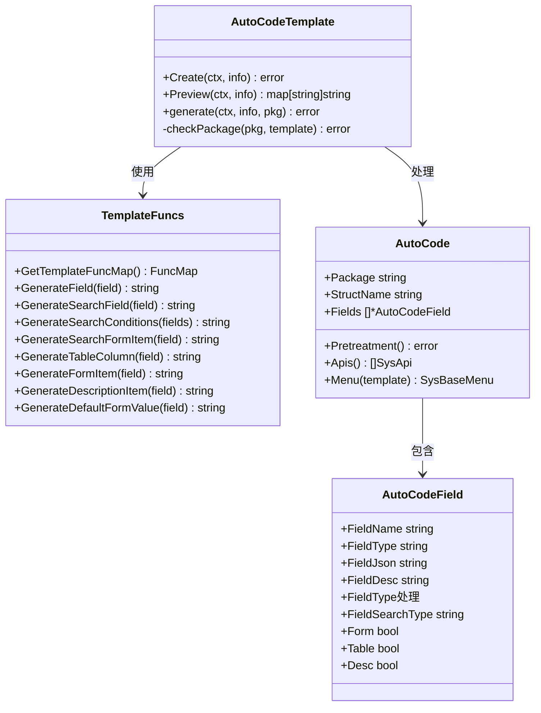
```mermaid
classDiagram
class AutoCodeTemplate {
+Create(ctx, info) error
+Preview(ctx, info) map[string]string
+generate(ctx, info, pkg) error
-checkPackage(pkg, template) error
}
class TemplateFuncs {
+GetTemplateFuncMap() FuncMap
+GenerateField(field) string
+GenerateSearchField(field) string
+GenerateSearchConditions(fields) string
+GenerateSearchFormItem(field) string
+GenerateTableColumn(field) string
+GenerateFormItem(field) string
+GenerateDescriptionItem(field) string
+GenerateDefaultFormValue(field) string
}
class AutoCode {
+Package string
+StructName string
+Fields []*AutoCodeField
+Pretreatment() error
+Apis() []SysApi
+Menu(template) SysBaseMenu
}
class AutoCodeField {
+FieldName string
+FieldType string
+FieldJson string
+FieldDesc string
+FieldType处理
+FieldSearchType string
+Form bool
+Table bool
+Desc bool
}
AutoCodeTemplate --> TemplateFuncs : 使用
AutoCodeTemplate --> AutoCode : 处理
AutoCode --> AutoCodeField : 包含
```

**图表来源**
- [auto_code_template.go:27-200](file://server/service/system/auto_code_template.go#L27-L200)
- [template_funcs.go:12-24](file://server/utils/autocode/template_funcs.go#L12-L24)
- [auto_code.go:13-50](file://server/model/system/request/sys_auto_code.go#L13-L50)

### 组件职责说明

1. **AutoCodeTemplate**: 核心生成器，负责协调整个代码生成流程
2. **TemplateFuncs**: 模板函数集合，提供各种代码生成辅助功能
3. **AutoCode**: 生成配置对象，封装所有生成参数和配置
4. **AutoCodeField**: 字段定义对象，描述单个字段的所有属性

**章节来源**
- [auto_code_template.go:27-200](file://server/service/system/auto_code_template.go#L27-L200)
- [template_funcs.go:12-24](file://server/utils/autocode/template_funcs.go#L12-L24)
- [auto_code.go:13-50](file://server/model/system/request/sys_auto_code.go#L13-L50)

## 架构概览

自动代码生成工具采用分层架构设计，确保各层职责清晰、耦合度低：

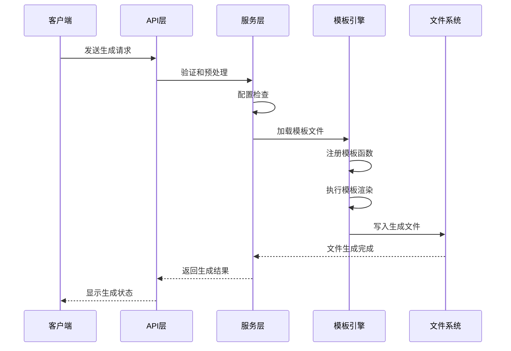
```mermaid
sequenceDiagram
participant Client as 客户端
participant API as API层
participant Service as 服务层
participant Template as 模板引擎
participant FS as 文件系统
Client->>API : 发送生成请求
API->>Service : 验证和预处理
Service->>Service : 配置检查
Service->>Template : 加载模板文件
Template->>Template : 注册模板函数
Template->>Template : 执行模板渲染
Template->>FS : 写入生成文件
FS-->>Service : 文件生成完成
Service-->>API : 返回生成结果
API-->>Client : 显示生成状态
```

**图表来源**
- [auto_code_template.go:58-186](file://server/service/system/auto_code_template.go#L58-L186)
- [sys_auto_code.go:20-85](file://server/api/v1/system/sys_auto_code.go#L20-L85)

系统架构的关键特点：

1. **模板驱动**: 所有代码生成都基于 Go 模板引擎
2. **函数映射**: 通过模板函数映射提供强大的代码生成能力
3. **配置优先**: 通过 AutoCode 配置对象统一管理生成参数
4. **文件管理**: 自动处理文件创建、写入和目录结构

**章节来源**
- [auto_code_template.go:58-186](file://server/service/system/auto_code_template.go#L58-L186)
- [sys_auto_code.go:20-85](file://server/api/v1/system/sys_auto_code.go#L20-L85)

## 详细组件分析

### AutoCodeTemplate 核心服务

AutoCodeTemplate 是整个代码生成系统的核心，负责协调各个组件完成完整的代码生成流程。

#### 核心方法分析

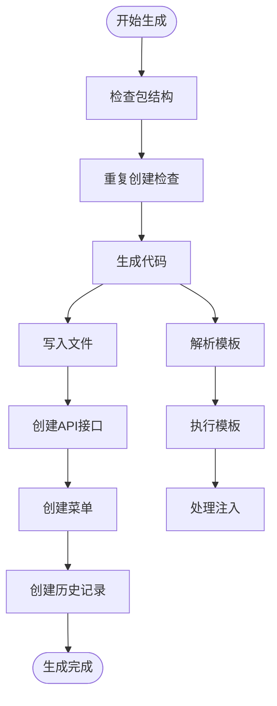
```mermaid
flowchart TD
Start([开始生成]) --> CheckPackage[检查包结构]
CheckPackage --> RepeatCheck[重复创建检查]
RepeatCheck --> Generate[生成代码]
Generate --> WriteFiles[写入文件]
WriteFiles --> CreateAPI[创建API接口]
CreateAPI --> CreateMenu[创建菜单]
CreateMenu --> CreateHistory[创建历史记录]
CreateHistory --> End([生成完成])
Generate --> ParseTemplates[解析模板]
ParseTemplates --> ExecuteTemplates[执行模板]
ExecuteTemplates --> ProcessInjections[处理注入]
```

**图表来源**
- [auto_code_template.go:58-186](file://server/service/system/auto_code_template.go#L58-L186)

#### 预览功能实现

预览功能允许用户在实际生成前查看生成结果：

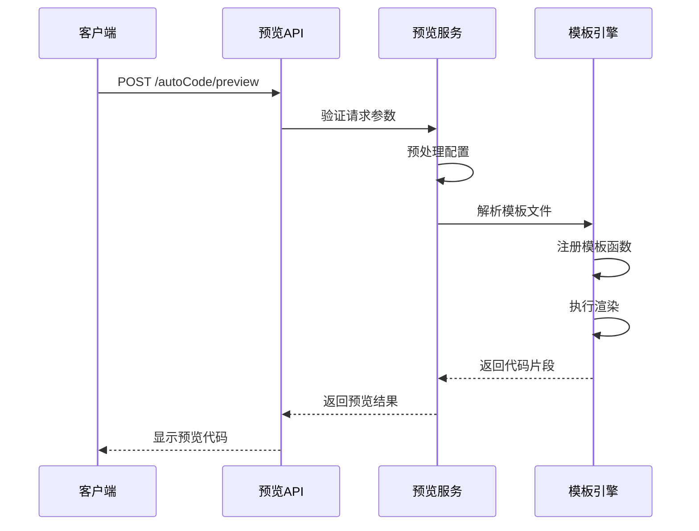
```mermaid
sequenceDiagram
participant Client as 客户端
participant API as 预览API
participant Service as 预览服务
participant Template as 模板引擎
Client->>API : POST /autoCode/preview
API->>Service : 验证请求参数
Service->>Service : 预处理配置
Service->>Template : 解析模板文件
Template->>Template : 注册模板函数
Template->>Template : 执行渲染
Template-->>Service : 返回代码片段
Service-->>API : 返回预览结果
API-->>Client : 显示预览代码
```

**图表来源**
- [sys_auto_code.go:14-42](file://server/api/v1/system/sys_auto_code_template.go#L14-L42)

**章节来源**
- [auto_code_template.go:58-186](file://server/service/system/auto_code_template.go#L58-L186)
- [sys_auto_code.go:14-42](file://server/api/v1/system/sys_auto_code_template.go#L14-L42)

### 模板函数系统

模板函数系统是代码生成工具的核心，提供了丰富的代码生成辅助功能。

#### 函数映射机制

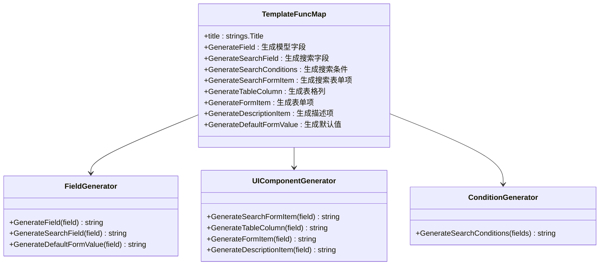
```mermaid
classDiagram
class TemplateFuncMap {
+title : strings.Title
+GenerateField : 生成模型字段
+GenerateSearchField : 生成搜索字段
+GenerateSearchConditions : 生成搜索条件
+GenerateSearchFormItem : 生成搜索表单项
+GenerateTableColumn : 生成表格列
+GenerateFormItem : 生成表单项
+GenerateDescriptionItem : 生成描述项
+GenerateDefaultFormValue : 生成默认值
}
class FieldGenerator {
+GenerateField(field) string
+GenerateSearchField(field) string
+GenerateDefaultFormValue(field) string
}
class UIComponentGenerator {
+GenerateSearchFormItem(field) string
+GenerateTableColumn(field) string
+GenerateFormItem(field) string
+GenerateDescriptionItem(field) string
}
class ConditionGenerator {
+GenerateSearchConditions(fields) string
}
TemplateFuncMap --> FieldGenerator
TemplateFuncMap --> UIComponentGenerator
TemplateFuncMap --> ConditionGenerator
```

**图表来源**
- [template_funcs.go:12-24](file://server/utils/autocode/template_funcs.go#L12-L24)

**章节来源**
- [template_funcs.go:12-24](file://server/utils/autocode/template_funcs.go#L12-L24)

## 模板系统详解

### 模板引擎配置

模板系统基于 Go 的 text/template 包构建，提供了强大的模板渲染能力：

#### 模板加载机制

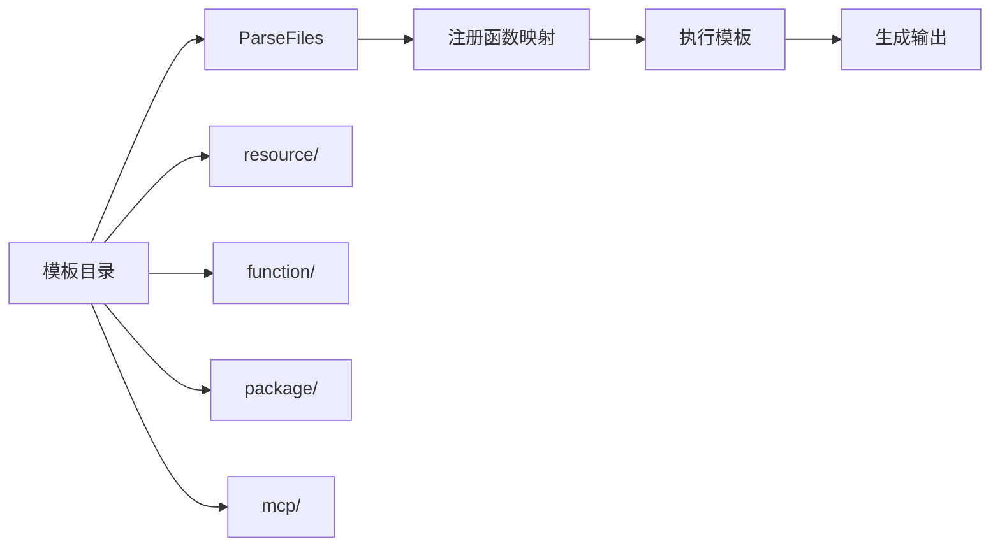
```mermaid
flowchart LR
TemplateDir[模板目录] --> ParseFiles[ParseFiles]
ParseFiles --> FuncMap[注册函数映射]
FuncMap --> Execute[执行模板]
Execute --> Output[生成输出]
TemplateDir --> Resource[resource/]
TemplateDir --> Function[function/]
TemplateDir --> Package[package/]
TemplateDir --> MCP[mcp/]
```

**图表来源**
- [auto_code_template.go:222-238](file://server/service/system/auto_code_template.go#L222-L238)

#### 模板函数注册

模板函数通过 GetTemplateFuncMap 方法统一注册，确保所有模板都能访问相同的函数集合。

**章节来源**
- [auto_code_template.go:222-238](file://server/service/system/auto_code_template.go#L222-L238)
- [template_funcs.go:12-24](file://server/utils/autocode/template_funcs.go#L12-L24)

## 代码生成工作流程

### 完整生成流程

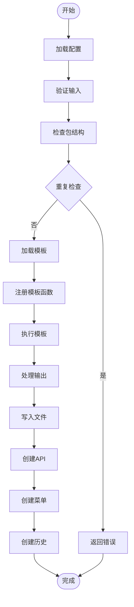
```mermaid
flowchart TD
Start([开始]) --> LoadConfig[加载配置]
LoadConfig --> ValidateInput[验证输入]
ValidateInput --> CheckStructure[检查包结构]
CheckStructure --> RepeatCheck{重复检查}
RepeatCheck --> |是| Error[返回错误]
RepeatCheck --> |否| LoadTemplates[加载模板]
LoadTemplates --> RegisterFuncs[注册模板函数]
RegisterFuncs --> ExecuteTemplates[执行模板]
ExecuteTemplates --> ProcessOutput[处理输出]
ProcessOutput --> WriteFiles[写入文件]
WriteFiles --> CreateAPI[创建API]
CreateAPI --> CreateMenu[创建菜单]
CreateMenu --> CreateHistory[创建历史]
CreateHistory --> End([完成])
Error --> End
```

**图表来源**
- [auto_code_template.go:58-186](file://server/service/system/auto_code_template.go#L58-L186)

### 预览流程

预览流程与完整生成流程类似，但不涉及文件写入操作：

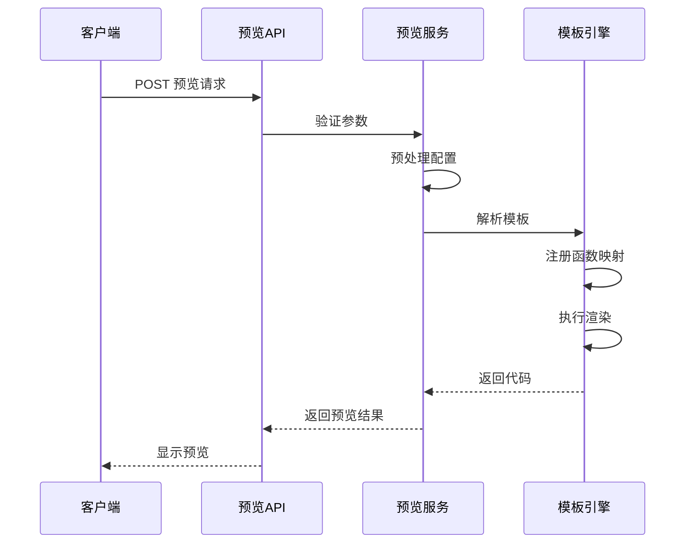
```mermaid
sequenceDiagram
participant Client as 客户端
participant API as 预览API
participant Service as 预览服务
participant Template as 模板引擎
Client->>API : POST 预览请求
API->>Service : 验证参数
Service->>Service : 预处理配置
Service->>Template : 解析模板
Template->>Template : 注册函数映射
Template->>Template : 执行渲染
Template-->>Service : 返回代码
Service-->>API : 返回预览结果
API-->>Client : 显示预览
```

**图表来源**
- [sys_auto_code.go:189-220](file://server/service/system/auto_code_template.go#L189-L220)

**章节来源**
- [auto_code_template.go:58-186](file://server/service/system/auto_code_template.go#L58-L186)
- [sys_auto_code.go:189-220](file://server/service/system/auto_code_template.go#L189-L220)

## 模板文件组织结构

### 模板目录结构

自动代码生成工具的模板文件按照功能和用途进行组织：

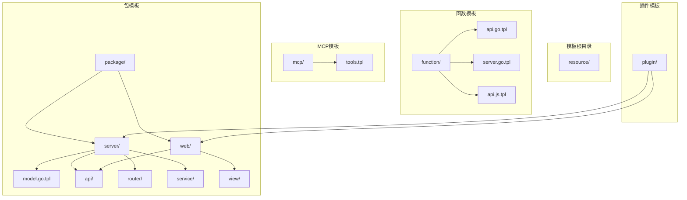
```mermaid
graph TB
subgraph "模板根目录"
Root[resource/]
end
subgraph "函数模板"
Function[function/]
Function --> APIgo[api.go.tpl]
Function --> Servergo[server.go.tpl]
Function --> APIjs[api.js.tpl]
end
subgraph "包模板"
Package[package/]
Package --> Server[server/]
Package --> Web[web/]
Server --> Model[model.go.tpl]
Server --> API[api/]
Server --> Router[router/]
Server --> Service[service/]
Web --> View[view/]
Web --> API[api/]
end
subgraph "MCP模板"
MCP[mcp/]
MCP --> Tools[tools.tpl]
end
subgraph "插件模板"
Plugin[plugin/]
Plugin --> Server[server/]
Plugin --> Web[web/]
end
```

**图表来源**
- [model.go.tpl:1-76](file://server/resource/package/server/model/model.go.tpl#L1-L76)
- [table.vue.tpl:1-695](file://server/resource/package/web/view/table.vue.tpl#L1-L695)
- [tools.tpl:1-57](file://server/resource/mcp/tools.tpl#L1-L57)

### 模板文件类型说明

1. **函数模板**: 用于生成特定功能的代码片段
2. **包模板**: 用于生成完整的包结构和文件
3. **MCP模板**: 用于生成 MCP 工具代码
4. **插件模板**: 用于生成插件相关的代码

**章节来源**
- [model.go.tpl:1-76](file://server/resource/package/server/model/model.go.tpl#L1-L76)
- [table.vue.tpl:1-695](file://server/resource/package/web/view/table.vue.tpl#L1-L695)
- [tools.tpl:1-57](file://server/resource/mcp/tools.tpl#L1-L57)

## 模板函数系统

### 核心模板函数功能

模板函数系统提供了八个核心函数，每个函数都有特定的用途：

#### GenerateField - 字段生成函数

GenerateField 函数负责生成数据库模型字段定义：

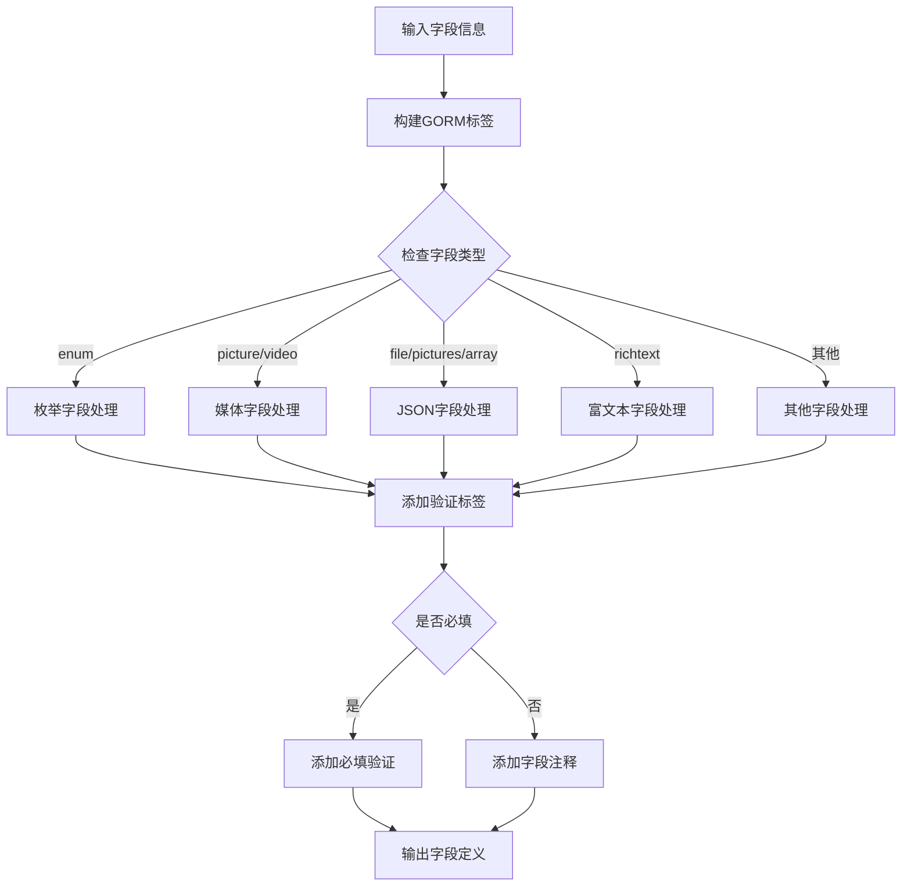
```mermaid
flowchart TD
Input[输入字段信息] --> BuildGormTag[构建GORM标签]
BuildGormTag --> CheckType{检查字段类型}
CheckType --> |enum| EnumField[枚举字段处理]
CheckType --> |picture/video| MediaField[媒体字段处理]
CheckType --> |file/pictures/array| JSONField[JSON字段处理]
CheckType --> |richtext| RichTextField[富文本字段处理]
CheckType --> |其他| OtherField[其他字段处理]
EnumField --> AddValidation[添加验证标签]
MediaField --> AddValidation
JSONField --> AddValidation
RichTextField --> AddValidation
OtherField --> AddValidation
AddValidation --> CheckRequired{是否必填}
CheckRequired --> |是| AddRequired[添加必填验证]
CheckRequired --> |否| AddComment[添加字段注释]
AddRequired --> Output[输出字段定义]
AddComment --> Output
```

**图表来源**
- [template_funcs.go:27-122](file://server/utils/autocode/template_funcs.go#L27-L122)

#### GenerateSearchField - 搜索字段生成

GenerateSearchField 函数专门处理搜索条件字段的生成：

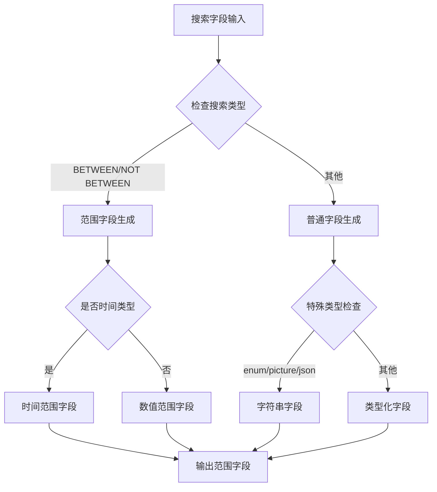
```mermaid
flowchart TD
SearchInput[搜索字段输入] --> CheckSearchType{检查搜索类型}
CheckSearchType --> |BETWEEN/NOT BETWEEN| RangeField[范围字段生成]
CheckSearchType --> |其他| NormalField[普通字段生成]
RangeField --> TimeRange{是否时间类型}
TimeRange --> |是| TimeRangeField[时间范围字段]
TimeRange --> |否| ValueRangeField[数值范围字段]
NormalField --> SpecialType{特殊类型检查}
SpecialType --> |enum/picture/json| StringField[字符串字段]
SpecialType --> |其他| TypedField[类型化字段]
TimeRangeField --> Output[输出范围字段]
ValueRangeField --> Output
StringField --> Output
TypedField --> Output
```

**图表来源**
- [template_funcs.go:679-713](file://server/utils/autocode/template_funcs.go#L679-L713)

#### GenerateSearchConditions - 搜索条件生成

GenerateSearchConditions 函数生成数据库查询条件：

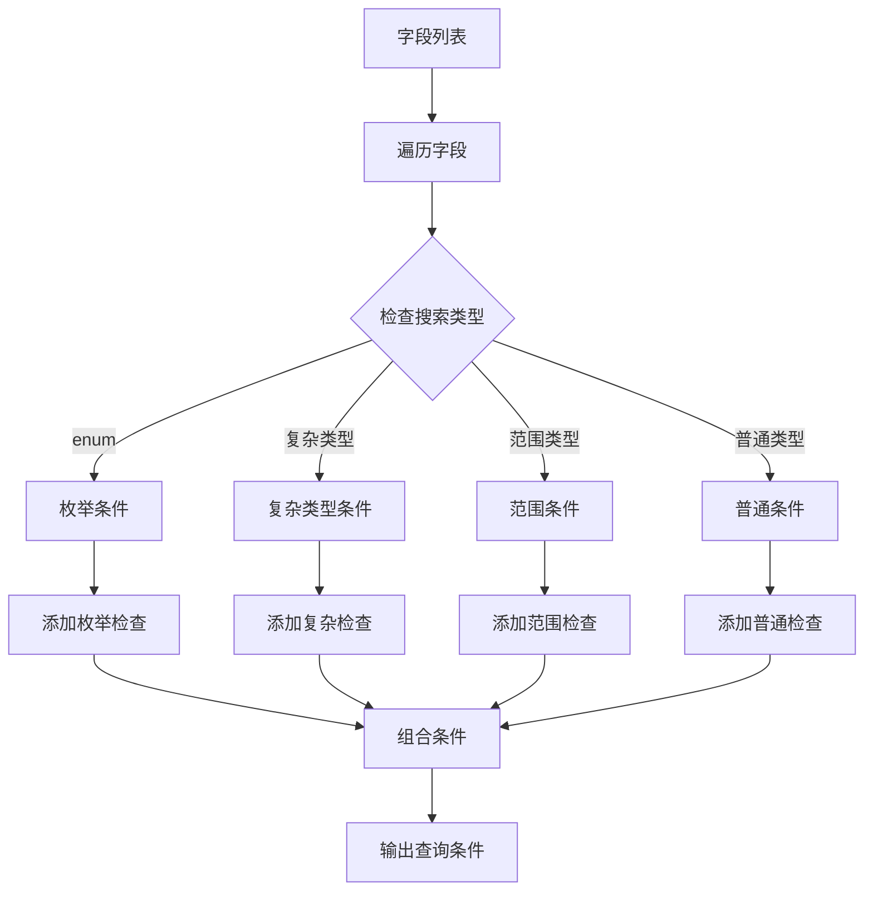
```mermaid
flowchart TD
Fields[字段列表] --> LoopFields[遍历字段]
LoopFields --> CheckSearchType{检查搜索类型}
CheckSearchType --> |enum| EnumCondition[枚举条件]
CheckSearchType --> |复杂类型| ComplexCondition[复杂类型条件]
CheckSearchType --> |范围类型| RangeCondition[范围条件]
CheckSearchType --> |普通类型| NormalCondition[普通条件]
EnumCondition --> AddEnumCheck[添加枚举检查]
ComplexCondition --> AddComplexCheck[添加复杂检查]
RangeCondition --> AddRangeCheck[添加范围检查]
NormalCondition --> AddNormalCheck[添加普通检查]
AddEnumCheck --> CombineConditions[组合条件]
AddComplexCheck --> CombineConditions
AddRangeCheck --> CombineConditions
AddNormalCheck --> CombineConditions
CombineConditions --> Output[输出查询条件]
```

**图表来源**
- [template_funcs.go:125-199](file://server/utils/autocode/template_funcs.go#L125-L199)

#### GenerateSearchFormItem - 搜索表单项生成

GenerateSearchFormItem 函数生成前端搜索表单项：

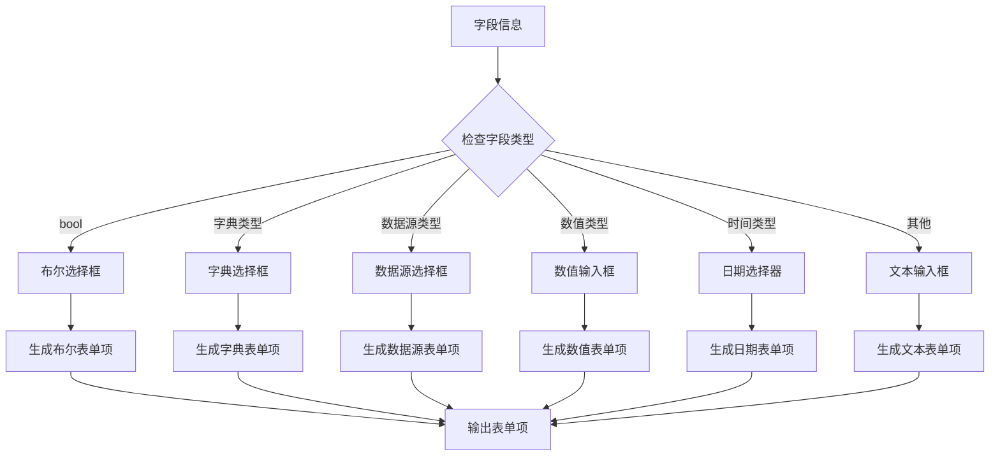
```mermaid
flowchart TD
Field[字段信息] --> CheckFieldType{检查字段类型}
CheckFieldType --> |bool| BoolSelect[布尔选择框]
CheckFieldType --> |字典类型| DictSelect[字典选择框]
CheckFieldType --> |数据源类型| DataSourceSelect[数据源选择框]
CheckFieldType --> |数值类型| NumberInput[数值输入框]
CheckFieldType --> |时间类型| DatePicker[日期选择器]
CheckFieldType --> |其他| TextInput[文本输入框]
BoolSelect --> GenerateBool[生成布尔表单项]
DictSelect --> GenerateDict[生成字典表单项]
DataSourceSelect --> GenerateDataSource[生成数据源表单项]
NumberInput --> GenerateNumber[生成数值表单项]
DatePicker --> GenerateDate[生成日期表单项]
TextInput --> GenerateText[生成文本表单项]
GenerateBool --> Output[输出表单项]
GenerateDict --> Output
GenerateDataSource --> Output
GenerateNumber --> Output
GenerateDate --> Output
GenerateText --> Output
```

**图表来源**
- [template_funcs.go:202-281](file://server/utils/autocode/template_funcs.go#L202-L281)

#### GenerateTableColumn - 表格列生成

GenerateTableColumn 函数生成前端表格列定义：

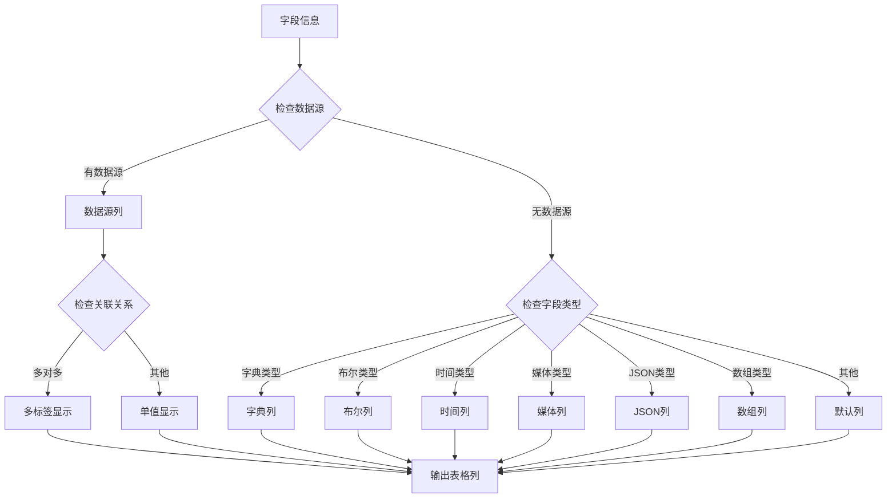
```mermaid
flowchart TD
Field[字段信息] --> CheckDataSource{检查数据源}
CheckDataSource --> |有数据源| DataSourceColumn[数据源列]
CheckDataSource --> |无数据源| CheckFieldType{检查字段类型}
DataSourceColumn --> CheckAssociation{检查关联关系}
CheckAssociation --> |多对多| MultiTag[多标签显示]
CheckAssociation --> |其他| SingleDisplay[单值显示]
CheckFieldType --> |字典类型| DictColumn[字典列]
CheckFieldType --> |布尔类型| BoolColumn[布尔列]
CheckFieldType --> |时间类型| TimeColumn[时间列]
CheckFieldType --> |媒体类型| MediaColumn[媒体列]
CheckFieldType --> |JSON类型| JSONColumn[JSON列]
CheckFieldType --> |数组类型| ArrayColumn[数组列]
CheckFieldType --> |其他| DefaultColumn[默认列]
MultiTag --> Output[输出表格列]
SingleDisplay --> Output
DictColumn --> Output
BoolColumn --> Output
TimeColumn --> Output
MediaColumn --> Output
JSONColumn --> Output
ArrayColumn --> Output
DefaultColumn --> Output
```

**图表来源**
- [template_funcs.go:284-456](file://server/utils/autocode/template_funcs.go#L284-L456)

#### GenerateFormItem - 表单项生成

GenerateFormItem 函数生成前端表单字段：

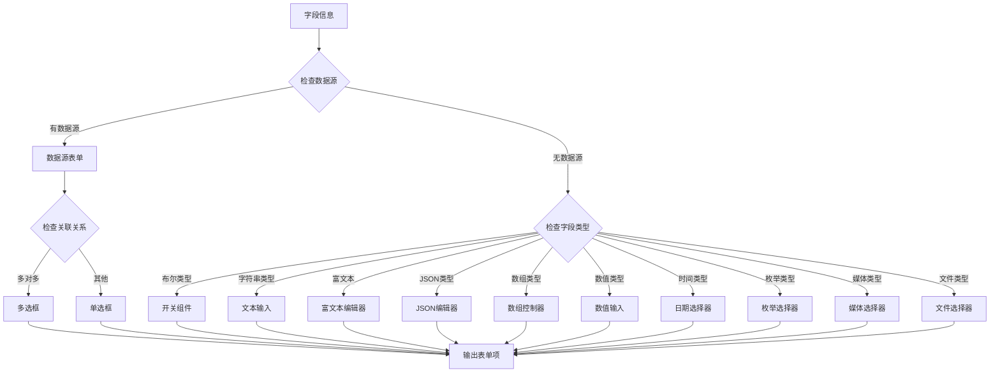
```mermaid
flowchart TD
Field[字段信息] --> CheckDataSource{检查数据源}
CheckDataSource --> |有数据源| DataSourceForm[数据源表单]
CheckDataSource --> |无数据源| CheckFieldType{检查字段类型}
DataSourceForm --> CheckAssociation{检查关联关系}
CheckAssociation --> |多对多| MultiSelect[多选框]
CheckAssociation --> |其他| SingleSelect[单选框]
CheckFieldType --> |布尔类型| BoolSwitch[开关组件]
CheckFieldType --> |字符串类型| StringInput[文本输入]
CheckFieldType --> |富文本| RichText[富文本编辑器]
CheckFieldType --> |JSON类型| JSONEditor[JSON编辑器]
CheckFieldType --> |数组类型| ArrayCtrl[数组控制器]
CheckFieldType --> |数值类型| NumberInput[数值输入]
CheckFieldType --> |时间类型| DateInput[日期选择器]
CheckFieldType --> |枚举类型| EnumSelect[枚举选择器]
CheckFieldType --> |媒体类型| MediaSelector[媒体选择器]
CheckFieldType --> |文件类型| FileSelector[文件选择器]
MultiSelect --> Output[输出表单项]
SingleSelect --> Output
BoolSwitch --> Output
StringInput --> Output
RichText --> Output
JSONEditor --> Output
ArrayCtrl --> Output
NumberInput --> Output
DateInput --> Output
EnumSelect --> Output
MediaSelector --> Output
FileSelector --> Output
```

**图表来源**
- [template_funcs.go:458-577](file://server/utils/autocode/template_funcs.go#L458-L577)

#### GenerateDescriptionItem - 描述项生成

GenerateDescriptionItem 函数生成详情页面的描述项：

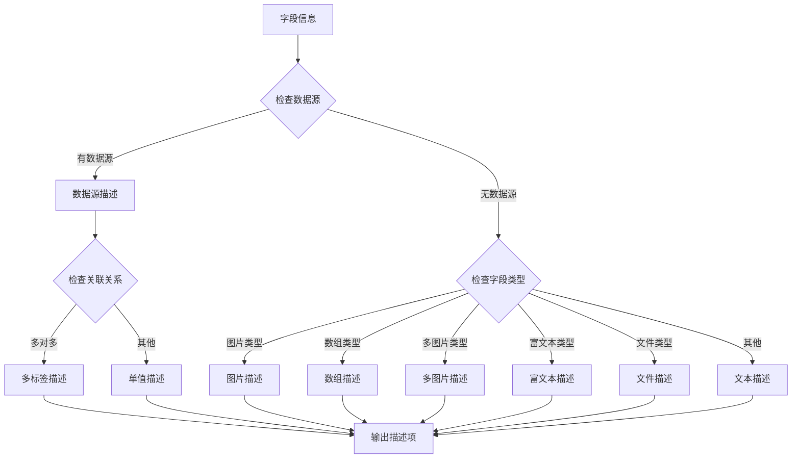
```mermaid
flowchart TD
Field[字段信息] --> CheckDataSource{检查数据源}
CheckDataSource --> |有数据源| DataSourceDesc[数据源描述]
CheckDataSource --> |无数据源| CheckFieldType{检查字段类型}
DataSourceDesc --> CheckAssociation{检查关联关系}
CheckAssociation --> |多对多| MultiTagDesc[多标签描述]
CheckAssociation --> |其他| SingleDesc[单值描述]
CheckFieldType --> |图片类型| ImageDesc[图片描述]
CheckFieldType --> |数组类型| ArrayDesc[数组描述]
CheckFieldType --> |多图片类型| MultiImageDesc[多图片描述]
CheckFieldType --> |富文本类型| RichTextDesc[富文本描述]
CheckFieldType --> |文件类型| FileDesc[文件描述]
CheckFieldType --> |其他| TextDesc[文本描述]
MultiTagDesc --> Output[输出描述项]
SingleDesc --> Output
ImageDesc --> Output
ArrayDesc --> Output
MultiImageDesc --> Output
RichTextDesc --> Output
FileDesc --> Output
TextDesc --> Output
```

**图表来源**
- [template_funcs.go:579-643](file://server/utils/autocode/template_funcs.go#L579-L643)

#### GenerateDefaultFormValue - 默认表单值生成

GenerateDefaultFormValue 函数生成表单默认值：

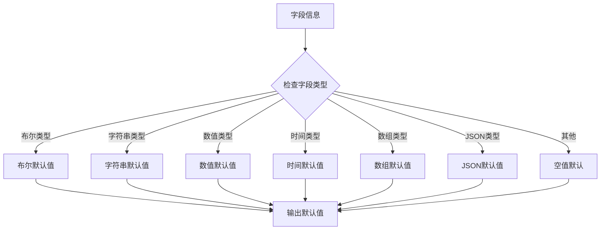
```mermaid
flowchart TD
Field[字段信息] --> CheckFieldType{检查字段类型}
CheckFieldType --> |布尔类型| BoolDefault[布尔默认值]
CheckFieldType --> |字符串类型| StringDefault[字符串默认值]
CheckFieldType --> |数值类型| NumberDefault[数值默认值]
CheckFieldType --> |时间类型| TimeDefault[时间默认值]
CheckFieldType --> |数组类型| ArrayDefault[数组默认值]
CheckFieldType --> |JSON类型| JSONDefault[JSON默认值]
CheckFieldType --> |其他| NullDefault[空值默认]
BoolDefault --> Output[输出默认值]
StringDefault --> Output
NumberDefault --> Output
TimeDefault --> Output
ArrayDefault --> Output
JSONDefault --> Output
NullDefault --> Output
```

**图表来源**
- [template_funcs.go:645-676](file://server/utils/autocode/template_funcs.go#L645-L676)

**章节来源**
- [template_funcs.go:27-122](file://server/utils/autocode/template_funcs.go#L27-L122)
- [template_funcs.go:125-199](file://server/utils/autocode/template_funcs.go#L125-L199)
- [template_funcs.go:202-281](file://server/utils/autocode/template_funcs.go#L202-L281)
- [template_funcs.go:284-456](file://server/utils/autocode/template_funcs.go#L284-L456)
- [template_funcs.go:458-577](file://server/utils/autocode/template_funcs.go#L458-L577)
- [template_funcs.go:579-643](file://server/utils/autocode/template_funcs.go#L579-L643)
- [template_funcs.go:645-676](file://server/utils/autocode/template_funcs.go#L645-L676)

## 字段类型处理机制

### 字段类型识别系统

自动代码生成工具实现了完善的字段类型识别和处理机制，能够处理各种数据库字段类型：

#### 字段类型映射表

| 字段类型 | Go类型 | JSON类型 | GORM标签 | 特殊处理 |
|---------|--------|----------|----------|----------|
| string | string | string | `json:"field" form:"field" gorm:"column:field"` | 标准字符串处理 |
| int | int64 | number | `json:"field" form:"field" gorm:"column:field"` | 根据长度调整类型 |
| bool | bool | boolean | `json:"field" form:"field" gorm:"column:field"` | 布尔类型处理 |
| float64 | float64 | number | `json:"field" form:"field" gorm:"column:field"` | 浮点数处理 |
| time.Time | time.Time | string | `json:"field" form:"field" gorm:"column:field"` | 时间类型处理 |
| enum | string | string | `gorm:"type:enum(enum_values)"` | 枚举类型处理 |
| json | datatypes.JSON | object | `gorm:"type:json"` | JSON类型处理 |
| array | datatypes.JSON | array | `gorm:"type:json"` | 数组类型处理 |
| picture | string | string | `gorm:"type:varchar"` | 单图片处理 |
| pictures | datatypes.JSON | array | `gorm:"type:json"` | 多图片处理 |
| video | string | string | `gorm:"type:varchar"` | 视频类型处理 |
| file | datatypes.JSON | array | `gorm:"type:json"` | 文件类型处理 |
| richtext | *string | string | `gorm:"type:text"` | 富文本处理 |

#### 字段类型处理流程

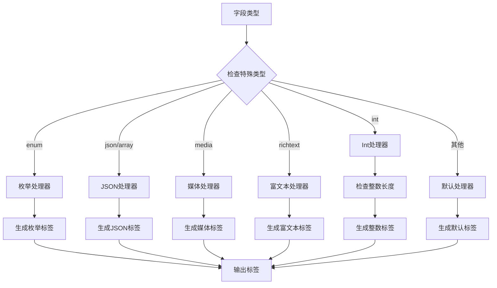
```mermaid
flowchart TD
FieldType[字段类型] --> CheckSpecialType{检查特殊类型}
CheckSpecialType --> |enum| EnumHandler[枚举处理器]
CheckSpecialType --> |json/array| JSONHandler[JSON处理器]
CheckSpecialType --> |media| MediaHandler[媒体处理器]
CheckSpecialType --> |richtext| RichTextHandler[富文本处理器]
CheckSpecialType --> |int| IntHandler[Int处理器]
CheckSpecialType --> |其他| DefaultHandler[默认处理器]
EnumHandler --> GenerateEnumTag[生成枚举标签]
JSONHandler --> GenerateJSONTag[生成JSON标签]
MediaHandler --> GenerateMediaTag[生成媒体标签]
RichTextHandler --> GenerateRichTextTag[生成富文本标签]
IntHandler --> CheckIntLength[检查整数长度]
CheckIntLength --> GenerateIntTag[生成整数标签]
DefaultHandler --> GenerateDefaultTag[生成默认标签]
GenerateEnumTag --> Output[输出标签]
GenerateJSONTag --> Output
GenerateMediaTag --> Output
GenerateRichTextTag --> Output
GenerateIntTag --> Output
GenerateDefaultTag --> Output
```

**图表来源**
- [template_funcs.go:27-122](file://server/utils/autocode/template_funcs.go#L27-L122)

**章节来源**
- [template_funcs.go:27-122](file://server/utils/autocode/template_funcs.go#L27-L122)

## 搜索条件生成系统

### 搜索条件处理机制

搜索条件生成系统能够根据不同字段类型和搜索需求生成相应的查询条件：

#### 搜索类型分类

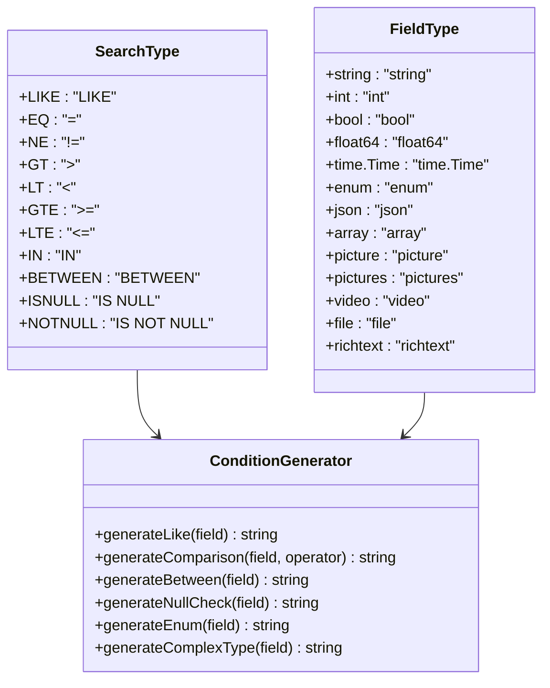
```mermaid
classDiagram
class SearchType {
+LIKE : "LIKE"
+EQ : "="
+NE : "!="
+GT : ">"
+LT : "<"
+GTE : ">="
+LTE : "<="
+IN : "IN"
+BETWEEN : "BETWEEN"
+ISNULL : "IS NULL"
+NOTNULL : "IS NOT NULL"
}
class FieldType {
+string : "string"
+int : "int"
+bool : "bool"
+float64 : "float64"
+time.Time : "time.Time"
+enum : "enum"
+json : "json"
+array : "array"
+picture : "picture"
+pictures : "pictures"
+video : "video"
+file : "file"
+richtext : "richtext"
}
class ConditionGenerator {
+generateLike(field) string
+generateComparison(field, operator) string
+generateBetween(field) string
+generateNullCheck(field) string
+generateEnum(field) string
+generateComplexType(field) string
}
SearchType --> ConditionGenerator
FieldType --> ConditionGenerator
```

**图表来源**
- [template_funcs.go:125-199](file://server/utils/autocode/template_funcs.go#L125-L199)

#### 搜索条件生成流程

```mermaid
flowchart TD
SearchField[搜索字段] --> CheckSearchType{检查搜索类型}
CheckSearchType --> |LIKE| LikeCondition[LIKE条件]
CheckSearchType --> |范围类型| RangeCondition[范围条件]
CheckSearchType --> |枚举类型| EnumCondition[枚举条件]
CheckSearchType --> |复杂类型| ComplexCondition[复杂条件]
CheckSearchType --> |普通类型| NormalCondition[普通条件]
LikeCondition --> CheckStringType{检查字符串类型}
CheckStringType --> |枚举| EnumLike[枚举LIKE]
CheckStringType --> |其他| StringLike[字符串LIKE]
RangeCondition --> CheckRangeType{检查范围类型}
CheckRangeType --> |时间类型| TimeRange[时间范围]
CheckRangeType --> |数值类型| NumberRange[数值范围]
EnumCondition --> GenerateEnumQuery[生成枚举查询]
ComplexCondition --> GenerateComplexQuery[生成复杂查询]
StringLike --> GenerateLikeQuery[生成LIKE查询]
TimeRange --> GenerateTimeRange[生成时间范围]
NumberRange --> GenerateNumberRange[生成数值范围]
NormalCondition --> GenerateNormalQuery[生成普通查询]
GenerateEnumQuery --> Output[输出查询条件]
GenerateComplexQuery --> Output
GenerateLikeQuery --> Output
GenerateTimeRange --> Output
GenerateNumberRange --> Output
GenerateNormalQuery --> Output
```

**图表来源**
- [template_funcs.go:125-199](file://server/utils/autocode/template_funcs.go#L125-L199)

**章节来源**
- [template_funcs.go:125-199](file://server/utils/autocode/template_funcs.go#L125-L199)

## 表单组件生成系统

### 前端组件生成机制

表单组件生成系统能够根据字段类型自动生成相应的前端组件代码：

#### 组件类型映射

```mermaid
graph TB
subgraph "表单组件"
BoolSwitch[BoolSwitch<br/>布尔开关]
TextInput[TextInput<br/>文本输入框]
NumberInput[NumberInput<br/>数值输入框]
Datepicker[DatePicker<br/>日期选择器]
Select[Select<br/>下拉选择器]
TreeSelect[TreeSelect<br/>树形选择器]
RichEdit[RichEdit<br/>富文本编辑器]
JSONEditor[JSONEditor<br/>JSON编辑器]
ArrayCtrl[ArrayCtrl<br/>数组控制器]
MediaSelector[MediaSelector<br/>媒体选择器]
FileSelector[FileSelector<br/>文件选择器]
end
subgraph "字段类型"
BoolType[bool]
StringType[string]
IntType[int]
FloatType[float64]
TimeType[time.Time]
EnumType[enum]
JsonType[json]
ArrayType[array]
PictureType[picture]
PicturesType[pictures]
VideoType[video]
FileType[file]
RichTextType[richtext]
end
BoolType --> BoolSwitch
StringType --> TextInput
IntType --> NumberInput
FloatType --> NumberInput
TimeType --> Datepicker
EnumType --> Select
JsonType --> JSONEditor
ArrayType --> ArrayCtrl
PictureType --> MediaSelector
PicturesType --> MediaSelector
VideoType --> MediaSelector
FileType --> FileSelector
RichTextType --> RichEdit
```

**图表来源**
- [template_funcs.go:458-577](file://server/utils/autocode/template_funcs.go#L458-L577)

#### 组件生成流程

```mermaid
flowchart TD
Field[字段信息] --> CheckDataSource{检查数据源}
CheckDataSource --> |有数据源| DataSourceComponent[数据源组件]
CheckDataSource --> |无数据源| CheckFieldType{检查字段类型}
DataSourceComponent --> CheckAssociation{检查关联关系}
CheckAssociation --> |多对多| MultiSelect[多选组件]
CheckAssociation --> |一对一| SingleSelect[单选组件]
CheckFieldType --> |布尔类型| BoolComponent[布尔组件]
CheckFieldType --> |字符串类型| StringComponent[字符串组件]
CheckFieldType --> |数值类型| NumberComponent[数值组件]
CheckFieldType --> |时间类型| DateComponent[日期组件]
CheckFieldType --> |枚举类型| EnumComponent[枚举组件]
CheckFieldType --> |JSON类型| JSONComponent[JSON组件]
CheckFieldType --> |数组类型| ArrayComponent[数组组件]
CheckFieldType --> |媒体类型| MediaComponent[媒体组件]
CheckFieldType --> |文件类型| FileComponent[文件组件]
CheckFieldType --> |富文本| RichTextComponent[富文本组件]
BoolComponent --> Output[输出组件代码]
StringComponent --> Output
NumberComponent --> Output
DateComponent --> Output
EnumComponent --> Output
JSONComponent --> Output
ArrayComponent --> Output
MediaComponent --> Output
FileComponent --> Output
RichTextComponent --> Output
MultiSelect --> Output
SingleSelect --> Output
```

**图表来源**
- [template_funcs.go:458-577](file://server/utils/autocode/template_funcs.go#L458-L577)

**章节来源**
- [template_funcs.go:458-577](file://server/utils/autocode/template_funcs.go#L458-L577)

## 定制化最佳实践

### 模板函数定制

模板函数系统提供了灵活的定制机制，允许开发者根据项目需求进行扩展：

#### 自定义模板函数

```go
// 示例：添加自定义模板函数
func GetCustomTemplateFuncMap() template.FuncMap {
    funcMap := GetTemplateFuncMap()
    funcMap["customFunction"] = CustomFunction
    return funcMap
}

func CustomFunction(args ...interface{}) string {
    // 自定义逻辑实现
    return result
}
```

#### 字段映射规则定制

```go
// 示例：自定义字段映射
func CustomFieldMapping(field *AutoCodeField) string {
    // 自定义字段映射逻辑
    return mappedField
}
```

#### 生成规则配置

```yaml
# 自定义生成规则配置
auto_code:
  web: "web/"
  server: "server/"
  root: ""
  module: "github.com/example/project"
  ai-path: "ai/"
  
  # 自定义模板规则
  template_rules:
    - field_type: "custom_type"
      template: "custom.tpl"
      generator: "CustomGenerator"
```

### 模板定制策略

#### 模板继承机制

```mermaid
classDiagram
class BaseTemplate {
+common_fields : []Field
+common_components : []Component
+base_generation() string
}
class CustomTemplate {
+extends BaseTemplate
+override_fields : []Field
+override_components : []Component
+custom_generation() string
}
class PluginTemplate {
+extends BaseTemplate
+plugin_specific : bool
+plugin_generation() string
}
BaseTemplate <|-- CustomTemplate
BaseTemplate <|-- PluginTemplate
```

**图表来源**
- [auto_code_template.go:304-331](file://server/service/system/auto_code_template.go#L304-L331)

#### 模板覆盖策略

1. **全局覆盖**: 修改基础模板文件
2. **局部覆盖**: 在特定包中提供自定义模板
3. **条件覆盖**: 根据字段类型动态选择模板

**章节来源**
- [auto_code_template.go:304-331](file://server/service/system/auto_code_template.go#L304-L331)

## 性能考虑

### 模板渲染优化

自动代码生成工具在性能方面采用了多项优化措施：

#### 模板缓存机制

```mermaid
flowchart TD
TemplateLoad[模板加载] --> CheckCache{检查缓存}
CheckCache --> |命中| UseCached[使用缓存模板]
CheckCache --> |未命中| ParseTemplate[解析模板]
ParseTemplate --> CacheTemplate[缓存模板]
CacheTemplate --> UseCached
UseCached --> RenderTemplate[渲染模板]
RenderTemplate --> ExecuteTemplate[执行模板]
ExecuteTemplate --> Output[输出结果]
```

**图表来源**
- [auto_code_template.go:222-238](file://server/service/system/auto_code_template.go#L222-L238)

#### 并行处理优化

系统支持并行模板处理，提高大量文件生成的效率：

```go
// 并行模板处理示例
var wg sync.WaitGroup
for _, template := range templates {
    wg.Add(1)
    go func(t template.Template) {
        defer wg.Done()
        t.Execute(&buffer, data)
    }(template)
}
wg.Wait()
```

### 内存管理

1. **缓冲区复用**: 使用 strings.Builder 复用缓冲区
2. **模板缓存**: 缓存已解析的模板以避免重复解析
3. **垃圾回收**: 及时释放不再使用的内存

## 故障排除指南

### 常见问题及解决方案

#### 模板加载失败

**问题症状**: 模板文件无法加载或解析错误

**解决方案**:
1. 检查模板文件路径是否正确
2. 验证模板语法是否符合 Go 模板规范
3. 确认模板函数是否正确注册

#### 代码生成错误

**问题症状**: 生成的代码存在语法错误

**解决方案**:
1. 检查 AutoCode 配置是否正确
2. 验证字段类型映射是否准确
3. 确认模板函数参数传递是否正确

#### 文件写入失败

**问题症状**: 生成的文件无法写入目标目录

**解决方案**:
1. 检查目标目录权限
2. 验证磁盘空间是否充足
3. 确认文件名是否合法

### 调试技巧

#### 日志记录

系统提供了详细的日志记录功能，便于问题诊断：

```go
// 调试日志示例
global.GVA_LOG.Debug("模板文件路径", zap.String("path", filePath))
global.GVA_LOG.Debug("模板渲染结果", zap.String("result", result))
```

#### 错误处理

```go
// 错误处理示例
if err != nil {
    global.GVA_LOG.Error("代码生成失败", zap.Error(err))
    return errors.Wrapf(err, "生成文件失败: %s", fileName)
}
```

**章节来源**
- [auto_code_template.go:222-238](file://server/service/system/auto_code_template.go#L222-L238)

## 结论

自动代码生成工具通过精心设计的模板系统和模板函数机制，实现了从数据库模型到前后端代码的完整自动化生成。该系统具有以下核心优势：

1. **高度可定制**: 支持模板覆盖、函数扩展和配置定制
2. **类型安全**: 完善的字段类型处理和验证机制
3. **性能优化**: 模板缓存、并行处理等优化措施
4. **易于维护**: 清晰的架构设计和模块化组织

通过合理利用模板函数系统和定制化机制，开发者可以快速适应不同的项目需求，显著提升开发效率。建议在实际项目中结合团队规范和业务需求，制定合适的模板定制策略，充分发挥该工具的价值。