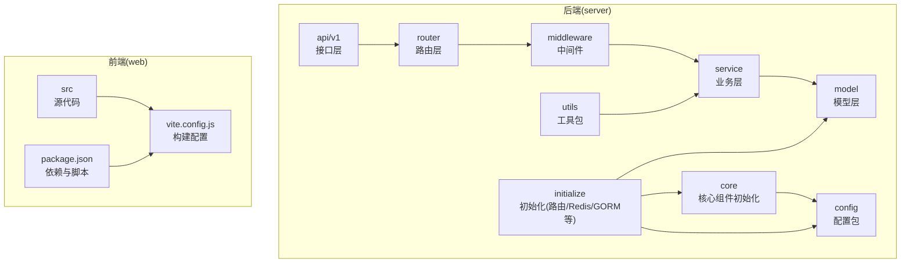
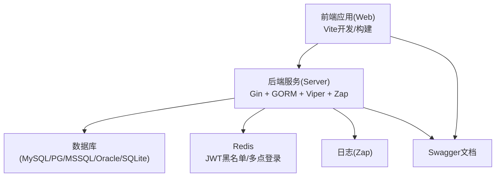
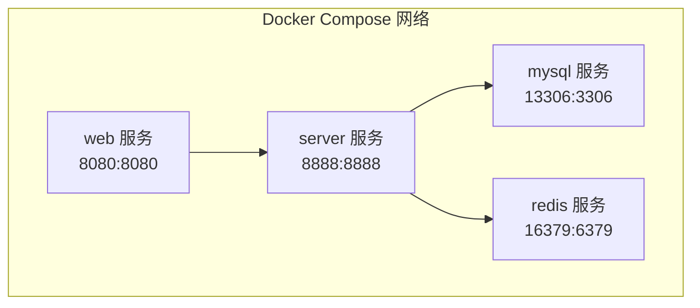
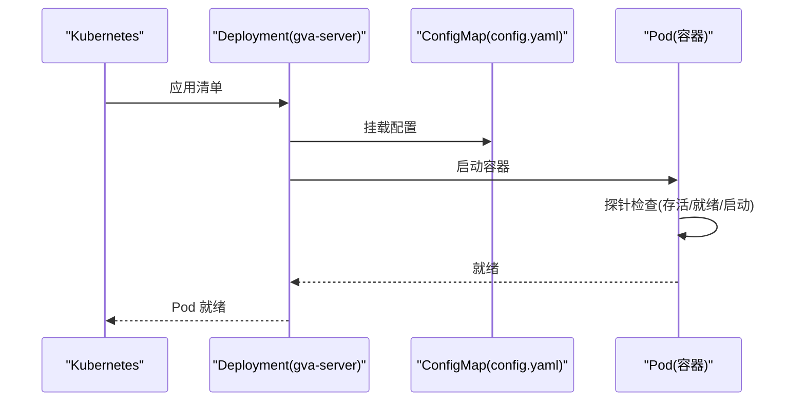
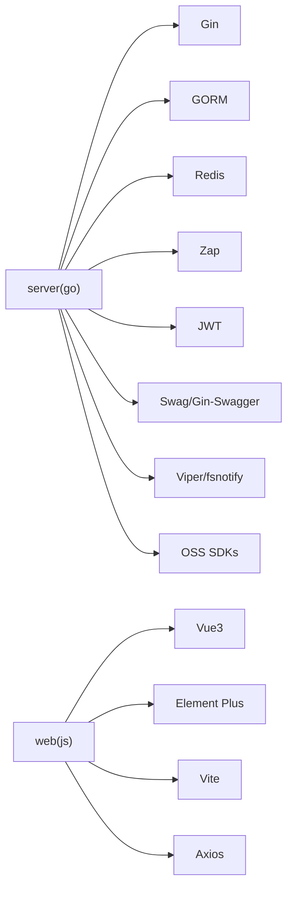

# 快速开始

<cite>
**本文引用的文件**
- [README.md](file://README.md)
- [repowiki\zh\content\快速开始.md](file://repowiki/zh/content/快速开始.md)
- [server/config.yaml](file://server/config.yaml)
- [server/config.docker.yaml](file://server/config.docker.yaml)
- [server/config/config.go](file://server/config/config.go)
- [server/go.mod](file://server/go.mod)
- [web/package.json](file://web/package.json)
- [web/vite.config.js](file://web/vite.config.js)
- [web/.env.development](file://web/.env.development)
- [web/.env.production](file://web/.env.production)
- [deploy/docker-compose/docker-compose.yaml](file://deploy/docker-compose/docker-compose.yaml)
- [server/Dockerfile](file://server/Dockerfile)
- [web/Dockerfile](file://web/Dockerfile)
- [Makefile](file://Makefile)
</cite>

## 目录
1. [简介](#简介)
2. [项目结构](#项目结构)
3. [核心组件](#核心组件)
4. [架构总览](#架构总览)
5. [详细组件分析](#详细组件分析)
6. [依赖分析](#依赖分析)
7. [性能考虑](#性能考虑)
8. [故障排除指南](#故障排除指南)
9. [结论](#结论)
10. [附录](#附录)

## 简介
本指南面向首次接触 Gin-Vue-Admin 的开发者，目标是在最短时间内完成环境准备、安装部署与启动验证。文档覆盖以下场景：
- 环境要求：Node.js、Go 语言版本与推荐 IDE
- 三种部署方式：本地开发、Docker Compose 编排、Kubernetes 部署
- 关键配置项：数据库、Redis、JWT、跨域、日志、文件存储等
- 启动命令与验证步骤
- 常见问题与故障排除

## 项目结构
项目采用前后端分离架构，后端基于 Go + Gin，前端基于 Vue 3 + Element Plus。根目录包含 server、web、deploy、docs 等子目录；后端按层次划分 api、config、core、initialize、middleware、model、router、service、utils 等模块。

图表来源
- [repowiki\zh\content\快速开始.md:44-73](file://repowiki/zh/content/快速开始.md#L44-L73)

章节来源
- [repowiki\zh\content\快速开始.md:41-82](file://repowiki/zh/content/快速开始.md#L41-L82)

## 核心组件
- 后端核心启动入口负责初始化配置、日志、数据库、定时任务、全局处理器与表结构注册，随后启动 HTTP 服务。
- 前端通过 Vite 开发服务器提供热重载，生产环境打包构建静态资源。
- 配置系统采用 YAML 文件并通过 Viper 加载，支持多数据库、Redis、Mongo、OSS 等扩展配置。

章节来源
- [repowiki\zh\content\快速开始.md:83-91](file://repowiki/zh/content/快速开始.md#L83-L91)

## 架构总览
后端服务对外提供 REST API，前端通过 Axios 访问后端接口；Redis 用于 JWT 黑名单与多点登录控制；数据库支持 MySQL、PostgreSQL、SQL Server、Oracle、SQLite 等；日志使用 Zap；Swagger 自动生成 API 文档。

图表来源
- [README.md:183-192](file://README.md#L183-L192)
- [server/config.yaml:101-160](file://server/config.yaml#L101-L160)
- [server/config.yaml:21-45](file://server/config.yaml#L21-L45)

章节来源
- [README.md:183-192](file://README.md#L183-L192)
- [server/config.yaml:1-284](file://server/config.yaml#L1-L284)

## 详细组件分析

### 环境要求与 IDE 推荐
- Node.js 版本要求：大于等于 v18.16.0
- Go 语言版本：建议使用 v1.22 及以上（go.mod 显示模块使用 go 1.24）
- IDE 推荐：GoLand（后端）、VSCode（工作区配置 gin-vue-admin.code-workspace，支持后端/前端/双端任务）

章节来源
- [README.md:109-113](file://README.md#L109-L113)
- [README.md:164-182](file://README.md#L164-L182)
- [server/go.mod:1-6](file://server/go.mod#L1-L6)

### 本地开发环境搭建
- 后端
  - 进入 server 目录，使用 Go Modules 安装依赖并运行
  - 建议使用 GoLand 打开 server 目录，避免在根目录打开导致工具链定位问题
- 前端
  - 进入 web 目录，安装依赖并启动开发服务器
  - 生产构建与测试命令在 package.json 中定义

章节来源
- [README.md:115-145](file://README.md#L115-L145)
- [web/package.json:1-88](file://web/package.json#L1-L88)

### Docker Compose 编排部署
- compose 文件定义了 web、server、mysql、redis 四个服务，使用自定义网络与固定 IP，实现服务间稳定通信
- mysql 与 redis 提供健康检查，server 依赖两者健康后再启动
- 前端服务暴露 8080，后端服务暴露 8888；数据库与缓存使用卷持久化

图表来源
- [deploy/docker-compose/docker-compose.yaml:16-91](file://deploy/docker-compose/docker-compose.yaml#L16-L91)

章节来源
- [deploy/docker-compose/docker-compose.yaml:1-91](file://deploy/docker-compose/docker-compose.yaml#L1-91)

### Kubernetes 部署
- 服务器部署使用 ConfigMap 挂载配置文件，容器暴露 8888 端口，设置存活/就绪/启动探针
- 镜像拉取策略为 Always，资源限制与请求已配置，便于集群调度

图表来源
- [repowiki\zh\content\快速开始.md:186-209](file://repowiki/zh/content/快速开始.md#L186-L209)

章节来源
- [repowiki\zh\content\快速开始.md:186-209](file://repowiki/zh/content/快速开始.md#L186-L209)

### 配置文件设置详解
- 通用配置结构
  - JWT：签名密钥、过期时间、缓冲时间、签发方
  - 日志(Zap)：级别、格式、输出目录、保留天数等
  - Redis：单实例与列表配置，支持集群地址
  - MongoDB：连接参数、池大小、超时等
  - 邮件：SMTP 参数与发件人信息
  - 系统(System)：运行环境、监听端口、数据库类型、OSS 类型、是否启用 Redis/Mongo、多点登录开关、IP 限制、路由前缀、严格权限模式、自动迁移开关
  - 验证码：长度、宽高、开启策略与超时
  - 数据库连接：MySQL、PG、Oracle、MSSQL、SQLite 的连接参数与连接池配置
  - OSS：本地、七牛、阿里云、腾讯云、AWS S3、Cloudflare R2、华为 OBS 等配置
  - Excel：导入导出目录
  - 跨域(CORS)：严格白名单模式与放行规则
  - MCP：插件管理器配置

- 本地与容器差异
  - 本地使用 server/config.yaml
  - 容器编排使用 server/config.docker.yaml，其中 Redis 地址与集群节点按 compose 网络调整

章节来源
- [server/config.yaml:1-284](file://server/config.yaml#L1-L284)
- [server/config.docker.yaml:1-283](file://server/config.docker.yaml#L1-L283)
- [server/config/config.go:1-41](file://server/config/config.go#L1-L41)

### 启动命令与验证步骤
- 本地开发
  - 后端：进入 server 目录，安装依赖后运行主程序
  - 前端：进入 web 目录，安装依赖后启动开发服务器
- Swagger 文档
  - 安装 swag 工具，在 server 目录执行初始化命令生成文档文件，启动后访问相应页面查看
- 验证
  - 后端：访问服务端口，查看日志与接口响应
  - 前端：访问前端端口，登录系统并检查页面功能
  - Swagger：访问文档页面，核对接口定义

章节来源
- [README.md:115-162](file://README.md#L115-L162)

### 构建与打包（可选）
- Makefile 提供容器化构建与打包命令，支持分别构建前端、后端与整体打包，以及生成 Swagger 文档与插件打包

章节来源
- [Makefile:1-76](file://Makefile#L1-L76)

## 依赖分析
- 后端依赖
  - Web 框架：Gin
  - ORM：GORM（支持多数据库驱动）
  - 缓存：Redis 客户端
  - 日志：Zap
  - 鉴权：JWT
  - 文档：Swag + Gin-Swagger
  - 配置：Viper + fsnotify
  - 其他：Casbin、MongoDB 驱动、AWS/七牛/阿里云等对象存储 SDK

- 前端依赖
  - 框架：Vue 3 + Element Plus
  - 构建：Vite
  - 状态管理：Pinia
  - 工具：Axios、Markdown 渲染、图表库等

图表来源
- [server/go.mod:7-61](file://server/go.mod#L7-L61)
- [web/package.json:14-57](file://web/package.json#L14-L57)

章节来源
- [server/go.mod:1-208](file://server/go.mod#L1-L208)
- [web/package.json:1-88](file://web/package.json#L1-L88)

## 性能考虑
- 连接池与并发
  - 数据库连接池参数可在配置中调整最大空闲与最大打开连接数
  - Redis 连接池大小与超时参数可按业务峰值优化
- 日志与监控
  - 使用 Zap 输出到文件并设置保留天数，避免磁盘占用
  - 启用探针与健康检查，结合容器编排实现弹性伸缩
- 前端构建
  - 生产构建开启压缩与 Tree Shaking，减少包体积
  - 使用 CDN 或静态资源缓存策略提升首屏速度

## 故障排除指南
- 启动后端报错
  - 检查配置文件中的数据库连接参数与 Redis 地址是否正确
  - 确认数据库与 Redis 服务已就绪且网络可达
  - 查看后端日志定位 panic 或初始化异常
- 前端无法访问后端接口
  - 检查 CORS 配置与白名单设置
  - 确认后端监听端口与防火墙放行
- Swagger 文档不更新
  - 重新在 server 目录执行文档生成命令并重启服务
- Docker 容器启动失败
  - 查看容器日志，确认 MySQL 初始化、Redis 启动与 Nginx 配置是否正常
  - 检查端口冲突与卷挂载路径
- Kubernetes 部署未就绪
  - 查看 Pod 探针失败原因，确认配置文件挂载与服务连通性
  - 检查资源限制与节点可用资源

章节来源
- [server/config.yaml:264-284](file://server/config.yaml#L264-L284)
- [repowiki\zh\content\快速开始.md:306-327](file://repowiki/zh/content/快速开始.md#L306-L327)

## 结论
通过本指南，您可以基于本地开发、Docker Compose 编排或 Kubernetes 进行生产级部署。建议优先使用 Docker Compose 进行本地联调，再迁移到 Kubernetes。遇到问题时，优先检查配置文件、服务依赖与日志输出。

## 附录

### 常用命令速查
- 本地后端运行：进入 server 目录，安装依赖后运行主程序
- 本地前端运行：进入 web 目录，安装依赖后启动开发服务器
- Swagger 文档生成：在 server 目录执行文档初始化命令
- Docker Compose：在根目录执行编排命令
- Kubernetes：应用部署清单并观察 Pod 就绪状态

章节来源
- [README.md:115-162](file://README.md#L115-L162)
- [deploy/docker-compose/docker-compose.yaml:1-91](file://deploy/docker-compose/docker-compose.yaml#L1-L91)
- [repowiki\zh\content\快速开始.md:331-345](file://repowiki/zh/content/快速开始.md#L331-L345)

### 环境准备与安装步骤

- Go 语言环境
  - 版本要求：建议使用 v1.22 及以上（go.mod 显示模块使用 go 1.24）
  - 安装方式：根据官方安装包或包管理器安装
  - 验证：go version

- Node.js 环境
  - 版本要求：大于等于 v18.16.0
  - 安装方式：根据官方安装包或包管理器安装
  - 验证：node -v

- 数据库（MySQL/PostgreSQL）
  - MySQL
    - 安装：使用官方安装包或包管理器安装
    - 配置：创建数据库与用户，设置字符集与排序规则
    - 验证：mysql -u 用户名 -p
  - PostgreSQL
    - 安装：使用官方安装包或包管理器安装
    - 配置：创建数据库与用户，设置编码与区域
    - 验证：psql -U 用户名 -d 数据库名

- Redis
  - 安装：使用官方安装包或包管理器安装
  - 配置：根据需要设置密码、端口、持久化等
  - 验证：redis-cli ping

- 项目克隆与依赖安装
  - 克隆：git clone 仓库地址
  - 后端依赖：进入 server 目录，使用 go mod tidy 安装依赖
  - 前端依赖：进入 web 目录，使用 npm install 安装依赖

- 数据库初始化
  - 在 server/config.yaml 中配置数据库连接参数
  - 启动后端服务，系统会根据配置自动初始化数据库结构
  - 如需手动初始化，参考项目文档中的初始化指南

- 配置文件修改指南
  - 数据库连接：在 server/config.yaml 中设置 db-type、mysql/pgsql 等连接参数
  - Redis 配置：在 server/config.yaml 中设置 redis.addr、redis.password 等
  - 存储配置：在 server/config.yaml 中设置 oss-type 与对应存储的参数
  - 跨域配置：在 server/config.yaml 中设置 cors.mode 与 whitelist

- 启动后端服务与前端应用
  - 开发模式：进入 server 目录，运行后端主程序；进入 web 目录，运行前端开发服务器
  - 生产模式：使用 Makefile 或 Docker 进行构建与部署

- 常见启动问题解决方案
  - 端口冲突：修改 server/config.yaml 中的 system.addr 或 web/.env.development 中的 VITE_CLI_PORT
  - 网络连接：确认数据库与 Redis 的主机与端口配置正确
  - 权限问题：检查数据库用户的权限与密码
  - 跨域问题：在 server/config.yaml 中配置正确的 CORS 白名单

- Docker 容器化部署
  - 单容器：使用 server/Dockerfile 构建后端镜像，使用 web/Dockerfile 构建前端镜像
  - Compose：使用 deploy/docker-compose/docker-compose.yaml 进行编排部署
  - Kubernetes：使用 deploy/kubernetes/server/gva-server-deployment.yaml 进行部署

章节来源
- [README.md:109-113](file://README.md#L109-L113)
- [server/go.mod:1-6](file://server/go.mod#L1-L6)
- [server/config.yaml:73-92](file://server/config.yaml#L73-L92)
- [web/.env.development:1-12](file://web/.env.development#L1-L12)
- [web/.env.production:1-8](file://web/.env.production#L1-L8)
- [deploy/docker-compose/docker-compose.yaml:16-91](file://deploy/docker-compose/docker-compose.yaml#L16-L91)
- [server/Dockerfile:1-32](file://server/Dockerfile#L1-L32)
- [web/Dockerfile:1-26](file://web/Dockerfile#L1-L26)