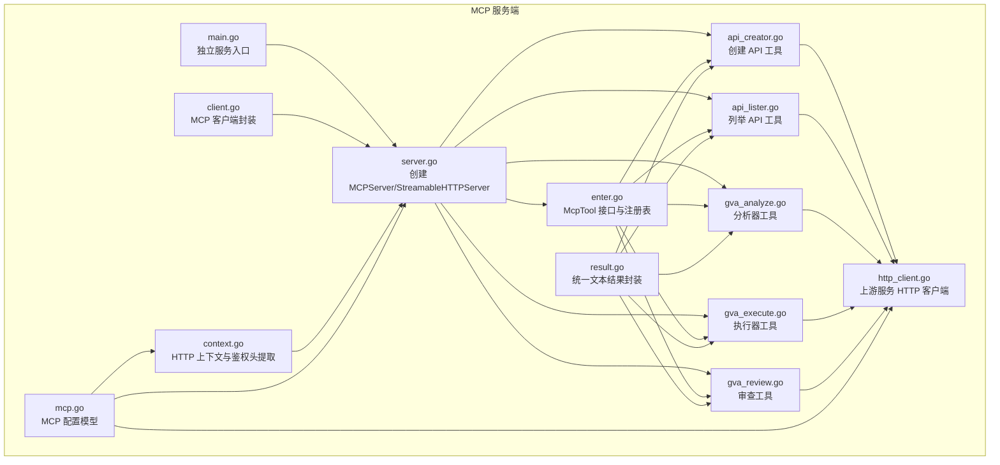
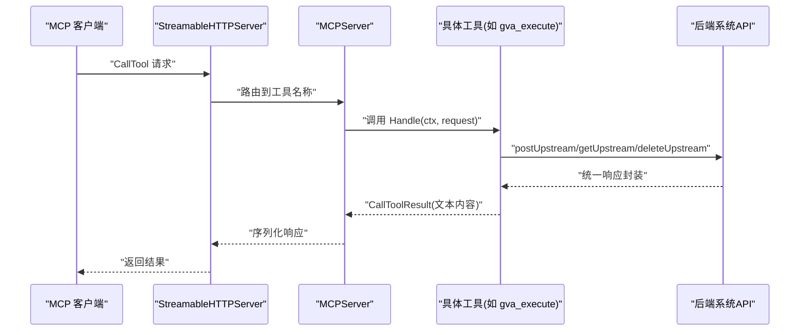
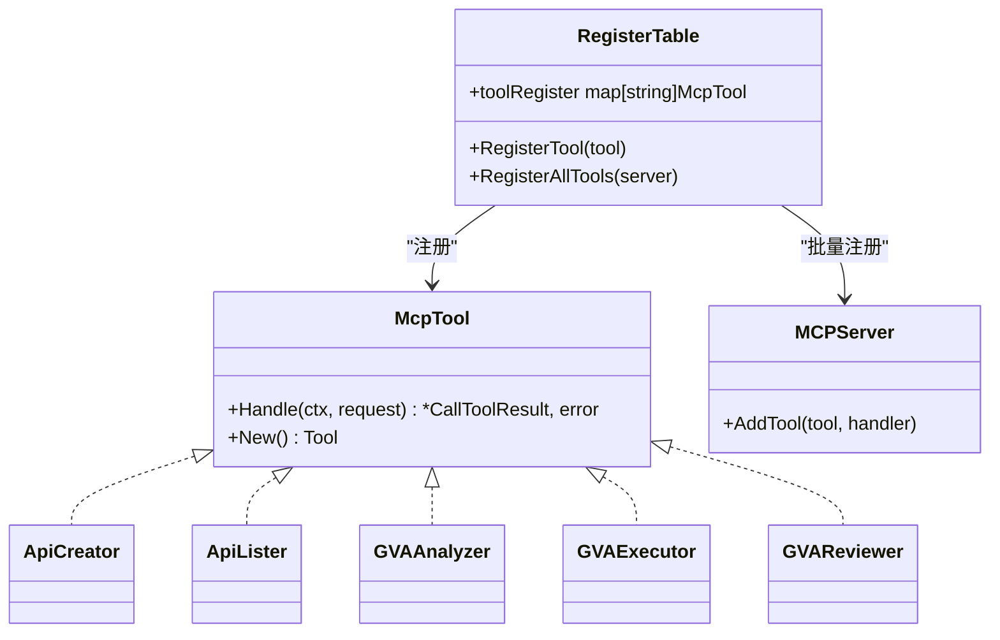
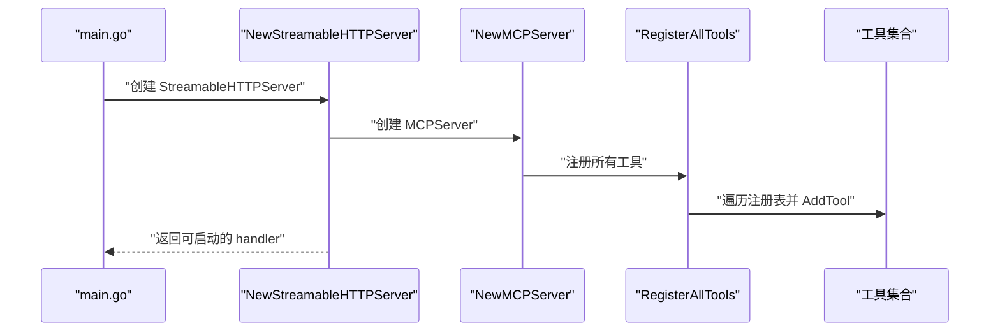
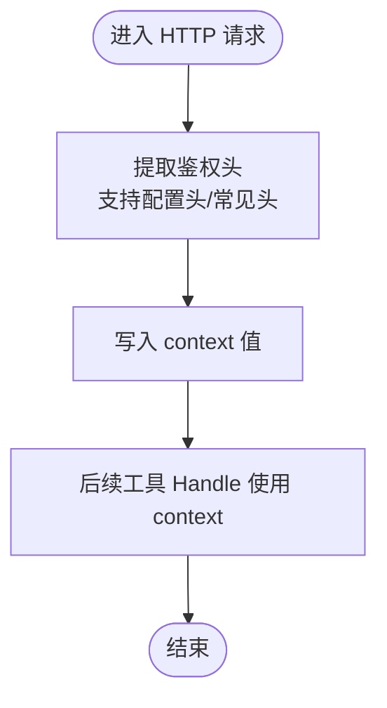
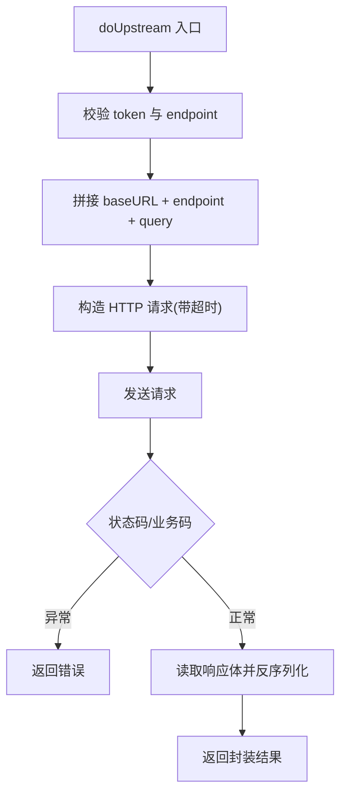
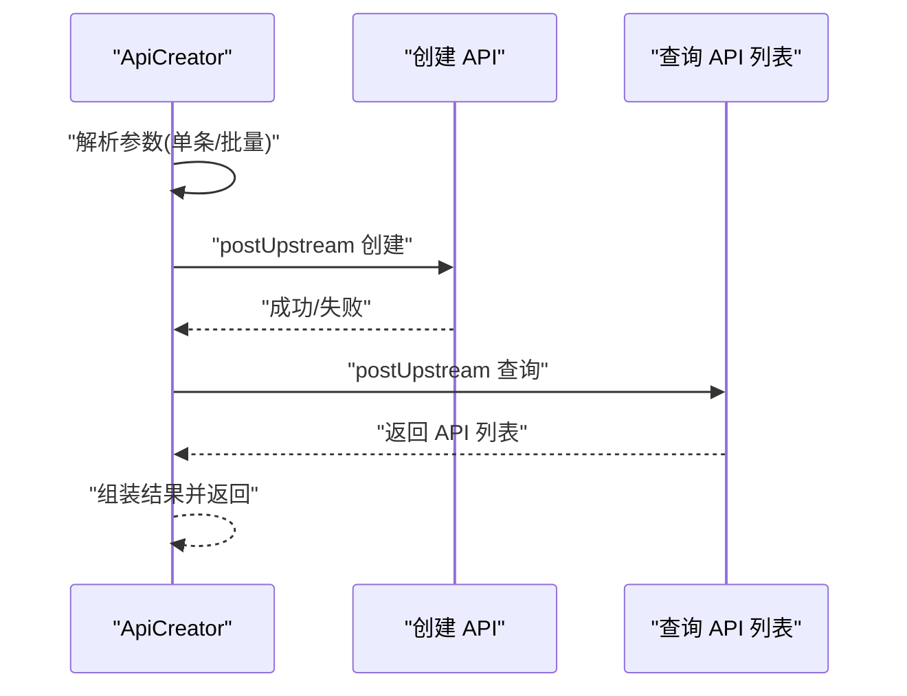
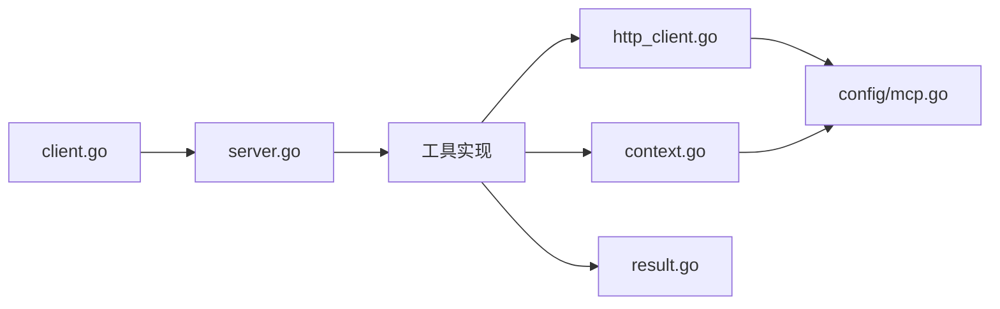

# MCP 插件架构

<cite>
**本文引用的文件**
- [server/cmd/mcp/main.go](file://server/cmd/mcp/main.go)
- [server/mcp/server.go](file://server/mcp/server.go)
- [server/mcp/context.go](file://server/mcp/context.go)
- [server/mcp/http_client.go](file://server/mcp/http_client.go)
- [server/mcp/result.go](file://server/mcp/result.go)
- [server/mcp/enter.go](file://server/mcp/enter.go)
- [server/mcp/api_creator.go](file://server/mcp/api_creator.go)
- [server/mcp/api_lister.go](file://server/mcp/api_lister.go)
- [server/mcp/gva_analyze.go](file://server/mcp/gva_analyze.go)
- [server/mcp/gva_execute.go](file://server/mcp/gva_execute.go)
- [server/mcp/gva_review.go](file://server/mcp/gva_review.go)
- [server/mcp/client/client.go](file://server/mcp/client/client.go)
- [server/config/mcp.go](file://server/config/mcp.go)
</cite>

## 目录
1. [简介](#简介)
2. [项目结构](#项目结构)
3. [核心组件](#核心组件)
4. [架构总览](#架构总览)
5. [详细组件分析](#详细组件分析)
6. [依赖分析](#依赖分析)
7. [性能考量](#性能考量)
8. [故障排查指南](#故障排查指南)
9. [结论](#结论)
10. [附录](#附录)

## 简介
本文件系统性阐述 Gin-Vue-Admin 项目中的 MCP（Model Control Protocol）插件架构，涵盖协议规范、消息格式、通信机制、工具接口设计、插件服务器架构、上下文管理、HTTP 客户端集成、错误处理策略以及最佳实践与性能优化建议。目标读者既包括需要快速上手的开发者，也包括希望深入理解实现细节的架构师。

## 项目结构
MCP 相关代码主要位于 server/mcp 目录，包含：
- 服务器与上下文：server.go、context.go、result.go
- HTTP 客户端封装：http_client.go
- 工具接口与注册：enter.go
- 具体工具实现：api_creator.go、api_lister.go、gva_analyze.go、gva_execute.go、gva_review.go
- MCP 客户端封装：server/mcp/client/client.go
- 配置模型：server/config/mcp.go
- 独立运行入口：server/cmd/mcp/main.go

图表来源
- [server/mcp/server.go:1-53](file://server/mcp/server.go#L1-L53)
- [server/mcp/context.go:1-67](file://server/mcp/context.go#L1-L67)
- [server/mcp/http_client.go:1-154](file://server/mcp/http_client.go#L1-L154)
- [server/mcp/enter.go:1-32](file://server/mcp/enter.go#L1-L32)
- [server/mcp/api_creator.go:1-160](file://server/mcp/api_creator.go#L1-L160)
- [server/mcp/api_lister.go:1-96](file://server/mcp/api_lister.go#L1-L96)
- [server/mcp/gva_analyze.go:1-495](file://server/mcp/gva_analyze.go#L1-L495)
- [server/mcp/gva_execute.go:1-751](file://server/mcp/gva_execute.go#L1-L751)
- [server/mcp/gva_review.go:1-171](file://server/mcp/gva_review.go#L1-L171)
- [server/mcp/client/client.go:1-45](file://server/mcp/client/client.go#L1-L45)
- [server/config/mcp.go:1-19](file://server/config/mcp.go#L1-L19)
- [server/cmd/mcp/main.go:1-36](file://server/cmd/mcp/main.go#L1-L36)

章节来源
- [server/mcp/server.go:1-53](file://server/mcp/server.go#L1-L53)
- [server/mcp/context.go:1-67](file://server/mcp/context.go#L1-L67)
- [server/mcp/http_client.go:1-154](file://server/mcp/http_client.go#L1-L154)
- [server/mcp/enter.go:1-32](file://server/mcp/enter.go#L1-L32)
- [server/mcp/api_creator.go:1-160](file://server/mcp/api_creator.go#L1-L160)
- [server/mcp/api_lister.go:1-96](file://server/mcp/api_lister.go#L1-L96)
- [server/mcp/gva_analyze.go:1-495](file://server/mcp/gva_analyze.go#L1-L495)
- [server/mcp/gva_execute.go:1-751](file://server/mcp/gva_execute.go#L1-L751)
- [server/mcp/gva_review.go:1-171](file://server/mcp/gva_review.go#L1-L171)
- [server/mcp/client/client.go:1-45](file://server/mcp/client/client.go#L1-L45)
- [server/config/mcp.go:1-19](file://server/config/mcp.go#L1-L19)
- [server/cmd/mcp/main.go:1-36](file://server/cmd/mcp/main.go#L1-L36)

## 核心组件
- McpTool 接口与注册表
  - McpTool 定义了两个核心方法：Handle(ctx, request) 用于执行工具逻辑；New() 返回工具元信息（名称、描述、参数 Schema）。
  - 工具通过 init() 函数注册到全局注册表，随后由服务器统一 AddTool 注册到 MCPServer。
- MCPServer 与 StreamableHTTPServer
  - NewMCPServer 基于配置创建 MCPServer，并注册所有工具。
  - NewStreamableHTTPServer 创建 http.Server 并挂载 StreamableHTTPServer，提供 /mcp 路径及 /health 健康检查。
- 上下文与鉴权
  - WithHTTPRequestContext 从 HTTP 请求头提取鉴权令牌，放入 context。
  - 支持多种候选头部（优先级 configurable auth header → x-token → token → authorization(Bearer)）。
- HTTP 客户端
  - upstreamBaseURL/ResolveMCPServiceURL/ConfiguredAuthHeader/requestTimeout 等统一配置。
  - doUpstream 封装 GET/POST/DELETE 请求，设置 Accept 与鉴权头，超时控制，状态码与业务码校验，统一响应解包。
- 结果封装
  - textResultWithJSON 将任意 payload 序列化为 JSON 文本内容，便于 MCP 客户端展示。

章节来源
- [server/mcp/enter.go:9-32](file://server/mcp/enter.go#L9-L32)
- [server/mcp/server.go:11-52](file://server/mcp/server.go#L11-L52)
- [server/mcp/context.go:15-66](file://server/mcp/context.go#L15-L66)
- [server/mcp/http_client.go:24-153](file://server/mcp/http_client.go#L24-L153)
- [server/mcp/result.go:10-29](file://server/mcp/result.go#L10-L29)

## 架构总览
MCP 插件架构采用“工具即服务”的思想：每个工具实现 McpTool 接口，统一注册到 MCPServer；客户端通过 Streamable HTTP 传输协议与服务器交互；工具内部通过统一的 HTTP 客户端访问后端系统 API，实现跨模块能力聚合。

图表来源
- [server/mcp/server.go:11-52](file://server/mcp/server.go#L11-L52)
- [server/mcp/enter.go:26-31](file://server/mcp/enter.go#L26-L31)
- [server/mcp/gva_execute.go:217-289](file://server/mcp/gva_execute.go#L217-L289)
- [server/mcp/http_client.go:63-153](file://server/mcp/http_client.go#L63-L153)

## 详细组件分析

### McpTool 接口与工具注册机制
- 接口设计
  - Handle(ctx, request)：接收请求参数，返回 CallToolResult 或错误。
  - New()：返回 mcp.Tool，包含工具名称、描述与 JSON Schema 参数定义。
- 注册机制
  - init() 中调用 RegisterTool 注册工具。
  - RegisterAllTools 遍历注册表，将工具元信息与 Handle 回调注册到 MCPServer。

图表来源
- [server/mcp/enter.go:9-31](file://server/mcp/enter.go#L9-L31)

章节来源
- [server/mcp/enter.go:9-32](file://server/mcp/enter.go#L9-L32)

### 插件服务器架构与初始化流程
- NewMCPServer
  - 从全局配置读取 MCP 名称与版本，创建 MCPServer。
  - 设置全局 GVA_MCP_SERVER，并调用 RegisterAllTools 注册工具。
- NewStreamableHTTPServer
  - 解析配置路径（默认 /mcp），构造 http.ServeMux。
  - 创建 StreamableHTTPServer，注入 WithHTTPRequestContext 与 http.Server。
  - 将路径与健康检查 /health 注册到 mux。

图表来源
- [server/cmd/mcp/main.go:22-34](file://server/cmd/mcp/main.go#L22-L34)
- [server/mcp/server.go:11-52](file://server/mcp/server.go#L11-L52)
- [server/mcp/enter.go:26-31](file://server/mcp/enter.go#L26-L31)

章节来源
- [server/cmd/mcp/main.go:12-35](file://server/cmd/mcp/main.go#L12-L35)
- [server/mcp/server.go:11-52](file://server/mcp/server.go#L11-L52)

### 插件上下文管理与请求参数传递
- WithHTTPRequestContext
  - 从 HTTP 请求头提取令牌，支持配置项与常见头部，放入 context。
- authTokenFromContext
  - 从 context 中读取令牌，供上游请求使用。
- 配置项
  - ConfiguredAuthHeader 返回配置的鉴权头名称（默认 x-token）。

图表来源
- [server/mcp/context.go:15-66](file://server/mcp/context.go#L15-L66)

章节来源
- [server/mcp/context.go:15-66](file://server/mcp/context.go#L15-L66)

### 插件通信实现细节（HTTP 客户端集成）
- 地址解析
  - ResolveMCPServiceURL：优先使用配置 base_url，否则按 addr 与 path 组合默认 http://127.0.0.1:8889/mcp。
  - upstreamBaseURL：默认 http://127.0.0.1:8888。
- 请求封装
  - doUpstream：GET/POST/DELETE 统一封装，设置 Accept 与鉴权头，超时 context 控制。
  - 统一响应体结构：upstreamEnvelope[T]，包含 code/data/msg。
- 错误处理
  - 状态码异常：>= 400 返回业务错误。
  - 业务码异常：code != 0 返回业务错误。
  - 其他：序列化/反序列化/网络错误统一包装。

图表来源
- [server/mcp/http_client.go:75-153](file://server/mcp/http_client.go#L75-L153)

章节来源
- [server/mcp/http_client.go:24-153](file://server/mcp/http_client.go#L24-L153)

### 工具实现范式与最佳实践
- 统一结果封装
  - textResultWithJSON 将任意 payload 序列化为 JSON 文本内容，便于 MCP 客户端展示。
- 参数解析与校验
  - 工具 Handle 中先解析 arguments，再进行必要校验与转换，最后调用上游接口。
- 批量处理与容错
  - 如 API 创建工具支持批量创建，逐条记录结果并汇总统计。
- 一致性与幂等
  - 工具内部尽量避免重复创建（如字典存在性检查），减少副作用。

章节来源
- [server/mcp/result.go:10-29](file://server/mcp/result.go#L10-L29)
- [server/mcp/api_creator.go:65-159](file://server/mcp/api_creator.go#L65-L159)

### 典型工具分析

#### ApiCreator 工具
- 功能：创建后端 API 记录，支持单条与批量。
- 参数：path/description/apiGroup/method/apis(JSON 字符串)。
- 流程：解析参数 → 调用上游创建 → 查询刚创建的 API → 汇总结果 → 返回 JSON 文本。

图表来源
- [server/mcp/api_creator.go:65-159](file://server/mcp/api_creator.go#L65-L159)
- [server/mcp/http_client.go:67-118](file://server/mcp/http_client.go#L67-L118)

章节来源
- [server/mcp/api_creator.go:19-159](file://server/mcp/api_creator.go#L19-L159)

#### ApiLister 工具
- 功能：列举数据库 API 与 Gin 路由 API，辅助前端判断是否需要创建新 API。
- 参数：占位参数，防止 JSON Schema 校验失败。
- 流程：调用上游获取 API 列表与路由信息 → 组装返回结构 → 返回 JSON 文本。

章节来源
- [server/mcp/api_lister.go:15-95](file://server/mcp/api_lister.go#L15-L95)

#### GVAAnalyzer 工具
- 功能：分析系统中有效包/模块/字典，清理空包，返回清理结果。
- 关键流程：扫描包与模块 → 检查空包 → 删除空包与历史记录 → 返回分析结果。

章节来源
- [server/mcp/gva_analyze.go:118-259](file://server/mcp/gva_analyze.go#L118-L259)

#### GVAExecutor 工具
- 功能：直接执行代码生成，支持批量模块、包与字典创建。
- 关键流程：解析执行计划 → 校验计划 → 创建包/字典/模块 → 返回生成路径与后续动作。

章节来源
- [server/mcp/gva_execute.go:217-515](file://server/mcp/gva_execute.go#L217-L515)

#### GVAReviewer 工具
- 功能：在代码生成后进行审查，给出调整建议与开发 prompt。
- 关键流程：接收用户需求与生成文件列表 → 生成调整提示 → 返回审查结果。

章节来源
- [server/mcp/gva_review.go:80-140](file://server/mcp/gva_review.go#L80-L140)

### MCP 客户端封装
- NewClient
  - 基于 baseURL 创建 Streamable HTTP 客户端，启动连接。
  - 发送 Initialize 请求，校验协议版本与服务端名称。
  - 成功后返回客户端实例，可用于后续工具调用。

章节来源
- [server/mcp/client/client.go:12-44](file://server/mcp/client/client.go#L12-L44)

## 依赖分析
- 组件耦合
  - 工具实现依赖统一 HTTP 客户端与上下文，降低重复代码。
  - MCPServer 与工具通过接口解耦，注册表集中管理。
- 外部依赖
  - mcp-go：MCPServer、Client、Transport、mcp 类型。
  - Gin：部分工具使用 Gin 路由信息（如路由列表）。
- 配置依赖
  - server/config/mcp.go 提供 MCP 名称、版本、路径、地址、鉴权头、上游地址、请求超时等配置。

图表来源
- [server/mcp/http_client.go:1-154](file://server/mcp/http_client.go#L1-L154)
- [server/mcp/context.go:1-67](file://server/mcp/context.go#L1-L67)
- [server/mcp/result.go:1-30](file://server/mcp/result.go#L1-L30)
- [server/config/mcp.go:1-19](file://server/config/mcp.go#L1-L19)
- [server/mcp/server.go:1-53](file://server/mcp/server.go#L1-L53)
- [server/mcp/client/client.go:1-45](file://server/mcp/client/client.go#L1-L45)

章节来源
- [server/config/mcp.go:3-18](file://server/config/mcp.go#L3-L18)

## 性能考量
- 连接与并发
  - 使用 Streamable HTTP 传输，减少握手开销；合理设置请求超时，避免阻塞。
- 批量处理
  - 工具支持批量创建/处理，减少往返次数；注意逐条容错与结果汇总。
- 资源清理
  - 分析器定期清理空包与历史记录，降低磁盘占用与扫描成本。
- 日志与可观测性
  - 在关键路径记录日志，便于定位性能瓶颈与异常。

## 故障排查指南
- 鉴权失败
  - 确认请求头中包含正确的鉴权头（可通过配置项设置），或使用常见头（x-token/token/authorization）。
  - 检查 WithHTTPRequestContext 与 ConfiguredAuthHeader 的行为。
- 上游请求异常
  - 检查 ResolveMCPServiceURL/ResolveMCPServiceURL 是否指向正确地址。
  - 关注状态码与业务码校验逻辑，定位具体失败原因。
- 工具参数错误
  - 根据工具的 JSON Schema 校验参数，确保必填项与类型正确。
- 服务器启动失败
  - 检查配置项（名称、版本、路径、地址、上游地址、超时）与日志输出。

章节来源
- [server/mcp/context.go:20-66](file://server/mcp/context.go#L20-L66)
- [server/mcp/http_client.go:24-153](file://server/mcp/http_client.go#L24-L153)
- [server/mcp/server.go:22-52](file://server/mcp/server.go#L22-L52)
- [server/cmd/mcp/main.go:22-34](file://server/cmd/mcp/main.go#L22-L34)

## 结论
本架构以 McpTool 接口为核心，结合统一的上下文与 HTTP 客户端，实现了高内聚、低耦合的 MCP 插件体系。通过工具注册表与 MCPServer 的解耦设计，扩展新工具变得简单；通过统一的结果封装与错误处理策略，提升了系统的稳定性与可观测性。建议在生产环境中进一步完善超时与重试策略、引入连接池与缓存、增强日志与监控告警，以获得更佳的性能与可靠性。

## 附录
- 配置项说明
  - name/version/path/addr/base_url/upstream_base_url/auth_header/request_timeout 等。
- 建议的工具开发流程
  - 定义工具 New() 的参数 Schema。
  - 在 init() 中注册工具。
  - 在 Handle 中解析参数、调用上游、封装结果。
  - 在工具内部使用统一 HTTP 客户端与上下文。

章节来源
- [server/config/mcp.go:3-18](file://server/config/mcp.go#L3-L18)
- [server/mcp/enter.go:15-31](file://server/mcp/enter.go#L15-L31)
- [server/mcp/http_client.go:63-153](file://server/mcp/http_client.go#L63-L153)
- [server/mcp/result.go:10-29](file://server/mcp/result.go#L10-L29)