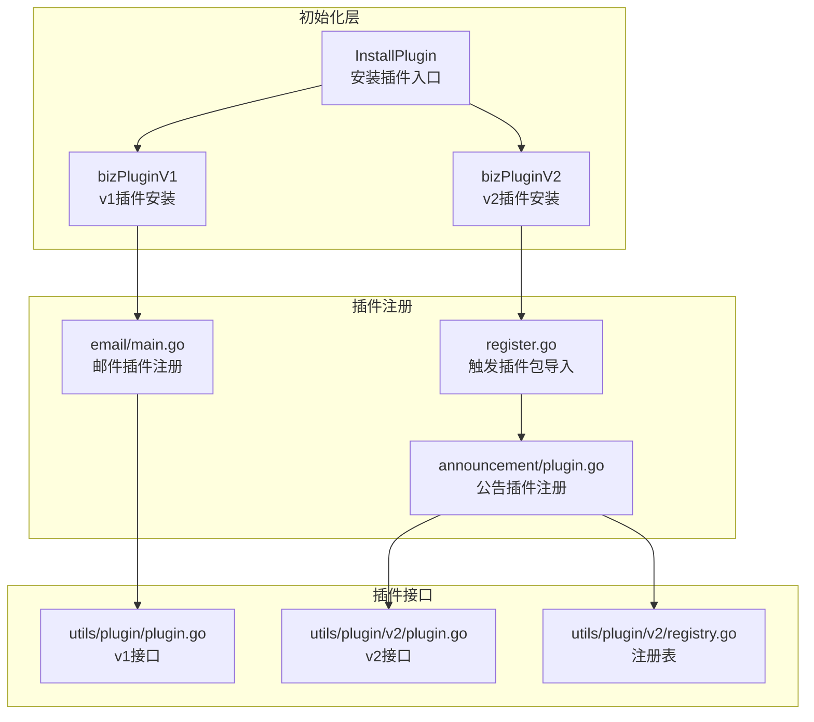
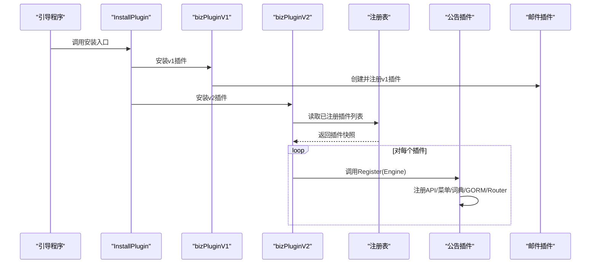
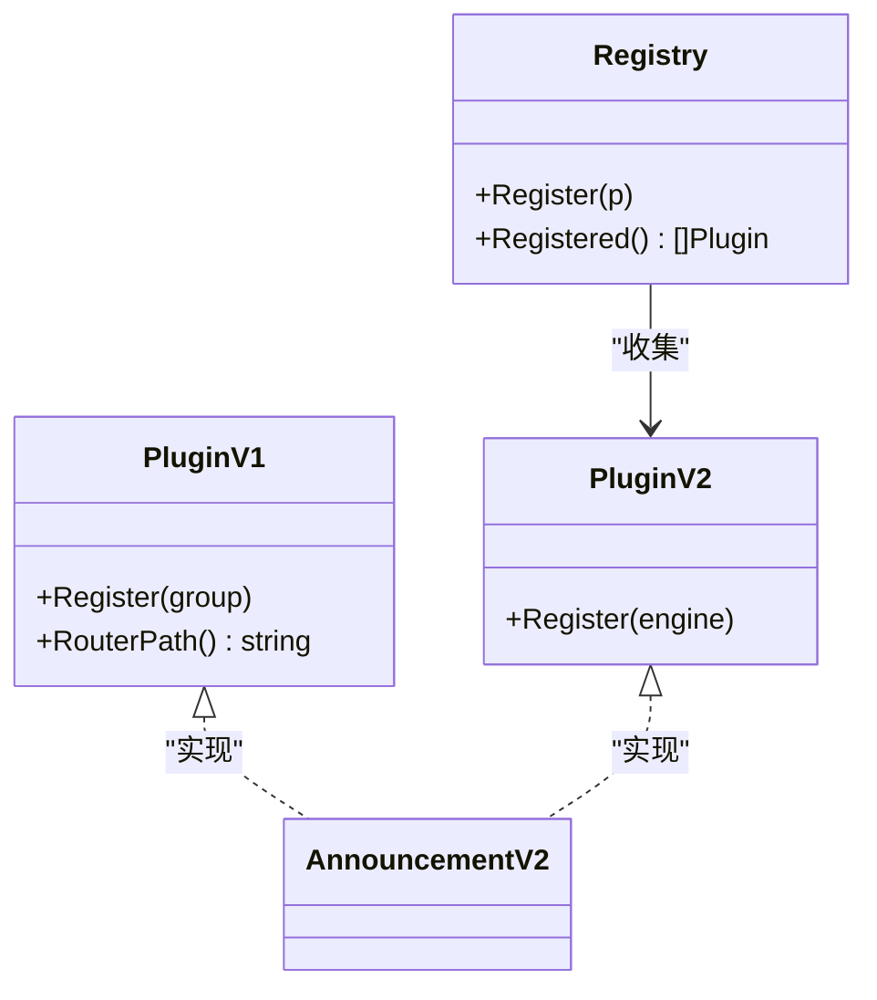
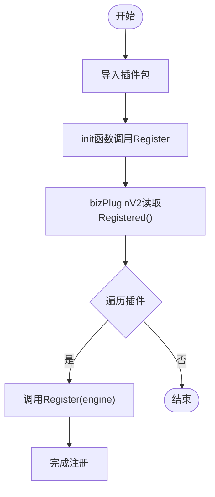
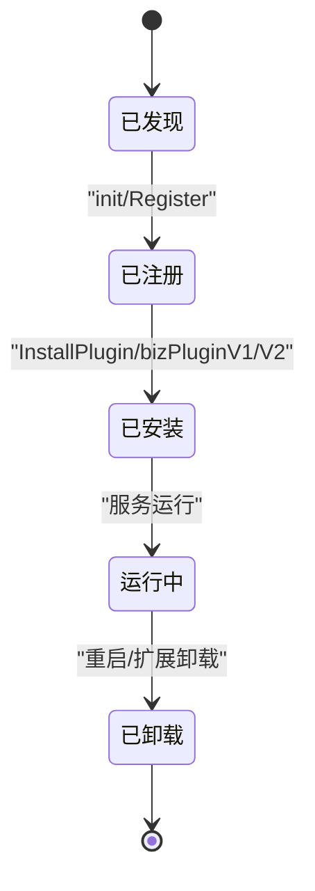
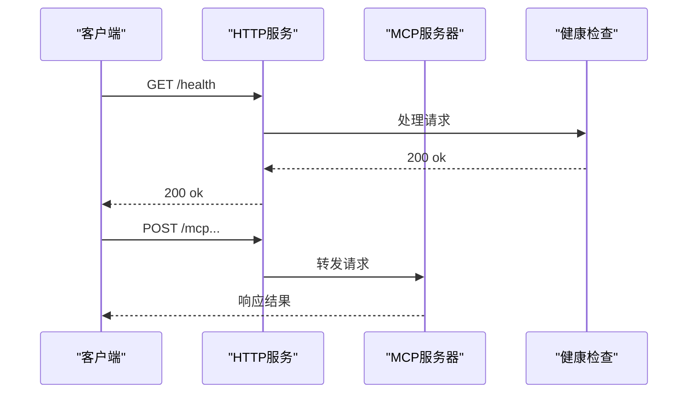
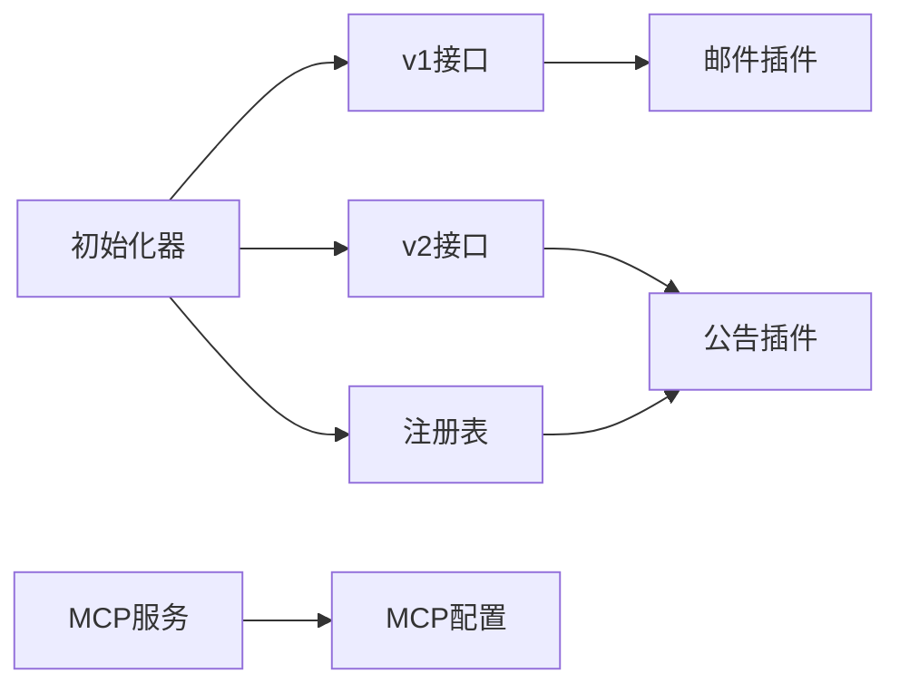

# 插件管理系统

<cite>
**本文引用的文件**
- [server/plugin/register.go](file://server/plugin/register.go)
- [server/utils/plugin/plugin.go](file://server/utils/plugin/plugin.go)
- [server/utils/plugin/v2/plugin.go](file://server/utils/plugin/v2/plugin.go)
- [server/utils/plugin/v2/registry.go](file://server/utils/plugin/v2/registry.go)
- [server/initialize/plugin.go](file://server/initialize/plugin.go)
- [server/initialize/plugin_biz_v1.go](file://server/initialize/plugin_biz_v1.go)
- [server/initialize/plugin_biz_v2.go](file://server/initialize/plugin_biz_v2.go)
- [server/plugin/announcement/plugin.go](file://server/plugin/announcement/plugin.go)
- [server/plugin/email/main.go](file://server/plugin/email/main.go)
- [server/mcp/server.go](file://server/mcp/server.go)
- [server/cmd/mcp/main.go](file://server/cmd/mcp/main.go)
- [server/config/mcp.go](file://server/config/mcp.go)
- [server/global/version.go](file://server/global/version.go)
</cite>

## 目录
1. [引言](#引言)
2. [项目结构](#项目结构)
3. [核心组件](#核心组件)
4. [架构总览](#架构总览)
5. [详细组件分析](#详细组件分析)
6. [依赖关系分析](#依赖关系分析)
7. [性能考量](#性能考量)
8. [故障排除指南](#故障排除指南)
9. [结论](#结论)
10. [附录](#附录)

## 引言
本文件面向插件管理系统的开发者与运维人员，系统性阐述插件注册机制、生命周期管理、配置管理、版本控制、依赖管理、安全机制、监控与诊断以及运维排障。文档基于实际代码实现进行分析，并通过图示展示插件从“发现、加载、初始化”到“运行、停止、卸载”的完整流程。

## 项目结构
插件系统围绕两条主线展开：
- 路由插件（v1）：通过 Gin 的 RouterGroup 将插件路由挂载到私有或公共路由组。
- MCP 插件（v2）：通过全局注册表统一收集并注册插件，插件向 Engine 注册自身路由。

**图表来源**
- [server/initialize/plugin.go:1-16](file://server/initialize/plugin.go#L1-L16)
- [server/initialize/plugin_biz_v1.go:1-37](file://server/initialize/plugin_biz_v1.go#L1-L37)
- [server/initialize/plugin_biz_v2.go:1-17](file://server/initialize/plugin_biz_v2.go#L1-L17)
- [server/plugin/register.go:1-6](file://server/plugin/register.go#L1-L6)
- [server/plugin/announcement/plugin.go:1-33](file://server/plugin/announcement/plugin.go#L1-L33)
- [server/plugin/email/main.go:1-30](file://server/plugin/email/main.go#L1-L30)
- [server/utils/plugin/plugin.go:1-19](file://server/utils/plugin/plugin.go#L1-L19)
- [server/utils/plugin/v2/plugin.go:1-12](file://server/utils/plugin/v2/plugin.go#L1-L12)
- [server/utils/plugin/v2/registry.go:1-28](file://server/utils/plugin/v2/registry.go#L1-L28)

**章节来源**
- [server/initialize/plugin.go:1-16](file://server/initialize/plugin.go#L1-L16)
- [server/initialize/plugin_biz_v1.go:1-37](file://server/initialize/plugin_biz_v1.go#L1-L37)
- [server/initialize/plugin_biz_v2.go:1-17](file://server/initialize/plugin_biz_v2.go#L1-L17)
- [server/plugin/register.go:1-6](file://server/plugin/register.go#L1-L6)

## 核心组件
- 插件接口（v1）：定义 Register 和 RouterPath，用于在 RouterGroup 下挂载路由。
- 插件接口（v2）：定义 Register，直接向 Engine 注册路由；配合注册表统一收集。
- 注册表：线程安全地记录已注册插件实例，供统一初始化使用。
- 初始化器：根据数据库状态决定是否安装插件；分别处理 v1 与 v2 插件。
- 插件实现：如公告插件与邮件插件，均通过 Register 完成路由注册。

**章节来源**
- [server/utils/plugin/plugin.go:1-19](file://server/utils/plugin/plugin.go#L1-L19)
- [server/utils/plugin/v2/plugin.go:1-12](file://server/utils/plugin/v2/plugin.go#L1-L12)
- [server/utils/plugin/v2/registry.go:1-28](file://server/utils/plugin/v2/registry.go#L1-L28)
- [server/initialize/plugin.go:1-16](file://server/initialize/plugin.go#L1-L16)

## 架构总览
插件系统采用“接口抽象 + 注册表 + 初始化器”的分层设计：
- 发现：通过导入插件包触发 init 函数，将插件注册到注册表。
- 加载：初始化器读取注册表，按约定调用 Register 完成路由挂载。
- 运行：插件在各自命名空间下提供 API，接受请求。
- 停止/卸载：当前实现未提供显式卸载接口，可通过重启服务或扩展注册表实现。

**图表来源**
- [server/initialize/plugin.go:1-16](file://server/initialize/plugin.go#L1-L16)
- [server/initialize/plugin_biz_v1.go:1-37](file://server/initialize/plugin_biz_v1.go#L1-L37)
- [server/initialize/plugin_biz_v2.go:1-17](file://server/initialize/plugin_biz_v2.go#L1-L17)
- [server/utils/plugin/v2/registry.go:1-28](file://server/utils/plugin/v2/registry.go#L1-L28)
- [server/plugin/announcement/plugin.go:1-33](file://server/plugin/announcement/plugin.go#L1-L33)
- [server/plugin/email/main.go:1-30](file://server/plugin/email/main.go#L1-L30)

## 详细组件分析

### 插件接口与注册表
- v1 接口：要求提供 Register(group) 与 RouterPath()，便于按命名空间挂载。
- v2 接口：要求提供 Register(engine)，适合更灵活的路由组织。
- 注册表：提供 Register(p) 与 Registered()，内部使用互斥锁保证并发安全。

**图表来源**
- [server/utils/plugin/plugin.go:1-19](file://server/utils/plugin/plugin.go#L1-L19)
- [server/utils/plugin/v2/plugin.go:1-12](file://server/utils/plugin/v2/plugin.go#L1-L12)
- [server/utils/plugin/v2/registry.go:1-28](file://server/utils/plugin/v2/registry.go#L1-L28)
- [server/plugin/announcement/plugin.go:1-33](file://server/plugin/announcement/plugin.go#L1-L33)

**章节来源**
- [server/utils/plugin/plugin.go:1-19](file://server/utils/plugin/plugin.go#L1-L19)
- [server/utils/plugin/v2/plugin.go:1-12](file://server/utils/plugin/v2/plugin.go#L1-L12)
- [server/utils/plugin/v2/registry.go:1-28](file://server/utils/plugin/v2/registry.go#L1-L28)

### 插件发现与加载
- 发现：通过导入插件包触发 init，init 中调用 Register 将插件加入注册表。
- 加载：v2 初始化器读取 Registered() 快照，逐个调用 Register(engine)。
- v1：通过 PluginInit 在指定 RouterGroup 下创建子组并注册。

**图表来源**
- [server/plugin/register.go:1-6](file://server/plugin/register.go#L1-L6)
- [server/utils/plugin/v2/registry.go:1-28](file://server/utils/plugin/v2/registry.go#L1-L28)
- [server/initialize/plugin_biz_v2.go:1-17](file://server/initialize/plugin_biz_v2.go#L1-L17)

**章节来源**
- [server/plugin/register.go:1-6](file://server/plugin/register.go#L1-L6)
- [server/initialize/plugin_biz_v2.go:1-17](file://server/initialize/plugin_biz_v2.go#L1-L17)
- [server/utils/plugin/v2/registry.go:1-28](file://server/utils/plugin/v2/registry.go#L1-L28)

### 插件生命周期管理
- 启动：插件在 init 中完成注册；初始化器在服务启动时调用安装入口。
- 运行：插件在各自命名空间下提供 API，接收请求。
- 停止/卸载：当前未提供显式卸载接口。建议通过重启服务或扩展注册表实现动态卸载。

**图表来源**
- [server/plugin/announcement/plugin.go:1-33](file://server/plugin/announcement/plugin.go#L1-L33)
- [server/initialize/plugin.go:1-16](file://server/initialize/plugin.go#L1-L16)
- [server/initialize/plugin_biz_v1.go:1-37](file://server/initialize/plugin_biz_v1.go#L1-L37)
- [server/initialize/plugin_biz_v2.go:1-17](file://server/initialize/plugin_biz_v2.go#L1-L17)

**章节来源**
- [server/plugin/announcement/plugin.go:1-33](file://server/plugin/announcement/plugin.go#L1-L33)
- [server/initialize/plugin.go:1-16](file://server/initialize/plugin.go#L1-L16)

### 插件配置管理
- v1 插件通过构造函数注入配置（如邮件插件），在 Register 中使用。
- v2 插件可结合配置模块与初始化流程，在 Register 中读取配置并注册资源。
- 建议：集中配置解析与参数校验，确保插件启动前完成验证。

**章节来源**
- [server/plugin/email/main.go:1-30](file://server/plugin/email/main.go#L1-L30)

### 插件版本控制机制
- 全局版本常量用于标识系统版本。
- MCP 配置包含名称与版本字段，可用于 MCP 层面的版本识别与兼容性判断。
- 建议：在插件层面增加版本字段与兼容性检查，升级策略可基于版本比较与降级回滚。

**章节来源**
- [server/global/version.go:1-13](file://server/global/version.go#L1-L13)
- [server/config/mcp.go:1-19](file://server/config/mcp.go#L1-L19)

### 插件依赖管理
- 依赖解析：通过导入插件包触发 init，实现隐式依赖发现。
- 冲突处理：当前未提供显式冲突检测；建议在注册表中引入依赖声明与冲突检测。
- 加载顺序：v2 初始化器对 Registered() 快照进行遍历，顺序取决于注册顺序；建议引入拓扑排序或优先级声明。

**章节来源**
- [server/plugin/register.go:1-6](file://server/plugin/register.go#L1-L6)
- [server/utils/plugin/v2/registry.go:1-28](file://server/utils/plugin/v2/registry.go#L1-L28)

### 插件安全机制
- 权限控制：v1 插件通过 RouterGroup 挂载，可结合现有中间件与 RBAC 实施权限控制。
- 沙箱隔离：当前未提供沙箱隔离；可在插件执行上下文与资源访问处引入限制。
- 资源限制：建议在插件侧增加超时、重试与熔断策略，避免影响主服务稳定性。

**章节来源**
- [server/initialize/plugin_biz_v1.go:1-37](file://server/initialize/plugin_biz_v1.go#L1-L37)

### 插件监控与诊断
- MCP 独立服务：提供健康检查端点与流式 HTTP 服务器封装，便于外部监控与诊断。
- 日志：启动时输出配置与地址信息，便于定位问题。
- 建议：在插件内增加指标上报与错误追踪，结合现有日志系统统一采集。

**图表来源**
- [server/mcp/server.go:1-53](file://server/mcp/server.go#L1-L53)
- [server/cmd/mcp/main.go:1-36](file://server/cmd/mcp/main.go#L1-L36)

**章节来源**
- [server/mcp/server.go:1-53](file://server/mcp/server.go#L1-L53)
- [server/cmd/mcp/main.go:1-36](file://server/cmd/mcp/main.go#L1-L36)

## 依赖关系分析
- 插件实现依赖接口与注册表；初始化器依赖全局配置与数据库状态。
- v1 与 v2 插件并存，v2 通过注册表统一管理，v1 通过构造函数注入配置。
- MCP 作为独立服务，与主服务共享配置结构，提供独立的健康检查与路径。

**图表来源**
- [server/utils/plugin/plugin.go:1-19](file://server/utils/plugin/plugin.go#L1-L19)
- [server/utils/plugin/v2/plugin.go:1-12](file://server/utils/plugin/v2/plugin.go#L1-L12)
- [server/utils/plugin/v2/registry.go:1-28](file://server/utils/plugin/v2/registry.go#L1-L28)
- [server/plugin/email/main.go:1-30](file://server/plugin/email/main.go#L1-L30)
- [server/plugin/announcement/plugin.go:1-33](file://server/plugin/announcement/plugin.go#L1-L33)
- [server/initialize/plugin.go:1-16](file://server/initialize/plugin.go#L1-L16)
- [server/config/mcp.go:1-19](file://server/config/mcp.go#L1-L19)

**章节来源**
- [server/utils/plugin/plugin.go:1-19](file://server/utils/plugin/plugin.go#L1-L19)
- [server/utils/plugin/v2/plugin.go:1-12](file://server/utils/plugin/v2/plugin.go#L1-L12)
- [server/utils/plugin/v2/registry.go:1-28](file://server/utils/plugin/v2/registry.go#L1-L28)
- [server/plugin/email/main.go:1-30](file://server/plugin/email/main.go#L1-L30)
- [server/plugin/announcement/plugin.go:1-33](file://server/plugin/announcement/plugin.go#L1-L33)
- [server/initialize/plugin.go:1-16](file://server/initialize/plugin.go#L1-L16)
- [server/config/mcp.go:1-19](file://server/config/mcp.go#L1-L19)

## 性能考量
- 注册表使用互斥锁保护，注册与读取均为 O(n)；建议在高并发场景下评估锁竞争。
- v1 插件按 RouterGroup 分组注册，避免重复扫描；v2 插件遍历注册表，建议控制插件数量与初始化耗时。
- MCP 独立服务建议启用连接池与超时控制，减少资源占用。

## 故障排除指南
- 插件未生效
  - 检查是否正确导入插件包以触发 init 注册。
  - 确认初始化器已调用安装入口且数据库已初始化。
- 路由冲突
  - 检查 RouterPath 是否重复；v2 插件需确保注册路径唯一。
- 配置错误
  - 核对 v1 插件构造函数参数与 v2 插件配置项；确保类型与默认值正确。
- MCP 服务异常
  - 查看健康检查端点与启动日志；确认监听地址与路径配置。

**章节来源**
- [server/initialize/plugin.go:1-16](file://server/initialize/plugin.go#L1-L16)
- [server/plugin/register.go:1-6](file://server/plugin/register.go#L1-L6)
- [server/mcp/server.go:1-53](file://server/mcp/server.go#L1-L53)
- [server/cmd/mcp/main.go:1-36](file://server/cmd/mcp/main.go#L1-L36)

## 结论
该插件系统通过清晰的接口抽象与注册表机制，实现了插件的发现、加载与统一初始化。v1 与 v2 并存满足不同场景需求，MCP 独立服务提供了可观测性与扩展能力。建议后续完善卸载机制、冲突检测、版本兼容与安全隔离，以进一步提升系统的稳定性与可维护性。

## 附录
- 运维建议
  - 在生产环境启用健康检查与日志聚合。
  - 对插件数量与初始化时间进行容量规划。
  - 对外暴露的 MCP 服务建议接入网关与鉴权。