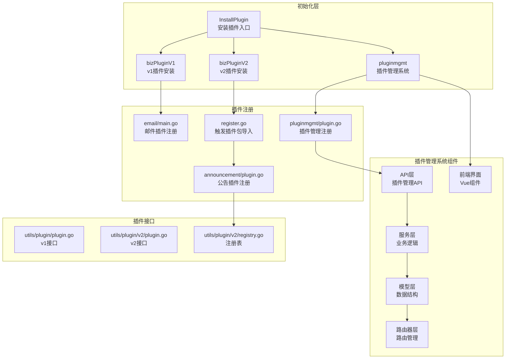
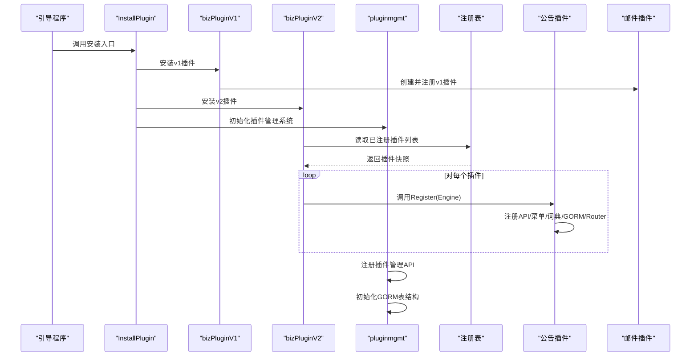
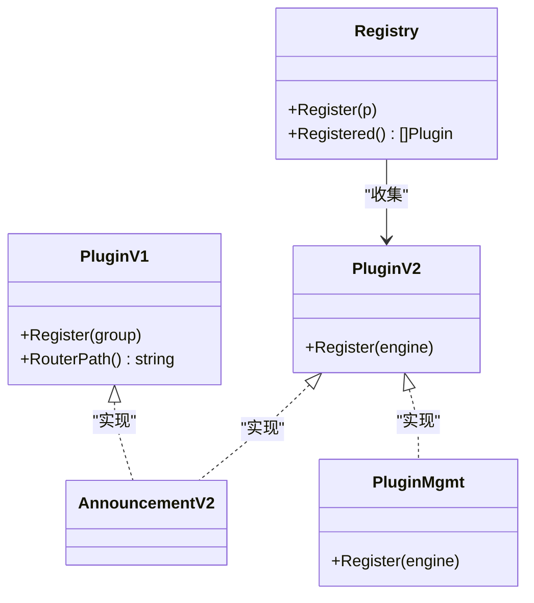
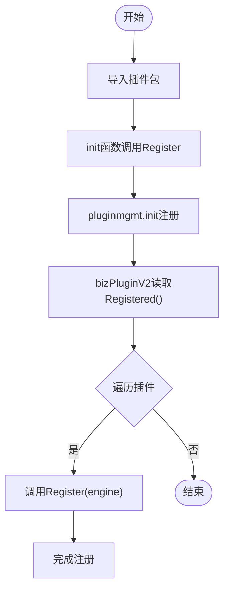
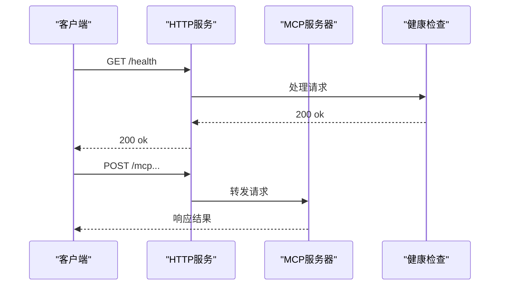
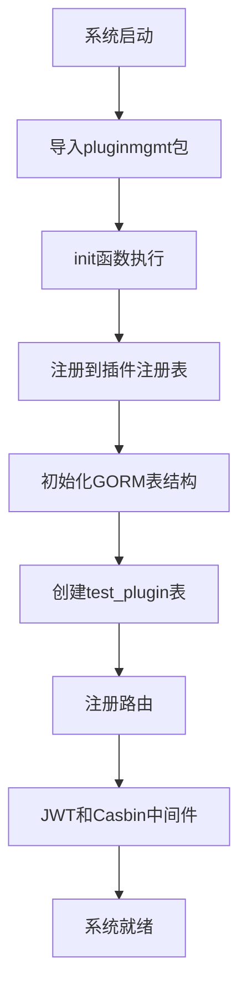
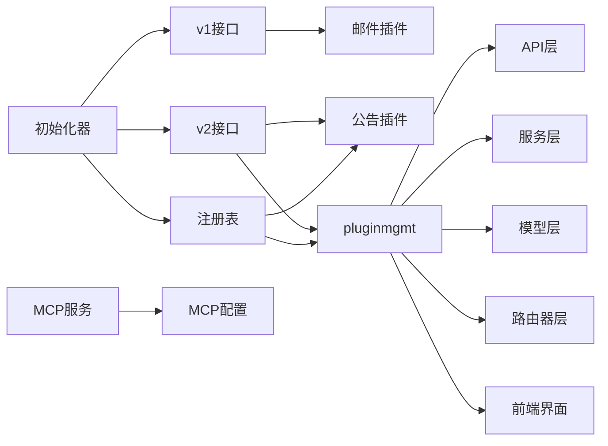

# 插件管理系统

<cite>
**本文引用的文件**
- [server/plugin/register.go](file://server/plugin/register.go)
- [server/utils/plugin/plugin.go](file://server/utils/plugin/plugin.go)
- [server/utils/plugin/v2/plugin.go](file://server/utils/plugin/v2/plugin.go)
- [server/utils/plugin/v2/registry.go](file://server/utils/plugin/v2/registry.go)
- [server/initialize/plugin.go](file://server/initialize/plugin.go)
- [server/initialize/plugin_biz_v1.go](file://server/initialize/plugin_biz_v1.go)
- [server/initialize/plugin_biz_v2.go](file://server/initialize/plugin_biz_v2.go)
- [server/plugin/announcement/plugin.go](file://server/plugin/announcement/plugin.go)
- [server/plugin/email/main.go](file://server/plugin/email/main.go)
- [server/mcp/server.go](file://server/mcp/server.go)
- [server/cmd/mcp/main.go](file://server/cmd/mcp/main.go)
- [server/config/mcp.go](file://server/config/mcp.go)
- [server/global/version.go](file://server/global/version.go)
- [server/plugin/pluginmgmt/plugin.go](file://server/plugin/pluginmgmt/plugin.go)
- [server/plugin/pluginmgmt/api/plugin_api.go](file://server/plugin/pluginmgmt/api/plugin_api.go)
- [server/plugin/pluginmgmt/service/plugin_service.go](file://server/plugin/pluginmgmt/service/plugin_service.go)
- [server/plugin/pluginmgmt/model/plugin.go](file://server/plugin/pluginmgmt/model/plugin.go)
- [server/plugin/pluginmgmt/router/plugin_router.go](file://server/plugin/pluginmgmt/router/plugin_router.go)
- [server/plugin/pluginmgmt/initialize/gorm.go](file://server/plugin/pluginmgmt/initialize/gorm.go)
- [server/plugin/pluginmgmt/initialize/router.go](file://server/plugin/pluginmgmt/initialize/router.go)
- [server/plugin/pluginmgmt/model/request/plugin.go](file://server/plugin/pluginmgmt/model/request/plugin.go)
- [web/src/plugin/pluginmgmt/api/plugin.js](file://web/src/plugin/pluginmgmt/api/plugin.js)
- [web/src/plugin/pluginmgmt/view/plugin.vue](file://web/src/plugin/pluginmgmt/view/plugin.vue)
</cite>

## 更新摘要
**所做更改**
- 新增完整的插件管理系统模块（pluginmgmt）
- 添加后端API层、服务层、模型层、路由器层的完整组件
- 新增前端界面和交互功能
- 集成数据库表结构和初始化逻辑
- 扩展插件注册机制，支持新的插件管理功能

## 目录
1. [引言](#引言)
2. [项目结构](#项目结构)
3. [核心组件](#核心组件)
4. [架构总览](#架构总览)
5. [详细组件分析](#详细组件分析)
6. [插件管理系统详解](#插件管理系统详解)
7. [依赖关系分析](#依赖关系分析)
8. [性能考量](#性能考量)
9. [故障排除指南](#故障排除指南)
10. [结论](#结论)
11. [附录](#附录)

## 引言
本文件面向插件管理系统的开发者与运维人员，系统性阐述插件注册机制、生命周期管理、配置管理、版本控制、依赖管理、安全机制、监控与诊断以及运维排障。文档基于实际代码实现进行分析，并通过图示展示插件从"发现、加载、初始化"到"运行、停止、卸载"的完整流程。

**更新** 新增了完整的插件管理系统模块，包括后端API层、前端界面、数据库集成、服务发现功能等。

## 项目结构
插件系统围绕两条主线展开：
- 路由插件（v1）：通过 Gin 的 RouterGroup 将插件路由挂载到私有或公共路由组。
- MCP 插件（v2）：通过全局注册表统一收集并注册插件，插件向 Engine 注册自身路由。
- **新增** 完整插件管理系统（pluginmgmt）：提供插件的创建、删除、更新、查询、状态管理等功能。



**图表来源**
- [server/initialize/plugin.go:1-16](file://server/initialize/plugin.go#L1-L16)
- [server/initialize/plugin_biz_v1.go:1-37](file://server/initialize/plugin_biz_v1.go#L1-L37)
- [server/initialize/plugin_biz_v2.go:1-17](file://server/initialize/plugin_biz_v2.go#L1-L17)
- [server/plugin/register.go:1-6](file://server/plugin/register.go#L1-L6)
- [server/plugin/announcement/plugin.go:1-33](file://server/plugin/announcement/plugin.go#L1-L33)
- [server/plugin/email/main.go:1-30](file://server/plugin/email/main.go#L1-L30)
- [server/utils/plugin/plugin.go:1-19](file://server/utils/plugin/plugin.go#L1-L19)
- [server/utils/plugin/v2/plugin.go:1-12](file://server/utils/plugin/v2/plugin.go#L1-L12)
- [server/utils/plugin/v2/registry.go:1-28](file://server/utils/plugin/v2/registry.go#L1-L28)
- [server/plugin/pluginmgmt/plugin.go:1-26](file://server/plugin/pluginmgmt/plugin.go#L1-L26)

**章节来源**
- [server/initialize/plugin.go:1-16](file://server/initialize/plugin.go#L1-L16)
- [server/initialize/plugin_biz_v1.go:1-37](file://server/initialize/plugin_biz_v1.go#L1-L37)
- [server/initialize/plugin_biz_v2.go:1-17](file://server/initialize/plugin_biz_v2.go#L1-L17)
- [server/plugin/register.go:1-6](file://server/plugin/register.go#L1-L6)
- [server/plugin/pluginmgmt/plugin.go:1-26](file://server/plugin/pluginmgmt/plugin.go#L1-L26)

## 核心组件
- 插件接口（v1）：定义 Register 和 RouterPath，用于在 RouterGroup 下挂载路由。
- 插件接口（v2）：定义 Register，直接向 Engine 注册路由；配合注册表统一收集。
- 注册表：线程安全地记录已注册插件实例，供统一初始化使用。
- 初始化器：根据数据库状态决定是否安装插件；分别处理 v1 与 v2 插件。
- 插件实现：如公告插件与邮件插件，均通过 Register 完成路由注册。
- **新增** 插件管理系统：提供完整的插件生命周期管理功能。

**章节来源**
- [server/utils/plugin/plugin.go:1-19](file://server/utils/plugin/plugin.go#L1-L19)
- [server/utils/plugin/v2/plugin.go:1-12](file://server/utils/plugin/v2/plugin.go#L1-L12)
- [server/utils/plugin/v2/registry.go:1-28](file://server/utils/plugin/v2/registry.go#L1-L28)
- [server/initialize/plugin.go:1-16](file://server/initialize/plugin.go#L1-L16)
- [server/plugin/pluginmgmt/plugin.go:1-26](file://server/plugin/pluginmgmt/plugin.go#L1-L26)

## 架构总览
插件系统采用"接口抽象 + 注册表 + 初始化器 + 管理系统"的分层设计：
- 发现：通过导入插件包触发 init 函数，将插件注册到注册表。
- 加载：初始化器读取注册表，按约定调用 Register 完成路由挂载。
- 运行：插件在各自命名空间下提供 API，接受请求。
- 停止/卸载：当前实现未提供显式卸载接口，可通过重启服务或扩展注册表实现。
- **新增** 管理：插件管理系统提供完整的 CRUD 操作和状态管理。



**图表来源**
- [server/initialize/plugin.go:1-16](file://server/initialize/plugin.go#L1-L16)
- [server/initialize/plugin_biz_v1.go:1-37](file://server/initialize/plugin_biz_v1.go#L1-L37)
- [server/initialize/plugin_biz_v2.go:1-17](file://server/initialize/plugin_biz_v2.go#L1-L17)
- [server/plugin/pluginmgmt/plugin.go:1-26](file://server/plugin/pluginmgmt/plugin.go#L1-L26)
- [server/utils/plugin/v2/registry.go:1-28](file://server/utils/plugin/v2/registry.go#L1-L28)
- [server/plugin/announcement/plugin.go:1-33](file://server/plugin/announcement/plugin.go#L1-L33)
- [server/plugin/email/main.go:1-30](file://server/plugin/email/main.go#L1-L30)

## 详细组件分析

### 插件接口与注册表
- v1 接口：要求提供 Register(group) 与 RouterPath()，便于按命名空间挂载。
- v2 接口：要求提供 Register(engine)，适合更灵活的路由组织。
- 注册表：提供 Register(p) 与 Registered()，内部使用互斥锁保证并发安全。



**图表来源**
- [server/utils/plugin/plugin.go:1-19](file://server/utils/plugin/plugin.go#L1-L19)
- [server/utils/plugin/v2/plugin.go:1-12](file://server/utils/plugin/v2/plugin.go#L1-L12)
- [server/utils/plugin/v2/registry.go:1-28](file://server/utils/plugin/v2/registry.go#L1-L28)
- [server/plugin/announcement/plugin.go:1-33](file://server/plugin/announcement/plugin.go#L1-L33)
- [server/plugin/pluginmgmt/plugin.go:1-26](file://server/plugin/pluginmgmt/plugin.go#L1-L26)

**章节来源**
- [server/utils/plugin/plugin.go:1-19](file://server/utils/plugin/plugin.go#L1-L19)
- [server/utils/plugin/v2/plugin.go:1-12](file://server/utils/plugin/v2/plugin.go#L1-L12)
- [server/utils/plugin/v2/registry.go:1-28](file://server/utils/plugin/v2/registry.go#L1-L28)
- [server/plugin/pluginmgmt/plugin.go:1-26](file://server/plugin/pluginmgmt/plugin.go#L1-L26)

### 插件发现与加载
- 发现：通过导入插件包触发 init，init 中调用 Register 将插件加入注册表。
- 加载：v2 初始化器读取 Registered() 快照，逐个调用 Register(engine)。
- v1：通过 PluginInit 在指定 RouterGroup 下创建子组并注册。
- **新增** 插件管理系统：通过 pluginmgmt 包的 init 函数自动注册到注册表。



**图表来源**
- [server/plugin/register.go:1-6](file://server/plugin/register.go#L1-L6)
- [server/utils/plugin/v2/registry.go:1-28](file://server/utils/plugin/v2/registry.go#L1-L28)
- [server/initialize/plugin_biz_v2.go:1-17](file://server/initialize/plugin_biz_v2.go#L1-L17)
- [server/plugin/pluginmgmt/plugin.go:17-19](file://server/plugin/pluginmgmt/plugin.go#L17-L19)

**章节来源**
- [server/plugin/register.go:1-6](file://server/plugin/register.go#L1-L6)
- [server/initialize/plugin_biz_v2.go:1-17](file://server/initialize/plugin_biz_v2.go#L1-L17)
- [server/utils/plugin/v2/registry.go:1-28](file://server/utils/plugin/v2/registry.go#L1-L28)
- [server/plugin/pluginmgmt/plugin.go:17-19](file://server/plugin/pluginmgmt/plugin.go#L17-L19)

### 插件生命周期管理
- 启动：插件在 init 中完成注册；初始化器在服务启动时调用安装入口。
- 运行：插件在各自命名空间下提供 API，接收请求。
- 停止/卸载：当前未提供显式卸载接口。建议通过重启服务或扩展注册表实现。
- **新增** 插件管理系统：提供插件的启停控制和状态管理。

```mermaid
stateDiagram-v2
[*] --> 已发现
已发现 --> 已注册 : "init/Register"
已注册 --> 已安装 : "InstallPlugin/bizPluginV1/V2"
已安装 --> 运行中 : "服务运行"
运行中 --> 已卸载 : "重启/扩展卸载"
已卸载 --> [*]
stateDiagram-v2
[*] --> 已发现
已发现 --> 已注册 : "init/Register"
已注册 --> 已安装 : "InstallPlugin/bizPluginV1/V2"
已安装 --> 运行中 : "服务运行"
运行中 --> 已卸载 : "重启/扩展卸载"
已卸载 --> [*]
```

**图表来源**
- [server/plugin/announcement/plugin.go:1-33](file://server/plugin/announcement/plugin.go#L1-L33)
- [server/initialize/plugin.go:1-16](file://server/initialize/plugin.go#L1-L16)
- [server/initialize/plugin_biz_v1.go:1-37](file://server/initialize/plugin_biz_v1.go#L1-L37)
- [server/initialize/plugin_biz_v2.go:1-17](file://server/initialize/plugin_biz_v2.go#L1-L17)
- [server/plugin/pluginmgmt/plugin.go:1-26](file://server/plugin/pluginmgmt/plugin.go#L1-L26)

**章节来源**
- [server/plugin/announcement/plugin.go:1-33](file://server/plugin/announcement/plugin.go#L1-L33)
- [server/initialize/plugin.go:1-16](file://server/initialize/plugin.go#L1-L16)
- [server/plugin/pluginmgmt/plugin.go:1-26](file://server/plugin/pluginmgmt/plugin.go#L1-L26)

### 插件配置管理
- v1 插件通过构造函数注入配置（如邮件插件），在 Register 中使用。
- v2 插件可结合配置模块与初始化流程，在 Register 中读取配置并注册资源。
- **新增** 插件管理系统：提供插件配置的 JSON 格式存储和管理。
- 建议：集中配置解析与参数校验，确保插件启动前完成验证。

**章节来源**
- [server/plugin/email/main.go:1-30](file://server/plugin/email/main.go#L1-L30)
- [server/plugin/pluginmgmt/model/plugin.go:18](file://server/plugin/pluginmgmt/model/plugin.go#L18)

### 插件版本控制机制
- 全局版本常量用于标识系统版本。
- MCP 配置包含名称与版本字段，可用于 MCP 层面的版本识别与兼容性判断。
- **新增** 插件管理系统：提供插件版本字段，支持版本管理和兼容性检查。
- 建议：在插件层面增加版本字段与兼容性检查，升级策略可基于版本比较与降级回滚。

**章节来源**
- [server/global/version.go:1-13](file://server/global/version.go#L1-L13)
- [server/config/mcp.go:1-19](file://server/config/mcp.go#L1-L19)
- [server/plugin/pluginmgmt/model/plugin.go:12](file://server/plugin/pluginmgmt/model/plugin.go#L12)

### 插件依赖管理
- 依赖解析：通过导入插件包触发 init，实现隐式依赖发现。
- 冲突处理：当前未提供显式冲突检测；建议在注册表中引入依赖声明与冲突检测。
- 加载顺序：v2 初始化器对 Registered() 快照进行遍历，顺序取决于注册顺序；建议引入拓扑排序或优先级声明。
- **新增** 插件管理系统：支持外部插件的服务发现，通过 Consul 服务名称进行服务注册。

**章节来源**
- [server/plugin/register.go:1-6](file://server/plugin/register.go#L1-L6)
- [server/utils/plugin/v2/registry.go:1-28](file://server/utils/plugin/v2/registry.go#L1-L28)
- [server/plugin/pluginmgmt/model/plugin.go:20](file://server/plugin/pluginmgmt/model/plugin.go#L20)

### 插件安全机制
- 权限控制：v1 插件通过 RouterGroup 挂载，可结合现有中间件与 RBAC 实施权限控制。
- 沙箱隔离：当前未提供沙箱隔离；可在插件执行上下文与资源访问处引入限制。
- 资源限制：建议在插件侧增加超时、重试与熔断策略，避免影响主服务稳定性。
- **新增** 插件管理系统：API 接口使用 JWT 和 Casbin 中间件进行权限控制。

**章节来源**
- [server/initialize/plugin_biz_v1.go:1-37](file://server/initialize/plugin_biz_v1.go#L1-L37)
- [server/plugin/pluginmgmt/initialize/router.go:13](file://server/plugin/pluginmgmt/initialize/router.go#L13)

### 插件监控与诊断
- MCP 独立服务：提供健康检查端点与流式 HTTP 服务器封装，便于外部监控与诊断。
- 日志：启动时输出配置与地址信息，便于定位问题。
- 健康检查：**新增** 插件健康检查 URL 字段，支持外部插件的健康状态监控。
- 建议：在插件内增加指标上报与错误追踪，结合现有日志系统统一采集。



**图表来源**
- [server/mcp/server.go:1-53](file://server/mcp/server.go#L1-L53)
- [server/cmd/mcp/main.go:1-36](file://server/cmd/mcp/main.go#L1-L36)

**章节来源**
- [server/mcp/server.go:1-53](file://server/mcp/server.go#L1-L53)
- [server/cmd/mcp/main.go:1-36](file://server/cmd/mcp/main.go#L1-L36)

## 插件管理系统详解

### 系统架构
插件管理系统采用标准的 MVC 架构模式，包含 API 层、服务层、模型层和路由器层：

```mermaid
graph TB
subgraph "API层"
CREATE["CreatePlugin<br/>创建插件"]
DELETE["DeletePlugin<br/>删除插件"]
UPDATE["UpdatePlugin<br/>更新插件"]
GET["GetPlugin<br/>获取插件"]
LIST["GetPluginList<br/>插件列表"]
STATUS["UpdatePluginStatus<br/>更新状态"]
END
subgraph "服务层"
SERVICE["PluginService<br/>业务逻辑"]
CHECK["CheckPluginCodeUnique<br/>唯一性检查"]
END
subgraph "模型层"
MODEL["Plugin<br/>插件模型"]
REQ["PluginSearch<br/>查询条件"]
END
subgraph "路由器层"
ROUTER["PluginRouter<br/>路由管理"]
END
CREATE --> SERVICE
DELETE --> SERVICE
UPDATE --> SERVICE
GET --> SERVICE
LIST --> SERVICE
STATUS --> SERVICE
SERVICE --> MODEL
SERVICE --> REQ
ROUTER --> CREATE
ROUTER --> DELETE
ROUTER --> UPDATE
ROUTER --> GET
ROUTER --> LIST
ROUTER --> STATUS
```

**图表来源**
- [server/plugin/pluginmgmt/api/plugin_api.go:14-202](file://server/plugin/pluginmgmt/api/plugin_api.go#L14-L202)
- [server/plugin/pluginmgmt/service/plugin_service.go:14-86](file://server/plugin/pluginmgmt/service/plugin_service.go#L14-L86)
- [server/plugin/pluginmgmt/model/plugin.go:8-22](file://server/plugin/pluginmgmt/model/plugin.go#L8-L22)
- [server/plugin/pluginmgmt/router/plugin_router.go:10-21](file://server/plugin/pluginmgmt/router/plugin_router.go#L10-L21)

### 数据模型设计
插件管理系统的核心数据模型包含以下关键字段：

| 字段名 | 类型 | 约束 | 描述 |
|--------|------|------|------|
| id | uint | 主键 | 插件唯一标识 |
| name | string | 非空, 唯一索引 | 插件名称 |
| code | string | 非空, 唯一索引 | 插件编码 |
| version | string |  | 插件版本 |
| type | int |  | 插件类型(1:内部Go插件 2:外部插件) |
| status | int |  | 状态(1:启用 2:禁用 3:异常) |
| description | string |  | 插件描述 |
| author | string |  | 作者 |
| icon | string |  | 图标 |
| config | string |  | 插件配置(JSON格式) |
| health_url | string |  | 健康检查URL |
| service_name | string |  | Consul服务名称 |
| health_status | int |  | 健康状态(1:健康 2:异常 3:未知) |

**章节来源**
- [server/plugin/pluginmgmt/model/plugin.go:8-27](file://server/plugin/pluginmgmt/model/plugin.go#L8-L27)

### API 接口设计
插件管理系统提供完整的 RESTful API 接口：

#### 插件管理接口
- POST `/plugin/createPlugin` - 创建插件
- DELETE `/plugin/deletePlugin` - 删除插件  
- PUT `/plugin/updatePlugin` - 更新插件
- GET `/plugin/getPlugin` - 获取插件详情
- GET `/plugin/getPluginList` - 获取插件列表
- PUT `/plugin/updatePluginStatus` - 更新插件状态

#### 请求参数验证
- 创建插件：name、code、type 为必填字段
- 更新插件：ID、name、code、type 为必填字段
- 批量删除：ids 数组为必填字段
- 状态更新：ID 和 status 为必填字段

**章节来源**
- [server/plugin/pluginmgmt/api/plugin_api.go:14-202](file://server/plugin/pluginmgmt/api/plugin_api.go#L14-L202)
- [server/plugin/pluginmgmt/model/request/plugin.go:7-61](file://server/plugin/pluginmgmt/model/request/plugin.go#L7-L61)

### 前端界面实现
插件管理系统提供完整的前端界面，包含：

#### 主要功能
- 插件列表展示：支持分页、搜索、状态切换
- 插件 CRUD 操作：新增、编辑、删除、批量删除
- 搜索过滤：按名称、编码、类型、状态筛选
- 状态管理：在线切换插件启用/禁用状态

#### 技术实现
- 使用 Element Plus 组件库构建界面
- 采用 Vue 3 Composition API
- 支持响应式布局和移动端适配
- 集成表单验证和消息提示

**章节来源**
- [web/src/plugin/pluginmgmt/view/plugin.vue:1-364](file://web/src/plugin/pluginmgmt/view/plugin.vue#L1-L364)
- [web/src/plugin/pluginmgmt/api/plugin.js:1-80](file://web/src/plugin/pluginmgmt/api/plugin.js#L1-L80)

### 初始化流程
插件管理系统通过以下流程完成初始化：



**图表来源**
- [server/plugin/pluginmgmt/plugin.go:17-25](file://server/plugin/pluginmgmt/plugin.go#L17-L25)
- [server/plugin/pluginmgmt/initialize/gorm.go:12-20](file://server/plugin/pluginmgmt/initialize/gorm.go#L12-L20)
- [server/plugin/pluginmgmt/initialize/router.go:10-15](file://server/plugin/pluginmgmt/initialize/router.go#L10-L15)

**章节来源**
- [server/plugin/pluginmgmt/plugin.go:17-25](file://server/plugin/pluginmgmt/plugin.go#L17-L25)
- [server/plugin/pluginmgmt/initialize/gorm.go:12-20](file://server/plugin/pluginmgmt/initialize/gorm.go#L12-L20)
- [server/plugin/pluginmgmt/initialize/router.go:10-15](file://server/plugin/pluginmgmt/initialize/router.go#L10-L15)

## 依赖关系分析
- 插件实现依赖接口与注册表；初始化器依赖全局配置与数据库状态。
- v1 与 v2 插件并存，v2 通过注册表统一管理，v1 通过构造函数注入配置。
- MCP 作为独立服务，与主服务共享配置结构，提供独立的健康检查与路径。
- **新增** 插件管理系统：依赖 GORM 进行数据库操作，依赖中间件进行权限控制。



**图表来源**
- [server/utils/plugin/plugin.go:1-19](file://server/utils/plugin/plugin.go#L1-L19)
- [server/utils/plugin/v2/plugin.go:1-12](file://server/utils/plugin/v2/plugin.go#L1-L12)
- [server/utils/plugin/v2/registry.go:1-28](file://server/utils/plugin/v2/registry.go#L1-L28)
- [server/plugin/email/main.go:1-30](file://server/plugin/email/main.go#L1-L30)
- [server/plugin/announcement/plugin.go:1-33](file://server/plugin/announcement/plugin.go#L1-L33)
- [server/initialize/plugin.go:1-16](file://server/initialize/plugin.go#L1-L16)
- [server/config/mcp.go:1-19](file://server/config/mcp.go#L1-L19)
- [server/plugin/pluginmgmt/plugin.go:1-26](file://server/plugin/pluginmgmt/plugin.go#L1-L26)

**章节来源**
- [server/utils/plugin/plugin.go:1-19](file://server/utils/plugin/plugin.go#L1-L19)
- [server/utils/plugin/v2/plugin.go:1-12](file://server/utils/plugin/v2/plugin.go#L1-L12)
- [server/utils/plugin/v2/registry.go:1-28](file://server/utils/plugin/v2/registry.go#L1-L28)
- [server/plugin/email/main.go:1-30](file://server/plugin/email/main.go#L1-L30)
- [server/plugin/announcement/plugin.go:1-33](file://server/plugin/announcement/plugin.go#L1-L33)
- [server/initialize/plugin.go:1-16](file://server/initialize/plugin.go#L1-L16)
- [server/config/mcp.go:1-19](file://server/config/mcp.go#L1-L19)
- [server/plugin/pluginmgmt/plugin.go:1-26](file://server/plugin/pluginmgmt/plugin.go#L1-L26)

## 性能考量
- 注册表使用互斥锁保护，注册与读取均为 O(n)；建议在高并发场景下评估锁竞争。
- v1 插件按 RouterGroup 分组注册，避免重复扫描；v2 插件遍历注册表，建议控制插件数量与初始化耗时。
- MCP 独立服务建议启用连接池与超时控制，减少资源占用。
- **新增** 插件管理系统：数据库查询使用分页和条件过滤，建议为常用查询字段建立索引。

## 故障排除指南
- 插件未生效
  - 检查是否正确导入插件包以触发 init 注册。
  - 确认初始化器已调用安装入口且数据库已初始化。
- 路由冲突
  - 检查 RouterPath 是否重复；v2 插件需确保注册路径唯一。
- 配置错误
  - 核对 v1 插件构造函数参数与 v2 插件配置项；确保类型与默认值正确。
- MCP 服务异常
  - 查看健康检查端点与启动日志；确认监听地址与路径配置。
- **新增** 插件管理系统故障排除
  - 数据库表不存在：检查 GORM 初始化是否正常执行
  - API 权限错误：确认 JWT 和 Casbin 中间件配置
  - 插件状态异常：检查 healthURL 和 service_name 配置
  - 查询性能问题：为常用查询字段添加数据库索引

**章节来源**
- [server/initialize/plugin.go:1-16](file://server/initialize/plugin.go#L1-L16)
- [server/plugin/register.go:1-6](file://server/plugin/register.go#L1-L6)
- [server/mcp/server.go:1-53](file://server/mcp/server.go#L1-L53)
- [server/cmd/mcp/main.go:1-36](file://server/cmd/mcp/main.go#L1-L36)
- [server/plugin/pluginmgmt/initialize/gorm.go:12-20](file://server/plugin/pluginmgmt/initialize/gorm.go#L12-L20)
- [server/plugin/pluginmgmt/initialize/router.go:10-15](file://server/plugin/pluginmgmt/initialize/router.go#L10-L15)

## 结论
该插件系统通过清晰的接口抽象与注册表机制，实现了插件的发现、加载与统一初始化。v1 与 v2 并存满足不同场景需求，MCP 独立服务提供了可观测性与扩展能力。**新增的完整插件管理系统**进一步增强了插件的生命周期管理能力，包括创建、删除、更新、查询、状态管理等功能，支持内部 Go 插件和外部插件的统一管理。建议后续完善卸载机制、冲突检测、版本兼容与安全隔离，以进一步提升系统的稳定性与可维护性。

## 附录
- 运维建议
  - 在生产环境启用健康检查与日志聚合。
  - 对插件数量与初始化时间进行容量规划。
  - 对外暴露的 MCP 服务建议接入网关与鉴权。
  - **新增** 定期清理异常插件状态，监控插件健康检查 URL 可达性。
  - **新增** 建立插件配置备份机制，确保插件状态可恢复。