# 插件系统架构

<cite>
**本文引用的文件**
- [server/mcp/server.go](file://server/mcp/server.go)
- [server/mcp/client/client.go](file://server/mcp/client/client.go)
- [server/mcp/context.go](file://server/mcp/context.go)
- [server/mcp/enter.go](file://server/mcp/enter.go)
- [server/mcp/api_creator.go](file://server/mcp/api_creator.go)
- [server/mcp/api_lister.go](file://server/mcp/api_lister.go)
- [server/mcp/menu_creator.go](file://server/mcp/menu_creator.go)
- [server/mcp/menu_lister.go](file://server/mcp/menu_lister.go)
- [server/config/mcp.go](file://server/config/mcp.go)
- [server/config/config.go](file://server/config/config.go)
- [server/global/global.go](file://server/global/global.go)
- [server/initialize/plugin.go](file://server/initialize/plugin.go)
- [server/utils/plugin/plugin.go](file://server/utils/plugin/plugin.go)
- [server/plugin/register.go](file://server/plugin/register.go)
- [server/plugin/pluginmgmt/plugin.go](file://server/plugin/pluginmgmt/plugin.go)
- [server/plugin/pluginmgmt/service/plugin_service.go](file://server/plugin/pluginmgmt/service/plugin_service.go)
- [server/plugin/pluginmgmt/model/plugin.go](file://server/plugin/pluginmgmt/model/plugin.go)
- [server/plugin/pluginmgmt/router/plugin_router.go](file://server/plugin/pluginmgmt/router/plugin_router.go)
- [server/plugin/pluginmgmt/api/plugin_api.go](file://server/plugin/pluginmgmt/api/plugin_api.go)
- [server/plugin/pluginmgmt/initialize/gorm.go](file://server/plugin/pluginmgmt/initialize/gorm.go)
- [server/plugin/pluginmgmt/initialize/router.go](file://server/plugin/pluginmgmt/initialize/router.go)
</cite>

## 更新摘要
**所做更改**
- 新增插件管理系统架构章节，详细介绍新的pluginmgmt模块
- 更新架构总览图，展示MCP插件系统与新插件管理系统的并存关系
- 新增插件管理系统的核心组件分析
- 更新依赖关系图，反映新旧插件系统的并行架构
- 新增插件管理最佳实践和生态建设指南

## 目录
1. [引言](#引言)
2. [项目结构](#项目结构)
3. [核心组件](#核心组件)
4. [架构总览](#架构总览)
5. [详细组件分析](#详细组件分析)
6. [插件管理系统架构](#插件管理系统架构)
7. [依赖分析](#依赖分析)
8. [性能考虑](#性能考虑)
9. [故障排查指南](#故障排查指南)
10. [结论](#结论)
11. [附录](#附录)

## 引言
本文件面向"插件系统架构"的全面技术文档，聚焦于基于 MCP（Model Control Protocol）协议的插件架构设计与实现。内容涵盖插件通信机制、消息传递协议、状态管理、工具接口规范、生命周期与注册机制、插件服务器实现（进程管理、资源隔离、错误处理）、插件开发指南（环境、接口、调试、打包发布）、插件管理系统（安装、卸载、配置、版本控制）、最佳实践（性能、安全、兼容性）以及生态建设与社区贡献。

**重要更新**：本次更新反映了新增的插件管理系统架构，包括新的pluginmgmt模块与现有MCP插件系统的并存关系，形成双重插件管理体系。

## 项目结构
围绕插件系统的关键目录与文件如下：
- MCP 服务器与客户端：server/mcp/server.go、server/mcp/client/client.go、server/mcp/context.go
- 工具接口与注册：server/mcp/enter.go、server/mcp/*.go（具体工具）
- 配置与全局变量：server/config/mcp.go、server/config/config.go、server/global/global.go
- 插件安装与注册：server/initialize/plugin.go、server/utils/plugin/plugin.go、server/plugin/register.go
- **新增** 插件管理系统：server/plugin/pluginmgmt/*（包含API、服务、模型、路由器、初始化等组件）

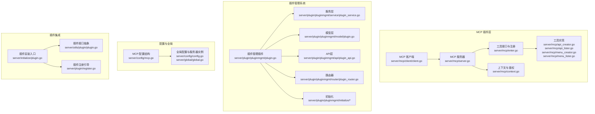

**图表来源**
- [server/mcp/server.go:1-53](file://server/mcp/server.go#L1-L53)
- [server/mcp/client/client.go:1-45](file://server/mcp/client/client.go#L1-L45)
- [server/mcp/context.go:1-67](file://server/mcp/context.go#L1-L67)
- [server/mcp/enter.go:1-32](file://server/mcp/enter.go#L1-L32)
- [server/plugin/pluginmgmt/plugin.go:1-26](file://server/plugin/pluginmgmt/plugin.go#L1-L26)
- [server/plugin/pluginmgmt/service/plugin_service.go:1-87](file://server/plugin/pluginmgmt/service/plugin_service.go#L1-L87)
- [server/plugin/pluginmgmt/model/plugin.go:1-28](file://server/plugin/pluginmgmt/model/plugin.go#L1-L28)
- [server/plugin/pluginmgmt/api/plugin_api.go:1-203](file://server/plugin/pluginmgmt/api/plugin_api.go#L1-L203)
- [server/plugin/pluginmgmt/router/plugin_router.go:1-22](file://server/plugin/pluginmgmt/router/plugin_router.go#L1-L22)
- [server/plugin/pluginmgmt/initialize/gorm.go:1-21](file://server/plugin/pluginmgmt/initialize/gorm.go#L1-L21)
- [server/plugin/pluginmgmt/initialize/router.go:1-16](file://server/plugin/pluginmgmt/initialize/router.go#L1-L16)

**章节来源**
- [server/mcp/server.go:1-53](file://server/mcp/server.go#L1-L53)
- [server/mcp/client/client.go:1-45](file://server/mcp/client/client.go#L1-L45)
- [server/mcp/context.go:1-67](file://server/mcp/context.go#L1-L67)
- [server/mcp/enter.go:1-32](file://server/mcp/enter.go#L1-L32)
- [server/plugin/pluginmgmt/plugin.go:1-26](file://server/plugin/pluginmgmt/plugin.go#L1-L26)
- [server/plugin/pluginmgmt/service/plugin_service.go:1-87](file://server/plugin/pluginmgmt/service/plugin_service.go#L1-L87)
- [server/plugin/pluginmgmt/model/plugin.go:1-28](file://server/plugin/pluginmgmt/model/plugin.go#L1-L28)
- [server/plugin/pluginmgmt/api/plugin_api.go:1-203](file://server/plugin/pluginmgmt/api/plugin_api.go#L1-L203)
- [server/plugin/pluginmgmt/router/plugin_router.go:1-22](file://server/plugin/pluginmgmt/router/plugin_router.go#L1-L22)
- [server/plugin/pluginmgmt/initialize/gorm.go:1-21](file://server/plugin/pluginmgmt/initialize/gorm.go#L1-L21)
- [server/plugin/pluginmgmt/initialize/router.go:1-16](file://server/plugin/pluginmgmt/initialize/router.go#L1-L16)

## 核心组件
- MCP 服务器：封装 MCPServer 实例，负责工具注册、HTTP 处理器挂载、健康检查端点。
- MCP 客户端：封装 Streamable HTTP 客户端，负责连接、初始化握手、鉴权头透传。
- 工具接口与注册：定义 McpTool 接口，提供注册表与统一注册函数，便于工具按需注册。
- 工具实现：内置工具包括 API 创建与列举、菜单创建与列举，均通过上游服务调用完成业务操作。
- 配置与全局：MCP 配置结构、全局配置与 MCP 服务器实例、全局上下文鉴权头解析。
- 插件集成：插件安装入口、插件接口抽象、插件注册引导。
- **新增** 插件管理系统：插件管理插件入口、服务层处理、模型定义、API接口、路由器配置、初始化流程。

**章节来源**
- [server/mcp/server.go:1-53](file://server/mcp/server.go#L1-L53)
- [server/mcp/client/client.go:1-45](file://server/mcp/client/client.go#L1-L45)
- [server/mcp/enter.go:1-32](file://server/mcp/enter.go#L1-L32)
- [server/mcp/api_creator.go:1-160](file://server/mcp/api_creator.go#L1-L160)
- [server/mcp/api_lister.go:1-96](file://server/mcp/api_lister.go#L1-L96)
- [server/mcp/menu_creator.go:1-229](file://server/mcp/menu_creator.go#L1-L229)
- [server/mcp/menu_lister.go:1-60](file://server/mcp/menu_lister.go#L1-L60)
- [server/config/mcp.go:1-19](file://server/config/mcp.go#L1-L19)
- [server/config/config.go:1-41](file://server/config/config.go#L1-L41)
- [server/global/global.go:1-69](file://server/global/global.go#L1-L69)
- [server/initialize/plugin.go:1-16](file://server/initialize/plugin.go#L1-L16)
- [server/utils/plugin/plugin.go:1-19](file://server/utils/plugin/plugin.go#L1-L19)
- [server/plugin/register.go:1-6](file://server/plugin/register.go#L1-L6)
- [server/plugin/pluginmgmt/plugin.go:1-26](file://server/plugin/pluginmgmt/plugin.go#L1-L26)
- [server/plugin/pluginmgmt/service/plugin_service.go:1-87](file://server/plugin/pluginmgmt/service/plugin_service.go#L1-L87)
- [server/plugin/pluginmgmt/model/plugin.go:1-28](file://server/plugin/pluginmgmt/model/plugin.go#L1-L28)

## 架构总览
MCP 插件系统以"工具即服务"为核心，通过统一的 MCPServer 承载多个工具，每个工具通过 JSON Schema 定义参数，并在 Handle 中执行业务逻辑。客户端通过 Streamable HTTP 与服务器建立长连接，完成初始化握手与工具调用。配置层提供 MCP 名称、版本、监听路径、鉴权头等参数，全局层持有 MCPServer 实例并提供上下文鉴权头提取能力。插件系统通过初始化阶段安装插件并注册到路由体系。

**新增** 插件管理系统采用标准的三层架构（API-Service-Model），提供完整的插件生命周期管理，包括创建、删除、更新、查询、状态管理等功能。新旧系统并存，MCP系统专注于工具调用，插件管理系统专注于插件实体管理。

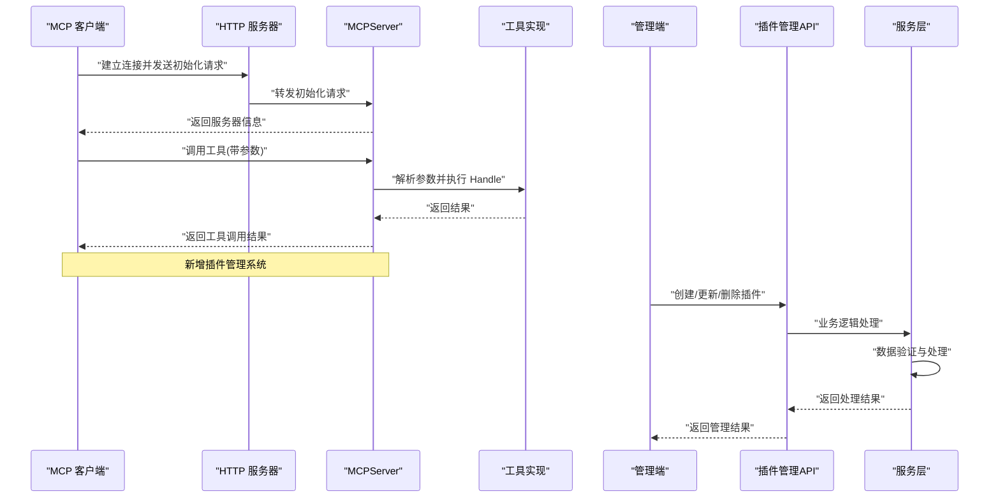

**图表来源**
- [server/mcp/server.go:25-52](file://server/mcp/server.go#L25-L52)
- [server/mcp/client/client.go:12-44](file://server/mcp/client/client.go#L12-L44)
- [server/mcp/enter.go:9-31](file://server/mcp/enter.go#L9-L31)
- [server/plugin/pluginmgmt/api/plugin_api.go:14-203](file://server/plugin/pluginmgmt/api/plugin_api.go#L14-L203)
- [server/plugin/pluginmgmt/service/plugin_service.go:14-87](file://server/plugin/pluginmgmt/service/plugin_service.go#L14-L87)

## 详细组件分析

### MCP 服务器与 HTTP 挂载
- 服务器构造：从全局配置读取 MCP 名称与版本，创建 MCPServer 并注册所有工具。
- HTTP 服务器：创建 ServeMux 与 http.Server，挂载 MCP 路径处理器与健康检查端点。
- 上下文注入：通过 WithHTTPRequestContext 提取鉴权头并注入到请求上下文。

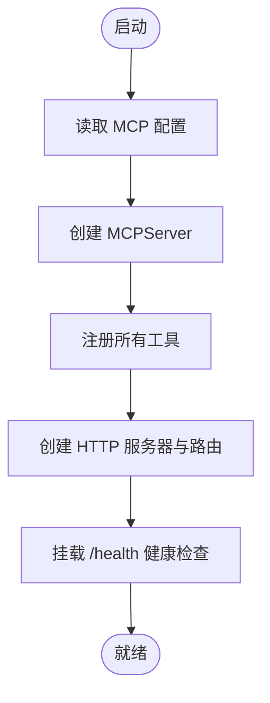

**图表来源**
- [server/mcp/server.go:11-52](file://server/mcp/server.go#L11-L52)
- [server/mcp/context.go:15-34](file://server/mcp/context.go#L15-L34)

**章节来源**
- [server/mcp/server.go:1-53](file://server/mcp/server.go#L1-L53)
- [server/mcp/context.go:1-67](file://server/mcp/context.go#L1-L67)

### MCP 客户端与初始化握手
- 客户端创建：可选设置 HTTP 头，创建 Streamable HTTP 客户端并启动。
- 初始化握手：发送 Initialize 请求，携带客户端信息与协议版本，校验服务器名称一致性。
- 错误处理：握手失败或服务器名不匹配时返回错误。

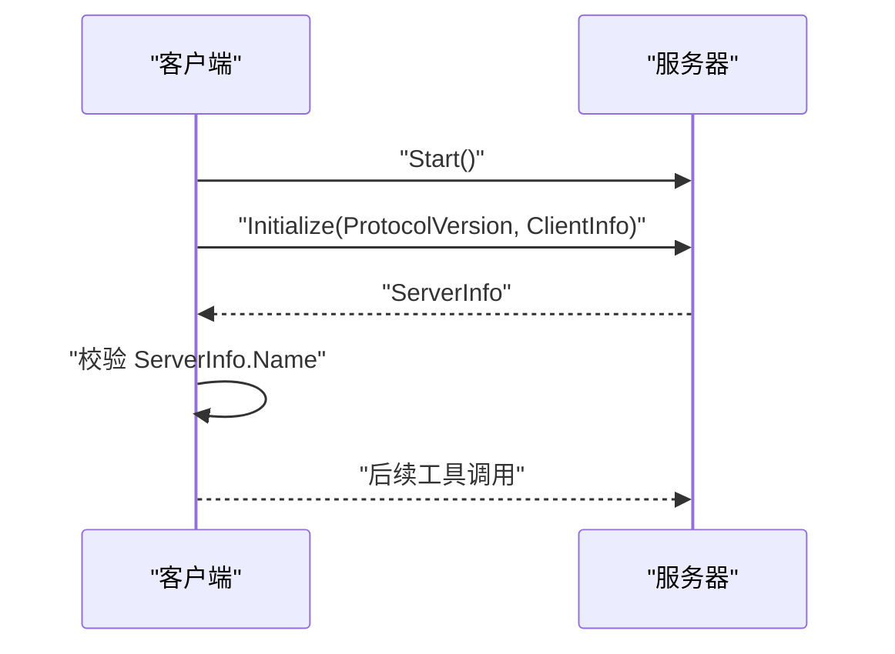

**图表来源**
- [server/mcp/client/client.go:12-44](file://server/mcp/client/client.go#L12-L44)

**章节来源**
- [server/mcp/client/client.go:1-45](file://server/mcp/client/client.go#L1-L45)

### 工具接口与注册机制
- 接口定义：McpTool 提供 New（返回工具元信息）与 Handle（执行工具逻辑）两个方法。
- 注册表：全局 map 保存工具名到工具实例的映射。
- 统一注册：遍历注册表，将工具元信息与处理函数注册到 MCPServer。

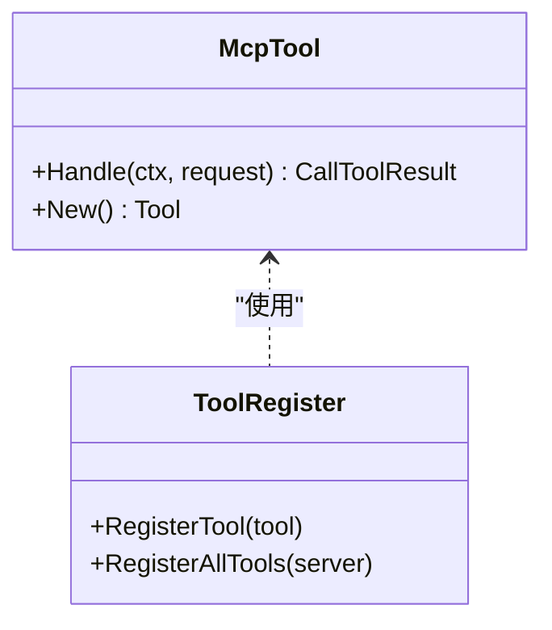

**图表来源**
- [server/mcp/enter.go:9-31](file://server/mcp/enter.go#L9-L31)

**章节来源**
- [server/mcp/enter.go:1-32](file://server/mcp/enter.go#L1-L32)

### 工具实现：API 创建与列举
- API 创建工具：接收 path/description/apiGroup/method/apis 等参数，支持单个与批量创建；通过上游服务创建 API 并查询 ID，汇总结果返回。
- API 列举工具：拉取数据库 API 列表与 Gin 路由列表，合并为统一响应结构。

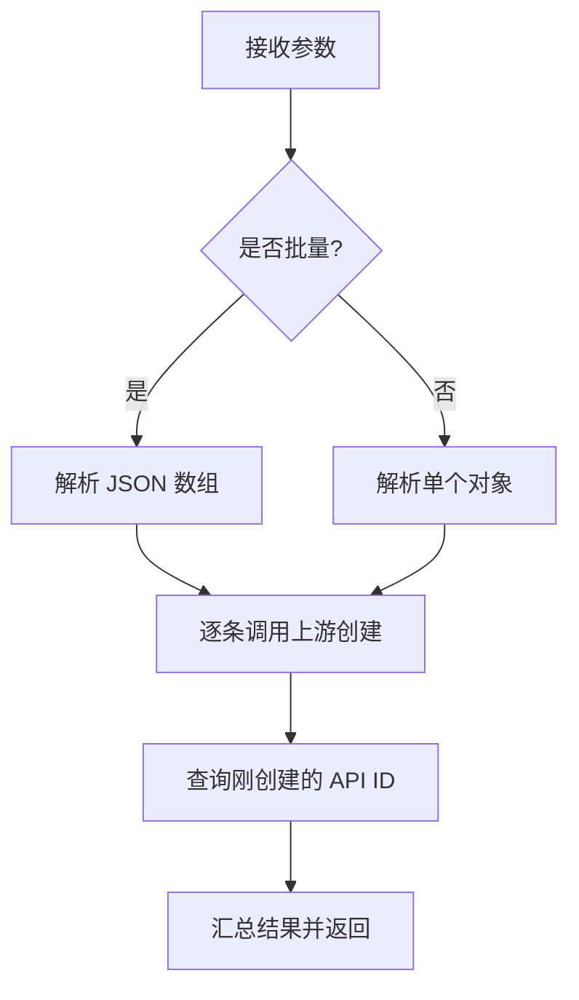

**图表来源**
- [server/mcp/api_creator.go:65-159](file://server/mcp/api_creator.go#L65-L159)
- [server/mcp/api_lister.go:56-95](file://server/mcp/api_lister.go#L56-L95)

**章节来源**
- [server/mcp/api_creator.go:1-160](file://server/mcp/api_creator.go#L1-L160)
- [server/mcp/api_lister.go:1-96](file://server/mcp/api_lister.go#L1-L96)

### 工具实现：菜单创建与列举
- 菜单创建工具：接收 parentId/path/name/hidden/component/sort/title/icon/keepAlive/defaultMenu/closeTab/activeName/parameters/menuBtn 等参数，解析 JSON 字段，调用上游创建菜单并回查菜单 ID。
- 菜单列举工具：拉取完整菜单树，返回给前端用于路由与导航配置。

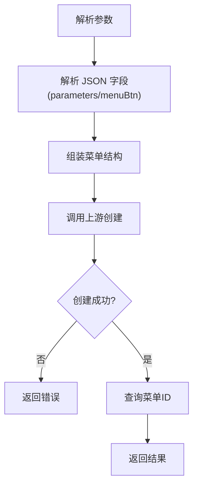

**图表来源**
- [server/mcp/menu_creator.go:114-216](file://server/mcp/menu_creator.go#L114-L216)
- [server/mcp/menu_lister.go:46-59](file://server/mcp/menu_lister.go#L46-L59)

**章节来源**
- [server/mcp/menu_creator.go:1-229](file://server/mcp/menu_creator.go#L1-L229)
- [server/mcp/menu_lister.go:1-60](file://server/mcp/menu_lister.go#L1-L60)

### 配置与全局状态
- MCP 配置结构：包含名称、版本、路径、地址、基础 URL、上游基础 URL、鉴权头、请求超时等字段。
- 全局配置与服务器实例：全局持有 MCP 服务器实例，便于跨模块共享；上下文工具提供鉴权头提取能力。
- 服务器配置：全局配置结构中嵌入 MCP 配置，供服务器加载。

**章节来源**
- [server/config/mcp.go:1-19](file://server/config/mcp.go#L1-L19)
- [server/config/config.go:38-40](file://server/config/config.go#L38-L40)
- [server/global/global.go:25-42](file://server/global/global.go#L25-L42)
- [server/mcp/context.go:20-34](file://server/mcp/context.go#L20-L34)

### 插件系统集成
- 插件安装入口：在初始化阶段根据数据库状态决定是否安装插件，分别调用业务插件 V1/V2 的安装逻辑。
- 插件接口抽象：定义 Plugin 接口，要求实现 Register 与 RouterPath，便于统一管理。
- 插件注册引导：通过空白导入触发插件包的 init，完成插件的自动注册。

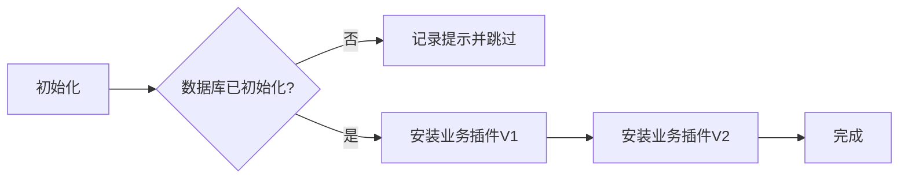

**图表来源**
- [server/initialize/plugin.go:8-15](file://server/initialize/plugin.go#L8-L15)
- [server/utils/plugin/plugin.go:11-18](file://server/utils/plugin/plugin.go#L11-L18)
- [server/plugin/register.go:3-5](file://server/plugin/register.go#L3-L5)

**章节来源**
- [server/initialize/plugin.go:1-16](file://server/initialize/plugin.go#L1-L16)
- [server/utils/plugin/plugin.go:1-19](file://server/utils/plugin/plugin.go#L1-L19)
- [server/plugin/register.go:1-6](file://server/plugin/register.go#L1-L6)

## 插件管理系统架构

### 插件管理插件入口
插件管理插件作为独立的插件模块，实现统一的插件生命周期管理接口。通过接口注册机制自动注册到插件系统中，提供标准的插件管理能力。

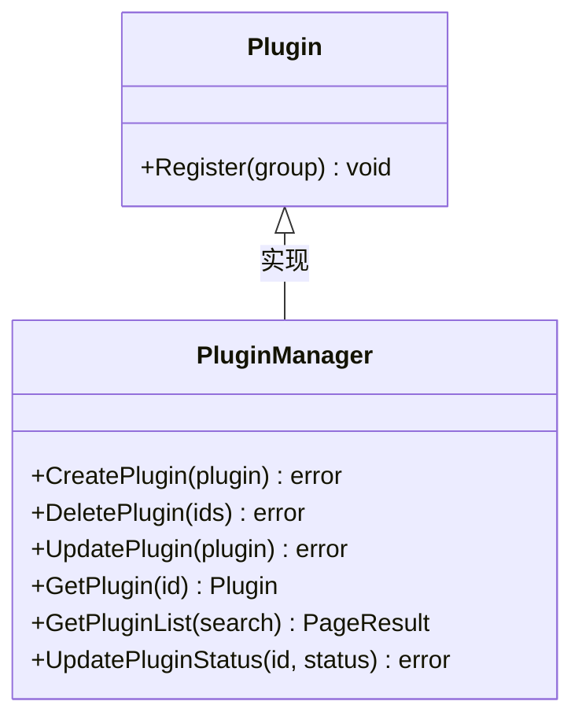

**图表来源**
- [server/plugin/pluginmgmt/plugin.go:21-25](file://server/plugin/pluginmgmt/plugin.go#L21-L25)

### 服务层设计
服务层提供完整的插件业务逻辑处理，包括数据验证、业务规则检查、数据库操作等。采用事务性操作确保数据一致性。

- **创建插件**：检查插件编码唯一性，防止重复创建
- **删除插件**：支持批量删除，级联删除相关配置
- **更新插件**：更新插件基本信息和配置
- **查询插件**：支持分页查询、条件过滤、排序
- **状态管理**：更新插件启用/禁用状态

**章节来源**
- [server/plugin/pluginmgmt/service/plugin_service.go:14-87](file://server/plugin/pluginmgmt/service/plugin_service.go#L14-L87)

### 数据模型设计
插件管理采用标准化的数据模型设计，支持多种插件类型和状态管理：

- **插件基本信息**：名称、编码、版本、类型、描述、作者、图标
- **配置信息**：JSON格式的插件配置，支持动态配置
- **健康状态**：外部插件的健康检查URL和服务名称
- **状态管理**：启用、禁用、异常等状态标识

**章节来源**
- [server/plugin/pluginmgmt/model/plugin.go:7-27](file://server/plugin/pluginmgmt/model/plugin.go#L7-L27)

### API接口设计
插件管理API提供RESTful接口，支持标准的CRUD操作和状态管理：

- **创建插件**：POST /plugin/createPlugin
- **删除插件**：DELETE /plugin/deletePlugin  
- **更新插件**：PUT /plugin/updatePlugin
- **获取插件**：GET /plugin/getPlugin
- **获取插件列表**：GET /plugin/getPluginList
- **更新插件状态**：PUT /plugin/updatePluginStatus

**章节来源**
- [server/plugin/pluginmgmt/api/plugin_api.go:14-203](file://server/plugin/pluginmgmt/api/plugin_api.go#L14-L203)

### 路由与初始化
插件管理系统的路由采用标准的分组设计，区分公开路由和受保护路由。初始化流程包括数据库迁移和路由注册。

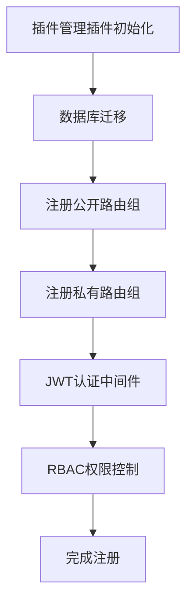

**图表来源**
- [server/plugin/pluginmgmt/initialize/router.go:10-15](file://server/plugin/pluginmgmt/initialize/router.go#L10-L15)
- [server/plugin/pluginmgmt/initialize/gorm.go:12-20](file://server/plugin/pluginmgmt/initialize/gorm.go#L12-L20)

**章节来源**
- [server/plugin/pluginmgmt/router/plugin_router.go:10-21](file://server/plugin/pluginmgmt/router/plugin_router.go#L10-L21)
- [server/plugin/pluginmgmt/initialize/router.go:10-15](file://server/plugin/pluginmgmt/initialize/router.go#L10-L15)
- [server/plugin/pluginmgmt/initialize/gorm.go:12-20](file://server/plugin/pluginmgmt/initialize/gorm.go#L12-L20)

## 依赖分析
- 组件耦合：MCP 服务器依赖全局配置与工具注册表；工具实现依赖上游服务调用；客户端依赖服务器实例。**新增** 插件管理系统依赖GORM数据库操作、中间件权限控制、API响应封装。
- 外部依赖：使用 mark3labs/mcp-go 提供的 MCPServer、Client、Transport 等组件。**新增** 使用GORM进行数据库操作，使用JWT和Casbin进行权限控制。
- 潜在循环：当前文件间未见直接循环依赖；工具注册通过全局 map 解耦。**新增** 插件管理系统采用标准的分层架构，避免循环依赖。

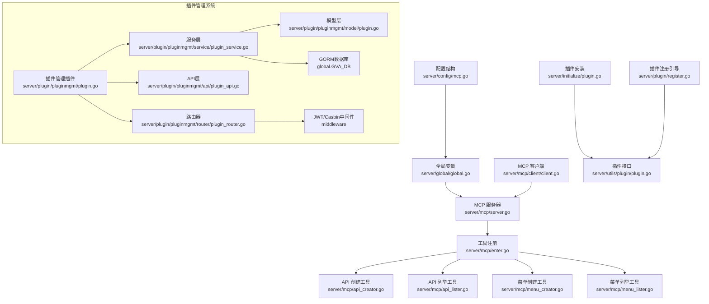

**图表来源**
- [server/config/mcp.go:1-19](file://server/config/mcp.go#L1-L19)
- [server/global/global.go:25-42](file://server/global/global.go#L25-L42)
- [server/mcp/server.go:11-52](file://server/mcp/server.go#L11-L52)
- [server/mcp/enter.go:17-31](file://server/mcp/enter.go#L17-L31)
- [server/mcp/api_creator.go:15-17](file://server/mcp/api_creator.go#L15-L17)
- [server/mcp/api_lister.go:11-13](file://server/mcp/api_lister.go#L11-L13)
- [server/mcp/menu_creator.go:13-15](file://server/mcp/menu_creator.go#L13-L15)
- [server/mcp/menu_lister.go:10-12](file://server/mcp/menu_lister.go#L10-L12)
- [server/mcp/client/client.go:12-44](file://server/mcp/client/client.go#L12-L44)
- [server/initialize/plugin.go:8-15](file://server/initialize/plugin.go#L8-L15)
- [server/utils/plugin/plugin.go:11-18](file://server/utils/plugin/plugin.go#L11-L18)
- [server/plugin/register.go:3-5](file://server/plugin/register.go#L3-L5)
- [server/plugin/pluginmgmt/plugin.go:3-25](file://server/plugin/pluginmgmt/plugin.go#L3-L25)
- [server/plugin/pluginmgmt/service/plugin_service.go:3-10](file://server/plugin/pluginmgmt/service/plugin_service.go#L3-L10)
- [server/plugin/pluginmgmt/model/plugin.go:3-5](file://server/plugin/pluginmgmt/model/plugin.go#L3-L5)
- [server/plugin/pluginmgmt/api/plugin_api.go:3-10](file://server/plugin/pluginmgmt/api/plugin_api.go#L3-L10)
- [server/plugin/pluginmgmt/router/plugin_router.go:3-6](file://server/plugin/pluginmgmt/router/plugin_router.go#L3-L6)

**章节来源**
- [server/mcp/server.go:1-53](file://server/mcp/server.go#L1-L53)
- [server/mcp/enter.go:1-32](file://server/mcp/enter.go#L1-L32)
- [server/mcp/api_creator.go:1-160](file://server/mcp/api_creator.go#L1-L160)
- [server/mcp/api_lister.go:1-96](file://server/mcp/api_lister.go#L1-L96)
- [server/mcp/menu_creator.go:1-229](file://server/mcp/menu_creator.go#L1-L229)
- [server/mcp/menu_lister.go:1-60](file://server/mcp/menu_lister.go#L1-L60)
- [server/mcp/client/client.go:1-45](file://server/mcp/client/client.go#L1-L45)
- [server/config/mcp.go:1-19](file://server/config/mcp.go#L1-L19)
- [server/global/global.go:1-69](file://server/global/global.go#L1-L69)
- [server/initialize/plugin.go:1-16](file://server/initialize/plugin.go#L1-L16)
- [server/utils/plugin/plugin.go:1-19](file://server/utils/plugin/plugin.go#L1-L19)
- [server/plugin/register.go:1-6](file://server/plugin/register.go#L1-L6)
- [server/plugin/pluginmgmt/plugin.go:1-26](file://server/plugin/pluginmgmt/plugin.go#L1-L26)
- [server/plugin/pluginmgmt/service/plugin_service.go:1-87](file://server/plugin/pluginmgmt/service/plugin_service.go#L1-L87)
- [server/plugin/pluginmgmt/model/plugin.go:1-28](file://server/plugin/pluginmgmt/model/plugin.go#L1-L28)
- [server/plugin/pluginmgmt/api/plugin_api.go:1-203](file://server/plugin/pluginmgmt/api/plugin_api.go#L1-L203)
- [server/plugin/pluginmgmt/router/plugin_router.go:1-22](file://server/plugin/pluginmgmt/router/plugin_router.go#L1-L22)
- [server/plugin/pluginmgmt/initialize/gorm.go:1-21](file://server/plugin/pluginmgmt/initialize/gorm.go#L1-L21)
- [server/plugin/pluginmgmt/initialize/router.go:1-16](file://server/plugin/pluginmgmt/initialize/router.go#L1-L16)

## 性能考虑
- 连接复用：客户端使用 Streamable HTTP，减少握手开销，适合高频工具调用。
- 批量处理：API 创建工具支持批量参数，降低多次往返延迟。
- 结果聚合：工具内部对多次上游调用进行聚合，减少客户端解析负担。
- 资源隔离：工具 Handle 在独立上下文中执行，避免相互干扰；HTTP 层通过 ServeMux 分离路径，便于扩展与隔离。
- 超时控制：客户端可配置请求超时，避免阻塞影响整体稳定性。
- **新增** 数据库优化：插件管理系统采用分页查询、条件过滤、索引优化，提升大数据量下的查询性能。
- **新增** 缓存策略：对于频繁访问的插件配置信息，可考虑引入缓存机制减少数据库压力。
- **新增** 并发控制：插件管理API支持并发操作，但需注意数据库锁和事务冲突。

## 故障排查指南
- 服务器未就绪：若数据库未初始化，插件安装会被跳过并记录提示，需先完成初始化再重启。
- 鉴权失败：检查 MCP 配置中的鉴权头字段，确认客户端请求头与服务器期望一致。
- 工具调用失败：查看工具 Handle 的错误返回与上游服务响应，定位具体参数或权限问题。
- 健康检查：通过 /health 端点快速判断服务器运行状态。
- **新增** 插件管理异常：检查插件编码唯一性约束、数据库连接状态、API权限配置。
- **新增** 数据库迁移失败：确认GORM配置正确，数据库用户具有足够的权限执行AutoMigrate。
- **新增** 权限控制问题：验证JWT令牌有效性、RBAC权限规则配置、操作日志记录。

**章节来源**
- [server/initialize/plugin.go:9-12](file://server/initialize/plugin.go#L9-L12)
- [server/mcp/context.go:36-66](file://server/mcp/context.go#L36-L66)
- [server/mcp/server.go:46-49](file://server/mcp/server.go#L46-L49)
- [server/plugin/pluginmgmt/initialize/gorm.go:16-19](file://server/plugin/pluginmgmt/initialize/gorm.go#L16-L19)

## 结论
该插件系统以 MCP 协议为核心，结合统一的工具接口与注册机制，实现了灵活、可扩展的插件生态。通过清晰的配置与全局状态管理、完善的客户端握手与上下文鉴权、以及内置工具的批量与聚合能力，系统在易用性与性能之间取得平衡。配合插件安装与注册机制，可进一步完善生态建设与社区贡献流程。

**重要更新**：新增的插件管理系统提供了完整的插件生命周期管理能力，采用标准的三层架构设计，与MCP插件系统形成互补关系。MCP系统专注于工具调用和业务逻辑执行，插件管理系统专注于插件实体的创建、管理和配置。两者并存架构既保持了系统的向后兼容性，又为未来的插件生态发展奠定了坚实基础。

## 附录
- 开发环境搭建：确保已安装 Go 与项目依赖，配置 MCP 服务器参数（名称、版本、路径、鉴权头等），启动后通过 /health 检查健康状态。**新增** 插件管理系统同样需要正确的数据库配置和权限设置。
- 插件接口规范：遵循 McpTool 接口，实现 New 与 Handle 方法，并在 init 中调用 RegisterTool 完成注册。**新增** 插件管理插件需实现 Plugin 接口的 Register 方法。
- 调试技巧：利用客户端初始化握手输出与工具 Handle 的错误返回，逐步定位问题；必要时开启更详细的日志。**新增** 插件管理系统可通过操作日志和数据库日志进行调试。
- 打包发布：将工具编译为可执行程序或库，按需部署至目标环境，确保 MCP 配置与网络可达。**新增** 插件管理系统需要数据库迁移脚本和API文档。
- 最佳实践：优先使用批量参数、合理设置超时、严格校验输入参数、保持工具职责单一、定期清理无效工具与冗余路由。**新增** 插件管理应建立插件审核机制、版本控制策略、备份恢复方案。
- 生态建设与社区贡献：鼓励开发者提交高质量工具，遵循统一接口与命名规范，提供清晰的工具描述与参数说明，共同维护插件仓库与文档。**新增** 建立插件市场机制，提供插件评分、评论、下载统计等功能，促进插件生态健康发展。