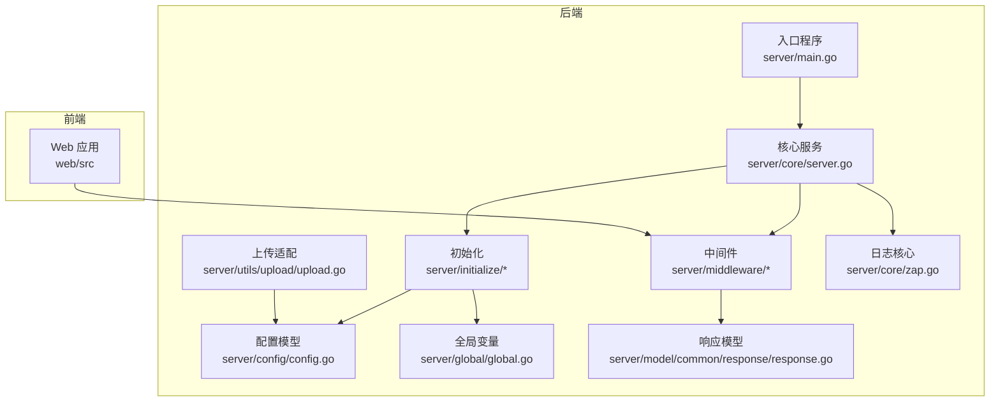
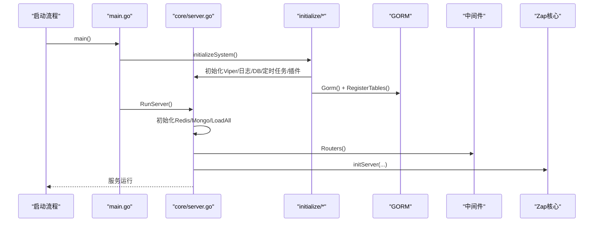
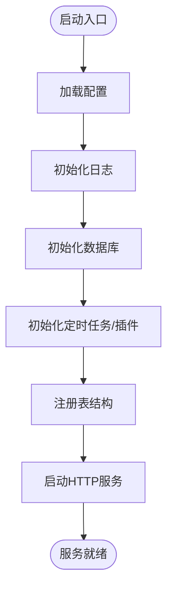
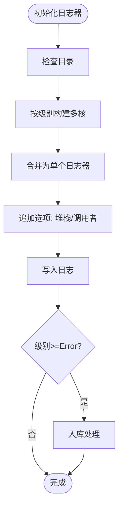
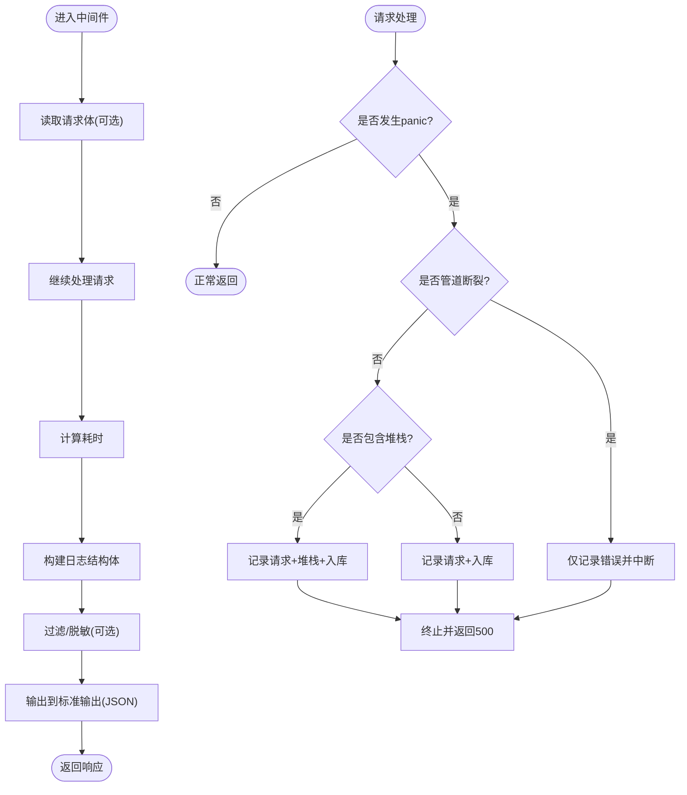
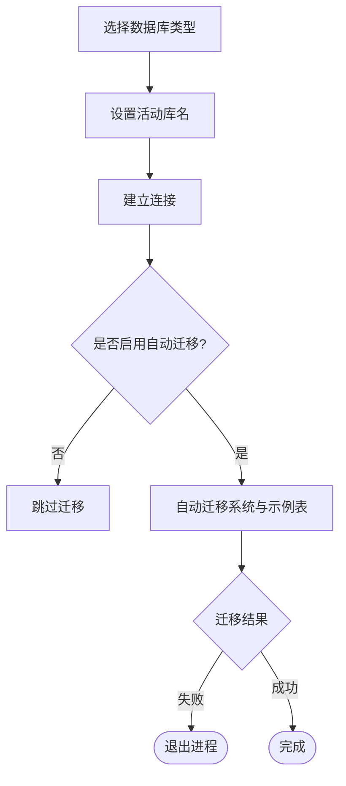
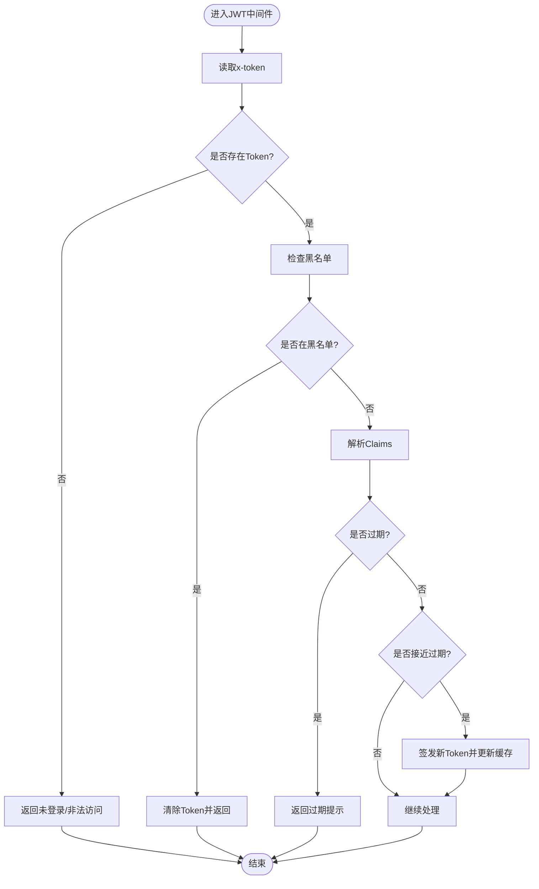
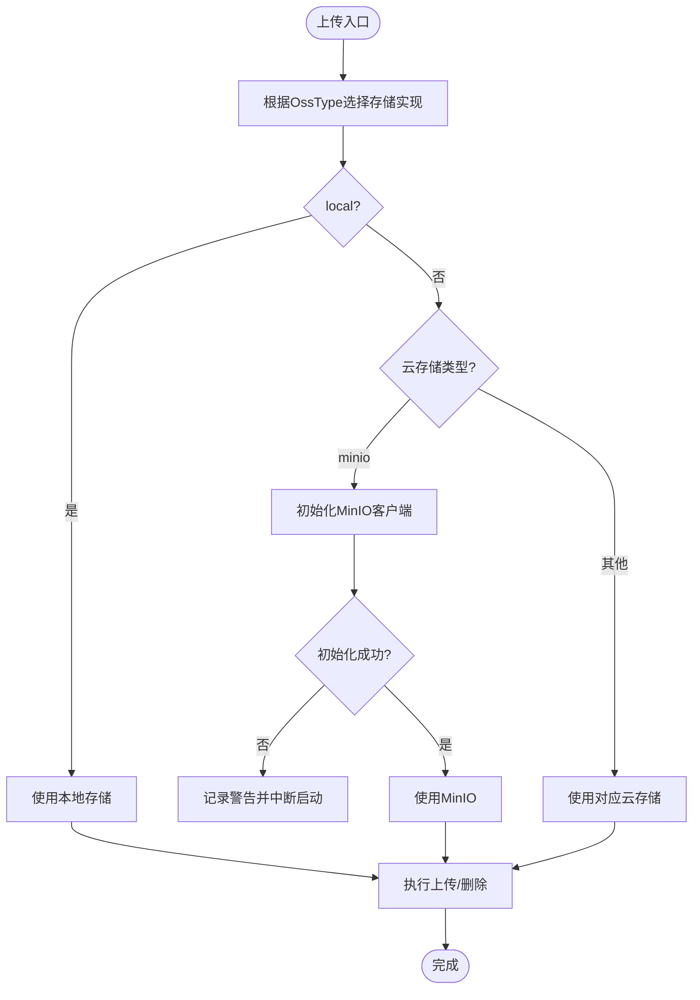
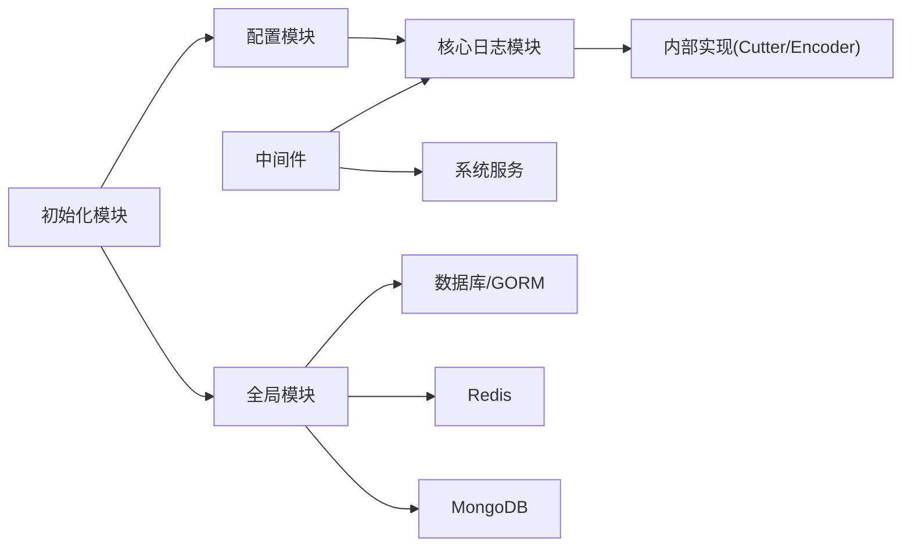

# 故障排除指南

<cite>
**本文引用的文件**
- [server/main.go](file://server/main.go)
- [server/core/server.go](file://server/core/server.go)
- [server/core/zap.go](file://server/core/zap.go)
- [server/config/config.go](file://server/config/config.go)
- [server/global/global.go](file://server/global/global.go)
- [server/initialize/init.go](file://server/initialize/init.go)
- [server/initialize/gorm.go](file://server/initialize/gorm.go)
- [server/middleware/error.go](file://server/middleware/error.go)
- [server/middleware/jwt.go](file://server/middleware/jwt.go)
- [server/middleware/logger.go](file://server/middleware/logger.go)
- [server/model/common/response/response.go](file://server/model/common/response/response.go)
- [server/utils/upload/upload.go](file://server/utils/upload/upload.go)
- [server/utils/system_events.go](file://server/utils/system_events.go)
- [repowiki/zh/content/部署运维/监控与日志管理.md](file://repowiki/zh/content/部署运维/监控与日志管理.md)
</cite>

## 目录
1. [简介](#简介)
2. [项目结构](#项目结构)
3. [核心组件](#核心组件)
4. [架构总览](#架构总览)
5. [详细组件分析](#详细组件分析)
6. [依赖关系分析](#依赖关系分析)
7. [性能考量](#性能考量)
8. [故障排查指南](#故障排查指南)
9. [结论](#结论)
10. [附录](#附录)

## 简介
本指南面向测试管理平台的运维与开发人员，系统化梳理常见故障的诊断与解决流程，覆盖启动失败、数据库连接、权限与认证、文件上传异常等典型问题；并提供性能问题分析方法（内存泄漏检测、慢查询、网络延迟、资源使用监控）、日志分析技巧（级别配置、关键日志追踪、堆栈分析、指标监控）、系统监控与告警配置（关键指标、异常检测、自动告警、故障自愈）、应急响应流程（升级、影响评估、临时修复、永久解决）以及预防性维护与最佳实践。

## 项目结构
后端以 Gin 为核心，结合多数据库与对象存储，日志子系统通过 Zap 实现统一采集与落盘，同时具备错误日志入库与可视化查询能力。前端通过 API 与后端交互，部署层提供容器化与编排配置。

**图表来源**
- [server/main.go:1-52](file://server/main.go#L1-L52)
- [server/core/server.go:1-49](file://server/core/server.go#L1-L49)
- [server/config/config.go:1-41](file://server/config/config.go#L1-L41)
- [server/global/global.go:1-69](file://server/global/global.go#L1-L69)
- [server/middleware/logger.go:1-90](file://server/middleware/logger.go#L1-L90)
- [server/core/zap.go:1-37](file://server/core/zap.go#L1-L37)

**章节来源**
- [server/main.go:1-52](file://server/main.go#L1-L52)
- [server/core/server.go:1-49](file://server/core/server.go#L1-L49)
- [server/config/config.go:1-41](file://server/config/config.go#L1-L41)
- [server/global/global.go:1-69](file://server/global/global.go#L1-L69)

## 核心组件
- 入口与初始化：应用启动时完成配置、日志、数据库、定时任务、插件等初始化，随后启动 HTTP 服务。
- 日志系统：基于 Zap 的多核日志器，支持级别过滤、编码器、文件轮转与入库。
- 中间件体系：访问日志、崩溃恢复、JWT 认证、跨域、限流、超时等。
- 数据库与表注册：根据配置选择数据库类型，自动迁移核心与业务表。
- 上传适配：统一对象存储接口，按配置选择本地或云存储。
- 响应模型：统一的响应结构与状态码常量，便于前端一致处理。

**章节来源**
- [server/main.go:30-52](file://server/main.go#L30-L52)
- [server/core/server.go:14-48](file://server/core/server.go#L14-L48)
- [server/core/zap.go:13-36](file://server/core/zap.go#L13-L36)
- [server/initialize/gorm.go:14-87](file://server/initialize/gorm.go#L14-L87)
- [server/utils/upload/upload.go:17-46](file://server/utils/upload/upload.go#L17-L46)
- [server/model/common/response/response.go:9-63](file://server/model/common/response/response.go#L9-L63)

## 架构总览
应用启动时依次完成配置加载、日志初始化、数据库连接与表注册、定时任务与插件初始化，最后启动 HTTP 服务并打印运行信息。请求经中间件处理，错误与异常通过中间件与日志核心入库，便于检索与分析。

**图表来源**
- [server/main.go:30-52](file://server/main.go#L30-L52)
- [server/core/server.go:14-48](file://server/core/server.go#L14-L48)
- [server/initialize/gorm.go:14-87](file://server/initialize/gorm.go#L14-L87)

## 详细组件分析

### 启动与初始化流程
- 入口函数负责系统初始化与服务器运行，初始化顺序包括 Viper 配置、日志、数据库、定时任务、插件与表注册。
- RunServer 根据配置决定是否初始化 Redis/Mongo，加载系统参数，构建路由并启动 HTTP 服务。

**图表来源**
- [server/main.go:30-52](file://server/main.go#L30-L52)
- [server/core/server.go:14-48](file://server/core/server.go#L14-L48)

**章节来源**
- [server/main.go:30-52](file://server/main.go#L30-L52)
- [server/core/server.go:14-48](file://server/core/server.go#L14-L48)

### 日志系统与错误入库
- 日志初始化：自动创建日志目录，按级别构建多核日志器，启用堆栈与调用者信息，支持控制台输出与文件轮转。
- 错误入库：当日志级别达到 Error 及以上时，提取错误信息与调用栈，封装后入库，便于检索与异步处理。

**图表来源**
- [server/core/zap.go:15-36](file://server/core/zap.go#L15-L36)

**章节来源**
- [server/core/zap.go:15-36](file://server/core/zap.go#L15-L36)
- [repowiki/zh/content/部署运维/监控与日志管理.md:131-165](file://repowiki/zh/content/部署运维/监控与日志管理.md#L131-L165)

### 访问日志中间件与崩溃恢复
- 访问日志中间件：结构化输出请求路径、参数、耗时、来源与错误，支持过滤与脱敏，便于外部日志系统收集。
- 崩溃恢复中间件：捕获 panic，区分“管道断裂”等场景，记录请求上下文与堆栈，必要时入库并返回统一错误码。

**图表来源**
- [server/middleware/logger.go:41-89](file://server/middleware/logger.go#L41-L89)
- [server/middleware/error.go:21-80](file://server/middleware/error.go#L21-L80)

**章节来源**
- [server/middleware/logger.go:1-90](file://server/middleware/logger.go#L1-L90)
- [server/middleware/error.go:1-81](file://server/middleware/error.go#L1-L81)

### 数据库连接与表注册
- 数据库选择：根据配置 DbType 选择 MySQL、PostgreSQL、Oracle、SQL Server 或 SQLite，并设置活动库名。
- 表注册：在 AutoMigrate 关闭时跳过迁移；否则自动迁移系统与示例表，失败时记录日志并退出。

**图表来源**
- [server/initialize/gorm.go:14-87](file://server/initialize/gorm.go#L14-L87)

**章节来源**
- [server/initialize/gorm.go:14-87](file://server/initialize/gorm.go#L14-L87)

### 权限与认证（JWT）
- JWT 中间件：从请求头读取 Token，校验黑名单与过期，解析 Claims；临近过期时签发新 Token 并更新缓存。
- 统一响应：未登录或非法访问返回统一状态码与消息。

**图表来源**
- [server/middleware/jwt.go:16-89](file://server/middleware/jwt.go#L16-L89)
- [server/model/common/response/response.go:52-58](file://server/model/common/response/response.go#L52-L58)

**章节来源**
- [server/middleware/jwt.go:16-89](file://server/middleware/jwt.go#L16-L89)
- [server/model/common/response/response.go:9-63](file://server/model/common/response/response.go#L9-L63)

### 文件上传异常处理
- 上传适配：根据配置的 OssType 选择本地或云存储实现；当配置 MinIO 但初始化失败时记录警告并中断启动，避免不安全状态。
- 统一接口：上传与删除均通过 OSS 接口抽象，便于扩展与替换。

**图表来源**
- [server/utils/upload/upload.go:17-46](file://server/utils/upload/upload.go#L17-L46)

**章节来源**
- [server/utils/upload/upload.go:17-46](file://server/utils/upload/upload.go#L17-L46)

## 依赖关系分析
- 配置模块为日志、数据库、缓存、对象存储等子系统提供统一配置入口。
- 核心日志模块依赖内部实现（切片器、编码器）与配置模块。
- 中间件依赖核心日志模块与系统服务模块。
- 初始化模块负责数据库连接、表注册、定时任务与插件加载。
- 全局模块提供共享的数据库、Redis、Mongo、配置与日志实例。

**图表来源**
- [server/config/config.go:1-41](file://server/config/config.go#L1-L41)
- [server/core/zap.go:15-36](file://server/core/zap.go#L15-L36)
- [server/initialize/gorm.go:14-87](file://server/initialize/gorm.go#L14-L87)
- [server/global/global.go:25-42](file://server/global/global.go#L25-L42)

**章节来源**
- [server/config/config.go:1-41](file://server/config/config.go#L1-L41)
- [server/core/zap.go:15-36](file://server/core/zap.go#L15-L36)
- [server/initialize/gorm.go:14-87](file://server/initialize/gorm.go#L14-L87)
- [server/global/global.go:25-42](file://server/global/global.go#L25-L42)

## 性能考量
- 日志写入：采用多核分流与延迟关闭文件句柄，减少竞争与 IO 开销。
- 保留策略：按保留天数清理过期目录，避免磁盘膨胀；合理设置保留天数平衡存储与追溯需求。
- 结构化输出：访问日志以 JSON 输出，便于外部日志收集系统高效解析。
- 崩溃恢复：仅在非“管道断裂”场景记录堆栈，降低误报与冗余开销。
- 数据库入库：错误日志入库使用后台上下文，避免阻塞请求链路。
- 资源使用监控：结合外部监控工具（Prometheus/Grafana）暴露关键指标，设置告警规则与通知渠道。

**章节来源**
- [repowiki/zh/content/部署运维/监控与日志管理.md:321-327](file://repowiki/zh/content/部署运维/监控与日志管理.md#L321-L327)

## 故障排查指南

### 启动失败排查
- 检查配置文件与环境变量是否正确加载，确认系统端口、数据库连接串、对象存储配置等关键项。
- 查看日志目录权限与磁盘空间，确保日志可写且不会因磁盘满导致启动失败。
- 若数据库初始化失败，检查数据库连通性、账号权限与迁移脚本；确认自动迁移开关与表注册流程。
- 若 Redis/Mongo 初始化失败，检查服务可达性与认证配置；必要时关闭相关功能以定位问题。

**章节来源**
- [server/main.go:30-52](file://server/main.go#L30-L52)
- [server/core/server.go:14-48](file://server/core/server.go#L14-L48)
- [server/initialize/gorm.go:14-87](file://server/initialize/gorm.go#L14-L87)
- [repowiki/zh/content/部署运维/监控与日志管理.md:330-336](file://repowiki/zh/content/部署运维/监控与日志管理.md#L330-L336)

### 数据库连接问题
- 连接串与驱动：确认 DbType 与对应驱动配置正确，检查主机、端口、数据库名、用户名与密码。
- 迁移失败：查看自动迁移日志，确认系统表与业务表是否成功创建；必要时手动执行迁移或修复约束。
- 连接池与超时：调整连接池大小与超时参数，避免高并发下的连接争用与超时。
- 多库配置：若使用 DBList，确认各库配置与切换逻辑，避免误用非活动库。

**章节来源**
- [server/initialize/gorm.go:14-87](file://server/initialize/gorm.go#L14-L87)
- [server/global/global.go:25-49](file://server/global/global.go#L25-L49)

### 权限与认证问题
- Token 缺失或非法：检查前端是否正确携带 Token，确认请求头名称与过期时间。
- 黑名单与异地登录：检查 JWT 是否在黑名单中，确认 Redis 中的活跃 Token 状态。
- 过期与刷新：确认 JWT 过期时间与缓冲时间配置，确保临近过期时能正确签发新 Token。
- 统一响应：未登录或非法访问会返回统一状态码，前端需据此引导登录或重新授权。

**章节来源**
- [server/middleware/jwt.go:16-89](file://server/middleware/jwt.go#L16-L89)
- [server/model/common/response/response.go:52-58](file://server/model/common/response/response.go#L52-L58)

### 文件上传异常
- 存储类型选择：确认 OssType 配置与实际使用的存储类型一致。
- MinIO 初始化：若配置了 MinIO，检查 Endpoint、AccessKey、SecretKey、BucketName 与 SSL 配置；初始化失败会中断启动。
- 上传接口：通过统一 OSS 接口调用上传与删除，关注返回的错误信息与状态码。
- 权限与配额：检查对象存储的桶权限、配额限制与网络连通性。

**章节来源**
- [server/utils/upload/upload.go:17-46](file://server/utils/upload/upload.go#L17-L46)

### 日志与错误分析
- 日志级别与输出：确认日志级别、控制台输出与保留天数配置；检查目录权限与磁盘空间。
- 访问日志缺失：确认中间件已正确挂载，检查输出格式与过滤策略。
- 错误入库：确认错误级别达到入库阈值，检查数据库连接与 SysError 表结构。
- 崩溃恢复：检查中间件顺序与堆栈开关，确保 panic 信息被正确记录与入库。

**章节来源**
- [server/core/zap.go:15-36](file://server/core/zap.go#L15-L36)
- [server/middleware/logger.go:1-90](file://server/middleware/logger.go#L1-90)
- [server/middleware/error.go:1-81](file://server/middleware/error.go#L1-81)
- [repowiki/zh/content/部署运维/监控与日志管理.md:330-336](file://repowiki/zh/content/部署运维/监控与日志管理.md#L330-L336)

### 性能问题定位
- 内存泄漏检测：结合 pprof 与 GC 统计，定位热点函数与对象分配；关注长时间运行服务的 goroutine 泄漏。
- 慢查询分析：开启数据库慢查询日志，结合 SQL 执行计划与索引使用情况优化。
- 网络延迟分析：使用分布式链路追踪（如 Jaeger/OpenTelemetry）定位跨服务调用瓶颈。
- 资源使用监控：通过外部监控系统（Prometheus/Grafana）观察 CPU、内存、磁盘、网络与数据库连接数等指标。

**章节来源**
- [repowiki/zh/content/部署运维/监控与日志管理.md:321-327](file://repowiki/zh/content/部署运维/监控与日志管理.md#L321-L327)

### 系统监控与告警配置
- 指标暴露：在应用中引入指标导出库，暴露关键指标（请求耗时、错误率、队列长度等），并通过 HTTP 端点暴露给 Prometheus 抓取。
- 抓取配置：在 Prometheus 中配置抓取目标，设置合适的抓取间隔与超时。
- 图表与仪表板：在 Grafana 中创建面板，使用 PromQL 查询指标，设置告警规则并绑定通知通道。
- 健康检查：利用部署配置中的存活/就绪探针，确保服务可用性；容器编排系统在探针失败时自动重启 Pod。

**章节来源**
- [repowiki/zh/content/部署运维/监控与日志管理.md:349-370](file://repowiki/zh/content/部署运维/监控与日志管理.md#L349-L370)

### 应急响应流程
- 故障升级：根据影响范围与严重程度分级，明确升级路径与责任人。
- 影响评估：统计受影响用户数、业务中断时长与数据损失风险。
- 临时修复：快速回滚最近变更、关闭问题功能、扩容资源或启用降级策略。
- 永久解决：根因分析、修复补丁、回归测试与发布；完善监控与告警，防止同类问题再次发生。

**章节来源**
- [server/utils/system_events.go:16-34](file://server/utils/system_events.go#L16-L34)

### 预防性维护与最佳实践
- 配置管理：集中管理配置，启用热加载与变更审计；定期审查配置项的有效性。
- 日志策略：设定合理的日志级别与保留策略，避免日志风暴；定期清理过期日志。
- 数据库维护：定期备份、索引维护与统计信息更新；监控连接池与慢查询。
- 安全加固：定期更新依赖与补丁，强化认证与授权策略；限制敏感接口访问。
- 监控与演练：完善监控与告警体系，定期进行故障演练与应急预案评审。

## 结论
本项目通过集中配置、多核日志器、结构化访问日志与错误入库，构建了完善的日志与监控基础。结合外部监控工具与告警系统，可进一步实现系统指标、性能与业务监控的可视化与自动化告警，显著提升运维效率与问题定位速度。遵循本文提供的故障排查流程与最佳实践，可有效降低系统故障率与恢复时间。

## 附录

### 常见问题快速参考
- 启动失败：检查配置、日志目录权限、数据库连接与初始化日志。
- 数据库异常：核对 DbType 与连接串、迁移日志与表结构、连接池参数。
- 权限问题：确认 Token 有效性、黑名单状态与过期刷新逻辑。
- 上传失败：验证 OssType 与存储配置、MinIO 初始化与桶权限。
- 日志异常：确认日志级别、输出格式、保留策略与入库阈值。

**章节来源**
- [server/main.go:30-52](file://server/main.go#L30-L52)
- [server/initialize/gorm.go:14-87](file://server/initialize/gorm.go#L14-L87)
- [server/middleware/jwt.go:16-89](file://server/middleware/jwt.go#L16-L89)
- [server/utils/upload/upload.go:17-46](file://server/utils/upload/upload.go#L17-L46)
- [repowiki/zh/content/部署运维/监控与日志管理.md:330-336](file://repowiki/zh/content/部署运维/监控与日志管理.md#L330-L336)