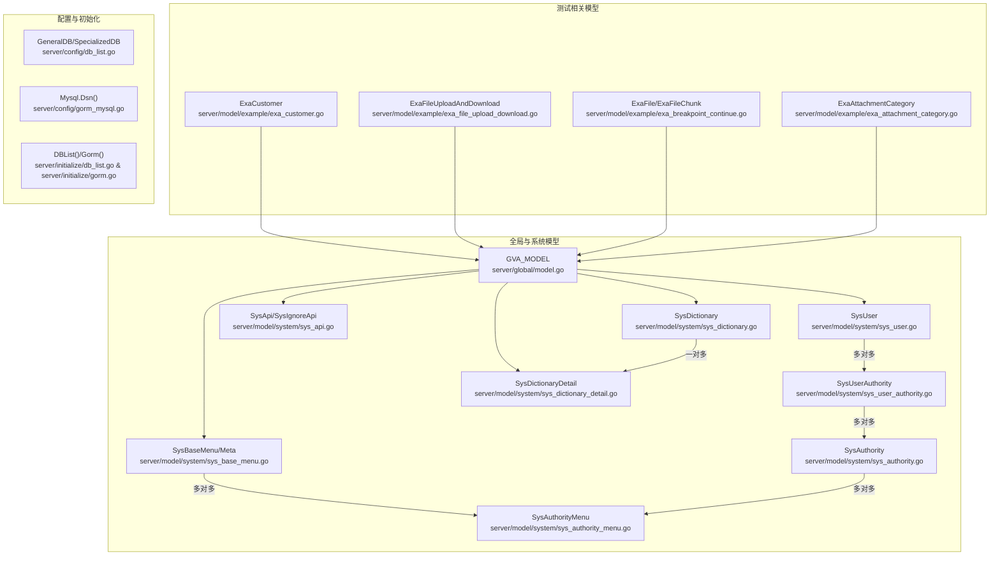
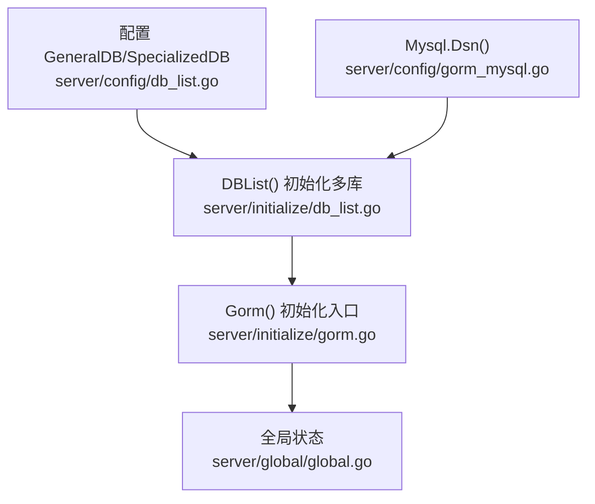
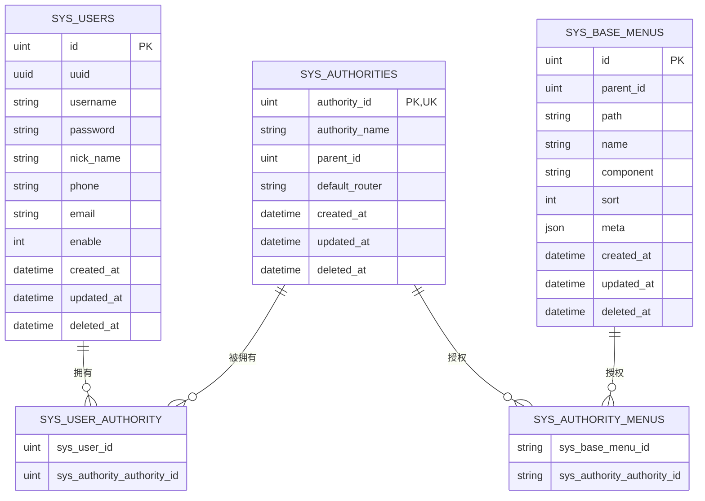
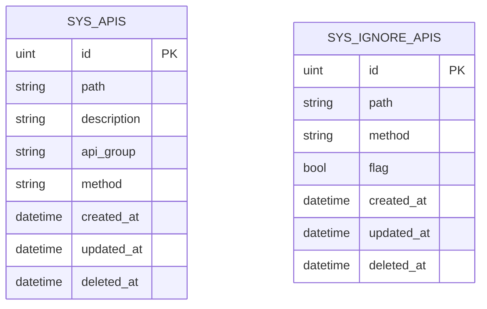
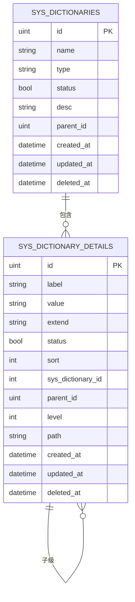
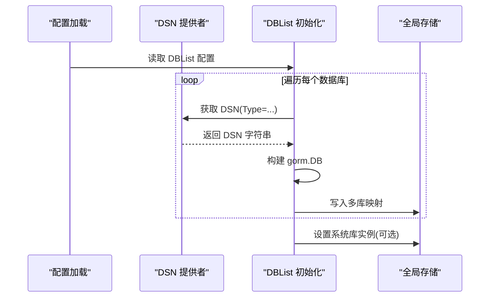
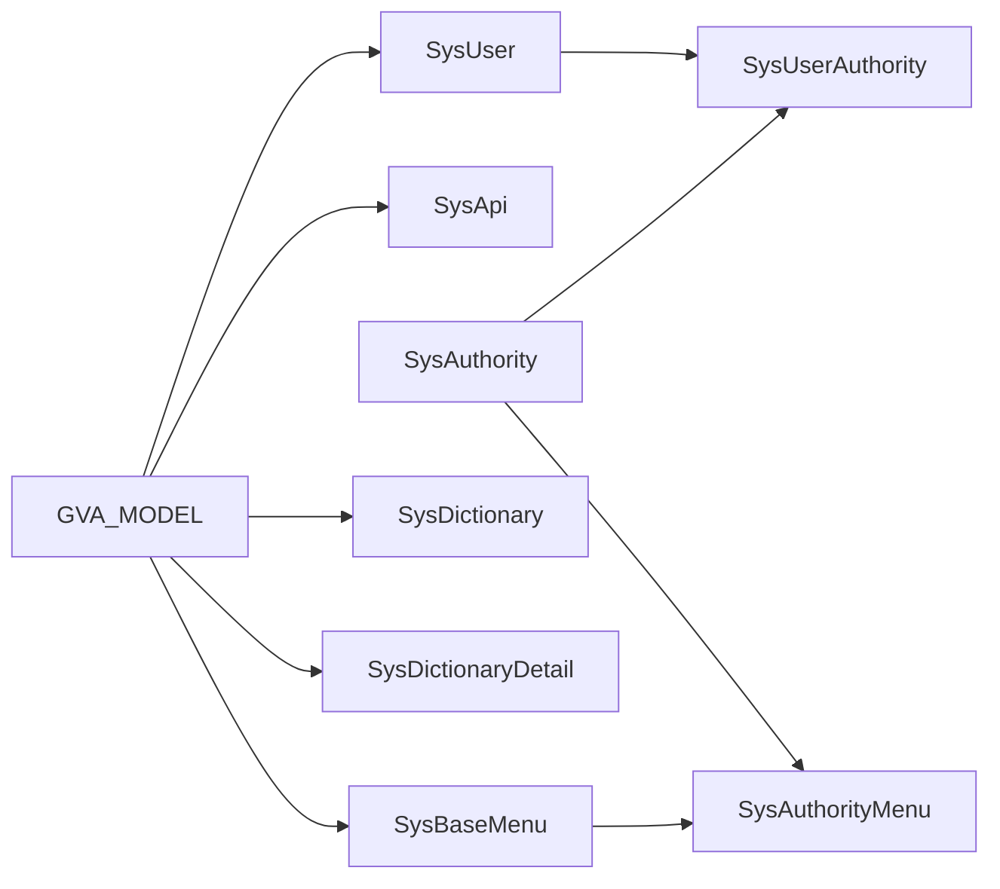

# 数据库设计

<cite>
**本文引用的文件**
- [数据库设计.md](file://repowiki/zh/content/数据库设计/数据库设计.md)
- [核心数据模型.md](file://repowiki/zh/content/数据库设计/核心数据模型/核心数据模型.md)
- [测试相关模型.md](file://repowiki/zh/content/数据库设计/测试相关模型/测试相关模型.md)
- [数据库配置与支持.md](file://repowiki/zh/content/数据库设计/数据库配置与支持.md)
- [model.go](file://server/global/model.go)
- [sys_user.go](file://server/model/system/sys_user.go)
- [sys_authority.go](file://server/model/system/sys_authority.go)
- [sys_base_menu.go](file://server/model/system/sys_base_menu.go)
- [sys_dictionary.go](file://server/model/system/sys_dictionary.go)
- [sys_dictionary_detail.go](file://server/model/system/sys_dictionary_detail.go)
- [exa_customer.go](file://server/model/example/exa_customer.go)
- [exa_file_upload_download.go](file://server/model/example/exa_file_upload_download.go)
- [exa_breakpoint_continue.go](file://server/model/example/exa_breakpoint_continue.go)
- [exa_attachment_category.go](file://server/model/example/exa_attachment_category.go)
- [db_list.go](file://server/config/db_list.go)
- [gorm_mysql.go](file://server/config/gorm_mysql.go)
- [initialize/db_list.go](file://server/initialize/db_list.go)
- [gorm.go](file://server/initialize/gorm.go)
- [ensure_tables.go](file://server/initialize/ensure_tables.go)
- [breakpoint_continue.go](file://server/utils/breakpoint_continue.go)
- [upload.go](file://server/utils/upload/upload.go)
</cite>

## 目录
1. [简介](#简介)
2. [项目结构](#项目结构)
3. [核心组件](#核心组件)
4. [架构总览](#架构总览)
5. [详细组件分析](#详细组件分析)
6. [依赖分析](#依赖分析)
7. [性能考虑](#性能考虑)
8. [故障排查指南](#故障排查指南)
9. [结论](#结论)
10. [附录](#附录)

## 简介
本文件面向测试管理平台的数据库设计，系统性梳理核心数据模型与业务实体的表结构、索引与外键关系、多数据库支持与配置、迁移与版本管理策略，以及数据访问模式、缓存与性能优化建议。内容以仓库现有代码为依据，聚焦于用户、角色、权限、菜单、API、数据字典等基础能力，并对测试相关实体（如用例、执行记录、缺陷跟踪）给出可落地的建模建议与落地路径。

## 项目结构
围绕数据库层的关键目录与文件如下：
- 全局模型基类：server/global/model.go
- 系统模型：server/model/system/*
- 测试相关模型：server/model/example/*
- 配置与多数据库：server/config/* 与 server/initialize/db_list.go
- API/菜单/字典等系统能力模型：对应 server/model/system 下的各文件
- 工具层：断点续传与文件上传工具

图表来源
- [model.go:9-14](file://server/global/model.go#L9-L14)
- [sys_user.go:20-34](file://server/model/system/sys_user.go#L20-L34)
- [sys_authority.go:7-19](file://server/model/system/sys_authority.go#L7-L19)
- [sys_base_menu.go:7-21](file://server/model/system/sys_base_menu.go#L7-L21)
- [sys_dictionary.go:9-18](file://server/model/system/sys_dictionary.go#L9-L18)
- [sys_dictionary_detail.go:9-22](file://server/model/system/sys_dictionary_detail.go#L9-L22)
- [exa_customer.go:8-15](file://server/model/example/exa_customer.go#L8-L15)
- [exa_file_upload_download.go:7-18](file://server/model/example/exa_file_upload_download.go#L7-L18)
- [exa_breakpoint_continue.go:8-24](file://server/model/example/exa_breakpoint_continue.go#L8-L24)
- [exa_attachment_category.go:7-16](file://server/model/example/exa_attachment_category.go#L7-L16)
- [db_list.go:17-53](file://server/config/db_list.go#L17-L53)
- [gorm_mysql.go:3-9](file://server/config/gorm_mysql.go#L3-L9)
- [initialize/db_list.go:11-36](file://server/initialize/db_list.go#L11-L36)

章节来源
- [model.go:1-15](file://server/global/model.go#L1-L15)
- [sys_user.go:1-63](file://server/model/system/sys_user.go#L1-L63)
- [sys_authority.go:1-24](file://server/model/system/sys_authority.go#L1-L24)
- [sys_base_menu.go:1-44](file://server/model/system/sys_base_menu.go#L1-L44)
- [sys_dictionary.go:1-23](file://server/model/system/sys_dictionary.go#L1-L23)
- [sys_dictionary_detail.go:1-27](file://server/model/system/sys_dictionary_detail.go#L1-L27)
- [exa_customer.go:1-16](file://server/model/example/exa_customer.go#L1-L16)
- [exa_file_upload_download.go:1-19](file://server/model/example/exa_file_upload_download.go#L1-L19)
- [exa_breakpoint_continue.go:1-25](file://server/model/example/exa_breakpoint_continue.go#L1-L25)
- [exa_attachment_category.go:1-17](file://server/model/example/exa_attachment_category.go#L1-L17)
- [db_list.go:1-54](file://server/config/db_list.go#L1-L54)
- [gorm_mysql.go:1-10](file://server/config/gorm_mysql.go#L1-L10)
- [initialize/db_list.go:1-37](file://server/initialize/db_list.go#L1-L37)

## 核心组件
本节聚焦于用户、角色、权限、菜单、API、数据字典等核心实体及其表结构关系。

- 全局模型基类
  - 提供统一主键、创建/更新/删除时间字段，便于所有模型继承复用。
  - 删除字段采用索引，便于软删除场景的查询与维护。

- 用户模型
  - 关键字段：UUID、用户名、密码、昵称、头像、角色ID、手机号、邮箱、启用状态、原始设置等。
  - 索引：用户名、UUID、删除时间。
  - 关系：多对多角色（多角色）、一对一角色（主角色）。

- 角色模型
  - 关键字段：角色ID（唯一主键）、角色名、父角色ID（树形结构）、默认路由等。
  - 索引：角色ID（唯一）。
  - 关系：菜单多对多、用户多对多、子角色自引用。

- 用户-角色关联表
  - 用于支持用户拥有多个角色的多对多映射。

- API 模型
  - 关键字段：路径、描述、分组、请求方法。
  - 关系：与权限控制（Casbin）结合使用。

- 菜单模型
  - 关键字段：父菜单ID、路由path/name、组件路径、排序、元信息（标题、图标、缓存等）。
  - 关系：菜单树形结构、与角色多对多。

- 角色-菜单关联表
  - 将角色与菜单进行授权绑定。

- 数据字典与字典明细
  - 字典：名称、类型、状态、描述、父级ID、子级集合、明细集合。
  - 明细：标签、值、扩展、状态、排序、层级、路径、父子关系。
  - 关系：字典与明细的一对多，明细自引用形成树。

章节来源
- [model.go:9-14](file://server/global/model.go#L9-L14)
- [sys_user.go:20-34](file://server/model/system/sys_user.go#L20-L34)
- [sys_authority.go:7-19](file://server/model/system/sys_authority.go#L7-L19)
- [sys_base_menu.go:7-21](file://server/model/system/sys_base_menu.go#L7-L21)
- [sys_dictionary.go:9-18](file://server/model/system/sys_dictionary.go#L9-L18)
- [sys_dictionary_detail.go:9-22](file://server/model/system/sys_dictionary_detail.go#L9-L22)

## 架构总览
下图展示了数据库层与配置层的交互，以及多数据库类型的支持方式。

图表来源
- [db_list.go:17-53](file://server/config/db_list.go#L17-L53)
- [gorm_mysql.go:3-9](file://server/config/gorm_mysql.go#L3-L9)
- [initialize/db_list.go:11-36](file://server/initialize/db_list.go#L11-L36)
- [gorm.go:14-35](file://server/initialize/gorm.go#L14-L35)

章节来源
- [db_list.go:1-54](file://server/config/db_list.go#L1-L54)
- [gorm_mysql.go:1-10](file://server/config/gorm_mysql.go#L1-L10)
- [initialize/db_list.go:1-37](file://server/initialize/db_list.go#L1-L37)
- [gorm.go:1-88](file://server/initialize/gorm.go#L1-L88)

## 详细组件分析

### 用户-角色-权限模型
该模型支撑 RBAC 权限体系，包含用户、角色、用户-角色关联、菜单-角色关联等。

图表来源
- [sys_user.go:20-34](file://server/model/system/sys_user.go#L20-L34)
- [sys_authority.go:7-19](file://server/model/system/sys_authority.go#L7-L19)
- [sys_base_menu.go:7-21](file://server/model/system/sys_base_menu.go#L7-L21)

章节来源
- [sys_user.go:1-63](file://server/model/system/sys_user.go#L1-L63)
- [sys_authority.go:1-24](file://server/model/system/sys_authority.go#L1-L24)
- [sys_base_menu.go:1-44](file://server/model/system/sys_base_menu.go#L1-L44)

### API 与忽略 API 模型
API 模型用于接口资源定义，配合权限中间件与 Casbin 实现细粒度权限控制。

图表来源
- [sys_api.go:7-13](file://server/model/system/sys_api.go#L7-L13)
- [sys_api.go:19-24](file://server/model/system/sys_api.go#L19-L24)

章节来源
- [sys_api.go:1-29](file://server/model/system/sys_api.go#L1-L29)

### 数据字典与明细模型
数据字典支持树形结构与层级路径，便于系统参数、枚举、分类等管理。

图表来源
- [sys_dictionary.go:9-18](file://server/model/system/sys_dictionary.go#L9-L18)
- [sys_dictionary_detail.go:9-22](file://server/model/system/sys_dictionary_detail.go#L9-L22)

章节来源
- [sys_dictionary.go:1-23](file://server/model/system/sys_dictionary.go#L1-L23)
- [sys_dictionary_detail.go:1-27](file://server/model/system/sys_dictionary_detail.go#L1-L27)

### 测试相关实体建模建议
以下为测试管理平台常见业务实体的建模建议（基于现有系统模型风格），便于与现有权限与字典体系协同：

- 测试用例
  - 字段建议：用例编号、标题、前置条件、步骤、预期结果、优先级、标签、所属模块、状态、创建/更新时间、负责人、关联附件等。
  - 关系：与模块/标签/负责人等存在多对多或一对多；可引入“用例库”作为公共资产池。

- 执行记录
  - 字段建议：用例ID、执行环境、执行人、开始/结束时间、结果（通过/失败/阻塞/跳过）、截图/日志附件、备注等。
  - 关系：与用例、环境、人员等关联。

- 缺陷跟踪
  - 字段建议：缺陷编号、标题、描述、严重程度、状态、优先级、发现版本、修复版本、关联用例/执行记录、创建/更新时间、责任人等。
  - 关系：与用例/执行记录/版本等关联。

- 测试计划/套件
  - 字段建议：计划名称、范围（用例集）、起止时间、负责人、状态、关联环境等。
  - 关系：与用例集合、环境、人员等关联。

- 报告与统计
  - 字段建议：报告名称、周期、覆盖率、通过率、趋势数据、生成时间、附件等。
  - 关系：与计划/套件/用例集合等关联。

上述实体可复用全局模型基类，遵循统一的主键与时间戳规范，并按需建立索引与外键约束。

### 多数据库支持与配置
- 配置结构
  - GeneralDB：通用数据库配置（前缀、端口、高级配置、库名、账号、密码、地址、引擎、日志级别、连接池、复数规则、日志输出等）。
  - SpecializedDB：在通用配置基础上增加类型与别名，并支持禁用。

- DSN 生成
  - MySQL 示例：通过用户名、密码、主机、端口、库名与高级配置拼接 DSN。

- 初始化流程
  - DBList() 读取配置列表，按类型选择对应的数据库驱动并构建 gorm.DB 实例，最终形成多库映射；若存在系统库别名，则设置为全局系统库实例。

图表来源
- [db_list.go:17-53](file://server/config/db_list.go#L17-L53)
- [gorm_mysql.go:3-9](file://server/config/gorm_mysql.go#L3-L9)
- [initialize/db_list.go:11-36](file://server/initialize/db_list.go#L11-L36)

章节来源
- [db_list.go:1-54](file://server/config/db_list.go#L1-L54)
- [gorm_mysql.go:1-10](file://server/config/gorm_mysql.go#L1-L10)
- [initialize/db_list.go:1-37](file://server/initialize/db_list.go#L1-L37)

### 数据迁移与版本管理
- 迁移入口
  - 在初始化阶段，系统会根据配置构建数据库实例并进行迁移准备。对于系统库，会设置为全局实例，便于后续迁移与使用。

- 版本管理建议
  - 使用数据库迁移工具（如 goose、golang-migrate 或框架内置迁移）维护版本号与变更脚本。
  - 将迁移脚本按模块拆分，确保幂等与回滚能力。
  - 在 CI/CD 中自动化执行迁移，保证部署一致性。

- 多库迁移
  - 针对多数据库场景，为每类数据库分别维护迁移脚本与版本号，避免跨库耦合。
  - 在初始化时按别名区分目标库，逐个执行迁移。

章节来源
- [initialize/db_list.go:30-36](file://server/initialize/db_list.go#L30-L36)

### 数据访问模式与缓存策略
- 数据访问模式
  - 统一使用 GORM 模型与全局基类，减少重复字段与逻辑。
  - 通过连接池参数（最大空闲连接、最大打开连接）控制并发与资源占用。
  - 对高频查询建立合适索引，避免全表扫描。

- 缓存策略
  - 对静态配置、字典项、菜单树等热点数据，采用 Redis 缓存，降低数据库压力。
  - 缓存键建议采用命名空间+版本号，配合失效与更新策略。
  - 对权限校验结果可做短期缓存，提升鉴权性能。

- 性能优化建议
  - 查询优化：为常用过滤字段（用户名、UUID、角色ID、菜单路径等）建立索引。
  - 分页与投影：仅查询必要字段，避免 SELECT *。
  - 连接池调优：根据 QPS 与延迟调整 MaxOpenConns 与 MaxIdleConns。
  - 日志与监控：开启慢查询日志与 SQL 性能指标，定期分析瓶颈。

## 依赖分析
- 组件内聚与耦合
  - 用户、角色、菜单、API、字典等均继承自全局模型基类，具备统一的时间戳与主键规范，内聚良好。
  - 多对多关系通过中间表实现，避免交叉引用，降低耦合度。

- 外部依赖
  - GORM ORM：负责模型映射与 SQL 生成。
  - 多数据库驱动：MySQL、MSSQL、PostgreSQL、Oracle 通过配置与初始化函数接入。
  - 日志：支持 GORM 日志级别与 Zap 输出。

图表来源
- [model.go:9-14](file://server/global/model.go#L9-L14)
- [sys_user.go:20-34](file://server/model/system/sys_user.go#L20-L34)
- [sys_authority.go:7-19](file://server/model/system/sys_authority.go#L7-L19)
- [sys_base_menu.go:7-21](file://server/model/system/sys_base_menu.go#L7-L21)
- [sys_dictionary.go:9-18](file://server/model/system/sys_dictionary.go#L9-L18)
- [sys_dictionary_detail.go:9-22](file://server/model/system/sys_dictionary_detail.go#L9-L22)

章节来源
- [sys_user.go:1-63](file://server/model/system/sys_user.go#L1-L63)
- [sys_authority.go:1-24](file://server/model/system/sys_authority.go#L1-L24)
- [sys_base_menu.go:1-44](file://server/model/system/sys_base_menu.go#L1-L44)
- [sys_dictionary.go:1-23](file://server/model/system/sys_dictionary.go#L1-L23)
- [sys_dictionary_detail.go:1-27](file://server/model/system/sys_dictionary_detail.go#L1-L27)

## 性能考虑
- 索引设计
  - 用户：用户名、UUID、删除时间索引，支持登录与软删除。
  - 角色：角色ID 唯一索引，支持快速定位。
  - 菜单：父ID、排序字段索引，支持树形查询与排序。
  - 字典：父ID、层级、路径索引，支持层级检索。
  - API：路径与方法组合索引，支持权限匹配。

- 连接池
  - 合理设置最大空闲与最大打开连接数，避免资源争用与超时。
  - 根据业务峰值与平均延迟动态调整。

- 查询优化
  - 使用分页与投影，避免一次性加载大结果集。
  - 对复杂查询使用 EXPLAIN 分析执行计划，识别瓶颈。

- 日志与监控
  - 开启慢查询日志，定期分析热点 SQL。
  - 结合数据库性能指标与应用埋点，持续优化。

## 故障排查指南
- 连接问题
  - 检查 DSN 配置（主机、端口、库名、账号、密码、高级参数）是否正确。
  - 确认网络连通与防火墙策略。

- 迁移失败
  - 查看迁移脚本版本与当前数据库版本是否一致。
  - 检查权限与字符集设置，确保迁移账户具备 DDL 权限。

- 性能异常
  - 使用慢查询日志定位热点 SQL。
  - 检查索引缺失与连接池饱和情况。

- 多库不生效
  - 确认配置中数据库类型与别名正确，且未被禁用。
  - 检查初始化流程是否成功构建 gorm.DB 并写入全局映射。

章节来源
- [db_list.go:17-53](file://server/config/db_list.go#L17-L53)
- [gorm_mysql.go:3-9](file://server/config/gorm_mysql.go#L3-L9)
- [initialize/db_list.go:11-36](file://server/initialize/db_list.go#L11-L36)

## 结论
本设计以 GORM 为基础，通过全局模型基类统一字段规范，围绕用户、角色、权限、菜单、API、数据字典等核心实体构建了清晰的 ER 关系。多数据库支持通过配置与初始化流程实现，具备良好的扩展性。针对测试管理平台，建议在现有模型风格上扩展测试用例、执行记录、缺陷跟踪等实体，并配套索引、缓存与迁移策略，确保系统在高并发与复杂业务下的稳定性与可维护性。

## 附录
- 建议的测试相关实体索引
  - 用例：编号、模块、状态、创建时间；标签多值索引或 JSON 索引（视数据库而定）。
  - 执行：用例ID、环境、执行人、开始时间；结果聚合索引。
  - 缺陷：编号、状态、严重程度、创建时间；关联用例/执行记录索引。
  - 计划/套件：名称、起止时间、负责人；与用例集合的关联索引。
- 建议的缓存键命名
  - 用户信息：user:{id}
  - 菜单树：menu_tree:{authority_id}
  - 字典树：dict_tree:{type}
  - 权限矩阵：perm:{authority_id}:{resource}
- 初始化与表存在性校验
  - 通过初始化模块将核心模型纳入 AutoMigrate，确保表结构与约束按模型定义生成。
  - ensure_tables.go 在启动阶段检查表是否存在，避免重复创建导致的冲突。