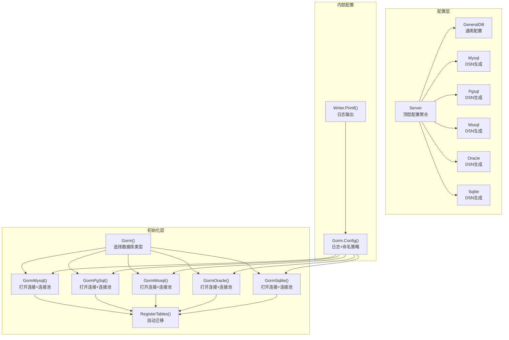
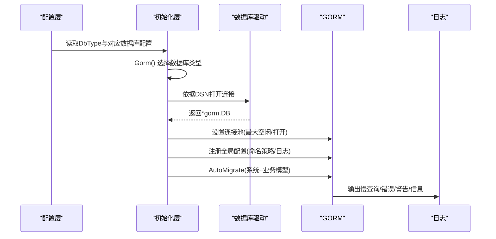
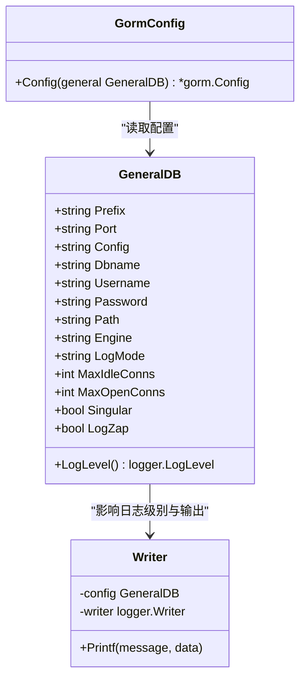
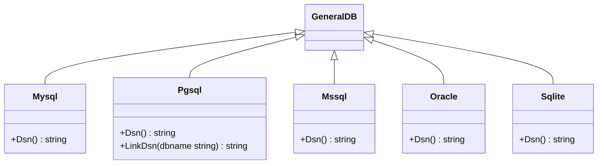
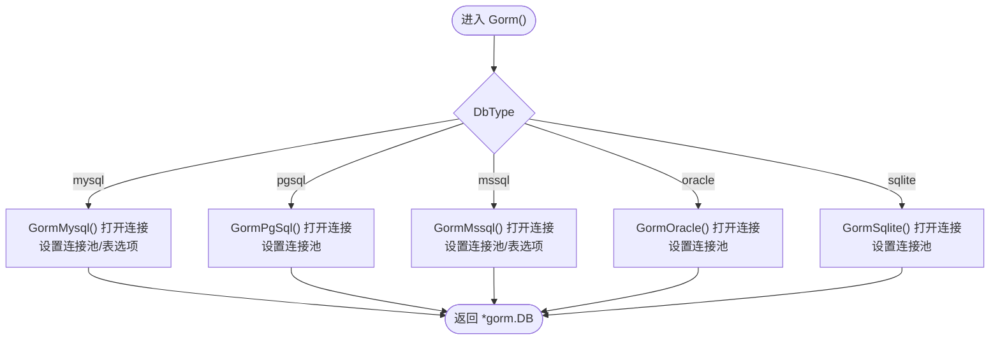
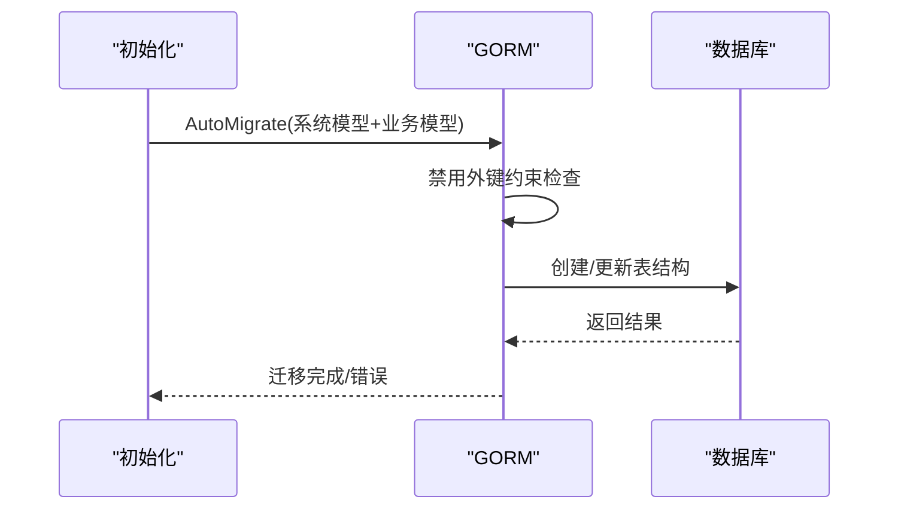
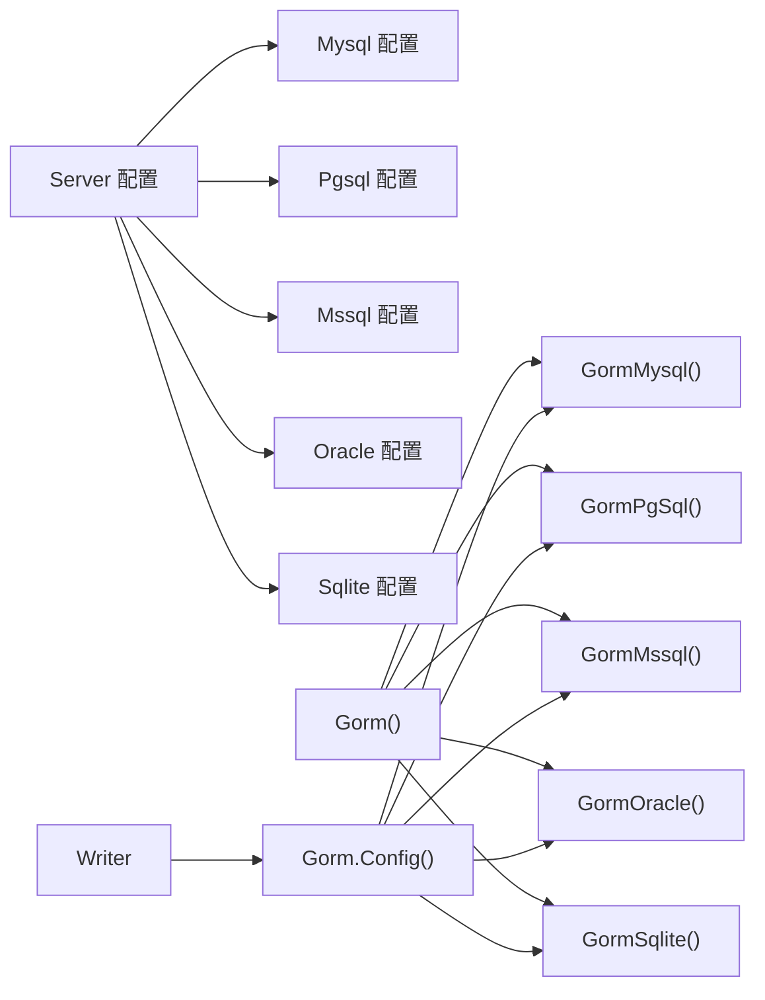

# 数据库配置与支持

<cite>
**本文引用的文件**
- [server/config/db_list.go](file://server/config/db_list.go)
- [server/config/gorm_mysql.go](file://server/config/gorm_mysql.go)
- [server/config/gorm_pgsql.go](file://server/config/gorm_pgsql.go)
- [server/config/gorm_mssql.go](file://server/config/gorm_mssql.go)
- [server/config/gorm_oracle.go](file://server/config/gorm_oracle.go)
- [server/config/gorm_sqlite.go](file://server/config/gorm_sqlite.go)
- [server/config/config.go](file://server/config/config.go)
- [server/initialize/gorm.go](file://server/initialize/gorm.go)
- [server/initialize/gorm_mysql.go](file://server/initialize/gorm_mysql.go)
- [server/initialize/gorm_pgsql.go](file://server/initialize/gorm_pgsql.go)
- [server/initialize/gorm_mssql.go](file://server/initialize/gorm_mssql.go)
- [server/initialize/gorm_oracle.go](file://server/initialize/gorm_oracle.go)
- [server/initialize/gorm_sqlite.go](file://server/initialize/gorm_sqlite.go)
- [server/initialize/internal/gorm.go](file://server/initialize/internal/gorm.go)
- [server/initialize/internal/gorm_logger_writer.go](file://server/initialize/internal/gorm_logger_writer.go)
</cite>

## 目录
1. [简介](#简介)
2. [项目结构](#项目结构)
3. [核心组件](#核心组件)
4. [架构总览](#架构总览)
5. [详细组件分析](#详细组件分析)
6. [依赖分析](#依赖分析)
7. [性能考量](#性能考量)
8. [故障排查指南](#故障排查指南)
9. [结论](#结论)
10. [附录](#附录)

## 简介
本文件面向 Gin-Vue-Admin 的数据库配置与支持体系，系统性阐述多数据库（MySQL、PostgreSQL、SQL Server、Oracle、SQLite）的配置方式与差异；解析 GORM 配置系统（连接池、日志、命名策略、外键约束迁移策略等）；说明数据库初始化流程（表结构创建、索引与约束建立）；给出迁移机制与版本管理建议；并提供连接优化、事务与并发控制、监控与维护策略等高级主题。

## 项目结构
围绕数据库配置与初始化的关键目录与文件如下：
- 配置层：集中于 server/config，定义通用配置结构与各数据库 DSN 生成器
- 初始化层：集中于 server/initialize，按数据库类型打开连接、设置连接池，并执行自动迁移
- 内部配置：server/initialize/internal 提供 GORM 全局配置与日志写入器

图表来源
- [server/config/db_list.go:17-53](file://server/config/db_list.go#L17-L53)
- [server/config/gorm_mysql.go:3-9](file://server/config/gorm_mysql.go#L3-L9)
- [server/config/gorm_pgsql.go:3-17](file://server/config/gorm_pgsql.go#L3-L17)
- [server/config/gorm_mssql.go:3-10](file://server/config/gorm_mssql.go#L3-L10)
- [server/config/gorm_oracle.go:9-18](file://server/config/gorm_oracle.go#L9-L18)
- [server/config/gorm_sqlite.go:7-13](file://server/config/gorm_sqlite.go#L7-L13)
- [server/config/config.go:14-20](file://server/config/config.go#L14-L20)
- [server/initialize/gorm.go:14-35](file://server/initialize/gorm.go#L14-L35)
- [server/initialize/gorm_mysql.go:16-47](file://server/initialize/gorm_mysql.go#L16-L47)
- [server/initialize/gorm_pgsql.go:24-42](file://server/initialize/gorm_pgsql.go#L24-L42)
- [server/initialize/gorm_mssql.go:22-41](file://server/initialize/gorm_mssql.go#L22-L41)
- [server/initialize/gorm_oracle.go:22-36](file://server/initialize/gorm_oracle.go#L22-L36)
- [server/initialize/gorm_sqlite.go:22-37](file://server/initialize/gorm_sqlite.go#L22-L37)
- [server/initialize/internal/gorm.go:18-30](file://server/initialize/internal/gorm.go#L18-L30)
- [server/initialize/internal/gorm_logger_writer.go:20-41](file://server/initialize/internal/gorm_logger_writer.go#L20-L41)

章节来源
- [server/config/db_list.go:17-53](file://server/config/db_list.go#L17-L53)
- [server/config/config.go:14-20](file://server/config/config.go#L14-L20)
- [server/initialize/gorm.go:14-35](file://server/initialize/gorm.go#L14-L35)

## 核心组件
- 通用配置结构 GeneralDB：统一承载数据库通用字段（主机、端口、用户名、密码、数据库名、高级配置、引擎、日志级别、连接池参数、是否禁用复数等），并提供日志级别转换逻辑
- 专用配置结构 SpecializedDB：支持多实例别名与禁用开关，便于在同构或异构场景下灵活配置
- 各数据库 DSN 生成器：为 MySQL、PostgreSQL、SQL Server、Oracle、SQLite 分别实现 DSN 拼装
- 初始化入口 Gorm()：根据系统配置选择具体数据库驱动并返回 gorm 实例
- 连接池设置：在各数据库初始化函数中设置最大空闲连接数与最大打开连接数
- 自动迁移 RegisterTables()：在启用时对系统与业务模型进行迁移

章节来源
- [server/config/db_list.go:17-53](file://server/config/db_list.go#L17-L53)
- [server/config/gorm_mysql.go:3-9](file://server/config/gorm_mysql.go#L3-L9)
- [server/config/gorm_pgsql.go:3-17](file://server/config/gorm_pgsql.go#L3-L17)
- [server/config/gorm_mssql.go:3-10](file://server/config/gorm_mssql.go#L3-L10)
- [server/config/gorm_oracle.go:9-18](file://server/config/gorm_oracle.go#L9-L18)
- [server/config/gorm_sqlite.go:7-13](file://server/config/gorm_sqlite.go#L7-L13)
- [server/initialize/gorm.go:14-35](file://server/initialize/gorm.go#L14-L35)
- [server/initialize/gorm_mysql.go:42-46](file://server/initialize/gorm_mysql.go#L42-L46)
- [server/initialize/gorm_pgsql.go:38-40](file://server/initialize/gorm_pgsql.go#L38-L40)
- [server/initialize/gorm_mssql.go:37-39](file://server/initialize/gorm_mssql.go#L37-L39)
- [server/initialize/gorm_oracle.go:31-34](file://server/initialize/gorm_oracle.go#L31-L34)
- [server/initialize/gorm_sqlite.go:32-35](file://server/initialize/gorm_sqlite.go#L32-L35)
- [server/initialize/gorm.go:37-87](file://server/initialize/gorm.go#L37-L87)

## 架构总览
下图展示从配置到初始化再到迁移的整体流程，以及各数据库驱动的差异化点：

图表来源
- [server/initialize/gorm.go:14-35](file://server/initialize/gorm.go#L14-L35)
- [server/initialize/gorm_mysql.go:32-46](file://server/initialize/gorm_mysql.go#L32-L46)
- [server/initialize/gorm_pgsql.go:29-40](file://server/initialize/gorm_pgsql.go#L29-L40)
- [server/initialize/gorm_mssql.go:27-39](file://server/initialize/gorm_mssql.go#L27-L39)
- [server/initialize/gorm_oracle.go:28-34](file://server/initialize/gorm_oracle.go#L28-L34)
- [server/initialize/gorm_sqlite.go:28-35](file://server/initialize/gorm_sqlite.go#L28-L35)
- [server/initialize/internal/gorm.go:18-30](file://server/initialize/internal/gorm.go#L18-L30)
- [server/initialize/internal/gorm_logger_writer.go:20-41](file://server/initialize/internal/gorm_logger_writer.go#L20-L41)

## 详细组件分析

### 通用配置与日志系统
- 通用配置 GeneralDB：包含数据库连接所需的基础字段与连接池参数；提供日志级别枚举映射，支持静默/错误/警告/信息
- 日志系统：通过内部 Writer 将 GORM 日志输出到控制台，并可选地写入 Zap 日志；日志级别与输出行为由 GeneralDB 控制

图表来源
- [server/config/db_list.go:17-46](file://server/config/db_list.go#L17-L46)
- [server/initialize/internal/gorm_logger_writer.go:10-41](file://server/initialize/internal/gorm_logger_writer.go#L10-L41)
- [server/initialize/internal/gorm.go:18-30](file://server/initialize/internal/gorm.go#L18-L30)

章节来源
- [server/config/db_list.go:17-46](file://server/config/db_list.go#L17-L46)
- [server/initialize/internal/gorm.go:18-30](file://server/initialize/internal/gorm.go#L18-L30)
- [server/initialize/internal/gorm_logger_writer.go:20-41](file://server/initialize/internal/gorm_logger_writer.go#L20-L41)

### 多数据库 DSN 生成器
- MySQL：基于用户名、密码、主机、端口、数据库名与高级配置拼接 DSN
- PostgreSQL：以键值对形式拼接 host、user、password、dbname、port 与高级配置
- SQL Server：采用 sqlserver:// 协议，附加 encrypt=disable 参数
- Oracle：使用 oracle:// 协议，对用户名、密码、数据库名进行 URL 转义
- SQLite：基于路径与数据库名拼接本地文件路径

图表来源
- [server/config/gorm_mysql.go:3-9](file://server/config/gorm_mysql.go#L3-L9)
- [server/config/gorm_pgsql.go:3-17](file://server/config/gorm_pgsql.go#L3-L17)
- [server/config/gorm_mssql.go:3-10](file://server/config/gorm_mssql.go#L3-L10)
- [server/config/gorm_oracle.go:9-18](file://server/config/gorm_oracle.go#L9-L18)
- [server/config/gorm_sqlite.go:7-13](file://server/config/gorm_sqlite.go#L7-L13)

章节来源
- [server/config/gorm_mysql.go:7-9](file://server/config/gorm_mysql.go#L7-L9)
- [server/config/gorm_pgsql.go:9-17](file://server/config/gorm_pgsql.go#L9-L17)
- [server/config/gorm_mssql.go:7-10](file://server/config/gorm_mssql.go#L7-L10)
- [server/config/gorm_oracle.go:13-18](file://server/config/gorm_oracle.go#L13-L18)
- [server/config/gorm_sqlite.go:11-13](file://server/config/gorm_sqlite.go#L11-L13)

### 初始化流程与连接池
- 初始化入口：Gorm() 根据 DbType 选择具体数据库初始化函数
- 连接池：各数据库初始化函数在打开连接后设置最大空闲连接数与最大打开连接数
- 引擎设置：MySQL/SQL Server 在初始化时设置表选项（如 ENGINE=InnoDB）

图表来源
- [server/initialize/gorm.go:14-35](file://server/initialize/gorm.go#L14-L35)
- [server/initialize/gorm_mysql.go:32-46](file://server/initialize/gorm_mysql.go#L32-L46)
- [server/initialize/gorm_pgsql.go:38-40](file://server/initialize/gorm_pgsql.go#L38-L40)
- [server/initialize/gorm_mssql.go:36-40](file://server/initialize/gorm_mssql.go#L36-L40)
- [server/initialize/gorm_oracle.go:31-34](file://server/initialize/gorm_oracle.go#L31-L34)
- [server/initialize/gorm_sqlite.go:32-35](file://server/initialize/gorm_sqlite.go#L32-L35)

章节来源
- [server/initialize/gorm.go:14-35](file://server/initialize/gorm.go#L14-L35)
- [server/initialize/gorm_mysql.go:32-46](file://server/initialize/gorm_mysql.go#L32-L46)
- [server/initialize/gorm_pgsql.go:38-40](file://server/initialize/gorm_pgsql.go#L38-L40)
- [server/initialize/gorm_mssql.go:36-40](file://server/initialize/gorm_mssql.go#L36-L40)
- [server/initialize/gorm_oracle.go:31-34](file://server/initialize/gorm_oracle.go#L31-L34)
- [server/initialize/gorm_sqlite.go:32-35](file://server/initialize/gorm_sqlite.go#L32-L35)

### 自动迁移与表结构
- RegisterTables()：在启用自动迁移时，对系统与业务模型执行 AutoMigrate
- 外键约束策略：迁移阶段禁用外键约束检查，避免跨数据库差异导致的迁移失败
- 命名策略：支持表前缀与单数表名配置，统一命名风格

图表来源
- [server/initialize/gorm.go:37-87](file://server/initialize/gorm.go#L37-L87)
- [server/initialize/internal/gorm.go](file://server/initialize/internal/gorm.go#L29)

章节来源
- [server/initialize/gorm.go:37-87](file://server/initialize/gorm.go#L37-L87)
- [server/initialize/internal/gorm.go](file://server/initialize/internal/gorm.go#L29)

## 依赖分析
- 配置聚合：Server 结构体聚合了所有数据库配置与通用配置项
- 初始化耦合：Gorm() 作为分发器，耦合 DbType 与各数据库初始化函数
- 日志依赖：内部 GORM 配置依赖 Writer，Writer 可选地写入 Zap 日志
- 连接池：各数据库初始化函数直接操作底层 *sql.DB 并设置连接池参数

图表来源
- [server/config/config.go:14-20](file://server/config/config.go#L14-L20)
- [server/initialize/gorm.go:14-35](file://server/initialize/gorm.go#L14-L35)
- [server/initialize/internal/gorm.go:18-30](file://server/initialize/internal/gorm.go#L18-L30)
- [server/initialize/internal/gorm_logger_writer.go:15-17](file://server/initialize/internal/gorm_logger_writer.go#L15-L17)

章节来源
- [server/config/config.go:14-20](file://server/config/config.go#L14-L20)
- [server/initialize/gorm.go:14-35](file://server/initialize/gorm.go#L14-L35)
- [server/initialize/internal/gorm.go:18-30](file://server/initialize/internal/gorm.go#L18-L30)
- [server/initialize/internal/gorm_logger_writer.go:15-17](file://server/initialize/internal/gorm_logger_writer.go#L15-L17)

## 性能考量
- 连接池参数
  - 最大空闲连接数：控制空闲连接上限，降低资源占用
  - 最大打开连接数：限制并发连接数，避免数据库过载
  - 建议：结合数据库最大连接数与应用并发峰值调整
- 日志阈值
  - 慢查询阈值：默认 200ms，可根据数据库性能与业务延迟容忍度调整
  - 日志级别：生产环境建议“错误/警告”，避免过多日志影响性能
- 命名策略
  - 表前缀与单数表名：统一命名，减少迁移与维护成本
- 外键约束
  - 迁移阶段禁用外键约束，减少跨数据库差异带来的阻塞与失败风险

章节来源
- [server/initialize/gorm_mysql.go:42-46](file://server/initialize/gorm_mysql.go#L42-L46)
- [server/initialize/gorm_pgsql.go:38-40](file://server/initialize/gorm_pgsql.go#L38-L40)
- [server/initialize/gorm_mssql.go:36-40](file://server/initialize/gorm_mssql.go#L36-L40)
- [server/initialize/gorm_oracle.go:31-34](file://server/initialize/gorm_oracle.go#L31-L34)
- [server/initialize/gorm_sqlite.go:32-35](file://server/initialize/gorm_sqlite.go#L32-L35)
- [server/initialize/internal/gorm.go:20-24](file://server/initialize/internal/gorm.go#L20-L24)
- [server/initialize/internal/gorm.go](file://server/initialize/internal/gorm.go#L29)

## 故障排查指南
- 连接失败
  - 检查 DbType 与对应配置是否正确
  - 校验 DSN 拼装是否符合目标数据库格式
  - 确认网络连通性与凭据正确性
- 迁移失败
  - 关注外键约束相关报错，确认迁移阶段已禁用外键检查
  - 查看日志输出，定位慢查询或错误语句
- 日志问题
  - 若开启 LogZap，确认日志级别与 Writer 输出逻辑一致
  - 生产环境建议降低日志级别，避免频繁 I/O

章节来源
- [server/initialize/gorm.go:37-87](file://server/initialize/gorm.go#L37-L87)
- [server/initialize/internal/gorm_logger_writer.go:20-41](file://server/initialize/internal/gorm_logger_writer.go#L20-L41)
- [server/initialize/internal/gorm.go](file://server/initialize/internal/gorm.go#L29)

## 结论
该系统通过统一的通用配置结构与专用 DSN 生成器，实现了对 MySQL、PostgreSQL、SQL Server、Oracle、SQLite 的一致化接入；借助 GORM 的全局配置与连接池设置，兼顾了性能与可维护性；自动迁移与命名策略降低了数据库演进成本。建议在生产环境中合理设置连接池与日志级别，并结合监控与备份策略保障稳定性。

## 附录

### 各数据库配置要点与差异
- MySQL
  - 引擎设置：初始化时设置表选项（如 ENGINE=InnoDB）
  - 字符串默认长度：DefaultStringSize 用于兼容字符集与索引长度限制
- PostgreSQL
  - 使用预定义简单协议开关，按需调整
  - DSN 采用键值对形式
- SQL Server
  - DSN 包含 encrypt=disable 参数
  - 初始化时设置表选项与连接池
- Oracle
  - 使用第三方驱动，DSN 采用 oracle:// 协议并进行 URL 转义
- SQLite
  - 本地文件路径作为 DSN
  - 使用轻量级驱动，适合开发与小规模场景

章节来源
- [server/initialize/gorm_mysql.go:42-46](file://server/initialize/gorm_mysql.go#L42-L46)
- [server/initialize/gorm_pgsql.go](file://server/initialize/gorm_pgsql.go#L31)
- [server/initialize/gorm_mssql.go:36-39](file://server/initialize/gorm_mssql.go#L36-L39)
- [server/initialize/gorm_oracle.go:28-34](file://server/initialize/gorm_oracle.go#L28-L34)
- [server/initialize/gorm_sqlite.go:32-35](file://server/initialize/gorm_sqlite.go#L32-L35)
- [server/config/gorm_mysql.go:7-9](file://server/config/gorm_mysql.go#L7-L9)
- [server/config/gorm_pgsql.go:9-17](file://server/config/gorm_pgsql.go#L9-L17)
- [server/config/gorm_mssql.go:7-10](file://server/config/gorm_mssql.go#L7-L10)
- [server/config/gorm_oracle.go:13-18](file://server/config/gorm_oracle.go#L13-L18)
- [server/config/gorm_sqlite.go:11-13](file://server/config/gorm_sqlite.go#L11-L13)

### GORM 配置清单
- 日志
  - 慢查询阈值：200ms
  - 日志级别：由配置映射
  - 输出：控制台 + 可选 Zap
- 命名策略
  - 表前缀：Prefix
  - 单数表名：Singular
- 外键约束
  - 迁移阶段禁用外键约束检查

章节来源
- [server/initialize/internal/gorm.go:18-30](file://server/initialize/internal/gorm.go#L18-L30)
- [server/initialize/internal/gorm_logger_writer.go:20-41](file://server/initialize/internal/gorm_logger_writer.go#L20-L41)

### 迁移机制与版本管理建议
- 版本管理
  - 建议引入数据库迁移工具（如 goose、flyway 或 gormigrate）进行版本化管理
  - 将迁移脚本纳入版本控制，确保团队协作一致性
- 数据同步
  - 对生产环境先做备份，再执行迁移
  - 使用只读副本验证迁移结果后再切换流量
- 回滚策略
  - 保留可逆迁移脚本，确保失败时能快速回滚
  - 对关键变更采用灰度发布与快速回滚预案

[本节为通用实践建议，不直接分析具体源码文件]

### 数据库连接优化、事务与并发控制
- 连接优化
  - 合理设置最大空闲/打开连接数，避免连接泄漏与资源争用
  - 使用连接池复用连接，减少握手开销
- 事务
  - 在高并发场景下尽量缩短事务时间，减少锁持有时间
  - 对批量写入使用事务批处理，提升吞吐
- 并发控制
  - 使用数据库层面的锁（排它锁/共享锁）与应用层面的队列/信号量协同
  - 对热点数据采用缓存与最终一致性策略

[本节为通用实践建议，不直接分析具体源码文件]

### 监控与维护策略
- 性能指标
  - 连接池指标：活跃连接数、等待时间、超时次数
  - 查询指标：慢查询数量、平均响应时间、错误率
- 备份与恢复
  - 制定定期全量/增量备份计划，验证恢复流程
- 故障处理
  - 建立告警机制（连接失败、慢查询、错误率上升）
  - 准备应急预案（降级、熔断、快速回滚）

[本节为通用实践建议，不直接分析具体源码文件]