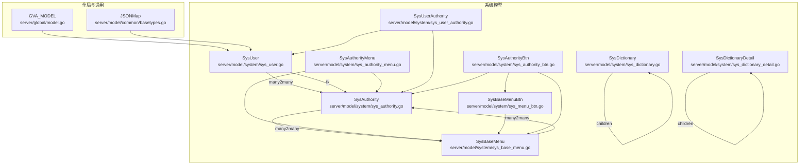
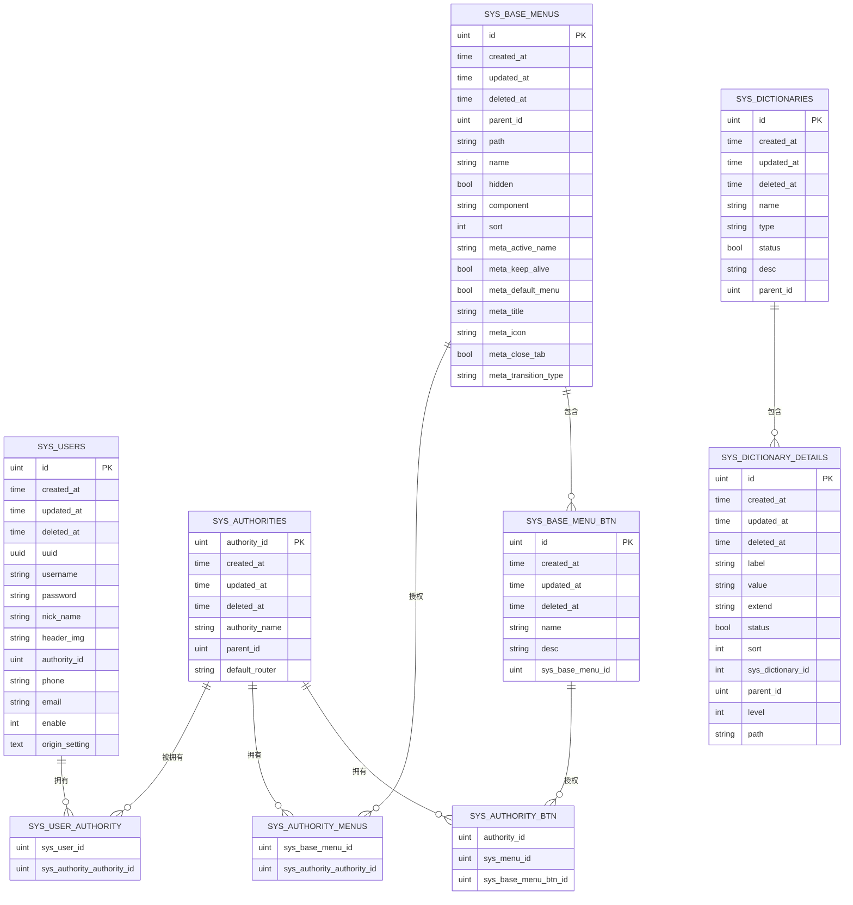
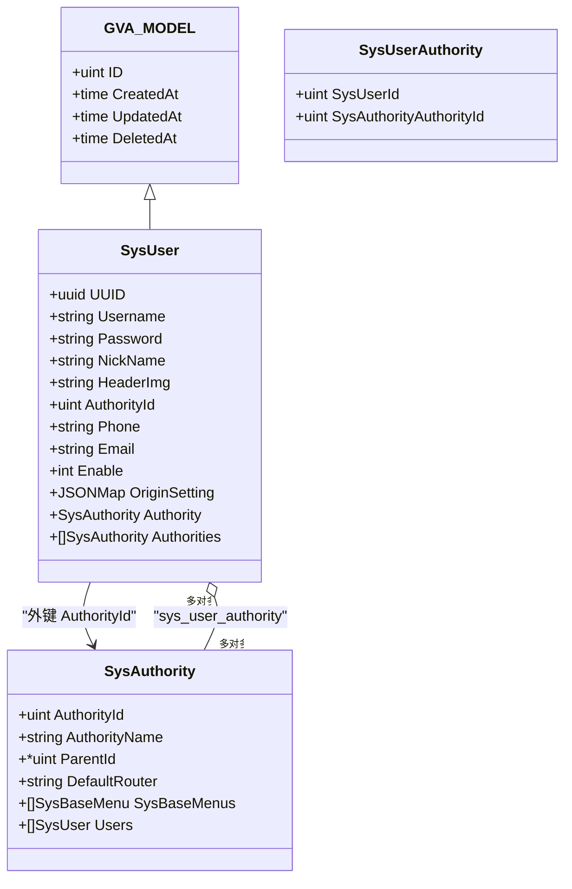
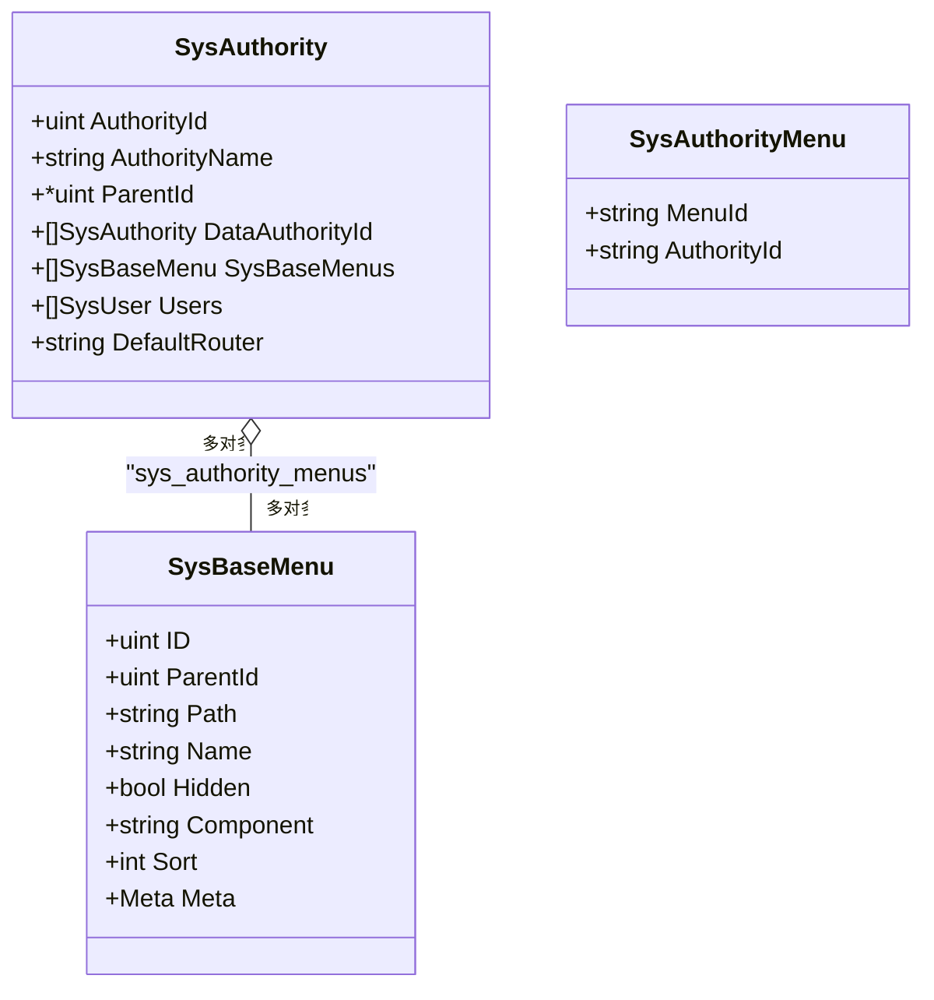
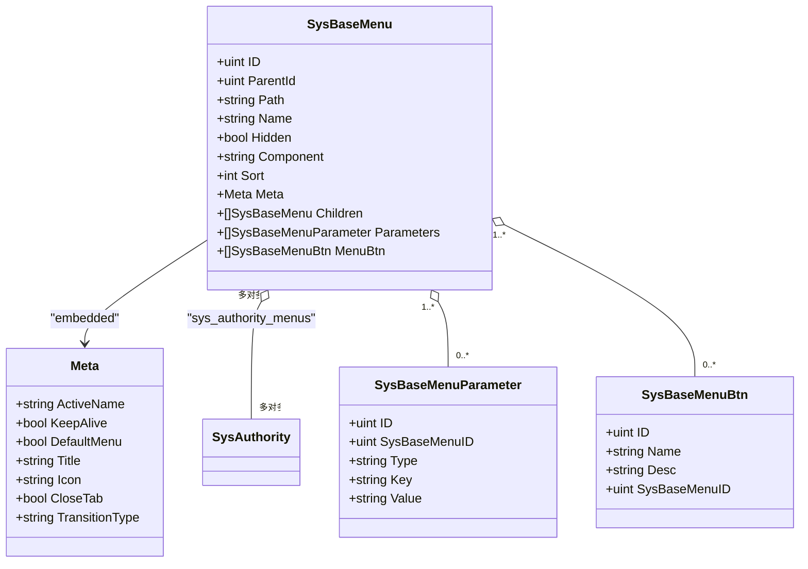
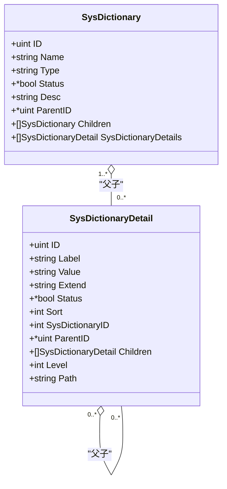
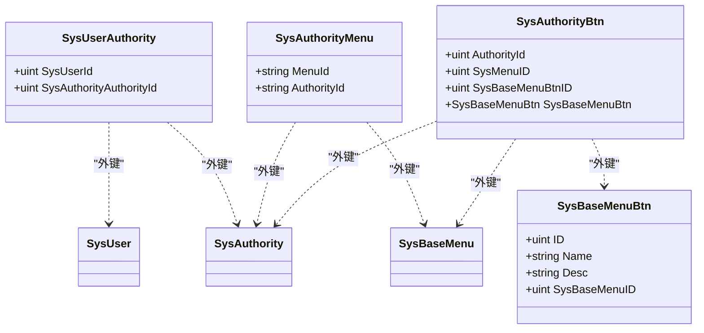
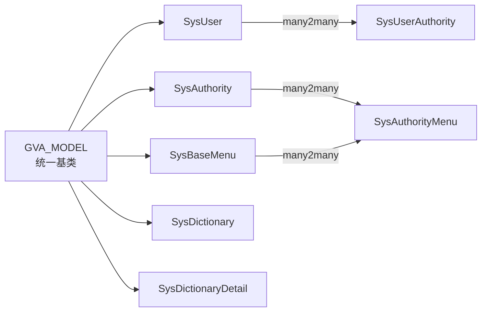

# 核心数据模型

<cite>
**本文引用的文件**
- [server/model/system/sys_user.go](file://server/model/system/sys_user.go)
- [server/model/system/sys_authority.go](file://server/model/system/sys_authority.go)
- [server/model/system/sys_base_menu.go](file://server/model/system/sys_base_menu.go)
- [server/model/system/sys_dictionary.go](file://server/model/system/sys_dictionary.go)
- [server/model/system/sys_dictionary_detail.go](file://server/model/system/sys_dictionary_detail.go)
- [server/model/system/sys_authority_menu.go](file://server/model/system/sys_authority_menu.go)
- [server/model/system/sys_user_authority.go](file://server/model/system/sys_user_authority.go)
- [server/model/system/sys_menu_btn.go](file://server/model/system/sys_menu_btn.go)
- [server/model/system/sys_authority_btn.go](file://server/model/system/sys_authority_btn.go)
- [server/global/model.go](file://server/global/model.go)
- [server/model/common/basetypes.go](file://server/model/common/basetypes.go)
- [server/initialize/gorm.go](file://server/initialize/gorm.go)
- [server/model/system/request/sys_user.go](file://server/model/system/request/sys_user.go)
- [server/model/system/response/sys_user.go](file://server/model/system/response/sys_user.go)
- [server/model/system/response/sys_authority.go](file://server/model/system/response/sys_authority.go)
</cite>

## 目录
1. [简介](#简介)
2. [项目结构](#项目结构)
3. [核心组件](#核心组件)
4. [架构总览](#架构总览)
5. [详细组件分析](#详细组件分析)
6. [依赖分析](#依赖分析)
7. [性能考量](#性能考量)
8. [故障排查指南](#故障排查指南)
9. [结论](#结论)
10. [附录](#附录)

## 简介
本文件聚焦于 Gin-Vue-Admin 后端系统的核心数据模型，系统性梳理用户管理、角色权限、菜单系统与字典管理四大模型的设计与实现，涵盖实体字段定义、关系映射、约束设计、GORM 标签与数据库映射规则，并提供 ER 图与流程图帮助理解。文档同时给出最佳实践建议与常见问题排查方法。

## 项目结构
核心模型位于 server/model/system 及其子目录，公共基类与通用类型位于 server/global 与 server/model/common。数据库初始化在 server/initialize/gorm.go 中集中注册并自动迁移。

图表来源
- [server/global/model.go:9-14](file://server/global/model.go#L9-L14)
- [server/model/common/basetypes.go:9-36](file://server/model/common/basetypes.go#L9-L36)
- [server/model/system/sys_user.go:20-34](file://server/model/system/sys_user.go#L20-L34)
- [server/model/system/sys_authority.go:7-19](file://server/model/system/sys_authority.go#L7-L19)
- [server/model/system/sys_base_menu.go:7-21](file://server/model/system/sys_base_menu.go#L7-L21)
- [server/model/system/sys_dictionary.go:9-18](file://server/model/system/sys_dictionary.go#L9-L18)
- [server/model/system/sys_dictionary_detail.go:9-22](file://server/model/system/sys_dictionary_detail.go#L9-L22)
- [server/model/system/sys_authority_menu.go:3-19](file://server/model/system/sys_authority_menu.go#L3-L19)
- [server/model/system/sys_user_authority.go:4-11](file://server/model/system/sys_user_authority.go#L4-L11)
- [server/model/system/sys_menu_btn.go:5-10](file://server/model/system/sys_menu_btn.go#L5-L10)
- [server/model/system/sys_authority_btn.go:3-8](file://server/model/system/sys_authority_btn.go#L3-L8)

章节来源
- [server/initialize/gorm.go:37-87](file://server/initialize/gorm.go#L37-L87)

## 核心组件
本节概述四大核心模型：用户管理、角色权限、菜单系统、字典管理。每个模型均基于统一的 GVA_MODEL 基类，具备标准的主键、创建/更新/删除时间戳与软删除索引；部分模型使用 JSONMap 类型存储可扩展配置或元信息。

- 用户管理模型（SysUser）
  - 关系：一对一（AuthorityId → SysAuthority.AuthorityId），多对多（SysUser ↔ SysAuthority 通过连接表）
  - 关键字段：UUID、用户名、密码、昵称、头像、手机号、邮箱、启用状态、originSetting(JSONMap)
  - 约束：AuthorityId 默认值、Enable 默认值、originSetting 列名为 origin_setting，类型为 text
  - GORM 标签：index、default、comment、foreignKey、references、many2many、column

- 角色权限模型（SysAuthority）
  - 关系：自引用父子角色（ParentId → AuthorityId），多对多（SysAuthority ↔ SysBaseMenu 通过连接表）
  - 关键字段：AuthorityId（主键+唯一）、AuthorityName、ParentId、DefaultRouter
  - 约束：AuthorityId 唯一且为主键，DefaultRouter 默认 dashboard
  - GORM 标签：unique、primary_key、comment、many2many、embedded

- 菜单系统模型（SysBaseMenu）
  - 关系：自引用父子菜单（ParentId → ID），多对多（SysBaseMenu ↔ SysAuthority 通过连接表）
  - 关键字段：Path、Name、Hidden、Component、Sort、Meta（嵌入结构体）
  - 约束：Meta 嵌入存储附加属性
  - GORM 标签：comment、embedded、many2many、foreignKey、references

- 字典管理模型（SysDictionary、SysDictionaryDetail）
  - 关系：字典与字典详情一对多，二者均可自引用形成树形结构（父子 ID）
  - 关键字段：字典名（中/英）、状态、描述、父级 ID；字典详情含展示值、字典值、扩展值、排序、层级与路径
  - 约束：字典详情包含层级深度 level 与层级路径 path，用于树形检索
  - GORM 标签：column、comment、embedded、foreignKey、many2many

章节来源
- [server/model/system/sys_user.go:20-34](file://server/model/system/sys_user.go#L20-L34)
- [server/model/system/sys_authority.go:7-19](file://server/model/system/sys_authority.go#L7-L19)
- [server/model/system/sys_base_menu.go:7-21](file://server/model/system/sys_base_menu.go#L7-L21)
- [server/model/system/sys_dictionary.go:9-18](file://server/model/system/sys_dictionary.go#L9-L18)
- [server/model/system/sys_dictionary_detail.go:9-22](file://server/model/system/sys_dictionary_detail.go#L9-L22)
- [server/global/model.go:9-14](file://server/global/model.go#L9-L14)
- [server/model/common/basetypes.go:9-36](file://server/model/common/basetypes.go#L9-L36)

## 架构总览
下图展示核心模型之间的实体关系与多对多连接表：

图表来源
- [server/model/system/sys_user.go:20-34](file://server/model/system/sys_user.go#L20-L34)
- [server/model/system/sys_authority.go:7-19](file://server/model/system/sys_authority.go#L7-L19)
- [server/model/system/sys_base_menu.go:7-21](file://server/model/system/sys_base_menu.go#L7-L21)
- [server/model/system/sys_dictionary.go:9-18](file://server/model/system/sys_dictionary.go#L9-L18)
- [server/model/system/sys_dictionary_detail.go:9-22](file://server/model/system/sys_dictionary_detail.go#L9-L22)
- [server/model/system/sys_user_authority.go:4-11](file://server/model/system/sys_user_authority.go#L4-L11)
- [server/model/system/sys_authority_menu.go:12-19](file://server/model/system/sys_authority_menu.go#L12-L19)
- [server/model/system/sys_menu_btn.go:5-10](file://server/model/system/sys_menu_btn.go#L5-L10)
- [server/model/system/sys_authority_btn.go:3-8](file://server/model/system/sys_authority_btn.go#L3-L8)

## 详细组件分析

### 用户管理模型（SysUser）
- 字段与约束
  - UUID：用户唯一标识，建立索引，便于快速查询
  - Username：登录名，建立索引，提高登录匹配效率
  - Password：存储加密后的密码，不对外返回
  - NickName：默认“系统用户”
  - HeaderImg：默认头像地址
  - AuthorityId：默认 888，指向 SysAuthority 的角色 ID
  - Phone/Email：联系方式
  - Enable：默认 1（正常），2（冻结）
  - OriginSetting：JSONMap 映射到 origin_setting 列，类型为 text，默认 null
- 关系映射
  - 一对一：SysUser.AuthorityId → SysAuthority.AuthorityId（外键）
  - 多对多：SysUser 与 SysAuthority 通过连接表 sys_user_authority 关联
- GORM 标签要点
  - index、default、comment、foreignKey、references、many2many、column
- 最佳实践
  - 登录时优先使用 Username 或 UUID 查询，避免重复索引冲突
  - 修改用户角色时，先清理旧关系再写入新关系，确保一致性
  - 对敏感字段（密码）严格脱敏输出

图表来源
- [server/global/model.go:9-14](file://server/global/model.go#L9-L14)
- [server/model/system/sys_user.go:20-34](file://server/model/system/sys_user.go#L20-L34)
- [server/model/system/sys_authority.go:7-19](file://server/model/system/sys_authority.go#L7-L19)
- [server/model/system/sys_user_authority.go:4-11](file://server/model/system/sys_user_authority.go#L4-L11)

章节来源
- [server/model/system/sys_user.go:20-34](file://server/model/system/sys_user.go#L20-L34)
- [server/model/system/request/sys_user.go:8-19](file://server/model/system/request/sys_user.go#L8-L19)
- [server/model/system/request/sys_user.go:42-61](file://server/model/system/request/sys_user.go#L42-L61)
- [server/model/system/response/sys_user.go:7-15](file://server/model/system/response/sys_user.go#L7-L15)

### 角色权限模型（SysAuthority）
- 字段与约束
  - AuthorityId：主键且唯一，大小 90，comment 角色 ID
  - AuthorityName：角色名称
  - ParentId：父角色 ID，支持空值，形成角色树
  - DefaultRouter：默认菜单，默认 dashboard
- 关系映射
  - 自引用父子关系：ParentId → AuthorityId
  - 多对多：SysAuthority 与 SysBaseMenu 通过连接表 sys_authority_menus 关联
  - 多对多：SysAuthority 与 SysUser 通过连接表 sys_user_authority 关联
- 权限继承机制
  - 通过 ParentId 形成角色层级，上层角色权限可向下继承（具体实现取决于业务与中间件）
- 最佳实践
  - 为 AuthorityId 建立唯一索引，保证角色标识唯一性
  - 在角色变更时同步刷新 sys_authority_menus 与 sys_user_authority

图表来源
- [server/model/system/sys_authority.go:7-19](file://server/model/system/sys_authority.go#L7-L19)
- [server/model/system/sys_base_menu.go:7-21](file://server/model/system/sys_base_menu.go#L7-L21)
- [server/model/system/sys_authority_menu.go:12-19](file://server/model/system/sys_authority_menu.go#L12-L19)

章节来源
- [server/model/system/sys_authority.go:7-19](file://server/model/system/sys_authority.go#L7-L19)
- [server/model/system/sys_authority_menu.go:12-19](file://server/model/system/sys_authority_menu.go#L12-L19)

### 菜单系统模型（SysBaseMenu）
- 字段与约束
  - Meta 嵌入结构体，包含高亮菜单、KeepAlive、默认菜单、标题、图标、自动关闭 tab、路由切换动画等
  - ParentId → ID 实现父子菜单树
  - Sort 排序标记，配合前端渲染
- 关系映射
  - 多对多：SysBaseMenu 与 SysAuthority 通过连接表 sys_authority_menus 关联
  - 一对多：SysBaseMenuParameter、SysBaseMenuBtn
- 最佳实践
  - 菜单树构建时，先加载所有节点，再按 ParentId 组装 children
  - Meta 字段用于前端动态行为控制，避免在后端过度解析

图表来源
- [server/model/system/sys_base_menu.go:7-21](file://server/model/system/sys_base_menu.go#L7-L21)
- [server/model/system/sys_base_menu.go:23-31](file://server/model/system/sys_base_menu.go#L23-L31)
- [server/model/system/sys_authority_menu.go:3-10](file://server/model/system/sys_authority_menu.go#L3-L10)

章节来源
- [server/model/system/sys_base_menu.go:7-21](file://server/model/system/sys_base_menu.go#L7-L21)
- [server/model/system/sys_menu_btn.go:5-10](file://server/model/system/sys_menu_btn.go#L5-L10)

### 字典管理模型（SysDictionary、SysDictionaryDetail）
- 字典模型（SysDictionary）
  - 名称（中/英）、状态、描述、父级 ID，支持自引用形成树
  - Children 字段通过 ParentID 外键映射
- 字典详情模型（SysDictionaryDetail）
  - 展示值、字典值、扩展值、状态、排序、层级深度 level、层级路径 path
  - 支持自引用父子关系，用于树形选择器与级联联动
- 最佳实践
  - 使用 level 与 path 字段进行高效树遍历与范围查询
  - 父子关系维护需同步更新 path 与 level，确保树结构一致性

图表来源
- [server/model/system/sys_dictionary.go:9-18](file://server/model/system/sys_dictionary.go#L9-L18)
- [server/model/system/sys_dictionary_detail.go:9-22](file://server/model/system/sys_dictionary_detail.go#L9-L22)

章节来源
- [server/model/system/sys_dictionary.go:9-18](file://server/model/system/sys_dictionary.go#L9-L18)
- [server/model/system/sys_dictionary_detail.go:9-22](file://server/model/system/sys_dictionary_detail.go#L9-L22)

### 连接表与按钮权限
- 用户-角色连接表（SysUserAuthority）
  - 两列：sys_user_id、sys_authority_authority_id
- 角色-菜单连接表（SysAuthorityMenu）
  - 两列：sys_base_menu_id、sys_authority_authority_id
- 菜单按钮模型（SysBaseMenuBtn）
  - 按钮关键 key 与描述，绑定到菜单
- 角色-菜单-按钮授权（SysAuthorityBtn）
  - 角色 ID、菜单 ID、按钮 ID，关联按钮详情

图表来源
- [server/model/system/sys_user_authority.go:4-11](file://server/model/system/sys_user_authority.go#L4-L11)
- [server/model/system/sys_authority_menu.go:12-19](file://server/model/system/sys_authority_menu.go#L12-L19)
- [server/model/system/sys_menu_btn.go:5-10](file://server/model/system/sys_menu_btn.go#L5-L10)
- [server/model/system/sys_authority_btn.go:3-8](file://server/model/system/sys_authority_btn.go#L3-L8)

章节来源
- [server/model/system/sys_user_authority.go:4-11](file://server/model/system/sys_user_authority.go#L4-L11)
- [server/model/system/sys_authority_menu.go:12-19](file://server/model/system/sys_authority_menu.go#L12-L19)
- [server/model/system/sys_menu_btn.go:5-10](file://server/model/system/sys_menu_btn.go#L5-L10)
- [server/model/system/sys_authority_btn.go:3-8](file://server/model/system/sys_authority_btn.go#L3-L8)

## 依赖分析
- 继承与复用
  - 所有系统模型均嵌入 GVA_MODEL，统一主键与时间戳
  - SysUser 引入 JSONMap 作为 originSetting 的存储类型
- 多对多关系
  - 用户-角色：SysUser 与 SysAuthority 通过 SysUserAuthority 关联
  - 角色-菜单：SysAuthority 与 SysBaseMenu 通过 SysAuthorityMenu 关联
- 数据初始化
  - RegisterTables 在启动时自动迁移核心模型，确保表结构一致

图表来源
- [server/global/model.go:9-14](file://server/global/model.go#L9-L14)
- [server/model/system/sys_user.go:20-34](file://server/model/system/sys_user.go#L20-L34)
- [server/model/system/sys_authority.go:7-19](file://server/model/system/sys_authority.go#L7-L19)
- [server/model/system/sys_base_menu.go:7-21](file://server/model/system/sys_base_menu.go#L7-L21)
- [server/model/system/sys_dictionary.go:9-18](file://server/model/system/sys_dictionary.go#L9-L18)
- [server/model/system/sys_dictionary_detail.go:9-22](file://server/model/system/sys_dictionary_detail.go#L9-L22)
- [server/model/system/sys_user_authority.go:4-11](file://server/model/system/sys_user_authority.go#L4-L11)
- [server/model/system/sys_authority_menu.go:12-19](file://server/model/system/sys_authority_menu.go#L12-L19)

章节来源
- [server/initialize/gorm.go:37-87](file://server/initialize/gorm.go#L37-L87)

## 性能考量
- 索引设计
  - SysUser 的 Username 与 UUID 建有索引，提升登录与查询性能
  - SysAuthority 的 AuthorityId 唯一索引，保障角色标识唯一性
  - GVA_MODEL 的 DeletedAt 建有索引，支持高效软删除过滤
- 查询优化
  - 多对多关系建议使用 JOIN 查询，减少 N+1 查询
  - 菜单树与字典树建议一次性加载，前端组装 children
- 存储与序列化
  - JSONMap 仅在需要时读取，避免频繁序列化开销

## 故障排查指南
- 登录失败
  - 检查 SysUser.Enable 是否为冻结状态
  - 确认 SysUser.AuthorityId 指向的角色是否存在
- 权限不足
  - 核查 SysUser.Authorities 是否包含目标角色
  - 检查 SysAuthorityMenu 是否正确授予菜单权限
- 菜单显示异常
  - 确认 SysBaseMenu.Sort 排序与 Meta 字段设置
  - 检查父子菜单 ParentId 关系是否正确
- 字典树异常
  - 核查 SysDictionaryDetail.level 与 path 是否与父子关系一致
- 初始化失败
  - 查看 RegisterTables 的 AutoMigrate 输出，确认表结构迁移成功

章节来源
- [server/initialize/gorm.go:37-87](file://server/initialize/gorm.go#L37-L87)
- [server/model/system/request/sys_user.go:8-19](file://server/model/system/request/sys_user.go#L8-L19)

## 结论
本核心数据模型以 GVA_MODEL 为基础，围绕用户、角色、菜单与字典四类实体构建了清晰的层次化与多对多关系。通过统一的 GORM 标签与连接表，实现了灵活的权限控制与菜单管理能力。遵循本文的最佳实践与排错建议，可在保证性能的同时提升系统的可维护性与扩展性。

## 附录
- GORM 标签常用语义
  - primary_key：主键
  - unique：唯一
  - index：普通索引
  - comment：字段注释
  - default：默认值
  - embedded：嵌入结构体
  - foreignKey/references：外键与引用
  - many2many：多对多，后接连接表名
  - column：指定列名
- 数据库映射规则
  - 结构体字段名转下划线命名（如 originSetting → origin_setting）
  - JSONMap 自动序列化/反序列化
  - 软删除通过 DeletedAt 字段与索引实现