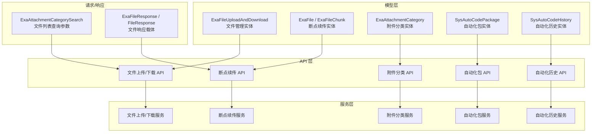
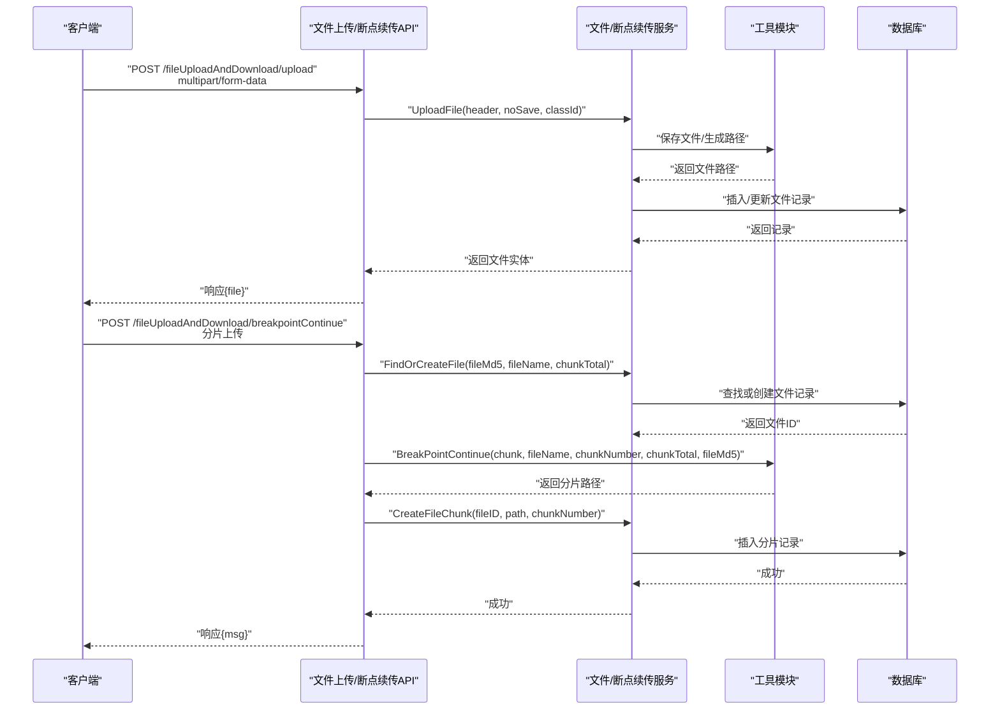
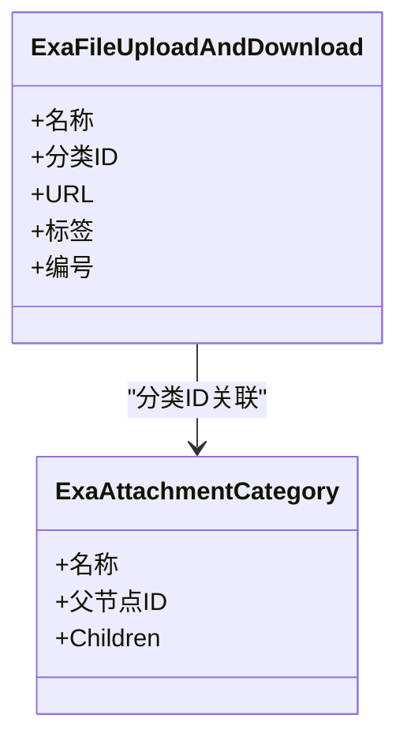
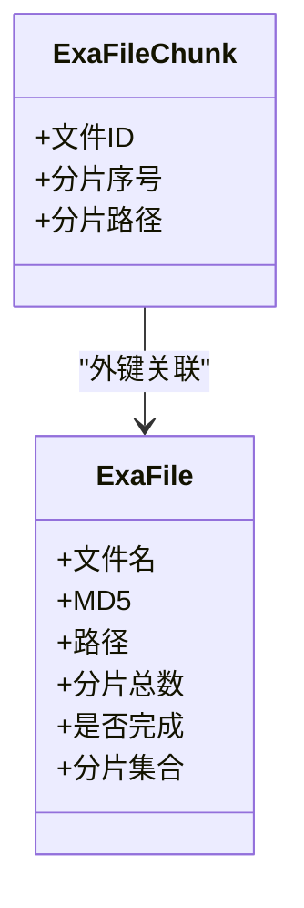
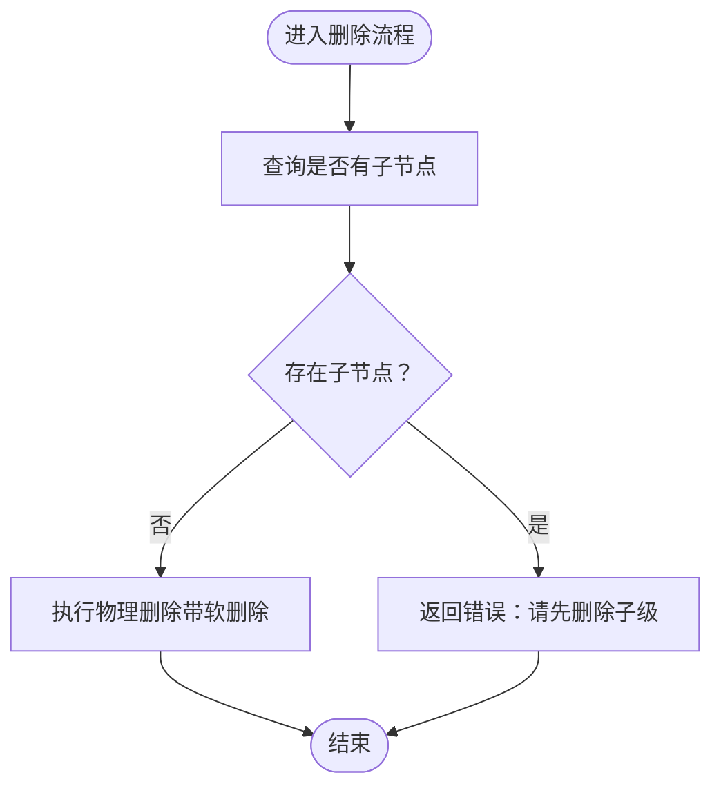
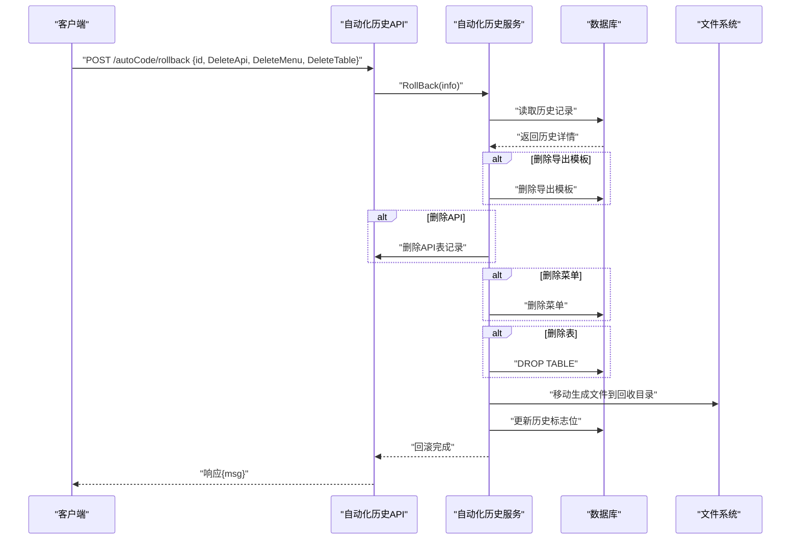
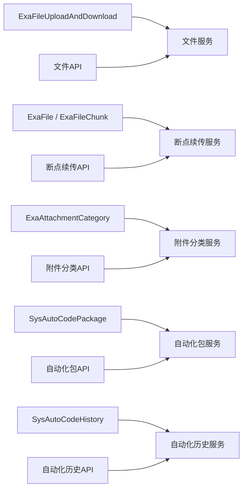

# 测试相关模型

<cite>
**本文引用的文件**
- [exa_file_upload_download.go](file://server/model/example/exa_file_upload_download.go)
- [exa_breakpoint_continue.go](file://server/model/example/exa_breakpoint_continue.go)
- [exa_attachment_category.go](file://server/model/example/exa_attachment_category.go)
- [sys_auto_code_package.go](file://server/model/system/sys_auto_code_package.go)
- [sys_auto_code_history.go](file://server/model/system/sys_auto_code_history.go)
- [exa_file_upload_and_downloads.go](file://server/model/example/request/exa_file_upload_and_downloads.go)
- [exa_file_upload_download.go](file://server/model/example/response/exa_file_upload_download.go)
- [exa_breakpoint_continue.go](file://server/model/example/response/exa_breakpoint_continue.go)
- [exa_file_upload_download.go](file://server/api/v1/example/exa_file_upload_download.go)
- [exa_breakpoint_continue.go](file://server/api/v1/example/exa_breakpoint_continue.go)
- [exa_attachment_category.go](file://server/api/v1/example/exa_attachment_category.go)
- [auto_code_package.go](file://server/api/v1/system/auto_code_package.go)
- [auto_code_history.go](file://server/api/v1/system/auto_code_history.go)
- [exa_attachment_category.go](file://server/service/example/exa_attachment_category.go)
- [auto_code_package.go](file://server/service/system/auto_code_package.go)
- [auto_code_history.go](file://server/service/system/auto_code_history.go)
- [common.go](file://server/model/common/request/common.go)
- [exa_attachment_category.go](file://server/router/example/exa_attachment_category.go)
</cite>

## 目录
1. [简介](#简介)
2. [项目结构](#项目结构)
3. [核心组件](#核心组件)
4. [架构总览](#架构总览)
5. [详细组件分析](#详细组件分析)
6. [依赖分析](#依赖分析)
7. [性能考量](#性能考量)
8. [故障排查指南](#故障排查指南)
9. [结论](#结论)
10. [附录](#附录)

## 简介
本文件面向测试平台中的“测试相关模型”，系统性梳理以下模型与配套能力：
- 文件管理模型：ExaFileUploadAndDownload 实体及配套接口，支持文件上传、编辑、删除、列表与URL导入。
- 断点续传模型：ExaFile 与 ExaFileChunk 实体及配套接口，支持大文件分片上传、校验、合并与清理。
- 测试用例管理模型：SysAutoCodePackage 与 SysAutoCodeHistory 实体，支撑自动化代码生成与历史回滚管理。
- 附件分类模型：ExaAttachmentCategory 实体及配套接口，支持树形分类的增删改查。

文档将逐项给出字段定义、关系映射、业务逻辑说明，并提供实际使用场景与调用流程图示，帮助读者在系统中正确使用这些模型。

## 项目结构
围绕测试相关模型，后端采用分层架构：
- Model 层：定义数据结构与表映射（含 GORM 注解）。
- Request/Response 层：定义请求与响应载体。
- API 层：定义路由与对外接口。
- Service 层：封装业务逻辑与数据操作。
- Router 层：注册路由组与具体路由。

图表来源
- [exa_file_upload_download.go:7-18](file://server/model/example/exa_file_upload_download.go#L7-L18)
- [exa_breakpoint_continue.go:8-24](file://server/model/example/exa_breakpoint_continue.go#L8-L24)
- [exa_attachment_category.go:7-16](file://server/model/example/exa_attachment_category.go#L7-L16)
- [sys_auto_code_package.go:7-18](file://server/model/system/sys_auto_code_package.go#L7-L18)
- [sys_auto_code_history.go:13-30](file://server/model/system/sys_auto_code_history.go#L13-L30)
- [exa_file_upload_download.go:14-136](file://server/api/v1/example/exa_file_upload_download.go#L14-L136)
- [exa_breakpoint_continue.go:20-157](file://server/api/v1/example/exa_breakpoint_continue.go#L20-L157)
- [exa_attachment_category.go:12-83](file://server/api/v1/example/exa_attachment_category.go#L12-L83)
- [auto_code_package.go:14-101](file://server/api/v1/system/auto_code_package.go#L14-L101)
- [auto_code_history.go:12-116](file://server/api/v1/system/auto_code_history.go#L12-L116)

章节来源
- [exa_file_upload_download.go:1-19](file://server/model/example/exa_file_upload_download.go#L1-L19)
- [exa_breakpoint_continue.go:1-25](file://server/model/example/exa_breakpoint_continue.go#L1-L25)
- [exa_attachment_category.go:1-17](file://server/model/example/exa_attachment_category.go#L1-L17)
- [sys_auto_code_package.go:1-19](file://server/model/system/sys_auto_code_package.go#L1-L19)
- [sys_auto_code_history.go:1-69](file://server/model/system/sys_auto_code_history.go#L1-L69)

## 核心组件
本节对各模型进行字段定义、关系映射与业务要点说明。

- ExaFileUploadAndDownload（文件管理）
  - 字段要点：名称、分类ID、URL、标签、编号；继承全局模型ID与时间戳。
  - 关系映射：与附件分类通过分类ID关联；与断点续传无直接外键关联。
  - 业务逻辑：支持上传、编辑、删除、分页列表、URL导入。
  
- ExaFile / ExaFileChunk（断点续传）
  - ExaFile：文件元信息（名称、MD5、路径、总分片数、是否完成），包含分片集合。
  - ExaFileChunk：分片信息（所属文件ID、分片序号、分片路径）。
  - 关系映射：ExaFileChunk.ExaFileID -> ExaFile.ID；一对多关系。
  - 业务逻辑：分片上传校验、创建分片记录、合并文件、清理缓存分片。
  
- ExaAttachmentCategory（附件分类）
  - 字段要点：名称、父节点ID；支持 Children 属性用于树形渲染。
  - 关系映射：Pid -> ID 的自引用；树形结构。
  - 业务逻辑：增删改查、树形构建、删除前检查子节点。
  
- SysAutoCodePackage（自动化包）
  - 字段要点：描述、展示名、模板、包名、模块（示例字段）。
  - 关系映射：与 SysAutoCodeHistory 通过 PackageID 关联。
  - 业务逻辑：创建包记录、读取包列表、模板枚举。
  
- SysAutoCodeHistory（自动化历史）
  - 字段要点：表名、模块/插件、前端请求、结构体名、缩写、业务库、描述、模板信息、注入路径、标志位、API/菜单/导出模板ID、包ID。
  - 关系映射：外键 AutoCodePackage -> SysAutoCodePackage.ID。
  - 业务逻辑：创建历史记录、按ID获取元数据、回滚（删除表/菜单/API/文件）、删除历史、分页查询。

章节来源
- [exa_file_upload_download.go:7-18](file://server/model/example/exa_file_upload_download.go#L7-L18)
- [exa_breakpoint_continue.go:8-24](file://server/model/example/exa_breakpoint_continue.go#L8-L24)
- [exa_attachment_category.go:7-16](file://server/model/example/exa_attachment_category.go#L7-L16)
- [sys_auto_code_package.go:7-18](file://server/model/system/sys_auto_code_package.go#L7-L18)
- [sys_auto_code_history.go:13-30](file://server/model/system/sys_auto_code_history.go#L13-L30)

## 架构总览
下图展示“文件管理”与“断点续传”的端到端调用链路，体现请求参数、服务处理与响应返回的关系。

图表来源
- [exa_file_upload_download.go:16-42](file://server/api/v1/example/exa_file_upload_download.go#L16-L42)
- [exa_breakpoint_continue.go:29-78](file://server/api/v1/example/exa_breakpoint_continue.go#L29-L78)
- [exa_file_upload_download.go:1-200](file://server/service/example/exa_file_upload_download.go#L1-L200)
- [exa_breakpoint_continue.go:1-200](file://server/service/example/exa_breakpoint_continue.go#L1-L200)

## 详细组件分析

### 文件管理模型（ExaFileUploadAndDownload）
- 字段定义与注释
  - 名称：文件显示名称
  - 分类ID：关联附件分类
  - URL：文件访问地址
  - 标签：便于检索与筛选
  - 编号：唯一标识
- 关系映射
  - 与附件分类：一对多（一个分类可包含多个文件）
  - 与断点续传：无直接外键关联
- 业务逻辑
  - 上传：接收文件流，生成存储路径，入库
  - 编辑：修改名称/标签
  - 删除：删除记录
  - 列表：分页查询，支持分类过滤
  - URL导入：批量导入外部链接

图表来源
- [exa_file_upload_download.go:7-18](file://server/model/example/exa_file_upload_download.go#L7-L18)
- [exa_attachment_category.go:7-16](file://server/model/example/exa_attachment_category.go#L7-L16)

章节来源
- [exa_file_upload_download.go:16-136](file://server/api/v1/example/exa_file_upload_download.go#L16-L136)
- [exa_file_upload_and_downloads.go:7-10](file://server/model/example/request/exa_file_upload_and_downloads.go#L7-L10)
- [exa_file_upload_download.go:5-8](file://server/model/example/response/exa_file_upload_download.go#L5-L8)

### 断点续传模型（ExaFile / ExaFileChunk）
- 字段定义与注释
  - ExaFile：文件名、MD5、路径、分片总数、是否完成；包含分片集合
  - ExaFileChunk：所属文件ID、分片序号、分片路径
- 关系映射
  - ExaFileChunk.ExaFileID -> ExaFile.ID（一对多）
- 业务逻辑
  - 分片上传：校验分片MD5，落盘分片，记录分片
  - 查找文件：根据MD5/名称/总分片数定位或创建文件
  - 合并文件：触发合并，生成最终文件路径
  - 清理分片：删除临时分片与记录

图表来源
- [exa_breakpoint_continue.go:8-24](file://server/model/example/exa_breakpoint_continue.go#L8-L24)

章节来源
- [exa_breakpoint_continue.go:29-157](file://server/api/v1/example/exa_breakpoint_continue.go#L29-L157)
- [exa_breakpoint_continue.go:5-12](file://server/model/example/response/exa_breakpoint_continue.go#L5-L12)

### 附件分类模型（ExaAttachmentCategory）
- 字段定义与注释
  - 名称：分类名称
  - 父节点ID：树形结构父ID
  - Children：子节点（仅用于渲染，不参与GORM映射）
- 关系映射
  - Pid -> ID 自引用（树形父子关系）
- 业务逻辑
  - 新增/更新：校验同名同父是否存在
  - 删除：需先清空子节点
  - 列表：构建树形结构

图表来源
- [exa_attachment_category.go:37-44](file://server/service/example/exa_attachment_category.go#L37-L44)

章节来源
- [exa_attachment_category.go:12-83](file://server/api/v1/example/exa_attachment_category.go#L12-L83)
- [exa_attachment_category.go:12-67](file://server/service/example/exa_attachment_category.go#L12-L67)
- [exa_attachment_category.go:9-16](file://server/router/example/exa_attachment_category.go#L9-L16)

### 自动化代码生成模型（SysAutoCodePackage / SysAutoCodeHistory）
- 字段定义与注释
  - SysAutoCodePackage：描述、展示名、模板、包名、模块
  - SysAutoCodeHistory：表名、模块/插件、前端请求、结构体名、缩写、业务库、描述、模板信息、注入路径、标志位、API/菜单/导出模板ID、包ID
- 关系映射
  - SysAutoCodeHistory.PackageID -> SysAutoCodePackage.ID（外键）
- 业务逻辑
  - 包管理：创建包记录、读取包列表、模板枚举
  - 历史管理：创建历史记录、按ID获取元数据、回滚（删除表/菜单/API/文件）、删除历史、分页查询

图表来源
- [auto_code_history.go:63-85](file://server/api/v1/system/auto_code_history.go#L63-L85)
- [auto_code_history.go:64-182](file://server/service/system/auto_code_history.go#L64-L182)

章节来源
- [sys_auto_code_package.go:7-18](file://server/model/system/sys_auto_code_package.go#L7-L18)
- [sys_auto_code_history.go:13-69](file://server/model/system/sys_auto_code_history.go#L13-L69)
- [auto_code_package.go:16-101](file://server/api/v1/system/auto_code_package.go#L16-L101)
- [auto_code_history.go:14-116](file://server/api/v1/system/auto_code_history.go#L14-L116)
- [auto_code_package.go:27-274](file://server/service/system/auto_code_package.go#L27-L274)
- [auto_code_history.go:31-218](file://server/service/system/auto_code_history.go#L31-L218)

## 依赖分析
- 模型层依赖
  - 所有模型均继承全局模型基类，统一具备ID与时间戳字段。
  - 断点续传模型之间存在明确的一对多关系。
  - 自动化历史模型与包模型存在外键关系。
- API 层依赖
  - 文件与断点续传API依赖服务层；附件分类API依赖分类服务；自动化API依赖对应服务。
- 服务层依赖
  - 文件/断点续传服务依赖工具模块（如分片校验、文件合并、路径处理）。
  - 自动化服务依赖AST注入解析与文件系统操作。
- 路由层依赖
  - 分类路由组挂载在示例模块下，便于统一管理。

图表来源
- [exa_file_upload_download.go:14-136](file://server/api/v1/example/exa_file_upload_download.go#L14-L136)
- [exa_breakpoint_continue.go:20-157](file://server/api/v1/example/exa_breakpoint_continue.go#L20-L157)
- [exa_attachment_category.go:12-83](file://server/api/v1/example/exa_attachment_category.go#L12-L83)
- [auto_code_package.go:14-101](file://server/api/v1/system/auto_code_package.go#L14-L101)
- [auto_code_history.go:12-116](file://server/api/v1/system/auto_code_history.go#L12-L116)

章节来源
- [exa_file_upload_download.go:1-136](file://server/api/v1/example/exa_file_upload_download.go#L1-L136)
- [exa_breakpoint_continue.go:1-157](file://server/api/v1/example/exa_breakpoint_continue.go#L1-L157)
- [exa_attachment_category.go:1-83](file://server/api/v1/example/exa_attachment_category.go#L1-L83)
- [auto_code_package.go:1-101](file://server/api/v1/system/auto_code_package.go#L1-L101)
- [auto_code_history.go:1-116](file://server/api/v1/system/auto_code_history.go#L1-L116)

## 性能考量
- 文件上传
  - 使用分块上传与MD5校验，避免重复传输与数据不一致。
  - 建议限制单次分片大小与并发数，结合磁盘IO与网络带宽调优。
- 断点续传
  - 分片落盘与索引记录应异步化，减少主流程阻塞。
  - 合并阶段建议使用零拷贝或分块合并策略，降低内存峰值。
- 附件分类
  - 树形构建采用一次性查询后内存组装，避免N+1查询。
- 自动化生成
  - AST注入与文件写入建议批量执行并加锁，避免竞态。
  - 模板读取与解析应缓存常用模板，减少I/O开销。

## 故障排查指南
- 文件上传失败
  - 检查文件头解析与表单字段绑定是否正确。
  - 校验存储路径权限与磁盘空间。
- 断点续传校验失败
  - 确认分片MD5计算与前端一致；检查分片序号与总数。
  - 查看分片记录是否成功插入。
- 合并文件异常
  - 确认所有分片均已上传且顺序正确。
  - 检查目标路径写入权限。
- 删除分类失败
  - 确认是否存在子节点未清理。
- 自动化回滚失败
  - 检查历史记录标志位与模板路径转换逻辑。
  - 确认文件移动与注入回滚是否成功执行。

章节来源
- [exa_file_upload_download.go:30-41](file://server/api/v1/example/exa_file_upload_download.go#L30-L41)
- [exa_breakpoint_continue.go:54-58](file://server/api/v1/example/exa_breakpoint_continue.go#L54-L58)
- [exa_attachment_category.go:38-43](file://server/service/example/exa_attachment_category.go#L38-L43)
- [auto_code_history.go:119-165](file://server/service/system/auto_code_history.go#L119-L165)

## 结论
本文档系统梳理了测试平台中的四类关键模型：文件管理、断点续传、附件分类与自动化代码生成。通过对字段、关系与业务流程的深入分析，读者可在系统中准确使用这些模型，并在实际开发中遵循最佳实践以确保稳定性与性能。

## 附录
- 实际使用场景与调用示例（以路径代替代码片段）
  - 文件上传
    - 请求：POST /fileUploadAndDownload/upload
    - 参数：multipart/form-data（file字段）、classId、noSave
    - 返回：包含文件实体的响应
    - 参考路径：[exa_file_upload_download.go:25-42](file://server/api/v1/example/exa_file_upload_download.go#L25-L42)
  - 断点续传
    - 分片上传：POST /fileUploadAndDownload/breakpointContinue
    - 参数：fileMd5、fileName、chunkMd5、chunkNumber、chunkTotal、file（分片）
    - 返回：分片创建成功
    - 参考路径：[exa_breakpoint_continue.go:29-78](file://server/api/v1/example/exa_breakpoint_continue.go#L29-L78)
  - 查找文件
    - GET /fileUploadAndDownload/findFile
    - 参数：fileMd5、fileName、chunkTotal
    - 返回：文件详情
    - 参考路径：[exa_breakpoint_continue.go:89-100](file://server/api/v1/example/exa_breakpoint_continue.go#L89-L100)
  - 合并文件
    - POST /fileUploadAndDownload/breakpointContinueFinish
    - 参数：fileMd5、fileName
    - 返回：文件路径
    - 参考路径：[exa_breakpoint_continue.go:111-121](file://server/api/v1/example/exa_breakpoint_continue.go#L111-L121)
  - 删除分片
    - POST /fileUploadAndDownload/removeChunk
    - 参数：filePath、fileMd5
    - 返回：删除成功
    - 参考路径：[exa_breakpoint_continue.go:132-156](file://server/api/v1/example/exa_breakpoint_continue.go#L132-L156)
  - 附件分类
    - 获取列表：GET /attachmentCategory/getCategoryList
    - 新增/编辑：POST /attachmentCategory/addCategory
    - 删除：POST /attachmentCategory/deleteCategory
    - 参考路径：[exa_attachment_category.go:21-82](file://server/api/v1/example/exa_attachment_category.go#L21-L82)
  - 自动化包
    - 创建：POST /autoCode/createPackage
    - 删除：POST /autoCode/delPackage
    - 获取：POST /autoCode/getPackage
    - 模板：GET /autoCode/getTemplates
    - 参考路径：[auto_code_package.go:25-100](file://server/api/v1/system/auto_code_package.go#L25-L100)
  - 自动化历史
    - 获取元数据：POST /autoCode/getMeta
    - 删除历史：POST /autoCode/delSysHistory
    - 回滚：POST /autoCode/rollback
    - 查询列表：POST /autoCode/getSysHistory
    - 参考路径：[auto_code_history.go:23-115](file://server/api/v1/system/auto_code_history.go#L23-L115)