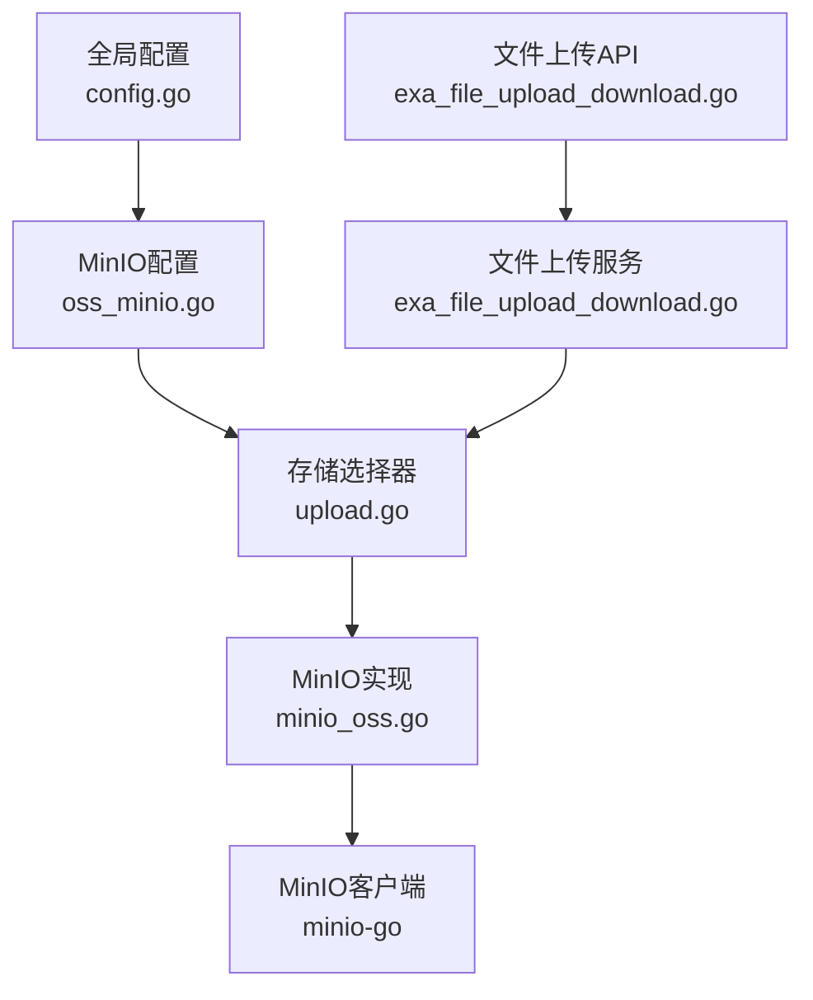
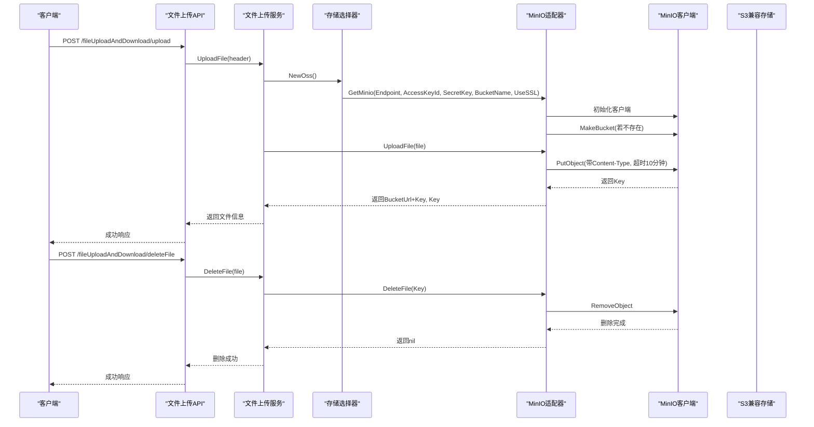
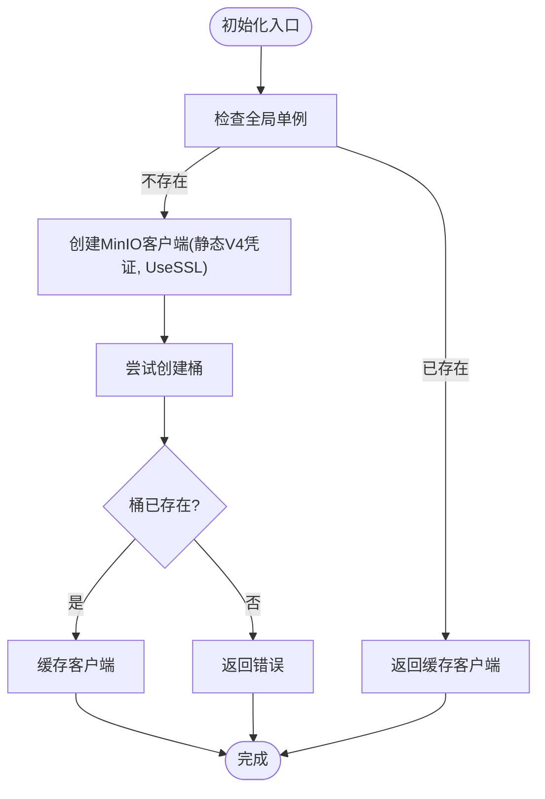
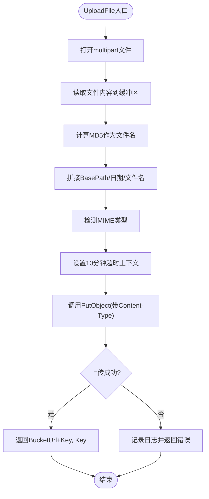
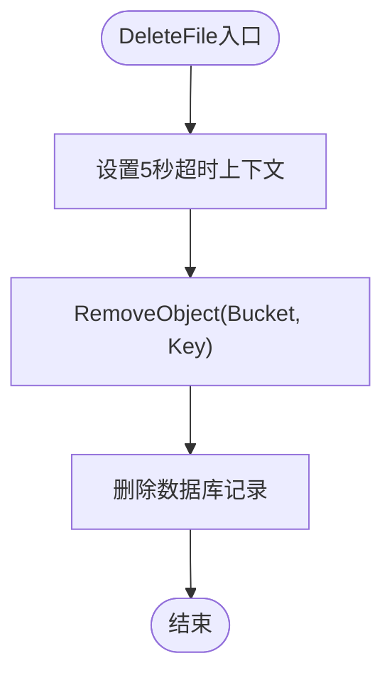
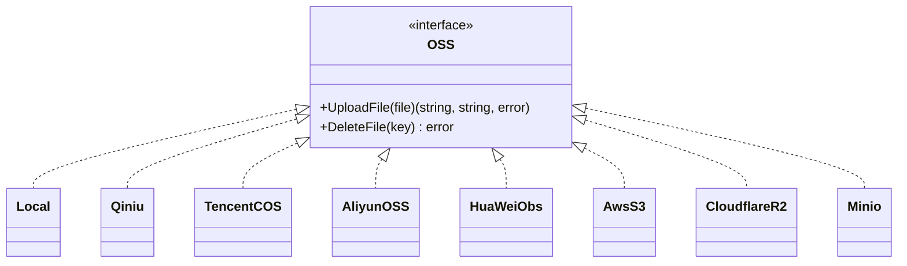
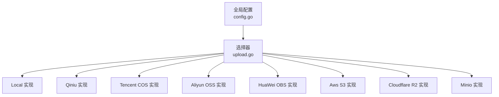

# MinIO 存储实现

<cite>
**本文档引用的文件**
- [oss_minio.go](file://server/config/oss_minio.go)
- [minio_oss.go](file://server/utils/upload/minio_oss.go)
- [upload.go](file://server/utils/upload/upload.go)
- [config.go](file://server/config/config.go)
- [config.yaml](file://server/config.yaml)
- [exa_file_upload_download.go](file://server/api/v1/example/exa_file_upload_download.go)
- [exa_file_upload_download.go](file://server/service/example/exa_file_upload_download.go)
- [storage_config_management.md](file://repowiki/zh/content/后端系统/文件存储系统/存储配置管理.md)
- [other_cloud_storage.md](file://repowiki/zh/content/后端系统/文件存储系统/其他云存储.md)
- [file_storage_system.md](file://repowiki/zh/content/后端系统/文件存储系统/文件存储系统.md)
</cite>

## 目录
1. [引言](#引言)
2. [项目结构](#项目结构)
3. [核心组件](#核心组件)
4. [架构总览](#架构总览)
5. [详细组件分析](#详细组件分析)
6. [依赖关系分析](#依赖关系分析)
7. [性能考量](#性能考量)
8. [故障排除指南](#故障排除指南)
9. [结论](#结论)
10. [附录](#附录)

## 引言
本文件针对 Gin-Vue-Admin 项目中的 MinIO 存储实现进行全面技术文档整理。重点涵盖 MinIO 客户端初始化、连接配置、认证机制；核心功能实现（文件上传下载、桶管理、对象版本控制与生命周期管理的现状与扩展建议）；高可用性设计（分布式存储架构、数据冗余、故障转移、负载均衡）；安全机制（访问密钥管理、权限控制、TLS 加密、审计日志）；性能优化策略（并发上传、分片上传、缓存策略、网络优化）；监控与运维（健康检查、性能指标、存储容量监控、备份恢复）；以及部署与配置指南（单节点与分布式部署、环境变量配置、网络配置）。文档旨在帮助开发者与运维人员快速理解并安全高效地使用 MinIO 作为对象存储后端。

## 项目结构
围绕 MinIO 的实现主要分布在以下模块：
- 配置层：定义 MinIO 配置结构体，注入到全局配置中
- 适配层：封装 MinIO 客户端，实现统一的 OSS 接口
- 业务层：API 与服务层通过统一接口调用上传/删除
- 文档与 Wiki：提供配置管理、故障排除与最佳实践

**图表来源**
- [config.go:22-29](file://server/config/config.go#L22-L29)
- [oss_minio.go:3-11](file://server/config/oss_minio.go#L3-L11)
- [upload.go:20-46](file://server/utils/upload/upload.go#L20-L46)
- [minio_oss.go:23-106](file://server/utils/upload/minio_oss.go#L23-L106)
- [exa_file_upload_download.go:25-42](file://server/api/v1/example/exa_file_upload_download.go#L25-L42)
- [exa_file_upload_download.go:96-120](file://server/service/example/exa_file_upload_download.go#L96-L120)

**章节来源**
- [config.go:22-29](file://server/config/config.go#L22-L29)
- [oss_minio.go:3-11](file://server/config/oss_minio.go#L3-L11)
- [upload.go:20-46](file://server/utils/upload/upload.go#L20-L46)
- [minio_oss.go:23-106](file://server/utils/upload/minio_oss.go#L23-L106)
- [exa_file_upload_download.go:25-42](file://server/api/v1/example/exa_file_upload_download.go#L25-L42)
- [exa_file_upload_download.go:96-120](file://server/service/example/exa_file_upload_download.go#L96-L120)

## 核心组件
- MinIO 配置结构体：包含 Endpoint、AccessKeyId、AccessKeySecret、BucketName、UseSSL、BasePath、BucketUrl 等关键字段，用于驱动 MinIO 客户端初始化与对象访问。
- MinIO 客户端封装：提供 GetMinio 初始化客户端、UploadFile 上传文件、DeleteFile 删除对象的方法；内部自动创建桶、设置 MIME 类型、超时控制与 MD5 文件名策略。
- 存储选择器：根据全局配置中的 OssType 返回对应存储实现；当 OssType 为 minio 时，调用 GetMinio 并在初始化失败时记录警告并中断启动，确保配置错误不会静默失败。
- API 与服务：文件上传 API 接收 multipart 文件，服务层通过统一 OSS 接口调用上传，返回访问 URL 与对象键；删除流程先调用 OSS 删除，再删除数据库记录。

**章节来源**
- [oss_minio.go:3-11](file://server/config/oss_minio.go#L3-L11)
- [minio_oss.go:23-106](file://server/utils/upload/minio_oss.go#L23-L106)
- [upload.go:20-46](file://server/utils/upload/upload.go#L20-L46)
- [exa_file_upload_download.go:25-42](file://server/api/v1/example/exa_file_upload_download.go#L25-L42)
- [exa_file_upload_download.go:96-120](file://server/service/example/exa_file_upload_download.go#L96-L120)

## 架构总览
下图展示了从 API 到 MinIO 的完整调用链路，包括初始化、上传与删除流程：

**图表来源**
- [exa_file_upload_download.go:25-42](file://server/api/v1/example/exa_file_upload_download.go#L25-L42)
- [exa_file_upload_download.go:96-120](file://server/service/example/exa_file_upload_download.go#L96-L120)
- [upload.go:36-42](file://server/utils/upload/upload.go#L36-L42)
- [minio_oss.go:28-53](file://server/utils/upload/minio_oss.go#L28-L53)
- [minio_oss.go:55-97](file://server/utils/upload/minio_oss.go#L55-L97)
- [minio_oss.go:99-107](file://server/utils/upload/minio_oss.go#L99-L107)

## 详细组件分析

### MinIO 配置与初始化
- 配置结构：Endpoint、AccessKeyId、AccessKeySecret、BucketName、UseSSL、BasePath、BucketUrl。
- 初始化流程：GetMinio 在首次调用时创建 MinIO 客户端，使用静态凭证 V4；随后尝试创建桶，若桶已存在则跳过；最后将客户端缓存为全局单例，避免重复初始化。
- 连接与认证：UseSSL 控制是否启用 TLS；AccessKeyId/AccessKeySecret 提供静态凭证；Endpoint 指定 MinIO 服务地址。

**图表来源**
- [minio_oss.go:28-53](file://server/utils/upload/minio_oss.go#L28-L53)

**章节来源**
- [oss_minio.go:3-11](file://server/config/oss_minio.go#L3-L11)
- [minio_oss.go:28-53](file://server/utils/upload/minio_oss.go#L28-L53)

### 文件上传实现
- 文件打开与读取：打开 multipart 文件头，读取内容到内存缓冲区。
- 文件命名策略：使用 MD5 计算文件名，扩展名保留；路径采用 BasePath + 日期 + 文件名，便于按日期归档与多租户隔离。
- MIME 类型检测：根据扩展名推断 Content-Type，若无法识别则使用 octet-stream。
- 上传行为：调用 PutObject，设置 10 分钟超时；成功后返回 BucketUrl + Key 作为访问链接与 Key。
- 错误处理：对文件打开失败、读取失败、PutObject 失败等情况记录日志并返回错误。

**图表来源**
- [minio_oss.go:55-97](file://server/utils/upload/minio_oss.go#L55-L97)

**章节来源**
- [minio_oss.go:55-97](file://server/utils/upload/minio_oss.go#L55-L97)

### 文件删除实现
- 删除流程：通过 RemoveObject 按 Key 删除对象；设置 5 秒超时；返回底层错误。
- 业务层删除：服务层先查询数据库记录，调用 OSS 删除对象，再删除数据库记录。

**图表来源**
- [minio_oss.go:99-107](file://server/utils/upload/minio_oss.go#L99-L107)
- [exa_file_upload_download.go:43-55](file://server/service/example/exa_file_upload_download.go#L43-L55)

**章节来源**
- [minio_oss.go:99-107](file://server/utils/upload/minio_oss.go#L99-L107)
- [exa_file_upload_download.go:43-55](file://server/service/example/exa_file_upload_download.go#L43-L55)

### 存储选择器与工厂模式
- 选择逻辑：根据全局配置 System.OssType 返回对应存储实现；当 OssType 为 minio 时，调用 GetMinio 初始化客户端；若初始化失败，记录警告并中断启动，防止配置错误导致系统继续运行但不可用。
- 回退策略：当 OssType 非法或后端不可用时，系统回退到本地存储。

**图表来源**
- [upload.go:12-46](file://server/utils/upload/upload.go#L12-L46)

**章节来源**
- [upload.go:12-46](file://server/utils/upload/upload.go#L12-L46)

## 依赖关系分析
- 配置模型之间无直接耦合，通过全局配置聚合统一注入。
- 存储选择器依赖系统配置中的 OssType，返回对应实现。
- 各后端实现依赖各自配置结构体，不互相依赖。
- 本地磁盘配置独立于存储后端配置。

**图表来源**
- [config.go:22-29](file://server/config/config.go#L22-L29)
- [upload.go:20-46](file://server/utils/upload/upload.go#L20-L46)

**章节来源**
- [config.go:22-29](file://server/config/config.go#L22-L29)
- [upload.go:20-46](file://server/utils/upload/upload.go#L20-L46)

## 性能考量
- URL 拼接与缓存：合理设置 BasePath/BaseUrl，减少重复解析与网络往返。
- 传输安全：优先使用 SSL/TLS，避免明文传输带来的性能与安全风险。
- 并发控制：在业务层控制上传并发，避免后端限速或资源争用。
- 路径前缀：使用 BasePath 将不同模块或租户隔离，便于缓存与统计。
- 大文件分片：MinIO 客户端在 PutObject 时自动进行分片上传，提高稳定性与成功率。

**章节来源**
- [other_cloud_storage.md:411-422](file://repowiki/zh/content/后端系统/文件存储系统/其他云存储.md#L411-L422)
- [minio_oss.go:90-96](file://server/utils/upload/minio_oss.go#L90-L96)

## 故障排除指南
- MinIO 初始化失败：检查 Endpoint、AccessKeyId、AccessKeySecret、BucketName、UseSSL 是否正确；查看日志警告并修正。
- 上传失败：确认 BasePath 与对象键拼接规则；检查 BucketUrl 与实际访问域名一致。
- 权限错误：核对 AccessKey/SecretKey 凭证；确保具备写入权限。
- 跨域与证书问题：确保启用 SSL 且证书有效；检查 CORS 配置与前端域名匹配。
- 回退到本地：当 OssType 非法或后端不可用时，系统回退到本地存储。

**章节来源**
- [storage_config_management.md:202-208](file://repowiki/zh/content/后端系统/文件存储系统/存储配置管理.md#L202-L208)
- [storage_config_management.md:248-254](file://repowiki/zh/content/后端系统/文件存储系统/存储配置管理.md#L248-L254)
- [file_storage_system.md:264-277](file://repowiki/zh/content/后端系统/文件存储系统/文件存储系统.md#L264-L277)

## 结论
通过统一的配置模型与运行时选择器，系统实现了对多种存储后端的灵活接入。MinIO 适配器提供了简洁的上传与删除接口，并在初始化阶段自动创建桶，简化了部署与使用。建议在生产环境中优先采用 MinIO 或兼容 S3 的对象存储，结合 CDN、监控与备份策略，进一步提升可用性与安全性。遇到问题时，优先检查凭证、网络连通性与 URL 一致性，并利用日志定位根因。

## 附录

### MinIO 配置项与示例
- 配置项：endpoint、access-key-id、access-key-secret、bucket-name、use-ssl、base-path、bucket-url
- 示例配置位置：config.yaml 中的 minio 段落
- 前端配置界面：系统配置页面中 MinIO 相关字段

**章节来源**
- [config.yaml:199-208](file://server/config.yaml#L199-L208)
- [other_cloud_storage.md:195-209](file://repowiki/zh/content/后端系统/文件存储系统/其他云存储.md#L195-L209)

### MinIO 核心功能现状与扩展建议
- 文件上传下载：已完成，支持分片上传与超时控制
- 桶管理：初始化时自动创建桶，后续可通过管理界面或 API 管理
- 对象版本控制：当前实现未显式启用版本控制，可在 MinIO 侧启用并扩展接口以支持版本查询与回滚
- 生命周期管理：当前实现未涉及生命周期规则配置，可在 MinIO 侧配置并扩展接口以支持规则查询与更新

**章节来源**
- [minio_oss.go:40-50](file://server/utils/upload/minio_oss.go#L40-L50)
- [other_cloud_storage.md:195-209](file://repowiki/zh/content/后端系统/文件存储系统/其他云存储.md#L195-L209)

### 高可用性设计要点
- 分布式存储架构：MinIO 支持分布式部署，建议至少 4 个节点起步，结合纠删码实现数据冗余
- 数据冗余：通过纠删码与多副本策略保证数据可靠性
- 故障转移：在客户端层面实现重试与超时控制，结合负载均衡器实现流量分发
- 负载均衡：通过反向代理或 Ingress 实现多节点负载均衡

**章节来源**
- [other_cloud_storage.md:195-209](file://repowiki/zh/content/后端系统/文件存储系统/其他云存储.md#L195-L209)

### 安全机制
- 访问密钥管理：使用静态凭证 V4，建议定期轮换密钥并限制最小权限
- 权限控制：通过 MinIO IAM 与策略控制访问权限
- TLS 加密：启用 SSL/TLS，确保传输安全
- 审计日志：启用访问日志与审计日志，便于追踪与合规

**章节来源**
- [minio_oss.go:33-36](file://server/utils/upload/minio_oss.go#L33-L36)
- [other_cloud_storage.md:207-209](file://repowiki/zh/content/后端系统/文件存储系统/其他云存储.md#L207-L209)

### 监控与运维
- 健康检查：通过 MinIO Admin API 或探针检查服务状态
- 性能指标：关注吞吐量、延迟、错误率与资源使用情况
- 存储容量监控：定期检查桶容量与对象数量
- 备份恢复：制定定期备份策略，验证恢复流程

**章节来源**
- [other_cloud_storage.md:423-434](file://repowiki/zh/content/后端系统/文件存储系统/其他云存储.md#L423-L434)

### 部署与配置指南
- 单节点部署：适用于开发与测试环境，配置 endpoint 与密钥即可
- 分布式部署：适用于生产环境，建议使用至少 4 个节点，启用纠删码
- 环境变量配置：通过 config.yaml 或环境变量注入配置
- 网络配置：确保防火墙开放 9000 端口，配置反向代理与域名解析

**章节来源**
- [config.yaml:74-92](file://server/config.yaml#L74-L92)
- [config.yaml:199-208](file://server/config.yaml#L199-L208)
- [other_cloud_storage.md:195-209](file://repowiki/zh/content/后端系统/文件存储系统/其他云存储.md#L195-L209)