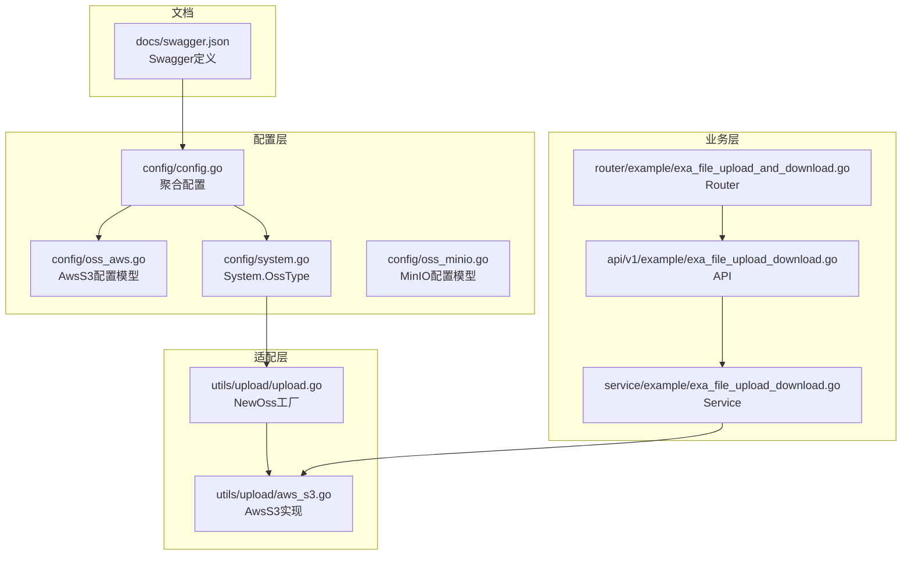
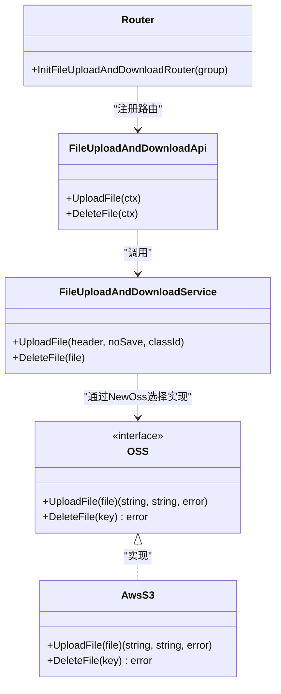
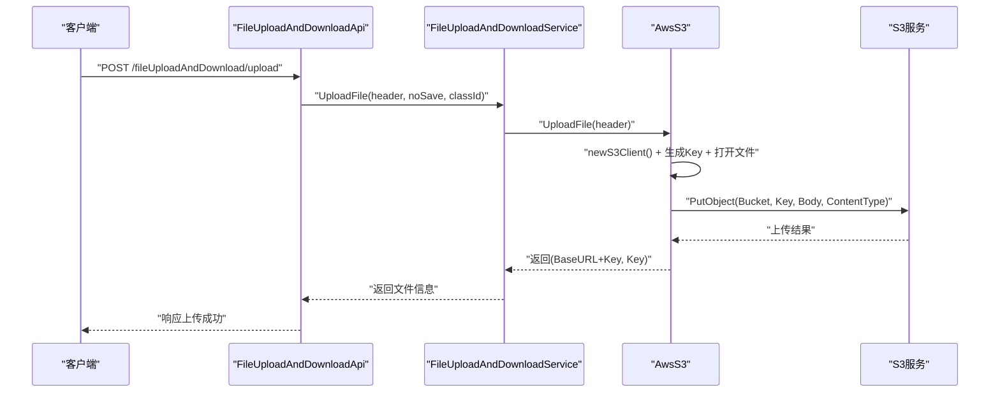
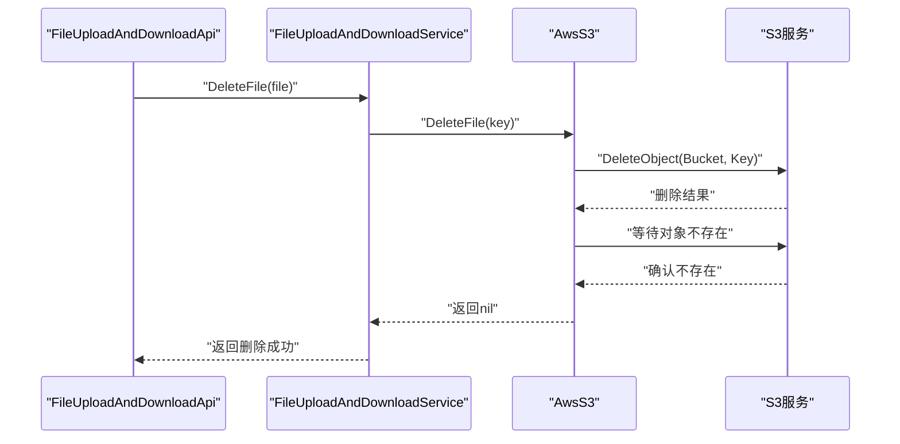
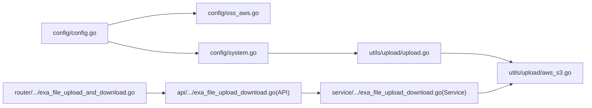

# AWS S3 集成

<cite>
**本文引用的文件**
- [aws_s3.go](file://server/utils/upload/aws_s3.go)
- [upload.go](file://server/utils/upload/upload.go)
- [oss_aws.go](file://server/config/oss_aws.go)
- [config.go](file://server/config/config.go)
- [system.go](file://server/config/system.go)
- [exa_file_upload_download.go（API）](file://server/api/v1/example/exa_file_upload_download.go)
- [exa_file_upload_download.go（Service）](file://server/service/example/exa_file_upload_download.go)
- [exa_file_upload_and_download.go（Router）](file://server/router/example/exa_file_upload_and_download.go)
- [breakpoint_continue.go](file://server/utils/breakpoint_continue.go)
- [swagger.json](file://server/docs/swagger.json)
- [config.yaml](file://server/config.yaml)
- [oss_minio.go](file://server/config/oss_minio.go)
</cite>

## 目录
1. [简介](#简介)
2. [项目结构](#项目结构)
3. [核心组件](#核心组件)
4. [架构总览](#架构总览)
5. [详细组件分析](#详细组件分析)
6. [依赖分析](#依赖分析)
7. [性能考虑](#性能考虑)
8. [故障排查指南](#故障排查指南)
9. [结论](#结论)
10. [附录：配置与使用示例](#附录配置与使用示例)

## 简介
本文件面向在 Gin-Vue-Admin 项目中集成 AWS S3 的开发者，系统性说明以下内容：
- 配置项与集成方式：Access Key、Bucket、Region、Endpoint、BaseURL、PathPrefix、S3ForcePathStyle、DisableSSL 等
- 上传流程：单文件直传、删除流程、客户端访问 URL 组装
- 高级能力：版本控制、生命周期规则、跨区域复制（概念性说明）
- 使用示例：文件管理、权限控制、成本优化策略
- 并发与断点续传现状与建议

注意：当前仓库实现采用单文件直传（PutObject），未包含预签名 URL 生成与 Multipart 上传逻辑；断点续传为本地分片拼接，非 S3 分段上传。

## 项目结构
围绕 AWS S3 的关键文件分布如下：
- 配置模型：server/config/oss_aws.go、server/config/config.go、server/config/system.go
- 存储适配层：server/utils/upload/upload.go、server/utils/upload/aws_s3.go
- 业务接口与路由：server/api/v1/example/exa_file_upload_download.go、server/router/example/exa_file_upload_and_download.go
- 业务服务：server/service/example/exa_file_upload_download.go
- 文档与 Swagger 定义：server/docs/swagger.json
- 断点续传（本地）：server/utils/breakpoint_continue.go

图表来源
- [config.go:21-29](file://server/config/config.go#L21-L29)
- [oss_aws.go:3-13](file://server/config/oss_aws.go#L3-L13)
- [system.go:3-15](file://server/config/system.go#L3-L15)
- [oss_minio.go:3-12](file://server/config/oss_minio.go#L3-L12)
- [upload.go:20-46](file://server/utils/upload/upload.go#L20-L46)
- [aws_s3.go:29-54](file://server/utils/upload/aws_s3.go#L29-L54)
- [exa_file_upload_download.go（API）:25-42](file://server/api/v1/example/exa_file_upload_download.go#L25-L42)
- [exa_file_upload_download.go（Service）:96-120](file://server/service/example/exa_file_upload_download.go#L96-L120)
- [exa_file_upload_and_download.go（Router）:9-22](file://server/router/example/exa_file_upload_and_download.go#L9-L22)
- [swagger.json:6568-6598](file://server/docs/swagger.json#L6568-L6598)

章节来源
- [config.go:21-29](file://server/config/config.go#L21-L29)
- [oss_aws.go:3-13](file://server/config/oss_aws.go#L3-L13)
- [system.go:3-15](file://server/config/system.go#L3-L15)
- [oss_minio.go:3-12](file://server/config/oss_minio.go#L3-L12)
- [upload.go:20-46](file://server/utils/upload/upload.go#L20-L46)
- [aws_s3.go:29-54](file://server/utils/upload/aws_s3.go#L29-L54)
- [exa_file_upload_download.go（API）:25-42](file://server/api/v1/example/exa_file_upload_download.go#L25-L42)
- [exa_file_upload_download.go（Service）:96-120](file://server/service/example/exa_file_upload_download.go#L96-L120)
- [exa_file_upload_and_download.go（Router）:9-22](file://server/router/example/exa_file_upload_and_download.go#L9-L22)
- [swagger.json:6568-6598](file://server/docs/swagger.json#L6568-L6598)

## 核心组件
- 配置模型 AwsS3：定义 Bucket、Region、Endpoint、SecretID、SecretKey、BaseURL、PathPrefix、S3ForcePathStyle、DisableSSL 等字段，用于加载与传递 S3 连接参数。
- 工厂 NewOss：根据 System.OssType 返回具体存储实现，当 OssType 为 aws-s3 时返回 AwsS3 实例。
- AwsS3：封装 S3 客户端创建、上传（PutObject）、删除（DeleteObject）与 URL 组装逻辑。
- 业务 API/Service/Router：提供上传、删除、列表等接口，并通过 Service 调用 OSS 接口完成实际操作。

章节来源
- [oss_aws.go:3-13](file://server/config/oss_aws.go#L3-L13)
- [system.go:3-15](file://server/config/system.go#L3-L15)
- [upload.go:20-46](file://server/utils/upload/upload.go#L20-L46)
- [aws_s3.go:29-54](file://server/utils/upload/aws_s3.go#L29-L54)
- [exa_file_upload_download.go（API）:25-42](file://server/api/v1/example/exa_file_upload_download.go#L25-L42)
- [exa_file_upload_download.go（Service）:96-120](file://server/service/example/exa_file_upload_download.go#L96-L120)
- [exa_file_upload_and_download.go（Router）:9-22](file://server/router/example/exa_file_upload_and_download.go#L9-L22)

## 架构总览
下图展示从请求到 S3 的调用链路与关键对象关系：

图表来源
- [upload.go:12-15](file://server/utils/upload/upload.go#L12-L15)
- [aws_s3.go:20-84](file://server/utils/upload/aws_s3.go#L20-L84)
- [exa_file_upload_download.go（API）:14-82](file://server/api/v1/example/exa_file_upload_download.go#L14-L82)
- [exa_file_upload_download.go（Service）:43-120](file://server/service/example/exa_file_upload_download.go#L43-L120)
- [exa_file_upload_and_download.go（Router）:7-22](file://server/router/example/exa_file_upload_and_download.go#L7-L22)

## 详细组件分析

### 配置模型与加载
- 配置入口位于 Server 结构体，其中包含 AwsS3 字段，用于映射 YAML/JSON 配置。
- AwsS3 字段包含：bucket、region、endpoint、secret-id、secret-key、base-url、path-prefix、s3-force-path-style、disable-ssl
- System.OssType 决定运行时选择哪种 OSS 实现（aws-s3 对应 AwsS3）。

章节来源
- [config.go:21-29](file://server/config/config.go#L21-L29)
- [oss_aws.go:3-13](file://server/config/oss_aws.go#L3-L13)
- [system.go:3-15](file://server/config/system.go#L3-L15)
- [swagger.json:6568-6598](file://server/docs/swagger.json#L6568-L6598)

### 客户端创建与 Endpoint/SSL 处理
- newS3Client 依据 AwsS3 配置构建 AWS SDK v2 客户端：
  - Region 来自配置
  - 凭证使用 StaticCredentialsProvider（SecretID/SecretKey）
  - 若配置了 Endpoint，则自动补全 http/https 协议前缀（受 DisableSSL 控制）
  - UsePathStyle 由 S3ForcePathStyle 控制
- 该实现同时兼容 MinIO（Endpoint 场景），便于本地或兼容 S3 协议的对象存储。

章节来源
- [aws_s3.go:86-114](file://server/utils/upload/aws_s3.go#L86-L114)

### 上传流程（单文件 PutObject）
- 生成文件 Key：时间戳 + 原始文件名，Key 前缀为 PathPrefix
- 打开 multipart 文件头，构造 PutObjectInput，设置 Bucket、Key、Body、ContentType
- 使用 Uploader 上传，成功后返回 BaseURL + Key 作为可访问 URL 与内部 Key
- 错误处理：对 Open 与 Upload 的异常进行日志记录与错误返回

图表来源
- [exa_file_upload_download.go（API）:25-42](file://server/api/v1/example/exa_file_upload_download.go#L25-L42)
- [exa_file_upload_download.go（Service）:96-120](file://server/service/example/exa_file_upload_download.go#L96-L120)
- [aws_s3.go:29-54](file://server/utils/upload/aws_s3.go#L29-L54)

章节来源
- [aws_s3.go:29-54](file://server/utils/upload/aws_s3.go#L29-L54)
- [exa_file_upload_download.go（Service）:96-120](file://server/service/example/exa_file_upload_download.go#L96-L120)

### 删除流程（DeleteObject + Waiter）
- 组合 Key（PathPrefix + key），调用 DeleteObject
- 使用 ObjectNotExistsWaiter 等待对象不存在，超时约 30 秒
- 成功返回 nil，失败记录日志并返回错误

图表来源
- [exa_file_upload_download.go（Service）:43-55](file://server/service/example/exa_file_upload_download.go#L43-L55)
- [aws_s3.go:63-84](file://server/utils/upload/aws_s3.go#L63-L84)

章节来源
- [aws_s3.go:63-84](file://server/utils/upload/aws_s3.go#L63-L84)
- [exa_file_upload_download.go（Service）:43-55](file://server/service/example/exa_file_upload_download.go#L43-L55)

### 预签名 URL 与 Multipart 上传（现状与建议）
- 当前实现未包含预签名 URL 生成与 Multipart 上传逻辑。
- 如需前端直传与断点续传，建议：
  - 预签名 URL：在服务端生成带过期时间的 URL，前端直传至 S3
  - Multipart：按文件大小与网络条件选择分片大小与并发数，结合服务端校验与合并
- 本仓库断点续传为本地分片拼接（breakpoint_continue.go），非 S3 分段上传。

章节来源
- [breakpoint_continue.go:26-107](file://server/utils/breakpoint_continue.go#L26-L107)

### 版本控制、生命周期规则、跨区域复制（概念性说明）
- 版本控制：启用后同一 Key 的历史版本可保留，避免覆盖导致的数据丢失
- 生命周期规则：可将旧版本或特定前缀对象归档到更低频存储或删除
- 跨区域复制：在多个区域间同步对象，提升可用性与容灾能力
- 注意：以上为 S3 服务端能力，与本仓库的客户端实现无直接耦合，需在 AWS 控制台或 CLI 配置

## 依赖分析
- 配置层：config/config.go 聚合各存储配置；config/oss_aws.go 定义 AwsS3 字段；config/system.go 提供 OssType 选择
- 适配层：utils/upload/upload.go 根据 OssType 返回 AwsS3 实例；aws_s3.go 实现上传/删除
- 业务层：api/service/router 将请求转发到 Service，Service 再调用 OSS 接口

图表来源
- [config.go:21-29](file://server/config/config.go#L21-L29)
- [oss_aws.go:3-13](file://server/config/oss_aws.go#L3-L13)
- [system.go:3-15](file://server/config/system.go#L3-L15)
- [upload.go:20-46](file://server/utils/upload/upload.go#L20-L46)
- [aws_s3.go:29-54](file://server/utils/upload/aws_s3.go#L29-L54)
- [exa_file_upload_download.go（API）:25-42](file://server/api/v1/example/exa_file_upload_download.go#L25-L42)
- [exa_file_upload_download.go（Service）:96-120](file://server/service/example/exa_file_upload_download.go#L96-L120)
- [exa_file_upload_and_download.go（Router）:9-22](file://server/router/example/exa_file_upload_and_download.go#L9-L22)

章节来源
- [config.go:21-29](file://server/config/config.go#L21-L29)
- [oss_aws.go:3-13](file://server/config/oss_aws.go#L3-L13)
- [system.go:3-15](file://server/config/system.go#L3-L15)
- [upload.go:20-46](file://server/utils/upload/upload.go#L20-L46)
- [aws_s3.go:29-54](file://server/utils/upload/aws_s3.go#L29-L54)
- [exa_file_upload_download.go（API）:25-42](file://server/api/v1/example/exa_file_upload_download.go#L25-L42)
- [exa_file_upload_download.go（Service）:96-120](file://server/service/example/exa_file_upload_download.go#L96-L120)
- [exa_file_upload_and_download.go（Router）:9-22](file://server/router/example/exa_file_upload_and_download.go#L9-L22)

## 性能考虑
- 当前实现为单文件 PutObject，适合中小文件；大文件建议引入 Multipart 上传与并发分片
- 并发优化要点（通用建议）：
  - 分片大小：根据带宽与稳定性选择 5~50MB
  - 并发数：CPU 与网络上限内动态调整，避免过度并发导致抖动
  - 重试与断点续传：结合 ETag 校验与服务端状态管理
- 本仓库断点续传为本地拼接，非 S3 分段；如需 S3 端分片，需扩展 AwsS3 实现

## 故障排查指南
- 无法连接 S3
  - 检查 Region、Endpoint、S3ForcePathStyle、DisableSSL 是否正确
  - 确认 SecretID/SecretKey 权限范围与有效期
- 上传失败
  - 查看服务端日志中的 Open/Upload 错误
  - 确认 Bucket 存在且可写
- 删除失败
  - 观察 Waiter 超时（约 30 秒），确认对象确实被删除
- URL 不可达
  - 检查 BaseURL 与 PathPrefix 组合是否正确
  - 确认对象 ACL 与 Bucket Policy 允许访问

章节来源
- [aws_s3.go:35-51](file://server/utils/upload/aws_s3.go#L35-L51)
- [aws_s3.go:72-83](file://server/utils/upload/aws_s3.go#L72-L83)

## 结论
- 本项目已完整实现基于 AWS SDK v2 的 S3 单文件上传与删除，并通过配置中心统一管理密钥、桶、区域与访问域名
- 未包含预签名 URL 与 Multipart 并发上传，建议按需扩展
- 断点续传为本地分片拼接，非 S3 分段；如需 S3 端分片，需新增分片上传与合并逻辑
- 版本控制、生命周期与跨区域复制属于 S3 服务端能力，需在 AWS 控制台或 CLI 配置

## 附录：配置与使用示例

### 配置项说明（来自 Swagger 定义）
- base-url：对象访问域名
- bucket：S3 桶名称
- region：S3 区域
- endpoint：自定义 Endpoint（可选）
- path-prefix：对象 Key 前缀
- s3-force-path-style：是否强制路径风格
- disable-ssl：禁用 SSL 时自动补全 http://
- secret-id / secret-key：访问凭据

章节来源
- [swagger.json:6568-6598](file://server/docs/swagger.json#L6568-L6598)

### 集成步骤（基于现有实现）
- 在配置文件中设置 System.OssType 为 aws-s3
- 填写 AwsS3 字段：bucket、region、secret-id、secret-key、base-url、path-prefix 等
- 启动后，上传接口会自动使用 AwsS3 实现

章节来源
- [system.go:3-15](file://server/config/system.go#L3-L15)
- [config.go:21-29](file://server/config/config.go#L21-L29)
- [oss_aws.go:3-13](file://server/config/oss_aws.go#L3-L13)

### 使用示例（API）
- 上传文件：POST /fileUploadAndDownload/upload
- 删除文件：POST /fileUploadAndDownload/deleteFile
- 获取列表：POST /fileUploadAndDownload/getFileList
- 编辑文件名：POST /fileUploadAndDownload/editFileName
- 断点续传（本地）：POST /fileUploadAndDownload/breakpointContinue、POST /fileUploadAndDownload/breakpointContinueFinish、POST /fileUploadAndDownload/removeChunk

章节来源
- [exa_file_upload_download.go（API）:25-135](file://server/api/v1/example/exa_file_upload_download.go#L25-L135)
- [exa_file_upload_and_download.go（Router）:9-22](file://server/router/example/exa_file_upload_and_download.go#L9-L22)
- [breakpoint_continue.go:26-107](file://server/utils/breakpoint_continue.go#L26-L107)

### 权限控制与成本优化建议
- 权限控制
  - 使用 IAM 用户/角色最小权限原则，限制 Bucket 与 Key 前缀范围
  - 通过 Bucket Policy 限制来源 IP/Referer
- 成本优化
  - 启用生命周期规则：将旧版本或冷数据迁移到更低成本存储
  - 使用版本控制时定期清理不再需要的历史版本
  - 通过 PathPrefix 与前缀标签进行资源分组与计费拆分

### 最佳实践与安全考虑
- 凭证管理
  - 使用 IAM 角色或短期凭证，避免长期暴露 SecretKey
  - 限制最小权限范围，仅授予必要操作权限
- 网络与连接
  - 生产环境建议启用 SSL（disable-ssl=false），确保传输安全
  - 合理设置 Endpoint 与 S3ForcePathStyle，避免路径风格不兼容问题
- 性能与成本
  - 中小文件使用单文件上传；大文件考虑 Multipart 并发分片
  - 合理设置分片大小与并发数，平衡吞吐与稳定性
- 可靠性
  - 上传与删除操作均记录详细日志，便于追踪与审计
  - 使用 Waiter 确认删除结果，避免误判