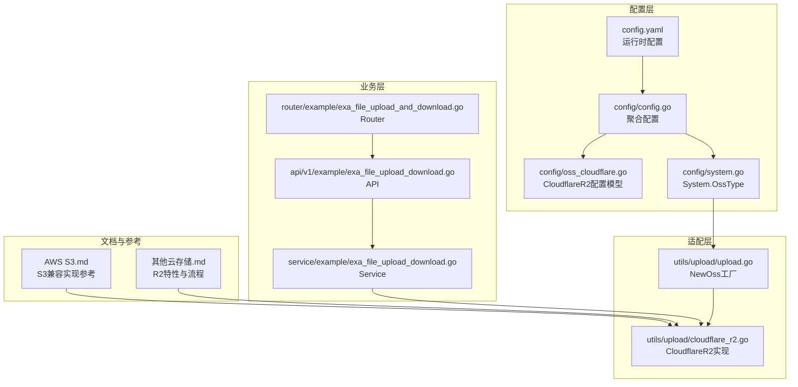
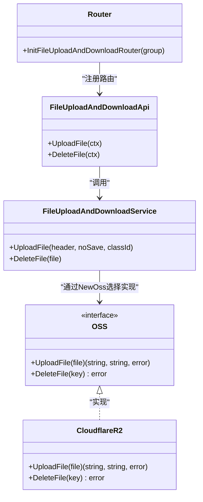
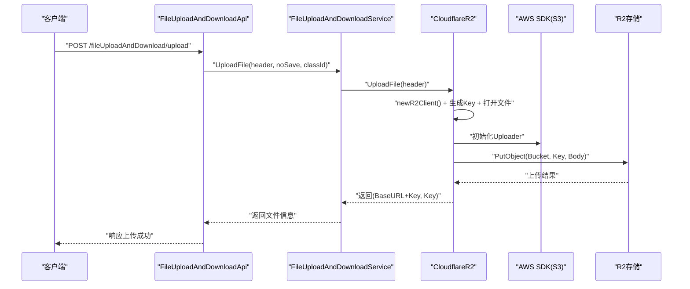
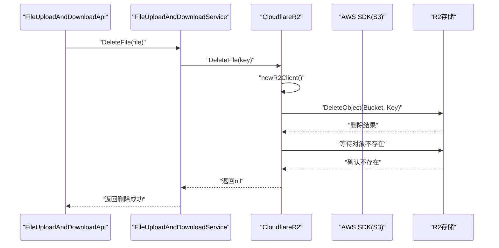
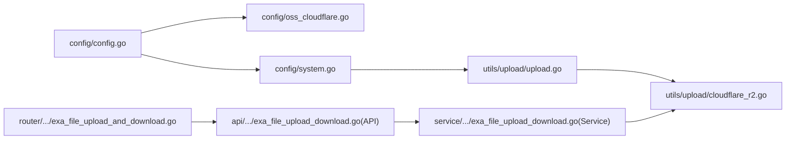

# Cloudflare R2 集成

<cite>
**本文引用的文件**
- [cloudflare_r2.go](file://server/utils/upload/cloudflare_r2.go)
- [oss_cloudflare.go](file://server/config/oss_cloudflare.go)
- [config.go](file://server/config/config.go)
- [system.go](file://server/config/system.go)
- [config.yaml](file://server/config.yaml)
- [upload.go](file://server/utils/upload/upload.go)
- [exa_file_upload_download.go（API）](file://server/api/v1/example/exa_file_upload_download.go)
- [exa_file_upload_download.go（Service）](file://server/service/example/exa_file_upload_download.go)
- [exa_file_upload_and_download.go（Router）](file://server/router/example/exa_file_upload_and_download.go)
- [AWS S3.md](file://repowiki/zh/content/后端系统/文件存储系统/AWS S3.md)
- [其他云存储.md](file://repowiki/zh/content/后端系统/文件存储系统/其他云存储.md)
</cite>

## 目录
1. [简介](#简介)
2. [项目结构](#项目结构)
3. [核心组件](#核心组件)
4. [架构总览](#架构总览)
5. [详细组件分析](#详细组件分析)
6. [依赖关系分析](#依赖关系分析)
7. [性能考虑](#性能考虑)
8. [故障排查指南](#故障排查指南)
9. [结论](#结论)
10. [附录：配置与使用示例](#附录配置与使用示例)

## 简介
本文件面向在 Gin-Vue-Admin 项目中集成 Cloudflare R2 对象存储的开发者，系统性说明以下内容：
- R2 配置项与集成方式：Bucket、BaseURL、Path、AccountID、AccessKeyID、SecretAccessKey 等
- 与 AWS S3 兼容 API 的实现：基于 AWS SDK v2，动态构造 endpoint（AccountID.r2.cloudflarestorage.com）
- 上传流程：单文件直传（PutObject）、Key 组织策略（时间戳_原文件名）
- 删除流程：DeleteObject + Waiter 等待对象不存在，增强幂等性
- 使用示例：文件管理、权限控制、成本优化策略
- 性能优化与故障排查建议

## 项目结构
围绕 Cloudflare R2 的关键文件分布如下：
- 配置模型：server/config/oss_cloudflare.go、server/config/config.go、server/config/system.go
- 存储适配层：server/utils/upload/upload.go、server/utils/upload/cloudflare_r2.go
- 业务接口与路由：server/api/v1/example/exa_file_upload_download.go、server/router/example/exa_file_upload_and_download.go
- 业务服务：server/service/example/exa_file_upload_download.go
- 配置文件：server/config.yaml
- 文档参考：repowiki/zh/content/后端系统/文件存储系统/AWS S3.md、repowiki/zh/content/后端系统/文件存储系统/其他云存储.md

图表来源
- [config.go:21-29](file://server/config/config.go#L21-L29)
- [oss_cloudflare.go:3-10](file://server/config/oss_cloudflare.go#L3-L10)
- [system.go:3-15](file://server/config/system.go#L3-L15)
- [config.yaml:239-247](file://server/config.yaml#L239-L247)
- [upload.go:20-46](file://server/utils/upload/upload.go#L20-L46)
- [cloudflare_r2.go:19-85](file://server/utils/upload/cloudflare_r2.go#L19-L85)
- [exa_file_upload_download.go（API）:25-42](file://server/api/v1/example/exa_file_upload_download.go#L25-L42)
- [exa_file_upload_download.go（Service）:96-120](file://server/service/example/exa_file_upload_download.go#L96-L120)
- [exa_file_upload_and_download.go（Router）:9-22](file://server/router/example/exa_file_upload_and_download.go#L9-L22)
- [AWS S3.md:48-86](file://repowiki/zh/content/后端系统/文件存储系统/AWS S3.md#L48-L86)
- [其他云存储.md:239-273](file://repowiki/zh/content/后端系统/文件存储系统/其他云存储.md#L239-L273)

章节来源
- [config.go:21-29](file://server/config/config.go#L21-L29)
- [oss_cloudflare.go:3-10](file://server/config/oss_cloudflare.go#L3-L10)
- [system.go:3-15](file://server/config/system.go#L3-L15)
- [config.yaml:239-247](file://server/config.yaml#L239-L247)
- [upload.go:20-46](file://server/utils/upload/upload.go#L20-L46)
- [cloudflare_r2.go:19-85](file://server/utils/upload/cloudflare_r2.go#L19-L85)
- [exa_file_upload_download.go（API）:25-42](file://server/api/v1/example/exa_file_upload_download.go#L25-L42)
- [exa_file_upload_download.go（Service）:96-120](file://server/service/example/exa_file_upload_download.go#L96-L120)
- [exa_file_upload_and_download.go（Router）:9-22](file://server/router/example/exa_file_upload_and_download.go#L9-L22)
- [AWS S3.md:48-86](file://repowiki/zh/content/后端系统/文件存储系统/AWS S3.md#L48-L86)
- [其他云存储.md:239-273](file://repowiki/zh/content/后端系统/文件存储系统/其他云存储.md#L239-L273)

## 核心组件
- 配置模型 CloudflareR2：定义 Bucket、BaseURL、Path、AccountID、AccessKeyID、SecretAccessKey 等字段，用于加载与传递 R2 连接参数。
- 工厂 NewOss：根据 System.OssType 返回具体存储实现，当 OssType 为 cloudflare-r2 时返回 CloudflareR2 实例。
- CloudflareR2：封装 R2 客户端创建、上传（PutObject）、删除（DeleteObject）与 URL 组装逻辑。
- 业务 API/Service/Router：提供上传、删除、列表等接口，并通过 Service 调用 OSS 接口完成实际操作。

章节来源
- [oss_cloudflare.go:3-10](file://server/config/oss_cloudflare.go#L3-L10)
- [system.go:3-15](file://server/config/system.go#L3-L15)
- [upload.go:20-46](file://server/utils/upload/upload.go#L20-L46)
- [cloudflare_r2.go:19-85](file://server/utils/upload/cloudflare_r2.go#L19-L85)
- [exa_file_upload_download.go（API）:25-42](file://server/api/v1/example/exa_file_upload_download.go#L25-L42)
- [exa_file_upload_download.go（Service）:96-120](file://server/service/example/exa_file_upload_download.go#L96-L120)
- [exa_file_upload_and_download.go（Router）:9-22](file://server/router/example/exa_file_upload_and_download.go#L9-L22)

## 架构总览
下图展示从请求到 R2 的调用链路与关键对象关系：

图表来源
- [upload.go:12-15](file://server/utils/upload/upload.go#L12-L15)
- [cloudflare_r2.go:19-85](file://server/utils/upload/cloudflare_r2.go#L19-L85)
- [exa_file_upload_download.go（API）:14-82](file://server/api/v1/example/exa_file_upload_download.go#L14-L82)
- [exa_file_upload_download.go（Service）:43-120](file://server/service/example/exa_file_upload_download.go#L43-L120)
- [exa_file_upload_and_download.go（Router）:7-22](file://server/router/example/exa_file_upload_and_download.go#L7-L22)

## 详细组件分析

### 配置模型与加载
- 配置入口位于 Server 结构体，其中包含 CloudflareR2 字段，用于映射 YAML/JSON 配置。
- CloudflareR2 字段包含：
  - bucket、base-url、path、account-id、access-key-id、secret-access-key
- System.OssType 决定运行时选择哪种 OSS 实现（cloudflare-r2 对应 CloudflareR2）。

章节来源
- [config.go:21-29](file://server/config/config.go#L21-L29)
- [oss_cloudflare.go:3-10](file://server/config/oss_cloudflare.go#L3-L10)
- [system.go:3-15](file://server/config/system.go#L3-L15)
- [config.yaml:239-247](file://server/config.yaml#L239-L247)

### 客户端创建与 Endpoint 处理
- newR2Client 依据 CloudflareR2 配置构建 AWS SDK v2 客户端：
  - Region 设置为 "auto"
  - 凭证使用 StaticCredentialsProvider（AccessKeyID/SecretAccessKey）
  - BaseEndpoint 动态构造为 https://{AccountID}.r2.cloudflarestorage.com
- 该实现基于 AWS SDK v2，完全兼容 S3 API，无需额外 Endpoint/SSL 处理。

章节来源
- [cloudflare_r2.go:70-85](file://server/utils/upload/cloudflare_r2.go#L70-L85)

### 上传流程（单文件 PutObject）
- 生成文件 Key：时间戳 + 原始文件名，Key 前缀为 Path
- 打开 multipart 文件头，构造 PutObjectInput，设置 Bucket、Key、Body
- 使用 Uploader 上传，成功后返回 BaseURL + Key 作为可访问 URL 与内部 Key
- 错误处理：对 Open 与 Upload 的异常进行日志记录与错误返回

图表来源
- [exa_file_upload_download.go（API）:25-42](file://server/api/v1/example/exa_file_upload_download.go#L25-L42)
- [exa_file_upload_download.go（Service）:96-120](file://server/service/example/exa_file_upload_download.go#L96-L120)
- [cloudflare_r2.go:21-45](file://server/utils/upload/cloudflare_r2.go#L21-L45)
- [cloudflare_r2.go:70-85](file://server/utils/upload/cloudflare_r2.go#L70-L85)

章节来源
- [cloudflare_r2.go:21-45](file://server/utils/upload/cloudflare_r2.go#L21-L45)
- [exa_file_upload_download.go（Service）:96-120](file://server/service/example/exa_file_upload_download.go#L96-L120)

### 删除流程（DeleteObject + Waiter）
- 组合 Key（Path + key），调用 DeleteObject
- 使用 ObjectNotExistsWaiter 等待对象不存在，超时约 30 秒
- 成功返回 nil，失败记录日志并返回错误

图表来源
- [exa_file_upload_download.go（Service）:43-55](file://server/service/example/exa_file_upload_download.go#L43-L55)
- [cloudflare_r2.go:47-68](file://server/utils/upload/cloudflare_r2.go#L47-L68)
- [cloudflare_r2.go:70-85](file://server/utils/upload/cloudflare_r2.go#L70-L85)

章节来源
- [cloudflare_r2.go:47-68](file://server/utils/upload/cloudflare_r2.go#L47-L68)
- [exa_file_upload_download.go（Service）:43-55](file://server/service/example/exa_file_upload_download.go#L43-L55)

### 与 AWS S3 SDK 的兼容性处理
- 基于 AWS SDK v2，完全兼容 S3 API
- 通过 BaseEndpoint 动态指向 R2 服务端点，无需额外兼容层
- 上传使用分块上传器（Uploader），删除使用 Waiter 等待对象不存在
- 与 MinIO 的兼容实现思路一致，但 R2 使用 Cloudflare 提供的专用 endpoint

章节来源
- [cloudflare_r2.go:70-85](file://server/utils/upload/cloudflare_r2.go#L70-L85)
- [AWS S3.md:166-172](file://repowiki/zh/content/后端系统/文件存储系统/AWS S3.md#L166-L172)
- [其他云存储.md:239-245](file://repowiki/zh/content/后端系统/文件存储系统/其他云存储.md#L239-L245)

### R2 的特殊配置
- AccountID：Cloudflare 账户标识，用于动态构造 endpoint
- AccessKeyID/SecretAccessKey：R2 访问凭据，使用 StaticCredentialsProvider
- Bucket：R2 存储桶名称
- BaseURL：对象访问域名，与 Path 组合形成稳定访问路径
- Path：对象 Key 前缀，用于组织文件结构

章节来源
- [oss_cloudflare.go:3-10](file://server/config/oss_cloudflare.go#L3-L10)
- [config.yaml:239-247](file://server/config.yaml#L239-L247)

## 依赖关系分析
- 配置层：config/config.go 聚合各存储配置；config/oss_cloudflare.go 定义 CloudflareR2 字段；config/system.go 提供 OssType 选择
- 适配层：utils/upload/upload.go 根据 OssType 返回 CloudflareR2 实例；cloudflare_r2.go 实现上传/删除
- 业务层：api/service/router 将请求转发到 Service，Service 再调用 OSS 接口

图表来源
- [config.go:21-29](file://server/config/config.go#L21-L29)
- [oss_cloudflare.go:3-10](file://server/config/oss_cloudflare.go#L3-L10)
- [system.go:3-15](file://server/config/system.go#L3-L15)
- [upload.go:20-46](file://server/utils/upload/upload.go#L20-L46)
- [cloudflare_r2.go:19-85](file://server/utils/upload/cloudflare_r2.go#L19-L85)
- [exa_file_upload_download.go（API）:25-42](file://server/api/v1/example/exa_file_upload_download.go#L25-L42)
- [exa_file_upload_download.go（Service）:96-120](file://server/service/example/exa_file_upload_download.go#L96-L120)
- [exa_file_upload_and_download.go（Router）:9-22](file://server/router/example/exa_file_upload_and_download.go#L9-L22)

章节来源
- [config.go:21-29](file://server/config/config.go#L21-L29)
- [oss_cloudflare.go:3-10](file://server/config/oss_cloudflare.go#L3-L10)
- [system.go:3-15](file://server/config/system.go#L3-L15)
- [upload.go:20-46](file://server/utils/upload/upload.go#L20-L46)
- [cloudflare_r2.go:19-85](file://server/utils/upload/cloudflare_r2.go#L19-L85)
- [exa_file_upload_download.go（API）:25-42](file://server/api/v1/example/exa_file_upload_download.go#L25-L42)
- [exa_file_upload_download.go（Service）:96-120](file://server/service/example/exa_file_upload_download.go#L96-L120)
- [exa_file_upload_and_download.go（Router）:9-22](file://server/router/example/exa_file_upload_and_download.go#L9-L22)

## 性能考虑
- 当前实现为单文件 PutObject，适合中小文件；大文件建议引入 Multipart 上传与并发分片
- 并发优化要点（通用建议）：
  - 分片大小：根据带宽与稳定性选择 5~50MB
  - 并发数：CPU 与网络上限内动态调整，避免过度并发导致抖动
  - 重试与断点续传：结合 ETag 校验与服务端状态管理
- R2 的优势特性：
  - 全球边缘网络：就近访问，降低延迟
  - 低延迟访问：基于 Cloudflare 的全球节点
  - 成本效益：相比传统对象存储，具备更好的性价比
- 与 Cloudflare Workers 配合：
  - 实现边缘缓存与鉴权
  - 通过 Workers 缓存热点数据，减少回源压力

## 故障排查指南
- 无法连接 R2
  - 检查 AccountID 是否正确，确认 endpoint 动态构造格式
  - 确认 AccessKeyID/SecretAccessKey 权限范围与有效期
  - 验证 Bucket 存在且可写
- 上传失败
  - 查看服务端日志中的 Open/Upload 错误
  - 确认文件打开与上传过程的异常信息
- 删除失败
  - 观察 Waiter 超时（约 30 秒），确认对象确实被删除
  - 检查 Key 组织格式（Path + key）是否正确
- URL 不可达
  - 检查 BaseURL 与 Path 组合是否正确
  - 确认对象 ACL 与 Bucket Policy 允许访问
- 权限控制与安全
  - 建议启用访问日志与审计
  - 使用最小权限原则配置 AccessKeyID/SecretAccessKey
  - 通过 R2 的访问控制策略限制来源 IP/Referer

章节来源
- [cloudflare_r2.go:27-42](file://server/utils/upload/cloudflare_r2.go#L27-L42)
- [cloudflare_r2.go:56-67](file://server/utils/upload/cloudflare_r2.go#L56-L67)
- [AWS S3.md:299-311](file://repowiki/zh/content/后端系统/文件存储系统/AWS S3.md#L299-L311)

## 结论
- 本项目已完整实现基于 AWS SDK v2 的 R2 单文件上传与删除，并通过配置中心统一管理密钥、桶、账户 ID 与访问域名
- 未包含预签名 URL 与 Multipart 并发上传，建议按需扩展
- 断点续传为本地分片拼接，非 R2 分段；如需 R2 端分片，需扩展 CloudflareR2 实现
- R2 的全球边缘网络、低延迟访问与成本效益使其特别适合需要全球分发的业务场景

## 附录：配置与使用示例

### 配置项说明
- base-url：对象访问域名
- bucket：R2 存储桶名称
- path：对象 Key 前缀
- account-id：Cloudflare 账户标识
- access-key-id / secret-access-key：访问凭据

章节来源
- [oss_cloudflare.go:3-10](file://server/config/oss_cloudflare.go#L3-L10)
- [config.yaml:239-247](file://server/config.yaml#L239-L247)

### 集成步骤
- 在配置文件中设置 System.OssType 为 cloudflare-r2
- 填写 CloudflareR2 字段：bucket、account-id、access-key-id、secret-access-key、base-url、path 等
- 启动后，上传接口会自动使用 CloudflareR2 实现

章节来源
- [system.go:3-15](file://server/config/system.go#L3-L15)
- [config.go:21-29](file://server/config/config.go#L21-L29)
- [oss_cloudflare.go:3-10](file://server/config/oss_cloudflare.go#L3-L10)
- [config.yaml:239-247](file://server/config.yaml#L239-L247)

### 使用示例（API）
- 上传文件：POST /fileUploadAndDownload/upload
- 删除文件：POST /fileUploadAndDownload/deleteFile
- 获取列表：POST /fileUploadAndDownload/getFileList
- 编辑文件名：POST /fileUploadAndDownload/editFileName

章节来源
- [exa_file_upload_download.go（API）:25-135](file://server/api/v1/example/exa_file_upload_download.go#L25-L135)
- [exa_file_upload_and_download.go（Router）:9-22](file://server/router/example/exa_file_upload_and_download.go#L9-L22)

### 权限控制与成本优化建议
- 权限控制
  - 使用 IAM 用户/角色最小权限原则，限制 Bucket 与 Key 前缀范围
  - 通过 R2 访问控制策略限制来源 IP/Referer
- 成本优化
  - 启用生命周期规则：将旧版本或冷数据迁移到更低成本存储
  - 使用版本控制时定期清理不再需要的历史版本
  - 通过 Path 前缀与前缀标签进行资源分组与计费拆分
- 性能优化
  - 结合 Cloudflare Workers 实现边缘缓存与鉴权
  - 启用访问日志与审计，监控访问模式
  - 根据业务特点选择合适的分片大小与并发数