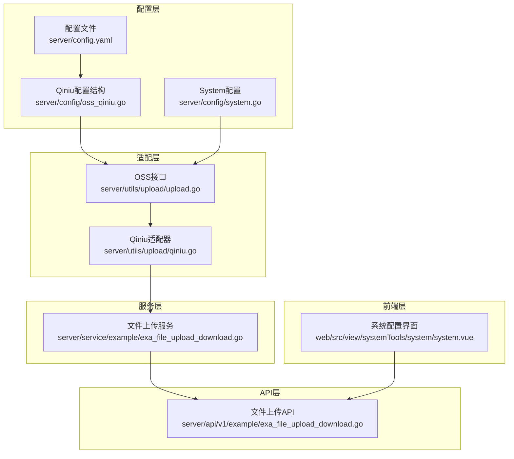
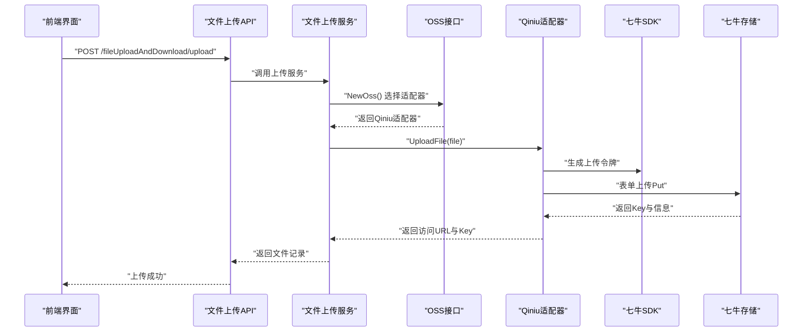
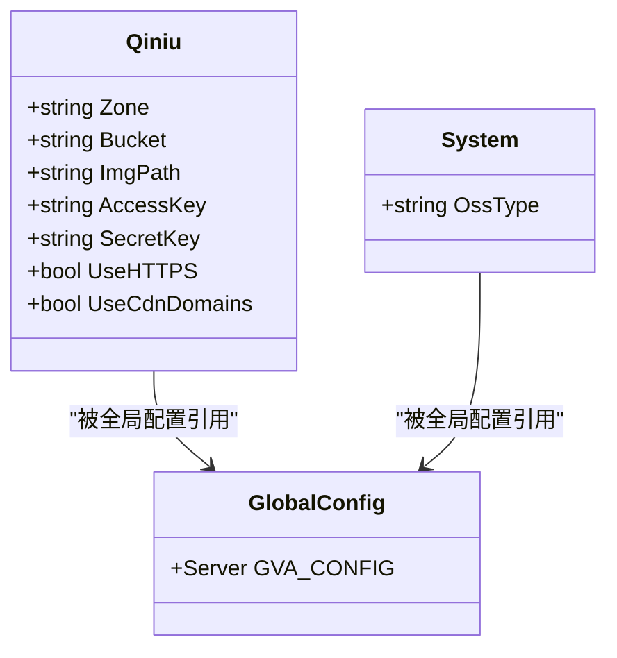
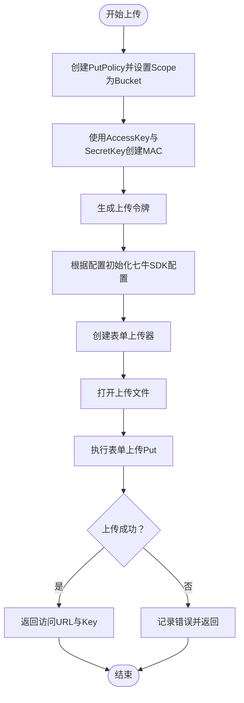
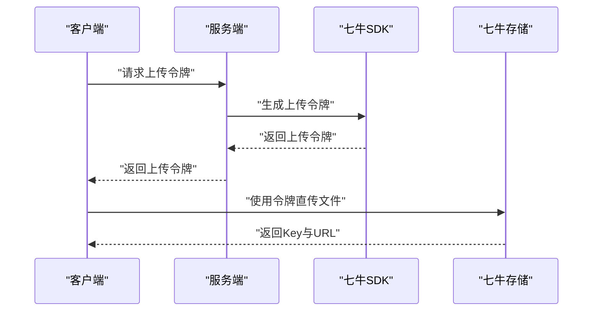
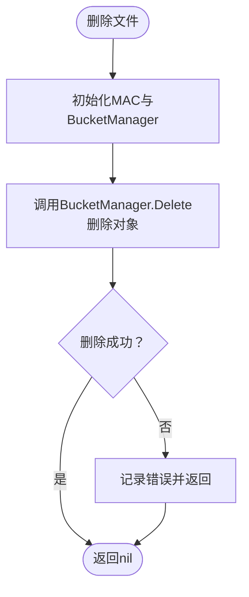
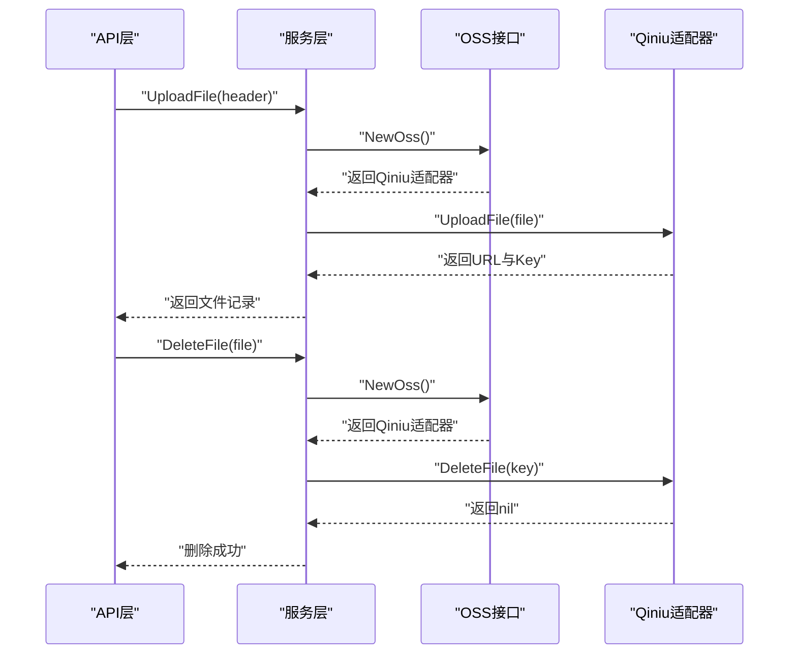
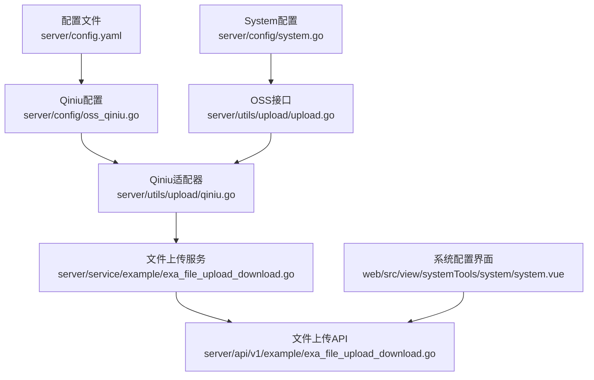

# 七牛云存储集成

<cite>
**本文引用的文件**
- [server/config/oss_qiniu.go](file://server/config/oss_qiniu.go)
- [server/config/system.go](file://server/config/system.go)
- [server/config.yaml](file://server/config.yaml)
- [server/utils/upload/upload.go](file://server/utils/upload/upload.go)
- [server/utils/upload/qiniu.go](file://server/utils/upload/qiniu.go)
- [server/service/example/exa_file_upload_download.go](file://server/service/example/exa_file_upload_download.go)
- [server/api/v1/example/exa_file_upload_download.go](file://server/api/v1/example/exa_file_upload_download.go)
- [server/global/global.go](file://server/global/global.go)
- [web/src/view/systemTools/system/system.vue](file://web/src/view/systemTools/system/system.vue)
- [repowiki/zh/content/后端系统/文件存储系统/其他云存储.md](file://repowiki/zh/content/后端系统/文件存储系统/其他云存储.md)
- [repowiki/zh/content/后端系统/文件存储系统/存储配置管理.md](file://repowiki/zh/content/后端系统/文件存储系统/存储配置管理.md)
</cite>

## 目录
1. [简介](#简介)
2. [项目结构](#项目结构)
3. [核心组件](#核心组件)
4. [架构总览](#架构总览)
5. [详细组件分析](#详细组件分析)
6. [依赖分析](#依赖分析)
7. [性能考虑](#性能考虑)
8. [故障排查指南](#故障排查指南)
9. [结论](#结论)
10. [附录](#附录)

## 简介
本文件详细介绍 Gin-Vue-Admin 项目中七牛云存储（Qiniu）的集成实现。内容涵盖认证机制、客户端配置、上传策略设置、文件上传流程（直传、回调、鉴权）、文件管理功能（删除、复制、移动、获取下载链接）、七牛云特有能力（图片处理、音视频转码、数据处理）、配置参数说明、错误处理机制、重试策略、性能优化建议与安全配置指南，并提供实际使用示例与最佳实践。

## 项目结构
七牛云集成采用统一的 OSS 接口抽象，通过配置切换不同存储后端。核心结构如下：
- 配置层：定义七牛云配置结构与系统配置中的 OSS 类型字段
- 适配层：实现 OSS 接口的具体适配器（七牛云、本地、阿里云 OSS、腾讯 COS、华为 OBS、AWS S3、Cloudflare R2、MinIO）
- 服务层：业务服务调用 OSS 适配器完成文件上传与删除
- API 层：对外暴露文件上传与删除接口
- 前端层：系统配置界面选择 OSS 类型，上传组件通过统一接口调用

**图表来源**
- [server/config/oss_qiniu.go:3-11](file://server/config/oss_qiniu.go#L3-L11)
- [server/config/system.go:3-15](file://server/config/system.go#L3-L15)
- [server/config.yaml:189-197](file://server/config.yaml#L189-L197)
- [server/utils/upload/upload.go:20-46](file://server/utils/upload/upload.go#L20-L46)
- [server/utils/upload/qiniu.go:16-96](file://server/utils/upload/qiniu.go#L16-L96)
- [server/service/example/exa_file_upload_download.go:96-120](file://server/service/example/exa_file_upload_download.go#L96-L120)
- [server/api/v1/example/exa_file_upload_download.go:25-42](file://server/api/v1/example/exa_file_upload_download.go#L25-L42)
- [web/src/view/systemTools/system/system.vue:22-31](file://web/src/view/systemTools/system/system.vue#L22-L31)

**章节来源**
- [server/config/oss_qiniu.go:3-11](file://server/config/oss_qiniu.go#L3-L11)
- [server/config/system.go:3-15](file://server/config/system.go#L3-L15)
- [server/config.yaml:189-197](file://server/config.yaml#L189-L197)
- [server/utils/upload/upload.go:20-46](file://server/utils/upload/upload.go#L20-L46)
- [server/utils/upload/qiniu.go:16-96](file://server/utils/upload/qiniu.go#L16-L96)
- [server/service/example/exa_file_upload_download.go:96-120](file://server/service/example/exa_file_upload_download.go#L96-L120)
- [server/api/v1/example/exa_file_upload_download.go:25-42](file://server/api/v1/example/exa_file_upload_download.go#L25-L42)
- [web/src/view/systemTools/system/system.vue:22-31](file://web/src/view/systemTools/system/system.vue#L22-L31)

## 核心组件
- Qiniu 配置结构：包含存储区域、空间名称、CDN 加速域名、访问密钥、密钥 SK、是否使用 HTTPS、是否使用 CDN 域名
- OSS 接口：统一的上传与删除接口，通过 NewOss 工厂方法按系统配置选择具体适配器
- Qiniu 适配器：实现上传与删除逻辑，内部使用七牛 SDK 生成上传令牌、表单上传、删除对象
- 文件上传服务：调用 OSS 适配器完成上传，生成文件记录（URL、Key、标签等）
- 文件上传 API：接收 multipart/form-data，调用服务层完成上传
- 前端系统配置：提供 OSS 类型选择，支持切换到七牛云

**章节来源**
- [server/config/oss_qiniu.go:3-11](file://server/config/oss_qiniu.go#L3-L11)
- [server/utils/upload/upload.go:12-15](file://server/utils/upload/upload.go#L12-L15)
- [server/utils/upload/upload.go:20-46](file://server/utils/upload/upload.go#L20-L46)
- [server/utils/upload/qiniu.go:27-50](file://server/utils/upload/qiniu.go#L27-L50)
- [server/utils/upload/qiniu.go:61-70](file://server/utils/upload/qiniu.go#L61-L70)
- [server/service/example/exa_file_upload_download.go:96-120](file://server/service/example/exa_file_upload_download.go#L96-L120)
- [server/api/v1/example/exa_file_upload_download.go:25-42](file://server/api/v1/example/exa_file_upload_download.go#L25-L42)
- [web/src/view/systemTools/system/system.vue:22-31](file://web/src/view/systemTools/system/system.vue#L22-L31)

## 架构总览
七牛云集成遵循“配置驱动 + 接口抽象 + 适配器模式”的架构设计。系统通过配置文件选择 OSS 类型，运行时根据配置实例化对应适配器，业务层通过统一接口调用，实现与具体存储后端解耦。

**图表来源**
- [server/api/v1/example/exa_file_upload_download.go:25-42](file://server/api/v1/example/exa_file_upload_download.go#L25-L42)
- [server/service/example/exa_file_upload_download.go:96-120](file://server/service/example/exa_file_upload_download.go#L96-L120)
- [server/utils/upload/upload.go:20-46](file://server/utils/upload/upload.go#L20-L46)
- [server/utils/upload/qiniu.go:27-50](file://server/utils/upload/qiniu.go#L27-L50)

## 详细组件分析

### 配置与认证机制
- 配置结构：Qiniu 结构体包含 zone、bucket、img-path、access-key、secret-key、use-https、use-cdn-domains 等字段
- 系统配置：System 结构体包含 oss-type 字段，用于选择 OSS 类型
- 配置文件：config.yaml 中提供 qiniu 段落的配置示例
- 认证机制：上传时使用 AccessKey 与 SecretKey 生成上传令牌（PutToken），删除时同样使用 MAC 进行鉴权

**图表来源**
- [server/config/oss_qiniu.go:3-11](file://server/config/oss_qiniu.go#L3-L11)
- [server/config/system.go:3-15](file://server/config/system.go#L3-L15)
- [server/config.yaml:189-197](file://server/config.yaml#L189-L197)
- [server/global/global.go:31](file://server/global/global.go#L31)

**章节来源**
- [server/config/oss_qiniu.go:3-11](file://server/config/oss_qiniu.go#L3-L11)
- [server/config/system.go:3-15](file://server/config/system.go#L3-L15)
- [server/config.yaml:189-197](file://server/config.yaml#L189-L197)
- [server/global/global.go:31](file://server/global/global.go#L31)

### 客户端配置与上传策略
- 上传策略：使用 PutPolicy 指定 Scope 为 Bucket，生成上传令牌
- 上传配置：根据配置选择 Zone（华东、华北、华南、北美、新加坡），支持 HTTPS 与 CDN 域名
- 文件命名：使用时间戳 + 原始文件名生成唯一 Key
- 上传额外参数：可在 PutExtra 中设置 x:name 等自定义参数

**图表来源**
- [server/utils/upload/qiniu.go:27-50](file://server/utils/upload/qiniu.go#L27-L50)
- [server/utils/upload/qiniu.go:78-96](file://server/utils/upload/qiniu.go#L78-L96)

**章节来源**
- [server/utils/upload/qiniu.go:27-50](file://server/utils/upload/qiniu.go#L27-L50)
- [server/utils/upload/qiniu.go:78-96](file://server/utils/upload/qiniu.go#L78-L96)

### 文件上传流程（直传、回调、鉴权）
- 直传流程：前端选择文件 → 服务端生成上传令牌 → 前端直接向七牛上传 → 上传完成后返回 Key 与访问 URL
- 回调机制：当前实现未展示服务端回调处理，但可通过七牛服务端回调钩子扩展
- 鉴权策略：使用 MAC 进行签名，上传令牌具有有效期，避免密钥泄露风险

**图表来源**
- [server/utils/upload/qiniu.go:27-50](file://server/utils/upload/qiniu.go#L27-L50)

**章节来源**
- [server/utils/upload/qiniu.go:27-50](file://server/utils/upload/qiniu.go#L27-L50)

### 文件管理功能
- 删除文件：通过 BucketManager 删除指定 Key，删除成功返回空，失败记录日志并返回错误
- 复制/移动：当前实现未提供复制/移动接口，可通过七牛 SDK 的复制/移动 API 扩展
- 获取下载链接：通过 ImgPath 与 Key 拼接得到访问 URL

**图表来源**
- [server/utils/upload/qiniu.go:61-70](file://server/utils/upload/qiniu.go#L61-L70)

**章节来源**
- [server/utils/upload/qiniu.go:61-70](file://server/utils/upload/qiniu.go#L61-L70)

### 七牛云特有能力
- 图片处理：可通过七牛云提供的图片处理参数对图片进行缩放、裁剪、水印、格式转换等
- 音视频转码：利用七牛云的数据处理能力进行音视频转码、截图、拼接等
- 数据处理：支持对对象进行数据处理与持久化，适用于批量处理场景

注：本项目未直接展示这些特有能力的实现，但通过七牛 SDK 可以扩展实现。

**章节来源**
- [repowiki/zh/content/后端系统/文件存储系统/其他云存储.md:150-165](file://repowiki/zh/content/后端系统/文件存储系统/其他云存储.md#L150-L165)

### API 与服务层实现
- API 层：接收 multipart/form-data，调用服务层完成上传
- 服务层：根据 OSS 类型选择适配器，调用 UploadFile 完成上传，生成文件记录并保存到数据库
- 删除流程：服务层先调用 OSS 删除，再删除数据库记录

**图表来源**
- [server/api/v1/example/exa_file_upload_download.go:25-42](file://server/api/v1/example/exa_file_upload_download.go#L25-L42)
- [server/service/example/exa_file_upload_download.go:96-120](file://server/service/example/exa_file_upload_download.go#L96-L120)
- [server/service/example/exa_file_upload_download.go:43-55](file://server/service/example/exa_file_upload_download.go#L43-L55)
- [server/utils/upload/upload.go:20-46](file://server/utils/upload/upload.go#L20-L46)

**章节来源**
- [server/api/v1/example/exa_file_upload_download.go:25-42](file://server/api/v1/example/exa_file_upload_download.go#L25-L42)
- [server/service/example/exa_file_upload_download.go:96-120](file://server/service/example/exa_file_upload_download.go#L96-L120)
- [server/service/example/exa_file_upload_download.go:43-55](file://server/service/example/exa_file_upload_download.go#L43-L55)
- [server/utils/upload/upload.go:20-46](file://server/utils/upload/upload.go#L20-L46)

## 依赖分析
- 配置依赖：Qiniu 配置结构依赖全局配置；OSS 适配器依赖配置进行初始化
- 适配器依赖：Qiniu 适配器依赖七牛 SDK；OSS 接口依赖工厂方法按配置选择适配器
- 服务依赖：服务层依赖 OSS 接口；API 层依赖服务层
- 前端依赖：系统配置界面依赖 OSS 类型枚举；上传组件依赖统一接口

**图表来源**
- [server/config/oss_qiniu.go:3-11](file://server/config/oss_qiniu.go#L3-L11)
- [server/config/system.go:3-15](file://server/config/system.go#L3-L15)
- [server/config.yaml:189-197](file://server/config.yaml#L189-L197)
- [server/utils/upload/upload.go:20-46](file://server/utils/upload/upload.go#L20-L46)
- [server/utils/upload/qiniu.go:16-96](file://server/utils/upload/qiniu.go#L16-L96)
- [server/service/example/exa_file_upload_download.go:96-120](file://server/service/example/exa_file_upload_download.go#L96-L120)
- [server/api/v1/example/exa_file_upload_download.go:25-42](file://server/api/v1/example/exa_file_upload_download.go#L25-L42)
- [web/src/view/systemTools/system/system.vue:22-31](file://web/src/view/systemTools/system/system.vue#L22-L31)

**章节来源**
- [server/config/oss_qiniu.go:3-11](file://server/config/oss_qiniu.go#L3-L11)
- [server/config/system.go:3-15](file://server/config/system.go#L3-L15)
- [server/config.yaml:189-197](file://server/config.yaml#L189-L197)
- [server/utils/upload/upload.go:20-46](file://server/utils/upload/upload.go#L20-L46)
- [server/utils/upload/qiniu.go:16-96](file://server/utils/upload/qiniu.go#L16-L96)
- [server/service/example/exa_file_upload_download.go:96-120](file://server/service/example/exa_file_upload_download.go#L96-L120)
- [server/api/v1/example/exa_file_upload_download.go:25-42](file://server/api/v1/example/exa_file_upload_download.go#L25-L42)
- [web/src/view/systemTools/system/system.vue:22-31](file://web/src/view/systemTools/system/system.vue#L22-L31)

## 性能考虑
- CDN 与边缘：启用 use-cdn-domains 与 ImgPath 可显著提升访问速度
- HTTPS：启用 use-https 提升传输安全性
- Zone 选择：根据业务主要区域选择合适的 Zone，减少网络延迟
- 文件命名：使用时间戳 + 原始文件名生成唯一 Key，避免冲突
- 超时与并发：上传超时与并发控制可根据业务场景调整

**章节来源**
- [repowiki/zh/content/后端系统/文件存储系统/其他云存储.md:411-422](file://repowiki/zh/content/后端系统/文件存储系统/其他云存储.md#L411-L422)
- [server/utils/upload/qiniu.go:78-96](file://server/utils/upload/qiniu.go#L78-L96)

## 故障排查指南
- 初始化失败：检查配置项是否正确，特别是 AccessKey、SecretKey、Bucket、Zone
- 上传失败：检查 Bucket 是否存在、权限策略、网络连通性；查看日志中的错误信息
- 删除异常：确认 Key 正确且权限足够；查看日志中的错误信息
- 日志定位：所有适配器在关键步骤都会记录错误日志，便于快速定位问题

**章节来源**
- [repowiki/zh/content/后端系统/文件存储系统/其他云存储.md:423-440](file://repowiki/zh/content/后端系统/文件存储系统/other_cloud_storage.md#L423-L440)
- [server/utils/upload/qiniu.go:45-48](file://server/utils/upload/qiniu.go#L45-L48)
- [server/utils/upload/qiniu.go:65-68](file://server/utils/upload/qiniu.go#L65-L68)

## 结论
七牛云存储集成在 Gin-Vue-Admin 中采用配置驱动与接口抽象的设计，实现了与具体存储后端的解耦。通过统一的 OSS 接口，系统能够灵活切换不同的存储提供商。当前实现涵盖了上传与删除的核心功能，并提供了 CDN、HTTPS、Zone 选择等性能与安全优化手段。未来可进一步扩展回调机制、复制/移动、图片/音视频处理等高级能力。

## 附录

### 配置参数说明
- zone：存储区域（ZoneHuadong、ZoneHuabei、ZoneHuanan、ZoneBeimei、ZoneXinjiapo）
- bucket：空间名称
- img-path：CDN 加速域名
- access-key：访问密钥 AK
- secret-key：密钥 SK
- use-https：是否使用 HTTPS
- use-cdn-domains：上传是否使用 CDN 上传加速
- oss-type：OSS 类型（local、qiniu、tencent-cos、aliyun-oss、huawei-obs、aws-s3、cloudflare-r2、minio）

**章节来源**
- [server/config/oss_qiniu.go:3-11](file://server/config/oss_qiniu.go#L3-L11)
- [server/config/system.go:3-15](file://server/config/system.go#L3-L15)
- [server/config.yaml:189-197](file://server/config.yaml#L189-L197)
- [repowiki/zh/content/后端系统/文件存储系统/存储配置管理.md:182-191](file://repowiki/zh/content/后端系统/文件存储系统/存储配置管理.md#L182-L191)

### 错误处理机制
- 上传失败：捕获 formUploader.Put 的错误，记录日志并返回错误信息
- 删除失败：捕获 BucketManager.Delete 的错误，记录日志并返回错误信息
- 初始化失败：MinIO 初始化失败时记录警告并 panic，防止不安全使用

**章节来源**
- [server/utils/upload/qiniu.go:45-48](file://server/utils/upload/qiniu.go#L45-L48)
- [server/utils/upload/qiniu.go:65-68](file://server/utils/upload/qiniu.go#L65-L68)
- [server/utils/upload/upload.go:37-42](file://server/utils/upload/upload.go#L37-L42)

### 重试策略与最佳实践
- 重试策略：当前实现未内置重试机制，可在业务层根据需要增加指数退避重试
- 最佳实践：开启 HTTPS 与 CDN 加速；上传前生成带有效期的上传令牌；限制文件类型与大小；合理设置 Zone 与 CDN 参数

**章节来源**
- [repowiki/zh/content/后端系统/文件存储系统/其他云存储.md:159-165](file://repowiki/zh/content/后端系统/文件存储系统/其他云存储.md#L159-L165)

### 安全配置指南
- 密钥管理：AccessKey 与 SecretKey 不应硬编码在代码中，建议通过环境变量或配置中心管理
- 令牌有效期：上传令牌应设置合理的过期时间，避免长期有效的令牌泄露风险
- CDN 与 HTTPS：启用 HTTPS 与 CDN 可提升传输安全与访问性能
- 权限控制：确保 Bucket 的权限策略最小化，仅授予必要的操作权限

**章节来源**
- [repowiki/zh/content/后端系统/文件存储系统/其他云存储.md:159-165](file://repowiki/zh/content/后端系统/文件存储系统/其他云存储.md#L159-L165)

### 实际使用示例与流程
- 前端配置：在系统配置界面选择 OSS 类型为“七牛”，填写相关配置项
- 文件上传：调用 /fileUploadAndDownload/upload 接口，服务层通过 OSS 接口调用 Qiniu 适配器完成上传
- 文件删除：调用 /fileUploadAndDownload/deleteFile 接口，服务层调用 Qiniu 适配器删除文件

**章节来源**
- [web/src/view/systemTools/system/system.vue:22-31](file://web/src/view/systemTools/system/system.vue#L22-L31)
- [server/api/v1/example/exa_file_upload_download.go:25-42](file://server/api/v1/example/exa_file_upload_download.go#L25-L42)
- [server/service/example/exa_file_upload_download.go:96-120](file://server/service/example/exa_file_upload_download.go#L96-L120)