# 云存储集成

<cite>
**本文引用的文件**
- [server/config/disk.go](file://server/config/disk.go)
- [server/config/oss_aws.go](file://server/config/oss_aws.go)
- [server/config/oss_aliyun.go](file://server/config/oss_aliyun.go)
- [server/config/oss_tencent.go](file://server/config/oss_tencent.go)
- [server/config/oss_qiniu.go](file://server/config/oss_qiniu.go)
- [server/config/oss_huawei.go](file://server/config/oss_huawei.go)
- [server/config/oss_cloudflare.go](file://server/config/oss_cloudflare.go)
- [server/config/oss_minio.go](file://server/config/oss_minio.go)
- [server/utils/upload/aws_s3.go](file://server/utils/upload/aws_s3.go)
- [server/utils/upload/aliyun_oss.go](file://server/utils/upload/aliyun_oss.go)
- [server/utils/upload/tencent_cos.go](file://server/utils/upload/tencent_cos.go)
- [server/utils/upload/qiniu.go](file://server/utils/upload/qiniu.go)
- [server/utils/upload/obs.go](file://server/utils/upload/obs.go)
- [server/utils/upload/cloudflare_r2.go](file://server/utils/upload/cloudflare_r2.go)
- [server/utils/upload/minio_oss.go](file://server/utils/upload/minio_oss.go)
- [server/utils/upload/local.go](file://server/utils/upload/local.go)
</cite>

## 目录
1. [简介](#简介)
2. [项目结构](#项目结构)
3. [核心组件](#核心组件)
4. [架构总览](#架构总览)
5. [详细组件分析](#详细组件分析)
6. [依赖分析](#依赖分析)
7. [性能考量](#性能考量)
8. [故障排查指南](#故障排查指南)
9. [结论](#结论)
10. [附录](#附录)

## 简介
本文件面向云存储集成场景，系统梳理并对比多款主流云存储服务在本项目中的配置与实现方式，涵盖 AWS S3、阿里云 OSS、腾讯云 COS、七牛云存储、华为 OBS、Cloudflare R2、MinIO 以及本地存储。内容包括认证机制、连接配置、API 调用封装、错误处理策略、通用功能（上传、删除、访问 URL 生成）、高级特性（预签名/CDN/跨域/版本/生命周期建议）、成本优化与安全考虑，并提供配置示例与最佳实践指引。

## 项目结构
围绕“配置 + 实现”的分层组织：
- 配置层：位于 server/config，定义各云厂商的配置结构体，用于从配置文件加载参数。
- 实现层：位于 server/utils/upload，按云厂商拆分具体上传/删除实现，统一对外暴露 UploadFile/DeleteFile 接口。

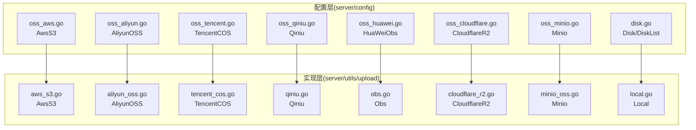

图表来源
- [server/config/oss_aws.go:1-14](file://server/config/oss_aws.go#L1-L14)
- [server/config/oss_aliyun.go:1-11](file://server/config/oss_aliyun.go#L1-L11)
- [server/config/oss_tencent.go:1-11](file://server/config/oss_tencent.go#L1-L11)
- [server/config/oss_qiniu.go:1-12](file://server/config/oss_qiniu.go#L1-L12)
- [server/config/oss_huawei.go:1-10](file://server/config/oss_huawei.go#L1-L10)
- [server/config/oss_cloudflare.go:1-11](file://server/config/oss_cloudflare.go#L1-L11)
- [server/config/oss_minio.go:1-12](file://server/config/oss_minio.go#L1-L12)
- [server/config/disk.go:1-10](file://server/config/disk.go#L1-L10)
- [server/utils/upload/aws_s3.go:1-115](file://server/utils/upload/aws_s3.go#L1-L115)
- [server/utils/upload/aliyun_oss.go:1-76](file://server/utils/upload/aliyun_oss.go#L1-L76)
- [server/utils/upload/tencent_cos.go:1-62](file://server/utils/upload/tencent_cos.go#L1-L62)
- [server/utils/upload/qiniu.go:1-97](file://server/utils/upload/qiniu.go#L1-L97)
- [server/utils/upload/obs.go:1-70](file://server/utils/upload/obs.go#L1-L70)
- [server/utils/upload/cloudflare_r2.go:1-86](file://server/utils/upload/cloudflare_r2.go#L1-L86)
- [server/utils/upload/minio_oss.go:1-107](file://server/utils/upload/minio_oss.go#L1-L107)
- [server/utils/upload/local.go:1-110](file://server/utils/upload/local.go#L1-L110)

章节来源
- [server/config/disk.go:1-10](file://server/config/disk.go#L1-L10)
- [server/config/oss_aws.go:1-14](file://server/config/oss_aws.go#L1-L14)
- [server/config/oss_aliyun.go:1-11](file://server/config/oss_aliyun.go#L1-L11)
- [server/config/oss_tencent.go:1-11](file://server/config/oss_tencent.go#L1-L11)
- [server/config/oss_qiniu.go:1-12](file://server/config/oss_qiniu.go#L1-L12)
- [server/config/oss_huawei.go:1-10](file://server/config/oss_huawei.go#L1-L10)
- [server/config/oss_cloudflare.go:1-11](file://server/config/oss_cloudflare.go#L1-L11)
- [server/config/oss_minio.go:1-12](file://server/config/oss_minio.go#L1-L12)
- [server/utils/upload/aws_s3.go:1-115](file://server/utils/upload/aws_s3.go#L1-L115)
- [server/utils/upload/aliyun_oss.go:1-76](file://server/utils/upload/aliyun_oss.go#L1-L76)
- [server/utils/upload/tencent_cos.go:1-62](file://server/utils/upload/tencent_cos.go#L1-L62)
- [server/utils/upload/qiniu.go:1-97](file://server/utils/upload/qiniu.go#L1-L97)
- [server/utils/upload/obs.go:1-70](file://server/utils/upload/obs.go#L1-L70)
- [server/utils/upload/cloudflare_r2.go:1-86](file://server/utils/upload/cloudflare_r2.go#L1-L86)
- [server/utils/upload/minio_oss.go:1-107](file://server/utils/upload/minio_oss.go#L1-L107)
- [server/utils/upload/local.go:1-110](file://server/utils/upload/local.go#L1-L110)

## 核心组件
- 配置结构体：各云厂商通过独立结构体承载认证与访问参数，便于在配置文件中按需启用与覆盖。
- 上传实现类：每个云厂商实现 UploadFile/DeleteFile，内部负责：
  - 客户端初始化（含 Endpoint/Region/Credentials）
  - 文件上传（含类型推断、分片/大文件策略）
  - 删除操作（含存在性等待/确认）
  - URL 生成（基于 BaseURL/PathPrefix/BucketUrl 等）
- 错误处理：统一记录日志并返回可识别的错误信息；部分实现包含重试/等待策略。

章节来源
- [server/config/oss_aws.go:1-14](file://server/config/oss_aws.go#L1-L14)
- [server/config/oss_aliyun.go:1-11](file://server/config/oss_aliyun.go#L1-L11)
- [server/config/oss_tencent.go:1-11](file://server/config/oss_tencent.go#L1-L11)
- [server/config/oss_qiniu.go:1-12](file://server/config/oss_qiniu.go#L1-L12)
- [server/config/oss_huawei.go:1-10](file://server/config/oss_huawei.go#L1-L10)
- [server/config/oss_cloudflare.go:1-11](file://server/config/oss_cloudflare.go#L1-L11)
- [server/config/oss_minio.go:1-12](file://server/config/oss_minio.go#L1-L12)
- [server/utils/upload/aws_s3.go:29-54](file://server/utils/upload/aws_s3.go#L29-L54)
- [server/utils/upload/aliyun_oss.go:15-41](file://server/utils/upload/aliyun_oss.go#L15-L41)
- [server/utils/upload/tencent_cos.go:21-36](file://server/utils/upload/tencent_cos.go#L21-L36)
- [server/utils/upload/qiniu.go:27-50](file://server/utils/upload/qiniu.go#L27-L50)
- [server/utils/upload/obs.go:19-52](file://server/utils/upload/obs.go#L19-L52)
- [server/utils/upload/cloudflare_r2.go:21-45](file://server/utils/upload/cloudflare_r2.go#L21-L45)
- [server/utils/upload/minio_oss.go:55-97](file://server/utils/upload/minio_oss.go#L55-L97)
- [server/utils/upload/local.go:31-69](file://server/utils/upload/local.go#L31-L69)

## 架构总览
下图展示“配置 → 客户端 → 上传/删除 → URL 返回”的通用流程，以及各云厂商差异点（Endpoint/Region/Credentials/SDK）。

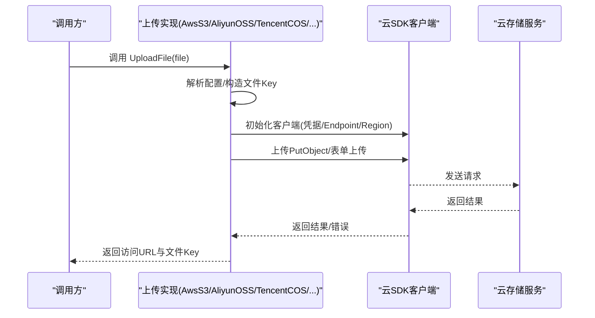

图表来源
- [server/utils/upload/aws_s3.go:86-114](file://server/utils/upload/aws_s3.go#L86-L114)
- [server/utils/upload/aliyun_oss.go:61-75](file://server/utils/upload/aliyun_oss.go#L61-L75)
- [server/utils/upload/tencent_cos.go:50-61](file://server/utils/upload/tencent_cos.go#L50-L61)
- [server/utils/upload/qiniu.go:78-96](file://server/utils/upload/qiniu.go#L78-L96)
- [server/utils/upload/obs.go:15-17](file://server/utils/upload/obs.go#L15-L17)
- [server/utils/upload/cloudflare_r2.go:70-85](file://server/utils/upload/cloudflare_r2.go#L70-L85)
- [server/utils/upload/minio_oss.go:28-53](file://server/utils/upload/minio_oss.go#L28-L53)

## 详细组件分析

### AWS S3 集成
- 配置要点：桶名、区域、Endpoint、密钥、BaseURL、路径前缀、强制 PathStyle、禁用 SSL。
- 客户端初始化：使用静态凭证与可选自定义 Endpoint；支持 S3ForcePathStyle。
- 上传流程：生成时间戳+原文件名作为 Key；设置 Content-Type；返回 BaseURL + Key。
- 删除流程：删除对象后使用 Waiter 确认对象不存在。
- URL 生成：基于 BaseURL 与 PathPrefix 拼接公开访问链接。

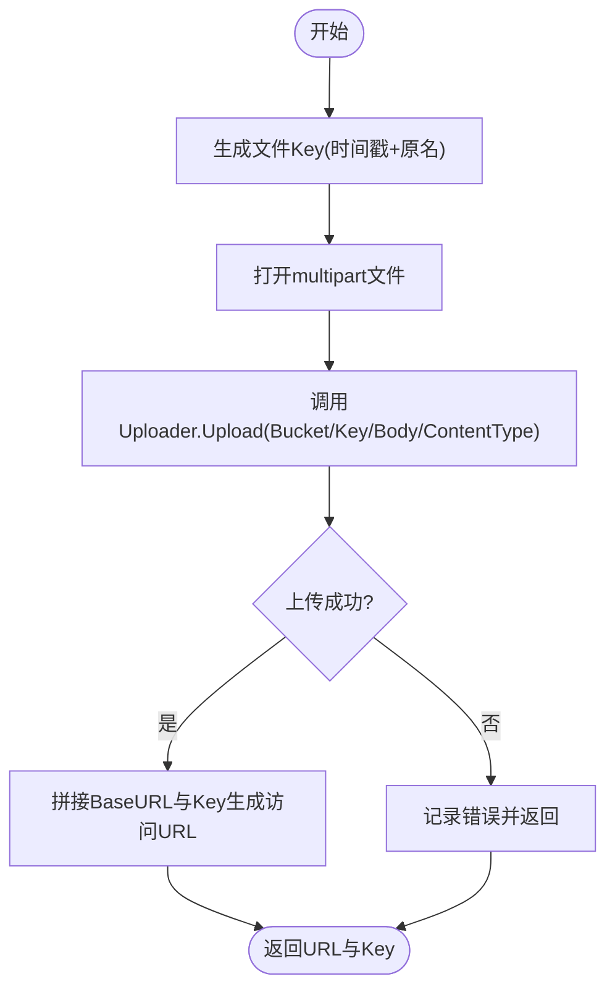

图表来源
- [server/utils/upload/aws_s3.go:29-54](file://server/utils/upload/aws_s3.go#L29-L54)
- [server/utils/upload/aws_s3.go:63-84](file://server/utils/upload/aws_s3.go#L63-L84)
- [server/utils/upload/aws_s3.go:86-114](file://server/utils/upload/aws_s3.go#L86-L114)

章节来源
- [server/config/oss_aws.go:1-14](file://server/config/oss_aws.go#L1-L14)
- [server/utils/upload/aws_s3.go:29-84](file://server/utils/upload/aws_s3.go#L29-L84)

### 阿里云 OSS 集成
- 配置要点：Endpoint、AccessKeyId/Secret、BucketName、BucketUrl、BasePath。
- 客户端初始化：创建 OSSClient 并获取 Bucket。
- 上传流程：以 BasePath + “uploads/日期/原文件名” 形式保存；返回 BucketUrl + Key。
- 删除流程：直接删除对象。

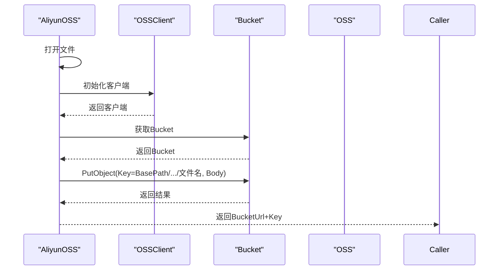

图表来源
- [server/utils/upload/aliyun_oss.go:15-41](file://server/utils/upload/aliyun_oss.go#L15-L41)
- [server/utils/upload/aliyun_oss.go:61-75](file://server/utils/upload/aliyun_oss.go#L61-L75)

章节来源
- [server/config/oss_aliyun.go:1-11](file://server/config/oss_aliyun.go#L1-L11)
- [server/utils/upload/aliyun_oss.go:15-75](file://server/utils/upload/aliyun_oss.go#L15-L75)

### 腾讯云 COS 集成
- 配置要点：Bucket、Region、SecretID/SecretKey、BaseURL、PathPrefix。
- 客户端初始化：构造 BucketURL 并使用 AuthorizationTransport。
- 上传流程：生成时间戳+原文件名作为 Key；返回 BaseURL + PathPrefix + Key。
- 删除流程：删除指定对象。

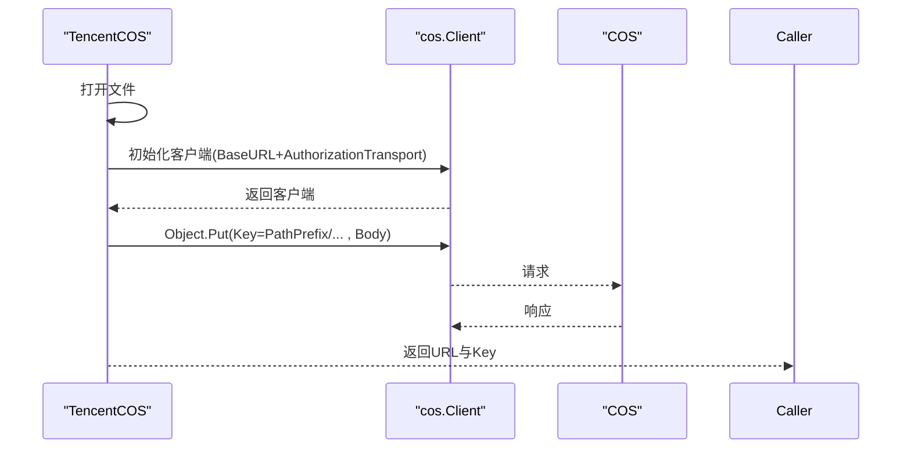

图表来源
- [server/utils/upload/tencent_cos.go:21-36](file://server/utils/upload/tencent_cos.go#L21-L36)
- [server/utils/upload/tencent_cos.go:50-61](file://server/utils/upload/tencent_cos.go#L50-L61)

章节来源
- [server/config/oss_tencent.go:1-11](file://server/config/oss_tencent.go#L1-L11)
- [server/utils/upload/tencent_cos.go:21-48](file://server/utils/upload/tencent_cos.go#L21-L48)

### 七牛云存储集成
- 配置要点：Zone、Bucket、ImgPath、AccessKey/SecretKey、UseHTTPS、UseCdnDomains。
- 客户端初始化：根据 Zone 选择机房，设置 UseHTTPS/UseCdnDomains。
- 上传流程：生成上传 Token；使用 FormUploader Put；返回 ImgPath + Key。
- 删除流程：通过 BucketManager 删除对象。

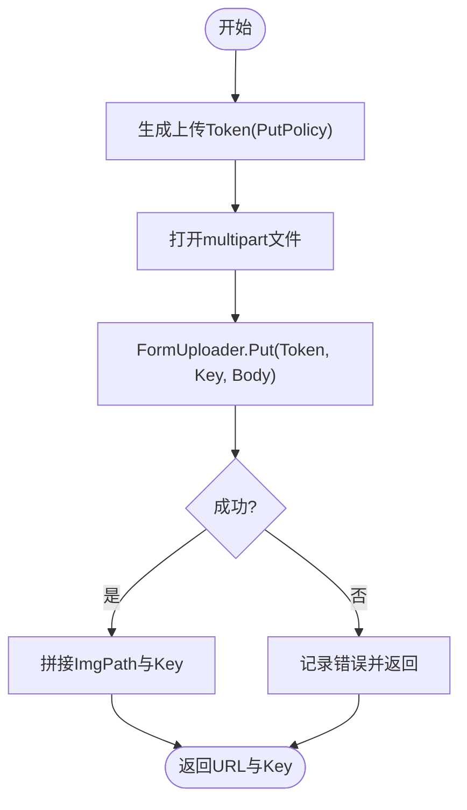

图表来源
- [server/utils/upload/qiniu.go:27-50](file://server/utils/upload/qiniu.go#L27-L50)
- [server/utils/upload/qiniu.go:78-96](file://server/utils/upload/qiniu.go#L78-L96)

章节来源
- [server/config/oss_qiniu.go:1-12](file://server/config/oss_qiniu.go#L1-L12)
- [server/utils/upload/qiniu.go:27-70](file://server/utils/upload/qiniu.go#L27-L70)

### 华为 OBS 集成
- 配置要点：Path、Bucket、Endpoint、AccessKey/SecretKey。
- 客户端初始化：使用 AccessKey/SecretKey/Endpoint 创建 ObsClient。
- 上传流程：构造 PutObjectInput，设置 ContentType；返回 Path + Key。
- 删除流程：DeleteObject 删除指定 Key。

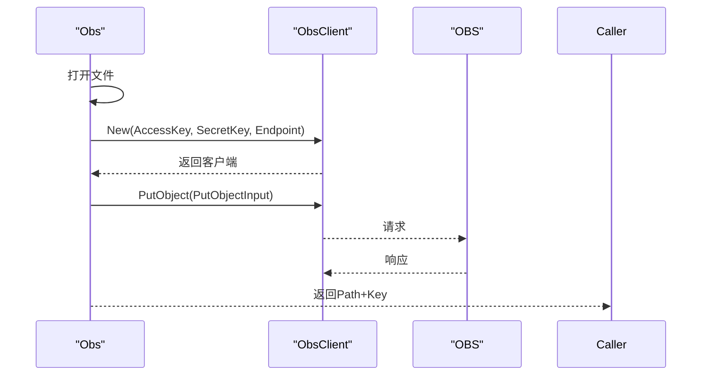

图表来源
- [server/utils/upload/obs.go:19-52](file://server/utils/upload/obs.go#L19-L52)
- [server/utils/upload/obs.go:15-17](file://server/utils/upload/obs.go#L15-L17)

章节来源
- [server/config/oss_huawei.go:1-10](file://server/config/oss_huawei.go#L1-L10)
- [server/utils/upload/obs.go:19-69](file://server/utils/upload/obs.go#L19-L69)

### Cloudflare R2 集成
- 配置要点：Bucket、BaseURL、Path、AccountID、AccessKeyID/SecretAccessKey。
- 客户端初始化：使用静态凭证与自定义 Endpoint（r2.cloudflarestorage.com）。
- 上传流程：生成 Key（时间戳+原名），返回 BaseURL + Key。
- 删除流程：删除对象并等待对象不存在。

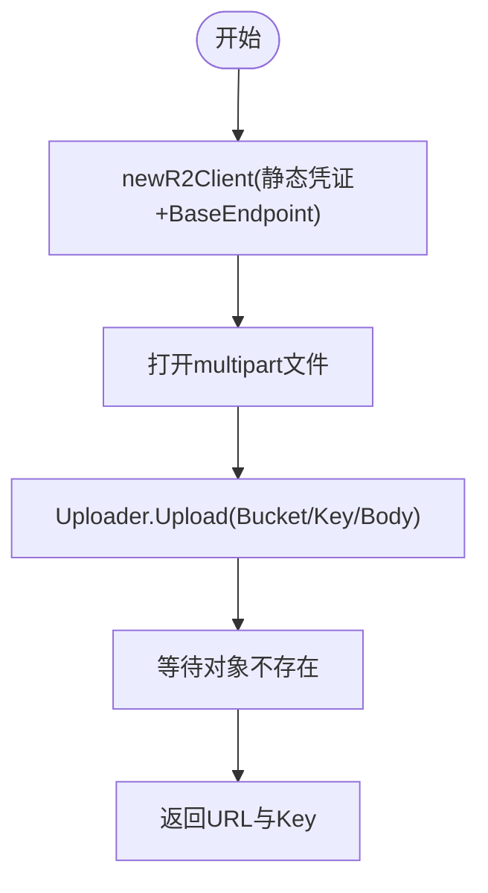

图表来源
- [server/utils/upload/cloudflare_r2.go:21-45](file://server/utils/upload/cloudflare_r2.go#L21-L45)
- [server/utils/upload/cloudflare_r2.go:70-85](file://server/utils/upload/cloudflare_r2.go#L70-L85)

章节来源
- [server/config/oss_cloudflare.go:1-11](file://server/config/oss_cloudflare.go#L1-L11)
- [server/utils/upload/cloudflare_r2.go:21-68](file://server/utils/upload/cloudflare_r2.go#L21-L68)

### MinIO 集成
- 配置要点：Endpoint、AccessKeyId/Secret、BucketName、UseSSL、BasePath、BucketUrl。
- 客户端初始化：静态凭证 + Secure 选项；首次尝试创建 Bucket。
- 上传流程：将 multipart 文件读入内存缓冲；生成 Key（BasePath 或默认 uploads/日期/md5.ext）；设置 Content-Type；返回 BucketUrl + Key。
- 删除流程：RemoveObject 删除指定 Key。
- 特性：全局单例缓存 MinioClient，避免重复初始化。

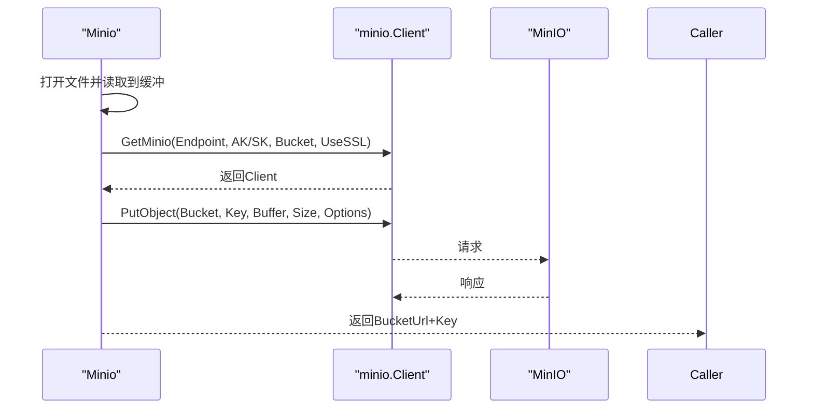

图表来源
- [server/utils/upload/minio_oss.go:28-53](file://server/utils/upload/minio_oss.go#L28-L53)
- [server/utils/upload/minio_oss.go:55-97](file://server/utils/upload/minio_oss.go#L55-L97)

章节来源
- [server/config/oss_minio.go:1-12](file://server/config/oss_minio.go#L1-L12)
- [server/utils/upload/minio_oss.go:21-107](file://server/utils/upload/minio_oss.go#L21-L107)

### 本地存储
- 配置要点：StorePath、Path（对外访问路径前缀）。
- 上传流程：创建目录；生成加密文件名；写入磁盘；返回对外访问 URL。
- 删除流程：加锁、校验 Key 合法性、检查文件存在后删除。

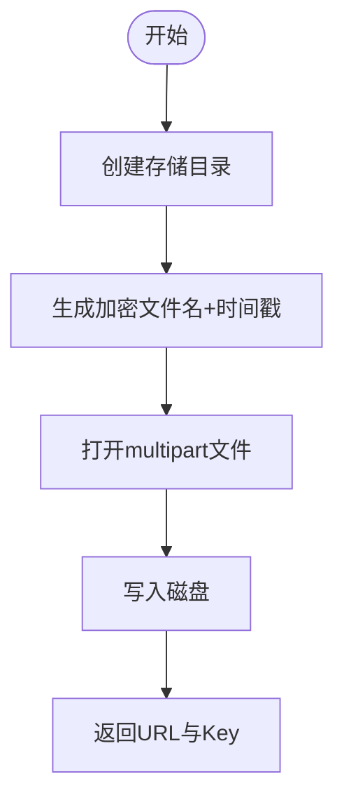

图表来源
- [server/utils/upload/local.go:31-69](file://server/utils/upload/local.go#L31-L69)
- [server/utils/upload/local.go:81-109](file://server/utils/upload/local.go#L81-L109)

章节来源
- [server/utils/upload/local.go:18-110](file://server/utils/upload/local.go#L18-L110)

## 依赖分析
- 配置到实现的耦合：各实现均通过 global.GVA_CONFIG 读取对应配置结构体，降低外部环境差异对实现的影响。
- SDK 适配：AWS/MinIO/R2 使用 S3 兼容接口；OSS/COS/Qiniu/OBS 使用各自官方 SDK。
- 错误传播：统一记录 zap 日志并返回带上下文的错误，便于上层捕获与处理。

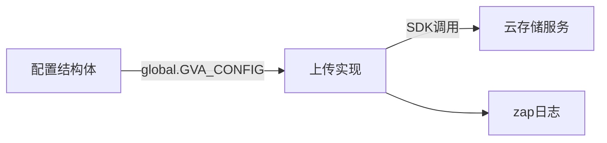

图表来源
- [server/utils/upload/aws_s3.go:3,86-114](file://server/utils/upload/aws_s3.go#L3,L86-L114)
- [server/utils/upload/minio_oss.go:14,28-53](file://server/utils/upload/minio_oss.go#L14,L28-L53)
- [server/utils/upload/qiniu.go:10,78-96](file://server/utils/upload/qiniu.go#L10,L78-L96)

章节来源
- [server/utils/upload/aws_s3.go:3-18](file://server/utils/upload/aws_s3.go#L3-L18)
- [server/utils/upload/minio_oss.go:14-19](file://server/utils/upload/minio_oss.go#L14-L19)
- [server/utils/upload/qiniu.go:3-14](file://server/utils/upload/qiniu.go#L3-L14)

## 性能考量
- 连接复用与缓存
  - MinIO 实现采用全局单例缓存客户端，减少重复初始化开销。
- 上传策略
  - AWS/MinIO/R2 使用 Uploader 自动处理大文件分片；未见显式断点续传实现。
- 超时控制
  - MinIO 上传设置较长超时（10 分钟）以适配大文件。
- 内容类型
  - MinIO 显式推断 MIME 类型，避免默认流类型导致的兼容问题。
- URL 生成
  - 各实现直接拼接 BaseURL/PathPrefix/BucketUrl，避免额外请求。

章节来源
- [server/utils/upload/minio_oss.go:21,87-96](file://server/utils/upload/minio_oss.go#L21,L87-L96)
- [server/utils/upload/aws_s3.go:30-54](file://server/utils/upload/aws_s3.go#L30-L54)
- [server/utils/upload/cloudflare_r2.go:21-45](file://server/utils/upload/cloudflare_r2.go#L21-L45)

## 故障排查指南
- 常见错误来源
  - 文件打开失败：检查文件句柄与磁盘权限。
  - 客户端初始化失败：核对 Endpoint/Region/凭据是否正确。
  - 上传失败：查看 SDK 返回的错误码与网络状态。
  - 删除失败：确认 Key 是否包含路径前缀；检查权限与对象是否存在。
- 日志定位
  - 所有关键路径均记录 zap 日志，便于快速定位失败节点。
- 等待与确认
  - AWS/R2 在删除后使用 Waiter 确认对象不存在，有助于幂等性保障。

章节来源
- [server/utils/upload/aws_s3.go:37-50](file://server/utils/upload/aws_s3.go#L37-L50)
- [server/utils/upload/aliyun_oss.go:18-40](file://server/utils/upload/aliyun_oss.go#L18-L40)
- [server/utils/upload/tencent_cos.go:25-35](file://server/utils/upload/tencent_cos.go#L25-L35)
- [server/utils/upload/qiniu.go:38-48](file://server/utils/upload/qiniu.go#L38-L48)
- [server/utils/upload/obs.go:43-49](file://server/utils/upload/obs.go#L43-L49)
- [server/utils/upload/cloudflare_r2.go:40-42](file://server/utils/upload/cloudflare_r2.go#L40-L42)
- [server/utils/upload/minio_oss.go:59-95](file://server/utils/upload/minio_oss.go#L59-L95)
- [server/utils/upload/local.go:50-68](file://server/utils/upload/local.go#L50-L68)

## 结论
本项目通过“配置 + 实现”的清晰分层，实现了多云存储的统一接入与一致行为（上传/删除/URL 生成）。各云厂商在认证、Endpoint/Region、SDK 适配与 URL 生成方面存在差异，但均遵循相同的错误处理与日志记录规范。对于高级特性（预签名/CDN/跨域/版本/生命周期），可在现有实现基础上扩展相应 SDK 能力或引入中间层封装。

## 附录

### 通用功能清单与实现映射
- 文件上传
  - AWS S3、阿里云 OSS、腾讯云 COS、七牛云、华为 OBS、Cloudflare R2、MinIO、本地存储均实现 UploadFile。
- 文件删除
  - AWS S3、腾讯云 COS、七牛云、华为 OBS、Cloudflare R2、MinIO、本地存储均实现 DeleteFile。
- 访问 URL 生成
  - 除 MinIO 与本地存储外，其余均通过 BaseURL/PathPrefix/BucketUrl 拼接公开访问 URL。
- 批量操作
  - 当前实现未提供批量上传/删除封装，建议在上层业务中循环调用或新增批量工具函数。

章节来源
- [server/utils/upload/aws_s3.go:29-84](file://server/utils/upload/aws_s3.go#L29-L84)
- [server/utils/upload/aliyun_oss.go:15-59](file://server/utils/upload/aliyun_oss.go#L15-L59)
- [server/utils/upload/tencent_cos.go:21-48](file://server/utils/upload/tencent_cos.go#L21-L48)
- [server/utils/upload/qiniu.go:27-70](file://server/utils/upload/qiniu.go#L27-L70)
- [server/utils/upload/obs.go:19-69](file://server/utils/upload/obs.go#L19-L69)
- [server/utils/upload/cloudflare_r2.go:21-68](file://server/utils/upload/cloudflare_r2.go#L21-L68)
- [server/utils/upload/minio_oss.go:55-107](file://server/utils/upload/minio_oss.go#L55-L107)
- [server/utils/upload/local.go:31-109](file://server/utils/upload/local.go#L31-L109)

### 高级特性与扩展建议
- 预签名 URL
  - AWS/MinIO/R2 可通过 SDK 提供的 Presign 能力生成临时访问链接；建议封装为统一方法。
- CDN 加速
  - 七牛已内置 UseCdnDomains；其他云可通过各自 CDN 服务与自定义 BaseURL 实现。
- 跨域配置
  - 各云存储服务的 CORS 配置需在控制台或 API 中设置，与 BaseURL/PathPrefix 保持一致。
- 版本控制与生命周期
  - 建议在云存储侧开启版本与生命周期规则，结合访问策略降低长期存储成本。
- 成本优化
  - 选择合适存储类别（低频/归档）；利用 CDN 与边缘缓存；压缩与转码在上传后异步处理。

### 安全与合规
- 凭证管理
  - 建议使用只读/最小权限的密钥；定期轮换；避免硬编码在配置文件中。
- 传输安全
  - 默认启用 HTTPS；禁止明文传输；TLS 版本与套件按企业策略配置。
- 审计与监控
  - 启用访问日志与操作审计；结合日志分析与告警。