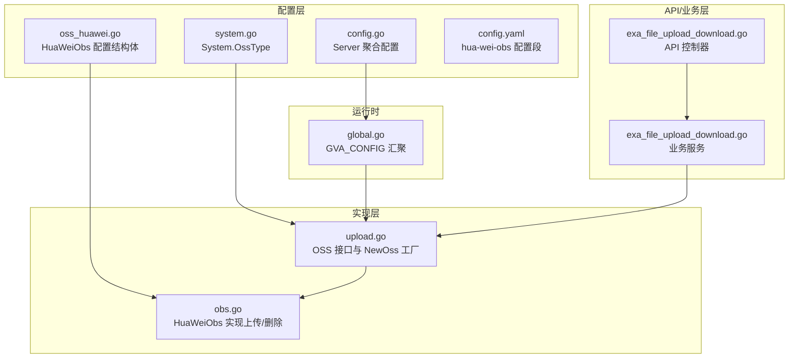
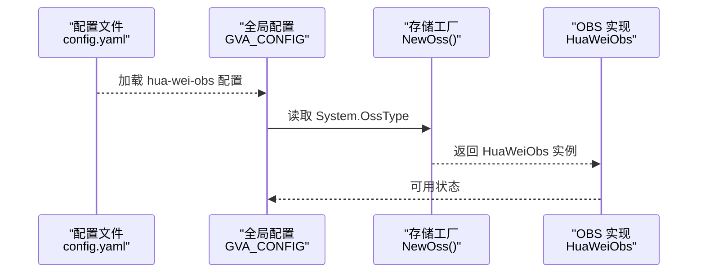
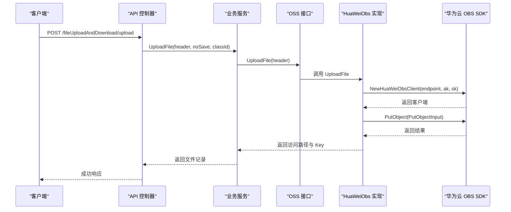
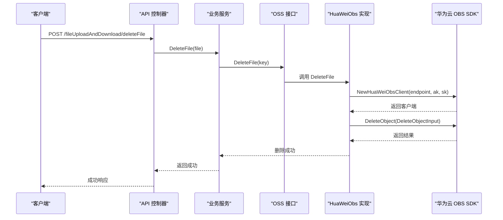
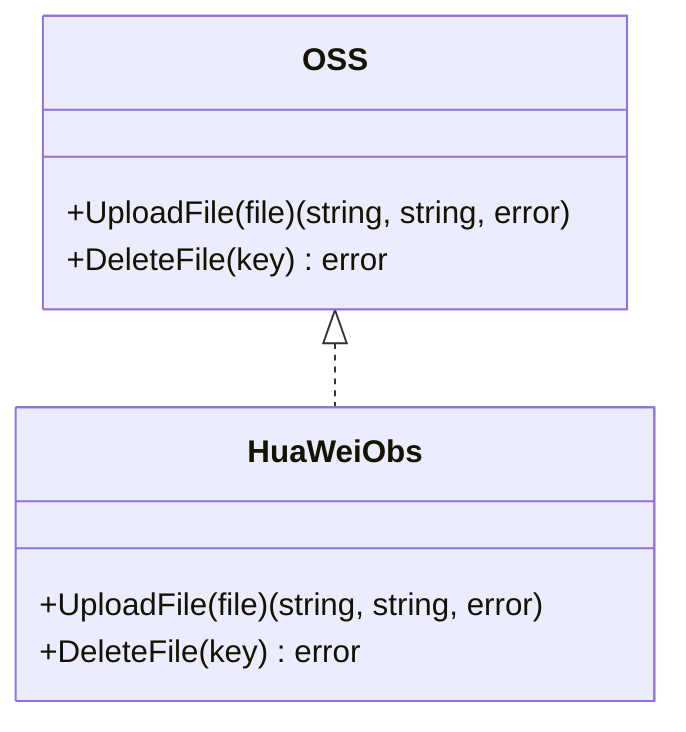

# 华为云 OBS 集成

<cite>
**本文档引用的文件**
- [server/config/oss_huawei.go](file://server/config/oss_huawei.go)
- [server/config/config.go](file://server/config/config.go)
- [server/config/system.go](file://server/config/system.go)
- [server/config.yaml](file://server/config.yaml)
- [server/utils/upload/upload.go](file://server/utils/upload/upload.go)
- [server/utils/upload/obs.go](file://server/utils/upload/obs.go)
- [server/service/example/exa_file_upload_download.go](file://server/service/example/exa_file_upload_download.go)
- [server/api/v1/example/exa_file_upload_download.go](file://server/api/v1/example/exa_file_upload_download.go)
- [server/global/global.go](file://server/global/global.go)
- [server/docs/swagger.yaml](file://server/docs/swagger.yaml)
- [repowiki/zh/content/后端系统/文件存储系统/存储配置管理.md](file://repowiki/zh/content/后端系统/文件存储系统/存储配置管理.md)
- [repowiki/zh/content/后端系统/文件存储系统/其他云存储.md](file://repowiki/zh/content/后端系统/文件存储系统/其他云存储.md)
</cite>

## 目录
1. [简介](#简介)
2. [项目结构](#项目结构)
3. [核心组件](#核心组件)
4. [架构总览](#架构总览)
5. [详细组件分析](#详细组件分析)
6. [依赖关系分析](#依赖关系分析)
7. [性能考虑](#性能考虑)
8. [故障排除指南](#故障排除指南)
9. [结论](#结论)
10. [附录](#附录)

## 简介
本文件系统性阐述华为云 OBS（对象存储服务）在 Gin-Vue-Admin 项目中的集成实现，涵盖客户端配置、认证机制、连接参数设置、文件上传与删除操作、配置项说明、错误处理策略、性能优化建议与安全配置指南。当前仓库实现了基于华为云官方 Go SDK 的 OBS 客户端封装，支持普通上传与对象删除，并通过统一的 OSS 接口与工厂函数实现多存储后端的可插拔切换。

## 项目结构
围绕华为云 OBS 的配置与实现主要分布在以下位置：
- 配置层：server/config 下的 HuaWeiObs 结构体定义与全局配置聚合
- 实现层：server/utils/upload 下的 OBS 适配器与 OSS 接口
- 统一入口：server/utils/upload/upload.go 中的 OSS 接口与工厂函数
- 运行时配置：server/global/global.go 汇聚全局配置
- API 层：server/api/v1/example/exa_file_upload_download.go 提供文件上传与删除接口
- 业务层：server/service/example/exa_file_upload_download.go 调用 OSS 实现并持久化记录

**图表来源**
- [server/config/oss_huawei.go:1-10](file://server/config/oss_huawei.go#L1-L10)
- [server/config/config.go:21-30](file://server/config/config.go#L21-L30)
- [server/config/system.go:3-16](file://server/config/system.go#L3-L16)
- [server/config.yaml:248-255](file://server/config.yaml#L248-L255)
- [server/utils/upload/upload.go:17-46](file://server/utils/upload/upload.go#L17-L46)
- [server/utils/upload/obs.go:11-70](file://server/utils/upload/obs.go#L11-L70)
- [server/global/global.go:25-42](file://server/global/global.go#L25-L42)
- [server/api/v1/example/exa_file_upload_download.go:16-42](file://server/api/v1/example/exa_file_upload_download.go#L16-L42)
- [server/service/example/exa_file_upload_download.go:96-120](file://server/service/example/exa_file_upload_download.go#L96-L120)

**章节来源**
- [server/config/oss_huawei.go:1-10](file://server/config/oss_huawei.go#L1-L10)
- [server/config/config.go:21-30](file://server/config/config.go#L21-L30)
- [server/config/system.go:3-16](file://server/config/system.go#L3-L16)
- [server/config.yaml:248-255](file://server/config.yaml#L248-L255)
- [server/utils/upload/upload.go:17-46](file://server/utils/upload/upload.go#L17-L46)
- [server/utils/upload/obs.go:11-70](file://server/utils/upload/obs.go#L11-L70)
- [server/global/global.go:25-42](file://server/global/global.go#L25-L42)
- [server/api/v1/example/exa_file_upload_download.go:16-42](file://server/api/v1/example/exa_file_upload_download.go#L16-L42)
- [server/service/example/exa_file_upload_download.go:96-120](file://server/service/example/exa_file_upload_download.go#L96-L120)

## 核心组件
- HuaWeiObs 配置结构体：定义 OBS 的 path、bucket、endpoint、access-key、secret-key 等关键参数
- OSS 接口与工厂函数：统一抽象上传与删除能力，并根据系统配置选择具体实现
- HuaWeiObs 实现：基于华为云官方 SDK 封装上传与删除操作
- 全局配置：通过 Viper 加载 config.yaml 并汇聚到全局变量，供运行时使用
- API/业务层：提供文件上传与删除接口，调用 OSS 实现并持久化记录

**章节来源**
- [server/config/oss_huawei.go:3-9](file://server/config/oss_huawei.go#L3-L9)
- [server/utils/upload/upload.go:12-15](file://server/utils/upload/upload.go#L12-L15)
- [server/utils/upload/upload.go:20-31](file://server/utils/upload/upload.go#L20-L31)
- [server/utils/upload/obs.go:11-70](file://server/utils/upload/obs.go#L11-L70)
- [server/global/global.go:31](file://server/global/global.go#L31)
- [server/api/v1/example/exa_file_upload_download.go:16-42](file://server/api/v1/example/exa_file_upload_download.go#L16-L42)
- [server/service/example/exa_file_upload_download.go:96-120](file://server/service/example/exa_file_upload_download.go#L96-L120)

## 架构总览
系统采用“配置驱动 + 多后端适配”的架构，运行时根据系统配置中的 OssType 选择对应存储实现。当 OssType 为 huawei-obs 时，NewOss 返回 HuaWeiObs 实例，从而在上传与删除流程中使用华为云 OBS SDK。

**图表来源**
- [server/config.yaml:78](file://server/config.yaml#L78)
- [server/utils/upload/upload.go:20-31](file://server/utils/upload/upload.go#L20-L31)
- [server/utils/upload/obs.go:11](file://server/utils/upload/obs.go#L11)

**章节来源**
- [server/config.yaml:78](file://server/config.yaml#L78)
- [server/utils/upload/upload.go:20-31](file://server/utils/upload/upload.go#L20-L31)
- [server/utils/upload/obs.go:11](file://server/utils/upload/obs.go#L11)

## 详细组件分析

### 配置模型与字段说明
- 全局配置聚合（Server）：包含系统、数据库、缓存、日志、邮件、Excel、跨域、MCP 以及各类存储后端配置
- 华为云 OBS（HuaWeiObs）：path、bucket、endpoint、access-key、secret-key
- 系统配置（System）：oss-type 控制运行时选择的存储实现

字段与默认值（来自配置文件）：
- oss-type 默认为 local，当设置为 huawei-obs 时启用 OBS 实现
- 各后端均提供默认占位值，需按实际后端替换
- path 用于拼接访问路径，bucket 与 endpoint 为 OBS 连接必需参数

**章节来源**
- [server/config/config.go:21-30](file://server/config/config.go#L21-L30)
- [server/config/oss_huawei.go:3-9](file://server/config/oss_huawei.go#L3-L9)
- [server/config/system.go:5](file://server/config/system.go#L5)
- [server/config.yaml:248-255](file://server/config.yaml#L248-L255)
- [repowiki/zh/content/后端系统/文件存储系统/存储配置管理.md:100-119](file://repowiki/zh/content/后端系统/文件存储系统/存储配置管理.md#L100-L119)

### 客户端配置与认证机制
- 客户端初始化：通过 AccessKey 与 SecretKey 在指定 Endpoint 创建 OBS 客户端
- Bucket 与 Key：上传时使用配置中的 bucket 作为目标桶，Key 为文件名
- 内容类型：从 multipart 请求头提取 Content-Type 设置到 PutObject 请求

**章节来源**
- [server/utils/upload/obs.go:15-17](file://server/utils/upload/obs.go#L15-L17)
- [server/utils/upload/obs.go:27-38](file://server/utils/upload/obs.go#L27-L38)

### 文件上传流程
普通上传流程如下：

**图表来源**
- [server/api/v1/example/exa_file_upload_download.go:25-41](file://server/api/v1/example/exa_file_upload_download.go#L25-L41)
- [server/service/example/exa_file_upload_download.go:96-120](file://server/service/example/exa_file_upload_download.go#L96-L120)
- [server/utils/upload/upload.go:20-31](file://server/utils/upload/upload.go#L20-L31)
- [server/utils/upload/obs.go:19-52](file://server/utils/upload/obs.go#L19-L52)

**章节来源**
- [server/api/v1/example/exa_file_upload_download.go:25-41](file://server/api/v1/example/exa_file_upload_download.go#L25-L41)
- [server/service/example/exa_file_upload_download.go:96-120](file://server/service/example/exa_file_upload_download.go#L96-L120)
- [server/utils/upload/upload.go:20-31](file://server/utils/upload/upload.go#L20-L31)
- [server/utils/upload/obs.go:19-52](file://server/utils/upload/obs.go#L19-L52)

### 文件删除流程
删除流程如下：

**图表来源**
- [server/api/v1/example/exa_file_upload_download.go:69-81](file://server/api/v1/example/exa_file_upload_download.go#L69-L81)
- [server/service/example/exa_file_upload_download.go:43-54](file://server/service/example/exa_file_upload_download.go#L43-L54)
- [server/utils/upload/upload.go:20-31](file://server/utils/upload/upload.go#L20-L31)
- [server/utils/upload/obs.go:54-69](file://server/utils/upload/obs.go#L54-L69)

**章节来源**
- [server/api/v1/example/exa_file_upload_download.go:69-81](file://server/api/v1/example/exa_file_upload_download.go#L69-L81)
- [server/service/example/exa_file_upload_download.go:43-54](file://server/service/example/exa_file_upload_download.go#L43-L54)
- [server/utils/upload/upload.go:20-31](file://server/utils/upload/upload.go#L20-L31)
- [server/utils/upload/obs.go:54-69](file://server/utils/upload/obs.go#L54-L69)

### 分片上传与断点续传
当前 OBS 实现仅支持普通上传与删除，未实现分片上传与断点续传功能。若需实现分片上传与断点续传，可在现有 HuaWeiObs 实现基础上扩展，参考华为云 OBS SDK 的分片上传接口进行二次开发。

**章节来源**
- [server/utils/upload/obs.go:19-52](file://server/utils/upload/obs.go#L19-L52)

### 元数据与访问权限
- 元数据：当前实现未显式设置或获取对象元数据
- 访问权限：当前实现未显式设置对象 ACL 或访问策略

如需扩展元数据与权限控制，可在 PutObjectInput 中设置相应头部或调用相关 API 进行权限配置。

**章节来源**
- [server/utils/upload/obs.go:27-38](file://server/utils/upload/obs.go#L27-L38)

### 高级功能（待扩展）
- 数据加密：可通过服务端加密或客户端加密策略实现
- 版本控制：可在桶级别启用版本控制
- 生命周期管理：可配置对象过期与归档策略

以上功能需结合华为云 OBS 控制台或 SDK 进行配置与实现。

## 依赖关系分析
OSS 接口与各实现之间的依赖关系如下：

**图表来源**
- [server/utils/upload/upload.go:12-15](file://server/utils/upload/upload.go#L12-L15)
- [server/utils/upload/obs.go:13](file://server/utils/upload/obs.go#L13)

**章节来源**
- [server/utils/upload/upload.go:12-15](file://server/utils/upload/upload.go#L12-L15)
- [server/utils/upload/obs.go:13](file://server/utils/upload/obs.go#L13)

## 性能考虑
- 连接复用：建议在高并发场景下对 OBS 客户端进行连接池化与复用
- 上传优化：对于大文件，可考虑分片上传与并发上传以提升吞吐量
- 错误重试：对网络抖动与临时错误进行指数退避重试
- 超时设置：合理设置连接超时与读写超时，避免长时间阻塞
- 日志采样：在高负载场景下降低日志级别或采样，减少 I/O 压力

## 故障排除指南
常见问题与排查步骤：
- 凭证错误：确认 AccessKey 与 SecretKey 是否正确，是否具备相应权限
- Endpoint 不可达：验证 Endpoint 是否正确且可访问
- Bucket 不存在：确认目标 Bucket 是否存在且名称正确
- 网络超时：检查网络连通性与防火墙策略
- 权限不足：确认 IAM 策略是否允许 PutObject/DeleteObject 操作

错误处理策略：
- 包装底层错误并返回统一格式
- 记录详细日志以便定位问题
- 对可恢复错误进行重试，对不可恢复错误直接返回

**章节来源**
- [server/utils/upload/obs.go:42-49](file://server/utils/upload/obs.go#L42-L49)
- [server/utils/upload/obs.go:57-67](file://server/utils/upload/obs.go#L57-L67)

## 结论
本项目已实现华为云 OBS 的基础集成，支持普通上传与删除，并通过统一的 OSS 接口与工厂函数实现多存储后端的可插拔切换。当前实现未包含分片上传、断点续传、元数据与访问权限控制等高级功能，后续可根据业务需求扩展。建议在生产环境中完善错误处理、性能优化与安全配置，确保系统的稳定性与安全性。

## 附录

### 配置模板
- 系统配置（选择 OBS）：将 oss-type 设置为 huawei-obs
- OBS 配置段：填写 path、bucket、endpoint、access-key、secret-key

**章节来源**
- [server/config.yaml:78](file://server/config.yaml#L78)
- [server/config.yaml:248-255](file://server/config.yaml#L248-L255)

### Swagger 配置说明
Swagger 文档中包含 HuaWeiObs 的字段定义，便于前端与测试工具使用。

**章节来源**
- [server/docs/swagger.yaml:119-131](file://server/docs/swagger.yaml#L119-L131)